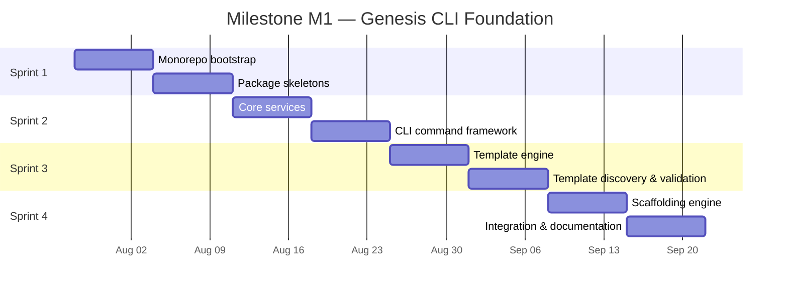

# Current Milestone

## Milestone M1 — Genesis CLI Foundation

| Attribute | Value |
|-----------|-------|
| **Phase** | 1 — Foundation |
| **Status** | In Progress |
| **Start date** | 2026-07-28 |
| **Target end date** | 2026-09-21 |
| **Roadmap reference** | [ROADMAP.md](ROADMAP.md) — Phase 1 |

## Objective

Deliver a functional Genesis CLI with core infrastructure services, a working template engine, and a scaffolding engine capable of generating project structures from templates. At the end of M1, a developer can run `genesis` commands to scaffold a new project skeleton.

## Success Criteria

| # | Criterion | Measurement |
|---|-----------|-------------|
| 1 | Monorepo builds and tests pass | `pnpm build && pnpm test` succeeds |
| 2 | CLI responds to `--version` and `--help` | Manual verification |
| 3 | Core services operational | Config loading, structured logging, and filesystem utilities have unit tests |
| 4 | Template engine renders files | A template with variables produces correct output files |
| 5 | Scaffolding engine generates a project | `genesis create` produces a directory structure from templates |
| 6 | Architecture validated | Package dependency graph matches [ARCHITECTURE.md](ARCHITECTURE.md) |
| 7 | Documentation current | PROJECT_STATUS, sprint docs, and package READMEs reflect delivered work |

## Deliverables

### Package Deliverables

| Package | M1 Scope | Sprint |
|---------|----------|--------|
| `packages/shared` | Types, constants, utilities | Sprint 1 |
| `packages/core` | Config, logging, filesystem services | Sprint 2 |
| `packages/cli` | Command framework, `--version`, `--help`, `create` command | Sprint 2–4 |
| `packages/template-engine` | Template discovery, variable substitution, rendering | Sprint 3 |
| `packages/scaffolding` | Project generation orchestration | Sprint 4 |
| `packages/ai` | Not in M1 scope | Phase 4 |

### Infrastructure Deliverables

| Deliverable | Sprint |
|-------------|--------|
| Root workspace (`package.json`, `pnpm-workspace.yaml`, `turbo.json`) | Sprint 1 |
| Biome configuration | Sprint 1 |
| Vitest configuration | Sprint 1 |
| Shared TypeScript configuration | Sprint 1 |
| CI pipeline (build, test, lint) | Sprint 2 |

## Sprint Plan

| Sprint | Dates | Focus | Status |
|--------|-------|-------|--------|
| Sprint 1 | 2026-07-28 → 2026-08-10 | Monorepo bootstrap and package skeletons | **Active** |
| Sprint 2 | 2026-08-11 → 2026-08-24 | Core services and CLI command framework | Planned |
| Sprint 3 | 2026-08-25 → 2026-09-07 | Template engine | Planned |
| Sprint 4 | 2026-09-08 → 2026-09-21 | Scaffolding engine and integration | Planned |

Active sprint details: [CURRENT_SPRINT.md](CURRENT_SPRINT.md).

## Dependencies

| Dependency | Status |
|------------|--------|
| Documentation-first bootstrap (ADR-007) | Complete |
| Governance documents | Complete |
| Engineering standards | Complete |
| Cursor AI operating system | Complete |
| ADR-005 (Turborepo Monorepo) | Accepted |
| ADR-006 (Biome) | Accepted |

## Out of Scope for M1

The following are explicitly deferred:

| Item | Deferred To |
|------|-------------|
| Plugin system implementation | Phase 2 |
| Production plugins (Unity, NestJS, AWS, Firebase) | Phase 2 |
| `packages/ai` implementation | Phase 4 |
| Game generation | Phase 3 |
| `framework/` and `engine/` runtime code | Post-M1 |
| `games/` directory population | Phase 3 |

See [CURRENT_STATE.md](CURRENT_STATE.md) for phase constraints.

## Risks and Mitigations

| Risk | Impact | Mitigation |
|------|--------|------------|
| Over-engineering the plugin contract before CLI works | Delays core delivery | Defer plugin system to Phase 2; design contract in Sprint 4 only |
| Template engine complexity | Blocks scaffolding | Start with simple variable substitution; iterate in Sprint 3 |
| Insufficient test coverage | Regression in later sprints | Enforce DoD test criteria from Sprint 1 |
| Scope creep into game features | Milestone slip | Phase constraints enforced in sprint planning |

## Progress Tracking

| Deliverable Area | Progress | Notes |
|----------------|----------|-------|
| Documentation & governance | 100% | Completed 2026-07-26 |
| Monorepo & tooling | 0% | Sprint 1 active task |
| Core packages | 0% | Sprint 1–2 |
| Template engine | 0% | Sprint 3 |
| Scaffolding engine | 0% | Sprint 4 |
| CI/CD | 0% | Sprint 2 |

Overall milestone progress updates in [PROJECT_STATUS.md](../../PROJECT_STATUS.md).

## Completion Actions

When M1 is complete:

1. Mark M1 as complete in [PROJECT_STATUS.md](../../PROJECT_STATUS.md)
2. Update [ROADMAP.md](ROADMAP.md) Phase 1 status
3. Define Milestone M2 (Plugin System) in this document
4. Plan Sprint 5 for plugin contract design
5. Update [`.cursor/memories/known-issues.md`](../memories/known-issues.md)

## Related Documents

- [CURRENT_SPRINT.md](CURRENT_SPRINT.md) — Active sprint
- [CURRENT_TASK.md](CURRENT_TASK.md) — Active engineering task
- [ARCHITECTURE.md](ARCHITECTURE.md) — Package architecture
- [DEFINITION_OF_DONE.md](DEFINITION_OF_DONE.md) — Completion criteria
- [DECISION_LOG.md](../../DECISION_LOG.md) — ADR-005, ADR-006, ADR-007

## Changelog

| Version | Date | Change |
|---------|------|--------|
| 1.0.0 | 2026-07-26 | Milestone M1 defined with 4-sprint plan |
