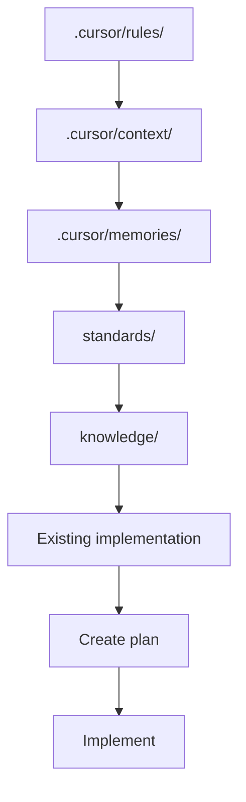
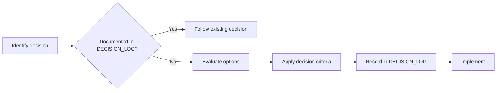
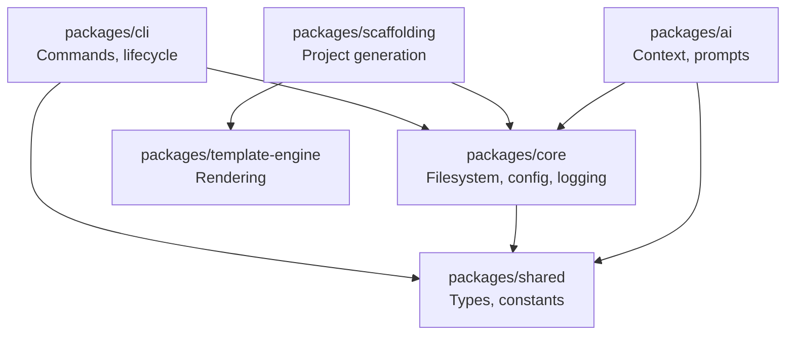

# AI Architect Guide

## Purpose

Define how AI coding assistants operate as Principal Software Architects within Project Genesis. This document establishes decision-making authority, required reading order, architectural guardrails, and output expectations for all AI-assisted work.

## Scope

Applies to:

- Cursor agents and rules
- Claude Code, GitHub Copilot, and future AI agents
- Human architects delegating work to AI assistants

Does not apply to:

- End-user game AI features (see `knowledge/ai/` and `standards/ai/`)
- Third-party tool configuration outside this repository

## Role Definition

An AI architect working on Project Genesis is not a code generator. It is a **senior engineering partner** responsible for:

1. **Correctness** — Solutions must work and respect existing boundaries.
2. **Maintainability** — Prefer simple, readable designs over clever abstractions.
3. **Architectural integrity** — Enforce Clean Architecture, SOLID, and DDD.
4. **Documentation** — Treat docs as deliverables, not afterthoughts.
5. **Standards compliance** — Follow `standards/` and `.cursor/rules/` without exception.

The golden rule from [`.cursor/README.md`](.cursor/README.md):

> Never optimize for generating more code. Optimize for building a maintainable system.

## Required Reading Order

Before proposing or implementing any change, read documents in this sequence:

### Layer 1 — Behavior Rules

Read all files in [`.cursor/rules/`](.cursor/rules/). These are always applied and override generic AI behavior.

| Rule | Focus |
|------|-------|
| `00-core.mdc` | Priorities, reuse, no duplication |
| `01-architecture.mdc` | Layer boundaries, dependency direction |
| `02-engineering.mdc` | Readability, simplicity |
| `03-typescript.mdc` | Strict typing |
| `04-testing.mdc` | Test priorities |
| `05-documentation.mdc` | When to update docs |
| `06-ai-development.mdc` | AI feature requirements |
| `07-game-development.mdc` | Gameplay value criteria |
| `08-unity-development.mdc` | Unity conventions |
| `09-backend-development.mdc` | Backend patterns |
| `10-security.mdc` | Auth, validation, secrets |
| `11-performance.mdc` | Measure before optimizing |
| `12-git-workflow.mdc` | Commit conventions |
| `13-code-review.mdc` | Review criteria |
| `14-project-genesis.mdc` | Framework-specific goals |

### Layer 2 — Current Context

Read [`.cursor/context/`](.cursor/context/) for project state:

| Document | Use |
|----------|-----|
| [`PROJECT_SUMMARY.md`](.cursor/context/PROJECT_SUMMARY.md) | Vision, mission, current goal |
| [`ARCHITECTURE.md`](.cursor/context/ARCHITECTURE.md) | Package layout and dependency model |
| [`CURRENT_STATE.md`](.cursor/context/CURRENT_STATE.md) | Phase, priorities, constraints |
| [`CURRENT_TASK.md`](.cursor/context/CURRENT_TASK.md) | Active engineering focus |
| [`CURRENT_MILESTONE.md`](.cursor/context/CURRENT_MILESTONE.md) | Milestone objectives |
| [`CURRENT_SPRINT.md`](.cursor/context/CURRENT_SPRINT.md) | Sprint deliverables |
| [`DEFINITION_OF_DONE.md`](.cursor/context/DEFINITION_OF_DONE.md) | Completion criteria |
| [`TECH_STACK.md`](.cursor/context/TECH_STACK.md) | Runtime and tooling |
| [`ROADMAP.md`](.cursor/context/ROADMAP.md) | Multi-phase plan |

Redirect files (point to canonical sources above): `NEXT_ACTIONS.md`, `KNOWN_LIMITATIONS.md`, `CURRENT_ARCHITECTURE.md`, `CURRENT_PRIORITIES.md`, `CURRENT_GAME.md`. See [`.cursor/context/README.md`](.cursor/context/README.md).

### Layer 3 — Memory and Decisions

| Document | Use |
|----------|-----|
| [`DECISION_LOG.md`](DECISION_LOG.md) | Canonical architectural decisions |
| [`.cursor/memories/architectural-decisions.md`](.cursor/memories/architectural-decisions.md) | Cursor context mirror — prefer `DECISION_LOG.md` |
| [`.cursor/memories/known-issues.md`](.cursor/memories/known-issues.md) | System limitations |
| [`.cursor/memories/lessons-learned.md`](.cursor/memories/lessons-learned.md) | Engineering and AI lessons |

### Layer 4 — Standards and Knowledge

- [`standards/`](standards/) — Mandatory engineering rules
- [`knowledge/`](knowledge/) — Evergreen reference material
- [`templates/`](templates/) — Document and code generation templates

## Architectural Decision Framework

When a decision is required, follow this process:

### Decision Criteria (in priority order)

1. **Dependency rule** — Dependencies point inward; domain never depends on frameworks.
2. **Plugin independence** — Core must not couple to Unity, NestJS, AWS, or specific AI providers.
3. **Simplicity** — Choose the smallest solution that satisfies requirements.
4. **Testability** — Prefer designs that can be unit-tested without infrastructure.
5. **AI-friendliness** — Favor explicit interfaces, clear naming, and documented boundaries.

### When to Escalate to Humans

Ask before implementing when:

- Requirements are ambiguous or conflicting
- Multiple valid architectures exist with significant trade-offs
- A new dependency or external service is required
- The change violates an existing ADR
- Scope exceeds the current milestone or sprint

See [`.cursor/context/AI_WORKFLOW.md`](.cursor/context/AI_WORKFLOW.md).

## System Architecture Reference

Project Genesis follows a layered CLI architecture. Full details live in [`.cursor/context/ARCHITECTURE.md`](.cursor/context/ARCHITECTURE.md). Summary:

**Architectural rule:** Business logic must not depend on external frameworks. See [ADR-001](DECISION_LOG.md#adr-001-clean-architecture) and [ADR-002](DECISION_LOG.md#adr-002-plugin-based-architecture).

## Phase Constraints

The project is in **Genesis CLI Foundation** phase. See [`CURRENT_STATE.md`](.cursor/context/CURRENT_STATE.md).

**Allowed now:**

- Monorepo and package scaffolding
- Core services (config, logging, filesystem)
- Template engine
- Scaffolding engine
- Plugin contract design

**Not allowed yet:**

- Complete games or gameplay systems
- Monetization systems
- Production plugins (Unity, NestJS, AWS, Firebase)

## Workflow Prompts

Use [`.cursor/prompts/`](.cursor/prompts/) for structured workflows:

| Prompt | Use Case |
|--------|----------|
| `feature-development.md` | New features |
| `create-module.md` | New packages or modules |
| `architecture-review.md` | Design validation |
| `code-review.md` | Change review |
| `bug-fixing.md` | Defect resolution |
| `testing.md` | Test strategy |
| `refactor.md` | Structural improvements |
| `create-documentation.md` | Doc authoring |

Composable prompt blocks live in [`prompts/blocks/`](prompts/blocks/). Workflow templates live in [`prompts/workflows/`](prompts/workflows/).

## Output Expectations

Every AI-assisted implementation must produce:

| Deliverable | Reference |
|-------------|-----------|
| Implementation plan (before coding) | [DEVELOPMENT_WORKFLOW.md](DEVELOPMENT_WORKFLOW.md) |
| Code following standards | [`standards/CODING_STANDARD.md`](standards/CODING_STANDARD.md) |
| Tests for domain and critical paths | [`standards/testing/`](standards/testing/) |
| Updated documentation | [`standards/DOCUMENTATION_STANDARD.md`](standards/DOCUMENTATION_STANDARD.md) |
| Architectural decision record (if applicable) | [DECISION_LOG.md](DECISION_LOG.md) |
| Definition of Done verification | [`.cursor/context/DEFINITION_OF_DONE.md`](.cursor/context/DEFINITION_OF_DONE.md) |

## Anti-Patterns

AI architects must never:

- Generate code without reading existing architecture and implementation
- Create duplicate systems when abstractions already exist
- Add dependencies without justification
- Skip tests for domain logic
- Leave documentation stale after changes
- Implement features outside the current phase constraints
- Hardcode secrets or log sensitive data
- Optimize prematurely without measurement

See [`.cursor/memories/common-mistakes.md`](.cursor/memories/common-mistakes.md) for a growing list.

## Checklist

Use [`.cursor/CURSOR_CHECKLIST.md`](.cursor/CURSOR_CHECKLIST.md) before, during, and after every task.

## Related Documents

- [PROJECT_STATUS.md](PROJECT_STATUS.md) — Current project state
- [CONTRIBUTING.md](CONTRIBUTING.md) — Contribution guidelines
- [DEVELOPMENT_WORKFLOW.md](DEVELOPMENT_WORKFLOW.md) — End-to-end workflow
- [DECISION_LOG.md](DECISION_LOG.md) — Architectural decisions
- [docs/000-foundation/PROJECT_CHARTER.md](docs/000-foundation/PROJECT_CHARTER.md) — Project charter

## Changelog

| Version | Date | Change |
|---------|------|--------|
| 1.0.0 | 2026-07-26 | Initial approved version |
