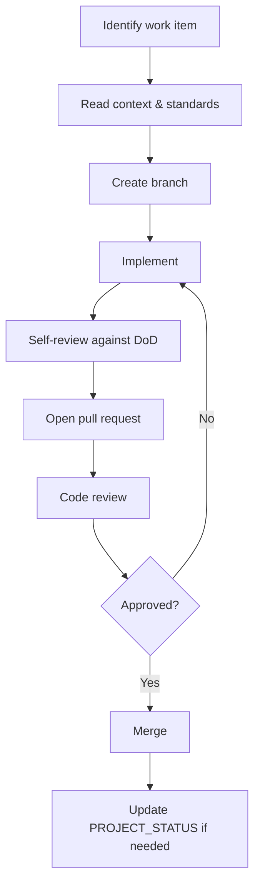

# Contributing to Project Genesis

## Purpose

Define how engineers and AI assistants contribute to Project Genesis with consistent quality, architectural integrity, and clear review expectations.

## Scope

Applies to all contributions: code, documentation, standards, templates, prompts, and knowledge base articles.

## Prerequisites

Before contributing, read:

1. [docs/000-foundation/PROJECT_CHARTER.md](docs/000-foundation/PROJECT_CHARTER.md) — Vision and principles
2. [governance/README.md](governance/README.md) — Governance model (PR, ADR, RFC, release, security)
3. [governance/AI_COLLABORATION.md](governance/AI_COLLABORATION.md) — Multi-AI assistant collaboration
4. [AI_ARCHITECT.md](AI_ARCHITECT.md) — AI assistant operating guide
4. [DEVELOPMENT_WORKFLOW.md](DEVELOPMENT_WORKFLOW.md) — End-to-end process
5. [`.cursor/context/DEFINITION_OF_DONE.md`](.cursor/context/DEFINITION_OF_DONE.md) — Completion criteria
6. [standards/README.md](standards/README.md) — Mandatory engineering rules

## Repository Structure

Understand where your contribution belongs before starting:

| Directory | Purpose | Contribution Type |
|-----------|---------|-------------------|
| `governance/` | Processes and policies (PR, ADR, RFC, release) | Governance docs |
| `docs/` | Official project documents (charter, vision) | Project docs |
| `knowledge/` | Evergreen engineering knowledge | Reference articles |
| `standards/` | Mandatory engineering rules | Standards |
| `templates/` | Generation templates for docs and code | Templates |
| `prompts/` | Composable AI prompt blocks and workflows | Prompts |
| `.cursor/` | AI operating system (rules, context, memories) | AI configuration |
| `packages/` | Runtime packages (CLI, core, etc.) | TypeScript code |
| `framework/` | Reusable game framework code | TypeScript/C# code |
| `engine/` | Core runtime abstractions | TypeScript/C# code |
| `games/` | Individual game projects | Game-specific code |

**Rule:** Games never modify the framework directly. See `games/README.md`.

## Getting Started

### Environment Requirements

| Tool | Version | Reference |
|------|---------|-----------|
| Node.js | 22.x | [TECH_STACK.md](.cursor/context/TECH_STACK.md) |
| pnpm | Latest stable | [ADR-005](DECISION_LOG.md#adr-005-turborepo-monorepo) |
| Git | 2.x+ | [GIT_STANDARD.md](standards/GIT_STANDARD.md) |

> The monorepo bootstrap is the first engineering deliverable. Setup instructions for `pnpm install` and `pnpm build` will be added to the root README when `package.json` exists.

### Workspace Validation

Verify the Cursor AI workspace is complete:

```bash
./scripts/check-cursor-workspace.sh
```

## Contribution Workflow



Full workflow details: [DEVELOPMENT_WORKFLOW.md](DEVELOPMENT_WORKFLOW.md). Process details: [governance/PULL_REQUEST_PROCESS.md](governance/PULL_REQUEST_PROCESS.md).

## Branching Strategy

Follow [governance/BRANCHING_STRATEGY.md](governance/BRANCHING_STRATEGY.md) and [standards/GIT_STANDARD.md](standards/GIT_STANDARD.md):

| Prefix | Use |
|--------|-----|
| `feature/` | New features or capabilities |
| `bugfix/` | Bug fixes |
| `hotfix/` | Urgent production fixes |
| `release/` | Release preparation |
| `docs/` | Documentation-only changes |

Branch from the default branch. Keep branches focused on a single concern.

## Commit Conventions

Use conventional commit prefixes:

| Prefix | Use |
|--------|-----|
| `feat:` | New feature |
| `fix:` | Bug fix |
| `docs:` | Documentation only |
| `test:` | Test additions or fixes |
| `refactor:` | Code restructuring without behavior change |
| `chore:` | Build, tooling, maintenance |

**Rules:**

- Keep commits focused and atomic
- Do not commit broken code
- Write commit messages that explain *why*, not just *what*

## Pull Request Guidelines

See [governance/PULL_REQUEST_PROCESS.md](governance/PULL_REQUEST_PROCESS.md) for the full PR lifecycle. Complete the **Quality Gates** table per [specs/000-project/QUALITY_GATES.md](specs/000-project/QUALITY_GATES.md).

### Before Opening a PR

- [ ] Changes align with current milestone and sprint scope
- [ ] All [Definition of Done](.cursor/context/DEFINITION_OF_DONE.md) criteria met
- [ ] No secrets, credentials, or sensitive data included
- [ ] Documentation updated for behavioral changes
- [ ] Tests added or updated for code changes
- [ ] Formatter and linter pass (Biome, when configured)

### PR Description

Use the template at [`templates/github/pull-request.md`](templates/github/pull-request.md). Include the mandatory Quality Gates table (see [specs/000-project/QUALITY_GATES.md](specs/000-project/QUALITY_GATES.md)):

1. **Summary** — What changed and why
2. **Quality Gates** — Documentation, tests, architecture, performance, security, breaking changes, technical debt
3. **Test plan** — How to verify the change
4. **Architectural impact** — Layer or package changes, new dependencies
5. **Related decisions** — Link to ADRs in [DECISION_LOG.md](DECISION_LOG.md) if applicable

### Review Criteria

Reviewers evaluate contributions against [`.cursor/rules/13-code-review.mdc`](.cursor/rules/13-code-review.mdc):

- Correctness
- Security
- Maintainability
- Performance
- Testing

## Contribution Types

### Code Contributions

Follow [governance/CODING_STANDARDS.md](governance/CODING_STANDARDS.md), [standards/CODING_STANDARD.md](standards/CODING_STANDARD.md), and [standards/ARCHITECTURE_STANDARD.md](standards/ARCHITECTURE_STANDARD.md):

- Clean Architecture with inward-pointing dependencies
- Strict TypeScript (no `any`)
- Small functions, clear names, explicit behavior
- Tests for domain logic and critical workflows

Use [`.cursor/prompts/create-module.md`](.cursor/prompts/create-module.md) when creating new packages.

### Documentation Contributions

Follow [governance/DOCUMENTATION_POLICY.md](governance/DOCUMENTATION_POLICY.md) and [standards/DOCUMENTATION_STANDARD.md](standards/DOCUMENTATION_STANDARD.md). Every document must include:

- Title and purpose
- Scope
- Related documents (cross-references)
- Changelog entry for significant updates

Place documents in the correct directory (see Repository Structure above). Do not duplicate content — reference existing documents instead.

### Standards Contributions

Standards in `standards/` are mandatory for all contributors. When proposing a new standard:

1. Check that no existing standard covers the topic
2. Use the frontmatter format from existing standards files
3. Include purpose, scope, rules, best practices, anti-patterns, and checklist
4. Record the decision in [DECISION_LOG.md](DECISION_LOG.md) if architectural

### Knowledge Base Contributions

Knowledge articles in `knowledge/` are framework-agnostic reference material. Rules from `knowledge/README.md`:

- Independent from any specific game
- AI-friendly structure
- Continuously improved as domains are implemented

### Prompt and Template Contributions

Prompts are versioned assets. See [governance/AI_CONTRIBUTION_POLICY.md](governance/AI_CONTRIBUTION_POLICY.md), [ADR-004](DECISION_LOG.md#adr-004-ai-native-development), and [`.cursor/rules/06-ai-development.mdc`](.cursor/rules/06-ai-development.mdc).

- Prompt blocks: `prompts/blocks/`
- Workflow prompts: `prompts/workflows/`
- Cursor prompts: `.cursor/prompts/`
- Generation templates: `templates/`

## Phase Constraints

During Phase 1 (Foundation), do not contribute:

- Complete games or gameplay systems
- Monetization systems
- Production plugins (Unity, NestJS, AWS, Firebase)

See [`.cursor/context/CURRENT_STATE.md`](.cursor/context/CURRENT_STATE.md).

## Architectural Decisions

Significant decisions must be recorded in [DECISION_LOG.md](DECISION_LOG.md) before implementation. Follow [governance/ADR_PROCESS.md](governance/ADR_PROCESS.md). Use the ADR format from [`templates/engineering/adr.md`](templates/engineering/adr.md).

Do not implement solutions that contradict existing ADRs without first superseding the ADR.

## Reporting Issues

Use the appropriate template from [templates/github/](templates/github/):

| Type | Template |
|------|----------|
| Bug | [bug-report.md](templates/github/bug-report.md) |
| Feature | [feature-request.md](templates/github/feature-request.md) |
| RFC | [rfc.md](templates/github/rfc.md) |

Full GitHub workflow: [governance/GITHUB_WORKFLOW.md](governance/GITHUB_WORKFLOW.md).

For questions, prefer GitHub Discussions (Q&A) over issues. For security vulnerabilities, use GitHub Security Advisories—not public issues.

Legacy generic template: [templates/github/issue.md](templates/github/issue.md).

## Code of Conduct

Project Genesis values:

- Quality over speed ([docs/001-vision/CORE_VALUES.md](docs/001-vision/CORE_VALUES.md))
- Constructive feedback ([`.cursor/rules/13-code-review.mdc`](.cursor/rules/13-code-review.mdc))
- Documentation over tribal knowledge
- Learning over assumptions

## Related Documents

- [governance/README.md](governance/README.md) — Governance index
- [governance/GITHUB_WORKFLOW.md](governance/GITHUB_WORKFLOW.md) — GitHub workflow
- [AI_ARCHITECT.md](AI_ARCHITECT.md) — AI assistant guide
- [DEVELOPMENT_WORKFLOW.md](DEVELOPMENT_WORKFLOW.md) — Development process
- [PROJECT_STATUS.md](PROJECT_STATUS.md) — Current project state
- [DECISION_LOG.md](DECISION_LOG.md) — Architectural decisions
- [`.cursor/context/DEFINITION_OF_DONE.md`](.cursor/context/DEFINITION_OF_DONE.md) — Completion criteria

## Changelog

| Version | Date | Change |
|---------|------|--------|
| 1.0.0 | 2026-07-26 | Initial approved version |
