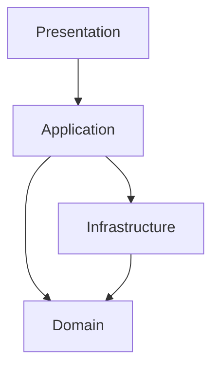
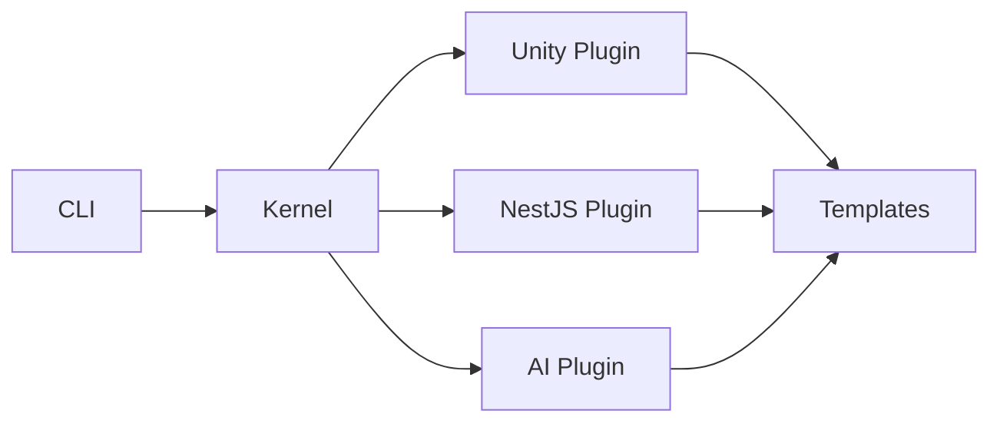
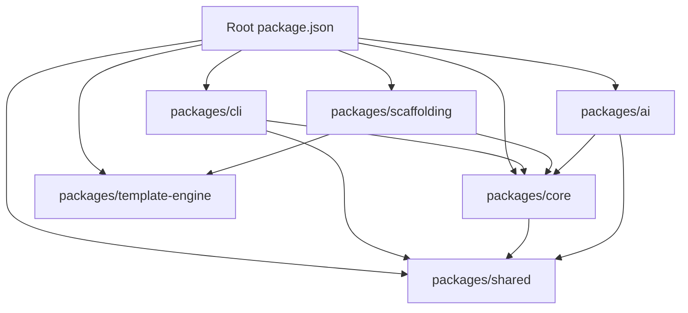

# Architecture Decision Log

## Purpose

Record significant architectural and technical decisions for Project Genesis. This is the canonical decision record. Summaries are mirrored in [`.cursor/memories/architectural-decisions.md`](.cursor/memories/architectural-decisions.md) for AI context.

## Scope

All decisions that affect system structure, technology choices, development process, or long-term maintainability.

## Format

Each decision follows the ADR format defined in [`standards/documentation/adr.md`](standards/documentation/adr.md) and [`templates/engineering/adr.md`](templates/engineering/adr.md):

- **Decision** — What was decided
- **Context** — Why a decision was needed
- **Choice** — What was selected
- **Reason** — Why this option was chosen
- **Consequences** — What follows from this decision

## Status Definitions

| Status | Meaning |
|--------|---------|
| Accepted | Active and enforced |
| Proposed | Under discussion, not yet enforced |
| Superseded | Replaced by a newer ADR |
| Deprecated | No longer recommended |

---

## ADR-001: Clean Architecture

| Field | Value |
|-------|-------|
| **Status** | Accepted |
| **Date** | 2026-07-01 |
| **Deciders** | Project Genesis Architecture |

### Context

Project Genesis must scale to support many plugins, generators, and third-party integrations without becoming a monolith tied to specific technologies.

### Decision

Use Clean Architecture as the primary structural approach.

### Choice

Separate the system into four layers:

| Layer | Responsibility |
|-------|----------------|
| Presentation | User interaction, CLI commands, API controllers |
| Application | Use cases, orchestration, DTOs |
| Domain | Business rules, entities, domain services |
| Infrastructure | Filesystem, databases, external APIs, frameworks |

### Reason

- Domain logic can be tested without infrastructure
- Frameworks and external services are replaceable
- Plugin boundaries align naturally with application and infrastructure layers
- AI assistants can reason about clear layer responsibilities

### Consequences

- All developers and AI assistants must respect dependency direction (inward)
- Domain layer must never import from infrastructure or presentation
- New modules require explicit layer assignment before implementation
- Enforced by [`.cursor/rules/01-architecture.mdc`](.cursor/rules/01-architecture.mdc) and [standards/ARCHITECTURE_STANDARD.md](standards/ARCHITECTURE_STANDARD.md)

---

## ADR-002: Plugin-Based Architecture

| Field | Value |
|-------|-------|
| **Status** | Accepted |
| **Date** | 2026-07-01 |
| **Deciders** | Project Genesis Architecture |

### Context

The framework must support Unity, Unreal, NestJS, AWS, Firebase, and AI service integrations without coupling the core to any of them.

### Decision

Adopt a plugin-based architecture where the core kernel remains technology-agnostic.

### Choice

Plugins register capabilities with the kernel:

| Capability | Description |
|------------|-------------|
| Commands | CLI commands exposed to users |
| Templates | File generation templates |
| Generators | Scaffolding logic for projects and modules |
| Validators | Architecture and standards compliance checks |
| Hooks | Lifecycle events (pre-generate, post-generate, etc.) |

### Reason

- Core framework stays independent of specific technologies
- New integrations can be added without modifying core code
- Teams can develop plugins in isolation
- Aligns with the long-term roadmap (Phase 2)

### Consequences

- Plugin contract must be designed before Phase 2 begins
- Core kernel API must be stable and well-documented
- Plugin lifecycle management is required (load, unload, validate)
- Production plugins are deferred until Phase 1 (Foundation) is complete

---

## ADR-003: TypeScript First

| Field | Value |
|-------|-------|
| **Status** | Accepted |
| **Date** | 2026-07-01 |
| **Deciders** | Project Genesis Architecture |

### Context

Project Genesis requires CLI development, code generation tooling, AI integrations, and backend scaffolding. A single primary language reduces context switching and enables shared types across packages.

### Decision

Use TypeScript as the primary implementation language for all framework packages.

### Choice

- Runtime: Node.js 22
- Language: TypeScript with strict mode
- All packages share types via `packages/shared`

### Reason

- Strong static typing catches errors at compile time
- Large ecosystem for CLI, templating, and AI SDK tooling
- Shared types between CLI, core, and generators reduce integration bugs
- High developer productivity for tooling projects

### Consequences

- All packages must follow [`.cursor/rules/03-typescript.mdc`](.cursor/rules/03-typescript.mdc)
- No `any` types; interfaces for all contracts
- Explicit return types on public methods
- Unity game code will use C# (separate from framework packages)

---

## ADR-004: AI-Native Development

| Field | Value |
|-------|-------|
| **Status** | Accepted |
| **Date** | 2026-07-01 |
| **Deciders** | Project Genesis Architecture |

### Context

Project Genesis is not a traditional framework with AI bolted on. AI-assisted development is a core capability — for both the framework's own development and for games built with it.

### Decision

Treat AI as a first-class capability with dedicated infrastructure.

### Choice

Build three AI pillars:

| Pillar | Package / Location | Responsibility |
|--------|-------------------|----------------|
| Context system | `packages/ai` | Project context assembly for LLM prompts |
| Prompt management | `prompts/`, `.cursor/prompts/` | Versioned, composable prompt assets |
| Agent architecture | Phase 4 | Autonomous planning, review, and generation agents |

### Reason

- AI context quality directly determines output quality
- Prompts are software assets requiring versioning and review
- Intelligent workflows reduce manual repetition
- Aligns with project vision ([docs/001-vision/VISION.md](docs/001-vision/VISION.md))

### Consequences

- AI features must define input, output, failure scenarios, evaluation criteria, and guardrails
- Never expose secrets, API keys, or private data in prompts or context
- `packages/ai` depends on `packages/core` and `packages/shared`, not vice versa
- Enforced by [`.cursor/rules/06-ai-development.mdc`](.cursor/rules/06-ai-development.mdc)

---

## ADR-005: Turborepo Monorepo

| Field | Value |
|-------|-------|
| **Status** | Accepted |
| **Date** | 2026-07-15 |
| **Deciders** | Project Genesis Architecture |

### Context

Project Genesis requires multiple packages (`cli`, `core`, `shared`, `scaffolding`, `template-engine`, `ai`) with shared types, coordinated builds, and consistent tooling.

### Decision

Organize all framework packages in a Turborepo monorepo managed by pnpm workspaces.

### Choice

| Component | Selection |
|-----------|-----------|
| Monorepo tool | Turborepo |
| Package manager | pnpm |
| Workspace layout | `packages/*` |
| Build caching | Turborepo remote/local cache |

### Reason

- pnpm provides efficient disk usage and strict dependency resolution
- Turborepo enables incremental builds and task orchestration
- Shared `tsconfig`, Biome, and Vitest configuration at root
- Industry-standard approach for TypeScript monorepos

### Consequences

- Root `package.json`, `pnpm-workspace.yaml`, and `turbo.json` are the first engineering deliverables
- Package naming follows `@genesis/<package-name>` convention
- Cross-package imports use workspace protocol (`workspace:*`)
- CI will use Turborepo's affected-package detection

---

## ADR-006: Biome for Code Quality

| Field | Value |
|-------|-------|
| **Status** | Accepted |
| **Date** | 2026-07-15 |
| **Deciders** | Project Genesis Architecture |

### Context

The monorepo needs consistent formatting and linting across all packages. Running separate formatter (Prettier) and linter (ESLint) tools adds configuration complexity.

### Decision

Use Biome as the unified formatter and linter.

### Choice

- Formatter: Biome
- Linter: Biome
- Test runner: Vitest (separate concern)

### Reason

- Single tool for formatting and linting reduces configuration surface
- Fast execution suitable for CI and pre-commit hooks
- Native TypeScript support
- Simpler onboarding for contributors

### Consequences

- No ESLint or Prettier configuration in the repository
- `biome.json` at repository root applies to all packages
- CI runs `biome check` as a quality gate
- Contributors run `pnpm format` and `pnpm lint` before PRs

---

## ADR-007: Documentation-First Bootstrap

| Field | Value |
|-------|-------|
| **Status** | Accepted |
| **Date** | 2026-07-01 |
| **Deciders** | Project Genesis Architecture |

### Context

An AI-native framework depends on high-quality context for both human and AI contributors. Implementing code before standards and architecture are defined leads to rework and inconsistent patterns.

### Decision

Complete the documentation, standards, and AI operating system before writing runtime code.

### Choice

Bootstrap sequence:

1. Repository and directory structure
2. Vision, charter, and governance documents
3. Engineering standards and knowledge base
4. Cursor AI operating system (rules, context, prompts, memories)
5. Template and prompt libraries
6. Governance documentation (this release)
7. Monorepo and package implementation

### Reason

- AI assistants produce better output with complete context
- Standards prevent architectural drift from day one
- Documentation-first aligns with core values ([docs/001-vision/CORE_VALUES.md](docs/001-vision/CORE_VALUES.md))
- Reduces rework when patterns are established after code exists

### Consequences

- Phase 1 progress appears documentation-heavy initially
- Runtime code implementation begins only after governance docs are complete
- Knowledge base articles will be enriched as domains are implemented
- PROJECT_STATUS reflects documentation completion before code

---

## ADR-008: Cursor as AI Operating System

| Field | Value |
|-------|-------|
| **Status** | Accepted |
| **Date** | 2026-07-10 |
| **Deciders** | Project Genesis Architecture |

### Context

Multiple AI tools (Cursor, Claude Code, GitHub Copilot) will assist development. Without a centralized AI configuration, behavior varies across tools and sessions.

### Decision

Use the `.cursor/` directory as the canonical AI operating system for Project Genesis.

### Choice

| Subdirectory | Purpose |
|--------------|---------|
| `.cursor/rules/` | Permanent behavior rules (always applied) |
| `.cursor/context/` | Current project knowledge (phase, sprint, task) |
| `.cursor/prompts/` | Reusable development workflow prompts |
| `.cursor/memories/` | Architectural decisions, lessons, known issues |

Complementary prompt assets live in `prompts/` (composable blocks) and `templates/` (generation templates).

### Reason

- Centralizes AI behavior configuration in version control
- Rules persist across sessions and contributors
- Context files keep AI assistants aligned with current priorities
- Memories prevent re-litigating settled decisions

### Consequences

- All AI-assisted work must reference `.cursor/` before implementation
- [AI_ARCHITECT.md](AI_ARCHITECT.md) defines the reading order and decision framework
- `scripts/check-cursor-workspace.sh` validates required files exist
- Other AI tools should read equivalent context from `.cursor/` and root governance docs

---

## Decision Index

| ID | Title | Status | Date |
|----|-------|--------|------|
| ADR-001 | Clean Architecture | Accepted | 2026-07-01 |
| ADR-002 | Plugin-Based Architecture | Accepted | 2026-07-01 |
| ADR-003 | TypeScript First | Accepted | 2026-07-01 |
| ADR-004 | AI-Native Development | Accepted | 2026-07-01 |
| ADR-005 | Turborepo Monorepo | Accepted | 2026-07-15 |
| ADR-006 | Biome for Code Quality | Accepted | 2026-07-15 |
| ADR-007 | Documentation-First Bootstrap | Accepted | 2026-07-01 |
| ADR-008 | Cursor as AI Operating System | Accepted | 2026-07-10 |

## Related Documents

- [`.cursor/memories/architectural-decisions.md`](.cursor/memories/architectural-decisions.md) — AI context mirror
- [`.cursor/context/ARCHITECTURE.md`](.cursor/context/ARCHITECTURE.md) — System architecture
- [standards/ARCHITECTURE_STANDARD.md](standards/ARCHITECTURE_STANDARD.md) — Layer rules
- [templates/engineering/adr.md`](templates/engineering/adr.md) — ADR template

## Changelog

| Version | Date | Change |
|---------|------|--------|
| 1.0.0 | 2026-07-26 | Initial approved version with ADR-001 through ADR-008 |
