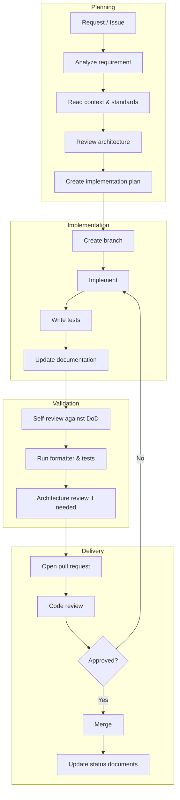

# Development Workflow

## Purpose

Define the end-to-end development process for Project Genesis. This workflow applies to human engineers and AI coding assistants alike.

## Scope

Covers planning, implementation, testing, documentation, review, and release for all contribution types. For contribution mechanics (branching, commits, PRs), see [CONTRIBUTING.md](CONTRIBUTING.md).

## Workflow Overview



## Phase 1 — Planning

### 1.1 Receive and Analyze

Every work item starts from one of:

- Sprint backlog item ([CURRENT_SPRINT.md](.cursor/context/CURRENT_SPRINT.md))
- Milestone deliverable ([CURRENT_MILESTONE.md](.cursor/context/CURRENT_MILESTONE.md))
- Bug report ([templates/github/issue.md](templates/github/issue.md))
- Architectural need (new ADR required)

Analyze the requirement against:

| Source | Question |
|--------|----------|
| [CURRENT_STATE.md](.cursor/context/CURRENT_STATE.md) | Is this allowed in the current phase? |
| [CURRENT_TASK.md](.cursor/context/CURRENT_TASK.md) | Is this the active priority? |
| [ARCHITECTURE.md](.cursor/context/ARCHITECTURE.md) | Which packages and layers are affected? |
| [DECISION_LOG.md](DECISION_LOG.md) | Are there existing decisions that apply? |
| [known-issues.md](.cursor/memories/known-issues.md) | Does this address a known limitation? |

### 1.2 Read Standards

Identify applicable standards from `standards/`:

| Change Type | Required Standards |
|-------------|-----------------|
| New package | `architecture/`, `naming/`, `coding/` |
| API endpoint | `api/`, `security/`, `testing/` |
| Unity system | `unity/`, `performance/` |
| AI feature | `ai/`, `security/` |
| Documentation | `documentation/` |
| Git operations | `git/` |

### 1.3 Create Implementation Plan

Before writing code, produce a plan that includes:

1. **Objective** — What problem this solves
2. **Affected modules** — Packages, layers, directories
3. **Dependencies** — New packages, external services
4. **Data flow** — How data moves through layers
5. **Test strategy** — What to test and how
6. **Documentation updates** — Which files need changes
7. **Risks** — Architectural trade-offs or unknowns

AI assistants must present this plan and wait for approval when requirements are ambiguous. See [AI_WORKFLOW.md](.cursor/context/AI_WORKFLOW.md).

### 1.4 Record Decisions

If the plan introduces architectural choices not covered by [DECISION_LOG.md](DECISION_LOG.md), create an ADR before implementation. Follow [governance/ADR_PROCESS.md](governance/ADR_PROCESS.md). Use [`templates/engineering/adr.md`](templates/engineering/adr.md).

## Phase 2 — Implementation

### 2.1 Branch

Create a focused branch following [governance/BRANCHING_STRATEGY.md](governance/BRANCHING_STRATEGY.md).

### 2.2 Implement

Follow layer rules from [standards/ARCHITECTURE_STANDARD.md](standards/ARCHITECTURE_STANDARD.md):

```
Presentation → Application → Domain → Infrastructure
```

**Implementation rules:**

- Reuse existing abstractions; never duplicate systems
- Small functions, clear names, explicit behavior
- Strict TypeScript with explicit return types on public methods
- Error handling, logging, and validation at boundaries
- No secrets in code; use environment configuration

**Prompts for structured work:**

| Task | Prompt |
|------|--------|
| New feature | [`.cursor/prompts/feature-development.md`](.cursor/prompts/feature-development.md) |
| New module | [`.cursor/prompts/create-module.md`](.cursor/prompts/create-module.md) |
| Bug fix | [`.cursor/prompts/bug-fixing.md`](.cursor/prompts/bug-fixing.md) |
| Refactor | [`.cursor/prompts/refactor.md`](.cursor/prompts/refactor.md) |
| API creation | [`.cursor/prompts/create-api.md`](.cursor/prompts/create-api.md) |
| Unity system | [`.cursor/prompts/create-unity.md`](.cursor/prompts/create-unity.md) |
| Tests | [`.cursor/prompts/create-tests.md`](.cursor/prompts/create-tests.md) |
| Documentation | [`.cursor/prompts/create-documentation.md`](.cursor/prompts/create-documentation.md) |

### 2.3 Write Tests

Follow [`.cursor/rules/04-testing.mdc`](.cursor/rules/04-testing.mdc) priorities:

1. Domain logic
2. Business rules
3. Critical workflows

Use Vitest. Tests must be independent, readable, and deterministic. See `standards/testing/`.

### 2.4 Update Documentation

Documentation is part of implementation, not a follow-up task. Update:

| Change | Update |
|--------|--------|
| New package | Package README, ARCHITECTURE if structural |
| Behavioral change | Relevant knowledge or standards articles |
| New decision | DECISION_LOG.md |
| Sprint progress | CURRENT_SPRINT.md |
| Milestone progress | CURRENT_MILESTONE.md, PROJECT_STATUS.md |

## Phase 3 — Validation

### 3.1 Self-Review

Verify against [DEFINITION_OF_DONE.md](.cursor/context/DEFINITION_OF_DONE.md) and [CURSOR_CHECKLIST.md](.cursor/CURSOR_CHECKLIST.md):

**Before coding:**
- [ ] Rules and context read
- [ ] Architecture reviewed
- [ ] Existing code searched for reuse

**During coding:**
- [ ] Standards followed
- [ ] Responsibilities separated
- [ ] Error handling present
- [ ] Tests written

**After coding:**
- [ ] Formatter run (Biome)
- [ ] Tests pass (Vitest)
- [ ] Documentation updated
- [ ] Architectural decisions explained

### 3.2 Run Quality Checks

When the monorepo is bootstrapped:

```bash
pnpm format:check    # Biome formatting
pnpm lint            # Biome linting
pnpm test            # Vitest test suite
pnpm build           # TypeScript compilation
```

### 3.3 Architecture Review

Trigger an architecture review when:

- A new package or module is created
- Dependencies between packages change
- A new external integration is introduced
- Layer boundaries are modified

Follow [governance/ARCHITECTURE_REVIEW_PROCESS.md](governance/ARCHITECTURE_REVIEW_PROCESS.md). Use [`.cursor/prompts/architecture-review.md`](.cursor/prompts/architecture-review.md) or [prompts/workflows/architecture-review.md](prompts/workflows/architecture-review.md).

## Phase 4 — Delivery

### 4.1 Pull Request

Open a PR following [governance/PULL_REQUEST_PROCESS.md](governance/PULL_REQUEST_PROCESS.md). Complete the Quality Gates table per [specs/000-project/QUALITY_GATES.md](specs/000-project/QUALITY_GATES.md). Use [templates/github/pull-request.md](templates/github/pull-request.md).

### 4.2 Code Review

Reviewers apply [`.cursor/rules/13-code-review.mdc`](.cursor/rules/13-code-review.mdc) criteria. AI-generated code requires the same scrutiny as human-written code. See [governance/AI_CONTRIBUTION_POLICY.md](governance/AI_CONTRIBUTION_POLICY.md) and [lessons-learned.md](.cursor/memories/lessons-learned.md).

### 4.3 Merge and Update Status

After merge:

1. Update [PROJECT_STATUS.md](PROJECT_STATUS.md) if deliverables changed
2. Update [CURRENT_SPRINT.md](.cursor/context/CURRENT_SPRINT.md) task status
3. Close related issues
4. Record lessons learned in [`.cursor/memories/lessons-learned.md`](.cursor/memories/lessons-learned.md) if applicable

## Release Workflow

Releases follow [governance/RELEASE_STRATEGY.md](governance/RELEASE_STRATEGY.md) and [governance/VERSIONING_STRATEGY.md](governance/VERSIONING_STRATEGY.md):

| Version Part | When to Increment |
|--------------|-------------------|
| MAJOR | Breaking API changes |
| MINOR | New features, backward compatible |
| PATCH | Bug fixes, backward compatible |

Release checklist: [`templates/production/release.md`](templates/production/release.md).

## AI-Assisted Development

AI assistants follow [AI_ARCHITECT.md](AI_ARCHITECT.md) and [governance/AI_CONTRIBUTION_POLICY.md](governance/AI_CONTRIBUTION_POLICY.md) as their operating guides. Key differences from human workflow:

| Step | AI Behavior |
|------|-------------|
| Planning | Must read rules, context, and memories before coding |
| Ambiguity | Must ask questions, not assume |
| Implementation | Must not create duplicate systems |
| Output | Must include files changed, decisions, tests, and docs |
| Validation | Generated code must pass the same DoD as human code |

Composable prompt assembly:

```
prompts/blocks/current-context.md
+ prompts/blocks/architecture.md
+ prompts/blocks/constraints.md
+ prompts/blocks/task.md
+ prompts/blocks/output-format.md
```

See [prompts/README.md](prompts/README.md).

## Sprint and Milestone Cadence

| Artifact | Cadence | Owner | Location |
|----------|---------|-------|----------|
| Milestone | Per roadmap phase | Architecture | [CURRENT_MILESTONE.md](.cursor/context/CURRENT_MILESTONE.md) |
| Sprint | 2 weeks | Engineering | [CURRENT_SPRINT.md](.cursor/context/CURRENT_SPRINT.md) |
| Active task | Continuous | Engineering | [CURRENT_TASK.md](.cursor/context/CURRENT_TASK.md) |
| Project status | On milestone change | Architecture | [PROJECT_STATUS.md](PROJECT_STATUS.md) |

Templates: [`templates/production/milestone.md`](templates/production/milestone.md), [`templates/production/sprint.md`](templates/production/sprint.md).

## Related Documents

- [governance/README.md](governance/README.md) — Governance index
- [AI_ARCHITECT.md](AI_ARCHITECT.md) — AI operating guide
- [CONTRIBUTING.md](CONTRIBUTING.md) — Contribution mechanics
- [DECISION_LOG.md](DECISION_LOG.md) — Architectural decisions
- [`.cursor/context/DEFINITION_OF_DONE.md`](.cursor/context/DEFINITION_OF_DONE.md) — Completion criteria
- [`.cursor/context/AI_WORKFLOW.md`](.cursor/context/AI_WORKFLOW.md) — AI feature request flow

## Changelog

| Version | Date | Change |
|---------|------|--------|
| 1.0.0 | 2026-07-26 | Initial approved version |
