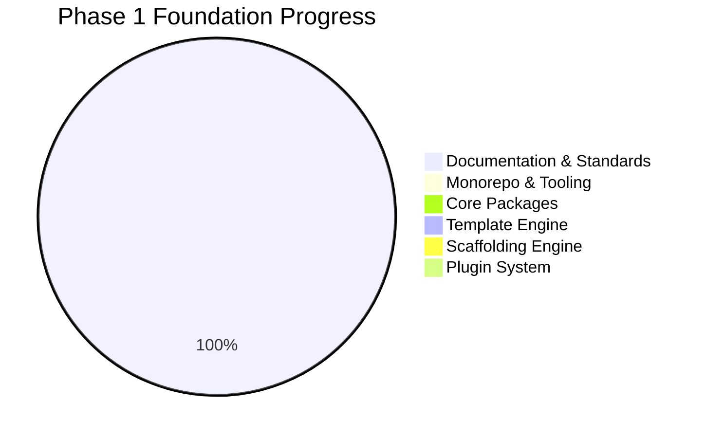

# Project Status

## Purpose

Provide a single, authoritative snapshot of Project Genesis progress. This document is updated when milestones, sprints, or major deliverables change.

## Scope

Covers repository-level status across all phases defined in [`.cursor/context/ROADMAP.md`](.cursor/context/ROADMAP.md). For active work details, see [`.cursor/context/CURRENT_SPRINT.md`](.cursor/context/CURRENT_SPRINT.md).

## Current Phase

| Attribute | Value |
|-----------|-------|
| **Phase** | 1 — Foundation |
| **Sub-phase** | Genesis CLI Foundation |
| **Status** | In Progress |
| **Last updated** | 2026-07-26 |

## Executive Summary

Project Genesis has completed its **documentation and standards bootstrap**. The repository contains a comprehensive knowledge base, engineering standards, Cursor AI operating system, prompt library, and template library. **No runtime code exists yet** — the monorepo, CLI, and core packages are the next engineering deliverables.

The immediate goal is to build the **Genesis CLI**, the central tool for project creation, module generation, plugin management, architecture validation, and AI workflow integration. See [`.cursor/context/PROJECT_SUMMARY.md`](.cursor/context/PROJECT_SUMMARY.md).

## Progress Overview

> Percentages are engineering estimates based on deliverables defined in [`.cursor/context/CURRENT_MILESTONE.md`](.cursor/context/CURRENT_MILESTONE.md).

## Completed

| Area | Deliverable | Location |
|------|-------------|----------|
| Repository structure | Top-level directories | `docs/`, `knowledge/`, `standards/`, `templates/`, `prompts/`, `.cursor/` |
| Vision documents | Charter, vision, mission, values | `docs/` |
| Knowledge base | 75 evergreen topics across 12 categories | `knowledge/` |
| Engineering standards | 63 standards across architecture, backend, Unity, AI, testing, git, security | `standards/` |
| Template library | Engineering, game design, backend, Unity, AI, production templates | `templates/` |
| Prompt engine | Composable blocks, workflows, examples | `prompts/` |
| Cursor AI OS | Rules, context, prompts, memories | `.cursor/` |
| Project governance docs | Architect guide, contributing, workflow, decision log | Repository root |
| Workspace validation | Cursor workspace check script | `scripts/check-cursor-workspace.sh` |

## In Progress

| Area | Status | Owner | Reference |
|------|--------|-------|-----------|
| Knowledge base completion | Completing governance documentation | Architecture | This release |
| Milestone M1 planning | Sprint 1 defined | Architecture | [CURRENT_MILESTONE.md](.cursor/context/CURRENT_MILESTONE.md) |

## Not Started

| Area | Blocked By | Reference |
|------|------------|-----------|
| Turborepo monorepo bootstrap | Documentation completion | [ADR-005](DECISION_LOG.md#adr-005-turborepo-monorepo) |
| `packages/shared` | Monorepo bootstrap | [ARCHITECTURE.md](.cursor/context/ARCHITECTURE.md) |
| `packages/core` | `packages/shared` | [known-issues.md](.cursor/memories/known-issues.md) |
| `packages/cli` | `packages/core` | [known-issues.md](.cursor/memories/known-issues.md) |
| `packages/template-engine` | `packages/core` | [known-issues.md](.cursor/memories/known-issues.md) |
| `packages/scaffolding` | Template engine | [known-issues.md](.cursor/memories/known-issues.md) |
| `packages/ai` | Core services | [known-issues.md](.cursor/memories/known-issues.md) |
| Plugin system | CLI and core services | [ADR-002](DECISION_LOG.md#adr-002-plugin-based-architecture) |
| `framework/` runtime code | Phase 1 completion | `framework/README.md` |
| `engine/` runtime code | Phase 1 completion | `engine/README.md` |
| `games/` | Phase 3 | [ROADMAP.md](.cursor/context/ROADMAP.md) |

## Active Milestone

**M1 — Genesis CLI Foundation**

| Attribute | Value |
|-----------|-------|
| Target | Functional CLI with core services and template rendering |
| Sprint | Sprint 1 — Monorepo Bootstrap |
| Details | [CURRENT_MILESTONE.md](.cursor/context/CURRENT_MILESTONE.md) |

## Roadmap Position

| Phase | Name | Status |
|-------|------|--------|
| 1 | Foundation | **In Progress** |
| 2 | Plugins | Planned |
| 3 | Game Generation | Planned |
| 4 | AI Development Assistant | Planned |

Full roadmap: [`.cursor/context/ROADMAP.md`](.cursor/context/ROADMAP.md).

## Known Limitations

| System | Status | Details |
|--------|--------|---------|
| CLI | Not implemented | Command execution, plugin loading, configuration pending |
| Template engine | Not implemented | Rendering, discovery, validation pending |
| AI layer | Architecture only | Provider integration, context retrieval, evaluation pending |
| Plugins | Not implemented | Plugin contract, lifecycle management pending |

Source: [`.cursor/memories/known-issues.md`](.cursor/memories/known-issues.md).

## Technical Debt

No critical technical debt recorded. Tracking format defined in [`.cursor/memories/technical-debt.md`](.cursor/memories/technical-debt.md).

## Repository Health

| Check | Status |
|-------|--------|
| Cursor workspace files | Validated by `scripts/check-cursor-workspace.sh` |
| Root README | Present, references Foundation Phase |
| Package manifest (`package.json`) | Scaffolded (empty — Sprint 1) |
| CI/CD pipeline | Scaffolded (empty workflows — Sprint 2) |
| Test suite | Scaffolded (empty — Sprint 1) |

## Tech Stack (Planned)

| Component | Choice | Reference |
|-----------|--------|-----------|
| Language | TypeScript (strict) | [ADR-003](DECISION_LOG.md#adr-003-typescript-first) |
| Runtime | Node.js 22 | [TECH_STACK.md](.cursor/context/TECH_STACK.md) |
| Package manager | pnpm | [ADR-005](DECISION_LOG.md#adr-005-turborepo-monorepo) |
| Build orchestration | Turborepo | [ADR-005](DECISION_LOG.md#adr-005-turborepo-monorepo) |
| Formatter | Biome | [ADR-006](DECISION_LOG.md#adr-006-biome-for-code-quality) |
| Test runner | Vitest | [TECH_STACK.md](.cursor/context/TECH_STACK.md) |

## Risks

| Risk | Impact | Mitigation |
|------|--------|------------|
| Implementing before architecture is stable | Rework, coupling | Documentation-first bootstrap (completed); ADRs enforced |
| Scope creep into game features | Delays CLI foundation | Phase constraints in [CURRENT_STATE.md](.cursor/context/CURRENT_STATE.md) |
| AI-generated code without standards | Quality degradation | [AI_ARCHITECT.md](AI_ARCHITECT.md), rules, Definition of Done |
| Knowledge base stubs remain unfilled | Incomplete AI context | Prioritize knowledge articles as domains are implemented |

## Next Actions

1. Bootstrap Turborepo monorepo with pnpm workspaces
2. Create `packages/shared`, `packages/core`, `packages/cli` skeleton
3. Implement minimal CLI (`genesis --version`, `genesis --help`)
4. Configure Biome and Vitest at workspace level

Active task: [`.cursor/context/CURRENT_TASK.md`](.cursor/context/CURRENT_TASK.md).

## Related Documents

- [AI_ARCHITECT.md](AI_ARCHITECT.md) — AI assistant operating guide
- [DEVELOPMENT_WORKFLOW.md](DEVELOPMENT_WORKFLOW.md) — Development process
- [DECISION_LOG.md](DECISION_LOG.md) — Architectural decisions
- [`.cursor/context/CURRENT_STATE.md`](.cursor/context/CURRENT_STATE.md) — Phase priorities

## Changelog

| Version | Date | Change |
|---------|------|--------|
| 1.0.0 | 2026-07-26 | Initial approved version |
