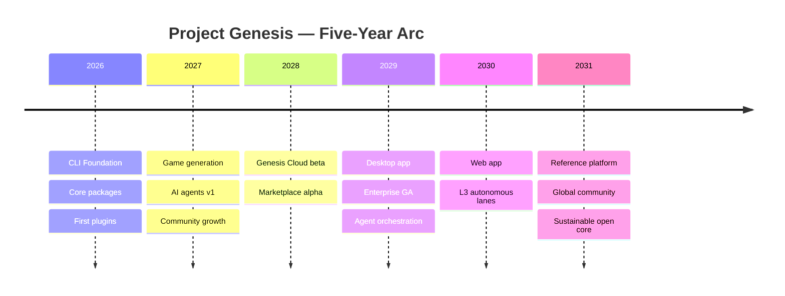

# Long-Term Vision

**Project Genesis — Five Years From Now**

*Written as the north star for contributors, partners, and future architects.*

This document describes where Project Genesis is headed by **2031**: a mature, AI-native platform that changes how professional games are conceived, built, shipped, and operated. It extends the [Project Charter](PROJECT_CHARTER.md), [Mission](../001-vision/MISSION.md), [Vision](../001-vision/VISION.md), and [Core Values](../001-vision/CORE_VALUES.md) into a concrete five-year picture.

Use this document when:

- Evaluating features that compete for roadmap space
- Designing plugins, APIs, or commercial offerings
- Deciding what belongs in open source vs. paid tiers
- Onboarding contributors who need to understand *why* we build, not only *what*

---

## Mission

**Reduce the time required to build professional games while raising the floor of software quality—through reusable architecture, documentation, templates, and AI-driven workflows that teams and machines can trust.**

We exist because game development is still too slow, too fragile, and too dependent on heroic individuals. Genesis turns proven engineering practice into repeatable infrastructure so creators spend their energy on what players feel, not on reinventing scaffolding.

Our mission does not change with the calendar. Our tools evolve; our obligation to quality, clarity, and developer dignity does not.

---

## Vision

**By 2031, Project Genesis is the reference AI-native framework for professional game development.**

A team—or a solo creator with AI collaborators—can go from idea to live mobile game using one coherent platform:

| Layer | 2031 state |
|-------|------------|
| **CLI & local toolchain** | `genesis` is the universal entry point: scaffold, validate, generate, deploy, and operate |
| **Plugins** | Unity, backend, cloud, AI, and LiveOps plugins compose without lock-in |
| **Cloud** | Projects sync to Genesis Cloud for builds, environments, collaboration, and agent orchestration |
| **Agents** | Specialized AI agents plan, implement, review, and document within guardrails |
| **Community** | Thousands of contributors; a thriving marketplace of templates and plugins |
| **Enterprise** | Studios run Genesis at scale with governance, SSO, audit, and private registries |

Every Genesis project is **maintainable, modular, well documented, testable, AI-friendly, and production ready**—not as marketing language, but as verifiable properties enforced by the toolchain.

We measure success when a new contributor can ship a feature in a week, when a studio standardizes on Genesis across titles, and when AI assistants cite Genesis patterns as industry best practice.

---

## Core Values

These values guide trade-offs when specs conflict, deadlines press, or shortcuts tempt.

| Value | What it means in practice |
|-------|---------------------------|
| **Quality over speed** | We ship fast *because* we invest in tests, reviews, and docs—not despite them |
| **Simplicity over complexity** | Every abstraction must earn its place; prefer one clear path over ten optional ones |
| **Documentation over tribal knowledge** | If it isn't written, it doesn't exist; AI and humans learn from the same source |
| **Reusability over duplication** | Plugins, templates, and patterns are assets—not one-off scripts |
| **Automation over manual work** | Repeatable tasks belong in the CLI, cloud, or agents |
| **Learning over assumptions** | We measure, we listen to users, we revise ADRs when evidence changes |
| **Open by default** | The core framework stays inspectable, forkable, and community-governed |
| **Player outcomes matter** | Engineering excellence serves fun, retention, and accessibility—not ego |

When in doubt, ask: *Does this make the next contributor's life better five years from now?*

---

## Competitive Advantages

Genesis wins when these advantages compound:

### 1. Documentation-first DNA

We specify before we implement. Functional specs, ADRs, and the knowledge base are not afterthoughts—they are the product. Competitors bolt AI onto undocumented codebases; Genesis gives AI (and humans) structured context from day one.

### 2. AI-native architecture

Clean Architecture, plugin boundaries, typed configuration (`genesis.config.ts`), and versioned prompts are designed for machine reasoning. Agents don't guess file layout—they read the contract.

### 3. Full-stack game scope

Unity scaffolding, NestJS backends, AWS/Firebase deployment, LiveOps, and analytics in one framework. Most tools solve one slice; Genesis owns the **vertical journey** from repo to live game.

### 4. Kernel + plugin extensibility

The Genesis Kernel (registries, events, hooks, DI) lets ecosystems grow without forking core. Third parties extend; we don't become a monolith.

### 5. Mobile-first discipline

Performance, battery, and store compliance are defaults—not workshop topics. This focus differentiates us from generic "app generators."

### 6. Cursor / IDE integration

Genesis is built to be the engineering OS inside modern AI IDEs: rules, prompts, and workflows are first-class repo assets ([ADR-008](../../DECISION_LOG.md)).

### 7. Trust through validation

`genesis validate`, `genesis doctor`, and architecture gates create a **quality surface** competitors lack. Shipping is a command, not a hope.

---

## Target Users

### Primary (2026–2028)

| Persona | Needs | Genesis answer |
|---------|-------|----------------|
| **Indie / small studio developer** | Ship a mobile game without a platform team | CLI + templates + AI-assisted scaffolding |
| **Technical lead** | Consistent architecture across projects | Standards, ADRs, validators, plugin boundaries |
| **Solo creator with AI** | Reliable pair-programming partner | Prompts, rules, agent hooks, structured repos |

### Secondary (2028–2031)

| Persona | Needs | Genesis answer |
|---------|-------|----------------|
| **Mid-size studio** | Multi-title reuse, CI/CD, LiveOps | Cloud, enterprise features, private plugins |
| **Plugin author** | Distribution and revenue | Marketplace, SDK, certification |
| **Educator / bootcamp** | Teach professional practice | Open curriculum, reproducible project seeds |
| **Enterprise platform team** | Governance at scale | SSO, audit logs, air-gapped options |

We explicitly **do not** optimize for: throwaway prototypes with no tests, teams that reject documentation, or engines outside our plugin model (unless the community extends us).

---

## Business Opportunities

Genesis is an open-core platform. Revenue funds sustainability without compromising the mission.

| Opportunity | Model | Timeline |
|-------------|-------|----------|
| **Genesis Cloud** | Usage-based: builds, environments, agent minutes, storage | Phase 3+ |
| **Enterprise Edition** | Per-seat or per-studio annual license | Phase 4+ |
| **Marketplace** | Revenue share on paid plugins and templates | Phase 4+ |
| **Certification & training** | Paid courses, official certification | Phase 3+ |
| **Professional services** | Implementation, custom plugins (select partners) | Ongoing |
| **Sponsored plugins** | Cloud vendors co-develop first-party integrations | Phase 2+ |

**Principle:** Everything required to *build and ship* a game with Genesis stays free in open source. Paid tiers add **scale, collaboration, compliance, and convenience**—not hostages.

---

## AI Strategy

AI is not a feature bolted onto Genesis—it is a **design constraint** and a **delivery multiplier**.

### Principles

1. **Structured context** — Repos, specs, and `genesis.config.ts` give models reliable grounding
2. **Versioned prompts** — Prompts are assets with semver, review, and rollback ([AI development rules](../../.cursor/rules/06-ai-development.mdc))
3. **Human in the loop** — Agents propose; humans approve merges, deploys, and schema changes
4. **Provider agnostic** — `@genesis/ai` abstracts models; studios choose OpenAI, Anthropic, local, or private endpoints
5. **Evaluations** — Every agent capability has success criteria, failure modes, and regression tests
6. **Cost and latency awareness** — Cloud and CLI surface token usage; expensive paths require explicit opt-in

### Roadmap alignment

| Phase | AI capability |
|-------|----------------|
| **Now** | Cursor rules, prompt library, `genesis ai` scaffolding |
| **Year 1–2** | Code generation, doc generation, architecture review agents |
| **Year 3–4** | Multi-agent workflows: planner → implementer → reviewer |
| **Year 5** | Autonomous development lanes with policy gates (see [Future Autonomous Development](#future-autonomous-development)) |

We will never expose secrets, log PII, or let agents bypass validation hooks.

---

## Open-Source Strategy

### What stays open (forever)

- Genesis CLI and core packages (`@genesis/core`, `@genesis/config`, `@genesis/cli`, etc.)
- Official plugins maintained by the core team (Unity, NestJS, AWS, Firebase baselines)
- Documentation, specs, standards, templates, and ADRs
- Plugin SDK and local marketplace client

### License posture

- **Core:** Permissive license (e.g. MIT or Apache 2.0)—maximize adoption and contribution
- **Enterprise modules:** Separate license; source may be available for audit without redistribution rights
- **Marketplace assets:** Per-author licenses; Genesis provides distribution, not IP ownership

### Governance

- Maintainers merge on merit, tests, and architectural fit
- Major breaking changes require ADRs and migration guides
- Security issues handled via responsible disclosure

### Contribution flywheel

```
Better docs → Easier contributions → More plugins → More users → More contributors
```

---

## Community

By 2031, the Genesis community is a **global guild of game engineers** who believe quality and speed are not opposites.

### Pillars

| Pillar | 2031 target |
|--------|-------------|
| **Contributors** | 500+ meaningful contributors; clear maintainer ladder |
| **Discord / forums** | Active help channels; office hours with maintainers |
| **Showcase** | Monthly "Built with Genesis" spotlights |
| **Ambassadors** | Regional leads, conference talks, localized docs |
| **RFC process** | Public proposals for kernel and CLI changes |
| **Code of conduct** | Enforced, safe space for all skill levels |

### Community promises

- No contributor is punished for asking questions
- Good first issues are real, not bait
- Credit is given publicly; governance is transparent
- Decisions are documented in ADRs, not private threads

---

## Enterprise Edition

**Genesis Enterprise** serves studios that need control, compliance, and support at scale.

### Capabilities (target)

| Area | Enterprise feature |
|------|-------------------|
| **Identity** | SSO (SAML/OIDC), SCIM provisioning |
| **Governance** | Role-based access, approval workflows for deploys |
| **Audit** | Immutable audit logs for config, deploy, and agent actions |
| **Private registry** | Internal plugins and templates behind the firewall |
| **Air-gapped** | On-prem or VPC-only cloud cells for sensitive IP |
| **Support** | SLA, dedicated success engineer, security review |
| **Policy** | Org-wide agent policies: allowed models, data residency, spend caps |

Enterprise does not fork the open core. It **wraps** the same CLI and kernel with organizational controls—so indie developers and AAA studios share one ecosystem.

---

## Plugin Marketplace

The marketplace is where **the long tail of game development** lives: genre templates, regional compliance packs, analytics adapters, art pipelines, and niche engine bridges.

### How it works

```
Developer → genesis plugin install @author/awesome-liveops
         → Marketplace verifies signature + compatibility matrix
         → Plugin registers with Genesis Kernel
         → Revenue share: author 70% / Genesis 30% (illustrative)
```

### Trust layers

1. **Community** — Open plugins, community ratings
2. **Verified** — Genesis-tested against current semver
3. **Official** — Maintained by core team or certified partners

### Author experience

- `genesis plugin publish` from CI
- Automated compatibility checks against kernel API
- Analytics dashboard: installs, revenue, crash reports

The marketplace turns Genesis from a framework into an **economy**.

---

## Cloud Platform

**Genesis Cloud** is the multiplayer layer for projects, builds, and agents.

### Services

| Service | Purpose |
|---------|---------|
| **Project sync** | Git-integrated project state, config, and secrets (encrypted) |
| **Remote builds** | Unity + backend CI without local machine limits |
| **Environments** | Dev / staging / prod with promotion workflows |
| **Collaboration** | Shared agent sessions, review queues, comment threads |
| **Agent orchestration** | Scheduled agents, parallel tasks, budget enforcement |
| **LiveOps hooks** | Connect to `specs/009-liveops` capabilities in production |
| **Observability** | Build logs, deploy history, agent traces |

### Architecture stance

- Cloud is **optional** for solo devs; essential for teams
- CLI remains the truth interface: `genesis deploy` works locally or routes to cloud via config
- Data residency and export: studios can leave with their repos and history

---

## Future Desktop Application

The **Genesis Studio** desktop app (Electron or Tauri, TBD) is the visual command center for developers who outgrow terminal-only workflows.

### Planned capabilities

- Project dashboard: health, validation status, last agent run
- Visual plugin and template browser (marketplace UI)
- Integrated log viewer and build timeline
- Agent chat panel with repo-aware context
- One-click open in Cursor / VS Code with Genesis context preloaded
- Offline-first: core workflows function without cloud

The desktop app **orchestrates** the CLI—it does not replace it. Power users keep their terminals; visual learners get a GUI.

---

## Future Web Application

**Genesis Web** brings collaboration to the browser.

### Planned capabilities

| Area | Features |
|------|----------|
| **Project hub** | Overview, members, environments |
| **Spec editor** | Markdown specs with AI assist and review mode |
| **Agent console** | Launch, monitor, and approve agent tasks |
| **Marketplace** | Browse, purchase, and manage plugins |
| **Analytics** | LiveOps dashboards for shipped games |
| **Docs portal** | Auto-generated project docs from repo |

Web complements desktop and CLI: stakeholders who don't code can still participate in specs, approvals, and release notes.

---

## Future AI Agents

Genesis agents are **specialized, composable workers** registered with the kernel—not a single omniscient chatbot.

### Agent roster (2031 target)

| Agent | Responsibility |
|-------|----------------|
| **Architect** | ADRs, package boundaries, dependency rules |
| **Implementer** | Features from approved specs |
| **Reviewer** | PR review, security, performance |
| **Documenter** | Specs, READMEs, changelogs |
| **QA** | Test generation, failure triage |
| **DevOps** | CI, deploy, infra drift |
| **Game Designer** | GDD alignment, progression checks |
| **LiveOps** | Events, economy tuning suggestions |

### Agent contract

Every agent declares:

- **Input** — Files, specs, or events it consumes
- **Output** — Artifacts it produces
- **Guardrails** — What it may never do (e.g. push to `main`, rotate secrets)
- **Evaluation** — How we measure regression

Agents communicate via kernel events and hooks—same extension model as plugins.

---

## Future Autonomous Development

**Autonomous development** is the endgame: humans set direction; Genesis executes within policy.

### Maturity model

| Level | Description | Human role |
|-------|-------------|------------|
| **L0 – Assist** | AI suggests in IDE | Author all code |
| **L1 – Generate** | `genesis ai generate` scaffolds from specs | Review everything |
| **L2 – Pair** | Agents open PRs; CI + reviewers gate merge | Approve PRs |
| **L3 – Delegate** | Agents implement approved tickets end-to-end | Define tickets + policies |
| **L4 – Autonomous lanes** | Continuous improvement loops on bounded domains | Set goals and constraints |

By 2031, we target **reliable L3** for well-specified domains (docs, tests, boilerplate features) and **pilot L4** for maintenance tasks (dependency updates, doc sync, lint fixes).

### Non-negotiable gates

Autonomy without accountability is negligence. These gates never auto-bypass:

1. `genesis validate` and test suite pass
2. Architecture rules satisfied (no forbidden imports)
3. Human approval for: schema migrations, auth changes, payment logic, production deploys
4. Audit log entry for every autonomous action

### The founder's bet

Studios that master **specification quality** will outship studios that master **typing speed**. Genesis autonomous development rewards teams who write clear specs, ADRs, and acceptance criteria—the same habits that made great games before AI, amplified by machines.

---

## Strategic Horizons



---

## Decision Filter

When evaluating any proposal, score it against this filter:

1. **Mission** — Does it reduce time to ship *and* raise quality?
2. **Architecture** — Does it respect Clean Architecture and plugin boundaries?
3. **AI-native** — Does it improve structured context for humans and agents?
4. **Open core** — Does the OSS community benefit, not just paid tiers?
5. **Five-year test** — Will we be proud of this in 2031?

If a proposal fails two or more, defer or redesign.

---

## Related Documents

| Document | Relationship |
|----------|--------------|
| [PROJECT_CHARTER.md](PROJECT_CHARTER.md) | Official charter and definition of done |
| [../001-vision/VISION.md](../001-vision/VISION.md) | Concise vision statement |
| [../001-vision/MISSION.md](../001-vision/MISSION.md) | Mission statement |
| [../001-vision/CORE_VALUES.md](../001-vision/CORE_VALUES.md) | Value definitions |
| [../../specs/000-project/DEVELOPER_JOURNEY.md](../../specs/000-project/DEVELOPER_JOURNEY.md) | Day-to-day developer experience |
| [../../specs/100-architecture/PACKAGES.md](../../specs/100-architecture/PACKAGES.md) | Technical package architecture |
| [../../specs/100-architecture/KERNEL.md](../../specs/100-architecture/KERNEL.md) | Kernel and extensibility model |
| [../../DECISION_LOG.md](../../DECISION_LOG.md) | Architectural decisions (ADRs) |
| [../../.cursor/context/ROADMAP.md](../../.cursor/context/ROADMAP.md) | Near-term execution roadmap |

---

## Closing

Project Genesis is not a CLI, a cloud, or a marketplace. It is a **belief**: that game development can be rigorous and creative, that documentation and AI are allies, and that the next generation of hit games will be built on foundations anyone can inspect, extend, and trust.

Build for 2031. Ship today.

*— Founder & Chief Architect, Project Genesis*
