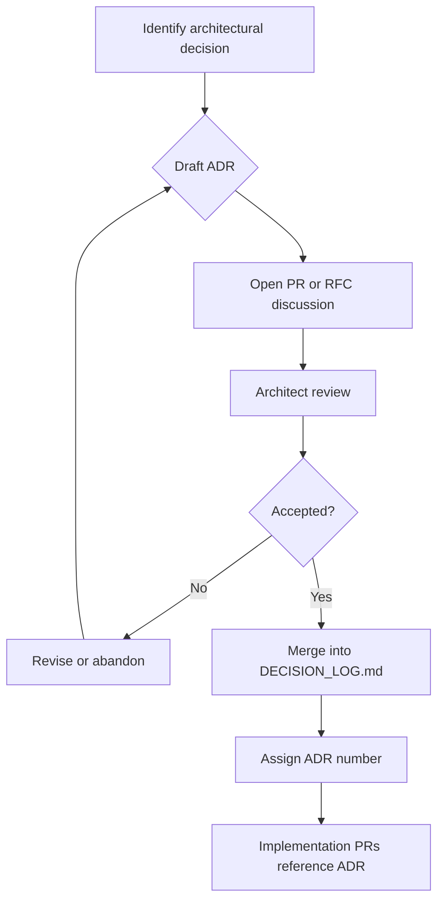

# ADR Process

## Purpose

Provide a repeatable workflow for recording significant architectural decisions. ADRs create an audit trail of *why* the system looks the way it does, enabling contributors and AI assistants to align with past choices.

The canonical ADR log is [DECISION_LOG.md](../DECISION_LOG.md).

## Responsibilities

| Role | Responsibility |
|------|----------------|
| **Author** | Draft ADR with context, options, decision, and consequences |
| **Architect reviewer** | Validate technical accuracy and alignment with principles |
| **Chief Architect** | Accept or reject ADRs for Tier 3+ changes |
| **Maintainers** | Ensure ADRs are merged before dependent implementation PRs |
| **All contributors** | Do not implement against superseded ADRs without updating the log |

## When an ADR is required

| Situation | ADR required |
|-----------|--------------|
| New package or kernel module | Yes |
| Breaking public API change | Yes |
| New external dependency with architectural impact | Yes |
| Technology choice (database, cloud, framework) | Yes |
| Change to plugin contract or kernel registries | Yes |
| Refactor with no behavioral or structural impact | No |
| Bug fix within existing design | No |

When in doubt, write an ADR. Lightweight ADRs are cheaper than reversed implementations.

## Workflow

### ADR lifecycle states

| Status | Meaning |
|--------|---------|
| **Proposed** | Under discussion; not yet enforced |
| **Accepted** | Active and enforced |
| **Superseded** | Replaced by newer ADR; link forward |
| **Deprecated** | No longer recommended; may still exist in code |

### ADR format

Use the table format in [DECISION_LOG.md](../DECISION_LOG.md):

- **Decision** — What was decided
- **Context** — Why a decision was needed
- **Choice** — What was selected
- **Reason** — Why this option was chosen
- **Consequences** — Positive and negative outcomes

Templates:

- [templates/engineering/adr.md](../templates/engineering/adr.md)
- [standards/documentation/adr.md](../standards/documentation/adr.md)

### Numbering

- Sequential: `ADR-001`, `ADR-002`, …
- Next number = highest existing + 1
- Never reuse numbers
- Superseded ADRs keep their number; add "Superseded by ADR-XXX"

## Examples

### Example — accepted ADR summary

**ADR-005: Turborepo Monorepo**

| Field | Content |
|-------|---------|
| Context | Need build orchestration for multiple packages |
| Choice | Turborepo + pnpm workspaces |
| Reason | Caching, task graph, industry adoption |
| Consequences | Requires Node 22.x; CI must run `turbo` |

Implementation PRs link: `Implements ADR-005`.

### Example — superseding an ADR

1. ADR-003 chose YAML for project config
2. New ADR-009 chooses `genesis.config.ts`
3. ADR-003 status → Superseded by ADR-009
4. Migration guide added in release notes

### Example — rejected proposal

RFC proposed GraphQL for all plugin communication. ADR marked **Rejected** with reason: violates simplicity principle; REST + typed SDK sufficient for v1.

## Best practices

- Write ADRs **before** implementation when possible ([ADR-007](../DECISION_LOG.md#adr-007-documentation-first-bootstrap))
- List alternatives considered, not only the winner
- Keep ADRs immutable once accepted; supersede instead of editing history
- Mirror summaries in [`.cursor/memories/architectural-decisions.md`](../.cursor/memories/architectural-decisions.md) for AI context
- Reference specs in `specs/` for detailed requirements; ADRs capture the decision, not the full spec
- Link ADRs from PR descriptions and package READMEs when relevant

## Related documents

- [DECISION_LOG.md](../DECISION_LOG.md)
- [RFC_PROCESS.md](RFC_PROCESS.md)
- [ARCHITECTURE_REVIEW_PROCESS.md](ARCHITECTURE_REVIEW_PROCESS.md)
- [ENGINEERING_PRINCIPLES.md](ENGINEERING_PRINCIPLES.md)
- [templates/engineering/adr.md](../templates/engineering/adr.md)
- [standards/documentation/adr.md](../standards/documentation/adr.md)
- [DOCUMENTATION_POLICY.md](DOCUMENTATION_POLICY.md)

## Changelog

| Version | Date | Change |
|---------|------|--------|
| 1.0.0 | 2026-07-26 | Initial approved version |
