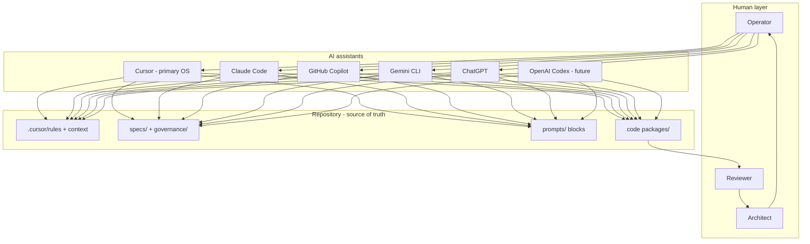
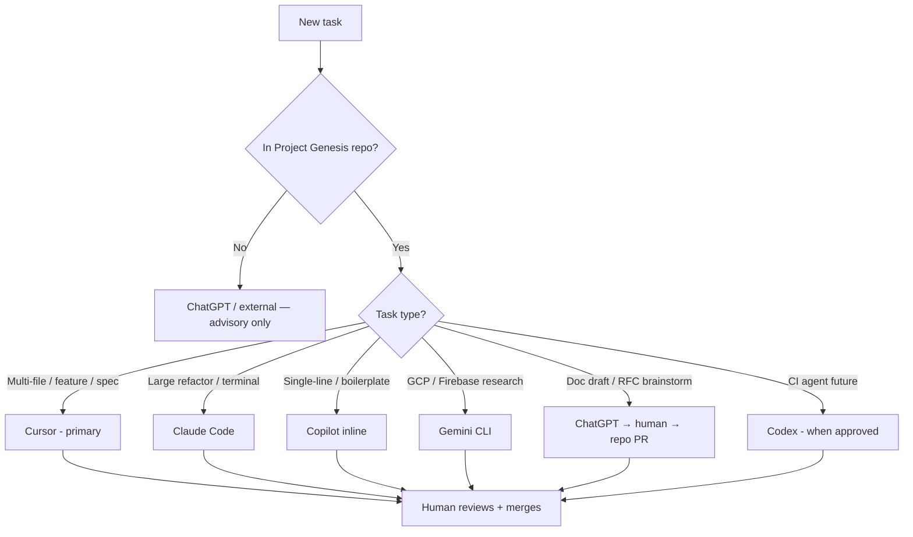
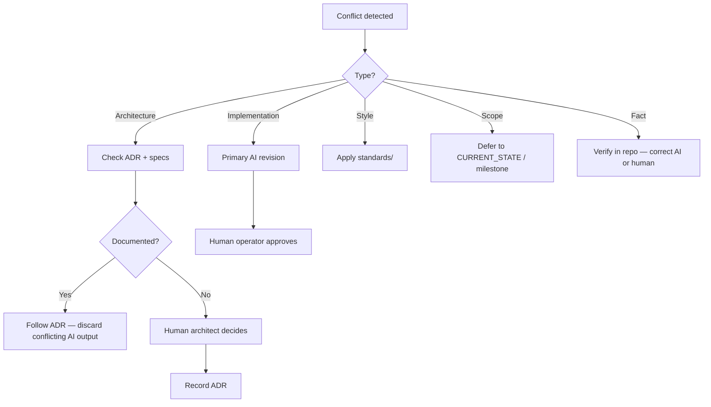
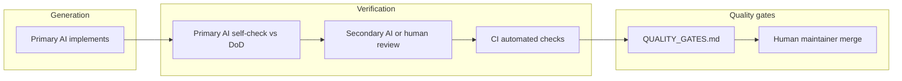
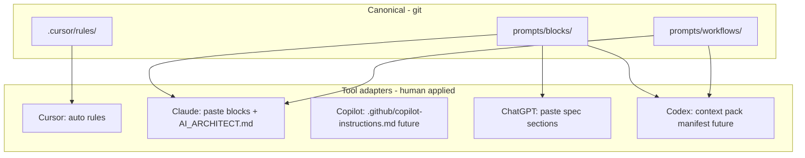

# Multi-AI Collaboration

## Purpose

Define how multiple AI coding assistants collaborate on Project Genesis without conflicting context, duplicated work, or unreviewed changes. This document establishes **which tool to use when**, how ownership is divided, and how humans arbitrate disagreements.

Project Genesis is AI-native ([ADR-004](../DECISION_LOG.md#adr-004-ai-native-development)). Cursor is the primary engineering OS ([ADR-008](../DECISION_LOG.md#adr-008-cursor-as-ai-operating-system)), but contributors may also use Claude Code, GitHub Copilot, Gemini CLI, ChatGPT, and future OpenAI Codex. **The repository is the source of truth**—not any single AI's session memory.

## Scope

### In scope

- Six supported assistant platforms and their roles
- Strengths, weaknesses, and selection criteria
- Conflict resolution between AI outputs
- Multi-AI review workflow
- Prompt, documentation, and code ownership model
- Human operator responsibilities

### Out of scope

- Runtime `@genesis/ai` engine implementation (see [specs/005-ai-engine/](../specs/005-ai-engine/))
- In-game player-facing AI features
- Model selection, API keys, or provider billing
- Actual tool configuration files

## Responsibilities

| Role | Responsibility |
|------|----------------|
| **Human operator** | Chooses primary AI per task; verifies all output; accountable for merge |
| **Primary AI** | Owns implementation session for assigned task; reads repo context first |
| **Secondary AI** | Review, critique, or alternate perspective—never silent override |
| **Chief Architect (human)** | Resolves architecture conflicts; accepts ADRs |
| **Maintainer** | Enforces disclosure, ownership rules, and merge gates |
| **Prompt owner** | Maintains versioned prompts in assigned directories |
| **All AI assistants** | Follow [AI_ARCHITECT.md](../AI_ARCHITECT.md); disclose limitations |

## Design principles

| Principle | Rule |
|-----------|------|
| **Repo over session** | Decisions live in git: ADRs, specs, rules—not chat history |
| **One primary per task** | One AI owns implementation; others advise or review |
| **Cursor is canonical for context** | `.cursor/rules/`, `.cursor/context/`, `.cursor/memories/` are the shared brain |
| **Provider-agnostic prompts** | Portable content in `prompts/`; Cursor-specific in `.cursor/` |
| **Human merges always** | No AI merges to `main` ([AI_CONTRIBUTION_POLICY.md](AI_CONTRIBUTION_POLICY.md)) |
| **Disclose all AI use** | PR lists every tool that materially contributed |

## Collaboration model



---

## Supported assistants

### Summary matrix

| Assistant | Primary role | Integration depth | Autonomy cap |
|-----------|--------------|-------------------|--------------|
| **Cursor** | Primary engineering OS | Deep (rules, context, agent) | L2 |
| **Claude Code** | Terminal / large-refactor agent | Medium (CLI, file access) | L2 |
| **GitHub Copilot** | Inline completion + chat in IDE | Medium (GitHub ecosystem) | L1 |
| **Gemini CLI** | CLI automation, Google ecosystem | Low–medium | L1 |
| **ChatGPT** | Planning, docs, architecture drafts | Low (paste context) | L1 |
| **OpenAI Codex** | Cloud agent, CI integration (future) | TBD | L2 (future) |

---

### Cursor

**Responsibilities**

- Primary agent for feature implementation, refactoring, and repo-wide changes
- Reads and applies `.cursor/rules/` automatically
- Executes workflow prompts from `.cursor/prompts/`
- Updates `.cursor/context/` and `.cursor/memories/` when directed

**Strengths**

| Strength | Detail |
|----------|--------|
| Deep repo context | Rules, context, memories, and specs in workspace |
| Agent mode | Multi-file edits, terminal, search across codebase |
| Project Genesis OS | Purpose-built via ADR-008; `check-cursor-workspace.sh` validation |
| Architecture enforcement | 14 behavior rules always applied |
| Review integration | Bugbot, PR review subagents (when enabled) |

**Weaknesses**

| Weakness | Mitigation |
|----------|------------|
| Session context limits | Rely on `.cursor/context/` not chat memory |
| May over-implement | Narrow tasks; require plan approval for Tier 2+ |
| Cursor-specific assumptions | Portable prompts live in `prompts/`, not only `.cursor/` |

**When to use**

- Default for all in-repo engineering work
- Multi-file features, specs implementation, governance docs
- Architecture reviews using `.cursor/prompts/architecture-review.md`
- Any task requiring `.cursor/rules/` enforcement

**When not to use**

- Quick one-liner completions (Copilot may be faster)
- Contributors without Cursor access (use Claude Code + manual rule reading)

---

### Claude Code

**Responsibilities**

- Terminal-native agent sessions for large refactors or batch operations
- Secondary implementer when Cursor unavailable
- Deep reasoning tasks with explicit file context

**Strengths**

| Strength | Detail |
|----------|--------|
| Strong reasoning | Complex refactors, dependency analysis |
| Terminal workflow | Scripting, CI debugging, monorepo operations |
| Long context | Large spec + code files in one session |
| Careful diffs | Often produces focused changes |

**Weaknesses**

| Weakness | Mitigation |
|----------|------------|
| No auto `.cursor/rules/` | Operator pastes or points to `AI_ARCHITECT.md` reading order |
| Separate session state | Write decisions to ADR/spec before switching tools |
| May miss Cursor memories | Read `.cursor/memories/` explicitly at session start |

**When to use**

- Large cross-package refactors
- Sprint housekeeping (renames, import fixes)
- Implementing from an approved spec when Cursor is unavailable
- Exploring alternatives before committing to architecture

**When not to use**

- As silent second implementer on same branch without coordination
- Governance changes without human architect review

---

### GitHub Copilot

**Responsibilities**

- Inline code completion and small suggestions
- GitHub.com PR chat and Copilot Workspace (when used)
- Accelerating boilerplate within open files

**Strengths**

| Strength | Detail |
|----------|--------|
| Low friction | Completions while typing |
| GitHub integration | PR summaries, issue context on github.com |
| Fast boilerplate | Tests, types, repetitive patterns |
| Familiar to contributors | Works in VS Code, JetBrains |

**Weaknesses**

| Weakness | Mitigation |
|----------|------------|
| Limited repo-wide context | Don't rely on it for architecture decisions |
| Completion bias | Review every suggestion; reject hallucinated APIs |
| No Genesis rules auto-load | Human enforces standards |
| Shallow multi-file scope | Use Cursor/Claude Code for cross-package work |

**When to use**

- Unit test scaffolding
- Type definitions, interfaces, JSDoc
- Small functions within an established pattern
- PR description drafts (human edits required)

**When not to use**

- Kernel or plugin contract changes
- New package creation
- Security-sensitive code without human line-by-line review

---

### Gemini CLI

**Responsibilities**

- Command-line agent tasks in Google-centric workflows
- Automation experiments and scripting assistance
- Secondary tool for contributors in Google Cloud / Android ecosystem

**Strengths**

| Strength | Detail |
|----------|--------|
| CLI-native | Fits terminal-first workflows |
| Google ecosystem | Firebase, GCP docs familiarity |
| Fast iteration | Quick scripts and one-off analysis |

**Weaknesses**

| Weakness | Mitigation |
|----------|------------|
| No Genesis OS integration | Manual context injection |
| Variable repo awareness | Paste spec sections; verify against repo |
| Less project-specific tuning | Treat as generic assistant + strict review |

**When to use**

- Firebase/GCP plugin research (Phase 2+)
- Android/mobile deployment scripts
- Exploratory CLI tooling prototypes

**When not to use**

- Canonical spec or governance authoring
- Primary implementer for core packages

---

### ChatGPT

**Responsibilities**

- Early-stage planning, brainstorming, and document drafts
- Explaining architecture to new contributors
- Reviewing pasted diffs or specs (advisory only)

**Strengths**

| Strength | Detail |
|----------|--------|
| Accessible | No IDE required |
| Strong prose | Specs, RFCs, migration guides, release notes |
| Teaching | Onboarding explanations |
| Brainstorming | Alternatives before RFC |

**Weaknesses**

| Weakness | Mitigation |
|----------|------------|
| No direct repo access | Never commit ChatGPT output without verification |
| Stale training | Always validate against current `specs/` and ADRs |
| Context paste limits | Summarize; link to canonical docs |
| No enforcement | Output is draft until human + primary AI validate |

**When to use**

- Draft RFC or ADR outlines before repo PR
- User-facing documentation and tutorials
- Reviewing a pasted PR diff for obvious issues (second opinion)
- Sprint planning narratives

**When not to use**

- Direct code commits without repo verification
- Security-sensitive design without security steward
- Authoritative architecture decisions (use ADR in repo)

---

### OpenAI Codex (future)

**Responsibilities (planned)**

- Cloud-hosted autonomous coding agent
- CI-triggered tasks: dependency updates, doc sync, test generation
- Parallel workstreams under human-defined policies

**Strengths (anticipated)**

| Strength | Detail |
|----------|--------|
| API/automation | Headless agent runs in pipelines |
| Sandboxed execution | Isolated environments for risky tasks |
| Scale | Multiple tasks in parallel |

**Weaknesses (anticipated)**

| Weakness | Mitigation |
|----------|------------|
| Limited Genesis OS | Inject `prompts/blocks/` + rules as context pack |
| Autonomy risk | Cap at L2; policy gates per [LONG_TERM_VISION.md](../docs/000-foundation/LONG_TERM_VISION.md) |
| New surface area | Security review before production use |

**When to use (future)**

- Scheduled maintenance: lint fixes, import sorting, doc link checks
- Approved L3 lanes with full Quality Gates
- Batch test generation from approved specs

**When not to use (future)**

- Until RFC + security review completed
- Kernel changes without architect sign-off
- Any task without `genesis validate` gate (when available)

---

## When to use each AI — decision tree



### Task routing table

| Task | Primary | Secondary | Human required |
|------|---------|-----------|----------------|
| Implement CLI command | Cursor | Copilot (tests) | Review + merge |
| Cross-package refactor | Claude Code | Cursor review | Architect if Tier 3 |
| Write functional spec | Cursor or ChatGPT draft | Cursor finalize | Architect approve |
| Inline test cases | Copilot | — | Spot check |
| RFC brainstorm | ChatGPT | Cursor formalize | Maintainer triage |
| PR code review | Cursor agent / human | ChatGPT second opinion | Maintainer merge |
| Security fix | Cursor | — | Security steward |
| Prompt authoring | Cursor | ChatGPT draft | Prompt owner PR |
| Dependency bump | Copilot/Codex future | CI | Maintainer |

---

## Conflict resolution

Conflicts occur when two AI assistants (or AI and human) produce incompatible advice or code.

### Conflict types

| Type | Example | Resolver |
|------|---------|----------|
| **Architecture** | Cursor adds domain logic to CLI; Claude puts it in core | Chief Architect + ADR |
| **Implementation** | Different API shapes for same spec | Primary AI + spec author |
| **Style** | Naming, file layout | [standards/](../standards/) — not AI preference |
| **Scope** | One AI expands scope beyond sprint | [CURRENT_STATE.md](../.cursor/context/CURRENT_STATE.md) |
| **Fact** | Hallucinated package vs real API | Repo files + specs win |

### Resolution workflow



### Precedence hierarchy

When sources disagree, apply this order (highest wins):

1. **Accepted ADR** in [DECISION_LOG.md](../DECISION_LOG.md)
2. **Functional spec** in `specs/`
3. **Governance** in `governance/`
4. **Standards** in `standards/`
5. **Existing code** on `main`
6. **`.cursor/context/`** current state
7. **AI suggestion** — lowest priority

### Multi-AI session rules

| Rule | Description |
|------|-------------|
| **MR1** | Never run two AIs implementing the same branch simultaneously |
| **MR2** | Switching primary AI mid-task requires written handoff in issue/PR comment |
| **MR3** | Secondary AI reviews; does not push commits unless assigned primary |
| **MR4** | Conflicting PRs from different AIs → close one; human picks approach |
| **MR5** | Document resolution in PR: "Chose approach A per ADR-001" |

### Handoff template

```markdown
## AI handoff
- **From:** Cursor Agent (session X)
- **To:** Claude Code
- **Branch:** feature/cli-doctor
- **Done:** Config loader tests, doctor command skeleton
- **Remaining:** Plugin compatibility checks per spec §4.2.3
- **Decisions:** Health checks read-only; no new kernel API
- **Read first:** specs/001-cli/FUNCTIONAL_SPEC.md §4.2, packages/cli/README.md
```

---

## Review workflow

Multi-AI review separates **generation** from **verification**.



### Review roles by AI

| Role | Tool options | Output |
|------|--------------|--------|
| **Author** | Primary AI (Cursor, Claude Code) | Branch + PR |
| **Self-review** | Same primary AI | DoD + Quality Gates checklist |
| **Peer review** | Different AI or human | PR comments |
| **Architecture review** | Cursor + human architect | Tier 2+ approval |
| **Security review** | Human steward; AI assists triage | G5 sign-off |
| **Merge** | Human maintainer only | Squash merge |

### Recommended review pairings

| Generated by | Reviewed by | Why |
|--------------|-------------|-----|
| Cursor | Human + optional ChatGPT diff review | Primary path |
| Claude Code | Cursor agent or human | Cross-check against rules |
| Copilot completions | Human line-by-line | High hallucination risk |
| ChatGPT draft docs | Cursor or human editor | Validate links and facts |
| Gemini CLI script | Human + CI | Verify commands |

### Review checklist (all AI-generated PRs)

- [ ] AI disclosure lists all tools used
- [ ] Quality Gates table complete ([QUALITY_GATES.md](../specs/000-project/QUALITY_GATES.md))
- [ ] No invented dependencies or APIs
- [ ] Matches spec and phase constraints
- [ ] Tests run locally—not just AI claim
- [ ] Secondary reviewer did not assume primary AI was correct

---

## Prompt ownership

Prompts are **versioned assets** shared across assistants where possible.

### Ownership map

| Location | Owner | Audience | Portable? |
|----------|-------|----------|-----------|
| `.cursor/rules/` | Architecture team | Cursor (auto-loaded) | No — export principles to `prompts/blocks/` |
| `.cursor/prompts/` | Cursor workflow owners | Cursor agents | Partial — summarize in `prompts/workflows/` |
| `prompts/blocks/` | AI platform team | All assistants | **Yes** |
| `prompts/workflows/` | AI platform team | All assistants | **Yes** |
| `prompts/templates/` | Feature owners | `@genesis/ai` runtime (future) | **Yes** |
| ChatGPT custom GPTs | **Not canonical** | External only | Never source of truth |

### Cross-assistant prompt strategy



### Prompt change workflow

1. Edit portable content in `prompts/` first when possible
2. Mirror or adapt in `.cursor/` for Cursor-specific behavior
3. Version bump per [AI_CONTRIBUTION_POLICY.md](AI_CONTRIBUTION_POLICY.md)
4. PR reviewed by prompt owner + one maintainer
5. Update [prompts/README.md](../prompts/README.md) if assembly changes

### Conflict: two prompts disagree

Portable `prompts/blocks/` wins over `.cursor/prompts/` for factual content. Cursor-specific formatting stays in `.cursor/`. Human prompt owner reconciles in one PR.

---

## Documentation ownership

| Doc type | Canonical location | Primary author AI | Approver |
|----------|-------------------|-------------------|----------|
| Functional specs | `specs/` | Cursor | Human architect |
| Governance | `governance/` | Cursor | Maintainer |
| Foundation / vision | `docs/` | Cursor or ChatGPT draft | Chief Architect |
| Standards | `standards/` | Cursor | Standards owner |
| Knowledge | `knowledge/` | Any AI + human | Maintainer |
| Package READMEs | `packages/*/README.md` | Primary implementer AI | Package owner |
| ADRs | `DECISION_LOG.md` | Cursor or ChatGPT draft | Chief Architect |
| RFCs | `docs/rfcs/` | ChatGPT brainstorm → Cursor formalize | Maintainer |
| AI context | `.cursor/context/` | Cursor | Engineering lead |

### Rules

| Rule | Description |
|------|-------------|
| **DOC1** | ChatGPT/Google Docs drafts are not canonical until merged to git |
| **DOC2** | One PR should not mix unrelated doc systems (e.g. spec + governance) without reason |
| **DOC3** | AI updates `PROJECT_STATUS.md` only when human directs post-merge |
| **DOC4** | Duplicate content forbidden — cross-reference per [DOCUMENTATION_POLICY.md](DOCUMENTATION_POLICY.md) |

---

## Code ownership

Code ownership follows [GITHUB_WORKFLOW.md](GITHUB_WORKFLOW.md) CODEOWNERS — **humans and teams own paths; AI does not own code**.

| Path | Human owner | Primary AI implementer | Review AI |
|------|-------------|------------------------|-----------|
| `packages/core/` | Kernel team | Cursor | Claude Code (refactors) |
| `packages/cli/` | CLI team | Cursor | Copilot (completions) |
| `packages/ai/` | AI platform team | Cursor | ChatGPT (design drafts) |
| `packages/plugins/` | Plugin team | Cursor / Claude Code | Cursor |
| `governance/` | Architects | Cursor | Human only |
| `specs/` | Architects | Cursor | Human architect |
| `.cursor/` | Architecture team | Cursor | Human only |

### AI code attribution

Every PR with AI code:

```markdown
## AI disclosure
- **Primary:** Cursor Agent
- **Secondary:** GitHub Copilot (inline tests)
- **Scope:** Implementation + tests
- **Human review:** @operator verified all files
```

### AI must not

- Modify CODEOWNERS to assign itself
- Bypass required reviews by splitting PRs across tools
- Commit to protected paths without owner approval

---

## Examples

### Example 1 — Standard feature (Cursor primary)

1. **Human** assigns: "Implement `genesis doctor` per spec §4.2"
2. **Cursor** reads rules → spec → implements with tests
3. **Copilot** assists inline test assertions while human watches
4. **Cursor** self-checks Quality Gates
5. **Human** opens PR, discloses Cursor + Copilot
6. **Human reviewer** approves; maintainer merges

### Example 2 — Spec draft (ChatGPT → Cursor)

1. **Human** brainstorms RFC with **ChatGPT** (external)
2. **Human** pastes outline into **Cursor** to formalize `docs/rfcs/0003-*.md`
3. **Maintainer** runs RFC comment period
4. **Cursor** implements after RFC accepted — ChatGPT not involved in code

### Example 3 — Conflict resolution

1. **Claude Code** puts validation in `packages/cli/`
2. **Human** asks **Cursor** to review PR
3. **Cursor** flags layer violation — validation belongs in `@genesis/config`
4. **Human architect** confirms per ADR-001
5. **Claude Code** session handoff → fix moved to correct package
6. PR comment documents resolution

### Example 4 — Multi-AI review without multi-AI implement

1. **Cursor** implements security fix
2. **Human** pastes diff to **ChatGPT**: "Find vulnerabilities"
3. ChatGPT suggests additional input validation
4. **Human** evaluates; adds one valid suggestion
5. **Security steward** approves G5 gate
6. Merge — ChatGPT credited in disclosure as advisory only

### Example 5 — Wrong tool choice (anti-pattern)

1. **Copilot** generates entire new `packages/validator/` package via completions
2. No spec, no ADR, scattered files
3. **Maintainer** rejects PR — wrong primary AI for scope
4. **Human** reassigns to **Cursor** with spec link and plan approval

---

## Best practices

- Default to **Cursor** for in-repo work; specialize other tools deliberately
- Start every non-Cursor session by reading `AI_ARCHITECT.md` reading order
- Write handoffs when switching primary AI mid-branch
- Use **ChatGPT for drafts**, **Cursor for commits**
- Never merge because "the AI said it works" — run tests
- Keep portable prompts in `prompts/blocks/` for tool independence
- Record architecture conflicts as ADRs, not chat logs
- Disclose every AI tool in PR — including Copilot and advisory ChatGPT
- One primary implementer per branch; reviewers use different tools when possible

---

## Related documents

| Document | Relationship |
|----------|--------------|
| [AI_ARCHITECT.md](../AI_ARCHITECT.md) | Single-assistant operating guide |
| [AI_CONTRIBUTION_POLICY.md](AI_CONTRIBUTION_POLICY.md) | Autonomy, disclosure, prohibited actions |
| [ADR-004](../DECISION_LOG.md#adr-004-ai-native-development) | AI-native development |
| [ADR-008](../DECISION_LOG.md#adr-008-cursor-as-ai-operating-system) | Cursor as primary OS |
| [specs/005-ai-engine/](../specs/005-ai-engine/) | Runtime AI engine (future) |
| [specs/000-project/QUALITY_GATES.md](../specs/000-project/QUALITY_GATES.md) | PR verification |
| [DOCUMENTATION_POLICY.md](DOCUMENTATION_POLICY.md) | Doc ownership rules |
| [GITHUB_WORKFLOW.md](GITHUB_WORKFLOW.md) | CODEOWNERS, PR templates |
| [prompts/README.md](../prompts/README.md) | Portable prompt system |
| [.cursor/README.md](../.cursor/README.md) | Cursor AI OS |
| [docs/000-foundation/LONG_TERM_VISION.md](../docs/000-foundation/LONG_TERM_VISION.md) | Autonomous development horizon |

## Changelog

| Version | Date | Change |
|---------|------|--------|
| 1.0.0 | 2026-07-26 | Initial approved specification |
