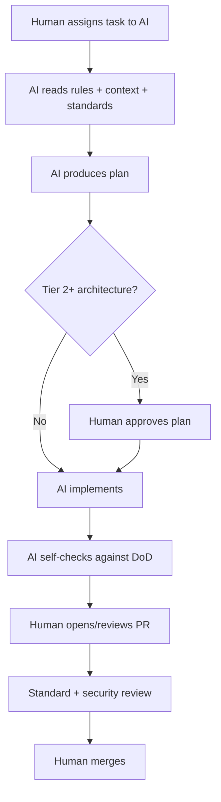

# AI Contribution Policy

## Purpose

Define how AI coding assistants participate in Project Genesis: what they may do autonomously, what requires human approval, and how AI-generated work is reviewed, attributed, and secured.

Project Genesis is AI-native ([ADR-004](../DECISION_LOG.md#adr-004-ai-native-development), [ADR-008](../DECISION_LOG.md#adr-008-cursor-as-ai-operating-system)). This policy ensures AI accelerates delivery without compromising quality, security, or architectural integrity.

## Responsibilities

| Role | Responsibility |
|------|----------------|
| **Human operator** | Supervises AI output; accountable for merged code |
| **AI assistant** | Follow [AI_ARCHITECT.md](../AI_ARCHITECT.md) and [`.cursor/rules/`](../.cursor/rules/) |
| **Reviewer** | Treat AI-generated PRs with same rigor as human PRs |
| **Maintainers** | Reject undisclosed or non-compliant AI contributions |
| **Prompt owners** | Version and review prompts in `prompts/` and `.cursor/prompts/` |

## Scope

Applies to:

- Cursor, Claude Code, GitHub Copilot, Gemini CLI, ChatGPT, OpenAI Codex (future)
- AI-generated code, docs, specs, tests, and prompts committed to the repo

See [AI_COLLABORATION.md](AI_COLLABORATION.md) for multi-assistant roles, conflict resolution, and ownership.

Does not apply to:

- In-game AI features (player-facing) — see `specs/005-ai-engine/`
- End-user use of Genesis tools with their own API keys

## Autonomy levels

| Level | AI may | Human must |
|-------|--------|------------|
| **L0 – Suggest** | Propose edits in IDE | Accept or reject each change |
| **L1 – Draft** | Open draft PRs, write docs/specs | Review, test, and merge |
| **L2 – Implement** | Implement approved specs/tasks | Architecture review for Tier 2+ |
| **L3 – Autonomous** | *Not permitted for `main`* | N/A |

**Rule:** AI never merges to `main`. A human maintainer always approves merge.

## Workflow



### Required reading order for AI

Per [AI_ARCHITECT.md](../AI_ARCHITECT.md):

1. [`.cursor/rules/`](../.cursor/rules/)
2. [`.cursor/context/`](../.cursor/context/)
3. [`.cursor/memories/`](../.cursor/memories/)
4. [standards/](../standards/)
5. [governance/](README.md) (this policy)
6. [specs/](../specs/) for relevant subsystem
7. Existing implementation

### Disclosure requirements

Every PR with material AI assistance must state:

```markdown
## AI disclosure
- **Tool:** Cursor Agent / Copilot / other
- **Scope:** Implementation / tests / docs / spec draft
- **Human review:** All changes verified by [name]
```

Undisclosed AI-generated PRs may be sent back for full human review.

## Permitted activities

| Activity | Conditions |
|----------|------------|
| Generate code from approved specs | Spec exists; tests included |
| Write documentation | Follow [DOCUMENTATION_POLICY.md](DOCUMENTATION_POLICY.md) |
| Refactor within package | No behavior change; tests pass |
| Draft ADRs/RFCs | Human architect accepts |
| Fix bugs | Regression test required |
| Create prompts | Versioned; no secrets embedded |

## Prohibited activities

| Activity | Reason |
|----------|--------|
| Merge without human approval | Accountability |
| Commit secrets or API keys | Security |
| Implement against superseded ADRs | Architecture integrity |
| Skip tests "to save time" | Quality |
| Add dependencies without review | Supply chain risk |
| Modify governance without RFC | Process integrity |
| Exfiltrate private data to external models | Privacy |
| Force-push shared branches | Collaboration |
| Out-of-phase features | [CURRENT_STATE.md](../.cursor/context/CURRENT_STATE.md) |

## Prompt and AI asset governance

Prompts are versioned assets ([`.cursor/rules/06-ai-development.mdc`](../.cursor/rules/06-ai-development.mdc)):

| Location | Purpose |
|----------|---------|
| `.cursor/prompts/` | Cursor task prompts |
| `prompts/blocks/` | Composable prompt blocks |
| `prompts/workflows/` | Multi-step AI workflows |
| `.cursor/rules/` | Always-on behavior rules |

Changes to prompts require:

- Version bump or new file version
- PR review (docs or code reviewer)
- No hardcoded secrets or environment-specific values

## Security considerations

AI contributions face amplified risks:

| Risk | Mitigation |
|------|------------|
| **Hallucinated APIs** | Verify against specs and existing code |
| **Invented dependencies** | Confirm package exists before adding |
| **Prompt injection** | Sanitize user input in AI-facing tools |
| **Secret leakage** | Never include `.env` in context; use [SECURITY_REVIEW_PROCESS.md](SECURITY_REVIEW_PROCESS.md) |
| **License contamination** | No copying unidentified code from training |

Security-sensitive AI work requires security steward review.

## Examples

### Compliant AI session

1. Human: "Implement `genesis doctor` per spec §4.2"
2. AI reads `specs/001-cli/FUNCTIONAL_SPEC.md`, `PACKAGES.md`, rules
3. AI implements in `packages/cli` with tests
4. Human runs tests, opens PR with AI disclosure
5. Reviewer approves; maintainer merges

### Non-compliant — rejected

AI adds `@genesis/payments` package with Stripe integration during Phase 1.

**Violation:** Out of phase; no spec; no ADR.

**Action:** Close PR; defer to RFC when milestone allows.

### Compliant — AI drafts spec

AI drafts `specs/004-scaffolding/FUNCTIONAL_SPEC.md` section.

Human architect edits and approves spec **before** implementation PR.

## Best practices

- Give AI narrow, spec-linked tasks—not vague "build the framework"
- Require plans for Tier 2+ changes before code generation
- Treat AI output as untrusted until tested
- Prefer AI for boilerplate; human judgment for architecture
- Keep [`.cursor/memories/`](../.cursor/memories/) updated so AI has accurate context
- Run [check-cursor-workspace.sh](../scripts/check-cursor-workspace.sh) after AI OS changes
- Optimize for maintainable systems, not line count ([AI_ARCHITECT.md](../AI_ARCHITECT.md))

## Related documents

- [AI_COLLABORATION.md](AI_COLLABORATION.md) — Multi-AI collaboration
- [AI_ARCHITECT.md](../AI_ARCHITECT.md)
- [CONTRIBUTING.md](../CONTRIBUTING.md)
- [ENGINEERING_PRINCIPLES.md](ENGINEERING_PRINCIPLES.md)
- [PULL_REQUEST_PROCESS.md](PULL_REQUEST_PROCESS.md)
- [ARCHITECTURE_REVIEW_PROCESS.md](ARCHITECTURE_REVIEW_PROCESS.md)
- [SECURITY_REVIEW_PROCESS.md](SECURITY_REVIEW_PROCESS.md)
- [DOCUMENTATION_POLICY.md](DOCUMENTATION_POLICY.md)
- [ADR-004](../DECISION_LOG.md#adr-004-ai-native-development)
- [ADR-008](../DECISION_LOG.md#adr-008-cursor-as-ai-operating-system)
- [specs/005-ai-engine/](../specs/005-ai-engine/)
- [.cursor/rules/06-ai-development.mdc](../.cursor/rules/06-ai-development.mdc)

## Changelog

| Version | Date | Change |
|---------|------|--------|
| 1.0.0 | 2026-07-26 | Initial approved version |
