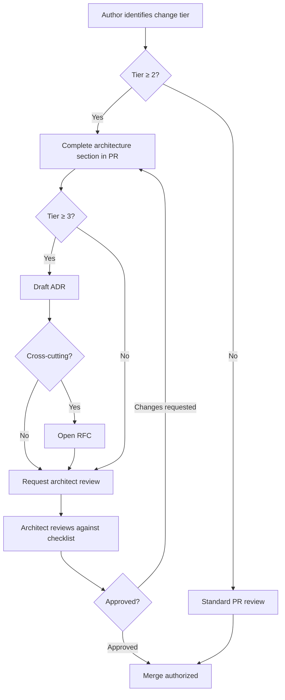

# Architecture Review Process

## Purpose

Ensure significant structural changes preserve Clean Architecture, plugin boundaries, and long-term maintainability before they merge. Architecture review is a **quality gate**, not a bottleneck.

## Responsibilities

| Role | Responsibility |
|------|----------------|
| **Author** | Identify review tier; provide design summary, diagrams, and ADR when required |
| **Reviewer (architect)** | Evaluate layer boundaries, dependencies, extensibility, and ADR alignment |
| **Maintainer** | Enforce review completion before merge for Tier 2+ changes |
| **Chief Architect** | Final decision on disputes; approves kernel and public API changes |

## When review is required

| Tier | Trigger | Reviewer | Artifact |
|------|---------|----------|----------|
| **Tier 0** | Typo, comment, non-behavioral doc fix | Standard PR review | None |
| **Tier 1** | Single-package internal change; no new public API | Any maintainer | PR description |
| **Tier 2** | New public API, cross-package dependency, new plugin | Architect reviewer | PR + architecture section |
| **Tier 3** | Kernel change, new package, breaking change, new integration | Chief Architect + architect | ADR + RFC if cross-cutting |
| **Tier 4** | Platform direction, license, security model | Maintainers + RFC process | RFC + ADR |

Reference: [specs/100-architecture/PACKAGES.md](../specs/100-architecture/PACKAGES.md), [specs/100-architecture/KERNEL.md](../specs/100-architecture/KERNEL.md).

## Workflow

### Review checklist

Reviewers verify:

- [ ] Dependencies point inward ([ADR-001](../DECISION_LOG.md#adr-001-clean-architecture))
- [ ] No circular dependencies between packages
- [ ] Plugin boundaries respected ([ADR-002](../DECISION_LOG.md#adr-002-plugin-architecture))
- [ ] Public APIs are minimal, typed, and documented
- [ ] Error and logging strategy defined at boundaries
- [ ] Tests cover domain and integration concerns
- [ ] No contradiction with existing ADRs (or ADR supersedes old decision)
- [ ] Phase constraints respected ([CURRENT_STATE.md](../.cursor/context/CURRENT_STATE.md))

Use [`.cursor/prompts/architecture-review.md`](../.cursor/prompts/architecture-review.md) as the review guide.

## Examples

### Tier 2 — new CLI command namespace

**Change:** Add `genesis game build` command calling `@genesis/scaffolding`.

**Author provides:**

- Packages touched: `cli`, `scaffolding`, `core`
- Dependency diagram showing CLI → application → domain
- Link to [specs/001-cli/COMMAND_REFERENCE.md](../specs/001-cli/COMMAND_REFERENCE.md)

**Outcome:** Architect approves; no ADR required (spec already exists).

### Tier 3 — kernel event bus redesign

**Change:** Replace synchronous hooks with async event queue in `@genesis/core`.

**Author provides:**

- RFC summarizing motivation and migration path
- ADR with consequences for all plugins
- Compatibility matrix for plugin API semver

**Outcome:** RFC discussion → ADR accepted → implementation PRs split by package.

### Rejected — layer violation

**Change:** Import AWS SDK directly in domain entity.

**Reviewer action:** Request changes. Domain must use port interface; AWS adapter lives in infrastructure plugin.

## Best practices

- Request architecture review **before** large implementation efforts
- Prefer small PRs that each pass review over one giant "architecture PR"
- Include mermaid diagrams for dependency and sequence changes
- Link to functional specs in `specs/` rather than duplicating requirements in PRs
- Record rejected alternatives in ADRs for future context
- For AI-generated designs, human architect must sign off on Tier 2+

## Related documents

- [ENGINEERING_PRINCIPLES.md](ENGINEERING_PRINCIPLES.md)
- [ADR_PROCESS.md](ADR_PROCESS.md)
- [RFC_PROCESS.md](RFC_PROCESS.md)
- [PULL_REQUEST_PROCESS.md](PULL_REQUEST_PROCESS.md)
- [specs/100-architecture/PACKAGES.md](../specs/100-architecture/PACKAGES.md)
- [specs/100-architecture/KERNEL.md](../specs/100-architecture/KERNEL.md)
- [standards/ARCHITECTURE_STANDARD.md](../standards/ARCHITECTURE_STANDARD.md)
- [DECISION_LOG.md](../DECISION_LOG.md)
- [AI_ARCHITECT.md](../AI_ARCHITECT.md)

## Changelog

| Version | Date | Change |
|---------|------|--------|
| 1.0.0 | 2026-07-26 | Initial approved version |
