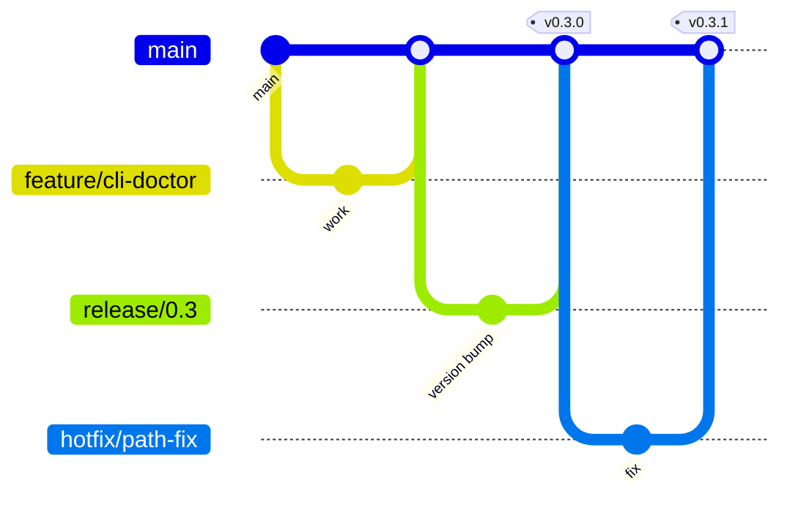

# Branching Strategy

## Purpose

Define branch types, naming conventions, and merge rules so parallel work proceeds safely without destabilizing `main` or blocking releases.

## Responsibilities

| Role | Responsibility |
|------|----------------|
| **Contributors** | Create appropriately named branches; keep scope focused |
| **Reviewers** | Verify branch base is current before merge |
| **Maintainers** | Protect `main`; enforce merge requirements |
| **Release manager** | Manage `release/*` and `hotfix/*` lifecycle |

## Branch model



### Protected branches

| Branch | Protection |
|--------|------------|
| `main` | Require PR, CI pass, 1+ approval; no direct push |
| `release/*` | Release manager + maintainer approval |
| `hotfix/*` | Expedited review; still requires CI |

## Branch types

| Prefix | Purpose | Base branch | Merge target | Lifetime |
|--------|---------|-------------|--------------|----------|
| `feature/` | New capability | `main` | `main` | Delete after merge |
| `bugfix/` | Non-urgent defect fix | `main` | `main` | Delete after merge |
| `docs/` | Documentation only | `main` | `main` | Delete after merge |
| `refactor/` | No behavior change | `main` | `main` | Delete after merge |
| `test/` | Test infrastructure | `main` | `main` | Delete after merge |
| `chore/` | Tooling, deps, CI | `main` | `main` | Delete after merge |
| `release/` | Release stabilization | `main` | `main` + tag | Delete after release |
| `hotfix/` | Urgent production fix | `main` or `release/*` | `main` (+ backport) | Delete after merge |

Authoritative prefix list also in [standards/GIT_STANDARD.md](../standards/GIT_STANDARD.md) and [`.cursor/rules/12-git-workflow.mdc`](../.cursor/rules/12-git-workflow.mdc).

## Naming conventions

```
{type}/{short-kebab-description}
{type}/{issue-id}-{short-kebab-description}   # when issue exists
```

### Examples

| Good | Bad |
|------|-----|
| `feature/cli-doctor-command` | `feature/john-work` |
| `bugfix/config-validation-null` | `fix` |
| `docs/governance-index` | `docs-update` |
| `hotfix/template-path-traversal` | `hotfix` |

Keep names under 50 characters; describe the *outcome*, not the activity.

## Workflow

### Feature development

1. Sync `main`: `git fetch origin && git checkout main && git pull`
2. Create branch: `git checkout -b feature/my-feature`
3. Commit with conventional prefixes ([CONTRIBUTING.md](../CONTRIBUTING.md))
4. Rebase or merge `main` before PR if branch is stale
5. Open PR → review → merge
6. Delete remote branch

### Release branch

1. Release manager creates `release/0.3` from `main`
2. Only bug fixes and version bumps allowed on release branch
3. Tag `v0.3.0` from release branch tip
4. Merge `release/0.3` back to `main`
5. Delete `release/0.3`

### Hotfix

1. Branch `hotfix/critical-issue` from tagged commit or `main`
2. Fix + test + expedited review
3. Merge to `main`; tag PATCH release
4. If active `release/*` exists, cherry-pick to release branch

## Merge strategy

| Scenario | Strategy |
|----------|----------|
| Feature PRs | **Squash merge** (default) — one commit per PR on `main` |
| Release PRs | **Merge commit** — preserve release branch history |
| Hotfix | **Squash merge** — single fix commit |

Squash commit message = PR title; body = PR summary.

## Examples

### Parallel features

```
main
├── feature/cli-doctor      → PR #10
├── feature/config-schema   → PR #11
└── docs/governance-model   → PR #12
```

All three merge independently after review. Conflicts resolved by rebasing onto latest `main`.

### Release freeze

During `release/0.3` stabilization:

- ✅ `bugfix/doctor-false-positive` → cherry-pick to release branch
- ❌ `feature/game-generate` → waits for 0.4.0

## Best practices

- One concern per branch; split large efforts
- Pull `main` frequently; avoid week-long drift
- Do not commit broken code—even on feature branches
- Use draft PRs for early feedback
- Delete merged branches promptly
- Never force-push `main` or shared release branches

## Related documents

- [standards/GIT_STANDARD.md](../standards/GIT_STANDARD.md)
- [CONTRIBUTING.md](../CONTRIBUTING.md)
- [PULL_REQUEST_PROCESS.md](PULL_REQUEST_PROCESS.md)
- [RELEASE_STRATEGY.md](RELEASE_STRATEGY.md)
- [.cursor/rules/12-git-workflow.mdc](../.cursor/rules/12-git-workflow.mdc)
- [DEVELOPMENT_WORKFLOW.md](../DEVELOPMENT_WORKFLOW.md)

## Changelog

| Version | Date | Change |
|---------|------|--------|
| 1.0.0 | 2026-07-26 | Initial approved version |
