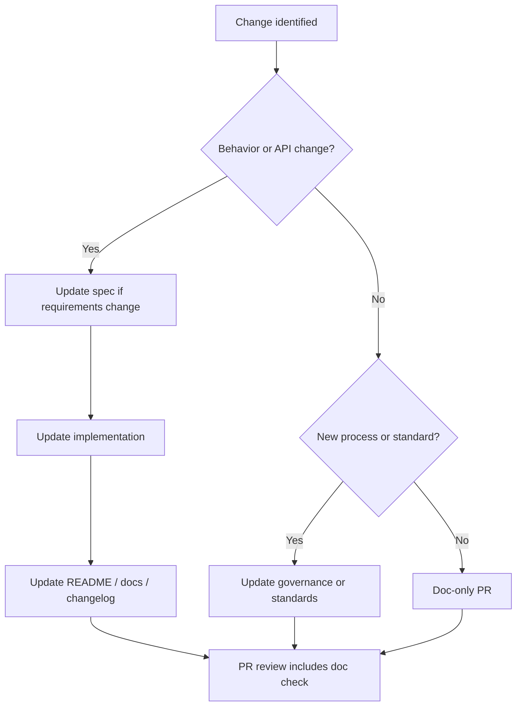

# Documentation Policy

## Purpose

Establish what must be documented, where documents live, when they must be updated, and how documentation quality is enforced. Project Genesis is documentation-first ([ADR-007](../DECISION_LOG.md#adr-007-documentation-first-bootstrap)); this policy makes that operational.

## Responsibilities

| Role | Responsibility |
|------|----------------|
| **Authors** | Update docs in the same PR as behavioral changes |
| **Reviewers** | Reject PRs that change behavior without doc updates |
| **Maintainers** | Keep index READMEs current; prevent duplicate sources of truth |
| **Doc owners** | Own accuracy of `docs/`, `specs/`, `governance/` sections |
| **AI assistants** | Read docs before implementing; produce docs as deliverables |

## Documentation taxonomy

| Location | Purpose | Audience | Mandatory |
|----------|---------|----------|-----------|
| `docs/` | Official project, vision, foundation | All stakeholders | Governance docs |
| `specs/` | Functional and architecture specifications | Implementers | Before implementation |
| `governance/` | Processes and policies | Contributors | Process compliance |
| `standards/` | Mandatory engineering rules | Engineers, AI | Always |
| `knowledge/` | Evergreen reference | Engineers | Informative |
| `templates/` | Generation scaffolds | Tooling, AI | When generating |
| `prompts/` | Composable AI prompts | AI operators | Versioned assets |
| `.cursor/` | AI operating system | Cursor agents | AI sessions |
| `packages/*/README.md` | Package API and usage | Package consumers | Per package |
| `DECISION_LOG.md` | ADRs | Architects | Significant decisions |

**Rule:** Do not duplicate content. Cross-reference canonical sources.

## Required document structure

Per [standards/DOCUMENTATION_STANDARD.md](../standards/DOCUMENTATION_STANDARD.md):

| Section | Required |
|---------|----------|
| Title | Yes |
| Purpose | Yes |
| Scope | Yes (when applicable) |
| Related documents | Yes |
| Changelog | Yes for governance, standards, specs |

Governance documents additionally include: Responsibilities, Workflow, Examples, Best practices.

### Frontmatter

Official documents use YAML frontmatter:

```yaml
---
id: GEN-DOC-XXXX
title: Document Title
status: Approved | Draft | Deprecated
version: 1.0.0
owner: Project Genesis
---
```

## Workflow



### Update triggers

| Event | Documents to update |
|-------|---------------------|
| New feature | Functional spec, package README, CHANGELOG |
| New CLI command | `specs/001-cli/`, command reference |
| Architecture change | ADR, `specs/100-architecture/`, affected package READMEs |
| New governance process | `governance/`, [CONTRIBUTING.md](../CONTRIBUTING.md) |
| Breaking change | Migration guide, release notes, VERSIONING |
| Phase/milestone shift | [PROJECT_STATUS.md](../PROJECT_STATUS.md), [CURRENT_STATE.md](../.cursor/context/CURRENT_STATE.md) |
| AI prompt change | Prompt version bump, [AI_CONTRIBUTION_POLICY.md](AI_CONTRIBUTION_POLICY.md) |

### Review gates

Documentation PRs are reviewed for:

- [ ] Correct directory placement
- [ ] No placeholder or TODO content in approved docs
- [ ] Valid internal links
- [ ] Consistent terminology with specs
- [ ] AI-readable structure (headings, tables, examples)

## Examples

### Good — behavior change with docs

PR adds `genesis validate`:

1. Updates `specs/001-cli/FUNCTIONAL_SPEC.md`
2. Updates `specs/001-cli/COMMAND_REFERENCE.md`
3. Updates `packages/cli/README.md`
4. Adds CHANGELOG entry

### Bad — code-only PR

PR refactors config loader without updating `specs/001-cli/CONFIGURATION.md` when validation rules changed.

**Reviewer action:** Request changes.

### Good — cross-reference instead of duplicate

`governance/CODING_STANDARDS.md` points to `standards/CODING_STANDARD.md` for rules rather than copying them.

### Spec before implementation

```
1. specs/004-scaffolding/FUNCTIONAL_SPEC.md (approved)
2. ADR if architectural (optional)
3. packages/scaffolding/ implementation PR
```

## Best practices

- Write for senior engineers **and** AI assistants ([AI_ARCHITECT.md](../AI_ARCHITECT.md))
- Use mermaid diagrams for flows and architecture
- Prefer tables for matrices and checklists
- Keep sentences direct; avoid marketing language in specs
- Version significant doc changes in frontmatter
- Run link checks before merging large doc changes
- Place game-specific docs in `games/{game}/`, never in framework root

## Related documents

- [standards/DOCUMENTATION_STANDARD.md](../standards/DOCUMENTATION_STANDARD.md)
- [CONTRIBUTING.md](../CONTRIBUTING.md)
- [DEVELOPMENT_WORKFLOW.md](../DEVELOPMENT_WORKFLOW.md)
- [ADR_PROCESS.md](ADR_PROCESS.md)
- [ADR-007](../DECISION_LOG.md#adr-007-documentation-first-bootstrap)
- [docs/README.md](../docs/README.md)
- [specs/README.md](../specs/README.md)
- [.cursor/context/DEFINITION_OF_DONE.md](../.cursor/context/DEFINITION_OF_DONE.md)
- [.cursor/rules/05-documentation.mdc](../.cursor/rules/05-documentation.mdc)

## Changelog

| Version | Date | Change |
|---------|------|--------|
| 1.0.0 | 2026-07-26 | Initial approved version |
