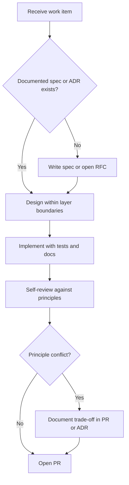

# Engineering Principles

## Purpose

Define the non-negotiable engineering values that guide every technical decision in Project Genesis. These principles translate the [Project Charter](../docs/000-foundation/PROJECT_CHARTER.md) and [Core Values](../docs/001-vision/CORE_VALUES.md) into actionable heuristics for contributors, reviewers, and AI assistants.

## Responsibilities

| Role | Responsibility |
|------|----------------|
| **All contributors** | Apply these principles during design, implementation, and review |
| **Reviewers** | Reject changes that violate principles without documented justification |
| **Maintainers** | Uphold principles in merge decisions and roadmap prioritization |
| **Chief Architect** | Resolve principle conflicts; update this document when strategy evolves |
| **AI assistants** | Treat principles as hard constraints per [AI_ARCHITECT.md](../AI_ARCHITECT.md) |

## Principles

### 1. Correctness first

Working software beats fast software. A change is not done until it meets the [Definition of Done](../.cursor/context/DEFINITION_OF_DONE.md).

### 2. Documentation is a deliverable

Specifications precede implementation ([ADR-007](../DECISION_LOG.md#adr-007-documentation-first-bootstrap)). Undocumented behavior does not ship.

### 3. AI-native by design

Structure repos, configs, and APIs so humans and AI agents can reason about them. Prompts are versioned assets ([`.cursor/rules/06-ai-development.mdc`](../.cursor/rules/06-ai-development.mdc)).

### 4. Clean Architecture

Dependencies point inward. Domain logic never depends on frameworks ([ADR-001](../DECISION_LOG.md#adr-001-clean-architecture), [standards/ARCHITECTURE_STANDARD.md](../standards/ARCHITECTURE_STANDARD.md)).

### 5. Simplicity over cleverness

Prefer small functions, clear names, and explicit behavior. Reject abstractions that do not serve at least two real use cases.

### 6. Reusability through plugins

Extend via the Genesis Kernel and plugin system ([ADR-002](../DECISION_LOG.md#adr-002-plugin-architecture), [specs/003-plugin-system/](../specs/003-plugin-system/)). Do not fork core for one-off needs.

### 7. Test what matters

Prioritize domain logic, business rules, and critical workflows ([`.cursor/rules/04-testing.mdc`](../.cursor/rules/04-testing.mdc)). Avoid tests that only mirror implementation details.

### 8. Security by default

Never trust external input. Never commit secrets. Security review is mandatory for sensitive surfaces ([SECURITY_REVIEW_PROCESS.md](SECURITY_REVIEW_PROCESS.md)).

### 9. Performance with evidence

Consider memory, CPU, network, and battery impact—especially mobile ([`.cursor/rules/11-performance.mdc`](../.cursor/rules/11-performance.mdc)). Measure before optimizing.

### 10. Phase discipline

Respect current milestone scope ([CURRENT_STATE.md](../.cursor/context/CURRENT_STATE.md)). Defer out-of-phase work via RFC rather than sneaking it into unrelated PRs.

## Workflow

How principles apply during a typical change:

### Decision heuristics

When two good options exist, prefer the one that:

1. Keeps domain logic framework-free
2. Reduces long-term maintenance cost
3. Improves AI and human readability
4. Aligns with existing ADRs and specs
5. Ships the smallest correct change

## Examples

### Good — principle-aligned

| Scenario | Decision | Principle |
|----------|----------|-----------|
| New CLI command | Spec in `specs/001-cli/` before code | Documentation first |
| Unity integration | Plugin in `packages/plugins/unity/` | Reusability through plugins |
| Config format | Typed `genesis.config.ts` | AI-native by design |
| Hot path optimization | Profile first, then optimize one function | Performance with evidence |

### Bad — principle violations

| Scenario | Problem | Remedy |
|----------|---------|--------|
| Business rules in CLI handler | Layer violation | Move to domain/application layer |
| `any` types to ship faster | Correctness and maintainability risk | Use strict types; narrow interfaces |
| Undocumented breaking API change | Documentation gap | ADR + migration guide + semver bump |
| Game code modifying `packages/core` | Boundary violation | Extend via plugin or framework API |

## Best practices

- Read [DECISION_LOG.md](../DECISION_LOG.md) before designing cross-cutting changes
- Reference applicable principles in PR descriptions when trade-offs are non-obvious
- Use [`.cursor/prompts/architecture-review.md`](../.cursor/prompts/architecture-review.md) for significant designs
- When unsure, choose the option a new contributor understands in one reading
- Escalate principle conflicts to maintainers early—not at merge time

## Related documents

- [docs/000-foundation/PROJECT_CHARTER.md](../docs/000-foundation/PROJECT_CHARTER.md)
- [docs/001-vision/CORE_VALUES.md](../docs/001-vision/CORE_VALUES.md)
- [docs/000-foundation/LONG_TERM_VISION.md](../docs/000-foundation/LONG_TERM_VISION.md)
- [standards/ARCHITECTURE_STANDARD.md](../standards/ARCHITECTURE_STANDARD.md)
- [ARCHITECTURE_REVIEW_PROCESS.md](ARCHITECTURE_REVIEW_PROCESS.md)
- [ADR_PROCESS.md](ADR_PROCESS.md)
- [AI_CONTRIBUTION_POLICY.md](AI_CONTRIBUTION_POLICY.md)

## Changelog

| Version | Date | Change |
|---------|------|--------|
| 1.0.0 | 2026-07-26 | Initial approved version |
