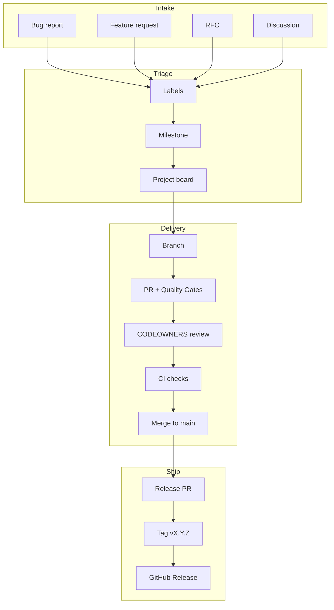
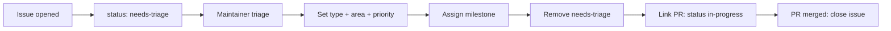
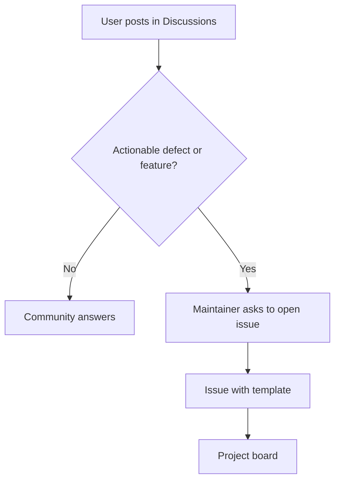
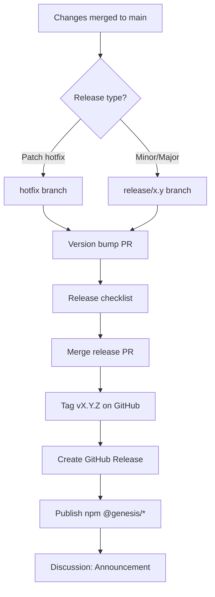

# GitHub Workflow

## Purpose

Define how Project Genesis uses GitHub as the collaboration platform: issues, pull requests, labels, milestones, projects, discussions, wiki, releases, and repository protection. This specification is the blueprint for `.github/` configuration—**implementation is deferred** until the monorepo bootstrap (Sprint 2+).

## Scope

### In scope

- Label taxonomy and usage rules
- Milestone and project board design
- Issue, PR, and RFC templates
- Discussions and wiki policy
- Release workflow on GitHub
- Semantic versioning and conventional commits on GitHub
- Dependabot, CODEOWNERS, and branch protection rules

### Out of scope

- Actual workflow YAML, bot configuration, or GitHub App setup (implementation phase)
- npm registry publication mechanics (see [RELEASE_STRATEGY.md](RELEASE_STRATEGY.md))
- Non-GitHub tooling (Cursor, local CLI)

## Responsibilities

| Role | Responsibility |
|------|----------------|
| **Contributors** | Use correct templates, labels, and commit format |
| **Maintainers** | Triage issues, manage milestones/projects, enforce protection rules |
| **Release manager** | Create GitHub Releases, tags, and release notes |
| **Chief Architect** | Triage RFCs and architecture-labeled issues |
| **Security steward** | Triage security issues; manage Dependabot alerts |
| **CODEOWNERS** | Auto-requested review for owned paths |

## System overview



---

## Labels

### Design principles

| Principle | Rule |
|-----------|------|
| **Minimal** | Prefer ≤ 30 active labels; archive obsolete ones |
| **Composable** | Combine type + area + priority labels |
| **Actionable** | Every open issue has ≥ 1 type label and ≥ 1 area label |
| **Bot-safe** | Reserve `bot:` prefix for automation |

### Type labels (required — exactly one)

| Label | Color | Use |
|-------|-------|-----|
| `type: bug` | `#d73a4a` | Defect in existing behavior |
| `type: feature` | `#0e8a16` | New capability or enhancement |
| `type: docs` | `#0075ca` | Documentation only |
| `type: refactor` | `#fbca04` | Internal restructure, no behavior change |
| `type: chore` | `#cfd3d7` | Tooling, CI, dependencies |
| `type: rfc` | `#5319e7` | Request for Comments proposal |
| `type: security` | `#b60205` | Security vulnerability or hardening |
| `type: question` | `#d876e3` | Support / clarification (often → Discussion) |

### Area labels (required — one or more)

| Label | Use |
|-------|-----|
| `area: cli` | `@genesis/cli`, commands, UX |
| `area: core` | Kernel, DI, registries |
| `area: config` | `genesis.config.ts`, `@genesis/config` |
| `area: templates` | Template engine |
| `area: scaffolding` | Project generation |
| `area: validator` | Architecture validation |
| `area: ai` | AI engine, prompts |
| `area: plugins` | Plugin system and plugins |
| `area: unity` | Unity plugin |
| `area: backend` | NestJS / backend plugin |
| `area: cloud` | AWS, Firebase plugins |
| `area: governance` | Process, standards, specs |
| `area: docs` | `docs/`, `knowledge/` |
| `area: ci` | GitHub Actions, build pipeline |

### Priority labels (optional — maintainer set)

| Label | Use |
|-------|-----|
| `priority: P0` | Blocker — drop everything |
| `priority: P1` | High — current sprint |
| `priority: P2` | Medium — this milestone |
| `priority: P3` | Low — backlog |

### Status labels (maintainer / bot)

| Label | Use |
|-------|-----|
| `status: needs-triage` | New issue, unreviewed |
| `status: needs-info` | Waiting on reporter |
| `status: blocked` | External dependency |
| `status: in-progress` | Actively being worked |
| `status: stale` | No activity 30+ days (bot) |

### PR-specific labels

| Label | Use |
|-------|-----|
| `breaking` | Semver major; migration guide required |
| `architecture` | Tier 2+ architecture review |
| `security` | Security steward review |
| `good first issue` | Suitable for new contributors |
| `help wanted` | Maintainer requests community help |
| `release` | Part of upcoming release train |
| `dependencies` | Dependabot PR |

### Label workflow



---

## Milestones

### Alignment with project phases

GitHub milestones mirror [CURRENT_MILESTONE.md](../.cursor/context/CURRENT_MILESTONE.md) and [ROADMAP.md](../.cursor/context/ROADMAP.md).

| Milestone | Target | Theme |
|-----------|--------|-------|
| **M1 — Genesis CLI Foundation** | 2026-09-21 | Monorepo, core, CLI, template engine, scaffolding |
| **M2 — Plugin System** | TBD | Plugin kernel, first plugins |
| **M3 — Game Generation** | TBD | End-to-end project generation |
| **M4 — AI Engine** | TBD | AI commands, agents v1 |
| **M5 — Cloud & Marketplace** | TBD | Cloud beta, marketplace alpha |

### Milestone rules

| Rule | Description |
|------|-------------|
| **M1** | Every feature issue must belong to exactly one milestone |
| **M2** | Bugs default to current milestone if in-scope; else backlog milestone |
| **M3** | RFCs may span milestones; label `status: deferred` when postponed |
| **M4** | Close milestone when [PROJECT_STATUS.md](../PROJECT_STATUS.md) marks phase complete |
| **M5** | Open issues roll forward explicitly—never silent carry |

### Milestone description template

```markdown
## Objective
[One sentence from CURRENT_MILESTONE.md]

## Success criteria
- [ ] Criterion 1
- [ ] Criterion 2

## Out of scope
- Item deferred to next milestone

## Tracking
- [PROJECT_STATUS.md](../PROJECT_STATUS.md)
- [CURRENT_SPRINT.md](../.cursor/context/CURRENT_SPRINT.md)
```

---

## Projects

### Board: Genesis Engineering

Primary kanban board for all engineering work.

| Column | Definition | Automation (future) |
|--------|------------|---------------------|
| **Backlog** | Triaged, not started | New issues with milestone |
| **Ready** | Spec/ADR exists; acceptance criteria clear | Label `status: ready` |
| **In Progress** | Branch open or assignee active | Linked PR open |
| **In Review** | PR awaiting review | PR marked ready |
| **Done** | Merged and verified | PR merged |

### Board: RFC Pipeline

Dedicated board for `type: rfc` issues and linked PRs.

| Column | Definition |
|--------|------------|
| **Draft** | Author writing RFC |
| **Review** | Comment period open (7–14 days) |
| **Decision** | Maintainer evaluating feedback |
| **Accepted** | Approved → ADR + implementation issues created |
| **Rejected / Deferred** | Closed with documented outcome |

### Board: Release Train

Tracks release preparation per [RELEASE_STRATEGY.md](RELEASE_STRATEGY.md).

| Column | Definition |
|--------|------------|
| **Queued** | Tagged `release`; merged to main |
| **Release branch** | On `release/x.y` |
| **Staging** | RC published |
| **Released** | Tag `vX.Y.Z` published |
| **Post-release** | Monitor issues 48h |

### Project views (recommended)

| View | Filter |
|------|--------|
| Current sprint | Milestone = M1 + assignee |
| Bug burndown | `type: bug` + current milestone |
| Good first issues | `good first issue` + no assignee |
| Security queue | `type: security` or `security` label |

---

## Issue templates

GitHub issue forms live in `.github/ISSUE_TEMPLATE/` when implemented. Canonical content is maintained in [`templates/github/`](../templates/github/).

### Template index

| Template | File | GitHub form (future) |
|----------|------|----------------------|
| Bug report | [bug-report.md](../templates/github/bug-report.md) | `ISSUE_TEMPLATE/bug_report.yml` |
| Feature request | [feature-request.md](../templates/github/feature-request.md) | `ISSUE_TEMPLATE/feature_request.yml` |
| RFC | [rfc.md](../templates/github/rfc.md) | `ISSUE_TEMPLATE/rfc.yml` |
| Blank | [issue.md](../templates/github/issue.md) | `ISSUE_TEMPLATE/config.yml` → blank |

### Issue template config (future)

```yaml
# .github/ISSUE_TEMPLATE/config.yml (spec only)
blank_issues_enabled: false
contact_links:
  - name: Questions & support
    url: https://github.com/ORG/project-genesis/discussions/categories/q-a
    about: Ask questions here instead of opening an issue
  - name: Security vulnerability
    url: https://github.com/ORG/project-genesis/security/advisories/new
    about: Report security issues privately
```

### Triage SLA (target)

| Type | First response | Resolution target |
|------|----------------|-------------------|
| `type: security` | 24 hours | Per severity |
| `type: bug` P0/P1 | 48 hours | Current sprint |
| `type: feature` | 1 week | Milestone planning |
| `type: rfc` | 1 week | Comment period 7–14 days |
| `type: question` | Redirect to Discussions | — |

---

## Pull Request template

Canonical template: [templates/github/pull-request.md](../templates/github/pull-request.md)

GitHub loads from `.github/pull_request_template.md` (future)—content mirrors `templates/github/pull-request.md`.

### Required sections

1. Summary
2. **Quality Gates** (mandatory) — [QUALITY_GATES.md](../specs/000-project/QUALITY_GATES.md)
3. Test plan
4. Architectural impact
5. Related issues / ADRs
6. AI disclosure

### PR ↔ issue linking

| Syntax | Effect |
|--------|--------|
| `Closes #123` | Auto-close issue on merge |
| `Refs #123` | Link without closing |
| `RFC-0004` | Link to `docs/rfcs/0004-*.md` in description |

---

## Discussions

### Purpose

Discussions handle questions, ideas, and community conversation that do **not** require tracked engineering work. Issues are for actionable work items only.

### Categories

| Category | Use | Converts to issue? |
|----------|-----|-------------------|
| **Announcements** | Releases, milestones (maintainer only) | No |
| **General** | Community chat, introductions | Rarely |
| **Ideas** | Early feature ideas before spec | Yes → feature request |
| **Q&A** | How-to, troubleshooting | Yes if bug confirmed |
| **RFC** | RFC comment period (alternative to PR) | Yes → RFC issue |
| **Show and tell** | Built with Genesis | No |

### Discussion workflow



### Rules

- Do not use Discussions for security vulnerabilities — use GitHub Security Advisories
- Mark answered Q&A as solved
- Lock heated threads per Code of Conduct
- Mirror major decisions in ADRs or docs—Discussions are not canonical

---

## Wiki

### Policy: Wiki disabled; docs in repo

Project Genesis uses **documentation in the repository** as the single source of truth ([DOCUMENTATION_POLICY.md](DOCUMENTATION_POLICY.md), [ADR-007](../DECISION_LOG.md#adr-007-documentation-first-bootstrap)).

| Approach | Decision |
|----------|----------|
| GitHub Wiki | **Disabled** — avoids drift from `docs/`, `specs/`, `governance/` |
| Alternative | Published docs site (future) built from repo markdown |
| Exception | None — all official docs live in git |

### Rationale

- Wiki content is not reviewable via PR
- AI assistants cannot reliably read wiki
- Versioning and changelogs require git history

If GitHub Wiki is ever enabled, it may only mirror auto-generated API docs with a banner linking to the repo.

---

## Release workflow

### GitHub Release flow



### GitHub Release notes structure

```markdown
## What's Changed
* feat(cli): add genesis doctor command by @author in #42
* fix(config): validate plugin paths by @author in #45

## Breaking Changes
* … (or "None")

## Migration Guide
* … (link if breaking)

## Plugin Compatibility
| Package | Version |
|---------|---------|
| @genesis/core | 1.2.0 |

**Full Changelog**: https://github.com/ORG/project-genesis/compare/v1.1.0...v1.2.0
```

### Release automation (future)

| Workflow | Trigger | Actions |
|----------|---------|---------|
| `ci.yml` | PR + push to main | Lint, test, build |
| `release.yml` | Tag `v*` | Build, publish npm, create GitHub Release |
| `nightly.yml` | Cron `0 6 * * *` | Publish nightly dist-tag |

Spec reference: [.github/README.md](../.github/README.md)

### Pre-release tags

| Tag format | Channel |
|------------|---------|
| `v1.2.0-alpha.1` | Alpha |
| `v1.2.0-beta.1` | Beta |
| `v1.2.0-rc.1` | Release candidate |
| `v1.2.0` | Stable |

---

## Semantic versioning

GitHub releases and tags follow [VERSIONING_STRATEGY.md](VERSIONING_STRATEGY.md).

### Tag rules

| Rule | Description |
|------|-------------|
| **T1** | Tags are `vMAJOR.MINOR.PATCH` (leading `v`) |
| **T2** | One tag per release; immutable |
| **T3** | Pre-1.0.0: all GitHub Releases marked **pre-release** |
| **T4** | Breaking changes require `breaking` label + MAJOR bump |
| **T5** | Compare URL in release notes uses previous stable tag |

### Monorepo versioning

All `@genesis/*` packages share a release tag for Phase 1. Independent plugin versioning post-M2 documented in release notes.

### Version bump PR labels

| Label | Semver |
|-------|--------|
| `semver: major` | MAJOR |
| `semver: minor` | MINOR |
| `semver: patch` | PATCH |

---

## Conventional commits

### Format

```
<type>(<scope>): <description>

[optional body]

[optional footer]
```

### Types

| Type | Use | Semver impact |
|------|-----|---------------|
| `feat` | New feature | MINOR |
| `fix` | Bug fix | PATCH |
| `docs` | Documentation | — |
| `test` | Tests | — |
| `refactor` | Code restructure | — |
| `chore` | Tooling, deps | — |
| `perf` | Performance | PATCH or MINOR |
| `ci` | CI changes | — |
| `build` | Build system | — |
| `revert` | Revert commit | — |

### Scopes (recommended)

`cli`, `core`, `config`, `shared`, `template-engine`, `scaffolding`, `validator`, `ai`, `plugin`, `unity`, `nestjs`, `governance`, `deps`

### Footer tokens

| Token | Use |
|-------|-----|
| `Closes #123` | Link issue |
| `BREAKING CHANGE:` | MAJOR bump description |
| `Refs ADR-005` | Link decision |

### Examples

```
feat(cli): add genesis doctor command

Runs workspace health checks for Node, config, and plugins.

Closes #42
```

```
fix(config)!: remove legacy genesis.yml support

BREAKING CHANGE: Projects must use genesis.config.ts.
Migration guide in CHANGELOG.md.
```

### Enforcement (future)

| Stage | Mechanism |
|-------|-----------|
| Local | Commitlint hook (optional) |
| PR | Squash merge title = conventional commit |
| Release | Release notes generated from commit range |

References: [standards/GIT_STANDARD.md](../standards/GIT_STANDARD.md), [BRANCHING_STRATEGY.md](BRANCHING_STRATEGY.md), [CONTRIBUTING.md](../CONTRIBUTING.md)

---

## Dependabot

### Policy

Automated dependency updates via Dependabot with maintainer review. Security updates are prioritized.

### Configuration spec (future: `.github/dependabot.yml`)

```yaml
# Spec only — not implemented
version: 2
updates:
  - package-ecosystem: npm
    directory: "/"
    schedule:
      interval: weekly
      day: monday
    open-pull-requests-limit: 5
    groups:
      dev-dependencies:
        dependency-type: development
        update-types: [minor, patch]
    labels:
      - dependencies
      - chore
      - area: ci
    commit-message:
      prefix: chore
      include: scope

  - package-ecosystem: github-actions
    directory: "/"
    schedule:
      interval: weekly
    labels:
      - dependencies
      - area: ci
```

### Dependabot PR rules

| Rule | Description |
|------|-------------|
| **D1** | Auto-merge **disabled** — human or CI must approve |
| **D2** | Security alerts: address within SLA (critical: 7 days) |
| **D3** | MAJOR dependency bumps need architect review if runtime dep |
| **D4** | Group patch/minor dev-deps weekly |
| **D5** | PR must pass CI and include Quality Gates (G5 = Low minimum) |

---

## CODEOWNERS

### Purpose

Automatically request reviews from domain owners when files change.

### Spec (future: `.github/CODEOWNERS`)

```
# Spec only — paths and teams finalized at implementation

# Default
*                           @genesis/maintainers

# Governance & specs
/governance/                @genesis/architects
/specs/                     @genesis/architects
/DECISION_LOG.md            @genesis/chief-architect

# Core packages
/packages/core/             @genesis/kernel-team
/packages/cli/              @genesis/cli-team
/packages/config/           @genesis/cli-team

# Plugins
/packages/plugins/          @genesis/plugin-team

# Security-sensitive
/.github/                   @genesis/security @genesis/maintainers
/standards/security/        @genesis/security

# AI assets
/.cursor/                   @genesis/architects
/prompts/                   @genesis/ai-team

# Release
/CHANGELOG.md               @genesis/release-managers
```

### CODEOWNERS rules

| Rule | Description |
|------|-------------|
| **C1** | Last matching pattern wins |
| **C2** | CODEOWNERS approval required for owned paths (branch protection) |
| **C3** | Teams replace individual usernames at scale |
| **C4** | Update CODEOWNERS when package ownership changes |

---

## Branch protection

### Protected branches

| Branch | Protection level |
|--------|------------------|
| `main` | Full protection |
| `release/*` | Release manager + maintainer |
| `hotfix/*` | Maintainer (expedited) |

### `main` branch rules (spec)

| Rule | Setting |
|------|---------|
| Require pull request before merging | ✅ |
| Required approvals | **1** (2 for `breaking` or kernel changes via CODEOWNERS) |
| Dismiss stale approvals | ✅ |
| Require review from CODEOWNERS | ✅ |
| Require status checks to pass | ✅ `ci/build`, `ci/test`, `ci/lint` (future) |
| Require branches up to date | ✅ |
| Require conversation resolution | ✅ |
| Restrict pushes | Maintainers only; no direct push |
| Allow force pushes | ❌ |
| Allow deletions | ❌ |
| Require signed commits | Optional (recommended post-1.0) |

### Status checks (future CI)

| Check | Purpose |
|-------|---------|
| `ci / lint` | Biome lint |
| `ci / format` | Biome format check |
| `ci / test` | Vitest suite |
| `ci / build` | TypeScript compile |
| `ci / validate` | `genesis validate` (when available) |

### Merge settings

| Setting | Value |
|---------|-------|
| Allowed merge types | **Squash merge** only (default) |
| Squash commit title | PR title (conventional commit) |
| Squash commit message | PR body summary |
| Auto-merge | Allowed when all checks + approvals pass |

Reference: [BRANCHING_STRATEGY.md](BRANCHING_STRATEGY.md)

---

## Implementation checklist

When bootstrapping GitHub configuration (Sprint 2+):

```
Phase A — Foundation
[ ] Create labels (type, area, priority, status, PR)
[ ] Create milestones M1–M5
[ ] Configure Genesis Engineering project board
[ ] Add issue templates from templates/github/
[ ] Add pull_request_template.md
[ ] Disable Wiki
[ ] Enable Discussions with categories

Phase B — Protection & ownership
[ ] CODEOWNERS file
[ ] Branch protection on main
[ ] Dependabot config

Phase C — CI & release
[ ] ci.yml (lint, test, build)
[ ] release.yml on tag v*
[ ] Release workflow documented in maintainer runbook
```

---

## Examples

### Example: Bug → fix → release

1. User files bug with [bug-report.md](../templates/github/bug-report.md) → `type: bug`, `area: cli`, `priority: P1`
2. Maintainer adds to M1 milestone and project **In Progress**
3. Contributor opens `bugfix/doctor-null-config` PR with Quality Gates
4. CODEOWNERS `@genesis/cli-team` requested
5. CI passes; maintainer squash merges: `fix(cli): handle null config in doctor`
6. `Closes #87` — issue closed
7. Included in `v0.2.1` patch release

### Example: Feature → RFC → implementation

1. Community posts idea in Discussions **Ideas**
2. Maintainer asks for [feature-request.md](../templates/github/feature-request.md) issue
3. Large scope → author opens [rfc.md](../templates/github/rfc.md) issue `RFC-0003`
4. RFC board: Review → Accepted → ADR-011
5. Implementation issues created; linked to M2 milestone
6. Feature PRs reference `RFC-0003`

---

## Best practices

- One issue per actionable work item
- Labels are not optional decoration—they drive project automation
- Prefer Discussions for questions; Issues for tracked work
- Keep milestone scope realistic; roll forward explicitly
- Squash merge titles must follow conventional commits
- Never commit secrets—even in issue templates or Discussions
- Security issues use GitHub Security Advisories, not public issues

---

## Related documents

| Document | Relationship |
|----------|--------------|
| [PULL_REQUEST_PROCESS.md](PULL_REQUEST_PROCESS.md) | PR lifecycle |
| [BRANCHING_STRATEGY.md](BRANCHING_STRATEGY.md) | Branch naming and merge |
| [RELEASE_STRATEGY.md](RELEASE_STRATEGY.md) | Release channels and checklist |
| [VERSIONING_STRATEGY.md](VERSIONING_STRATEGY.md) | Semver rules |
| [RFC_PROCESS.md](RFC_PROCESS.md) | RFC workflow |
| [specs/000-project/QUALITY_GATES.md](../specs/000-project/QUALITY_GATES.md) | PR quality gates |
| [CONTRIBUTING.md](../CONTRIBUTING.md) | Contributor onboarding |
| [templates/github/](../templates/github/) | Issue and PR template content |
| [.github/README.md](../.github/README.md) | CI workflow index |

## Changelog

| Version | Date | Change |
|---------|------|--------|
| 1.0.0 | 2026-07-26 | Initial approved specification |
