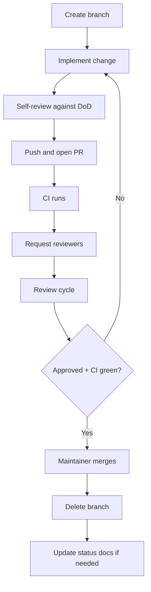

# Pull Request Process

## Purpose

Define the lifecycle of a pull request from draft to merge so every contribution meets Project Genesis quality, security, and documentation expectations.

## Responsibilities

| Role | Responsibility |
|------|----------------|
| **Author** | Complete self-review, tests, docs, and accurate PR description |
| **Reviewer** | Timely, constructive review per [`.cursor/rules/13-code-review.mdc`](../.cursor/rules/13-code-review.mdc) |
| **Maintainer** | Merge when gates pass; enforce branch and CI policy |
| **CI system** | Run automated checks; block merge on failure |
| **AI operator** | Disclose AI assistance per [AI_CONTRIBUTION_POLICY.md](AI_CONTRIBUTION_POLICY.md) |

## Workflow



### Step-by-step

| Step | Action | Reference |
|------|--------|-----------|
| 1 | Branch from `main` using [BRANCHING_STRATEGY.md](BRANCHING_STRATEGY.md) | `feature/`, `bugfix/`, etc. |
| 2 | Implement with tests and docs | [DEVELOPMENT_WORKFLOW.md](../DEVELOPMENT_WORKFLOW.md) |
| 3 | Self-review against DoD | [DEFINITION_OF_DONE.md](../.cursor/context/DEFINITION_OF_DONE.md) |
| 4 | Open PR using template | [templates/github/pull-request.md](../templates/github/pull-request.md) |
| 5 | Select review tier if architectural | [ARCHITECTURE_REVIEW_PROCESS.md](ARCHITECTURE_REVIEW_PROCESS.md) |
| 6 | Address feedback; re-request review | — |
| 7 | Obtain required approvals | See approval matrix below |
| 8 | Squash or merge per policy | [BRANCHING_STRATEGY.md](BRANCHING_STRATEGY.md) |
| 9 | Update [PROJECT_STATUS.md](../PROJECT_STATUS.md) for milestone work | Optional |

### Approval matrix

| Change type | Required approvals |
|-------------|-------------------|
| Docs only | 1 maintainer |
| Standard code change | 1 maintainer |
| Cross-package / public API | 1 architect + 1 maintainer |
| Kernel / breaking change | Chief Architect + 1 maintainer |
| Security-sensitive | Security steward + 1 maintainer |

See [SECURITY_REVIEW_PROCESS.md](SECURITY_REVIEW_PROCESS.md) for security-sensitive definitions.

## PR description requirements

Every PR must include:

1. **Summary** — What changed and why (not a commit dump)
2. **Quality Gates** — Mandatory declaration table per [QUALITY_GATES.md](../specs/000-project/QUALITY_GATES.md)
3. **Test plan** — Commands run and expected results
4. **Architectural impact** — Packages, layers, new dependencies (or "None")
5. **Related decisions** — Links to ADRs, specs, issues
6. **AI disclosure** — If AI generated or materially assisted the change

### Labels (recommended)

| Label | Meaning |
|-------|---------|
| `breaking` | Requires semver major or migration guide |
| `architecture` | Needs architecture review |
| `security` | Needs security review |
| `docs` | Documentation only |
| `good first issue` | Suitable for new contributors |

## Review criteria

Reviewers evaluate:

| Area | Questions |
|------|-----------|
| **Correctness** | Does it work? Edge cases handled? |
| **Security** | Input validated? Secrets absent? Auth correct? |
| **Maintainability** | Readable? Consistent with codebase? |
| **Performance** | Regressions unlikely? Hot paths considered? |
| **Testing** | Meaningful tests? Do they fail without the fix? |
| **Documentation** | User-facing changes documented? |

## Examples

### Good PR summary

```markdown
## Summary
Adds `genesis doctor` command that runs workspace health checks (Node version,
config validity, plugin compatibility). Implements spec section 4.2.

## Test plan
- [ ] `pnpm test packages/cli`
- [ ] `genesis doctor` on clean repo → all checks pass
- [ ] `genesis doctor` with invalid config → actionable error

## Architectural impact
- `packages/cli` → `packages/core` (read-only health registry)
- No new public kernel APIs

## Related
- specs/001-cli/FUNCTIONAL_SPEC.md §4.2
- ADR-001 (layer boundaries preserved)
```

### Review comment — constructive

> The config parser belongs in `@genesis/config`, not the CLI command handler.
> Suggest extracting `loadGenesisConfig()` and unit testing validation separately.
> See `specs/001-cli/CONFIGURATION.md`.

### Merge blockers

- Quality Gates table missing or incomplete
- Inaccurate gate declarations (reviewer verified)
- CI failing
- Missing tests for behavior change
- Undocumented breaking API change
- Architecture review required but not completed
- Secrets or credentials in diff

## Best practices

- Keep PRs focused; split unrelated changes
- Mark PR as draft until self-review is complete
- Respond to every review comment (resolve or explain)
- Do not force-push during active review without coordinating
- Prefer "Request changes" over silent LGTM on significant issues
- Link PR to sprint/milestone item when applicable

## Related documents

- [CONTRIBUTING.md](../CONTRIBUTING.md)
- [specs/000-project/QUALITY_GATES.md](../specs/000-project/QUALITY_GATES.md) — Quality Gate System
- [DEVELOPMENT_WORKFLOW.md](../DEVELOPMENT_WORKFLOW.md)
- [BRANCHING_STRATEGY.md](BRANCHING_STRATEGY.md)
- [ARCHITECTURE_REVIEW_PROCESS.md](ARCHITECTURE_REVIEW_PROCESS.md)
- [SECURITY_REVIEW_PROCESS.md](SECURITY_REVIEW_PROCESS.md)
- [AI_CONTRIBUTION_POLICY.md](AI_CONTRIBUTION_POLICY.md)
- [.cursor/context/DEFINITION_OF_DONE.md](../.cursor/context/DEFINITION_OF_DONE.md)
- [.cursor/rules/13-code-review.mdc](../.cursor/rules/13-code-review.mdc)
- [templates/github/pull-request.md](../templates/github/pull-request.md)

## Changelog

| Version | Date | Change |
|---------|------|--------|
| 1.1.0 | 2026-07-26 | Require Quality Gates declaration per QUALITY_GATES spec |
| 1.0.0 | 2026-07-26 | Initial approved version |
