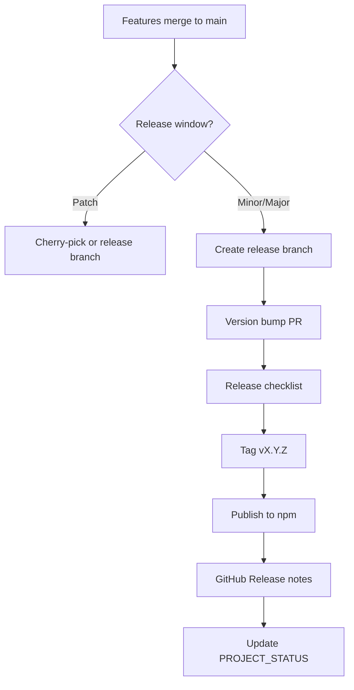
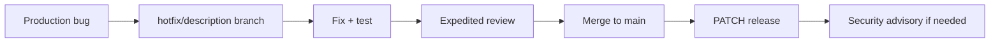

# Release Strategy

## Purpose

Define how Project Genesis packages are released, promoted across channels, and communicated to users—balancing stability for production adopters with velocity for early contributors.

## Responsibilities

| Role | Responsibility |
|------|----------------|
| **Release manager** | Own release calendar, tagging, and publication |
| **Maintainers** | Verify release checklist; approve release PRs |
| **Package owners** | Ensure changelogs and version bumps are accurate |
| **Security steward** | Sign off on security fixes before patch release |
| **Contributors** | Land changes on `main` in releasable state |

## Release channels

| Channel | Audience | Stability | Source |
|---------|----------|-----------|--------|
| **nightly** | Core contributors | Unstable | `main` CI artifacts |
| **alpha** | Early adopters | Experimental features | `release/x.y-alpha` |
| **beta** | Wider testing | Feature-complete, bug fixing | `release/x.y-beta` |
| **stable** | Production users | Semver guarantees | Tagged `vX.Y.Z` on `main` |

Pre-1.0.0: all releases are **alpha** until [PROJECT_STATUS.md](../PROJECT_STATUS.md) declares 1.0.0 readiness.

## Workflow

### Release checklist

Before tagging stable:

- [ ] All tests pass on release commit
- [ ] [DEFINITION_OF_DONE.md](../.cursor/context/DEFINITION_OF_DONE.md) criteria met for included changes
- [ ] CHANGELOG updated per [VERSIONING_STRATEGY.md](VERSIONING_STRATEGY.md)
- [ ] Breaking changes documented with migration guide
- [ ] Plugin compatibility matrix updated
- [ ] Security review complete for security-related changes
- [ ] `genesis doctor` / smoke tests pass (when available)
- [ ] Release notes drafted from changelog

### Cadence (target post-1.0)

| Type | Cadence | Branch |
|------|---------|--------|
| **Patch** | As needed (security, critical bugs) | `hotfix/*` → `main` + backport |
| **Minor** | Monthly | `release/x.y` |
| **Major** | Quarterly or milestone-driven | `release/x.0` + RFC/ADR |

During Phase 1 (Foundation), releases are **milestone-driven**, not calendar-driven.

## Publication

| Artifact | Destination |
|----------|-------------|
| npm packages | `@genesis/*` scope |
| CLI binary | npm + optional standalone binary (future) |
| Release notes | GitHub Releases |
| Docs | `docs/` on tagged commit; future docs site |

Follow [standards/release/deployment.md](../standards/release/deployment.md) when populated.

## Hotfix process

Hotfixes bypass normal feature freeze but still require:

- Regression test
- Security review if applicable
- Changelog entry

## Examples

### Minor release — v0.3.0

**Includes:** `genesis doctor`, template engine improvements, 3 bug fixes.

**Steps:**

1. `release/0.3` branch from `main`
2. Version bump PR: all `@genesis/*` packages to `0.3.0`
3. Checklist run; tag `v0.3.0`
4. GitHub Release: highlights + upgrade notes
5. `PROJECT_STATUS.md` updated to reflect 0.3.0 shipped

### Security patch — v0.2.1

**Includes:** Fix path traversal in template loader.

**Steps:**

1. `hotfix/template-path-sanitize`
2. Security steward review
3. PATCH release same day
4. GitHub Security Advisory if CVE warranted

### Deferred release

Feature incomplete at milestone boundary → bump to next minor; do not ship partial CLI commands without feature flag.

## Best practices

- Keep `main` always releasable
- Batch unrelated changes; release notes should tell a story
- Communicate breaking changes 1 minor ahead via deprecation warnings
- Never rewrite published tags or unpublish without incident process
- Align release timing with [CURRENT_MILESTONE.md](../.cursor/context/CURRENT_MILESTONE.md)
- Post-release: monitor issues for 48h; prepare patch if needed

## Related documents

- [VERSIONING_STRATEGY.md](VERSIONING_STRATEGY.md)
- [BRANCHING_STRATEGY.md](BRANCHING_STRATEGY.md)
- [PULL_REQUEST_PROCESS.md](PULL_REQUEST_PROCESS.md)
- [SECURITY_REVIEW_PROCESS.md](SECURITY_REVIEW_PROCESS.md)
- [PROJECT_STATUS.md](../PROJECT_STATUS.md)
- [standards/release/README.md](../standards/release/README.md)
- [standards/release/deployment.md](../standards/release/deployment.md)
- [DEVELOPMENT_WORKFLOW.md](../DEVELOPMENT_WORKFLOW.md)

## Changelog

| Version | Date | Change |
|---------|------|--------|
| 1.0.0 | 2026-07-26 | Initial approved version |
