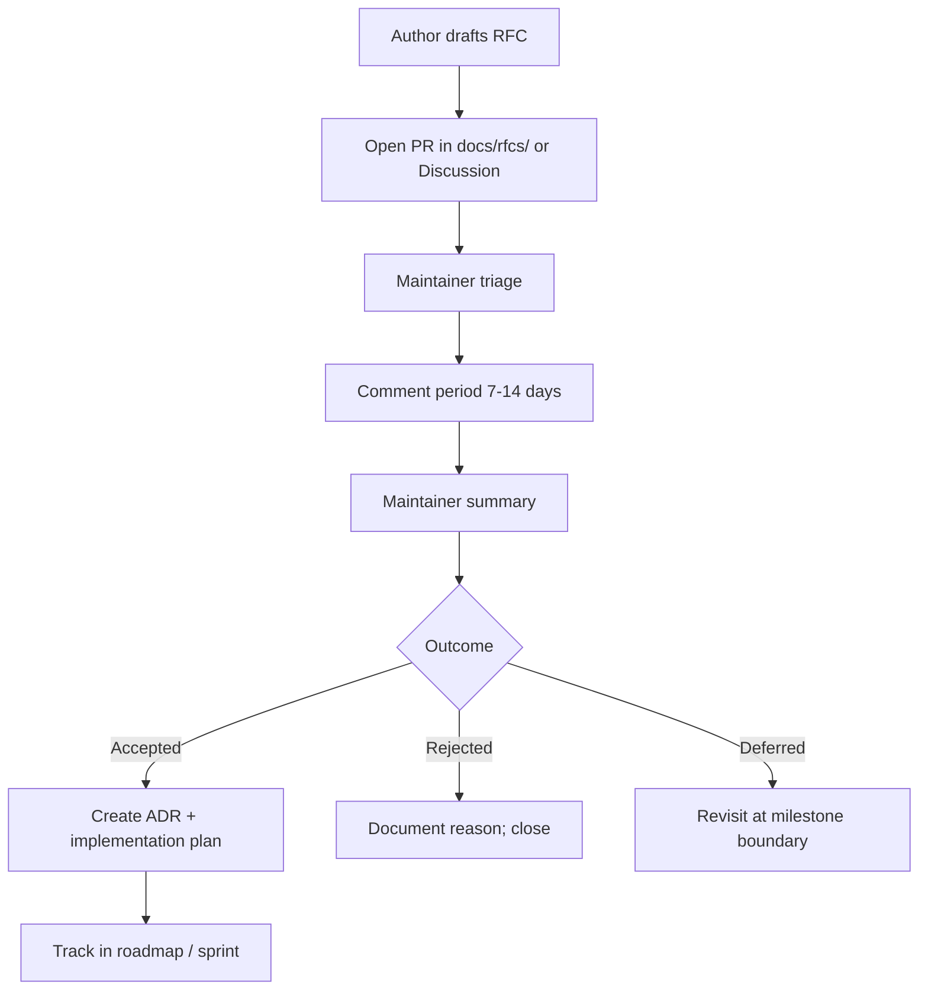

# RFC Process

## Purpose

Enable structured discussion for significant proposals that affect multiple contributors, packages, or strategic direction **before** substantial implementation investment. RFCs complement ADRs: RFCs explore and align; ADRs record the final decision.

## Responsibilities

| Role | Responsibility |
|------|----------------|
| **Author** | Write clear problem statement, proposal, alternatives, and impact |
| **Community** | Provide feedback within the comment period |
| **Maintainers** | Triage RFCs; schedule review; declare outcome |
| **Chief Architect** | Final decision on accepted/rejected/deferred RFCs |
| **Implementer** | Convert accepted RFCs into ADRs and implementation plans |

## When to open an RFC

| Trigger | RFC recommended |
|---------|-----------------|
| New top-level package or major subsystem | Yes |
| Breaking change affecting plugin authors | Yes |
| Change to governance or contribution model | Yes |
| New commercial tier or licensing implication | Yes |
| Cross-cutting refactor (>3 packages) | Yes |
| Single-package internal improvement | No — use PR |
| Bug fix | No — use issue + PR |
| Documentation correction | No — use PR |

Align with [ARCHITECTURE_REVIEW_PROCESS.md](ARCHITECTURE_REVIEW_PROCESS.md) Tier 3–4 triggers.

## Workflow

### RFC document structure

Store RFCs at `docs/rfcs/NNNN-short-title.md` (create directory on first RFC).

| Section | Content |
|---------|---------|
| **Metadata** | Status, author, date, reviewers |
| **Summary** | One paragraph |
| **Motivation** | Problem and user impact |
| **Proposal** | Detailed design |
| **Alternatives** | Options considered and why rejected |
| **Impact** | Packages, migration, timeline, risks |
| **Open questions** | Unresolved items for discussion |

### Status values

| Status | Meaning |
|--------|---------|
| **Draft** | Author working; not ready for review |
| **Review** | Open for community comment |
| **Accepted** | Approved for implementation |
| **Rejected** | Will not implement |
| **Deferred** | Valid but not now; link to milestone |
| **Withdrawn** | Author withdrew |

### Comment period

| RFC scope | Minimum comment period |
|-----------|------------------------|
| Single subsystem | 7 days |
| Cross-cutting / governance | 14 days |
| Strategic / licensing | 14 days + maintainer sync |

## Examples

### Example RFC title

`RFC-0001: Plugin manifest schema v2`

**Motivation:** v1 manifest cannot express optional peer dependencies required by Unity plugin.

**Proposal:** Add `peerDependencies` field; semver-major bump for `@genesis/core` plugin API.

**Outcome:** Accepted → ADR-010 → implementation split across 3 PRs.

### Example — defer

**RFC:** Real-time collaborative editing in Genesis Web.

**Outcome:** Deferred to Phase 4 per [LONG_TERM_VISION.md](../docs/000-foundation/LONG_TERM_VISION.md). RFC linked from roadmap.

### Example — reject

**RFC:** Replace TypeScript with Rust for entire monorepo.

**Outcome:** Rejected. Contradicts team expertise, AI tooling ecosystem, and phase goals. Alternatives: Rust for specific performance-critical WASM module via future RFC.

## Best practices

- Keep RFCs problem-focused; avoid premature implementation detail
- Engage dissenting opinions; document why alternatives were rejected
- Do not begin large implementation until RFC is **Accepted**
- Accepted RFCs should produce one ADR per major decision
- Close the loop: update RFC status when implementation completes
- Announce significant RFCs in community channels when available

## Related documents

- [GITHUB_WORKFLOW.md](GITHUB_WORKFLOW.md) — RFC issue template and project board
- [templates/github/rfc.md](../templates/github/rfc.md) — RFC issue template content
- [ADR_PROCESS.md](ADR_PROCESS.md)
- [ARCHITECTURE_REVIEW_PROCESS.md](ARCHITECTURE_REVIEW_PROCESS.md)
- [docs/000-foundation/LONG_TERM_VISION.md](../docs/000-foundation/LONG_TERM_VISION.md)
- [.cursor/context/ROADMAP.md](../.cursor/context/ROADMAP.md)
- [VERSIONING_STRATEGY.md](VERSIONING_STRATEGY.md)
- [CONTRIBUTING.md](../CONTRIBUTING.md)

## Changelog

| Version | Date | Change |
|---------|------|--------|
| 1.0.0 | 2026-07-26 | Initial approved version |
