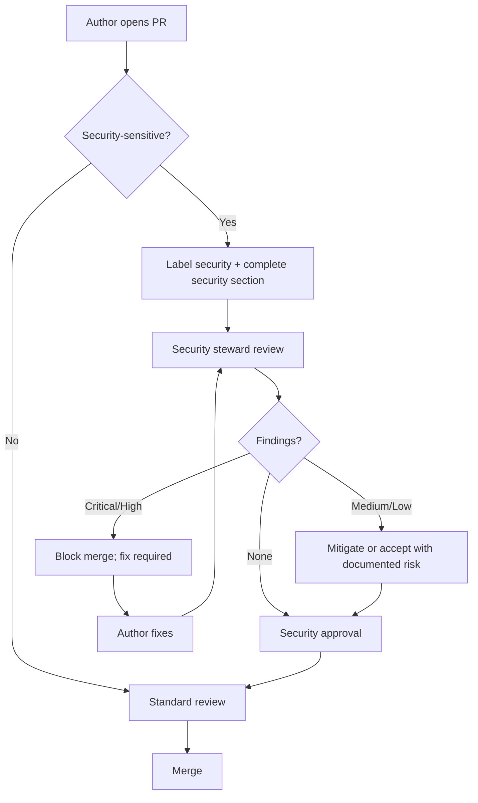

# Security Review Process

## Purpose

Ensure security risks are identified, assessed, and mitigated before vulnerable code reaches `main` or production releases. Security review complements standard PR review with focused threat analysis.

## Responsibilities

| Role | Responsibility |
|------|----------------|
| **Author** | Self-assess security impact; follow [standards/security/](../standards/security/) |
| **Security steward** | Triage and sign off on security-sensitive PRs |
| **Reviewers** | Flag security concerns; never approve known vulnerabilities |
| **Maintainers** | Block merge without required security approval |
| **Release manager** | Coordinate security patch releases |
| **All contributors** | Report vulnerabilities responsibly; never commit secrets |

## Security-sensitive changes

Security review is **required** when a PR touches:

| Category | Examples |
|----------|----------|
| **Authentication** | Login, tokens, sessions, API keys |
| **Authorization** | RBAC, permissions, policy engines |
| **Secrets management** | Env vars, vault integration, credential storage |
| **Input handling** | File paths, templates, user-provided config, CLI args |
| **Network** | HTTP clients, webhooks, CORS, TLS |
| **Cryptography** | Hashing, encryption, signing |
| **Dependencies** | New packages with network or filesystem access |
| **CI/CD** | Pipeline secrets, deployment credentials |
| **AI integrations** | Prompt injection surfaces, external API calls with user data |
| **Plugin loading** | Dynamic module load, manifest validation |

Reference: [standards/security/](../standards/security/), [`.cursor/rules/10-security.mdc`](../.cursor/rules/10-security.mdc).

## Workflow



### Security section in PR

For security-sensitive PRs, add:

```markdown
## Security

- **Threat model:** What could go wrong?
- **Attack surface:** New inputs or trust boundaries?
- **Mitigations:** Validation, authz, rate limits, etc.
- **Secrets:** Confirm no credentials in diff
- **Dependencies:** New deps vetted?
```

### Severity classification

| Severity | Definition | Action |
|----------|------------|--------|
| **Critical** | Remote code execution, secret exposure, auth bypass | Block merge; hotfix if in production |
| **High** | Privilege escalation, injection, data leak | Fix before merge |
| **Medium** | Missing validation, verbose errors, weak defaults | Fix or documented mitigation |
| **Low** | Defense-in-depth improvements | Track; fix when convenient |

### Vulnerability disclosure

1. **Do not** open public issues for unpatched vulnerabilities
2. Report to maintainers via private channel (security contact in root README when published)
3. Maintainer confirms, develops fix on private branch if needed
4. Coordinated release + advisory after patch available

## Examples

### Required review — template path handling

**PR:** Template engine resolves user-provided paths.

**Threat:** Path traversal (`../../etc/passwd`).

**Mitigation:** Resolve paths within project root; unit tests for traversal attempts.

**Outcome:** Security steward approves after tests verified.

### Required review — AI API integration

**PR:** `genesis ai generate` sends repo files to external LLM.

**Threat:** Accidental secret exfiltration via context.

**Mitigation:** Secret scanner on context builder; opt-in for file inclusion; redact `.env`.

### Blocked merge — hardcoded credential

**Finding:** API key in test fixture committed to repo.

**Action:** Remove secret, rotate key, add pre-commit hook check.

### Dependency review

**PR:** Adds `axios` for HTTP calls.

**Check:** Known CVEs, license compatible, pin version, timeout configured.

## Best practices

- Never log secrets, tokens, or PII ([standards/security/secrets.md](../standards/security/secrets.md))
- Validate all external input at system boundaries
- Principle of least privilege for plugins and cloud roles
- Use parameterized APIs; no string-concatenated shell commands
- Run `pnpm audit` (when configured) before release
- Security fixes ship as PATCH releases per [RELEASE_STRATEGY.md](RELEASE_STRATEGY.md)
- Document security assumptions in ADRs for new subsystems

## Related documents

- [standards/security/README.md](../standards/security/README.md)
- [standards/security/secrets.md](../standards/security/secrets.md)
- [standards/security/auth.md](../standards/security/auth.md)
- [standards/security/authorization.md](../standards/security/authorization.md)
- [standards/security/owasp.md](../standards/security/owasp.md)
- [PULL_REQUEST_PROCESS.md](PULL_REQUEST_PROCESS.md)
- [RELEASE_STRATEGY.md](RELEASE_STRATEGY.md)
- [AI_CONTRIBUTION_POLICY.md](AI_CONTRIBUTION_POLICY.md)
- [.cursor/rules/10-security.mdc](../.cursor/rules/10-security.mdc)
- [knowledge/security/](../knowledge/security/)

## Changelog

| Version | Date | Change |
|---------|------|--------|
| 1.0.0 | 2026-07-26 | Initial approved version |
