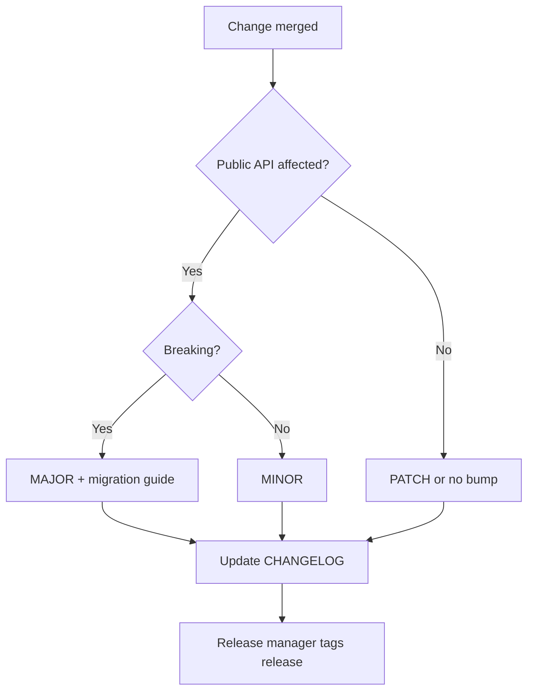

# Versioning Strategy

## Purpose

Define how Project Genesis versions packages, plugins, APIs, documentation, and prompts so consumers can upgrade safely and contributors communicate breaking changes clearly.

## Responsibilities

| Role | Responsibility |
|------|----------------|
| **Package owners** | Bump versions per SemVer rules |
| **Release manager** | Coordinate monorepo version alignment |
| **Plugin authors** | Version plugins independently; declare kernel compatibility |
| **Maintainers** | Enforce semver on public APIs; reject unlabeled breaking PRs |
| **Contributors** | Label breaking changes in PRs; update changelogs |

## Versioning schemes

### Monorepo packages (`packages/*`)

Follow [Semantic Versioning 2.0.0](https://semver.org/): `MAJOR.MINOR.PATCH`

| Bump | When |
|------|------|
| **MAJOR** | Breaking change to public API, CLI contract, or config schema |
| **MINOR** | Backward-compatible new functionality |
| **PATCH** | Backward-compatible bug fixes |

Pre-1.0.0 exception: `0.x.y` — MINOR may include breaking changes until `1.0.0` stable release.

Reference: [standards/release/semantic-versioning.md](../standards/release/semantic-versioning.md)

### Genesis CLI

The CLI version reflects the **user-facing contract**:

- Command names, flags, and default behavior → semver
- Internal refactor with identical CLI → PATCH

See [specs/001-cli/COMMAND_REFERENCE.md](../specs/001-cli/COMMAND_REFERENCE.md).

### Plugins (`packages/plugins/*`)

Plugins version **independently** from core but declare compatibility:

```json
{
  "name": "@genesis/plugin-unity",
  "version": "2.1.0",
  "peerDependencies": {
    "@genesis/core": "^1.4.0"
  }
}
```

Kernel semver-major may require plugin updates. Document in release notes.

### Configuration (`genesis.config.ts`)

Config schema versions with the `@genesis/config` package. Breaking config changes require:

1. MAJOR bump of `@genesis/config`
2. Migration guide
3. `genesis doctor` check when available

See [specs/001-cli/CONFIGURATION.md](../specs/001-cli/CONFIGURATION.md).

### Documentation

| Doc type | Version field | Bump trigger |
|----------|---------------|--------------|
| Governance / standards | Frontmatter `version` | Process or rule change |
| Functional specs | Spec version in header | Requirement change |
| ADRs | Immutable; supersede instead | N/A |

### Prompts and AI assets

Prompts use semver in frontmatter or filename:

- `prompts/blocks/create-module.v1.md`
- Breaking prompt behavior → new major version file

See [`.cursor/rules/06-ai-development.mdc`](../.cursor/rules/06-ai-development.mdc).

## Workflow



### Changelog requirements

Each package maintains `CHANGELOG.md` (or root changelog with package sections):

```markdown
## [1.2.0] - 2026-08-01
### Added
- `genesis doctor` command (#42)

### Changed
- Config validation errors include field path (#45)

### Breaking
- Removed deprecated `genesis.yml` support (#40)
```

### Compatibility matrix

Release notes for kernel majors include:

| Package | Compatible versions |
|---------|---------------------|
| `@genesis/core` | 2.0.x |
| `@genesis/plugin-unity` | 3.x |
| `@genesis/cli` | 2.0.x |

## Examples

| Change | Version bump |
|--------|--------------|
| Fix typo in error message | PATCH |
| Add optional `genesis analyze` flag | MINOR |
| Rename `genesis publish` to remove alias | MAJOR (if alias removed) |
| New plugin hook (optional) | MINOR in core |
| Remove plugin hook | MAJOR in core |
| Spec-only update | Doc frontmatter bump |

### Deprecation policy

1. Mark deprecated in code/docs with removal target version
2. Emit runtime warning for one MINOR release
3. Remove in next MAJOR

## Best practices

- Prefer additive changes over breaking changes
- Use `@deprecated` JSDoc with replacement guidance
- Never break public API without ADR for Tier 3 changes
- Align related package bumps in single release when tightly coupled
- Tag git releases matching primary package version: `v1.2.0`
- Document upgrade path in [RELEASE_STRATEGY.md](RELEASE_STRATEGY.md) notes

## Related documents

- [RELEASE_STRATEGY.md](RELEASE_STRATEGY.md)
- [BRANCHING_STRATEGY.md](BRANCHING_STRATEGY.md)
- [ADR_PROCESS.md](ADR_PROCESS.md)
- [PULL_REQUEST_PROCESS.md](PULL_REQUEST_PROCESS.md)
- [standards/release/semantic-versioning.md](../standards/release/semantic-versioning.md)
- [specs/100-architecture/PACKAGES.md](../specs/100-architecture/PACKAGES.md)

## Changelog

| Version | Date | Change |
|---------|------|--------|
| 1.0.0 | 2026-07-26 | Initial approved version |
