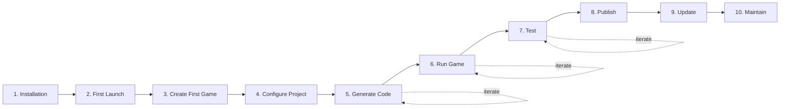
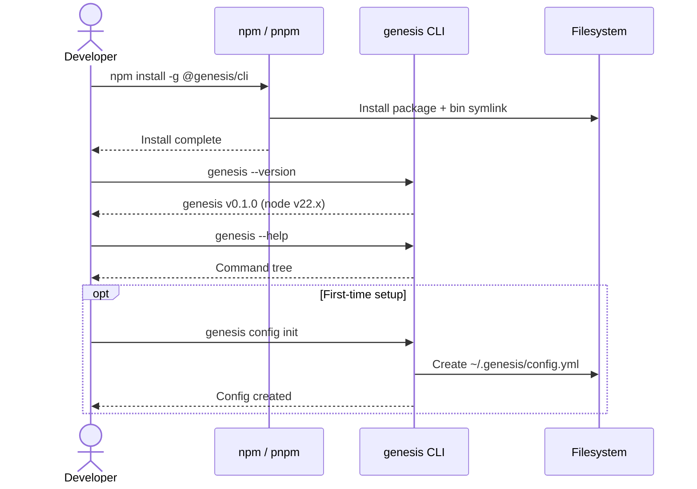
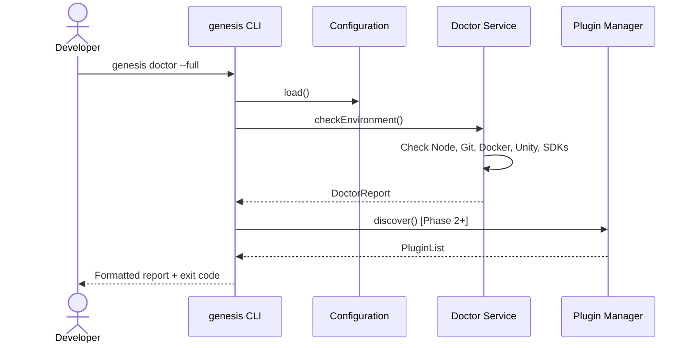
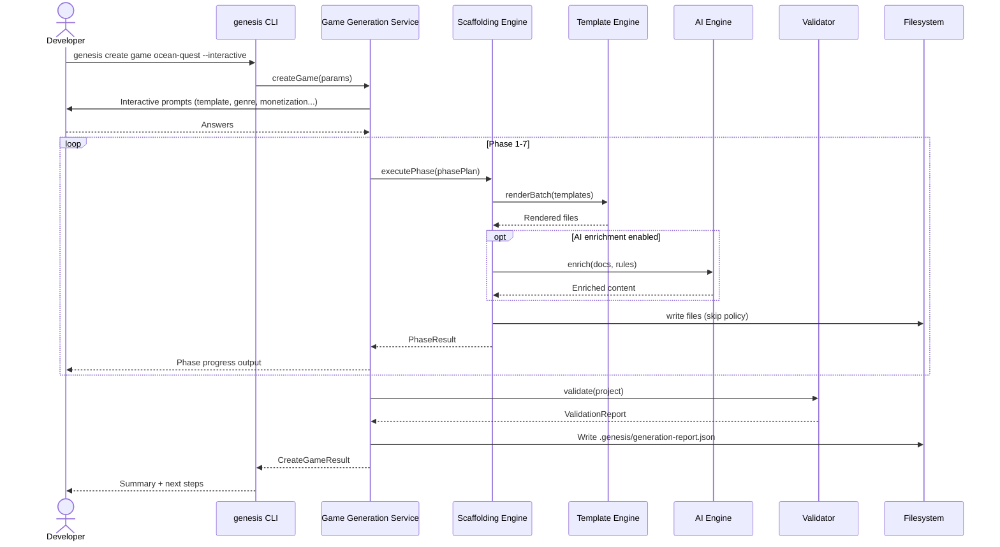
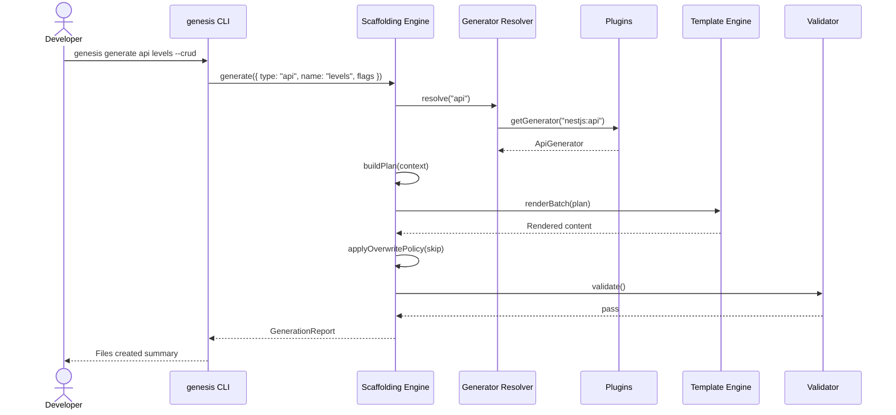
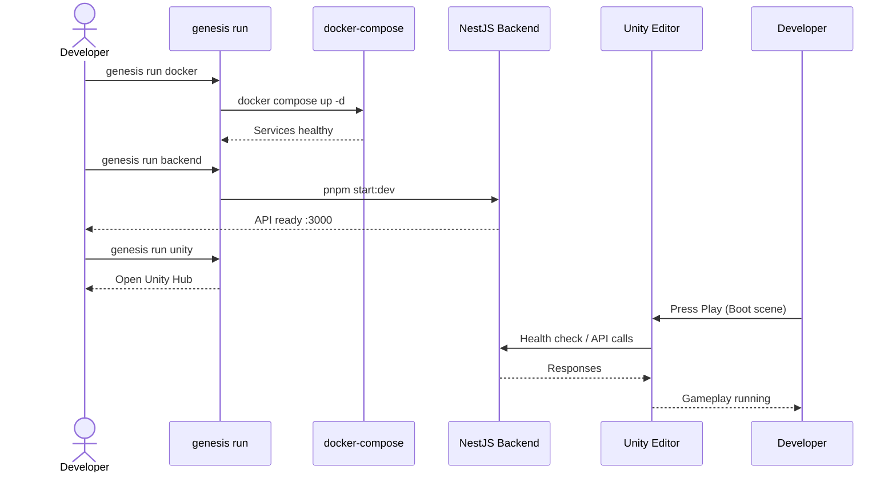
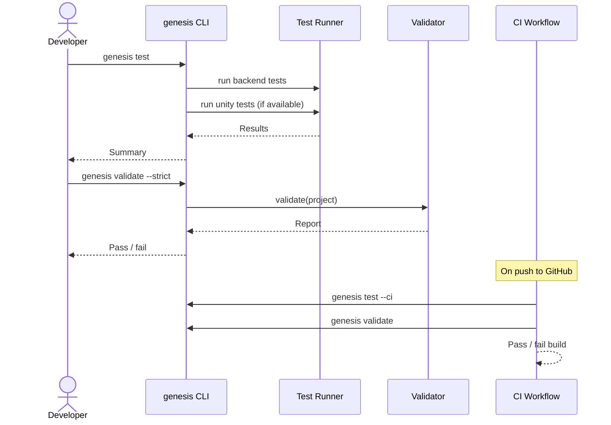
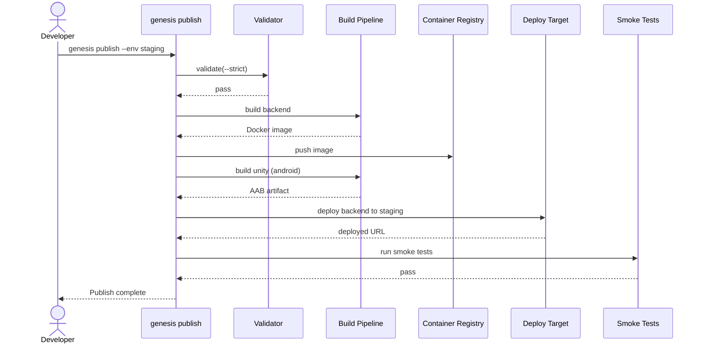
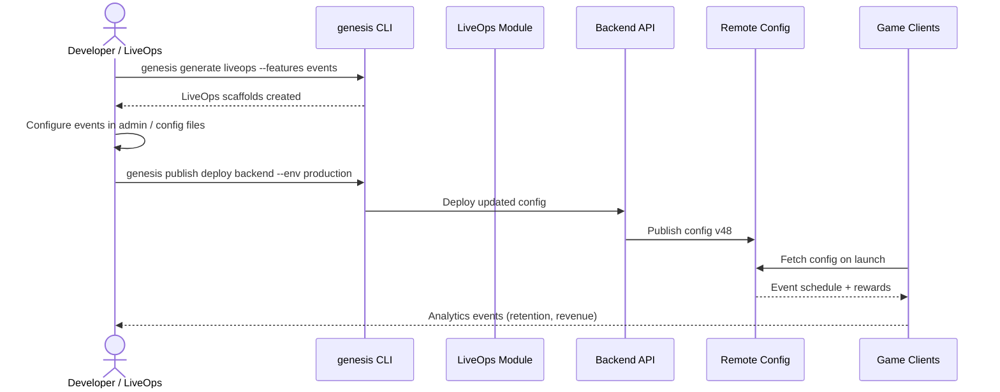
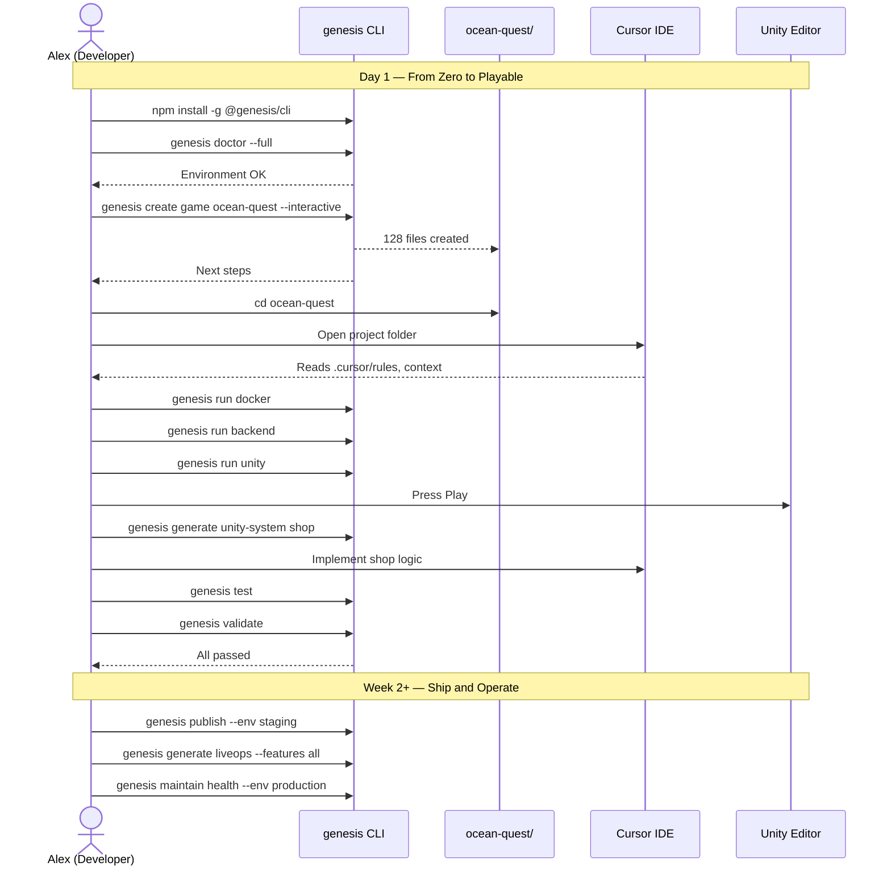

# Project Genesis — Developer Journey

## Purpose

Define the complete **Developer Experience (DX)** for Project Genesis — the end-to-end journey from first install through game creation, development, testing, publishing, updating, and long-term maintenance.

This document is the **product and UX contract** for how developers interact with Genesis. It bridges governance ([DECISION_LOG.md](../../DECISION_LOG.md)), functional specifications ([001-cli](../001-cli/) through [009-liveops](../009-liveops/)), and the day-to-day workflow of a developer who has never used Genesis before.

## Scope

### In Scope

- Full developer lifecycle (10 stages)
- CLI commands, flags, and expected outputs per stage
- Generated artifacts and project structure
- AI assistant interactions (CLI AI engine + Cursor IDE)
- Error scenarios and recovery actions
- Sequence diagrams for critical flows

### Out of Scope

- Implementation code
- Internal package APIs (see individual functional specs)
- App store submission checklists (referenced, not owned by Genesis)

## Audience Persona

**Alex** — A mobile game developer with Unity and TypeScript experience. Has built games before but never used Project Genesis. Wants to ship a casual puzzle game for iOS and Android with a backend, analytics, and LiveOps foundations. Uses Cursor as their IDE.

## Journey Overview



| Stage | Primary Command(s) | Phase | Spec Reference |
|-------|-------------------|-------|----------------|
| 1. Installation | `npm install -g @genesis/cli` | 1 | [001-cli](../001-cli/) |
| 2. First Launch | `genesis --version`, `genesis doctor` | 1 | [001-cli](../001-cli/) |
| 3. Create First Game | `genesis create game <name>` | 3 | [006-game-generation](../006-game-generation/) |
| 4. Configure Project | `genesis config`, edit `.genesis/config.yml` | 1–3 | [004-scaffolding](../004-scaffolding/) |
| 5. Generate Code | `genesis generate <type>` | 2–3 | [004](../004-scaffolding/), [007](../007-backend/), [008](../008-unity/) |
| 6. Run Game | `genesis run`, `genesis run backend` | 3 | This document (DX extension) |
| 7. Test | `genesis test`, `genesis validate` | 1–3 | [001-cli](../001-cli/), validators |
| 8. Publish | `genesis publish` | 3+ | This document (DX extension) |
| 9. Update | `genesis update`, `genesis upgrade project` | 1+ | This document (DX extension) |
| 10. Maintain | `genesis maintain`, `genesis generate liveops` | post-MVP | [009-liveops](../009-liveops/) |

> **Note:** Commands marked "DX extension" are defined in this document for end-to-end journey completeness. They delegate to generated project scripts and plugins. They will be added to [001-cli](../001-cli/) in Phase 3.

---

## Prerequisites

Before starting the journey, Alex needs:

| Requirement | Version | Verified By |
|-------------|---------|-------------|
| Node.js | 22.x LTS | `genesis doctor` |
| Git | 2.x+ | `genesis doctor` |
| Unity Hub + Unity | 6 LTS (for game dev) | `genesis doctor --full` |
| Docker Desktop (for backend) | Latest stable | `genesis doctor --full` |
| Cursor IDE (recommended) | Latest | Manual |

---

## Stage 1 — Installation

### User Goal

Install the Genesis CLI and verify the development environment is ready.

### CLI Commands

```bash
# End user (when published)
npm install -g @genesis/cli

# Or without global install
pnpm dlx @genesis/cli --version

# Contributor (monorepo development)
git clone https://github.com/project-genesis/genesis.git
cd genesis
pnpm install
pnpm build
pnpm link --global    # optional: expose genesis on PATH
```

### Generated Artifacts

| Artifact | Location | Description |
|----------|----------|-------------|
| Global CLI binary | `$(npm prefix -g)/bin/genesis` | CLI entry point |
| User config directory | `~/.genesis/` | Created on first `genesis config init` |
| Default config file | `~/.genesis/config.yml` | User-level defaults (optional) |

### AI Interactions

| When | Interaction | Channel |
|------|-------------|---------|
| After install | None required | — |
| Optional | Ask Cursor: "How do I verify Genesis is installed?" | Cursor chat |

Genesis does not invoke the AI engine during installation.

### Expected Outputs

```bash
$ genesis --version
genesis v0.1.0 (node v22.11.0)

$ genesis --help
Usage: genesis [options] [command]

Commands:
  create <name>          Scaffold a new project
  create game <name>     Scaffold a new game project
  generate <type>        Generate module within project
  validate               Run architecture checks
  config                 Manage configuration
  plugin                 Manage plugins
  doctor                 Check environment prerequisites
  run                    Run project services
  test                   Run project tests
  publish                Build and deploy artifacts
  update                 Update Genesis CLI
  ai                     AI-assisted development (Phase 4)
```

### Common Errors

| Error | Cause | Exit Code |
|-------|-------|-----------|
| `command not found: genesis` | CLI not on PATH | — |
| `Error: Node.js 22+ required` | Wrong Node version | 1 |
| `EACCES: permission denied` | Global install without permissions | — |
| `Cannot find module '@genesis/cli'` | Monorepo not built | 1 |

### Recovery Actions

| Error | Recovery |
|-------|----------|
| `command not found` | Use `pnpm dlx @genesis/cli` or add npm global bin to PATH |
| Node version | Install Node 22 via `nvm install 22` or `.nvmrc` in repo |
| Permission denied | Use `npm install -g @genesis/cli --prefix ~/.local` and add `~/.local/bin` to PATH |
| Monorepo build failure | Run `pnpm install && pnpm build`; check `PROJECT_STATUS.md` for M1 status |

### Sequence Diagram



---

## Stage 2 — First Launch

### User Goal

Confirm Genesis works, understand available commands, and verify the local environment can support game development.

### CLI Commands

```bash
genesis --version                    # Verify CLI
genesis --help                       # Discover commands
genesis config init                  # Create user-level config (optional)
genesis config show                  # Inspect resolved configuration
genesis plugin list                  # See installed plugins (Phase 2+)
genesis doctor                       # Quick environment check
genesis doctor --full                # Include Unity, Docker, mobile SDKs
```

### Generated Artifacts

| Artifact | Location | When Created |
|----------|----------|--------------|
| User config | `~/.genesis/config.yml` | `genesis config init` |
| Doctor report | stdout (or `--json`) | `genesis doctor` |

**Default `~/.genesis/config.yml`:**

```yaml
user:
  name: ""
  email: ""

defaults:
  template: default
  author: ""
  overwritePolicy: skip

ai:
  enabled: true
  provider: openai          # Phase 4
  enrichOnCreate: true

logging:
  level: info
```

### AI Interactions

| When | Interaction | Channel |
|------|-------------|---------|
| Exploring commands | Cursor: "What can I do with Genesis?" | Cursor chat referencing `AI_ARCHITECT.md` |
| Environment issues | Cursor: "genesis doctor reports Unity missing" | Cursor troubleshoots from doctor output |

### Expected Outputs

```bash
$ genesis doctor
Genesis Environment Check

  ✓ Node.js        v22.11.0
  ✓ Git            v2.43.0
  ✓ Genesis CLI    v0.1.0
  ○ Docker         not found (required for backend)
  ○ Unity          not found (required for game development)

2 passed, 2 optional missing

Run `genesis doctor --full` for detailed diagnostics.
```

```bash
$ genesis config show
# Resolved configuration (secrets redacted)
user:
  name: Alex
defaults:
  template: default
  overwritePolicy: skip
```

### Common Errors

| Error | Cause |
|-------|-------|
| `No configuration file found` | `genesis config show` before `config init` — informational, not fatal |
| `Plugin discovery failed: ...` | Corrupt plugin in `packages/plugins/` (contributors only) |
| `doctor: Unity Hub not detected` | Unity not installed — expected until game dev stage |

### Recovery Actions

| Error | Recovery |
|-------|----------|
| No config | Run `genesis config init` or proceed — project config is separate |
| Plugin failure | Run with `--verbose` for details; remove failing plugin; `genesis plugin list` |
| Missing Unity/Docker | Install prerequisites; re-run `genesis doctor --full` |

### Sequence Diagram



---

## Stage 3 — Creating the First Game

### User Goal

Scaffold a complete mobile game project — documentation, backend, Unity client, DevOps, and AI operating system — from a single command.

### CLI Commands

```bash
# Recommended: interactive mode for first game
genesis create game ocean-quest --interactive

# Non-interactive with explicit flags
genesis create game ocean-quest \
  --template mobile-puzzle \
  --genre puzzle \
  --platform ios,android \
  --monetization f2p \
  --analytics firebase \
  --ads admob \
  --output ./ocean-quest

# Preview without writing files
genesis create game ocean-quest --template mobile-puzzle --dry-run

# Skip AI enrichment (faster, deterministic)
genesis create game ocean-quest --template mobile-puzzle --no-ai
```

### Interactive Prompts (First Game)

When `--interactive` is used (default when stdin is a TTY):

| Prompt | Default | Options |
|--------|---------|---------|
| Game name | (from CLI arg) | kebab-case validation |
| Template | `mobile-puzzle` | `mobile-rpg`, `mobile-puzzle`, `mobile-idle`, `default` |
| Genre | from template | `rpg`, `puzzle`, `idle`, `generic` |
| Author / studio | from `~/.genesis/config.yml` | free text |
| Monetization | `f2p` | `f2p`, `premium`, `hybrid` |
| Analytics provider | `firebase` | `firebase`, `ugs`, `none` |
| Ads | `true` (f2p) | `true`, `false` |
| Cloud save | `firebase` | `firebase`, `backend`, `none` |
| AI enrichment | `true` | `true`, `false` |
| Output directory | `./ocean-quest` | path |
| Confirm generation | — | `y/n` |

### Generated Artifacts

Full project structure per [006-game-generation](../006-game-generation/README.md):

```
ocean-quest/
├── .cursor/                      # AI OS for this game
│   ├── rules/                    # Game-specific Cursor rules
│   ├── context/
│   │   ├── PROJECT_SUMMARY.md
│   │   ├── CURRENT_TASK.md
│   │   └── GAME_DESIGN.md
│   └── prompts/
├── .github/workflows/
│   ├── ci.yml                    # Lint, test, build
│   └── release.yml               # Release pipeline
├── docs/
│   ├── GDD.md                    # Game Design Document
│   ├── ARCHITECTURE.md
│   ├── ECONOMY.md                # Designer scaffold
│   ├── ANALYTICS.md
│   └── LOCALIZATION.md
├── backend/
│   ├── src/
│   │   ├── domain/
│   │   ├── application/
│   │   ├── infrastructure/
│   │   └── presentation/
│   ├── test/
│   ├── docker-compose.yml
│   └── package.json
├── unity/
│   ├── Assets/_Project/
│   │   ├── Scripts/Systems/
│   │   ├── ScriptableObjects/
│   │   ├── Scenes/               # Boot, Main, Gameplay
│   │   └── Prefabs/
│   └── ProjectSettings/
├── .genesis/
│   ├── config.yml                # Project Genesis config
│   └── generation-report.json    # Last generation summary
├── genesis.config.yml            # Project manifest (human-readable)
├── .gitignore
├── .env.example
└── README.md
```

### AI Interactions

| Phase | AI Action | Engine | Optional |
|-------|-----------|--------|----------|
| Phase 1 — Documentation | Enrich GDD sections from genre defaults | `@genesis/ai` | `--no-ai` skips |
| Phase 1 — Documentation | Generate architecture narrative from structure | `@genesis/ai` | yes |
| Phase 7 — AI OS | Tailor `.cursor/rules/` to genre (puzzle vs RPG) | `@genesis/ai` | yes |
| Phase 7 — AI OS | Generate initial backlog from GDD | `@genesis/ai` | yes |
| Post-create | Open project in Cursor; AI reads `.cursor/context/` | Cursor IDE | recommended |

**Example AI enrichment flow:**

```bash
# During create (automatic unless --no-ai)
# AI Engine reads: genre template, standards/, knowledge/
# AI Engine writes: enriched GDD sections, custom rules

# After create (Phase 4)
genesis ai plan "Implement level selection screen for puzzle game"
```

### Expected Outputs

```bash
$ genesis create game ocean-quest --template mobile-puzzle --interactive

 Ocean Quest — Game Project Generator
 Template: mobile-puzzle (Casual Puzzle)
 Genre: puzzle | Platform: iOS, Android

 Phase 1/7  Documentation ............................ done (12 files)
 Phase 2/7  Structure      ............................ done (8 files)
 Phase 3/7  Backend        ............................ done (34 files)
 Phase 4/7  Unity Client   ............................ done (41 files)
 Phase 5/7  Platform Svc   ............................ done (18 files)
 Phase 6/7  DevOps         ............................ done (6 files)
 Phase 7/7  AI OS          ............................ done (9 files)

 Validation ........................................... passed

 Created 128 files in ./ocean-quest

 Next steps:
   cd ocean-quest
   genesis doctor --full
   genesis run backend
   open unity/ in Unity Hub
```

### Common Errors

| Error | Code | Cause |
|-------|------|-------|
| `Invalid project name: ocean_quest` | 2 | Name not kebab-case |
| `Directory already exists: ./ocean-quest` | 1 | Output path exists; no `--force` |
| `Template not found: mobile-runner` | 1 | Template not yet available |
| `Validation failed: backend does not compile` | 3 | Generation bug or template error |
| `MISSING_VARIABLE: author` | 1 | Non-interactive mode without required var |
| `Plugin @genesis/plugin-unity not loaded` | 1 | Unity plugin missing (Phase 2) |
| `PROMPT_CANCELLED` | 1 | User cancelled interactive prompts |

### Recovery Actions

| Error | Recovery |
|-------|----------|
| Invalid name | Use kebab-case: `ocean-quest`, not `OceanQuest` or `ocean_quest` |
| Directory exists | Use `--dry-run` to preview; `--force` to overwrite (backs up nothing — use git) |
| Template not found | Run `genesis create game --help` for available templates; use `mobile-puzzle` or `default` |
| Validation failure | Read `.genesis/generation-report.json`; run `genesis validate --verbose`; report bug |
| Missing variable | Pass `--author "Studio"` or use `--interactive` |
| Plugin missing | Install plugins: `genesis plugin install unity` (Phase 2) |
| Cancelled prompt | Re-run command; answers are not saved between attempts |

### Sequence Diagram



---

## Stage 4 — Configuring the Project

### User Goal

Customize the generated game project — name, services, monetization, environment variables, and generation defaults — without regenerating the entire project.

### CLI Commands

```bash
cd ocean-quest

# View project configuration
genesis config show

# Initialize missing project config (rare — created during scaffold)
genesis config init --project

# Edit config (opens $EDITOR)
genesis config edit

# Set individual values
genesis config set game.monetization premium
genesis config set backend.database postgres
genesis config set unity.targetFps 60

# Validate config against schema
genesis config validate
```

### Configuration Files

| File | Scope | Purpose |
|------|-------|---------|
| `~/.genesis/config.yml` | User | Global defaults (author, AI preferences) |
| `ocean-quest/.genesis/config.yml` | Project | Game-specific Genesis settings |
| `ocean-quest/genesis.config.yml` | Project | Human-readable project manifest |
| `ocean-quest/.env` | Project | Secrets and environment (not committed) |
| `ocean-quest/.env.example` | Project | Documented env var template |

**`.genesis/config.yml` (project):**

```yaml
project:
  name: ocean-quest
  template: mobile-puzzle
  version: 0.1.0
  genre: puzzle
  createdAt: "2026-07-26T12:00:00Z"
  genesisVersion: "0.1.0"

game:
  platform: [ios, android]
  monetization: f2p
  targetFps: 60
  defaultLanguage: en

backend:
  framework: nestjs
  database: postgres
  port: 3000

unity:
  version: "6000.0"
  renderPipeline: urp
  dimension: 2d

services:
  analytics: firebase
  ads: admob
  cloudSave: firebase
  iap: true

generation:
  overwritePolicy: skip      # skip | prompt | force
  validateAfterGenerate: true

ai:
  enrichOnGenerate: true
```

### Generated Artifacts

Configuration edits do not generate new files unless `genesis generate` is run afterward. Editing config may update:

| Artifact | Trigger |
|----------|---------|
| `.genesis/config.yml` | `genesis config set` |
| `genesis.config.yml` | Synced mirror of key project fields |
| `.env` | Manual edit or `genesis config set-env` (Phase 3) |

### AI Interactions

| When | Interaction |
|------|-------------|
| Configuring monetization | Cursor: "What ad providers does Genesis support?" → reads `docs/ANALYTICS.md`, specs |
| Environment setup | Cursor: "Help me fill .env for local development" → reads `.env.example` |
| Architecture changes | `genesis ai plan "Add guild system to ocean-quest"` (Phase 4) |

### Expected Outputs

```bash
$ genesis config show
# Project: ocean-quest (mobile-puzzle)
# Resolved from: .genesis/config.yml + .env

project:
  name: ocean-quest
  template: mobile-puzzle
game:
  monetization: f2p
backend:
  database: postgres
  port: 3000
# secrets: [REDACTED]
```

```bash
$ genesis config validate
✓ Schema valid
✓ Required fields present
✓ Plugin requirements satisfied (@genesis/plugin-unity, @genesis/plugin-nestjs)
```

### Common Errors

| Error | Cause |
|-------|-------|
| `Not a Genesis project` | No `.genesis/config.yml` in cwd or parents |
| `Invalid config: game.monetization` | Value not in allowed enum |
| `Config key not found: game.guild` | Unknown key |
| `Plugin requirement not met: firebase` | Firebase plugin not installed |

### Recovery Actions

| Error | Recovery |
|-------|----------|
| Not a Genesis project | `cd` into project root or run `genesis create game` first |
| Invalid value | Run `genesis config show --schema` for allowed values |
| Unknown key | Check `genesis.config.yml` documentation in project README |
| Plugin requirement | `genesis plugin install firebase` |

---

## Stage 5 — Generating Code

### User Goal

Add features, systems, APIs, and modules to the existing game project without recreating it from scratch.

### CLI Commands

```bash
# Backend modules
genesis generate backend module inventory
genesis generate api levels --crud --pagination cursor
genesis generate backend auth
genesis generate backend docker --services postgres,redis

# Unity systems
genesis generate unity-system level-select
genesis generate unity-scene Level_001 --template gameplay --dimension 2d
genesis generate unity-prefab PuzzleTile --template gameplay
genesis generate unity-so LevelConfig --category config
genesis generate unity services --analytics firebase --ads true

# Documentation
genesis generate docs adr
genesis generate docs api

# LiveOps (post-MVP)
genesis generate liveops --features all

# Plugin scaffolding
genesis generate plugin analytics

# Preview changes
genesis generate api leaderboard --dry-run

# Non-interactive (CI)
genesis generate api leaderboard --yes --no-interactive
```

### Generation Flags (All `generate` Commands)

| Flag | Description |
|------|-------------|
| `--dry-run` | Show plan without writing |
| `--force` | Overwrite existing files |
| `--interactive` | Prompt for missing variables |
| `--no-interactive` | Fail on missing variables |
| `--yes` | Auto-confirm prompts |
| `--skip-validation` | Skip post-generation validation |

### Generated Artifacts (Examples)

**`genesis generate api levels --crud`:**

```
backend/src/
├── domain/levels/level.entity.ts
├── application/levels/level.service.ts
├── application/levels/level.service.spec.ts
├── infrastructure/levels/level.repository.ts
├── presentation/levels/level.controller.ts
├── presentation/levels/level.dto.ts
└── presentation/levels/level.module.ts
```

**`genesis generate unity-system level-select`:**

```
unity/Assets/_Project/Scripts/Systems/LevelSelect/
├── ILevelSelectSystem.cs
├── LevelSelectSystem.cs
├── LevelSelectConfig.cs          # ScriptableObject
├── LevelSelectEvents.cs
└── Tests/LevelSelectSystemTests.cs
```

**`genesis generate liveops --features all`:**

```
backend/src/application/liveops/
unity/Assets/_Project/Scripts/LiveOps/
framework/liveops/                 # Symlink or package reference
```

### AI Interactions

| When | Command / Action |
|------|----------------|
| Before generating | `genesis ai plan "Add daily reward system with streak bonuses"` |
| After generating | Cursor implements business logic in generated skeletons |
| Code review | `genesis ai review` (reviews staged changes) |
| Documentation | `genesis ai docs` (documents changes) |
| In Cursor | Use `.cursor/prompts/create-system.md` for implementation guidance |

### Expected Outputs

```bash
$ genesis generate api levels --crud --dry-run

 Generation Plan — api:levels (crud)
 Target: backend/
 Files: 7 create, 1 modify (app.module.ts)

 CREATE  backend/src/domain/levels/level.entity.ts
 CREATE  backend/src/application/levels/level.service.ts
 CREATE  backend/src/application/levels/level.service.spec.ts
 CREATE  backend/src/infrastructure/levels/level.repository.ts
 CREATE  backend/src/presentation/levels/level.controller.ts
 CREATE  backend/src/presentation/levels/level.dto.ts
 CREATE  backend/src/presentation/levels/level.module.ts
 MODIFY  backend/src/app.module.ts

 Dry run — no files written. Run without --dry-run to execute.
```

```bash
$ genesis generate unity-system level-select

 Created 5 files in unity/Assets/_Project/Scripts/Systems/LevelSelect/
 Validation ........................................... passed
```

### Common Errors

| Error | Cause |
|-------|-------|
| `Generator not found: unity-system` | Unity plugin not loaded |
| `File exists: level.service.ts` | Conflict; default policy is `skip` |
| `MISSING_VARIABLE: moduleName` | Non-interactive without required args |
| `Not a Genesis project` | Run from project root |
| `Validation failed: naming convention` | Generated name violates standards |

### Recovery Actions

| Error | Recovery |
|-------|----------|
| Generator not found | `genesis plugin list`; install required plugin |
| File exists | Use `--dry-run` to inspect; `--force` to overwrite; or rename module |
| Missing variable | Add positional arg or `--interactive` |
| Wrong directory | `cd` to project root (where `.genesis/` exists) |
| Validation failure | Fix with `genesis validate --verbose`; adjust generator flags |

### Sequence Diagram



---

## Stage 6 — Running the Game

### User Goal

Start the backend API and launch the Unity client locally for development and play-testing.

### CLI Commands

```bash
# Start all services (backend + dependencies)
genesis run

# Start specific targets
genesis run backend
genesis run backend --watch          # Hot reload
genesis run docker                   # Start postgres, redis via compose
genesis run unity                    # Open Unity project in Hub

# Run with environment
genesis run backend --env development
genesis run --profile local          # Uses docker-compose profile

# Stop services
genesis stop
genesis stop backend
```

> **DX extension:** `genesis run` orchestrates scripts defined in `genesis.config.yml` and generated `package.json` / `docker-compose.yml`. It does not replace Unity Editor play mode.

### Generated Artifacts (Runtime — Not New Files)

| Service | Started By | Port |
|---------|-----------|------|
| PostgreSQL | `genesis run docker` | 5432 |
| Redis | `genesis run docker` | 6379 |
| NestJS API | `genesis run backend` | 3000 |
| Swagger UI | auto with backend | 3000/api |
| Unity Editor | `genesis run unity` | — |

### AI Interactions

| When | Interaction |
|------|-------------|
| Runtime errors | Cursor: paste error log; AI reads `backend/` and `unity/` context |
| API debugging | Cursor uses generated OpenAPI spec at `/api/docs` |
| Unity issues | Cursor reads `.cursor/rules/08-unity-development.mdc` equivalent in game project |

### Expected Outputs

```bash
$ genesis run docker
[docker] Starting postgres, redis...
[docker] postgres ready on localhost:5432
[docker] redis ready on localhost:6379

$ genesis run backend
[backend] NestJS running on http://localhost:3000
[backend] Swagger docs at http://localhost:3000/api

$ genesis run unity
[unity] Opening ocean-quest/unity in Unity Hub...
[unity] Project path: /Users/alex/ocean-quest/unity
```

Unity Editor: Press **Play** on `Boot` scene → loads `Main` → loads `Gameplay`.

### Common Errors

| Error | Cause |
|-------|-------|
| `Docker not running` | Docker Desktop stopped |
| `Port 3000 already in use` | Another process on port |
| `Database connection refused` | Docker services not started |
| `Unity Hub not found` | Unity not installed |
| `Missing .env` | Secrets not configured |

### Recovery Actions

| Error | Recovery |
|-------|----------|
| Docker not running | Start Docker Desktop; `genesis run docker` |
| Port conflict | `genesis config set backend.port 3001` or kill conflicting process |
| Database connection | Ensure `genesis run docker` first; check `.env` DATABASE_URL |
| Unity not found | Install Unity 6 LTS via Hub; `genesis doctor --full` |
| Missing .env | `cp .env.example .env`; fill values; never commit `.env` |

### Sequence Diagram



---

## Stage 7 — Testing

### User Goal

Verify the project meets quality standards — unit tests pass, architecture is compliant, and the game systems behave correctly.

### CLI Commands

```bash
# Run all tests
genesis test

# Run by target
genesis test backend
genesis test unity
genesis test e2e

# Architecture and standards validation
genesis validate
genesis validate --strict
genesis validate --path ./backend

# Coverage
genesis test backend --coverage

# Watch mode
genesis test backend --watch

# CI mode (non-interactive, JSON output)
genesis test --ci --json
```

### Test Targets

| Target | Framework | Location |
|--------|-----------|----------|
| Backend unit/integration | Vitest / Jest | `backend/test/`, `backend/src/**/*.spec.ts` |
| Unity EditMode | Unity Test Framework | `unity/Assets/_Project/Scripts/**/Tests/` |
| Unity PlayMode | Unity Test Framework | `unity/Assets/_Project/Scripts/**/PlayModeTests/` |
| E2E | Generated CI workflow | `.github/workflows/ci.yml` |
| Architecture | `@genesis/validator` | Whole project |

### Generated Artifacts

| Artifact | When |
|----------|------|
| Coverage report | `genesis test --coverage` → `coverage/` |
| Validation report | `genesis validate --json` → stdout or file |
| Test results XML | `genesis test --ci` → `test-results/` |

### AI Interactions

| When | Command / Action |
|------|----------------|
| Write tests for new system | `genesis generate docs` + Cursor: "Write tests for LevelSelectSystem" |
| Fix failing tests | `genesis ai plan "Fix failing level.service.spec.ts"` |
| Review test quality | `genesis ai review --focus tests` |
| In Cursor | `.cursor/prompts/create-tests.md` |

### Expected Outputs

```bash
$ genesis test backend

 PASS  src/application/levels/level.service.spec.ts
 PASS  src/application/auth/auth.service.spec.ts

 Tests:  24 passed, 24 total
 Time:   3.2s

$ genesis validate

 Architecture Validation — ocean-quest

 ✓ Directory structure
 ✓ Layer boundaries (backend)
 ✓ No secrets in committed files
 ✓ .cursor/ rules present
 ✓ Documentation complete
 ○ Unity script line count (1 warning: GameManager.cs 215 lines)

 5 passed, 1 warning

$ genesis test --ci
# Exit 0 if all pass; JSON report for CI
```

### Common Errors

| Error | Cause | Exit Code |
|-------|-------|-----------|
| Test failures | Broken implementation | 1 |
| `Validation failed: 3 errors` | Architecture violations | 3 |
| `Unity Test Runner not found` | Unity not installed | 1 |
| `Database required for integration tests` | Docker not running | 1 |

### Recovery Actions

| Error | Recovery |
|-------|----------|
| Test failures | Read failure output; fix implementation; `genesis test <target> --watch` |
| Validation errors | `genesis validate --verbose`; fix per rule; see `standards/` |
| Unity tests | Open Unity Test Runner; run EditMode tests manually |
| Integration tests | `genesis run docker` before `genesis test backend` |

### Sequence Diagram



---

## Stage 8 — Publishing

### User Goal

Build production artifacts and deploy the backend and mobile clients to staging or production environments.

### CLI Commands

```bash
# Build all artifacts
genesis publish build

# Build specific targets
genesis publish build backend
genesis publish build unity --platform ios
genesis publish build unity --platform android

# Deploy to environments
genesis publish deploy backend --env staging
genesis publish deploy backend --env production

# Full pipeline
genesis publish --env staging          # build + deploy + smoke test

# Mobile store build (generates, does not submit)
genesis publish build unity --platform ios --release
genesis publish build unity --platform android --release --aab

# Dry run
genesis publish --dry-run --env staging
```

> **DX extension:** `genesis publish` orchestrates generated CI/CD workflows, Docker builds, and Unity build scripts. App store **submission** is manual or via Fastlane (generated scaffold).

### Generated Artifacts

| Artifact | Target | Location |
|----------|--------|----------|
| Docker image | Backend | Container registry |
| Compiled API | Backend | `backend/dist/` |
| iOS IPA / Xcode archive | Unity | `unity/Builds/iOS/` |
| Android APK/AAB | Unity | `unity/Builds/Android/` |
| OpenAPI spec | Backend | `backend/openapi.json` |
| Release notes draft | Docs | `docs/RELEASE_NOTES.md` |

### AI Interactions

| When | Interaction |
|------|-------------|
| Pre-release review | `genesis ai review` on release branch |
| Release notes | `genesis ai docs --type release-notes` |
| Store listing copy | Cursor: "Generate App Store description from GDD" |

### Expected Outputs

```bash
$ genesis publish build

 [build] Backend ...................................... done
         dist/ compiled (0 errors)
         Docker image: ocean-quest-api:0.1.0

 [build] Unity Android .............................. done
         AAB: unity/Builds/Android/ocean-quest.aab

 [build] Unity iOS ................................... skipped
         Use --platform ios to build

 Build complete. Artifacts ready in ./build/

$ genesis publish deploy backend --env staging

 [deploy] Deploying ocean-quest-api:0.1.0 to staging...
 [deploy] Health check ............................... passed
 [deploy] Smoke test ................................. passed

 Deployed: https://api-staging.ocean-quest.example.com
```

### Common Errors

| Error | Cause |
|-------|-------|
| `Build failed: TypeScript errors` | Code doesn't compile |
| `Docker push failed: unauthorized` | Registry credentials missing |
| `Unity build failed` | Missing Android SDK / Xcode |
| `Smoke test failed` | Staging environment unhealthy |
| `Validation failed` | `genesis validate --strict` not passing |

### Recovery Actions

| Error | Recovery |
|-------|----------|
| Compile errors | `genesis test backend`; fix errors; rebuild |
| Docker auth | Configure registry credentials in CI secrets or `.env` |
| Unity build | `genesis doctor --full`; install SDKs; build from Unity Editor first |
| Smoke test | Check staging logs; `genesis run backend --env staging` locally |
| Validation | Fix all validation errors before publish |

### Sequence Diagram



---

## Stage 9 — Updating

### User Goal

Keep Genesis CLI, project templates, plugins, and generated project dependencies current without breaking the game.

### CLI Commands

```bash
# Update Genesis CLI itself
genesis update
genesis update --check          # Show available version without installing

# Update project Genesis config and templates
cd ocean-quest
genesis upgrade project
genesis upgrade project --dry-run

# Update plugins
genesis plugin update
genesis plugin update unity

# Update generated project dependencies
genesis upgrade deps
genesis upgrade deps backend
genesis upgrade deps unity

# Migrate project to new Genesis version
genesis migrate --from 0.1.0 --to 0.2.0
genesis migrate --dry-run
```

### Generated Artifacts

| Artifact | When |
|----------|------|
| `.genesis/migration-report.json` | After `genesis migrate` |
| Updated `genesis.config.yml` | Version bump in project metadata |
| Lockfile updates | `genesis upgrade deps` |
| Changelog entry | `docs/CHANGELOG.md` (if migration affects structure) |

### AI Interactions

| When | Interaction |
|------|-------------|
| Breaking changes | `genesis ai plan "Migrate ocean-quest from Genesis 0.1 to 0.2"` |
| Deprecation warnings | Cursor reads migration report and suggests fixes |

### Expected Outputs

```bash
$ genesis update --check
 Genesis CLI:  v0.1.0 (installed)
 Available:     v0.2.0
 Plugins:       unity v1.0.0 → v1.1.0 available

$ genesis upgrade project --dry-run

 Migration Plan — 0.1.0 → 0.2.0

 UPDATE  .genesis/config.yml (schema v2)
 UPDATE  backend/src/app.module.ts (new health module import)
 CREATE  backend/src/presentation/health/health.controller.ts
 SKIP    unity/ (no changes)

 2 updates, 1 create, 0 conflicts

 Run without --dry-run to apply.
```

### Common Errors

| Error | Cause |
|-------|-------|
| `Breaking migration required` | Major version jump needs manual steps |
| `Conflict: file modified` | Local changes conflict with migration |
| `Plugin incompatible` | Plugin version doesn't support CLI version |
| `Dependency resolution failed` | npm/pnpm conflict |

### Recovery Actions

| Error | Recovery |
|-------|----------|
| Breaking migration | Read migration guide in release notes; use `--dry-run` first |
| Conflicts | Commit local changes; re-run; resolve conflicts manually |
| Plugin incompatible | `genesis plugin update` or pin version in config |
| Dependency failure | Update lockfile manually; `genesis upgrade deps --force` as last resort |

---

## Stage 10 — Maintaining

### User Goal

Operate the live game — LiveOps, monitoring, content updates, economy tuning — and maintain code quality over the project lifetime.

### CLI Commands

```bash
# LiveOps scaffolding (post-MVP)
genesis generate liveops --features all
genesis generate liveops --features events,season-pass,daily-rewards

# Ongoing validation
genesis validate --strict
genesis maintain audit                    # Security + dependency audit

# Health check for production
genesis maintain health --env production

# Dependency and security audit
genesis maintain audit
genesis maintain audit --fix              # Auto-fix safe updates

# Project hygiene
genesis maintain clean                    # Remove stale build artifacts
genesis maintain docs                     # Regenerate API docs from code

# Analytics and monitoring setup
genesis generate backend observability
```

### Generated Artifacts (LiveOps Example)

```
backend/src/application/liveops/
├── config/
├── events/
├── seasons/
├── daily-rewards/
└── leaderboards/

unity/Assets/_Project/Scripts/LiveOps/
├── LiveOpsManager.cs
├── RemoteConfigClient.cs
├── EventManager.cs
├── SeasonPassManager.cs
└── DailyRewardsManager.cs
```

### AI Interactions

| When | Interaction |
|------|-------------|
| New LiveOps feature | `genesis ai plan "Add weekly tournament event"` |
| Economy tuning | Cursor reads `docs/ECONOMY.md`; suggests config changes |
| Player retention | Cursor analyzes analytics scaffold; suggests events |
| Long-term maintenance | `.cursor/context/CURRENT_TASK.md` in game project tracks active work |
| Code health | `genesis ai review` on scheduled basis |

### Expected Outputs

```bash
$ genesis maintain health --env production

 Production Health — ocean-quest

 API           ✓ healthy (142ms)
 Database      ✓ connected
 Redis         ✓ connected
 LiveOps       ✓ config synced (version 47)
 Last deploy   2026-07-20T08:00:00Z

$ genesis maintain audit

 Security Audit
 ✓ No secrets in repository
 ✓ Dependencies: 0 critical vulnerabilities
 ○ 3 packages have minor updates available

 Architecture
 ✓ Validation passed
```

### Common Errors

| Error | Cause |
|-------|-------|
| `Health check failed: API timeout` | Production outage |
| `LiveOps config stale` | Client cache not refreshing |
| `Audit: critical vulnerability` | Outdated dependency |
| `Drift detected` | Manual edits violate architecture |

### Recovery Actions

| Error | Recovery |
|-------|----------|
| API timeout | Check hosting logs; rollback via `genesis publish deploy --rollback` |
| Stale config | Force refresh in LiveOps admin; verify remote config service |
| Vulnerability | `genesis maintain audit --fix`; test; deploy patch |
| Architecture drift | `genesis validate --verbose`; refactor or update rules |

### Sequence Diagram (LiveOps Maintenance Loop)



---

## End-to-End Journey Sequence

The complete first-day experience for Alex:



---

## Command Reference (Complete)

### Global Flags

| Flag | Short | Description |
|------|-------|-------------|
| `--help` | `-h` | Show help |
| `--version` | `-V` | Show version |
| `--verbose` | `-v` | Debug logging |
| `--quiet` | `-q` | Minimal output |
| `--json` | | JSON output |
| `--config` | `-c` | Config file path |
| `--no-color` | | Disable colors |

### Command Tree (Target State)

```
genesis
├── create <name>                    # Project scaffold
├── create game <name>               # Game project scaffold
├── generate <type> [name]           # In-project generation
│   ├── api <resource>
│   ├── backend <subcommand>
│   ├── unity-system <name>
│   ├── unity-scene <name>
│   ├── unity-prefab <name>
│   ├── unity-so <name>
│   ├── docs <type>
│   ├── liveops
│   └── plugin <name>
├── validate                           # Architecture checks
├── config                               # Configuration management
│   ├── show | init | edit | set | validate | path
├── plugin                               # Plugin management
│   ├── list | info | install | update
├── doctor                               # Environment check
├── run [target]                         # Start services
├── stop [target]                        # Stop services
├── test [target]                        # Run tests
├── publish                              # Build and deploy
│   ├── build [target]
│   └── deploy <target> --env <env>
├── update                               # Update Genesis CLI
├── upgrade                              # Update project
│   ├── project
│   └── deps [target]
├── migrate                              # Version migration
├── maintain                             # Ongoing hygiene
│   ├── health | audit | clean | docs
└── ai                                   # AI-assisted development (Phase 4)
    ├── plan <requirement>
    ├── review
    └── docs
```

### Exit Codes

| Code | Meaning |
|------|---------|
| 0 | Success |
| 1 | General error |
| 2 | Invalid arguments or unknown command |
| 3 | Validation failure |
| 4 | User cancelled (interactive) |
| 5 | Environment not ready (`doctor` failure) |

---

## Phase Alignment

| Journey Stage | Minimum Phase | Milestone |
|---------------|---------------|-----------|
| 1–2 Installation & First Launch | Phase 1 | M1 — CLI Foundation |
| 4 Configure (project) | Phase 1 | M1 |
| 7 Test (`validate`) | Phase 1 | M1 |
| 5 Generate (modules) | Phase 2 | M2 — Plugins |
| 3 Create Game | Phase 3 | M3 — Game Generation |
| 6 Run | Phase 3 | M3 |
| 7 Test (full) | Phase 3 | M3 |
| 8 Publish | Phase 3+ | M3 |
| AI commands | Phase 4 | M4 — AI Engine |
| 10 LiveOps | Post-MVP | M5+ |

---

## Related Documents

| Document | Relationship |
|----------|-------------|
| [README.md](README.md) | Root project specification |
| [001-cli/FUNCTIONAL_SPEC.md](../001-cli/FUNCTIONAL_SPEC.md) | CLI behavior contract |
| [004-scaffolding/FUNCTIONAL_SPEC.md](../004-scaffolding/FUNCTIONAL_SPEC.md) | Generation pipeline |
| [006-game-generation/FUNCTIONAL_SPEC.md](../006-game-generation/FUNCTIONAL_SPEC.md) | Game creation |
| [005-ai-engine/FUNCTIONAL_SPEC.md](../005-ai-engine/FUNCTIONAL_SPEC.md) | AI interactions |
| [009-liveops/FUNCTIONAL_SPEC.md](../009-liveops/FUNCTIONAL_SPEC.md) | LiveOps maintenance |
| [AI_ARCHITECT.md](../../AI_ARCHITECT.md) | AI assistant operating guide |
| [DEVELOPMENT_WORKFLOW.md](../../DEVELOPMENT_WORKFLOW.md) | Engineering process |

## Changelog

| Version | Date | Change |
|---------|------|--------|
| 1.0.0 | 2026-07-26 | Initial developer journey specification |
