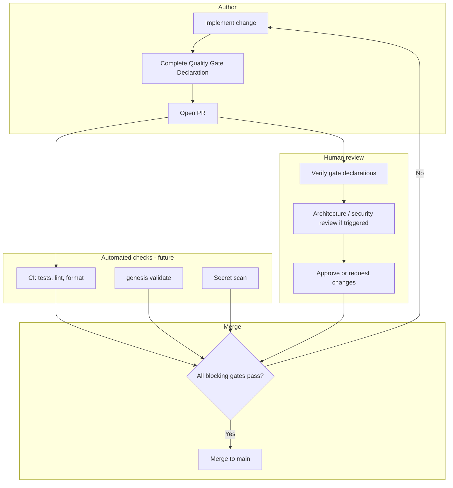
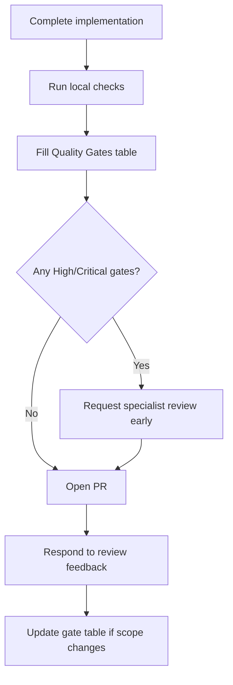
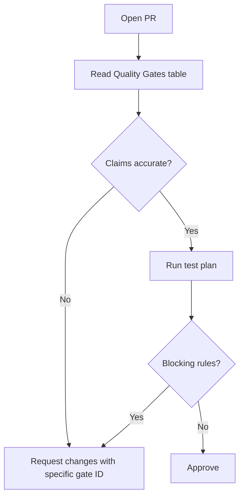

# Quality Gate System

## Purpose

Define the **Quality Gate System (QGS)** — a mandatory, structured declaration and verification framework that every Pull Request must complete before merge. Quality gates translate the [Definition of Done](../../.cursor/context/DEFINITION_OF_DONE.md) into explicit, reviewable PR attestations.

Goals:

- Make quality expectations **visible** before review begins
- Give reviewers a **consistent checklist** across all contribution types
- Enable future **automation** (`genesis validate`, CI bots, `@genesis/validator`)
- Create an **audit trail** of conscious trade-offs (debt, performance, breaking changes)

## Scope

### In scope

- Seven mandatory quality gates per PR
- Author declaration format and valid responses
- Reviewer verification workflow
- Gate applicability by PR type
- Merge blocking rules
- Future automation contract for `@genesis/validator` and CI

### Out of scope

- Runtime implementation of gate validators (Phase 1+ deliverable)
- GitHub Actions workflow YAML
- Code coverage thresholds (defined when test infrastructure exists)

## Responsibilities

| Role | Responsibility |
|------|----------------|
| **PR author** | Complete all applicable gate declarations with evidence |
| **Reviewer** | Verify gate claims; reject inaccurate or incomplete declarations |
| **Maintainer** | Block merge when blocking gates fail |
| **Architect** | Verify architecture gate for Tier 2+ changes |
| **Security steward** | Verify security gate for security-sensitive PRs |
| **CI system** | Automate verifiable gates when tooling exists |
| **AI operator** | Ensure AI-generated PRs include accurate gate declarations |

## System overview



### Gate inventory

Every PR declares seven gates:

| # | Gate | Question |
|---|------|----------|
| G1 | **Documentation** | Documentation updated? |
| G2 | **Tests** | Tests added? |
| G3 | **Architecture** | Architecture respected? |
| G4 | **Performance** | Performance impact? |
| G5 | **Security** | Security impact? |
| G6 | **Breaking changes** | Breaking changes? |
| G7 | **Technical debt** | Technical debt? |

---

## Gate declaration format

### Required structure

Every PR description must include a **Quality Gates** section immediately after the summary. Use this exact structure:

```markdown
## Quality Gates

| Gate | Status | Evidence |
|------|--------|----------|
| Documentation updated? | Yes / No / N/A | … |
| Tests added? | Yes / No / N/A | … |
| Architecture respected? | Yes / No | … |
| Performance impact? | None / Low / Medium / High | … |
| Security impact? | None / Low / Medium / High | … |
| Breaking changes? | Yes / No | … |
| Technical debt? | None / Introduced / Resolved / Deferred | … |
```

### Response rules

| Rule | Description |
|------|-------------|
| **R1** | Every gate row must be filled — no empty cells |
| **R2** | `N/A` is allowed only for G1 and G2 when justified in Evidence |
| **R3** | G3, G6 must be `Yes` or `No` — never `N/A` |
| **R4** | Evidence must be specific: file paths, commands, ADR links, issue IDs |
| **R5** | If author marks `No` on a gate that should be `Yes`, reviewer blocks merge |
| **R6** | High severity on G4/G5 triggers additional review (see escalation table) |

### Extended evidence (recommended)

For complex PRs, add a subsection per gate:

```markdown
### G3 — Architecture
- **Tier:** 2
- **Packages touched:** cli, core
- **Layer violations:** None
- **ADR:** ADR-001 compliant
- **Review:** Standard PR review (no architect required)
```

---

## Gate specifications

### G1 — Documentation updated?

**Question:** Does this PR update all documentation affected by the change?

#### When `Yes` is required

| Change type | Documentation to update |
|-------------|-------------------------|
| New feature | Functional spec, package README, CHANGELOG |
| API change | Spec, type definitions, migration notes |
| CLI command | `specs/001-cli/`, command reference |
| Config schema | `specs/001-cli/CONFIGURATION.md` |
| Architecture | ADR, `specs/100-architecture/`, package READMEs |
| Governance | `governance/`, CONTRIBUTING cross-links |
| Bug fix (behavior) | Relevant doc if behavior was documented incorrectly |

#### When `N/A` is valid

| Scenario | Evidence example |
|----------|------------------|
| Internal refactor, zero behavior change | "No user-facing or spec-documented behavior changed" |
| Test-only PR | "No production code or public API changed" |
| Typo fix in code comment only | "No docs describe this comment" |

#### Verification

| Verifier | Check |
|----------|-------|
| Reviewer | Diff includes expected doc paths or valid N/A justification |
| Future CI | Link checker; spec drift detection |

**References:** [DOCUMENTATION_POLICY.md](../../governance/DOCUMENTATION_POLICY.md), [standards/DOCUMENTATION_STANDARD.md](../../standards/DOCUMENTATION_STANDARD.md)

---

### G2 — Tests added?

**Question:** Does this PR include tests appropriate to the change?

#### When `Yes` is required

| Change type | Test requirement |
|-------------|------------------|
| New feature | Unit tests for domain logic; integration tests for workflows |
| Bug fix | Regression test proving fix |
| New public API | Contract or unit tests |
| Refactor | Existing tests pass; add tests if coverage gap exposed |

#### When `N/A` is valid

| Scenario | Evidence example |
|----------|------------------|
| Documentation-only PR | "No runtime code changed" |
| Pure config / CI change | "No testable application logic" |
| Pre-bootstrap phase | "Monorepo test runner not yet configured; manual verification listed in test plan" |

#### When `No` is acceptable

`No` is **never** acceptable for behavior-changing code PRs. It blocks merge.

#### Verification

| Verifier | Check |
|----------|-------|
| Reviewer | New test files or updated tests in diff; test plan executed |
| CI | `pnpm test` passes; coverage delta (future) |

**References:** [`.cursor/rules/04-testing.mdc`](../../.cursor/rules/04-testing.mdc), `standards/testing/`

---

### G3 — Architecture respected?

**Question:** Does this change comply with Clean Architecture, package boundaries, and ADRs?

#### Valid responses

| Status | Meaning |
|--------|---------|
| **Yes** | Layer rules followed; dependencies point inward; no ADR violations |
| **No** | Violation present — **blocks merge** unless corrected |

`N/A` is not permitted.

#### Author must declare

| Field | Content |
|-------|---------|
| Review tier | 0–4 per [ARCHITECTURE_REVIEW_PROCESS.md](../../governance/ARCHITECTURE_REVIEW_PROCESS.md) |
| Packages touched | List all affected packages |
| New dependencies | Package names and direction |
| Layer violations | `None` or description of exception with ADR |
| Architect review | `Required` / `Not required` / `Completed` |

#### Verification checklist

- [ ] Dependencies point inward ([ADR-001](../../DECISION_LOG.md#adr-001-clean-architecture))
- [ ] No circular package dependencies
- [ ] Plugins do not depend on other plugins ([ADR-002](../../DECISION_LOG.md#adr-002-plugin-based-architecture))
- [ ] Domain logic free of framework imports
- [ ] Phase constraints respected ([CURRENT_STATE.md](../../.cursor/context/CURRENT_STATE.md))
- [ ] Tier 2+ architect review completed if required

**References:** [specs/100-architecture/PACKAGES.md](../100-architecture/PACKAGES.md), [standards/ARCHITECTURE_STANDARD.md](../../standards/ARCHITECTURE_STANDARD.md)

---

### G4 — Performance impact?

**Question:** What is the performance impact of this change?

#### Valid responses

| Level | Definition | Action |
|-------|------------|--------|
| **None** | No runtime path, algorithm, or I/O change | Standard review |
| **Low** | Negligible overhead; non-hot path | Document in evidence |
| **Medium** | New I/O, allocation, or algorithm on warm path | Reviewer scrutinizes; benchmark if applicable |
| **High** | Hot path change, new sync operation, mobile-critical | Architect review; benchmark required; may block without data |

#### Author must declare

| Field | When required |
|-------|---------------|
| Affected paths | Medium or High |
| Measurement method | High (profile, benchmark command) |
| Before/after metrics | High (or "baseline not yet established") |
| Mobile impact | Unity, CLI on large repos, template generation |

#### Examples

| PR | Level | Evidence |
|----|-------|----------|
| Fix typo in README | None | No runtime code |
| Add config validation | Low | Runs once at startup |
| Template engine streaming | Medium | Reduces peak memory; no latency regression measured |
| Synchronous file walk in CLI | High | Benchmark: 10k files 2.1s → 0.4s after change |

**References:** [`.cursor/rules/11-performance.mdc`](../../.cursor/rules/11-performance.mdc), `standards/performance/`

---

### G5 — Security impact?

**Question:** What is the security impact of this change?

#### Valid responses

| Level | Definition | Action |
|-------|------------|--------|
| **None** | No auth, input, secret, network, or trust boundary change | Standard review |
| **Low** | Hardening, logging redaction, dependency patch | Standard review |
| **Medium** | New input surface, dependency with network access | Security-aware review |
| **High** | Auth, secrets, crypto, plugin loading, AI data exfiltration risk | **Security steward review required** |

#### Author must declare

| Field | When required |
|-------|---------------|
| Threat model | Medium or High |
| Attack surface | Medium or High |
| Mitigations | Medium or High |
| Secrets in diff | Always: confirm `No` |

#### Triggers for security review

Per [SECURITY_REVIEW_PROCESS.md](../../governance/SECURITY_REVIEW_PROCESS.md): authentication, authorization, secrets, input handling, network, crypto, dependencies, CI/CD, AI integrations, plugin loading.

**References:** [standards/security/](../../standards/security/), [`.cursor/rules/10-security.mdc`](../../.cursor/rules/10-security.mdc)

---

### G6 — Breaking changes?

**Question:** Does this PR introduce breaking changes?

#### Valid responses

| Status | Meaning |
|--------|---------|
| **No** | Fully backward compatible |
| **Yes** | Breaks public API, CLI contract, config schema, or plugin contract |

`N/A` is not permitted.

#### When `Yes` — author must also provide

| Requirement | Reference |
|-------------|-----------|
| Semver bump level | [VERSIONING_STRATEGY.md](../../governance/VERSIONING_STRATEGY.md) |
| Migration guide | In PR or linked doc |
| ADR | Tier 3 changes |
| CHANGELOG entry | `### Breaking` section |
| Deprecation period | If replacing existing API |
| Label | `breaking` on PR |

#### Breaking change surfaces

| Surface | Example |
|---------|---------|
| Public TypeScript API | Removed export, renamed type |
| CLI | Removed command or flag |
| Config | Required new field without default |
| Plugin contract | Changed hook signature |
| Spec requirement | Changed mandatory behavior |

**References:** [RELEASE_STRATEGY.md](../../governance/RELEASE_STRATEGY.md), [VERSIONING_STRATEGY.md](../../governance/VERSIONING_STRATEGY.md)

---

### G7 — Technical debt?

**Question:** How does this PR affect technical debt?

#### Valid responses

| Status | Meaning |
|--------|---------|
| **None** | No debt introduced, resolved, or consciously deferred |
| **Introduced** | PR knowingly adds debt — must link tracking item |
| **Resolved** | PR pays down existing debt — link resolved item |
| **Deferred** | Shortcut taken; follow-up issue filed |

#### When `Introduced` or `Deferred` — author must provide

| Field | Content |
|-------|---------|
| Debt description | What was deferred and why |
| Impact | Maintenance, performance, security, or velocity cost |
| Priority | P0–P3 |
| Tracking | Issue ID or [technical-debt.md](../../.cursor/memories/technical-debt.md) entry |
| Owner | Who will address it |
| Target | Milestone or date |

#### Rules

| Rule | Description |
|------|-------------|
| **D1** | Debt must be **explicit** — no hidden shortcuts |
| **D2** | P0/P1 debt blocks merge unless hotfix |
| **D3** | Resolving debt is encouraged; cite the item closed |
| **D4** | AI-generated "temporary" hacks require human acknowledgment |

**References:** [`.cursor/memories/technical-debt.md`](../../.cursor/memories/technical-debt.md), [ENGINEERING_PRINCIPLES.md](../../governance/ENGINEERING_PRINCIPLES.md)

---

## Gate applicability matrix

Not every gate applies equally. Use this matrix to determine expected responses:

| PR type | G1 Docs | G2 Tests | G3 Arch | G4 Perf | G5 Security | G6 Breaking | G7 Debt |
|---------|---------|----------|---------|---------|-------------|-------------|---------|
| Feature | Yes | Yes | Yes | Declare | Declare | No\* | Declare |
| Bug fix | If behavior docs | Yes | Yes | Declare | Declare | No\* | Declare |
| Refactor | If API surface | Yes\*\* | Yes | Declare | Declare | No\* | Declare |
| Docs only | Yes | N/A | Yes† | None | None | No | None |
| Chore / CI | If user-facing | N/A | Yes | None | Declare | No | Declare |
| Security fix | Yes | Yes | Yes | Declare | High | Maybe | Declare |
| Breaking change | Yes | Yes | Yes | Declare | Declare | **Yes** | Declare |

\*Unless actually breaking — then `Yes` with migration guide  
\*\*Existing tests must pass; add if gap found  
†Verify doc changes don't contradict architecture specs

---

## Merge blocking rules

A PR **cannot merge** when any blocking condition is true:

| ID | Blocking condition |
|----|-------------------|
| **B1** | Any gate row missing or empty |
| **B2** | G3 = `No` |
| **B3** | G2 = `No` on code-changing PR |
| **B4** | G6 = `Yes` without migration guide and version plan |
| **B5** | G5 = `High` without security steward approval |
| **B6** | G7 = `Introduced` with P0/P1 debt without maintainer exception |
| **B7** | G4 = `High` without benchmark evidence (when tooling exists) |
| **B8** | CI checks failing |
| **B9** | Required reviewer approvals missing |
| **B10** | Architecture review required but incomplete |

### Escalation table

| Condition | Escalation |
|-----------|------------|
| G3 Tier ≥ 3 | Chief Architect approval |
| G5 ≥ Medium | Security-aware reviewer |
| G5 = High | Security steward sign-off |
| G6 = Yes | Chief Architect + release manager notified |
| G4 = High | Architect + benchmark review |
| G7 P0/P1 | Maintainer exception or fix before merge |

---

## Workflows

### Author workflow



1. Implement change and run `pnpm test`, `pnpm lint`, `pnpm format:check` (when available)
2. Complete Quality Gates table with honest evidence
3. Add test plan and architectural impact sections
4. Request appropriate reviewers based on escalation table
5. Update gate declarations if PR scope changes during review

### Reviewer workflow



1. Verify each gate claim against the diff
2. Challenge vague evidence ("updated docs" → which files?)
3. Confirm escalation reviewers are assigned when triggered
4. Approve only when all blocking rules pass

### Maintainer merge workflow

1. Confirm all approvals present
2. Confirm Quality Gates table complete and accurate
3. Confirm CI green
4. Squash merge per [BRANCHING_STRATEGY.md](../../governance/BRANCHING_STRATEGY.md)
5. Ensure breaking changes trigger release process

---

## PR template

Canonical PR template: [templates/github/pull-request.md](../../templates/github/pull-request.md)

Minimum sections:

1. Summary
2. **Quality Gates** (mandatory table)
3. Test plan
4. Architectural impact
5. Related decisions / issues
6. AI disclosure (if applicable)

---

## Future automation

The Quality Gate System is designed for progressive automation via `@genesis/validator` and CI.

### Automation phases

| Phase | Capability | Gates automated |
|-------|------------|-----------------|
| **QG-v0** (now) | PR template + human review | All (manual) |
| **QG-v1** | CI: lint, test, format, secret scan | G2 partial, G5 partial |
| **QG-v2** | `genesis validate --gates` | G3 (layer rules), G1 partial (link check) |
| **QG-v3** | PR bot comments on missing gates | G1–G7 presence and format |
| **QG-v4** | Benchmark regression CI | G4 |
| **QG-v5** | Dependency and CVE gate | G5 |

### Machine-readable gate schema (future)

```yaml
# .github/quality-gates.yml (future — not implemented)
version: 1
gates:
  documentation:
    status: yes
    evidence:
      - specs/001-cli/FUNCTIONAL_SPEC.md
      - packages/cli/README.md
  tests:
    status: yes
    evidence:
      - packages/cli/src/__tests__/doctor.test.ts
  architecture:
    status: yes
    tier: 2
    packages: [cli, core]
  performance:
    level: low
  security:
    level: none
  breaking:
    status: no
  technical_debt:
    status: none
```

### Validator integration

`@genesis/validator` will implement:

| Command | Purpose |
|---------|---------|
| `genesis validate architecture` | G3 automated checks |
| `genesis validate docs` | G1 link and spec drift |
| `genesis validate gates` | Parse PR gate file; report gaps |

Spec reference: [specs/100-architecture/PACKAGES.md](../100-architecture/PACKAGES.md) (`@genesis/validator`).

---

## Examples

### Example 1 — Feature PR (all gates passing)

```markdown
## Quality Gates

| Gate | Status | Evidence |
|------|--------|----------|
| Documentation updated? | Yes | specs/001-cli/FUNCTIONAL_SPEC.md §4.2, packages/cli/README.md |
| Tests added? | Yes | packages/cli/src/commands/doctor.test.ts (12 cases) |
| Architecture respected? | Yes | Tier 2; cli→core read-only; no layer violations; ADR-001 |
| Performance impact? | Low | Runs once per invocation; no hot path |
| Security impact? | None | No new input surfaces; no secrets |
| Breaking changes? | No | Additive CLI command only |
| Technical debt? | None | — |
```

### Example 2 — Docs-only PR

```markdown
## Quality Gates

| Gate | Status | Evidence |
|------|--------|----------|
| Documentation updated? | Yes | governance/QUALITY_GATES.md (this file), specs/000-project/README.md |
| Tests added? | N/A | No runtime code changed |
| Architecture respected? | Yes | Tier 0; docs only; no implementation |
| Performance impact? | None | — |
| Security impact? | None | — |
| Breaking changes? | No | — |
| Technical debt? | None | — |
```

### Example 3 — Breaking change PR

```markdown
## Quality Gates

| Gate | Status | Evidence |
|------|--------|----------|
| Documentation updated? | Yes | CONFIGURATION.md, CHANGELOG.md, migration guide below |
| Tests added? | Yes | config/loader.test.ts updated for new schema |
| Architecture respected? | Yes | Tier 3; ADR-009 accepted; architect review #45 |
| Performance impact? | None | Config parsed once at startup |
| Security impact? | Low | Stricter validation of env vars |
| Breaking changes? | Yes | Removed genesis.yml; MAJOR bump @genesis/config 2.0.0 |
| Technical debt? | Resolved | Closes debt item TD-003 (dual config formats) |

### Migration
Projects must rename `genesis.yml` → `genesis.config.ts`. See CHANGELOG.md.
```

### Example 4 — Rejected gate declaration

**Author wrote:** G2 = `N/A` for a bug fix with no regression test.

**Reviewer action:** Request changes. Bug fixes require regression tests per DoD B2. Merge blocked (B3).

---

## Best practices

- Complete the Quality Gates table **before** requesting review
- Use concrete evidence — file paths, not "updated docs"
- Declare `High` impacts early; don't surprise reviewers at merge time
- If unsure about architecture tier, ask before implementing
- Prefer resolving debt over deferring it
- Update gates when PR scope changes — stale declarations are merge blockers
- AI assistants must not mark gates `Yes` without human verification

---

## Related documents

| Document | Relationship |
|----------|--------------|
| [governance/PULL_REQUEST_PROCESS.md](../../governance/PULL_REQUEST_PROCESS.md) | PR lifecycle; references quality gates |
| [.cursor/context/DEFINITION_OF_DONE.md](../../.cursor/context/DEFINITION_OF_DONE.md) | Completion criteria gates enforce |
| [governance/ARCHITECTURE_REVIEW_PROCESS.md](../../governance/ARCHITECTURE_REVIEW_PROCESS.md) | G3 tier definitions |
| [governance/SECURITY_REVIEW_PROCESS.md](../../governance/SECURITY_REVIEW_PROCESS.md) | G5 escalation |
| [governance/VERSIONING_STRATEGY.md](../../governance/VERSIONING_STRATEGY.md) | G6 semver rules |
| [governance/DOCUMENTATION_POLICY.md](../../governance/DOCUMENTATION_POLICY.md) | G1 requirements |
| [templates/github/pull-request.md](../../templates/github/pull-request.md) | PR template with gate table |
| [specs/100-architecture/PACKAGES.md](../100-architecture/PACKAGES.md) | Future `@genesis/validator` |
| [CONTRIBUTING.md](../../CONTRIBUTING.md) | Contributor onboarding |
| [DEVELOPMENT_WORKFLOW.md](../../DEVELOPMENT_WORKFLOW.md) | When gates are completed in workflow |

## Changelog

| Version | Date | Change |
|---------|------|--------|
| 1.0.0 | 2026-07-26 | Initial approved specification |
