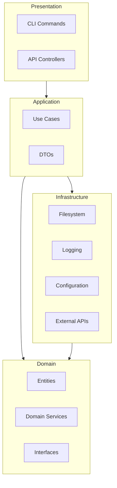

# Project Specification

## Purpose

Define the system-wide architecture, boundaries, and principles that every Project Genesis component must follow. This is the root specification — all other specs in `specs/` inherit constraints defined here.

## Scope

### In Scope

- System-wide architectural model (layers, packages, dependency rules)
- Cross-cutting concerns: configuration, logging, error handling, validation
- Monorepo structure and package naming conventions
- Quality attributes: maintainability, testability, security, performance
- Relationship between specifications, standards, and implementation

### Out of Scope

- Individual component behavior (covered by `001`–`009` specs)
- Game-specific gameplay design
- Third-party service configuration (AWS, Firebase credentials, etc.)

## Goals

| Goal | Success Criteria |
|------|------------------|
| **Maintainable architecture** | Dependencies point inward; domain has zero framework imports |
| **AI-native development** | Every system exposes explicit interfaces readable by AI assistants |
| **Plugin extensibility** | Core kernel remains technology-agnostic per ADR-002 |
| **Documentation-first** | Specifications precede implementation per ADR-007 |
| **Commercial quality** | Every deliverable meets [DEFINITION_OF_DONE.md](../../.cursor/context/DEFINITION_OF_DONE.md) |
| **Mobile-first games** | Generated projects target mobile performance constraints |

## Responsibilities

### System Layers

Project Genesis follows Clean Architecture (ADR-001):



| Layer | Responsibility | Packages |
|-------|----------------|----------|
| Presentation | User interaction, argument parsing, output formatting | `cli` |
| Application | Use case orchestration, command handlers | `cli`, `scaffolding`, `ai` |
| Domain | Business rules, generation logic, validation rules | `core`, `template-engine`, `scaffolding`, `validator` |
| Infrastructure | Filesystem, config, logging, plugin loading | `core` |

### Core Packages

| Package | Specification | Responsibility |
|---------|---------------|----------------|
| `@genesis/shared` | This document | Types, constants, pure utilities |
| `@genesis/core` | This document | Config, logging, filesystem, kernel |
| `@genesis/cli` | [001-cli](../001-cli/) | Command-line interface |
| `@genesis/template-engine` | [002-template-engine](../002-template-engine/) | Template rendering |
| `@genesis/scaffolding` | [004-scaffolding](../004-scaffolding/) | Project generation |
| `@genesis/validator` | This document | Architecture compliance checks |
| `@genesis/ai` | [005-ai-engine](../005-ai-engine/) | AI context and prompts |

### Cross-Cutting Concerns

| Concern | Owner Package | Standard |
|---------|---------------|----------|
| Configuration | `core` | Environment variables and config files; never hardcode secrets |
| Logging | `core` | Structured JSON logging per `standards/logging/` |
| Error handling | All packages | Domain errors in domain layer; infrastructure errors wrapped at boundaries |
| Validation | `validator` | Standards compliance and architecture rule checks |
| Versioning | `shared` | Semantic versioning per `standards/release/semantic-versioning.md` |

### Repository Layout

| Directory | Role |
|-----------|------|
| `specs/` | Formal specifications (this directory) |
| `packages/` | TypeScript runtime implementation |
| `standards/` | Mandatory engineering rules |
| `knowledge/` | Reference material |
| `templates/` | Authoring scaffolds for documents and code |
| `prompts/` | Composable AI prompt assets |
| `.cursor/` | AI operating system |
| `framework/` | Reusable game framework code (C#/TS) |
| `games/` | Individual game projects |

## Dependencies

This specification has no upstream spec dependencies. It depends on governance documents:

| Document | Relationship |
|----------|-------------|
| [DECISION_LOG.md](../../DECISION_LOG.md) | ADR-001 through ADR-008 |
| [PROJECT_CHARTER.md](../../docs/000-foundation/PROJECT_CHARTER.md) | Vision and principles |
| [ARCHITECTURE.md](../../.cursor/context/ARCHITECTURE.md) | Runtime architecture overview |
| [standards/ARCHITECTURE_STANDARD.md](../../standards/ARCHITECTURE_STANDARD.md) | Layer rules |

### Package Dependency Rule

```
@genesis/cli          → @genesis/core, @genesis/shared
@genesis/scaffolding  → @genesis/template-engine, @genesis/core, @genesis/shared
@genesis/template-engine → @genesis/core, @genesis/shared
@genesis/ai           → @genesis/core, @genesis/shared
@genesis/validator    → @genesis/core, @genesis/shared
@genesis/core         → @genesis/shared
@genesis/shared       → (none)
```

Dependencies must never point outward. Plugins depend on the kernel interface, not on each other.

## Future Implementation

### Phase 1 — Foundation (Milestone M1)

| Deliverable | Sprint | Spec |
|-------------|--------|------|
| Monorepo bootstrap | Sprint 1 | This document |
| `@genesis/shared`, `@genesis/core` | Sprint 1–2 | This document |
| `@genesis/cli` skeleton | Sprint 1–2 | [001-cli](../001-cli/) |
| `@genesis/template-engine` | Sprint 3 | [002-template-engine](../002-template-engine/) |
| `@genesis/scaffolding` | Sprint 4 | [004-scaffolding](../004-scaffolding/) |
| `@genesis/validator` basics | Sprint 2+ | This document |

### Phase 2 — Plugins

Plugin system per [003-plugin-system](../003-plugin-system/), with technology plugins for [008-unity](../008-unity/) and [007-backend](../007-backend/).

### Phase 3 — Game Generation

End-to-end generation per [006-game-generation](../006-game-generation/).

### Phase 4 — AI Engine

AI capabilities per [005-ai-engine](../005-ai-engine/).

### Post-MVP — LiveOps

Live operations per [009-liveops](../009-liveops/).

### Scaffold Alignment

The repository contains scaffold directories (`packages/generators`, `packages/templates`) that will be renamed or merged to match this specification during Milestone M1:

| Spec Name | Current Scaffold | Action |
|-----------|------------------|--------|
| `@genesis/scaffolding` | `packages/generators` | Rename during Sprint 4 |
| `@genesis/template-engine` | `packages/templates` | Rename during Sprint 3 |

## Related Documents

- [specs/README.md](../README.md) — Specification index
- [001-cli](../001-cli/) — CLI specification
- [packages/README.md](../../packages/README.md) — Package map

## Changelog

| Version | Date | Change |
|---------|------|--------|
| 1.0.0 | 2026-07-26 | Initial approved specification |
