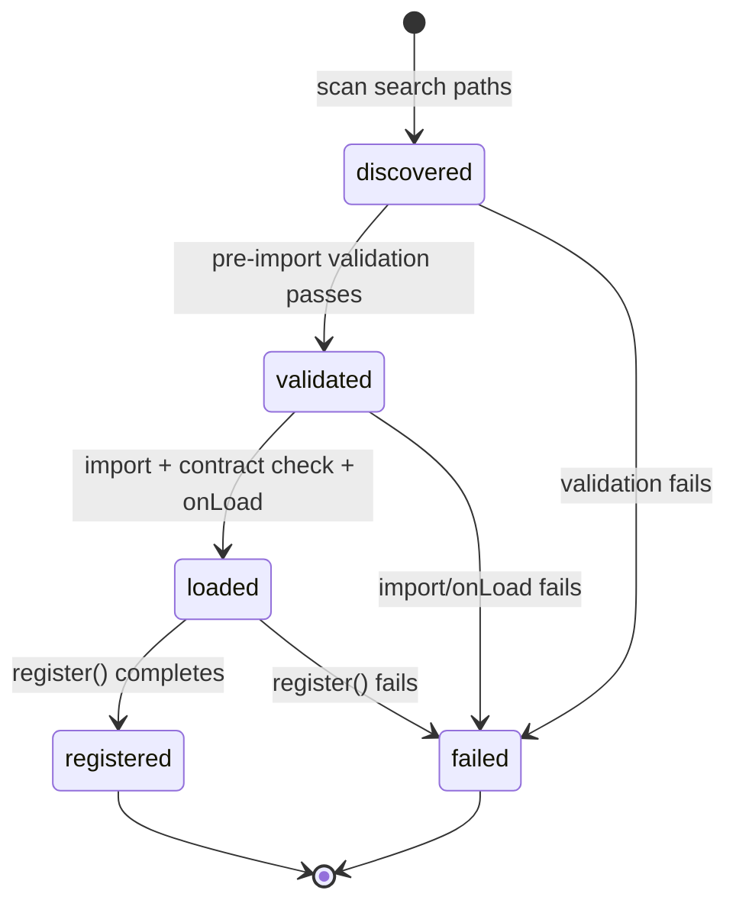

# Sprint 4 Implementation Plan — Plugin Kernel Foundation

**Status:** Implemented (Sprint 4).

**Prerequisite:** Sprint 3.5 Foundation complete.

**Goal:** Create the internal extension model that allows Genesis capabilities to be extended safely.

---

## Approved decisions

| Decision | Resolution |
|----------|------------|
| Package name | **`@genesis/plugin-kernel`** — not `@genesis/kernel` |
| Discovery paths | `packages/plugins/*`, `GENESIS_PLUGIN_PATH` only |
| Deferred discovery | `.genesis/plugins/*` — roadmap only (lifecycle/security) |
| `buildProjectPlan` | **Remove** from public scaffolding API |
| Pre-import validation | Mandatory before `import(main)` — structured `PluginLoadError` |
| Registry access | Scoped `PluginContext.register*()` only — `PluginHost` owns registries |
| Validation | `IValidationService` + `IValidationRegistry` separate; `RegistryValidationService` implements both |
| Pipeline | Hooks only in Sprint 4; step injection deferred to Sprint 5 |
| Example plugin | Template + validator + hook only — no engine/game/pipeline steps |

---

## Scope boundaries

### In scope

- `@genesis/plugin-kernel` — contracts, registries, host, explicit local discovery
- `GenesisPlugin`, `PluginManifest`, `PluginContext`, `PluginCapability`, `PluginState`, `PluginLoadError`
- Registries (instance-owned, host-controlled): templates, validators, commands, hooks
- `IValidationRegistry` + `RegistryValidationService` in `@genesis/validator`
- `CompositeTemplateProvider` + deterministic priority resolution in `@genesis/template-engine`
- Hooks: `beforeProjectCreate`, `afterProjectCreate`, `beforeValidation`, `afterValidation`
- CLI: `genesis plugin list`, `genesis plugin info <id>`
- API cleanup + explicit export boundaries
- `@genesis/plugin-example` — template, validator, hook

### Out of scope

- Unity / Godot / AI / backend plugins
- Install / uninstall / remote registry
- `.genesis/plugins/*` discovery
- Pipeline step injection (Sprint 5)
- Permission sandbox enforcement
- `genesis inspect`

### Future roadmap (documented, not implemented)

| Item | Target |
|------|--------|
| `.genesis/plugins/*` project-local discovery | Sprint 5+ — requires trust model |
| `PipelineStepContribution` wiring | Sprint 5 |
| Plugin config gating (`plugins.enabled`) | Sprint 5 |
| `ITemplateEngine` removal from bundle | Sprint 5 |

---

## 1. Package: `@genesis/plugin-kernel`

Contracts and runtime composition only — not the entire Genesis runtime.

### Dependency direction

```
@genesis/shared
    ↑
@genesis/core
    ↑
@genesis/plugin-kernel  ←── packages/plugins/* (implements GenesisPlugin)
    ↑
@genesis/scaffolding, @genesis/cli, @genesis/validator, @genesis/template-engine
```

**D1:** `@genesis/core` never imports `@genesis/plugin-kernel`.

---

## 2. Pre-import validation (no silent arbitrary code execution)

Before `import(manifest.main)`:

| Stage | Validation |
|-------|------------|
| `discover` | `genesis.plugin.json` exists |
| `validate-manifest` | Schema, required fields, semver, capabilities |
| `validate-id` | Plugin id format (`@scope/name`) |
| `validate-genesis-version` | Framework compatibility range |
| `validate-capabilities` | Known capability enum |
| `validate-dependencies` | Dependency refs exist (topological order) |
| `validate-entry` | `main` file exists on disk |
| `import` | Only after all above pass |

### PluginLoadError

```typescript
export type PluginLoadStage =
  | 'discover'
  | 'validate-manifest'
  | 'validate-id'
  | 'validate-genesis-version'
  | 'validate-capabilities'
  | 'validate-dependencies'
  | 'validate-entry'
  | 'import'
  | 'contract-check'
  | 'onLoad'
  | 'register';

export interface PluginLoadError {
  readonly pluginId: string;
  readonly stage: PluginLoadStage;
  readonly reason: string;
  readonly cause?: Error;
}
```

Failed plugins transition to `failed` state with structured errors. CLI continues loading remaining plugins.

---

## 3. Plugin lifecycle and state



### PluginState

```typescript
export type PluginState =
  | 'discovered'
  | 'validated'
  | 'loaded'
  | 'registered'
  | 'failed';
```

Exposed in `genesis plugin list` and `genesis plugin info`.

### Lifecycle sequence

```
discover → validate → dependency order → import → onLoad → register → ready
```

---

## 4. Scoped registration (PluginContext)

Plugins **do not** receive mutable registry references.

```typescript
export interface PluginContext {
  readonly manifest: PluginManifest;
  readonly pluginRoot: string;
  readonly genesisVersion: string;
  readonly logger: ILogger;
  readonly filesystem: IFilesystem;

  registerTemplate(contribution: TemplateRegistration): void;
  registerValidator(contribution: ValidatorRegistration): void;
  registerCommand(contribution: CommandRegistration): void;
  registerHook(contribution: HookRegistration): void;
}
```

`PluginHost` delegates to internal registries and enforces:

- Capability guard (manifest must declare capability)
- Duplicate id detection (`REG-001`)
- Registration only during load phase (`REG-003`)
- Deterministic ordering metadata

---

## 5. Validation architecture

**Separate interfaces:**

```typescript
// @genesis/validator
export interface IValidationRegistry {
  registerRule<T>(kind: ValidationTarget['kind'], rule: IValidationRule<T>): void;
  unregisterRule(ruleId: string): void;
  listRules(kind?: ValidationTarget['kind']): readonly IValidationRule<unknown>[];
}

export interface IValidationService {
  validate(target: ValidationTarget): Promise<ValidationReport>;
}

export class RegistryValidationService implements IValidationService, IValidationRegistry {
  // composition — execution separated from extension registration
}
```

After plugins load, `PluginHost` flushes kernel validator contributions into `RegistryValidationService`.

---

## 6. Template resolution priority

Deterministic order in `CompositeTemplateProvider.resolveProvider(templateId)`:

| Priority | Source | Notes |
|----------|--------|-------|
| 1 | **Explicit requested template** | Direct lookup by `templateId` from CLI/request |
| 2 | **Plugin template** (lowest `priority` number wins) | Among plugin contributions for same id |
| 3 | **Built-in templates** | Filesystem `packages/templates/projects/` |

### Conflict behavior

| Scenario | Behavior |
|----------|----------|
| Plugin registers duplicate `templateId` | `REG-001` at registration |
| Plugin vs built-in same id | Built-in wins unless explicit request targets plugin id registered first — plugin id must be unique at registration |
| Requested id not found | `ConfigurationError` — template not found |
| Multiple plugins, same id | Prevented at registration (`REG-001`) |

---

## 7. Hooks (Sprint 4 only — no pipeline mutation)

```typescript
export type HookPoint =
  | 'beforeProjectCreate'
  | 'afterProjectCreate'
  | 'beforeValidation'
  | 'afterValidation';
```

| Hook | Invoked by | Failure behavior |
|------|------------|------------------|
| `beforeProjectCreate` | `CreateProjectUseCase` | Abort — throw `HookExecutionError` |
| `afterProjectCreate` | `CreateProjectUseCase` | Log — do not fail result |
| `beforeValidation` | `ValidateProjectUseCase` | Abort |
| `afterValidation` | `ValidateProjectUseCase` | Log |

**`GenerationPipeline` is not modified.** Pipeline step injection → Sprint 5.

---

## 8. Plugin discovery (explicit)

| Path | Supported |
|------|-----------|
| `packages/plugins/*` | ✅ Sprint 4 |
| `GENESIS_PLUGIN_PATH` | ✅ Sprint 4 (colon-separated) |
| `.genesis/plugins/*` | ⏳ Deferred — roadmap only |
| `node_modules` scanning | ❌ Never |

---

## 9. API cleanup

| Item | Action |
|------|--------|
| `Rendered` alias | Remove |
| `buildProjectPlan` | Remove from `IScaffoldingService` |
| Concrete pipeline steps | Move to internal module; not in public `index.ts` |
| `ITemplateEngine` | Deprecate; remove from bundle Sprint 5 |
| Validator rule classes | Internalize exports |
| Export boundaries | Explicit `index.ts` per package — no accidental re-exports |

### Public `@genesis/scaffolding` surface

`ScaffoldingService`, `IScaffoldingService`, `createScaffoldingService`, `createDefaultGenerationPipeline`, `GenerationPipeline`, `IGenerationPipelineStep`, `CreateProjectRequest`, `GenerationResult`, `GenerationPlan`, `GenerationMetadata`, `GenerationReport`, `IMetadataWriter`, `OutputConflictError`, `InputValidationError`, `createScaffoldingService`

### Public `@genesis/plugin-kernel` surface

`GenesisPlugin`, `PluginManifest`, `PluginContext`, `PluginCapability`, `PluginState`, `PluginLoadError`, `PluginHost`, `createPluginHost`, `HookPoint`, `HookRunner`, registry contribution types, kernel errors

---

## 10. Example plugin (`@genesis/plugin-example`)

Location: `packages/plugins/example/`

Proves:

- ✅ Template contribution (`example-stub`)
- ✅ Validator contribution (`@genesis/plugin-example:EX-001`)
- ✅ Hook contribution (`afterProjectCreate`)

Does **not** include:

- ❌ Engine / game concepts
- ❌ Custom pipeline steps
- ❌ Command contribution (registry exists; example focuses on three capabilities)

---

## 11. Acceptance criteria

| # | Criterion |
|---|-----------|
| AC1 | `pnpm build`, `pnpm lint`, `pnpm test` pass |
| AC2 | `@genesis/plugin-kernel` exists; core does not import it |
| AC3 | Pre-import validation with structured `PluginLoadError` |
| AC4 | `PluginState` exposed in `plugin list` / `plugin info` |
| AC5 | Scoped `PluginContext.register*()` — no external registry mutation |
| AC6 | `IValidationRegistry` separate from `IValidationService`; `RegistryValidationService` implements both |
| AC7 | `CompositeTemplateProvider` deterministic priority resolution |
| AC8 | Discovery: `packages/plugins/*` + `GENESIS_PLUGIN_PATH` only |
| AC9 | `genesis plugin list` and `genesis plugin info <id>` |
| AC10 | Example plugin: template + validator + hook |
| AC11 | `GenerationPipeline` class unchanged |
| AC12 | Hooks wired; no pipeline step injection |
| AC13 | Public export boundaries enforced |
| AC14 | `Rendered` removed; `buildProjectPlan` removed |
| AC15 | `ITemplateEngine` deprecated |
| AC16 | Failed plugin does not block CLI startup |
| AC17 | CI smoke: `genesis plugin list` |

---

## Changelog

| Version | Date | Change |
|---------|------|--------|
| 0.1.0 | 2026-07-26 | Initial plan |
| 1.0.0 | 2026-07-26 | Approved with scoped registration, PluginLoadError, deferred `.genesis/plugins` |
