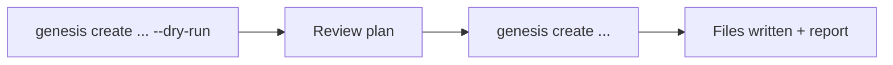
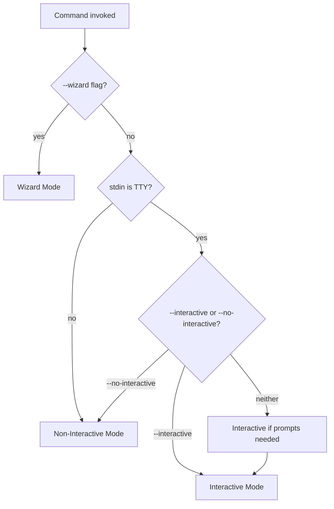
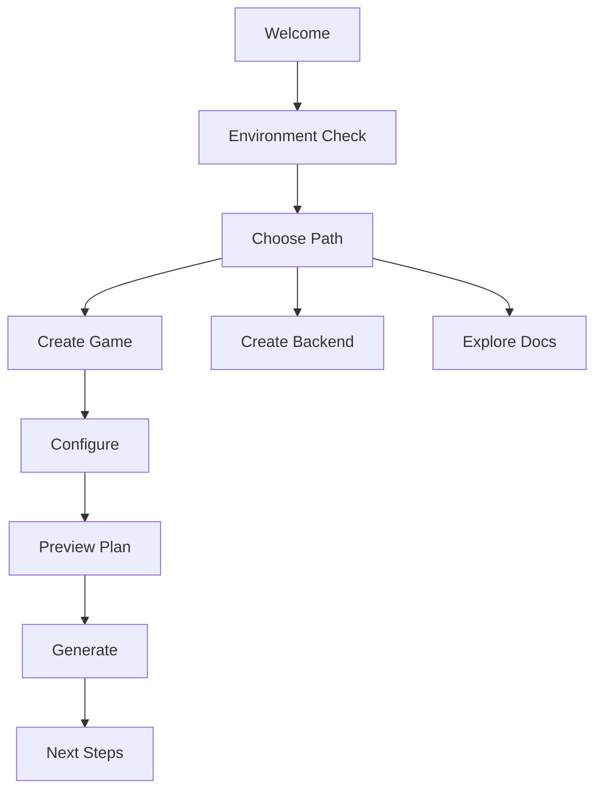

# Genesis CLI — User Experience Specification

## Purpose

Define the complete **user experience (UX)** of the Genesis CLI — how it looks, feels, and behaves in the terminal. This document is the presentation-layer contract for every user-facing surface: help text, prompts, colors, progress, messages, and output modes.

Behavioral requirements (lifecycle, commands, exit codes) live in [FUNCTIONAL_SPEC.md](FUNCTIONAL_SPEC.md). End-to-end developer workflows live in [DEVELOPER_JOURNEY.md](../000-project/DEVELOPER_JOURNEY.md). This document connects both through a unified UX system.

## Scope

### In Scope

- Command philosophy and interaction modes
- Help system design
- Interactive, non-interactive, and wizard modes
- Visual language: colors, typography, icons, spacing
- Progress indicators and spinners
- Error, validation, and success message formats
- Logging, verbose, and debug output
- Comparisons with industry CLI tools
- Accessibility and CI/scripting behavior

### Out of Scope

- Implementation libraries (e.g., which prompt or spinner package to use)
- Business logic for generation or validation
- Cursor IDE integration (see ADR-008)

## Design North Star

> **Genesis CLI should feel like a senior engineer in your terminal** — confident, clear, and never noisy. It tells you what it is doing, why it matters, and exactly how to fix problems.

### UX Principles

| # | Principle | Meaning |
|---|-----------|---------|
| P1 | **Clarity over cleverness** | Plain language. No jargon without context. |
| P2 | **Progress is visible** | Long operations always show progress. Silence means instant. |
| P3 | **Errors are actionable** | Every error includes what failed, why, and the next command to try. |
| P4 | **Defaults are safe** | Destructive actions require explicit flags or confirmation. |
| P5 | **TTY-aware** | Rich output in terminals; plain output in pipes and CI. |
| P6 | **Consistent voice** | Same tone, structure, and symbols across all commands. |
| P7 | **Scriptable by default** | `--json`, `--quiet`, and `--no-interactive` work everywhere they apply. |
| P8 | **AI-friendly output** | Structured modes consumable by agents and CI parsers. |

---

## Industry Comparison

Genesis CLI draws from the best patterns of modern developer tools while serving a unique game-development + AI-native audience.

| Tool | What Genesis Adopts | What Genesis Avoids |
|------|---------------------|---------------------|
| **Angular CLI** (`ng`) | Schematic-style `generate` commands; categorized help; wizard for `ng new`; validation before write | Verbose default output; heavy ASCII art; long mandatory prompts |
| **Vite** | Fast, minimal cold-start feel; clean success lines; `--debug` for internals | Too minimal for multi-phase game generation (users need phase context) |
| **Expo** (`npx expo`) | Friendly onboarding; `doctor` command; clear next-steps after `create`; platform-aware prompts | Mobile-only assumptions; overly casual tone for enterprise teams |
| **pnpm** | Precise, structured output; `--reporter` modes; respect for `NO_COLOR`; quiet success in scripts | Package-manager-specific semantics; peer dependency noise |
| **Terraform** | Plan → apply mental model (`--dry-run` → execute); structured validation output; exit codes for automation | HCL-plan verbosity; intimidating error walls without grouping |

### Positioning Statement

```
Angular CLI  →  project scaffolding depth
Vite         →  speed and brevity
Expo         →  onboarding warmth and doctor checks
pnpm         →  scripting discipline and color respect
Terraform    →  plan-before-apply safety
─────────────────────────────────────────────
Genesis CLI  →  all of the above, tuned for game + backend + AI workflows
```

---

## Command Philosophy

### Verb-First, Noun-Second

Commands use **verbs** for actions and **nouns** for targets — mirroring how developers think.

| Pattern | Example | Rationale |
|---------|---------|-----------|
| `create <thing>` | `genesis create game ocean-quest` | New project or resource |
| `generate <type>` | `genesis generate api levels` | Add to existing project |
| `validate` | `genesis validate` | Check without changing |
| `run <target>` | `genesis run backend` | Start a service |
| `config <action>` | `genesis config show` | Inspect or mutate settings |

Avoid ambiguous single verbs (`do`, `exec`, `handle`). Prefer explicit compound commands (`create game` not `gameify`).

### Command Categories

Help groups commands by intent, not implementation:

| Category | Commands | Color Accent |
|----------|----------|--------------|
| **Project** | `create`, `generate`, `validate` | Cyan |
| **Development** | `run`, `test`, `doctor` | Green |
| **Release** | `publish`, `migrate`, `upgrade` | Yellow |
| **Configuration** | `config` | Blue |
| **Extensions** | `plugin` | Magenta |
| **AI** | `ai` | Bright cyan |
| **Meta** | `--help`, `--version` | Dim |

### Flag Conventions

Global flags are consistent across every command:

| Flag | Short | Purpose |
|------|-------|---------|
| `--help` | `-h` | Context-sensitive help |
| `--version` | `-V` | Version info |
| `--verbose` | `-v` | Info-level logs to stderr |
| `--debug` | | Debug-level logs + stack traces |
| `--quiet` | `-q` | Errors only |
| `--json` | | Machine-readable stdout |
| `--no-color` | | Disable ANSI |
| `--no-interactive` | | Fail on missing input |
| `--interactive` | | Force prompts |
| `--yes` | `-y` | Auto-confirm prompts |
| `--dry-run` | | Plan without side effects |

**Precedence:** CLI flag → environment variable → config file → default.

### Plan-Before-Apply (Terraform Model)

Any command that writes files follows a two-step mental model:



Users should always be able to preview destructive or large operations with `--dry-run` before committing.

### Next Steps Pattern (Expo Model)

Every successful **create** or **generate** command ends with a **Next steps** block — never leave the user at a dead end.

```
✓ Created 128 files in ./ocean-quest

 Next steps:
   cd ocean-quest
   genesis doctor --full
   genesis run docker && genesis run backend
   genesis run unity
   genesis test
```

---

## Output Channels

Strict separation keeps scripting reliable (pnpm discipline):

| Channel | Content | When |
|---------|---------|------|
| **stdout** | Results, success messages, `--json` payloads, piped data | Always unless `--quiet` suppresses non-essential |
| **stderr** | Errors, warnings, logs, progress spinners, prompts | Diagnostics never pollute stdout |
| **exit code** | Success/failure taxonomy | Always |

**Rule:** `genesis validate --json | jq '.passed'` must work without parsing log noise.

---

## Help System

### Design Goals

| Goal | Criteria |
|------|----------|
| Discoverable | `genesis --help` fits on one screen for top-level commands |
| Contextual | `genesis create --help` shows only create flags and examples |
| Example-driven | Every command help includes at least one copy-paste example |
| Searchable | `genesis --help generate` resolves subcommand help |

### Top-Level Help Layout

```
genesis — AI-Native Game Development Framework

USAGE
  genesis <command> [options] [arguments]

COMMANDS
  Project
    create <name>           Scaffold a new project
    create game <name>      Scaffold a complete game project
    generate <type> [name]  Generate module, API, or system
    validate                Run architecture and standards checks

  Development
    run [target]            Start backend, docker, or unity
    test [target]           Run project tests
    doctor                  Check environment prerequisites

  Configuration
    config                  Manage Genesis configuration
    plugin                  Manage plugins

  AI (Phase 4)
    ai                      AI-assisted planning and review

GLOBAL OPTIONS
  -h, --help                Show help
  -V, --version             Show version
  -v, --verbose             Verbose logging
      --debug               Debug logging with stack traces
  -q, --quiet               Minimal output
      --json                JSON output
      --no-color            Disable colors
      --no-interactive      Non-interactive mode

EXAMPLES
  genesis create game my-puzzle --template mobile-puzzle
  genesis generate api levels --crud
  genesis validate --strict

DOCUMENTATION
  https://project-genesis.dev/docs/cli
  genesis <command> --help for detailed command help

Run genesis <command> --help for detailed information.
```

### Command Help Layout

Every subcommand help follows this structure:

1. **One-line summary** (bold)
2. **USAGE** block with required/optional args
3. **ARGUMENTS** table
4. **OPTIONS** table (command flags + relevant globals)
5. **EXAMPLES** (2–3 realistic scenarios)
6. **SEE ALSO** (related commands and spec links)

```
genesis create game — Scaffold a complete mobile game project

USAGE
  genesis create game <name> [options]

ARGUMENTS
  name    Game project name (kebab-case, required)

OPTIONS
  -t, --template <id>       Game template (default: mobile-puzzle)
      --genre <genre>       Genre override (rpg, puzzle, idle)
      --platform <list>     Target platforms (default: ios,android)
      --monetization <mode> f2p, premium, hybrid
      --no-ai               Skip AI enrichment
      --dry-run             Preview generation plan
      --force               Overwrite existing directory
  -y, --yes                 Skip confirmation prompts

EXAMPLES
  genesis create game ocean-quest --interactive
  genesis create game ocean-quest --template mobile-puzzle --no-ai
  genesis create game ocean-quest --dry-run

SEE ALSO
  genesis generate, genesis validate, genesis doctor
```

### Help Enhancements (Phase 2+)

| Feature | Command | Behavior |
|---------|---------|----------|
| Fuzzy suggestions | `genesis creat` | `Unknown command "creat". Did you mean "create"?` |
| Flag suggestions | `--templat` | `Unknown option. Did you mean --template?` |
| Shell completions | `genesis completion bash` | Generate completion scripts |
| Docs deep link | `--help` footer | Link to online docs per command |

---

## Interaction Modes

Genesis supports four interaction modes. Mode is resolved automatically unless overridden by flags.



### Mode Resolution Table

| Condition | Mode |
|-----------|------|
| `--wizard` | Wizard |
| `--no-interactive` or `--yes` | Non-interactive |
| `--interactive` | Interactive |
| stdin is not a TTY (pipe, CI) | Non-interactive |
| stdin is TTY, missing optional vars | Interactive (prompt) |
| stdin is TTY, all vars provided | Non-interactive (no prompts) |

---

## Interactive Mode

### Purpose

Collect missing variables, confirm destructive actions, and resolve file conflicts — without requiring the user to memorize flags.

### When It Activates

- `genesis create game ocean-quest` (no template flag) → prompts for template
- `genesis create game ocean-quest --force` → confirms overwrite
- `genesis generate api users` → prompts for auth requirements if unspecified
- Conflict detected with `overwritePolicy: prompt`

### Prompt Types

| Type | UI | Example |
|------|-----|---------|
| **Text** | `? Label:` with validation | Project name |
| **Confirm** | `? Continue? (Y/n)` | Overwrite directory |
| **Select** | Arrow-key list | Template choice |
| **Multi-select** | Space to toggle | Platforms: ios, android |
| **Password** | Masked input | API key (never logged) |

### Interactive Session Format

```
┌─ Genesis ─ Create Game ─────────────────────────────┐
│  Scaffold a complete mobile game project            │
└─────────────────────────────────────────────────────┘

? Game name          ocean-quest
? Template           mobile-puzzle
  › mobile-puzzle — Casual puzzle (lives, levels)
    mobile-rpg — Turn-based RPG
    mobile-idle — Idle clicker
    default — Minimal structure
? Author             Alex Chen
? Monetization       f2p
? Enable ads?        Yes
? Analytics          firebase
? AI enrichment      Yes

? Output directory   ./ocean-quest
? Proceed?           Yes

```

### Interactive Rules

| Rule | Description |
|------|-------------|
| I1 | Show defaults in parentheses; Enter accepts default |
| I2 | Invalid input re-prompts with inline error (red), not a new screen |
| I3 | Ctrl+C cancels gracefully: `Cancelled.` exit code 5 |
| I4 | Escape on select lists goes back one step (wizard only) |
| I5 | Password fields never echo or log |
| I6 | Max 3 validation retries per field; then abort with hint |

### Conflict Resolution Prompt

```
 Conflict: backend/src/app.module.ts already exists

? How should genesis handle this file?
  › Skip — keep existing file
    Overwrite — replace with generated content
    Show diff — preview changes (then choose)
    Abort — cancel generation
```

---

## Non-Interactive Mode

### Purpose

Enable CI/CD, scripting, and automation without hanging on prompts.

### Activation

- Explicit: `--no-interactive`, `--yes`, or all required flags provided
- Implicit: stdin is not a TTY, `CI=true` environment

### Behavior

| Scenario | Behavior |
|----------|----------|
| All required vars provided | Execute silently (unless `--verbose`) |
| Missing required var | Fail immediately with `MISSING_VARIABLE` |
| Destructive action without `--force` | Fail with hint to add `--force` or `--yes` |
| Conflict with `skip` policy | Skip silently; report in summary |
| Conflict with `prompt` policy in CI | Fail with `CONFLICT_REQUIRES_INTERACTIVE` |

### CI-Friendly Output

```bash
genesis create game ocean-quest \
  --template mobile-puzzle \
  --author "CI Bot" \
  --no-interactive \
  --yes \
  --json
```

```json
{
  "success": true,
  "command": "create game",
  "project": "ocean-quest",
  "filesCreated": 128,
  "durationMs": 12400,
  "validation": { "passed": true, "warnings": 0, "errors": 0 }
}
```

### Environment Variables

| Variable | Effect |
|----------|--------|
| `CI=true` | Force non-interactive; plain progress |
| `NO_COLOR=1` | Disable colors |
| `GENESIS_LOG_LEVEL=debug` | Equivalent to `--debug` |
| `GENESIS_NO_INTERACTIVE=1` | Equivalent to `--no-interactive` |

---

## Wizard Mode

### Purpose

Guided, step-by-step onboarding for first-time users — richer than interactive prompts, lighter than documentation.

### Activation

```bash
genesis wizard                    # Top-level onboarding
genesis wizard create-game        # Game creation wizard
genesis wizard plugin-setup       # Plugin installation wizard
```

`--wizard` on any supported command enters wizard mode for that command:

```bash
genesis create game --wizard
```

### Wizard Structure



### Wizard Screens

**Screen 1 — Welcome**

```
╔══════════════════════════════════════════════════════╗
║  Welcome to Genesis                                  ║
║  AI-Native Game Development Framework                ║
╚══════════════════════════════════════════════════════╝

  This wizard will help you create your first game project
  in about 2 minutes.

  Prerequisites: Node.js 22+, Git, Docker (recommended)

  Press Enter to continue, or Ctrl+C to exit.
```

**Screen 2 — Environment Check** (like Expo `doctor`)

```
 Checking your environment...

  ✓ Node.js 22.11.0
  ✓ Git 2.43.0
  ✓ Genesis CLI 0.1.0
  ○ Docker — optional, needed for backend
  ○ Unity Hub — optional, needed for game client

  3 of 5 checks passed. You can continue without Docker and Unity.

  Continue anyway? (Y/n)
```

**Screen 3 — Path Selection**

```
 What would you like to create?

  › A complete mobile game (recommended)
    A backend API only
    A minimal project to explore
    Exit wizard
```

Wizards use **full-screen framed layouts** with clear step indicators:

```
 Step 3 of 6 — Configure your game
 ─────────────────────────────────
```

### Wizard vs Interactive

| Aspect | Interactive | Wizard |
|--------|-------------|--------|
| Scope | Single command | Multi-step journey |
| Layout | Inline prompts | Framed screens with steps |
| Environment check | Separate (`doctor`) | Built into flow |
| Education | Minimal | Explains choices inline |
| Use case | Power users, quick edits | First launch, onboarding |

---

## Visual Language

### Color Palette

Colors use ANSI 256/16m when supported. All semantic meaning is duplicated with symbols for colorblind users.

| Token | ANSI | Hex (reference) | Usage |
|-------|------|-----------------|-------|
| `primary` | cyan | `#22D3EE` | Headings, command names, links |
| `success` | green | `#4ADE80` | Pass, created, running |
| `warning` | yellow | `#FACC15` | Warnings, skipped, optional missing |
| `error` | red | `#F87171` | Errors, failed, destructive |
| `info` | blue | `#60A5FA` | Info messages, paths |
| `muted` | dim gray | `#6B7280` | Secondary text, timestamps |
| `accent` | magenta | `#C084FC` | Plugins, AI features |
| `bold` | bold | — | Labels, emphasis |

### Color Rules

| Rule | Description |
|------|-------------|
| C1 | Never colorize inside `--json` stdout |
| C2 | Respect `NO_COLOR` and `--no-color` |
| C3 | Respect `FORCE_COLOR=0` and `FORCE_COLOR=1` |
| C4 | Piped stdout is always plain text |
| C5 | Errors use red title + white body (not all-red block) |
| C6 | Max 3 colors per line |

### Symbols

Consistent iconography across all commands:

| Symbol | Meaning | Color |
|--------|---------|-------|
| `✓` | Success / passed / created | green |
| `✗` | Failed / error | red |
| `○` | Skipped / optional / pending | yellow or dim |
| `●` | In progress (spinner anchor) | cyan |
| `›` | Selected list item | cyan |
| `─` | Section separator | dim |
| `→` | Next step hint | cyan |
| `!` | Warning | yellow |
| `?` | Prompt prefix | cyan |

### Typography

| Element | Style |
|---------|-------|
| Command names | `bold` + `primary` |
| Flags | `muted` + backticks in help |
| File paths | `info` + monospace |
| Values | monospace |
| Section headers | `bold` uppercase (USAGE, OPTIONS) |
| Hints | `muted` italic |

---

## Progress Indicators

### When to Show Progress

| Duration | Indicator |
|----------|-----------|
| < 300 ms | None (instant feedback) |
| 300 ms – 2 s | Spinner with message |
| 2 s – 30 s | Spinner + elapsed time |
| > 30 s or multi-phase | Progress bar per phase |
| Indeterminate | Spinner only |

### Spinner (Single Operation)

Used for `validate`, `plugin list`, short generates:

```
⠋ Validating project structure...
```

On completion, spinner line is replaced (not appended):

```
✓ Validating project structure (1.2s)
```

### Multi-Phase Progress Bar (Game Creation)

Used for `genesis create game` and long `generate` operations — inspired by Terraform apply output clarity:

```
 Ocean Quest — Generating

 Phase 1/7  Documentation     ████████████████████  100%  done (12 files)
 Phase 2/7  Structure         ████████████████████  100%  done (8 files)
 Phase 3/7  Backend           ████████████░░░░░░░░   62%  ...
 Phase 4/7  Unity Client      ░░░░░░░░░░░░░░░░░░░░    0%  pending
 Phase 5/7  Platform Services ░░░░░░░░░░░░░░░░░░░░    0%  pending
 Phase 6/7  DevOps            ░░░░░░░░░░░░░░░░░░░░    0%  pending
 Phase 7/7  AI OS             ░░░░░░░░░░░░░░░░░░░░    0%  pending

 Elapsed: 18s
```

### Progress Bar Rules

| Rule | Description |
|------|-------------|
| PR1 | Progress renders on stderr |
| PR2 | `--quiet` shows only final summary line |
| PR3 | `--json` emits `progress` events as NDJSON on stderr (optional) or suppresses bars |
| PR4 | Non-TTY shows plain text: `Phase 3/7 Backend... done` |
| PR5 | Failed phase stops bar; shows `✗` with error below |
| PR6 | `--verbose` adds sub-step detail under active phase |

### Verbose Phase Detail

```
 Phase 3/7  Backend           ████████████░░░░░░░░   62%
   ├─ CREATE  backend/src/domain/levels/level.entity.ts
   ├─ CREATE  backend/src/application/levels/level.service.ts
   └─ CREATE  backend/src/presentation/levels/level.controller.ts
```

### Dry-Run Output (Terraform Plan Style)

```
 Generation Plan — create game ocean-quest (dry-run)

 Phase  Documentation     12 files
 Phase  Structure          8 files
 Phase  Backend           34 files
 Phase  Unity Client       41 files
 Phase  Platform Services  18 files
 Phase  DevOps               6 files
 Phase  AI OS                9 files

 Total: 128 files, 0 conflicts

 Run without --dry-run to execute.
```

---

## Error Messages

### Error Message Anatomy

Every user-facing error follows a four-part structure:

```
1. TITLE     — What failed (red, bold)
2. CAUSE     — Why it failed (white)
3. FIX       — What to do next (cyan, with example command)
4. META      — Exit code, error code (dim)
```

### Examples by Category

**Usage error (exit 2)**

```
✗ Invalid project name "Ocean Quest"

  Project names must be kebab-case: lowercase letters, numbers, and hyphens.
  Example: ocean-quest

  Try: genesis create game ocean-quest

  code: INVALID_PROJECT_NAME · exit: 2
```

**Missing variable in CI (exit 2)**

```
✗ Missing required variable: author

  Non-interactive mode requires all variables via flags or config.
  This command was run in CI or with --no-interactive.

  Try: genesis create game ocean-quest --author "Studio Name"

  code: MISSING_VARIABLE · exit: 2
```

**Plugin error (exit 4)**

```
✗ Plugin failed to load: @genesis/plugin-unity

  The plugin manifest is invalid: missing "version" field.
  Other plugins loaded successfully.

  Try: genesis plugin info unity
       genesis plugin update unity

  code: PLUGIN_LOAD_FAILED · exit: 4
```

**General error (exit 1)**

```
✗ Failed to write files

  Permission denied: ./ocean-quest/backend/src/main.ts

  Check directory permissions or choose a different output path.

  Try: genesis create game ocean-quest --output ~/projects/ocean-quest

  code: FILESYSTEM_PERMISSION_DENIED · exit: 1
```

### Error Rules

| Rule | Description |
|------|-------------|
| E1 | One primary error per failure; secondary issues as bullet list |
| E2 | Never expose stack traces unless `--debug` |
| E3 | Never expose secrets, tokens, or full env values |
| E4 | Suggest exactly one primary fix command |
| E5 | Include machine-readable `code` in all errors |
| E6 | Plugin errors are isolated — report which plugin failed |
| E7 | Unknown command suggests closest match (Levenshtein) |

### JSON Error Format (`--json`)

Errors on failure go to stderr as JSON; stdout is empty:

```json
{
  "success": false,
  "error": {
    "code": "INVALID_PROJECT_NAME",
    "message": "Invalid project name \"Ocean Quest\"",
    "cause": "Project names must be kebab-case.",
    "fix": "genesis create game ocean-quest",
    "details": { "name": "Ocean Quest", "rule": "kebab-case" },
    "exitCode": 2
  }
}
```

---

## Validation Messages

`genesis validate` produces structured, scannable output — grouped like a linter report.

### Validation Output (Human)

```
 Validation — ocean-quest

 Architecture                                    5/5 passed
   ✓ Directory structure
   ✓ Layer boundaries (backend)
   ✓ No circular dependencies
   ✓ Package naming conventions
   ✓ .genesis/config.yml present

 Standards                                       4/5 passed
   ✓ No secrets in committed files
   ✓ Documentation files exist
   ✓ .cursor/ rules present
   ✓ Git ignore patterns
   ! backend/src/presentation/game/game.controller.ts — file exceeds 300 lines (warning)

 Unity                                           3/3 passed
   ✓ Project manifest valid
   ✓ ScriptableObject conventions
   ✓ No hardcoded strings in UI layer

 ────────────────────────────────────────────────
 12 passed, 1 warning, 0 errors

 Run genesis validate --verbose for rule references.
```

### Validation Severity

| Level | Symbol | Exit Code (`--strict`) | Exit Code (default) |
|-------|--------|------------------------|---------------------|
| Error | `✗` | 3 | 3 |
| Warning | `!` | 3 | 0 |
| Info | `○` | 0 | 0 |
| Pass | `✓` | 0 | 0 |

### Validation Detail (`--verbose`)

```
 ! [STD-API-001] backend/src/.../game.controller.ts:142
   Rule: API controllers must delegate to application services
   Doc:  standards/api/rest.md
   Fix:  Move business logic to GameService
```

### JSON Validation Output

```json
{
  "success": true,
  "passed": 12,
  "warnings": 1,
  "errors": 0,
  "results": [
    {
      "category": "architecture",
      "rule": "STRUCT-001",
      "status": "pass",
      "message": "Directory structure complete"
    },
    {
      "category": "standards",
      "rule": "STD-API-001",
      "status": "warning",
      "message": "File exceeds 300 lines",
      "file": "backend/src/presentation/game/game.controller.ts",
      "line": 142,
      "doc": "standards/api/rest.md"
    }
  ]
}
```

---

## Success Messages

### Success Message Principles

- **Brief** — One line for simple commands; summary block for complex ones
- **Informative** — Say what was done, not just "Done"
- **Forward-looking** — Include next steps for create/generate commands

### Simple Success

```
✓ genesis v0.1.0 (node v22.11.0)
```

```
✓ Configuration valid
```

### Operation Success

```
✓ Created project "ocean-quest" — 128 files in 12.4s
```

```
✓ Generated api "levels" — 7 files created, 1 modified
```

### Success with Warnings

```
✓ Created project "ocean-quest" — 128 files in 12.4s
  ! 2 files skipped (already exist)
  ! AI enrichment unavailable — used template defaults
```

### Success Block (Create / Generate)

```
┌─ Success ───────────────────────────────────────────┐
│  ✓ Game "ocean-quest" created successfully          │
│                                                     │
│  128 files · 12.4s · validation passed              │
└─────────────────────────────────────────────────────┘

 Next steps:
   cd ocean-quest
   genesis run docker && genesis run backend
   genesis run unity
   genesis test

 Docs: docs/GDD.md · docs/ARCHITECTURE.md
```

### Quiet Mode Success

`--quiet` outputs nothing on success (exit 0 only). Useful in scripts:

```bash
genesis validate --quiet && echo "OK"
```

---

## Logging

### Log Stream

All logs go to **stderr** via `@genesis/core` logger. stdout remains clean.

### Log Levels

| Level | Shown When | Content |
|-------|------------|---------|
| `error` | Always (unless fatal crash) | Failures, unrecoverable issues |
| `warn` | Default and above | Skipped plugins, deprecations, config warnings |
| `info` | Default and above | Command start/complete, plugin summary |
| `debug` | `--verbose` | Flag parsing, hook execution, service calls |
| `trace` | `--debug` | Full stack traces, registry dumps, timing spans |

### Log Format (Text)

```
12:00:00 INFO  genesis:cli:create  Starting project scaffolding
12:00:01 DEBUG genesis:cli:create  Resolved template: mobile-puzzle
12:00:12 INFO  genesis:cli:create  Completed in 12400ms (exit 0)
```

### Log Format (JSON — `--debug` or `logFormat: json`)

```json
{
  "timestamp": "2026-07-26T12:00:00.000Z",
  "level": "info",
  "component": "genesis:cli:create",
  "message": "Starting project scaffolding",
  "commandId": "create",
  "traceId": "a1b2c3d4",
  "durationMs": null
}
```

### What Gets Logged vs Printed

| Content | Mechanism | Channel |
|---------|-----------|---------|
| "Created 128 files" | Success message | stdout |
| "Starting scaffolding" | Log | stderr |
| Progress bar | Progress renderer | stderr |
| Prompts | Interactive UI | stderr |
| Errors | Error formatter | stderr |
| JSON result | Output writer | stdout |

---

## Verbose Mode

### Activation

```bash
genesis create game ocean-quest --verbose
# or
GENESIS_LOG_LEVEL=debug genesis create game ocean-quest
```

### What Verbose Adds

| Area | Normal | Verbose |
|------|--------|---------|
| Log level | `info` | `debug` |
| Progress | Phase-level | Phase + file-level |
| Plugin loading | Summary count | Per-plugin load time |
| Config | Hidden | Sources merged (secrets redacted) |
| Hooks | Hidden | Hook name + duration |
| Validation | Summary | Per-rule timing |

### Example

```
12:00:00 INFO  genesis:cli  Bootstrap complete (142ms)
12:00:00 DEBUG genesis:cli  Loaded config from ~/.genesis/config.yml
12:00:00 DEBUG genesis:cli  Loaded config from ./.genesis/config.yml
12:00:00 DEBUG genesis:plugin  Loaded @genesis/plugin-unity (38ms)
12:00:00 DEBUG genesis:plugin  Loaded @genesis/plugin-nestjs (22ms)
12:00:00 INFO  genesis:cli:create  Starting game generation

 Phase 3/7  Backend           ████████████░░░░░░░░   62%
   ├─ CREATE  backend/src/domain/levels/level.entity.ts
   ...

12:00:12 DEBUG genesis:hook  pre-generate (2 listeners, 4ms)
12:00:12 DEBUG genesis:hook  post-generate (2 listeners, 12ms)
12:00:12 INFO  genesis:cli:create  Completed in 12400ms
```

Verbose does **not** show stack traces — use `--debug` for that.

---

## Debug Mode

### Activation

```bash
genesis create game ocean-quest --debug
# Combines: log level trace + stack traces on error + timing spans
```

`--debug` implies `--verbose`.

### What Debug Adds Beyond Verbose

| Feature | Description |
|---------|-------------|
| Stack traces | Full trace on unhandled errors |
| Service resolution | DI container resolution log |
| Registry dump | All registered commands and plugins |
| Timing spans | Per-phase, per-file, per-hook milliseconds |
| Environment dump | Node version, cwd, config paths (no secrets) |

### Debug Error Example

```
✗ Failed to render template: backend/module.hbs

  Template engine error at line 42: undefined variable "moduleNamePascal"

  Stack trace (genesis --debug):
    at TemplateEngine.render (template-engine/render.ts:88)
    at GenerationPlanExecutor.execute (scaffolding/executor.ts:142)
    at CreateGameCommand.execute (cli/commands/create/game.ts:67)

  code: TEMPLATE_RENDER_ERROR · exit: 1
```

### Debug Rules

| Rule | Description |
|------|-------------|
| D1 | Never enable debug by default |
| D2 | Debug may expose file paths and internal component names — acceptable for dev |
| D3 | Debug still redacts secrets per logging rules |
| D4 | `--debug` with `--json` includes `stack` field in error object |

---

## Output Mode Matrix

Summary of how flags combine:

| Mode | Flags | stdout | stderr | Progress | Prompts | Stack Traces |
|------|-------|--------|--------|----------|---------|--------------|
| **Normal** | (default) | Results + success | logs info+ | bars/spinners | if TTY + needed | no |
| **Quiet** | `--quiet` | empty on success | errors only | none | no | no |
| **Verbose** | `--verbose` | results + success | logs debug+ | detailed | if TTY + needed | no |
| **Debug** | `--debug` | results + success | logs trace+ | detailed | if TTY + needed | yes |
| **JSON** | `--json` | JSON only | errors as JSON | suppressed | no | in debug only |
| **CI** | `CI=true` + `--no-interactive` | JSON or plain | errors only | plain text | no | no |
| **No color** | `--no-color` | plain | plain | plain | plain | plain |

---

## Command UX Profiles

How each major command should feel:

| Command | Primary Mode | Progress | Success Style | Notes |
|---------|-------------|----------|---------------|-------|
| `--version` | instant | none | single line | Vite-minimal |
| `--help` | instant | none | formatted text | Angular-categorized |
| `doctor` | interactive optional | spinner per check | checklist | Expo-doctor |
| `create` | interactive | phase bar | success block + next steps | Terraform plan option |
| `create game` | wizard available | 7-phase bar | success block + next steps | Richest UX |
| `generate` | interactive | spinner or mini-bar | one-liner + file count | Angular schematic |
| `validate` | instant–2s | spinner | grouped report | ESLint-style |
| `config show` | instant | none | YAML-like display | pnpm-config |
| `plugin list` | instant | spinner if slow | table | pnpm-list |
| `run` | streaming | service status | running URLs | Expo-start |
| `test` | streaming | per-suite progress | pass/fail summary | Vitest-like |
| `publish` | non-interactive | multi-stage bar | deploy URL | Terraform apply |
| `ai plan` | interactive | spinner | markdown plan | Genesis-unique |

---

## Accessibility

| Requirement | Implementation |
|-------------|----------------|
| Colorblind support | Symbols (`✓`, `✗`, `!`) duplicate color meaning |
| Screen readers | `--no-color` produces plain text; no spinners that erase lines in plain mode |
| Reduced motion | `GENESIS_NO_SPINNER=1` uses static text instead of animated spinners |
| Terminal width | Layout adapts at < 80 columns; progress bars shrink |
| Right-to-left | Not supported in v1; document as limitation |

---

## Deprecation and Warnings

```
! Deprecated: --template-path is deprecated and will be removed in v0.3.0.
  Use --template instead.

  See: https://project-genesis.dev/docs/cli/migrations/v0.2
```

Warnings use yellow `!` prefix, never block execution unless `--strict` applies.

---

## Version and Branding

### Version Output

```
genesis v0.1.0 (node v22.11.0)
```

With `--verbose`:

```
genesis v0.1.0
  node     v22.11.0
  platform darwin arm64
  config   ~/.genesis/config.yml
  plugins  unity@1.0.0, nestjs@1.0.0
```

### Branding Rules

- Product name is **Genesis** (not "GENESIS" in output)
- CLI binary is `genesis` (lowercase)
- Tagline appears only in wizard welcome and top-level help: *AI-Native Game Development Framework*
- No ASCII art logos in default output (optional in wizard only)

---

## Implementation Checklist

For engineers implementing the CLI presentation layer:

| Component | Responsibility |
|-----------|----------------|
| `OutputWriter` | Route stdout/stderr; respect quiet/json/color |
| `HelpRenderer` | Format help layouts; examples; see also |
| `PromptEngine` | Interactive + wizard prompts; validation |
| `ProgressRenderer` | Spinners, bars, phase tracking |
| `ErrorFormatter` | Four-part error anatomy; suggestions |
| `ValidationReporter` | Grouped validation output |
| `SuccessFormatter` | Success blocks; next steps |
| `LogAdapter` | Bridge to `@genesis/core` logger; level mapping |

### Test Requirements

| Test | Criteria |
|------|----------|
| Snapshot tests | Help text stable across versions |
| TTY detection | Rich output only when TTY |
| NO_COLOR | No ANSI bytes in output |
| JSON schema | `--json` output validates against schema |
| Error codes | Every error type has documented code |
| Pipe safety | `genesis validate --json \| jq` works |

---

## Related Documents

| Document | Relationship |
|----------|-------------|
| [FUNCTIONAL_SPEC.md](FUNCTIONAL_SPEC.md) | CLI behavior and lifecycle contract |
| [DEVELOPER_JOURNEY.md](../000-project/DEVELOPER_JOURNEY.md) | End-to-end developer workflows |
| [004-scaffolding/FUNCTIONAL_SPEC.md](../004-scaffolding/FUNCTIONAL_SPEC.md) | Interactive prompts and generation reports |
| [DEVELOPMENT_WORKFLOW.md](../../DEVELOPMENT_WORKFLOW.md) | Engineering process |
| [standards/logging/](../../standards/logging/) | Structured logging standards |

## Changelog

| Version | Date | Change |
|---------|------|--------|
| 1.0.0 | 2026-07-26 | Initial CLI user experience specification |
