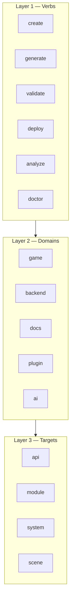
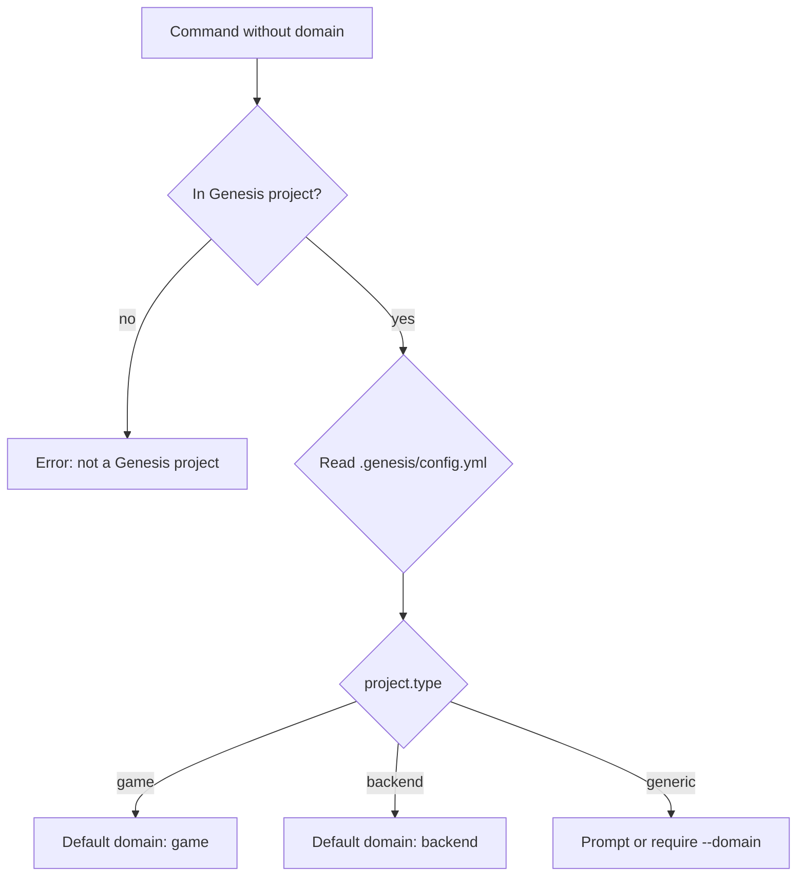

# Genesis Command Language (GCL)

## Purpose

Define the **Genesis Command Language** — the complete vocabulary, grammar, and reference for the `genesis` CLI. GCL is designed to be **expressive, memorable, and consistent**: verbs describe actions, domain namespaces group technology-specific work, and flags follow predictable patterns everywhere.

This document is the authoritative command reference. Behavior and lifecycle rules live in [FUNCTIONAL_SPEC.md](FUNCTIONAL_SPEC.md). Presentation and output formatting live in [CLI_USER_EXPERIENCE.md](CLI_USER_EXPERIENCE.md).

## Command Language Grammar

### Syntax

```
genesis <command> [subcommand] [arguments...] [flags...]
```

### Command Layers

GCL has three composable layers:



| Layer | Role | Examples |
|-------|------|----------|
| **Verb** | What to do | `create`, `generate`, `validate`, `deploy`, `analyze` |
| **Domain** | Where to do it | `game`, `backend`, `docs`, `plugin`, `ai` |
| **Target** | What to act on | `api`, `module`, `system`, `scene`, `liveops` |

### Canonical Forms

Two equivalent invocation styles are supported. **Verb-first** is canonical for scripting; **domain-first** is canonical for discoverability.

| Style | Pattern | Example |
|-------|---------|---------|
| **Verb-first** | `genesis <verb> <domain> <target>` | `genesis generate backend api users` |
| **Domain-first** | `genesis <domain> <verb> <target>` | `genesis backend generate api users` |
| **Shorthand** | `genesis <verb> <target>` | `genesis generate api users` (domain inferred from cwd) |

Domain-first commands are **syntactic sugar** — they dispatch to the same handlers as verb-first commands.

### Naming Rules

| Rule | Convention | Example |
|------|------------|---------|
| Commands | lowercase, single word | `create`, `validate` |
| Subcommands | lowercase, kebab-case | `unity-scene`, `create-game` |
| Arguments (names) | kebab-case | `ocean-quest` |
| Flags | kebab-case, `--long` | `--dry-run`, `--no-interactive` |
| Short flags | single letter | `-h`, `-v`, `-y` |
| Plugin commands | `plugin:target` internal; exposed as subcommands | `genesis generate unity-scene` |

### Global Flags

Available on **every** command:

| Flag | Short | Type | Default | Description |
|------|-------|------|---------|-------------|
| `--help` | `-h` | boolean | false | Show command help |
| `--version` | `-V` | boolean | false | Show CLI version |
| `--verbose` | `-v` | boolean | false | Debug logging to stderr |
| `--debug` | | boolean | false | Trace logging + stack traces |
| `--quiet` | `-q` | boolean | false | Errors only |
| `--json` | | boolean | false | Machine-readable stdout |
| `--no-color` | | boolean | false | Disable ANSI colors |
| `--no-interactive` | | boolean | auto | Fail instead of prompting |
| `--interactive` | | boolean | auto | Force prompts |
| `--yes` | `-y` | boolean | false | Auto-confirm prompts |
| `--config` | `-c` | path | auto | Config file path |
| `--dry-run` | | boolean | false | Plan without side effects (where supported) |

### Exit Codes

| Code | Name | When |
|------|------|------|
| 0 | `SUCCESS` | Command completed |
| 1 | `GENERAL_ERROR` | Unhandled or infrastructure error |
| 2 | `INVALID_USAGE` | Bad flags, missing args, unknown command |
| 3 | `VALIDATION_ERROR` | `validate` or post-generation check failed |
| 4 | `PLUGIN_ERROR` | Plugin load or execution failed |
| 5 | `INTERRUPTED` | User cancelled (Ctrl+C) |
| 6 | `ANALYSIS_ERROR` | `analyze` found blocking issues |

---

## Command Tree

```
genesis
├── create <name>                    # New project
├── create game <name>               # New game project (shorthand)
│
├── generate <type> [name]           # Add to existing project
│   ├── api <resource>
│   ├── backend <subcommand>
│   ├── unity-*  (system, scene, prefab, so, ui)
│   ├── docs <type>
│   ├── liveops
│   └── plugin <name>
│
├── game                             # Game domain namespace
│   ├── create <name>
│   ├── generate <target> [name]
│   ├── run [target]
│   ├── test [target]
│   ├── validate
│   ├── analyze [scope]
│   └── deploy [target]
│
├── backend                          # Backend domain namespace
│   ├── create <name>
│   ├── generate <target> [name]
│   ├── run
│   ├── test
│   ├── validate
│   ├── analyze
│   └── deploy
│
├── docs                             # Documentation domain
│   ├── generate <type>
│   ├── validate
│   └── analyze
│
├── validate [scope]                 # Architecture + standards checks
├── analyze [scope]                  # Deep inspection and reports
├── doctor [scope]                   # Environment health check
├── deploy [target]                  # Build and release
│   ├── build [target]
│   └── release --env <env>
│
├── plugin                           # Plugin management
│   ├── list | info | install | update | remove
│
├── ai                               # AI-assisted development
│   ├── plan | review | docs | chat
│
├── config                           # Configuration (meta)
├── run [target]                     # Local development (meta)
├── test [target]                    # Test runner (meta)
├── wizard [flow]                    # Guided onboarding (meta)
├── migrate | upgrade | update       # Version management (meta)
└── completion <shell>               # Shell completions (meta)
```

---

## `genesis create`

### Purpose

Scaffold a **new project** from a template. Creates a directory tree, initializes Git, writes Genesis config, and runs post-generation validation. The entry point for greenfield work.

### Subcommands

| Subcommand | Description | Phase |
|------------|-------------|-------|
| `create <name>` | Generic project from template | 1 |
| `create game <name>` | Full game project (7-phase pipeline) | 3 |
| `create backend <name>` | Backend-only project | 2 |
| `create plugin <name>` | New Genesis plugin package | 2 |

### Arguments

| Argument | Required | Description |
|----------|----------|-------------|
| `name` | yes | Project name (kebab-case) |

### Flags

| Flag | Short | Default | Description |
|------|-------|---------|-------------|
| `--template` | `-t` | `default` | Project template ID |
| `--output` | `-o` | `./{name}` | Output directory |
| `--dry-run` | | false | Preview generation plan |
| `--force` | | false | Overwrite existing directory |
| `--wizard` | | false | Launch guided wizard |

#### `create game` Additional Flags

| Flag | Default | Description |
|------|---------|-------------|
| `--genre` | from template | `rpg`, `puzzle`, `idle`, `generic` |
| `--platform` | `ios,android` | Target platforms |
| `--monetization` | `f2p` | `f2p`, `premium`, `hybrid` |
| `--analytics` | `firebase` | Analytics provider |
| `--ads` | from monetization | Enable ads scaffold |
| `--no-ai` | false | Skip AI enrichment |

### Examples

```bash
genesis create my-api --template backend-api
genesis create game ocean-quest --template mobile-puzzle --interactive
genesis create game ocean-quest --dry-run
genesis create backend inventory-service --framework nestjs
genesis create plugin my-analytics --wizard
```

### Output

```
 Ocean Quest — Generating

 Phase 1/7  Documentation     ████████████████████  100%  done
 ...
 Phase 7/7  AI OS               ████████████████████  100%  done

 Validation ........................................... passed

✓ Created game "ocean-quest" — 128 files in 12.4s

 Next steps:
   cd ocean-quest
   genesis doctor --full
   genesis game run
```

**JSON (`--json`):**

```json
{
  "success": true,
  "command": "create game",
  "name": "ocean-quest",
  "template": "mobile-puzzle",
  "output": "./ocean-quest",
  "filesCreated": 128,
  "filesSkipped": 0,
  "durationMs": 12400,
  "validation": { "passed": true, "errors": 0, "warnings": 0 }
}
```

### Future Extensibility

| Extension | Mechanism |
|-----------|-----------|
| New project types | Register `ProjectTemplate` via plugin |
| `create workspace` | Multi-package monorepo template |
| `create from <url>` | Remote template registry |
| Template versioning | `--template mobile-puzzle@2.1.0` |

**Delegates to:** `@genesis/scaffolding` → [004-scaffolding](../004-scaffolding/)

---

## `genesis generate`

### Purpose

Add **modules, APIs, systems, and assets** to an existing Genesis project. The primary day-to-day command for incremental development — analogous to Angular `ng generate`.

### Subcommands

| Subcommand | Description | Domain |
|------------|-------------|--------|
| `generate api <resource>` | REST API resource (CRUD optional) | backend |
| `generate backend <target>` | Backend module, auth, docker, etc. | backend |
| `generate module <name>` | Clean Architecture module | backend |
| `generate unity-system <name>` | Unity game system | game |
| `generate unity-scene <name>` | Unity scene | game |
| `generate unity-prefab <name>` | Unity prefab | game |
| `generate unity-so <name>` | ScriptableObject | game |
| `generate unity-ui <name>` | UI controller + view | game |
| `generate unity <target>` | Unity project config (addressables, input, etc.) | game |
| `generate docs <type>` | ADR, RFC, API docs | docs |
| `generate liveops` | LiveOps module scaffold | game |
| `generate plugin <name>` | Plugin boilerplate | plugin |

### Arguments

| Argument | Required | Description |
|----------|----------|-------------|
| `type` / `target` | yes | Generator type |
| `name` | varies | Resource or module name (kebab-case) |

### Flags

| Flag | Default | Description |
|------|---------|-------------|
| `--crud` | false | Full CRUD for API resources |
| `--pagination` | `offset` | `offset` or `cursor` |
| `--framework` | from project | `nestjs`, `express`, `fastify` |
| `--database` | from project | `postgres`, `mongodb`, `redis` |
| `--dimension` | `2d` | Unity: `2d` or `3d` |
| `--template` | genre default | Scene/prefab template category |
| `--category` | `config` | ScriptableObject category |
| `--dry-run` | false | Preview file plan |
| `--force` | false | Overwrite existing files |
| `--skip-validation` | false | Skip post-generation validation |

### Examples

```bash
genesis generate api levels --crud --pagination cursor
genesis generate backend module inventory
genesis generate backend auth
genesis generate backend docker --services postgres,redis
genesis generate unity-system shop
genesis generate unity-scene Level_001 --template gameplay --dimension 2d
genesis generate unity-prefab PuzzleTile --template gameplay
genesis generate unity services --analytics firebase --ads true
genesis generate docs adr
genesis generate liveops --features all
```

### Output

```
 Generation Plan — api:levels (crud)

 CREATE  backend/src/domain/levels/level.entity.ts
 CREATE  backend/src/application/levels/level.service.ts
 CREATE  backend/src/presentation/levels/level.controller.ts
 MODIFY  backend/src/app.module.ts

✓ Generated api "levels" — 7 files created, 1 modified (2.1s)
```

### Future Extensibility

| Extension | Mechanism |
|-----------|-----------|
| New generators | Plugin registers `Generator` with ID `my-plugin:feature` |
| Generator aliases | `generate feature` → maps to `generate module` |
| Batch generate | `generate batch generators.yml` |
| AI-assisted | `generate api levels --ai "add pagination and filtering"` |

**Delegates to:** `@genesis/scaffolding` + plugins ([007-backend](../007-backend/), [008-unity](../008-unity/))

---

## `genesis doctor`

### Purpose

Verify the **local development environment** is ready for Genesis work. Checks runtimes, tools, plugins, and project prerequisites. Inspired by Expo `doctor` and `pnpm doctor`.

### Subcommands

| Subcommand | Description |
|------------|-------------|
| `doctor` | Quick check (Node, Git, CLI) |
| `doctor --full` | Extended check (Docker, Unity, SDKs) |
| `doctor project` | Validate current project prerequisites |
| `doctor plugins` | Verify plugin compatibility |

### Arguments

None.

### Flags

| Flag | Default | Description |
|------|---------|-------------|
| `--full` | false | Include Unity, Docker, mobile SDKs |
| `--fix` | false | Attempt auto-fix where possible (install hints) |
| `--project` | false | Alias for `doctor project` |

### Examples

```bash
genesis doctor
genesis doctor --full
genesis doctor project
genesis doctor plugins --verbose
```

### Output

```
 Genesis Environment Check

  ✓ Node.js        v22.11.0
  ✓ Git            v2.43.0
  ✓ Genesis CLI    v0.1.0
  ✓ pnpm           v9.12.0
  ○ Docker         not found (needed for backend)
  ○ Unity Hub      not found (needed for game client)
  ✓ Plugins        unity@1.0.0, nestjs@1.0.0

 5 passed, 2 optional missing

 Run genesis doctor --full for SDK details.
```

**Exit code:** 0 if required checks pass; 5 if required checks fail.

### Future Extensibility

| Extension | Mechanism |
|-----------|-----------|
| Plugin health checks | Plugins register `DoctorCheck` capability |
| `doctor --fix` | Auto-install via package manager hints |
| CI doctor profile | `GENESIS_DOCTOR_PROFILE=ci` minimal checks |
| Remote doctor | `genesis doctor --remote` check cloud credentials |

**Phase:** 1 (basic), 2 (plugins), 3 (full)

---

## `genesis plugin`

### Purpose

Manage **Genesis plugins** — discover, install, update, and inspect technology extensions (Unity, NestJS, Firebase, AI providers).

### Subcommands

| Subcommand | Description | Phase |
|------------|-------------|-------|
| `plugin list` | List installed plugins | 2 |
| `plugin info <name>` | Show plugin metadata and commands | 2 |
| `plugin install <name>` | Install plugin | 2 |
| `plugin update [name]` | Update plugin(s) | 2 |
| `plugin remove <name>` | Uninstall plugin | 2 |
| `plugin search <query>` | Search plugin registry | 3 |
| `plugin enable <name>` | Enable disabled plugin | 2 |
| `plugin disable <name>` | Disable without removing | 2 |

### Arguments

| Argument | Required | Description |
|----------|----------|-------------|
| `name` | varies | Plugin package name (e.g., `unity`, `@genesis/plugin-nestjs`) |

### Flags

| Flag | Default | Description |
|------|---------|-------------|
| `--registry` | genesis default | Plugin registry URL |
| `--version` | latest | Pin specific version |

### Examples

```bash
genesis plugin list
genesis plugin info unity
genesis plugin install firebase
genesis plugin update
genesis plugin search analytics
```

### Output

```
 Installed Plugins

  NAME        VERSION  STATUS   COMMANDS
  unity       1.0.0    active   12 generators
  nestjs      1.0.0    active   8 generators
  firebase    0.9.0    active   3 generators

 3 plugins loaded
```

### Future Extensibility

| Extension | Mechanism |
|-----------|-----------|
| Private registries | `--registry https://internal.example.com` |
| Plugin signing | Verify publisher signature on install |
| Workspace plugins | Auto-discover `packages/plugins/` in monorepo |
| Plugin marketplace | `genesis plugin search` with ratings |

**Delegates to:** `@genesis/core` plugin manager → [003-plugin-system](../003-plugin-system/)

---

## `genesis ai`

### Purpose

**AI-assisted development** within the terminal — planning, reviewing, documenting, and conversational help. Distinct from Cursor IDE integration (ADR-008).

### Subcommands

| Subcommand | Description | Phase |
|------------|-------------|-------|
| `ai plan <requirement>` | Generate implementation plan | 4 |
| `ai review` | Review staged/unstaged changes | 4 |
| `ai docs` | Generate docs for recent changes | 4 |
| `ai chat` | Interactive AI session | 4 |
| `ai explain <file>` | Explain a file or symbol | 4 |
| `ai test <file>` | Suggest tests for code | 4 |

### Arguments

| Argument | Required | Description |
|----------|----------|-------------|
| `requirement` | for `plan` | Natural language requirement |
| `file` | for `explain`, `test` | File path |

### Flags

| Flag | Default | Description |
|------|---------|-------------|
| `--provider` | from config | `openai`, `anthropic`, `gemini`, `ollama` |
| `--model` | provider default | Model ID |
| `--context` | project | Context scope: `project`, `file`, `diff` |
| `--no-apply` | false | Plan only; don't suggest file writes |
| `--budget` | 100000 | Token budget for session |

### Examples

```bash
genesis ai plan "Add daily reward system with 7-day streak"
genesis ai review
genesis ai docs --type adr
genesis ai explain backend/src/application/levels/level.service.ts
genesis ai chat
```

### Output

```
 AI Plan — Add daily reward system

 ## Summary
 Implement a daily reward module with streak tracking...

 ## Steps
 1. genesis generate backend module daily-rewards
 2. genesis generate api daily-rewards --crud
 3. genesis generate unity-system daily-rewards
 ...

 ## Estimated files: 14

 Run genesis ai plan --no-apply to save plan to docs/plans/
```

### Future Extensibility

| Extension | Mechanism |
|-----------|-----------|
| AI providers | Plugin registers `AIProvider` capability |
| Custom agents | `ai run agent code-reviewer` |
| RAG sources | `--source knowledge/,specs/` |
| Eval mode | `ai eval prompts/review.yaml` |

**Delegates to:** `@genesis/ai` → [005-ai-engine](../005-ai-engine/)

---

## `genesis deploy`

### Purpose

**Build and release** project artifacts to target environments. Covers backend containers, Unity mobile builds, and infrastructure. Canonical command for shipping; `genesis publish` is an alias.

### Subcommands

| Subcommand | Description | Phase |
|------------|-------------|-------|
| `deploy build [target]` | Build artifacts | 3 |
| `deploy release --env <env>` | Deploy to environment | 3 |
| `deploy` | Build + release (default targets) | 3 |
| `deploy rollback --env <env>` | Rollback last deployment | 4 |
| `deploy status --env <env>` | Show deployment status | 3 |

### Arguments

| Argument | Required | Description |
|----------|----------|-------------|
| `target` | no | `backend`, `unity`, `all` (default: `all`) |

### Flags

| Flag | Default | Description |
|------|---------|-------------|
| `--env` | `staging` | `local`, `staging`, `production` |
| `--platform` | from project | `ios`, `android` (Unity) |
| `--release` | false | Release build (optimized) |
| `--aab` | false | Android App Bundle |
| `--dry-run` | false | Show deploy plan |
| `--tag` | from version | Docker image tag |

### Examples

```bash
genesis deploy build backend
genesis deploy build unity --platform android --release --aab
genesis deploy release --env staging
genesis deploy --env production --dry-run
genesis deploy status --env production
genesis deploy rollback --env production
```

### Output

```
 Deploy — ocean-quest (staging)

 [build]  Backend ...................................... done (4.2s)
          Image: ocean-quest-api:0.1.0

 [build]  Unity Android .............................. done (8m 12s)
          AAB: unity/Builds/Android/ocean-quest.aab

 [release] Deploying to staging...
 [release] Health check ............................... passed
 [release] Smoke test ................................. passed

✓ Deployed to https://api-staging.ocean-quest.example.com
```

### Future Extensibility

| Extension | Mechanism |
|-----------|-----------|
| Cloud targets | Plugin: `genesis deploy release --target aws` |
| Blue-green deploy | `--strategy blue-green` |
| App store submit | `deploy submit --store app-store` (wrapper) |
| IaC integration | `deploy plan` (Terraform-style preview) |

**Alias:** `genesis publish` → `genesis deploy`

**Phase:** 3 (build), 4 (rollback, multi-cloud)

---

## `genesis validate`

### Purpose

Check project **architecture compliance** and **engineering standards** without modifying files. The quality gate for local development and CI.

### Subcommands

| Subcommand | Description | Phase |
|------------|-------------|-------|
| `validate` | Full project validation | 1 |
| `validate architecture` | Layer boundaries only | 1 |
| `validate standards` | Standards compliance only | 2 |
| `validate secrets` | Scan for committed secrets | 2 |
| `validate backend` | Backend-specific rules | 2 |
| `validate unity` | Unity-specific rules | 3 |
| `validate game` | Full game project rules | 3 |

### Arguments

None (scope via subcommand or flags).

### Flags

| Flag | Default | Description |
|------|---------|-------------|
| `--path` | cwd | Project path to validate |
| `--strict` | false | Warnings fail (exit 3) |
| `--fix` | false | Auto-fix safe issues (future) |
| `--rule` | all | Run specific rule ID |

### Examples

```bash
genesis validate
genesis validate --strict
genesis validate architecture
genesis validate backend --path ./backend
genesis validate --json | jq '.errors'
genesis validate --rule STD-API-001
```

### Output

```
 Validation — ocean-quest

 Architecture                                    5/5 passed
 Standards                                       4/5 passed
   ! backend/.../game.controller.ts — exceeds 300 lines
 Unity                                           3/3 passed

 12 passed, 1 warning, 0 errors
```

**Exit code:** 0 pass; 3 if errors (or warnings with `--strict`).

### Future Extensibility

| Extension | Mechanism |
|-----------|-----------|
| Custom rules | Plugin registers `ValidatorRule` |
| `validate --fix` | Auto-format, move files to correct layers |
| SARIF output | `--format sarif` for GitHub Code Scanning |
| Pre-commit hook | `genesis validate --quiet` in git hook |

**Delegates to:** `@genesis/validator`

---

## `genesis analyze`

### Purpose

**Deep inspection** of a project — dependencies, architecture graphs, performance hints, security surface, and AI-generated insights. Goes beyond `validate` (pass/fail) to produce **reports** for decision-making.

### Subcommands

| Subcommand | Description | Phase |
|------------|-------------|-------|
| `analyze` | Full project analysis | 3 |
| `analyze dependencies` | Dependency graph and risks | 2 |
| `analyze architecture` | Layer diagram, coupling metrics | 2 |
| `analyze performance` | Performance anti-patterns | 3 |
| `analyze security` | Security surface scan | 3 |
| `analyze game` | Game-specific (economy, analytics coverage) | 3 |
| `analyze ai` | AI-generated project health report | 4 |

### Arguments

| Argument | Required | Description |
|----------|----------|-------------|
| `scope` | no | Analysis scope (subcommand or inferred) |

### Flags

| Flag | Default | Description |
|------|---------|-------------|
| `--path` | cwd | Project path |
| `--format` | `text` | `text`, `json`, `html`, `markdown` |
| `--output` | `-o` stdout | Write report to file |
| `--depth` | `standard` | `quick`, `standard`, `deep` |
| `--ai` | false | Include AI narrative summary |

### Examples

```bash
genesis analyze
genesis analyze dependencies --format json
genesis analyze architecture --output docs/architecture-report.md
genesis analyze game --depth deep
genesis analyze security --path ./backend
genesis analyze ai --ai
```

### Output

```
 Analysis — ocean-quest

 Dependencies
   Backend: 42 packages (0 critical vulnerabilities)
   Unity:   18 packages

 Architecture
   Layers:     4 (presentation, application, domain, infrastructure)
   Coupling:   Low (score: 87/100)
   Violations: 0

 Game Systems
   Core loop:     scaffolded (PuzzleBoardSystem)
   Analytics:     12 events defined, 3 not yet emitted
   Monetization:  ads + IAP scaffolds present

 Performance
   ! 2 Unity scripts exceed 200 lines
   ○ Addressables not configured for all prefabs

 Report written to: ./analysis-report.md
```

### Future Extensibility

| Extension | Mechanism |
|-----------|-----------|
| Custom analyzers | Plugin registers `Analyzer` capability |
| Trend tracking | `analyze --compare main` diff vs branch |
| CI integration | `analyze --fail-on critical` |
| Dashboard export | `--format html` with interactive graphs |

**Phase:** 2 (dependencies, architecture), 3 (game, performance), 4 (AI narrative)

---

## `genesis game`

### Purpose

**Game domain namespace** — a memorable entry point for all game-related operations. Equivalent to verb-first commands but optimized for game developers who think "game first."

### Subcommands

| Subcommand | Equivalent | Description |
|------------|------------|-------------|
| `game create <name>` | `create game <name>` | New game project |
| `game generate <target> [name]` | `generate unity-*` | Game systems, scenes, prefabs |
| `game run [target]` | `run unity` / `run backend` | Start game services |
| `game test [target]` | `test unity` / `test` | Run game tests |
| `game validate` | `validate game` | Game project validation |
| `game analyze [scope]` | `analyze game` | Game health report |
| `game deploy [target]` | `deploy` | Build and release |
| `game liveops` | `generate liveops` | Add LiveOps module |

### Arguments

| Argument | Required | Description |
|----------|----------|-------------|
| `name` | for `create`, `generate` | Game or system name |
| `target` | for `generate`, `run`, `test`, `deploy` | `unity`, `backend`, `all` |

### Flags

Inherits flags from the equivalent canonical command. Additional game-specific flags:

| Flag | Default | Description |
|------|---------|-------------|
| `--genre` | from template | Game genre |
| `--dimension` | `2d` | `2d` or `3d` |
| `--template` | `mobile-puzzle` | Game template |

### Examples

```bash
genesis game create ocean-quest --template mobile-puzzle
genesis game generate system shop
genesis game generate scene Level_001 --template gameplay
genesis game run
genesis game test unity
genesis game validate
genesis game analyze --depth deep
genesis game deploy --env staging
genesis game liveops --features events,season-pass
```

### Output

Same as canonical equivalents. Namespace prefix shown in logs:

```
 [game] Creating ocean-quest with template mobile-puzzle...
```

### Future Extensibility

| Extension | Mechanism |
|-----------|-----------|
| `game studio` | Multi-game workspace management |
| `game simulate` | Economy/progression simulation |
| `game balance` | Import/export balance spreadsheets |
| Genre plugins | `game create --genre custom-rpg` via plugin |

**Phase:** 3 (primary namespace for game developers)

---

## `genesis backend`

### Purpose

**Backend domain namespace** — focused entry point for API and server-side work. Groups NestJS/Express/Fastify operations under one memorable command.

### Subcommands

| Subcommand | Equivalent | Description |
|------------|------------|-------------|
| `backend create <name>` | `create backend <name>` | New backend project |
| `backend generate <target> [name]` | `generate backend *` / `generate api` | Modules, APIs, auth, docker |
| `backend run` | `run backend` | Start API server |
| `backend test` | `test backend` | Run backend tests |
| `backend validate` | `validate backend` | Backend architecture rules |
| `backend analyze` | `analyze` (backend scope) | Dependency and security scan |
| `backend deploy` | `deploy build backend` + release | Deploy API |
| `backend openapi` | `generate backend openapi` | Export OpenAPI spec |
| `backend migrate` | database migrations | Run DB migrations |

### Arguments

| Argument | Required | Description |
|----------|----------|-------------|
| `name` | for `create`, `generate` | Service or resource name |
| `target` | for `generate` | `api`, `module`, `auth`, `docker`, `database` |

### Flags

| Flag | Default | Description |
|------|---------|-------------|
| `--framework` | `nestjs` | `nestjs`, `express`, `fastify` |
| `--database` | `postgres` | `postgres`, `mongodb` |
| `--port` | 3000 | Dev server port |
| `--watch` | true | Hot reload for `run` |
| `--crud` | false | Full CRUD for API generation |

### Examples

```bash
genesis backend create inventory-api --framework nestjs
genesis backend generate api products --crud
genesis backend generate module auth
genesis backend generate docker --services postgres,redis
genesis backend run --watch
genesis backend test --coverage
genesis backend validate --strict
genesis backend openapi --output docs/openapi.json
genesis backend deploy --env staging
genesis backend migrate
```

### Output

```
 [backend] Starting NestJS on http://localhost:3000
 [backend] Swagger docs at http://localhost:3000/api
```

### Future Extensibility

| Extension | Mechanism |
|-----------|-----------|
| `backend graphql` | GraphQL schema generation |
| `backend websocket` | WebSocket gateway scaffold |
| `backend worker` | Background job worker |
| Framework plugins | `backend create --framework hono` |

**Phase:** 2 (generate, validate), 3 (deploy, migrate)

---

## `genesis docs`

### Purpose

**Documentation domain** — generate, validate, and analyze project documentation. Keeps docs in sync with code and standards.

### Subcommands

| Subcommand | Description | Phase |
|------------|-------------|-------|
| `docs generate <type>` | Generate doc from template | 1 |
| `docs generate gdd` | Game Design Document | 3 |
| `docs generate adr` | Architecture Decision Record | 1 |
| `docs generate api` | API documentation from OpenAPI | 2 |
| `docs generate readme` | README from project metadata | 1 |
| `docs validate` | Check doc completeness and links | 2 |
| `docs analyze` | Doc coverage report | 3 |
| `docs sync` | Regenerate stale docs from code | 4 |

### Arguments

| Argument | Required | Description |
|----------|----------|-------------|
| `type` | for `generate` | `adr`, `rfc`, `gdd`, `api`, `readme`, `changelog` |

### Flags

| Flag | Default | Description |
|------|---------|-------------|
| `--output` | `-o` | auto | Output file path |
| `--template` | type default | Authoring template override |
| `--ai` | false | AI-enrich generated content |

### Examples

```bash
genesis docs generate adr
genesis docs generate gdd --ai
genesis docs generate api --output docs/API.md
genesis docs generate readme
genesis docs validate
genesis docs analyze --format markdown --output docs/COVERAGE.md
genesis docs sync
```

### Output

```
✓ Generated ADR — docs/decisions/004-redis-caching.md

 Next steps:
   Fill in Context and Decision sections
   Link from DECISION_LOG.md
```

```
 Docs Validation — ocean-quest

 ✓ GDD.md exists
 ✓ ARCHITECTURE.md exists
 ✓ README.md exists
 ! API.md missing — run genesis docs generate api
 ○ CHANGELOG.md outdated (14 days)

 3 passed, 1 warning, 0 errors
```

### Future Extensibility

| Extension | Mechanism |
|-----------|-----------|
| Doc plugins | `docs generate runbook` via plugin template |
| Multi-language | `docs generate gdd --lang es` |
| Publish docs | `docs deploy --target gitbook` |
| Link checker | Built into `docs validate` |

**Equivalent:** `genesis generate docs <type>` (verb-first alias)

**Phase:** 1 (adr, readme), 2 (api, validate), 3 (gdd), 4 (sync, AI)

---

## Command Aliases

Short forms for frequently used commands:

| Alias | Canonical | Notes |
|-------|-----------|-------|
| `genesis g` | `genesis game` | Game namespace |
| `genesis b` | `genesis backend` | Backend namespace |
| `genesis d` | `genesis docs` | Docs namespace |
| `genesis v` | `genesis validate` | Quick validate |
| `genesis ?` | `genesis --help` | Help |
| `genesis publish` | `genesis deploy` | Legacy alias |
| `genesis new` | `genesis create` | Alternative verb |
| `genesis add` | `genesis generate` | Alternative verb |
| `genesis check` | `genesis doctor` | Alternative verb |
| `genesis ls` | `genesis plugin list` | Plugin list |

Aliases are registered at CLI bootstrap and appear in `genesis --help` under **Aliases**.

---

## Domain Inference

When the domain is omitted, Genesis infers it from context:



| Command | In game project | In backend project |
|---------|-----------------|-------------------|
| `genesis generate api users` | → backend API | → backend API |
| `genesis generate system shop` | → unity system | error (suggest `game`) |
| `genesis run` | → docker + backend + unity | → backend only |
| `genesis validate` | → full game validation | → backend validation |

Override with explicit domain: `genesis game generate ...` or `genesis backend generate ...`.

---

## Plugin Command Registration

Plugins extend GCL by registering generators and commands:

| Registration | Exposed As | Example |
|--------------|------------|---------|
| `Generator` | `genesis generate <id>` | `genesis generate unity-scene` |
| `Command` | `genesis <plugin> <cmd>` or `genesis <cmd>` | `genesis firebase init` |
| `ValidatorRule` | `genesis validate --rule` | Custom rule IDs |
| `Analyzer` | `genesis analyze <id>` | `genesis analyze bundle-size` |
| `DoctorCheck` | `genesis doctor` | Custom environment checks |
| `DeployTarget` | `genesis deploy --target` | `genesis deploy --target aws` |

### Plugin Command Naming

```
genesis generate <plugin-id>     # Generator (preferred)
genesis <plugin-name> <verb>     # Domain-style plugin command
```

Example: Firebase plugin registers:
- `genesis generate unity firebase`
- `genesis firebase init`
- `genesis firebase deploy-rules`

---

## Phase Availability Matrix

| Command | M1 | M2 | M3 | M4 | Post-MVP |
|---------|----|----|----|----|----------|
| `create <name>` | stub | ✓ | ✓ | ✓ | ✓ |
| `create game` | — | — | ✓ | ✓ | ✓ |
| `generate api/module` | — | ✓ | ✓ | ✓ | ✓ |
| `generate unity-*` | — | ✓ | ✓ | ✓ | ✓ |
| `game *` | — | partial | ✓ | ✓ | ✓ |
| `backend *` | — | ✓ | ✓ | ✓ | ✓ |
| `docs *` | partial | ✓ | ✓ | ✓ | ✓ |
| `validate` | ✓ | ✓ | ✓ | ✓ | ✓ |
| `doctor` | ✓ | ✓ | ✓ | ✓ | ✓ |
| `plugin *` | — | ✓ | ✓ | ✓ | ✓ |
| `analyze` | — | partial | ✓ | ✓ | ✓ |
| `deploy` | — | — | ✓ | ✓ | ✓ |
| `ai *` | — | — | — | ✓ | ✓ |
| `generate liveops` | — | — | — | — | ✓ |

---

## Quick Reference Card

```
┌─────────────────────────────────────────────────────────────────┐
│  GENESIS COMMAND LANGUAGE — QUICK REFERENCE                     │
├─────────────────────────────────────────────────────────────────┤
│  NEW PROJECT          genesis create game <name>                │
│  ADD CODE             genesis generate api <resource>           │
│                       genesis game generate system <name>       │
│  CHECK ENV            genesis doctor --full                     │
│  CHECK QUALITY        genesis validate --strict                 │
│  DEEP INSIGHT         genesis analyze                           │
│  RUN LOCALLY          genesis game run                          │
│  SHIP IT              genesis deploy --env staging              │
│  AI HELP              genesis ai plan "<requirement>"           │
│  PLUGINS              genesis plugin list                       │
│  DOCUMENTATION        genesis docs generate adr                 │
├─────────────────────────────────────────────────────────────────┤
│  GLOBAL: -h --verbose --debug --quiet --json --dry-run -y      │
└─────────────────────────────────────────────────────────────────┘
```

---

## Related Documents

| Document | Relationship |
|----------|-------------|
| [FUNCTIONAL_SPEC.md](FUNCTIONAL_SPEC.md) | CLI lifecycle and behavior contract |
| [CLI_USER_EXPERIENCE.md](CLI_USER_EXPERIENCE.md) | Output formatting and interaction modes |
| [DEVELOPER_JOURNEY.md](../000-project/DEVELOPER_JOURNEY.md) | End-to-end workflows |
| [004-scaffolding/FUNCTIONAL_SPEC.md](../004-scaffolding/FUNCTIONAL_SPEC.md) | Generation types and pipeline |
| [003-plugin-system/FUNCTIONAL_SPEC.md](../003-plugin-system/FUNCTIONAL_SPEC.md) | Plugin command registration |

## Changelog

| Version | Date | Change |
|---------|------|--------|
| 1.0.0 | 2026-07-26 | Initial Genesis Command Language reference |
