# Genesis CLI — Functional Specification

## Document Control

| Field | Value |
|-------|-------|
| **Specification** | [001-cli](README.md) |
| **Status** | Approved |
| **Version** | 1.0.0 |
| **Independence** | This document is implementation-independent. No language, framework, or library is prescribed. |
| **Audience** | Engineers, AI assistants, reviewers |

## Purpose

Define the complete functional behavior of the **Genesis CLI** (`genesis`) — the primary user interface for Project Genesis. This specification describes what the CLI must do, how its subsystems interact, and the contracts they expose, without prescribing implementation technology.

## Scope

### In Scope

- CLI bootstrap, lifecycle, and shutdown
- Command parsing, registration, dispatch, and execution
- Global and per-command flags
- Dependency injection and service resolution
- Configuration loading and precedence
- Plugin discovery integration (via kernel)
- Structured logging, error handling, events, and hooks
- Public API contracts for commands and extensions
- Exit codes, output conventions, and scripting behavior

### Out of Scope

- Template rendering ([002-template-engine](../002-template-engine/))
- Scaffolding orchestration ([004-scaffolding](../004-scaffolding/))
- Plugin contract internals ([003-plugin-system](../003-plugin-system/))
- AI agent behavior ([005-ai-engine](../005-ai-engine/))
- Interactive TUI, GUI, or shell completions (future)

---

## Goals

### Primary Goals

| ID | Goal | Measurable Outcome |
|----|------|-------------------|
| G1 | **Single entry point** | All framework operations invocable via `genesis` |
| G2 | **Discoverability** | `--help` exposes full command tree with descriptions |
| G3 | **Extensibility** | Plugins add commands without modifying CLI core |
| G4 | **Consistency** | Uniform flags, exit codes, errors, and output format |
| G5 | **Testability** | Every command executable with injected mock services |
| G6 | **Scriptability** | Non-interactive mode suitable for CI/CD pipelines |
| G7 | **Observability** | Structured logs, events, and traceable command lifecycle |
| G8 | **Safety** | Fail fast on misconfiguration; never expose secrets in output |

### Non-Functional Goals

| Attribute | Target |
|-----------|--------|
| Cold start latency | < 500 ms on standard developer hardware (excluding plugin load) |
| Memory footprint | < 50 MB resident for built-in commands only |
| Concurrency | Single command per process; no parallel command execution |
| Compatibility | Node.js 22+ runtime (per [TECH_STACK.md](../../.cursor/context/TECH_STACK.md)) |
| Localization | English only in v1; message keys structured for future i18n |

### Design Principles

1. **Thin presentation layer** — CLI parses input and delegates; it does not contain domain logic.
2. **Inversion of control** — Commands receive dependencies; they do not construct services.
3. **Fail closed** — Invalid config, unknown commands, and plugin errors produce non-zero exit codes.
4. **Explicit over implicit** — No magic defaults that hide destructive operations.
5. **Events before side effects** — Hooks fire before irreversible operations.

---

## Installation

### Distribution Model

The Genesis CLI is distributed as a package within the Project Genesis monorepo and, when published, as an installable npm package.

| Method | Audience | Description |
|--------|----------|-------------|
| **Monorepo development** | Contributors | CLI available via workspace after `pnpm install` and `pnpm build` |
| **Global install** | End users | `npm install -g @genesis/cli` (when published) |
| **npx / pnpm dlx** | CI and one-off use | `pnpm dlx @genesis/cli <command>` without global install |
| **Project-local** | Generated game projects | Dev dependency in generated `package.json` |

### Prerequisites

| Requirement | Version | Notes |
|-------------|---------|-------|
| Node.js | 22.x LTS | Required runtime |
| pnpm | Latest stable | Monorepo development only |
| Git | 2.x+ | Required for `genesis create` (initializes repository) |

### Installation Steps (Monorepo Development)

```
1. Clone the Project Genesis repository
2. Install workspace dependencies
3. Build all packages
4. Verify CLI is available
```

| Step | Expected Result |
|------|-----------------|
| Install dependencies | `node_modules` populated; workspace links resolved |
| Build packages | `@genesis/cli` compiles; bin entry registered |
| Run `genesis --version` | Prints framework name, CLI version, and Node.js version |
| Run `genesis --help` | Prints command tree without error |

### Installation Steps (End User — When Published)

```
1. Install @genesis/cli globally or use pnpm dlx
2. Verify genesis is on PATH
3. Run genesis --version
```

### Post-Installation Verification

| Check | Command | Pass Criteria |
|-------|---------|---------------|
| Version | `genesis --version` | Exit code 0; version string displayed |
| Help | `genesis --help` | Exit code 0; command list displayed |
| Config | `genesis config show` | Exit code 0 or graceful "no config" message (Phase 2) |

### Uninstallation

Removing the global package or deleting the monorepo clone removes the CLI. Project-local configuration in `~/.genesis/` and `.genesis/` directories is not removed automatically; users delete these manually.

---

## Architecture Overview

The CLI is the **presentation layer** of Project Genesis. It does not own business logic — it orchestrates user input and delegates to application services provided by the kernel and sibling packages.

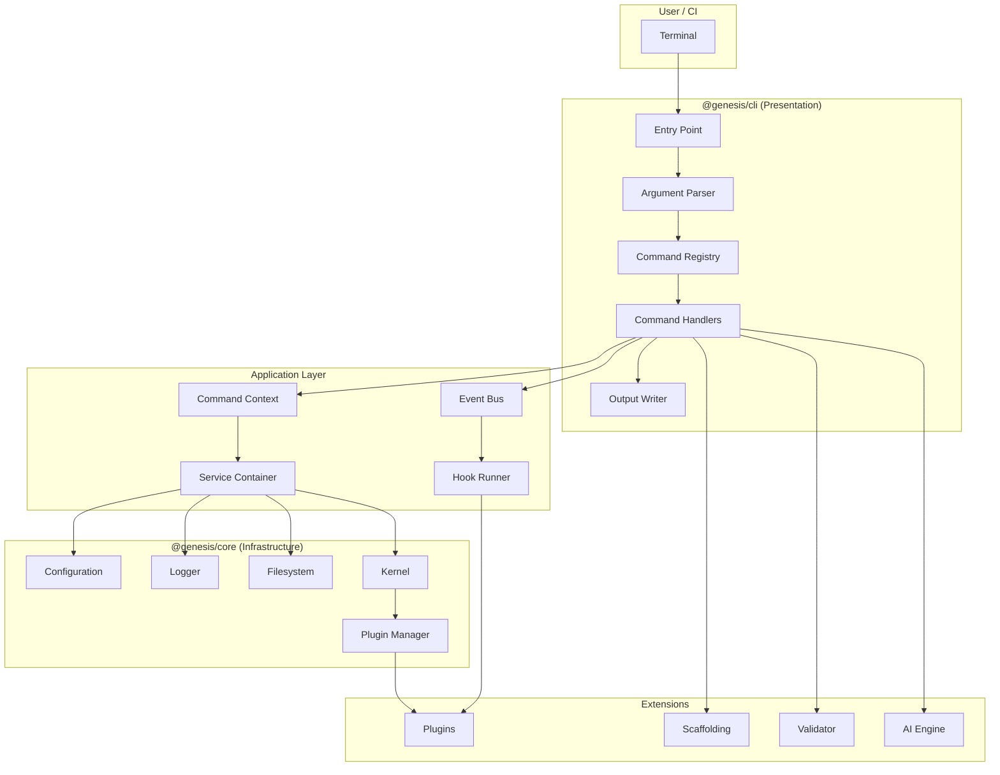

### Layer Assignment

| Component | Layer | Package |
|-----------|-------|---------|
| Entry point, argument parser, output writer | Presentation | `@genesis/cli` |
| Command registry, command context, event bus | Application | `@genesis/cli` |
| Command interface, exit codes, error types | Domain | `@genesis/shared` |
| Configuration, logging, filesystem, plugin manager | Infrastructure | `@genesis/core` |

---

## Folder Structure

Logical module layout for `@genesis/cli`. Names are descriptive; actual file names are an implementation detail.

```
packages/cli/
├── README.md                          # Package overview
│
├── presentation/                      # Presentation layer
│   ├── entry-point                    # Process bootstrap and teardown
│   ├── argument-parser                # Global and command flag parsing
│   ├── output-writer                  # stdout/stderr formatting
│   └── help-renderer                  # --help and --version output
│
├── application/                       # Application layer
│   ├── cli-runtime                    # Lifecycle orchestration
│   ├── command-registry               # Registration and dispatch
│   ├── command-context-factory        # Builds context per invocation
│   ├── service-container              # Dependency injection container
│   ├── event-bus                      # Internal event emission
│   └── hook-runner                    # Lifecycle hook execution
│
├── commands/                          # Built-in command handlers
│   ├── version/                       # --version
│   ├── help/                          # --help
│   ├── create/                        # genesis create
│   ├── generate/                      # genesis generate
│   ├── validate/                      # genesis validate
│   ├── config/                        # genesis config
│   └── plugin/                        # genesis plugin
│
└── tests/
    ├── unit/                          # Registry, parser, context
    ├── integration/                   # Command execution with mocks
    └── e2e/                           # Full CLI subprocess tests
```

Shared contracts (command interface, error types, event types) live in `@genesis/shared`. Infrastructure services live in `@genesis/core`.

---

## Command Lifecycle

Every CLI invocation follows a deterministic lifecycle from process start to exit.

### Lifecycle Phases

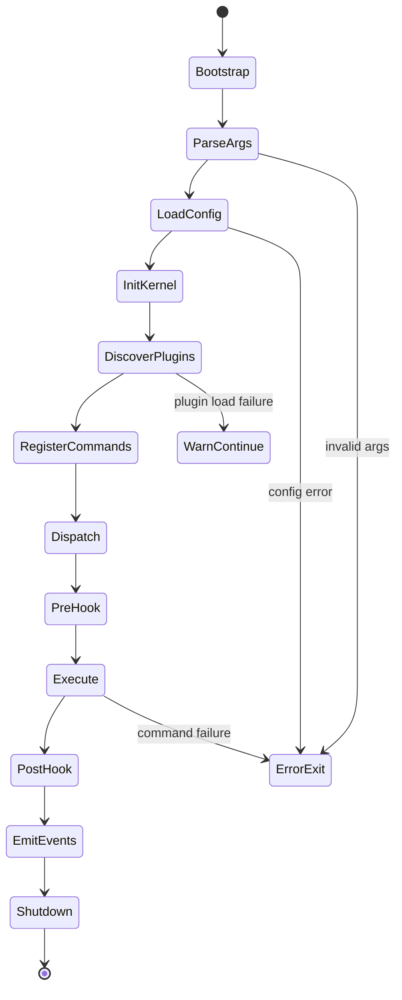

| Phase | Responsibility | Failure Behavior |
|-------|----------------|------------------|
| **Bootstrap** | Create service container, initialize logger | Exit 1 |
| **ParseArgs** | Parse argv into command name, flags, positional args | Exit 2 |
| **LoadConfig** | Merge config sources into resolved configuration | Exit 1 |
| **InitKernel** | Initialize kernel services (registries, event bus) | Exit 1 |
| **DiscoverPlugins** | Find and load plugins via plugin manager | Warn; continue without failed plugins |
| **RegisterCommands** | Register built-in and plugin commands in registry | Exit 1 if built-in registration fails |
| **Dispatch** | Resolve command from registry | Exit 2 if unknown command |
| **PreHook** | Run `pre-command` hooks | Log hook failures; continue |
| **Execute** | Invoke command handler with context | Exit per error type |
| **PostHook** | Run `post-command` hooks | Log hook failures; continue |
| **EmitEvents** | Flush event bus, write telemetry | Log failures; do not change exit code |
| **Shutdown** | Run `shutdown` hooks, flush logs, release resources | Best-effort cleanup |

### Lifecycle Sequence

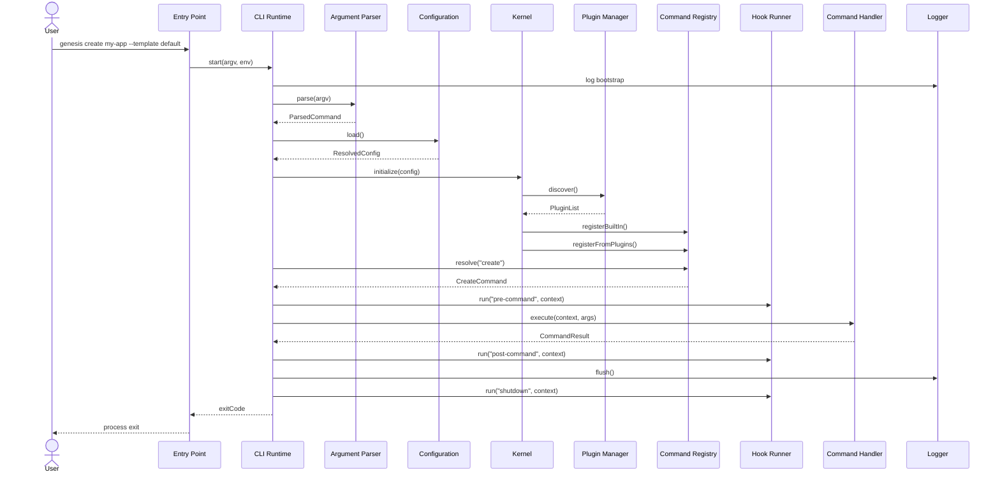

### Command Execution Sub-Lifecycle

Within the **Execute** phase, each command follows:

| Step | Action |
|------|--------|
| 1 | Validate positional arguments and required flags |
| 2 | Build command-specific context from global context |
| 3 | Emit `command:start` event |
| 4 | Execute domain operation via injected service |
| 5 | Format result via output writer |
| 6 | Emit `command:complete` or `command:error` event |
| 7 | Return `CommandResult` with exit code and optional data |

---

## Commands

### Global Flags

Available on every command:

| Flag | Short | Type | Default | Description |
|------|-------|------|---------|-------------|
| `--help` | `-h` | boolean | false | Show help for current command |
| `--version` | `-V` | boolean | false | Show version information |
| `--verbose` | `-v` | boolean | false | Enable debug logging to stderr |
| `--quiet` | `-q` | boolean | false | Suppress non-essential output |
| `--json` | | boolean | false | Output structured JSON (Phase 2) |
| `--config` | `-c` | path | auto | Path to configuration file |
| `--no-color` | | boolean | false | Disable ANSI color output |

Flag precedence: explicit CLI flag > environment variable > config file > default.

### Command Tree

```
genesis
├── --version
├── --help
├── create <name>              # Scaffold a new project
├── generate <type> [name]     # Generate module within project
├── validate                   # Run architecture checks
├── config
│   ├── show                   # Display resolved configuration
│   ├── init                   # Create default config file
│   └── path                   # Print config file location
├── plugin
│   ├── list                   # List installed plugins
│   └── info <name>            # Show plugin details
└── ai                         # Phase 4
    ├── plan <requirement>
    ├── review
    └── docs
```

### Built-in Commands — Phase 1 (M1)

#### `genesis --version`

| Attribute | Value |
|-----------|-------|
| **Purpose** | Display CLI and framework version |
| **Arguments** | None |
| **Flags** | Global only |
| **Output** | `genesis v{version} (node {nodeVersion})` |
| **Exit code** | 0 |
| **Sprint** | 1 |

#### `genesis --help`

| Attribute | Value |
|-----------|-------|
| **Purpose** | Display available commands and global flags |
| **Arguments** | Optional command name for subcommand help |
| **Output** | Formatted command tree |
| **Exit code** | 0 |
| **Sprint** | 1 |

#### `genesis create <name>`

| Attribute | Value |
|-----------|-------|
| **Purpose** | Scaffold a new project from a template |
| **Arguments** | `name` — project name (required, kebab-case) |
| **Flags** | `--template`, `--output`, `--dry-run`, `--force` |
| **Delegates to** | Scaffolding service ([004-scaffolding](../004-scaffolding/)) |
| **Exit codes** | 0 success, 1 error, 2 invalid name, 3 validation failure |
| **Sprint** | 4 |

| Flag | Type | Default | Description |
|------|------|---------|-------------|
| `--template` | string | `default` | Project template name |
| `--output` | path | `./{name}` | Output directory |
| `--dry-run` | boolean | false | Show plan without writing files |
| `--force` | boolean | false | Overwrite existing output directory |

#### `genesis validate`

| Attribute | Value |
|-----------|-------|
| **Purpose** | Validate project against architecture and standards |
| **Arguments** | None |
| **Flags** | `--path`, `--strict` |
| **Delegates to** | Validator service |
| **Exit codes** | 0 pass, 3 validation failure |
| **Sprint** | 2 |

#### `genesis generate <type> [name]`

| Attribute | Value |
|-----------|-------|
| **Purpose** | Generate a module within the current project |
| **Arguments** | `type` — generator type; `name` — module name |
| **Delegates to** | Scaffolding service (module mode) |
| **Sprint** | Phase 2 |

### Plugin Commands — Phase 2

Plugins register namespaced commands:

| Pattern | Example |
|---------|---------|
| `{plugin}:{command}` | `unity:create-scene` |
| `{plugin} {subcommand}` | `plugin list`, `plugin info` |

### AI Commands — Phase 4

| Command | Purpose |
|---------|---------|
| `genesis ai plan <requirement>` | Generate implementation plan |
| `genesis ai review` | Review staged changes |
| `genesis ai docs` | Generate documentation for changes |

Delegates to [005-ai-engine](../005-ai-engine/).

### Exit Codes

| Code | Name | When |
|------|------|------|
| 0 | `SUCCESS` | Command completed successfully |
| 1 | `GENERAL_ERROR` | Unhandled error, config failure, kernel failure |
| 2 | `INVALID_USAGE` | Unknown command, bad flags, missing required args |
| 3 | `VALIDATION_ERROR` | Architecture or standards validation failed |
| 4 | `PLUGIN_ERROR` | Plugin load or plugin command failure |
| 5 | `INTERRUPTED` | User interrupt (SIGINT) |

---

## Command Registry

The command registry is the central dispatch mechanism. It maps command identifiers to handlers and supports both built-in and plugin-registered commands.

### Responsibilities

| Responsibility | Description |
|----------------|-------------|
| **Registration** | Accept command definitions from built-in and plugin sources |
| **Resolution** | Look up command by identifier (including namespaces) |
| **Dispatch** | Invoke the resolved command with context and arguments |
| **Introspection** | Provide command metadata for help rendering |
| **Conflict detection** | Reject duplicate command names at registration time |

### Registration Rules

| Rule | Description |
|------|-------------|
| R1 | Built-in commands register during kernel initialization, before plugins |
| R2 | Plugin commands register during plugin `onLoad` via kernel |
| R3 | Duplicate names between plugins → first registered wins; second logs warning |
| R4 | Duplicate name with built-in → rejected; built-in always wins |
| R5 | Command names use kebab-case; namespaces use colon separator |
| R6 | Registration is immutable after `post-init` hook completes |

### Command Definition Contract

Every registrable command exposes:

| Field | Type | Required | Description |
|-------|------|----------|-------------|
| `id` | string | yes | Unique identifier (e.g., `create`, `unity:create-scene`) |
| `description` | string | yes | One-line summary for help output |
| `category` | string | no | Grouping for help (e.g., `project`, `plugin`, `ai`) |
| `aliases` | string[] | no | Alternative identifiers |
| `flags` | FlagDefinition[] | no | Command-specific flags |
| `arguments` | ArgumentDefinition[] | no | Positional argument definitions |
| `handler` | CommandHandler | yes | Function invoked on dispatch |
| `hidden` | boolean | no | Exclude from help (default false) |

### Registry Operations

| Operation | Input | Output | Error |
|-----------|-------|--------|-------|
| `register` | CommandDefinition | void | `DUPLICATE_COMMAND` |
| `unregister` | command id | void | `COMMAND_NOT_FOUND` |
| `resolve` | command id or alias | CommandDefinition | `COMMAND_NOT_FOUND` |
| `list` | optional category filter | CommandDefinition[] | — |
| `has` | command id | boolean | — |

### Dispatch Sequence

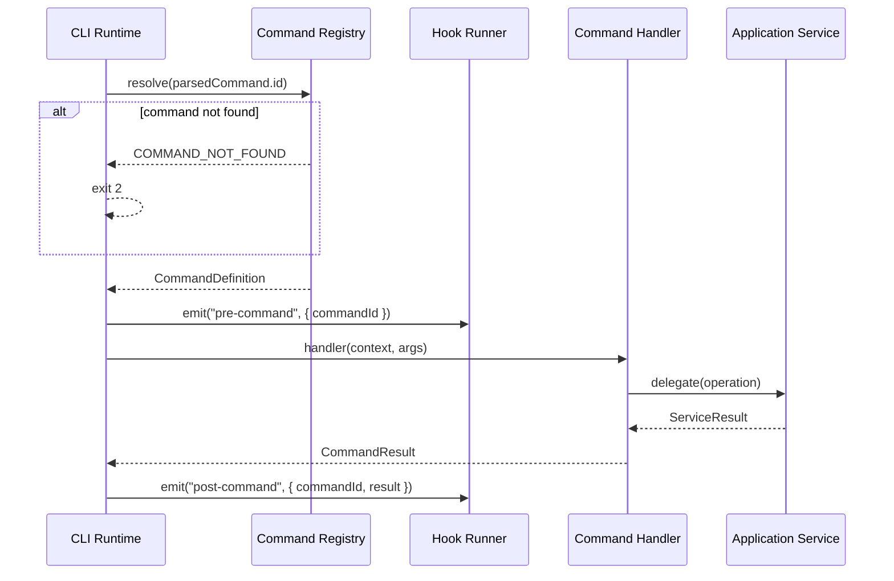

---

## Dependency Injection

The CLI uses a **service container** to resolve dependencies. Commands never instantiate infrastructure services directly.

### Design

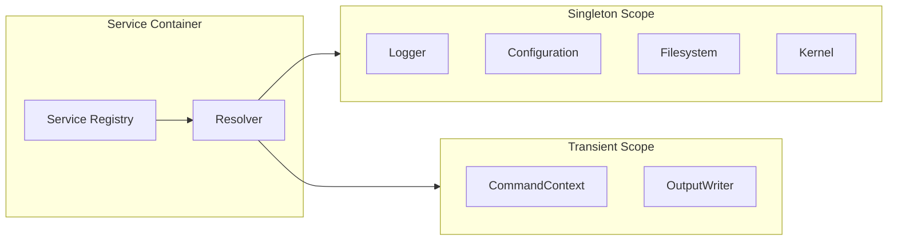

### Service Scopes

| Scope | Lifetime | Examples |
|-------|----------|---------|
| **Singleton** | One instance per CLI process | Logger, Configuration, Filesystem, Kernel, EventBus |
| **Transient** | New instance per command invocation | CommandContext, OutputWriter |
| **Scoped** | One instance per command execution | HookRunner context (future) |

### Registered Services

| Service | Interface | Scope | Provider |
|---------|-----------|-------|----------|
| Logger | `ILogger` | Singleton | `@genesis/core` |
| Configuration | `IConfiguration` | Singleton | `@genesis/core` |
| Filesystem | `IFilesystem` | Singleton | `@genesis/core` |
| Kernel | `IKernel` | Singleton | `@genesis/core` |
| PluginManager | `IPluginManager` | Singleton | `@genesis/core` |
| EventBus | `IEventBus` | Singleton | `@genesis/cli` |
| CommandRegistry | `ICommandRegistry` | Singleton | `@genesis/cli` |
| OutputWriter | `IOutputWriter` | Transient | `@genesis/cli` |
| ScaffoldingService | `IScaffoldingService` | Singleton | `@genesis/scaffolding` |
| ValidatorService | `IValidatorService` | Singleton | `@genesis/validator` |

### Resolution Rules

| Rule | Description |
|------|-------------|
| DI-1 | Services registered by interface, resolved by interface |
| DI-2 | Registration occurs during bootstrap, before command dispatch |
| DI-3 | Commands receive `CommandContext` which exposes all required services |
| DI-4 | Plugins receive `PluginContext` with kernel registries and limited services |
| DI-5 | Circular dependencies are rejected at registration time |
| DI-6 | Test environments replace services with mocks via container override API |

### Command Context

`CommandContext` is the dependency surface passed to every command handler:

| Field | Type | Description |
|-------|------|-------------|
| `config` | Configuration | Resolved configuration |
| `logger` | Logger | Child logger with command name |
| `filesystem` | Filesystem | File operations |
| `kernel` | Kernel | Access to registries and plugin manager |
| `output` | OutputWriter | Formatted stdout/stderr |
| `events` | EventBus | Emit command-level events |
| `cwd` | string | Current working directory |
| `flags` | ParsedFlags | Resolved flag values |
| `args` | ParsedArgs | Resolved positional arguments |

### Test Override API

The container exposes overrides for testing:

| Operation | Purpose |
|-----------|---------|
| `container.override(service, mock)` | Replace a service with a test double |
| `container.reset()` | Restore default registrations |
| `container.createTestContext(overrides)` | Build a CommandContext with selective mocks |

---

## Configuration System

Configuration provides runtime settings for the CLI and resolved project settings.

### Configuration Sources

Merged in priority order (highest wins):

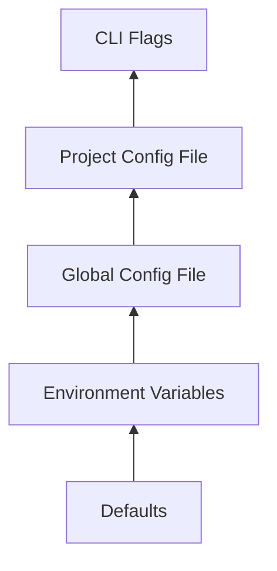

| Priority | Source | Location | Example |
|----------|--------|----------|---------|
| 1 (lowest) | Built-in defaults | In code | `logLevel: "info"` |
| 2 | Environment variables | `GENESIS_*` | `GENESIS_LOG_LEVEL=debug` |
| 3 | Global config | `~/.genesis/config.yml` | User preferences |
| 4 | Project config | `.genesis/config.yml` | Project template, author |
| 5 (highest) | CLI flags | `--config`, `--verbose` | Override at invocation |

### Configuration Schema

| Key | Type | Default | Description |
|-----|------|---------|-------------|
| `version` | string | `1` | Config schema version |
| `logLevel` | enum | `info` | `debug`, `info`, `warn`, `error` |
| `logFormat` | enum | `text` | `text`, `json` |
| `color` | boolean | true | ANSI color in output |
| `defaultTemplate` | string | `default` | Default project template |
| `author` | string | — | Default author name for generation |
| `license` | string | `MIT` | Default license |
| `plugins` | string[] | `[]` | Enabled plugin names |
| `pluginPaths` | string[] | `[]` | Additional plugin search paths |

### Environment Variable Mapping

| Variable | Config Key |
|----------|------------|
| `GENESIS_LOG_LEVEL` | `logLevel` |
| `GENESIS_LOG_FORMAT` | `logFormat` |
| `GENESIS_NO_COLOR` | `color` (inverted) |
| `GENESIS_CONFIG` | Config file path |
| `GENESIS_DEFAULT_TEMPLATE` | `defaultTemplate` |

### Configuration Commands

| Command | Behavior |
|---------|----------|
| `genesis config show` | Print resolved configuration (secrets redacted) |
| `genesis config init` | Create `~/.genesis/config.yml` with defaults |
| `genesis config path` | Print path to active config file |

### Validation Rules

| Rule | Error |
|------|-------|
| Config file must be valid YAML | `CONFIG_PARSE_ERROR` |
| Unknown keys produce warnings, not errors | — |
| `logLevel` must be a valid enum value | `CONFIG_VALIDATION_ERROR` |
| Secrets must not appear in config files committed to VCS | Documented in help |

### Configuration Load Sequence

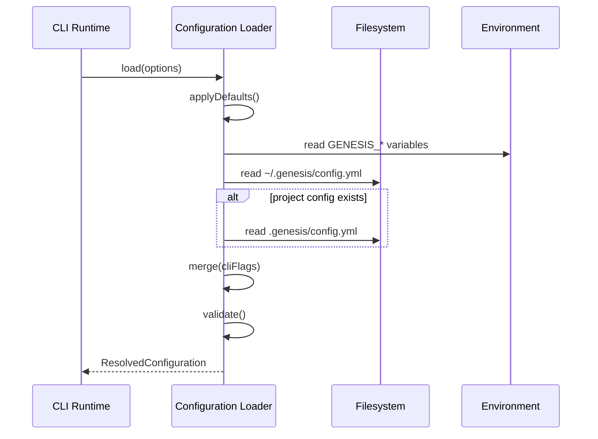

---

## Plugin Discovery

Plugin discovery is owned by the kernel (`@genesis/core`) but directly affects CLI behavior by extending the command tree. The CLI triggers discovery during initialization and surfaces plugin state via `genesis plugin` commands.

### Discovery Flow

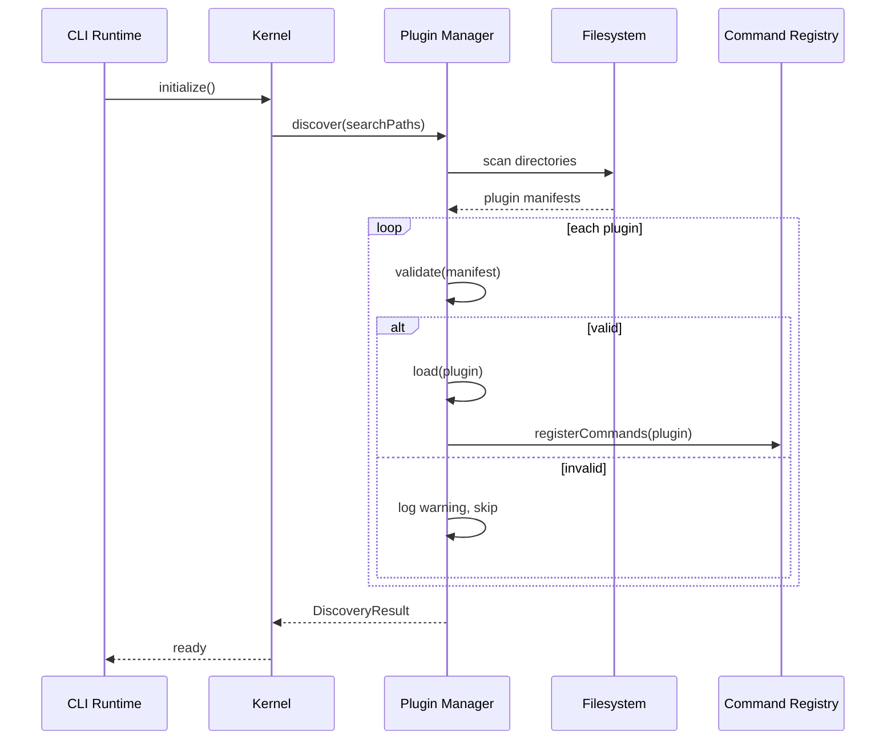

### Search Paths

| Order | Path | Purpose |
|-------|------|---------|
| 1 | `packages/plugins/` | Monorepo development plugins |
| 2 | `node_modules/@genesis/plugin-*` | Installed npm plugins |
| 3 | Paths from `plugins.pluginPaths` config | User-defined locations |
| 4 | `.genesis/plugins/` | Project-local plugins (future) |

### Plugin Manifest

Each plugin exposes a manifest (format independent of implementation):

| Field | Required | Description |
|-------|----------|-------------|
| `name` | yes | Unique identifier (`@genesis/plugin-unity`) |
| `version` | yes | Semantic version |
| `genesisVersion` | yes | Compatible framework version range |
| `description` | yes | Human-readable summary |
| `main` | yes | Entry point module |
| `capabilities` | yes | List of capability types |
| `dependencies` | no | Other plugins required (kernel only, not plugin-to-plugin) |

### Discovery Result

| Field | Type | Description |
|-------|------|-------------|
| `loaded` | PluginInfo[] | Successfully loaded plugins |
| `skipped` | SkippedPlugin[] | Plugins that failed validation or load |
| `commands` | string[] | Command IDs registered by plugins |

### CLI Exposure

| Command | Output |
|---------|--------|
| `genesis plugin list` | Table of loaded plugins with version and capabilities |
| `genesis plugin info <name>` | Detailed plugin metadata and registered commands |

### Failure Behavior

| Failure | CLI Behavior |
|---------|-------------|
| Plugin not found in search path | Silent skip (not an error) |
| Invalid manifest | Warning logged; plugin skipped |
| Version mismatch | Warning logged; plugin skipped |
| `onLoad` throws | Warning logged; plugin skipped; exit code unaffected |
| Plugin command throws | Exit code 4; other plugins unaffected |

---

## Logging

Logging is provided by `@genesis/core` and consumed by the CLI. All log output goes to **stderr** to keep stdout clean for piping.

### Log Levels

| Level | When Used |
|-------|-----------|
| `debug` | Flag parsing details, registry operations, hook execution |
| `info` | Command start/complete, plugin load summary |
| `warn` | Skipped plugins, deprecated flags, config warnings |
| `error` | Command failures, unhandled exceptions, config errors |

### Log Format

**Text mode (default):**

```
[2026-07-26T12:00:00.000Z] INFO  genesis:cli create — Starting project scaffolding
```

**JSON mode (`logFormat: json` or `--verbose` with structured output):**

```json
{
  "timestamp": "2026-07-26T12:00:00.000Z",
  "level": "info",
  "component": "genesis:cli:create",
  "message": "Starting project scaffolding",
  "commandId": "create",
  "durationMs": null
}
```

### Child Loggers

Each command receives a child logger scoped to its command ID:

| Parent | Child | Purpose |
|--------|-------|---------|
| `genesis` | `genesis:cli` | CLI runtime |
| `genesis:cli` | `genesis:cli:create` | Create command |
| `genesis:cli` | `genesis:cli:plugin` | Plugin manager |

### Verbosity Control

| Mode | Flag | Log Level |
|------|------|-----------|
| Quiet | `--quiet` | `error` only |
| Normal | (default) | `info` and above |
| Verbose | `--verbose` | `debug` and above |

### Sensitive Data

| Rule | Description |
|------|-------------|
| L1 | Never log API keys, tokens, or passwords |
| L2 | Config values matching `*secret*`, `*token*`, `*key*` are redacted |
| L3 | File paths in logs use relative paths when inside project directory |

---

## Error Handling

Errors are classified, wrapped at layer boundaries, and surfaced to the user with actionable messages.

### Error Hierarchy

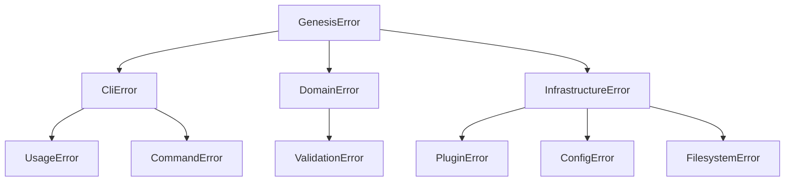

| Type | Layer | Exit Code | User Message |
|------|-------|-----------|--------------|
| `UsageError` | Presentation | 2 | What went wrong + correct usage hint |
| `CommandError` | Application | 1 | Operation failed + suggested fix |
| `ValidationError` | Domain | 3 | List of validation failures |
| `PluginError` | Infrastructure | 4 | Plugin name + failure reason |
| `ConfigError` | Infrastructure | 1 | Config file path + parse/validation detail |
| `FilesystemError` | Infrastructure | 1 | Path + permission or not-found detail |

### Error Contract

Every error exposes:

| Field | Type | Description |
|-------|------|-------------|
| `code` | string | Machine-readable identifier (e.g., `COMMAND_NOT_FOUND`) |
| `message` | string | Human-readable description |
| `details` | object | Structured context (optional) |
| `cause` | Error | Wrapped underlying error (optional) |
| `exitCode` | number | Process exit code |

### Error Handling Rules

| Rule | Description |
|------|-------------|
| EH-1 | Domain errors never leak infrastructure details to the user |
| EH-2 | Presentation layer catches all unhandled errors and maps to exit code 1 |
| EH-3 | `--json` mode outputs errors as structured JSON on stderr |
| EH-4 | Stack traces shown only when `logLevel` is `debug` |
| EH-5 | Plugin errors are isolated; one plugin failure does not affect others |

### User-Facing Error Format

```
Error: Project name "My App" is invalid.

  Project names must be kebab-case (lowercase letters, numbers, hyphens).
  Example: my-app

  Exit code: 2
```

### JSON Error Format (Phase 2)

```json
{
  "error": {
    "code": "INVALID_PROJECT_NAME",
    "message": "Project name \"My App\" is invalid.",
    "details": {
      "name": "My App",
      "rule": "kebab-case"
    },
    "exitCode": 2
  }
}
```

---

## Events

The CLI emits internal events for observability, hook triggering, and future telemetry integration. Events are distinct from hooks: events are notifications; hooks are actionable listeners.

### Event Bus

| Property | Description |
|----------|-------------|
| **Owner** | `@genesis/cli` application layer |
| **Scope** | Single CLI process |
| **Delivery** | Synchronous by default; async listeners supported |
| **Persistence** | None (in-memory only) |

### Event Catalog

| Event | Payload | When |
|-------|---------|------|
| `cli:bootstrap` | `{ version }` | Process started |
| `cli:shutdown` | `{ exitCode, durationMs }` | Process exiting |
| `config:loaded` | `{ sources, keys }` | Configuration merged |
| `plugin:discovered` | `{ count, paths }` | Plugin scan complete |
| `plugin:loaded` | `{ name, version }` | Single plugin loaded |
| `plugin:skipped` | `{ name, reason }` | Plugin skipped |
| `command:registered` | `{ id, source }` | Command added to registry |
| `command:start` | `{ id, args, flags }` | Command execution begins |
| `command:complete` | `{ id, exitCode, durationMs }` | Command succeeded |
| `command:error` | `{ id, error, exitCode }` | Command failed |
| `hook:fire` | `{ hookName, listenerCount }` | Hook about to run |
| `hook:error` | `{ hookName, error }` | Hook listener threw |

### Event Contract

| Field | Type | Description |
|-------|------|-------------|
| `type` | string | Event identifier |
| `timestamp` | ISO8601 | When the event occurred |
| `source` | string | Component that emitted (e.g., `cli:runtime`) |
| `payload` | object | Event-specific data |
| `correlationId` | string | Ties events to a single CLI invocation |

### Subscription

| Consumer | Events Subscribed | Purpose |
|----------|-------------------|---------|
| Hook runner | `command:start`, `command:complete` | Trigger lifecycle hooks |
| Logger | All events at `debug` level | Trace output |
| Telemetry (future) | `cli:shutdown`, `command:complete` | Usage analytics |

---

## Hooks

Hooks are extension points that allow plugins and internal systems to intercept the CLI lifecycle. Defined in [003-plugin-system](../003-plugin-system/); consumed by the CLI.

### Hook vs Event

| Aspect | Event | Hook |
|--------|-------|------|
| Purpose | Notification | Interception |
| Listeners can block | No | Yes (pre-hooks can cancel) |
| Return value | None | Optional modification |
| Registered by | Internal systems | Plugins and built-in modules |
| Failure handling | Log and continue | Log and continue (never crash CLI) |

### CLI Hook Catalog

| Hook | Phase | Cancellable | Payload |
|------|-------|-------------|---------|
| `pre-init` | Before kernel init | No | `{ config }` |
| `post-init` | After kernel init | No | `{ kernel, plugins }` |
| `pre-command` | Before command execute | Yes | `{ commandId, args, flags }` |
| `post-command` | After command execute | No | `{ commandId, result }` |
| `pre-generate` | Before scaffolding | Yes | `{ template, variables }` |
| `post-generate` | After scaffolding | No | `{ template, filesCreated }` |
| `pre-validate` | Before validation | No | `{ path, rules }` |
| `shutdown` | Before process exit | No | `{ exitCode }` |

### Hook Execution Rules

| Rule | Description |
|------|-------------|
| H1 | Hooks execute in registration order |
| H2 | A cancellable hook can set `cancelled: true` to abort the operation |
| H3 | Hook timeout: 30 seconds per listener (configurable) |
| H4 | Hook failure logs warning; subsequent hooks still execute |
| H5 | `shutdown` hooks always run, even on error exit |

### Hook Sequence (Create Command)

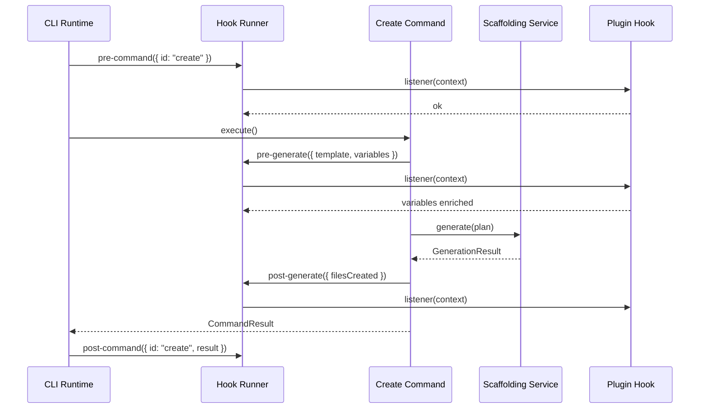

---

## Public API

The public API defines contracts exposed to command authors, plugin developers, and sibling packages. Described abstractly — no implementation language.

### Command Handler API

**Register a command:**

```
CommandRegistry.register({
  id: string,
  description: string,
  flags: FlagDefinition[],
  arguments: ArgumentDefinition[],
  handler: (context: CommandContext, args: ParsedArgs) => CommandResult
})
```

**CommandResult:**

| Field | Type | Description |
|-------|------|-------------|
| `exitCode` | number | Process exit code |
| `message` | string | Optional user-facing summary |
| `data` | object | Optional structured data (for `--json` output) |

### Service Container API

| Method | Description |
|--------|-------------|
| `register(interface, implementation, scope)` | Register a service |
| `resolve(interface)` | Resolve a service instance |
| `override(interface, mock)` | Replace for testing |
| `reset()` | Restore defaults |

### Configuration API

| Method | Description |
|--------|-------------|
| `load(options)` | Load and merge all config sources |
| `get(key)` | Get resolved value |
| `getAll()` | Get full resolved configuration |
| `getPath()` | Get active config file path |

### Event Bus API

| Method | Description |
|--------|-------------|
| `emit(event)` | Emit an event to all subscribers |
| `on(type, listener)` | Subscribe to an event type |
| `off(type, listener)` | Unsubscribe |

### Hook Registry API

| Method | Description |
|--------|-------------|
| `register(hookName, listener, priority)` | Add a hook listener |
| `unregister(hookName, listener)` | Remove a hook listener |
| `run(hookName, payload)` | Execute all listeners for a hook |

### Output Writer API

| Method | Description |
|--------|-------------|
| `success(message)` | Write to stdout (green in color mode) |
| `info(message)` | Write to stdout |
| `warn(message)` | Write to stderr (yellow) |
| `error(message)` | Write to stderr (red) |
| `table(rows, columns)` | Formatted table output |
| `json(data)` | Structured JSON output |
| `newline()` | Blank line |

### Kernel API (Consumed by CLI)

| Method | Description |
|--------|-------------|
| `initialize(config)` | Bootstrap kernel services |
| `getCommandRegistry()` | Access command registry |
| `getPluginManager()` | Access plugin manager |
| `getHookRegistry()` | Access hook registry |
| `shutdown()` | Release kernel resources |

---

## Extension Points

Third parties and plugins extend the CLI through these sanctioned mechanisms:

| Extension Point | Mechanism | Registration | Example |
|-----------------|-----------|--------------|---------|
| **Commands** | `CommandRegistry.register()` | Plugin `onLoad` or built-in | `unity:create-scene` |
| **Flags** | `FlagDefinition` on command | Command definition | `--template`, `--dry-run` |
| **Hooks** | `HookRegistry.register()` | Plugin `onLoad` | `pre-generate` variable injection |
| **Events** | `EventBus.on()` | Internal and plugin | React to `command:complete` |
| **Config keys** | Config schema extension | Plugin manifest | `plugins.unity.version` |
| **Output format** | `OutputWriter` | Phase 2 | Custom `--json` schemas |
| **Validators** | `ValidatorRegistry` | Plugin `onLoad` | Unity scene structure check |
| **Generators** | `GeneratorRegistry` | Plugin `onLoad` | `nestjs-module` generator |
| **Templates** | `TemplateRegistry` | Plugin `onLoad` | C# script templates |

### Extension Rules

| Rule | Description |
|------|-------------|
| EP-1 | Extensions must not modify built-in command behavior |
| EP-2 | Extensions must not access services outside their declared capabilities |
| EP-3 | Extensions must handle their own errors; CLI provides exit code mapping |
| EP-4 | Extensions must register during `post-init`; no runtime deregistration |
| EP-5 | Extension names must be namespaced to avoid collisions |

### Adding a New Built-in Command

1. Define command in `commands/{name}/` following layer rules
2. Register in built-in command list during kernel init
3. Add tests: unit (handler), integration (with mocks), e2e (subprocess)
4. Update help output and this specification
5. Document in [README.md](README.md) command table

### Adding a Plugin Command

1. Plugin implements `GenesisPlugin` contract ([003-plugin-system](../003-plugin-system/))
2. Plugin registers commands in `register(registries)` method
3. Plugin commands are namespaced: `{plugin-name}:{command}`
4. Plugin provides its own tests; CLI provides integration test with mock plugin

---

## Sequence Diagrams

### Full Invocation (genesis create)

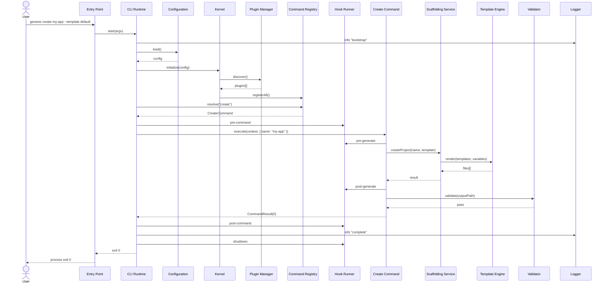

### Plugin Load Failure (Graceful Degradation)

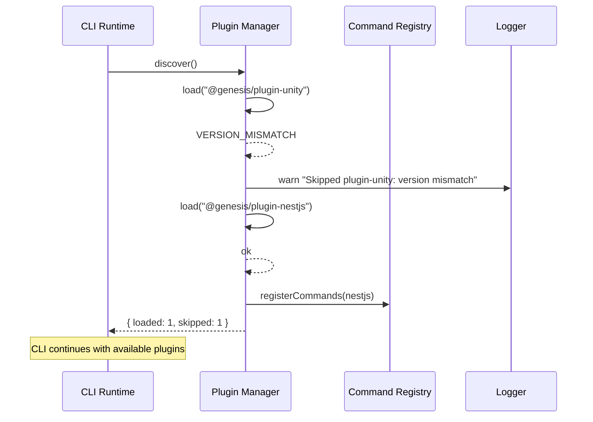

### Error Path (Invalid Usage)

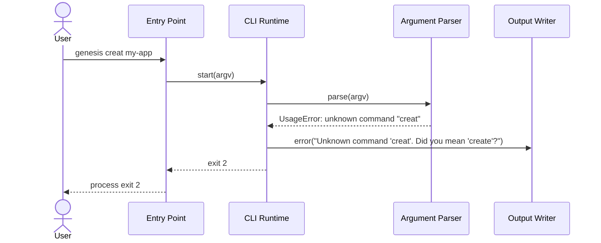

### Dependency Injection Resolution

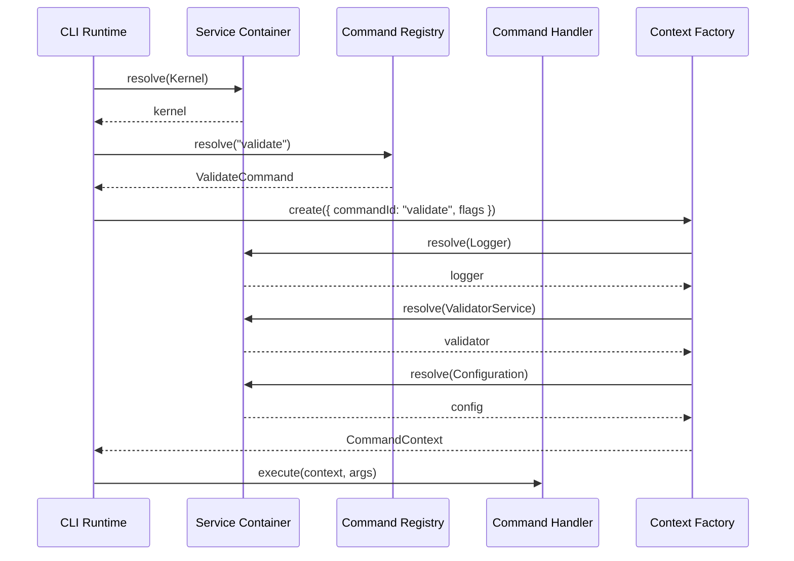

---

## Related Documents

| Document | Relationship |
|----------|-------------|
| [README.md](README.md) | Parent CLI specification (overview) |
| [000-project](../000-project/) | Project-wide architecture |
| [003-plugin-system](../003-plugin-system/) | Plugin contract and kernel |
| [004-scaffolding](../004-scaffolding/) | Create command delegation |
| [DECISION_LOG.md](../../DECISION_LOG.md) | ADR-001, ADR-002, ADR-005 |
| [standards/ARCHITECTURE_STANDARD.md](../../standards/ARCHITECTURE_STANDARD.md) | Layer rules |
| [standards/logging/](../../standards/logging/) | Logging standards |
| [DEFINITION_OF_DONE.md](../../.cursor/context/DEFINITION_OF_DONE.md) | Completion criteria |

## Changelog

| Version | Date | Change |
|---------|------|--------|
| 1.0.0 | 2026-07-26 | Initial functional specification |
