# Genesis Template Engine — Functional Specification

## Document Control

| Field | Value |
|-------|-------|
| **Specification** | [002-template-engine](README.md) |
| **Status** | Approved |
| **Version** | 1.0.0 |
| **Independence** | Implementation-independent. No language, library, or parser technology is prescribed. |
| **Audience** | Engineers, template authors, AI assistants, reviewers |

## Purpose

Define the complete functional behavior of the **Genesis Template Engine** — the rendering subsystem responsible for discovering, validating, and transforming templates into generated files. The engine is the foundation for all code and document generation in Project Genesis.

## Scope

### In Scope

- Template architecture and component model
- End-to-end rendering pipeline
- Variable resolution, expressions, helpers, conditionals, and loops
- Partial templates and template inheritance
- Template discovery, registration, and versioning
- Validation (syntax, metadata, context, output paths)
- Template testing framework
- Error handling and output policies
- Public API contracts

### Out of Scope

- Project-level generation orchestration ([004-scaffolding](../004-scaffolding/))
- Authoring scaffolds in repository `templates/` (human/AI document templates, not runtime templates)
- CLI commands (`genesis template preview` delegates here but is specified in [001-cli](../001-cli/))
- Plugin loading mechanics ([003-plugin-system](../003-plugin-system/))
- Unity asset binary formats ([008-unity](../008-unity/))

---

## Goals

| ID | Goal | Success Criteria |
|----|------|------------------|
| G1 | **Deterministic** | Identical template + context always produces byte-identical output |
| G2 | **Validated** | Invalid templates fail before rendering with actionable errors |
| G3 | **Composable** | Partials, inheritance, and nested renders compose without side effects |
| G4 | **Expressive** | Variables, expressions, helpers, conditionals, and loops cover all generation needs |
| G5 | **Discoverable** | Templates found by name, category, tag, or plugin source |
| G6 | **Versioned** | Templates declare versions; breaking changes are explicit |
| G7 | **Testable** | Every template has a corresponding test case with fixture context |
| G8 | **Plugin-aware** | Plugins contribute templates without modifying engine core |
| G9 | **Performant** | 100-template render batch completes in under 2 seconds |

### Design Principles

1. **Parse then render** — Validation completes before any file is written.
2. **Pure rendering** — Rendering is a function of template + context; no hidden global state.
3. **Explicit metadata** — Every template declares its variables, output path, and version in a header.
4. **Safe defaults** — Default output policy is `skip` (never overwrite without consent).
5. **Fail with context** — Errors include template name, line number, and variable name when applicable.

---

## Architecture

### System Overview

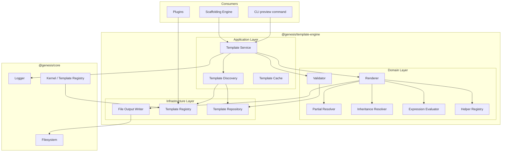

### Layer Responsibilities

| Layer | Components | Responsibility |
|-------|------------|----------------|
| **Application** | Template Service, Discovery, Cache | Orchestrate discover → validate → render → write |
| **Domain** | Validator, Renderer, Expression Evaluator, Helper Registry | Pure rendering logic; no I/O |
| **Infrastructure** | File Output Writer, Template Repository, Template Registry | Filesystem access, template storage |

### Component Model

| Component | Responsibility |
|-----------|----------------|
| **Template Service** | Public API entry point; coordinates the rendering pipeline |
| **Template Discovery** | Scan directories and registries to find templates |
| **Template Repository** | Load template source and metadata from storage |
| **Template Cache** | Cache parsed templates by id + version for repeated renders |
| **Validator** | Validate metadata, syntax, context, and references before rendering |
| **Renderer** | Transform template source + context into rendered content |
| **Partial Resolver** | Resolve and inline partial template references |
| **Inheritance Resolver** | Merge base templates with child overrides |
| **Expression Evaluator** | Evaluate expressions in variable bindings and directives |
| **Helper Registry** | Register and invoke built-in and custom helpers |
| **File Output Writer** | Write rendered content to filesystem with output policies |

### Logical Folder Structure

```
packages/template-engine/
├── README.md
├── application/
│   ├── template-service           # Public orchestration API
│   ├── template-discovery         # Directory and registry scanning
│   └── template-cache             # Parsed template cache
├── domain/
│   ├── validator/                 # Metadata, syntax, context validation
│   ├── renderer/                  # Core rendering engine
│   ├── partial-resolver/          # Partial inclusion
│   ├── inheritance-resolver/      # Template extends/override
│   ├── expression-evaluator/      # Expression parsing and evaluation
│   └── helper-registry/           # Built-in and custom helpers
├── infrastructure/
│   ├── template-repository/       # Load templates from disk
│   ├── template-registry/         # In-memory template index
│   └── file-output-writer/        # Filesystem output with policies
├── templates/                     # Built-in runtime templates
│   ├── docs/
│   ├── config/
│   └── module/
└── tests/
    ├── unit/
    ├── integration/
    └── fixtures/                  # Template test fixtures
```

### Relationship to Other Systems

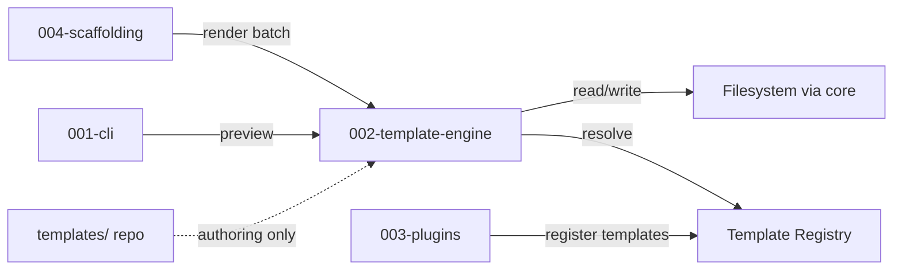

> **Distinction:** `templates/` at repository root contains **authoring scaffolds** for humans and AI. `packages/template-engine/templates/` contains **runtime templates** used by the engine during generation.

---

## Template Format

Every runtime template is a text file with a **YAML frontmatter header** followed by a **body**.

### Example: NestJS Service Template

```yaml
---
id: backend/module-service
version: 1.0.0
name: module-service
description: NestJS service module with optional tests
category: backend
tags: [nestjs, service, module]
extends: backend/base-service
variables:
  - name: moduleName
    type: string
    required: true
    description: Module name in kebab-case
  - name: includeTests
    type: boolean
    required: false
    default: true
  - name: methods
    type: array
    required: false
    default: []
output: "src/{{ moduleName | kebabCase }}/{{ moduleName | camelCase }}.service.ts"
---

{{#extends "backend/base-service"}}

{{#block "imports"}}
import { Injectable } from '@nestjs/common';
{{/block}}

{{#block "classDeclaration"}}
@Injectable()
export class {{ moduleName | pascalCase }}Service {
{{#each methods as |method|}}
  {{ method.name }}({{ method.params }}): {{ method.returnType }} {
    // {{ method.description }}
  }
{{/each}}
}
{{/block}}

{{/extends}}
```

### Metadata Schema

| Field | Required | Type | Description |
|-------|----------|------|-------------|
| `id` | yes | string | Unique template identifier (dot-separated path) |
| `version` | yes | string | Semantic version of this template |
| `name` | yes | string | Short name for discovery and CLI |
| `description` | yes | string | Human-readable summary |
| `category` | no | string | Grouping for discovery (e.g., `backend`, `unity`) |
| `tags` | no | string[] | Searchable tags |
| `extends` | no | string | Parent template id for inheritance |
| `variables` | yes | VariableDefinition[] | Declared input variables |
| `output` | yes | string | Output file path expression |
| `partial` | no | boolean | If true, template is a partial (not rendered standalone) |
| `deprecated` | no | boolean | Mark template as deprecated |
| `replacedBy` | no | string | Successor template id when deprecated |

### Variable Definition Schema

| Field | Required | Type | Description |
|-------|----------|------|-------------|
| `name` | yes | string | Variable identifier |
| `type` | yes | enum | `string`, `number`, `boolean`, `array`, `object` |
| `required` | no | boolean | Default `false` if `default` provided, else `true` |
| `default` | no | any | Default value when not provided in context |
| `description` | no | string | Documentation for template authors |
| `enum` | no | any[] | Allowed values for validation |

---

## Rendering Pipeline

### Pipeline Stages

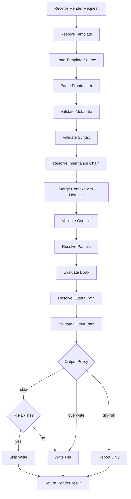

### Stage Descriptions

| Stage | Input | Output | Failure Code |
|-------|-------|--------|--------------|
| Resolve Template | template id, version range | TemplateDescriptor | `TEMPLATE_NOT_FOUND` |
| Load Source | descriptor | raw template string | `TEMPLATE_LOAD_ERROR` |
| Parse Frontmatter | raw string | metadata + body | `INVALID_FRONTMATTER` |
| Validate Metadata | metadata | void | `INVALID_METADATA` |
| Validate Syntax | body | void | `SYNTAX_ERROR` |
| Resolve Inheritance | metadata.extends | merged body | `INHERITANCE_ERROR` |
| Merge Context | metadata.variables + input context | RenderContext | — |
| Validate Context | context + metadata | void | `MISSING_VARIABLE`, `TYPE_MISMATCH` |
| Resolve Partials | body + context | expanded body | `PARTIAL_NOT_FOUND`, `CIRCULAR_PARTIAL` |
| Evaluate Body | body + context | rendered string | `RENDER_ERROR` |
| Resolve Output Path | metadata.output + context | file path | `UNRESOLVED_OUTPUT_PATH` |
| Write File | path + content + policy | void | `WRITE_ERROR` |

### Batch Rendering

Scaffolding invokes batch rendering for multi-file generation:

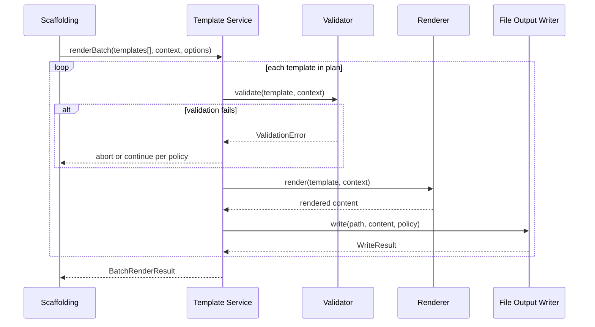

| Batch Option | Description |
|--------------|-------------|
| `stopOnError` | Abort batch on first failure (default: `true`) |
| `outputPolicy` | Applied to all writes in batch |
| `dryRun` | Validate and report without writing |

### Render Request Contract

| Field | Type | Description |
|-------|------|-------------|
| `templateId` | string | Template identifier |
| `version` | string | Optional version constraint (e.g., `^1.0.0`) |
| `context` | object | Variable values for rendering |
| `options.outputPolicy` | enum | `skip`, `overwrite`, `dry-run` |
| `options.basePath` | string | Root directory for output path resolution |

### Render Result Contract

| Field | Type | Description |
|-------|------|-------------|
| `templateId` | string | Template that was rendered |
| `outputPath` | string | Resolved output file path |
| `action` | enum | `created`, `skipped`, `overwritten`, `dry-run` |
| `content` | string | Rendered content (included in dry-run) |
| `durationMs` | number | Render time |

---

## Variables

Variables are named values in the **render context** substituted into template bodies and output paths.

### Substitution Syntax

```
{{ variableName }}
```

### Resolution Order

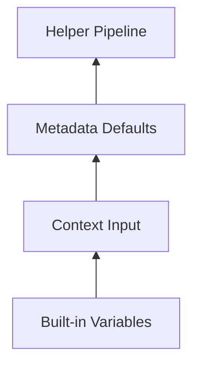

| Priority | Source | Example |
|----------|--------|---------|
| 1 (highest) | Context input | User-provided `moduleName` |
| 2 | Metadata default | `includeTests: true` |
| 3 (lowest) | Built-in variables | `genesisVersion`, `currentYear` |

### Built-in Variables

Available in every render context without declaration:

| Variable | Type | Value |
|----------|------|-------|
| `genesisVersion` | string | Framework version |
| `currentYear` | number | Current UTC year |
| `currentDate` | string | ISO 8601 date (YYYY-MM-DD) |
| `currentTimestamp` | string | ISO 8601 datetime |

### Variable Types

| Type | Description | Example Value |
|------|-------------|---------------|
| `string` | Text value | `"user-service"` |
| `number` | Numeric value | `42` |
| `boolean` | True or false | `true` |
| `array` | Ordered list | `[{ name: "findAll" }, { name: "create" }]` |
| `object` | Key-value map | `{ host: "localhost", port: 5432 }` |

### Path Variables

Variables used in `output` metadata paths support the same syntax as body variables:

```yaml
output: "src/{{ moduleName | kebabCase }}/{{ moduleName | camelCase }}.service.ts"
```

Given `moduleName: "user-service"`:

```
src/user-service/userService.service.ts
```

### Escaping

Literal double braces are escaped with a backslash:

```
\{{ not a variable }}
```

Renders as:

```
{{ not a variable }}
```

### Example: Variable Context

**Input context:**

```yaml
projectName: my-game
author: Jane Developer
includeTests: true
features:
  - auth
  - inventory
```

**Template body:**

```
# {{ projectName | pascalCase }}

Author: {{ author }}
Year: {{ currentYear }}

Features:
{{#each features as |feature|}}
- {{ feature }}
{{/each}}
```

**Rendered output:**

```
# MyGame

Author: Jane Developer
Year: 2026

Features:
- auth
- inventory
```

---

## Expressions

Expressions compute values inline within templates. They extend simple variable substitution with operators and function calls.

### Expression Syntax

```
{{ expression }}
```

Expressions appear inside `{{ }}` delimiters where a variable name alone is insufficient.

### Literal Values

| Type | Syntax | Example |
|------|--------|---------|
| String | `"text"` or `'text'` | `"hello"` |
| Number | digits | `42`, `3.14` |
| Boolean | `true` / `false` | `true` |
| Null | `null` | `null` |

### Operators

| Operator | Description | Example | Result |
|----------|-------------|---------|--------|
| `==` | Equal | `status == "active"` | boolean |
| `!=` | Not equal | `count != 0` | boolean |
| `>` | Greater than | `version > 1` | boolean |
| `<` | Less than | `port < 1024` | boolean |
| `>=` | Greater or equal | `items.length >= 1` | boolean |
| `<=` | Less or equal | `retry <= 3` | boolean |
| `and` | Logical and | `includeTests and isProduction` | boolean |
| `or` | Logical or | `isAdmin or isOwner` | boolean |
| `not` | Logical not | `not includeTests` | boolean |
| `+` | Addition / concat | `"v" + version` | string or number |
| `-` | Subtraction | `max - 1` | number |

### Member Access

```
{{ user.name }}
{{ config.database.host }}
{{ methods.length }}
```

### Helper Calls in Expressions

```
{{ eq type "service" }}
{{ gt items.length 0 }}
{{ concat namespace "." moduleName }}
```

### Example: Conditional Class Name

```yaml
variables:
  - name: environment
    type: string
    required: true
```

```
{{#if (eq environment "production")}}
const LOG_LEVEL = 'error';
{{else}}
const LOG_LEVEL = 'debug';
{{/if}}
```

---

## Helpers

Helpers are pure functions invoked within templates to transform values. They are registered in the **Helper Registry** and invoked with the pipe `|` syntax or as expression functions.

### Invocation Syntax

**Pipe syntax (preferred for single-value transforms):**

```
{{ variableName | helperName }}
{{ variableName | helperName arg1 arg2 }}
```

**Expression syntax (for multi-value operations):**

```
{{ helperName arg1 arg2 }}
```

### Built-in Naming Helpers

Aligned with [standards/NAMING_STANDARD.md](../../standards/NAMING_STANDARD.md):

| Helper | Input | Output | Example |
|--------|-------|--------|---------|
| `pascalCase` | string | PascalCase | `user-service` → `UserService` |
| `camelCase` | string | camelCase | `user-service` → `userService` |
| `kebabCase` | string | kebab-case | `UserService` → `user-service` |
| `snakeCase` | string | snake_case | `UserService` → `user_service` |
| `upperCase` | string | UPPER_CASE | `version` → `VERSION` |
| `lowerCase` | string | lowercase | `Hello` → `hello` |
| `capitalize` | string | Capitalized | `hello` → `Hello` |

### Built-in String Helpers

| Helper | Arguments | Description | Example |
|--------|-----------|-------------|---------|
| `trim` | string | Remove leading/trailing whitespace | `" foo "` → `"foo"` |
| `replace` | string, search, replacement | Replace substring | `replace name "-" "_"` |
| `split` | string, delimiter | Split into array | `split tags ","` |
| `join` | array, delimiter | Join array to string | `join items ", "` |
| `length` | string or array | Return length | `length items` → `3` |
| `default` | value, fallback | Use fallback if value is empty | `name \| default "unnamed"` |

### Built-in Comparison Helpers

| Helper | Arguments | Description |
|--------|-----------|-------------|
| `eq` | a, b | Equal |
| `neq` | a, b | Not equal |
| `gt` | a, b | Greater than |
| `gte` | a, b | Greater than or equal |
| `lt` | a, b | Less than |
| `lte` | a, b | Less than or equal |

### Built-in Collection Helpers

| Helper | Arguments | Description |
|--------|-----------|-------------|
| `first` | array | First element |
| `last` | array | Last element |
| `sort` | array | Sorted copy |
| `unique` | array | Deduplicated copy |
| `includes` | array, value | Whether array contains value |

### Built-in Utility Helpers

| Helper | Arguments | Description |
|--------|-----------|-------------|
| `json` | value | JSON.stringify with formatting |
| `uuid` | — | Generate a random UUID v4 |
| `now` | — | Current ISO 8601 timestamp |
| `indent` | string, spaces | Indent each line |

### Helper Chaining

Helpers chain left to right:

```
{{ moduleName | kebabCase | capitalize }}
```

Given `moduleName: "user_service"`:

1. `kebabCase` → `user-service`
2. `capitalize` → `User-service`

### Custom Helpers

Plugins register custom helpers via the kernel:

| Field | Description |
|-------|-------------|
| `name` | Helper identifier (must not conflict with built-ins) |
| `description` | Human-readable purpose |
| `arguments` | Argument definitions with types |
| `handler` | Pure function: `(value, ...args) => result` |

**Rules:**

- Helpers must be pure functions (no side effects, no I/O)
- Helpers must not access the render context directly
- Helper names use camelCase
- Plugin helpers are namespaced: `unity | scriptableObjectMenu`

### Example: Full Helper Usage

```
export class {{ moduleName | pascalCase }}Service {
  private readonly logger = new Logger('{{ moduleName | pascalCase }}Service');

  // Generated on {{ now }}
  // Module path: {{ moduleName | kebabCase }}/{{ moduleName | camelCase }}.service.ts
}
```

---

## Conditionals

Conditionals render content blocks based on boolean expressions.

### Basic Conditional

```
{{#if condition}}
  content when true
{{/if}}
```

### If-Else

```
{{#if includeTests}}
  describe('{{ moduleName | pascalCase }}Service', () => { ... });
{{else}}
  // Tests disabled
{{/if}}
```

### If-Else If-Else

```
{{#if (eq license "MIT")}}
  MIT License
{{else if (eq license "Apache-2.0")}}
  Apache License 2.0
{{else}}
  Proprietary
{{/if}}
```

### Unless (Negated Conditional)

```
{{#unless isProduction}}
  const DEV_TOOLS = true;
{{/unless}}
```

Equivalent to `{{#if (not isProduction)}}`.

### Truthiness Rules

| Value | Truthy? |
|-------|---------|
| `true` | yes |
| Non-zero number | yes |
| Non-empty string | yes |
| Non-empty array | yes |
| Non-empty object | yes |
| `false`, `0`, `""`, `[]`, `{}`, `null` | no |

### Example: Optional Test File

**Template:** `backend/module-service.test.genesis`

```
{{#if includeTests}}
import { Test } from '@nestjs/testing';
import { {{ moduleName | pascalCase }}Service } from './{{ moduleName | camelCase }}.service';

describe('{{ moduleName | pascalCase }}Service', () => {
  let service: {{ moduleName | pascalCase }}Service;

  beforeEach(async () => {
    const module = await Test.createTestingModule({
      providers: [{{ moduleName | pascalCase }}Service],
    }).compile();
    service = module.get({{ moduleName | pascalCase }}Service);
  });

  it('should be defined', () => {
    expect(service).toBeDefined();
  });
});
{{/if}}
```

When `includeTests` is `false`, the template renders an empty string and the output writer skips creating the file if the body is empty.

---

## Loops

Loops iterate over arrays and render content for each element.

### Basic Loop

```
{{#each items as |item|}}
  - {{ item }}
{{/each}}
```

### Loop with Index

```
{{#each methods as |method|}}
  {{@index}}. {{ method.name }}({{ method.params }}): {{ method.returnType }}
{{/each}}
```

### Loop Variables

| Variable | Description |
|----------|-------------|
| `item` | Current element (name from `as \|item\|`) |
| `@index` | Zero-based index |
| `@first` | `true` on first iteration |
| `@last` | `true` on last iteration |
| `@length` | Total number of items |

### Loop Over Object Properties

```
{{#each config as |value key|}}
  {{ key }}: {{ value }}
{{/each}}
```

### Empty Fallback

```
{{#each features as |feature|}}
  - {{ feature }}
{{else}}
  No features configured.
{{/each}}
```

### Nested Loops

```
{{#each modules as |mod|}}
  Module: {{ mod.name }}
  {{#each mod.methods as |method|}}
    - {{ method.name }}
  {{/each}}
{{/each}}
```

### Example: Generate Multiple API Endpoints

**Context:**

```yaml
endpoints:
  - { method: "GET", path: "/users", handler: "findAll" }
  - { method: "GET", path: "/users/:id", handler: "findOne" }
  - { method: "POST", path: "/users", handler: "create" }
  - { method: "DELETE", path: "/users/:id", handler: "remove" }
```

**Template:**

```
{{#each endpoints as |ep|}}
@{{ ep.method }}('{{ ep.path }}')
{{ ep.handler }}() {
  // Implementation
}
{{/each}}
```

**Rendered:**

```
@GET('/users')
findAll() {
  // Implementation
}

@GET('/users/:id')
findOne() {
  // Implementation
}

@POST('/users')
create() {
  // Implementation
}

@DELETE('/users/:id')
remove() {
  // Implementation
}
```

---

## Partial Templates

Partials are reusable template fragments included in other templates.

### Inclusion Syntax

```
{{> partial-name }}
```

With context override:

```
{{> partial-name customVar=value }}
```

### Partial Declaration

Partials are templates with `partial: true` in metadata:

```yaml
---
id: shared/license-header
version: 1.0.0
name: license-header
description: Standard license header block
partial: true
variables:
  - name: license
    type: string
    required: true
  - name: author
    type: string
    required: true
output: ""  # Partials have no standalone output
---

// Copyright (c) {{ currentYear }} {{ author }}
// Licensed under the {{ license }} License
```

### Resolution Rules

| Rule | Description |
|------|-------------|
| P1 | Partials resolve by `id` from the template registry |
| P2 | Relative ids resolve within the same category first |
| P3 | Partial context inherits parent context unless overridden |
| P4 | Maximum partial depth: 10 levels |
| P5 | Circular partial references are rejected at validation time |

### Partial Resolution Flow

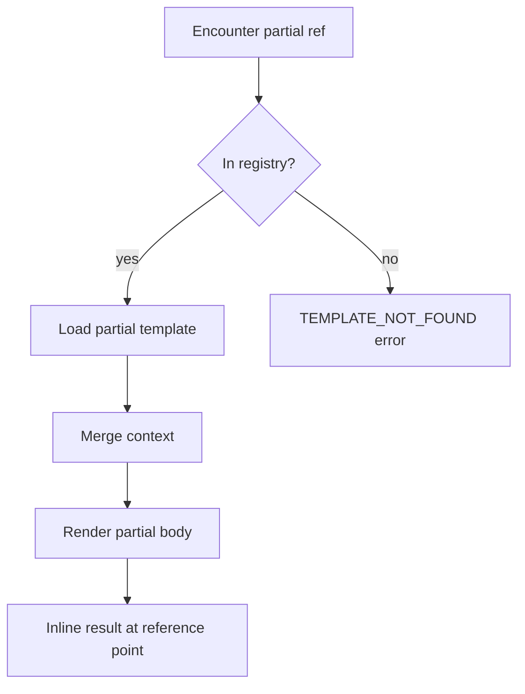

### Example: Shared Imports Partial

**Partial:** `shared/nestjs-imports`

```
import { Injectable{{#if includeGuard}}, CanActivate{{/if}} } from '@nestjs/common';
{{#if includeRepository}}
import { InjectRepository } from '@nestjs/typeorm';
import { Repository } from 'typeorm';
{{/if}}
```

**Parent template:**

```
{{> shared/nestjs-imports }}

@Injectable()
export class {{ moduleName | pascalCase }}Service { }
```

---

## Template Inheritance

Template inheritance allows child templates to override specific blocks of a parent template.

### Inheritance Syntax

**Parent template** (`backend/base-service`):

```yaml
---
id: backend/base-service
version: 1.0.0
name: base-service
partial: true
variables:
  - name: moduleName
    type: string
    required: true
---

{{#block "imports"}}
// Default imports
{{/block}}

{{#block "classDeclaration"}}
export class BaseService { }
{{/block}}

{{#block "exports"}}
export { {{ moduleName | pascalCase }}Service };
{{/block}}
```

**Child template:**

```
{{#extends "backend/base-service"}}

{{#block "imports"}}
import { Injectable } from '@nestjs/common';
{{/block}}

{{#block "classDeclaration"}}
@Injectable()
export class {{ moduleName | pascalCase }}Service {
  findAll() { return []; }
}
{{/block}}

{{/extends}}
```

### Inheritance Rules

| Rule | Description |
|------|-------------|
| I1 | Child declares `extends` in frontmatter metadata |
| I2 | Child body uses `{{#extends}}` / `{{/extends}}` directives |
| I3 | Child overrides parent blocks with `{{#block "name"}}` |
| I4 | Non-overridden blocks inherit parent content |
| I5 | Inheritance chain depth maximum: 5 levels |
| I6 | Circular inheritance is rejected at validation time |
| I7 | Child version is independent of parent version |

### Inheritance Resolution

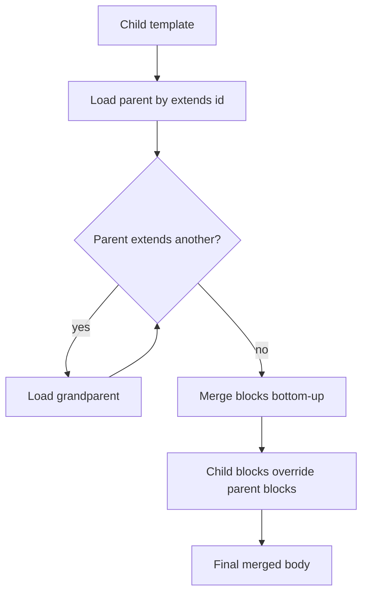

### Block Super Reference

Child blocks can include parent content:

```
{{#block "imports"}}
{{> super }}
import { Injectable } from '@nestjs/common';
{{/block}}
```

---

## Validation

Validation occurs in three phases: **metadata**, **syntax**, and **context**.

### Validation Pipeline

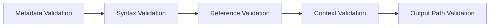

### Metadata Validation

| Rule | Error Code |
|------|------------|
| Frontmatter is valid YAML | `INVALID_FRONTMATTER` |
| Required fields present (`id`, `version`, `name`, `variables`, `output`) | `INVALID_METADATA` |
| `version` is valid semver | `INVALID_VERSION` |
| Variable types are valid enum values | `INVALID_VARIABLE_TYPE` |
| `extends` references a known template id | `PARENT_NOT_FOUND` |
| `output` is a non-empty string | `INVALID_OUTPUT` |
| Non-partial templates must have non-empty `output` | `INVALID_OUTPUT` |

### Syntax Validation

| Rule | Error Code |
|------|------------|
| All `{{#if}}` have matching `{{/if}}` | `UNMATCHED_DIRECTIVE` |
| All `{{#each}}` have matching `{{/each}}` | `UNMATCHED_DIRECTIVE` |
| All `{{#block}}` have matching `{{/block}}` | `UNMATCHED_DIRECTIVE` |
| All `{{#extends}}` have matching `{{/extends}}` | `UNMATCHED_DIRECTIVE` |
| No unrecognized directives | `UNKNOWN_DIRECTIVE` |
| Expressions are syntactically valid | `SYNTAX_ERROR` |
| Helper names exist in registry | `UNKNOWN_HELPER` |

### Reference Validation

| Rule | Error Code |
|------|------------|
| Partial references resolve to existing templates | `PARTIAL_NOT_FOUND` |
| No circular partial inclusion | `CIRCULAR_PARTIAL` |
| No circular inheritance | `CIRCULAR_INHERITANCE` |
| Inheritance depth ≤ 5 | `INHERITANCE_DEPTH_EXCEEDED` |
| Partial depth ≤ 10 | `PARTIAL_DEPTH_EXCEEDED` |

### Context Validation

| Rule | Error Code |
|------|------------|
| All required variables provided | `MISSING_VARIABLE` |
| Variable types match declarations | `TYPE_MISMATCH` |
| Enum values are within allowed set | `INVALID_ENUM_VALUE` |
| No undeclared variables in strict mode | `UNDECLARED_VARIABLE` |

### Output Path Validation

| Rule | Error Code |
|------|------------|
| Output path resolves to non-empty string | `UNRESOLVED_OUTPUT_PATH` |
| Output path contains no `..` segments (path traversal) | `UNSAFE_OUTPUT_PATH` |
| Output path is relative (no absolute paths) | `ABSOLUTE_OUTPUT_PATH` |

### Validation Modes

| Mode | Behavior |
|------|----------|
| `strict` | All rules enforced; undeclared variables are errors |
| `lenient` | Undeclared variables produce warnings (default for discovery) |
| `syntax-only` | Metadata and syntax only; no context required |

---

## Template Discovery

Template discovery finds and indexes available templates from multiple sources.

### Discovery Sources

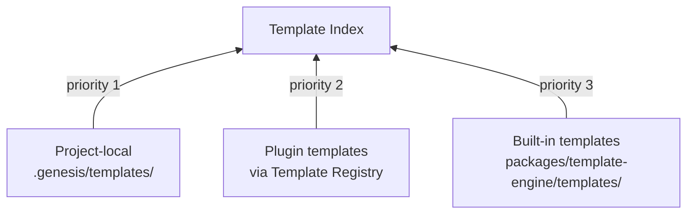

| Priority | Source | Path | Description |
|----------|--------|------|-------------|
| 1 (highest) | Project-local | `.genesis/templates/` | User overrides |
| 2 | Plugin | Registered via kernel | Technology-specific templates |
| 3 (lowest) | Built-in | `packages/template-engine/templates/` | Framework defaults |

### Discovery Process

| Step | Action |
|------|--------|
| 1 | Scan each source directory recursively |
| 2 | Identify template files by `.genesis` extension or `template.genesis` suffix |
| 3 | Parse frontmatter to extract metadata |
| 4 | Index by `id`, `name`, `category`, and `tags` |
| 5 | Resolve duplicates by priority (higher priority wins) |
| 6 | Log overridden templates at `debug` level |

### File Naming Conventions

| Pattern | Example | Description |
|---------|---------|-------------|
| `{name}.genesis` | `module-service.genesis` | Standard template file |
| `{name}.partial.genesis` | `license-header.partial.genesis` | Partial template |
| `{category}/{name}.genesis` | `backend/module-service.genesis` | Categorized template |

### Template Descriptor

Returned by discovery for each template:

| Field | Type | Description |
|-------|------|-------------|
| `id` | string | Unique identifier |
| `version` | string | Semver version |
| `name` | string | Short name |
| `description` | string | Summary |
| `category` | string | Category |
| `tags` | string[] | Tags |
| `source` | enum | `builtin`, `plugin`, `project` |
| `sourcePath` | string | Filesystem path |
| `partial` | boolean | Is partial |
| `deprecated` | boolean | Is deprecated |
| `variables` | VariableDefinition[] | Declared variables |

### Discovery API

| Operation | Input | Output |
|-----------|-------|--------|
| `discover(options)` | search paths, filters | TemplateDescriptor[] |
| `findById(id)` | template id | TemplateDescriptor |
| `findByName(name)` | template name | TemplateDescriptor[] |
| `findByCategory(category)` | category string | TemplateDescriptor[] |
| `findByTag(tag)` | tag string | TemplateDescriptor[] |
| `listCategories()` | — | string[] |

### Example: Discovery Result

```
Template Discovery Report
─────────────────────────
Sources scanned: 3
Templates found:  47
Duplicates resolved: 2

Categories:
  backend     (12 templates)
  unity       (18 templates)
  docs        (8 templates)
  config      (5 templates)
  shared      (4 templates)
```

---

## Template Versioning

Templates use semantic versioning to communicate compatibility and breaking changes.

### Version Format

```
MAJOR.MINOR.PATCH
```

| Bump | When |
|------|------|
| MAJOR | Breaking change: removed variable, changed output path, renamed id |
| MINOR | New optional variable, new block in inheritance, new helper usage |
| PATCH | Typo fix, comment change, whitespace adjustment |

### Version Constraints

Consumers specify acceptable versions:

| Constraint | Meaning |
|------------|---------|
| `1.0.0` | Exact version |
| `^1.0.0` | Compatible with 1.x (≥1.0.0, <2.0.0) |
| `~1.2.0` | Patch-level changes (≥1.2.0, <1.3.0) |
| `>=1.0.0 <2.0.0` | Explicit range |

### Deprecation

Deprecated templates include:

```yaml
deprecated: true
replacedBy: backend/module-service-v2
```

| Behavior | Description |
|----------|-------------|
| Discovery | Deprecated templates appear with a warning flag |
| Rendering | Deprecated templates still render but log a warning |
| Validation | `strict` mode treats deprecated templates as warnings |

### Version Resolution

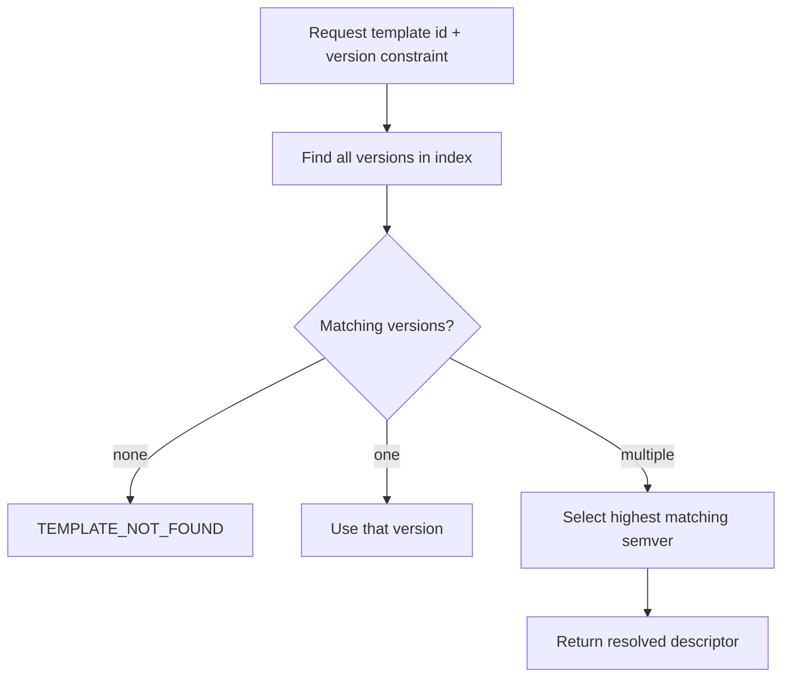

### Changelog Requirement

Templates with version ≥ `1.0.0` should include a changelog entry in the template directory:

```
templates/backend/
├── module-service.genesis
└── CHANGELOG.md          # Version history for this category
```

---

## Template Testing

Every production template must have corresponding tests.

### Test Structure

```
tests/
├── fixtures/
│   ├── contexts/
│   │   ├── default-module.json       # Standard render context
│   │   └── module-without-tests.json
│   └── expected/
│       ├── module-service.ts         # Expected rendered output
│       └── module-service-no-tests.ts
└── templates/
    └── backend/
        └── module-service.test.genesis   # Template test definition
```

### Template Test Definition

Template tests use a `.test.genesis` file:

```yaml
---
id: test/backend/module-service
description: Verify module-service template renders correctly
template: backend/module-service
version: ^1.0.0
cases:
  - name: with tests
    context: fixtures/contexts/default-module.json
    expected: fixtures/expected/module-service.ts
    outputPolicy: dry-run

  - name: without tests
    context: fixtures/contexts/module-without-tests.json
    expected: fixtures/expected/module-service-no-tests.ts
    outputPolicy: dry-run

  - name: missing required variable
    context: {}
    expectError: MISSING_VARIABLE
---
```

### Test Case Schema

| Field | Required | Description |
|-------|----------|-------------|
| `name` | yes | Test case identifier |
| `context` | conditional | Path to context fixture or inline object |
| `expected` | conditional | Path to expected output file |
| `expectError` | conditional | Expected error code (mutually exclusive with `expected`) |
| `outputPolicy` | no | Default `dry-run` for tests |

### Test Categories

| Category | What It Tests |
|----------|---------------|
| **Render tests** | Context → expected output matches |
| **Error tests** | Invalid context → expected error code |
| **Snapshot tests** | Output matches committed snapshot |
| **Validation tests** | Template metadata and syntax are valid |
| **Inheritance tests** | Child + parent render correctly |
| **Partial tests** | Partial inclusion produces expected composition |

### Test Execution Flow

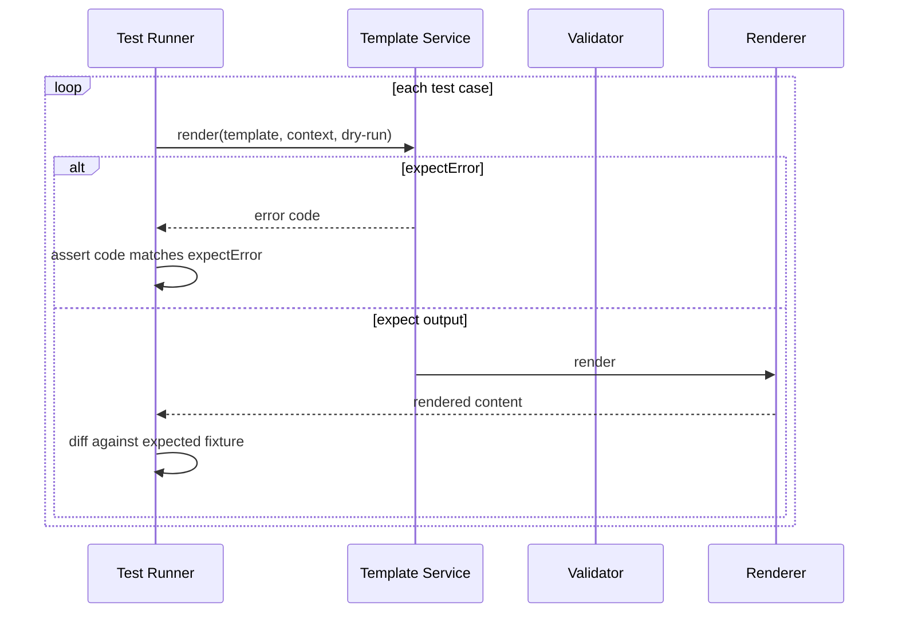

### Test Rules

| Rule | Description |
|------|-------------|
| T1 | Every non-partial template has at least one render test |
| T2 | Every required variable has a missing-variable error test |
| T3 | Expected fixtures are committed to version control |
| T4 | Snapshot updates require explicit review (not auto-committed) |
| T5 | Template tests run in CI on every pull request |

### Example: Fixture Context

**`fixtures/contexts/default-module.json`:**

```json
{
  "moduleName": "user-service",
  "includeTests": true,
  "methods": [
    {
      "name": "findAll",
      "params": "",
      "returnType": "User[]",
      "description": "Retrieve all users"
    },
    {
      "name": "findOne",
      "params": "id: string",
      "returnType": "User",
      "description": "Retrieve user by ID"
    }
  ]
}
```

---

## Error Handling

### Error Hierarchy

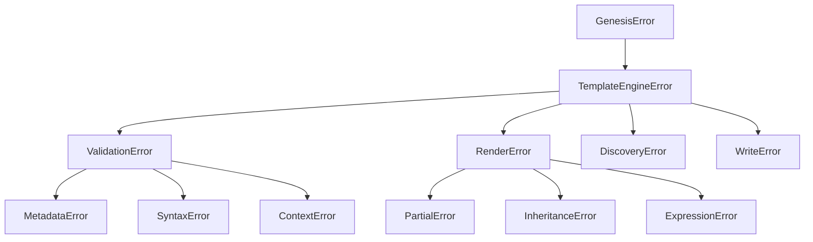

### Error Catalog

| Code | Category | Description | Recoverable |
|------|----------|-------------|-------------|
| `TEMPLATE_NOT_FOUND` | Discovery | No template matches id/version | no |
| `TEMPLATE_LOAD_ERROR` | Discovery | File read failure | no |
| `INVALID_FRONTMATTER` | Validation | YAML parse error in header | no |
| `INVALID_METADATA` | Validation | Missing or invalid metadata fields | no |
| `INVALID_VERSION` | Validation | Version string is not valid semver | no |
| `SYNTAX_ERROR` | Validation | Template body syntax error | no |
| `UNMATCHED_DIRECTIVE` | Validation | Unclosed `{{#if}}`, `{{#each}}`, etc. | no |
| `UNKNOWN_DIRECTIVE` | Validation | Unrecognized template directive | no |
| `UNKNOWN_HELPER` | Validation | Helper not in registry | no |
| `MISSING_VARIABLE` | Context | Required variable not in context | no |
| `TYPE_MISMATCH` | Context | Variable type does not match declaration | no |
| `INVALID_ENUM_VALUE` | Context | Value not in allowed enum set | no |
| `PARTIAL_NOT_FOUND` | Reference | Partial template does not exist | no |
| `CIRCULAR_PARTIAL` | Reference | Circular partial inclusion detected | no |
| `CIRCULAR_INHERITANCE` | Reference | Circular inheritance detected | no |
| `INHERITANCE_DEPTH_EXCEEDED` | Reference | Inheritance chain > 5 levels | no |
| `PARTIAL_DEPTH_EXCEEDED` | Reference | Partial nesting > 10 levels | no |
| `PARENT_NOT_FOUND` | Reference | `extends` parent does not exist | no |
| `UNRESOLVED_OUTPUT_PATH` | Output | Output path still contains `{{ }}` after render | no |
| `UNSAFE_OUTPUT_PATH` | Output | Path traversal detected (`..`) | no |
| `ABSOLUTE_OUTPUT_PATH` | Output | Absolute path not allowed | no |
| `RENDER_ERROR` | Render | General rendering failure | no |
| `EXPRESSION_ERROR` | Render | Expression evaluation failure | no |
| `WRITE_ERROR` | Write | Filesystem write failure | yes |
| `DEPRECATED_TEMPLATE` | Warning | Template is deprecated | yes |

### Error Contract

Every error includes:

| Field | Description |
|-------|-------------|
| `code` | Machine-readable error code |
| `message` | Human-readable description |
| `templateId` | Template that caused the error |
| `templateVersion` | Version of the template |
| `line` | Line number in template body (when applicable) |
| `column` | Column number (when applicable) |
| `variable` | Variable name (for context errors) |
| `path` | Output path (for write errors) |
| `details` | Additional structured context |

### Error Message Format

```
Template Error [MISSING_VARIABLE]
─────────────────────────────────
Template:  backend/module-service v1.0.0
Variable:  moduleName
Message:   Required variable "moduleName" is not provided in render context.

Provide moduleName in the render context or set a default in template metadata.
```

### Batch Error Handling

| Policy | Behavior |
|--------|----------|
| `stopOnError` (default) | Abort batch on first error; return partial results + error |
| `continueOnError` | Collect all errors; return full results at end |
| `skipOnError` | Skip failed template; continue with remaining |

---

## Output Policies

| Policy | Behavior | Default |
|--------|----------|---------|
| `skip` | Do not write if file exists | yes |
| `overwrite` | Replace existing file | no |
| `dry-run` | Validate and return content without writing | no |
| `merge` | Merge with existing file (Phase 2) | no |

### Write Result

| Field | Description |
|-------|-------------|
| `path` | Output file path |
| `action` | `created`, `skipped`, `overwritten`, `dry-run` |
| `size` | Content size in bytes |

---

## Public API

### Template Service

| Method | Description |
|--------|-------------|
| `render(request)` | Render a single template |
| `renderBatch(requests, options)` | Render multiple templates |
| `validate(templateId, context?, mode?)` | Validate without rendering |
| `discover(options?)` | Discover and index templates |
| `preview(templateId, context)` | Render to string without writing |
| `registerHelper(helper)` | Register a custom helper |
| `getTemplate(id, version?)` | Get template descriptor |

### Template Registry

| Method | Description |
|--------|-------------|
| `register(descriptor, source)` | Add template to registry |
| `unregister(id)` | Remove template from registry |
| `resolve(id, version?)` | Find template by id and version |
| `list(filter?)` | List templates with optional filter |

---

## Extension Points

| Extension | Mechanism | Registered By |
|-----------|-----------|---------------|
| Templates | Template Registry | Plugins, project-local |
| Helpers | Helper Registry | Plugins, built-in |
| Output policies | Policy handler | Engine core (merge in Phase 2) |
| Validation rules | Validator plugins | Plugins (Phase 2) |
| File naming | Discovery pattern config | Project config |

---

## Related Documents

| Document | Relationship |
|----------|-------------|
| [README.md](README.md) | Parent specification overview |
| [004-scaffolding](../004-scaffolding/) | Primary consumer |
| [003-plugin-system](../003-plugin-system/) | Plugin template registration |
| [001-cli/FUNCTIONAL_SPEC.md](../001-cli/FUNCTIONAL_SPEC.md) | CLI preview command |
| [standards/NAMING_STANDARD.md](../../standards/NAMING_STANDARD.md) | Naming helpers |
| [DECISION_LOG.md](../../DECISION_LOG.md) | ADR-001, ADR-002 |

## Changelog

| Version | Date | Change |
|---------|------|--------|
| 1.0.0 | 2026-07-26 | Initial functional specification |
