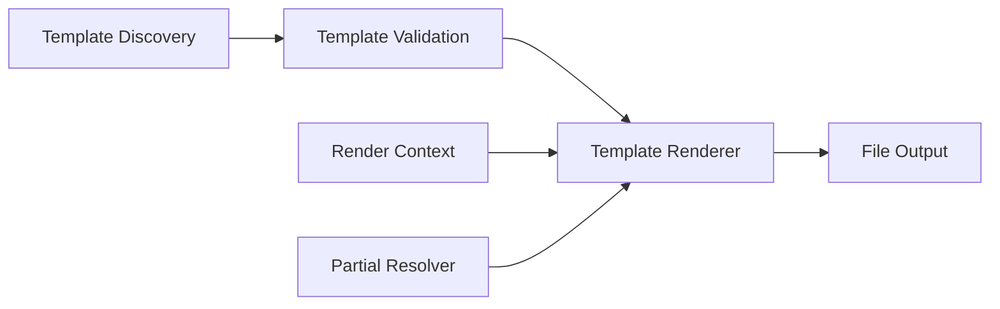

# Template Engine Specification

## Purpose

Define the template engine responsible for discovering, validating, and rendering file templates with variable substitution. The template engine is the foundation for all code and document generation in Project Genesis.

## Documents

| Document | Description |
|----------|-------------|
| [FUNCTIONAL_SPEC.md](FUNCTIONAL_SPEC.md) | **Complete functional specification** — architecture, rendering pipeline, variables, expressions, helpers, validation, discovery, versioning, inheritance, testing |
| This document | Overview, responsibilities, and implementation roadmap |

## Scope

### In Scope

- Template discovery from local directories and plugin packages
- Variable substitution and conditional rendering
- Template validation (syntax, required variables, output paths)
- File output with directory creation and overwrite policies
- Template metadata (name, description, variables, output path)
- Support for partial templates and template inheritance

### Out of Scope

- Project-level orchestration (owned by [004-scaffolding](../004-scaffolding/))
- Authoring scaffolds in repository `templates/` directory (those are human/AI document templates, not runtime templates)
- Unity-specific asset generation (owned by [008-unity](../008-unity/))
- Database schema migration generation (owned by [007-backend](../007-backend/))

## Goals

| Goal | Success Criteria |
|------|------------------|
| **Deterministic** | Same template + variables always produce identical output |
| **Validated** | Invalid templates fail before rendering with clear errors |
| **Composable** | Templates can include partials and extend base templates |
| **Plugin-aware** | Plugins contribute templates without modifying core engine |
| **Testable** | Rendering testable with in-memory filesystem |
| **Performant** | Render 100-file template set in under 2 seconds |

## Responsibilities

### Core Components



| Component | Layer | Responsibility |
|-----------|-------|----------------|
| `TemplateDiscovery` | Application | Find templates by name, category, or plugin |
| `TemplateValidator` | Domain | Validate syntax, variables, and metadata |
| `TemplateRenderer` | Domain | Substitute variables and produce rendered content |
| `PartialResolver` | Domain | Resolve and compose partial templates |
| `FileOutputWriter` | Infrastructure | Write rendered content to filesystem |
| `RenderContext` | Application | Variables, flags, and metadata for a render pass |

### Template Format

Templates use a file-based format with metadata headers:

```
---
name: module-service
description: NestJS service module
variables:
  - name: moduleName
    type: string
    required: true
  - name: includeTests
    type: boolean
    default: true
output: "src/{{moduleName}}/{{moduleName}}.service.ts"
---

export class {{moduleName | pascalCase}}Service {
  // generated content
}
```

### Variable System

| Feature | Description |
|---------|-------------|
| Substitution | `{{variableName}}` replaced with context value |
| Filters | `{{name \| pascalCase}}`, `{{name \| kebabCase}}`, `{{name \| camelCase}}` |
| Conditionals | `{{#if includeTests}}...{{/if}}` |
| Loops | `{{#each items}}...{{/each}}` |
| Partials | `{{> partial-name}}` includes another template |
| Defaults | Variables with `default` in metadata are optional |

### Naming Filters

Aligned with [standards/NAMING_STANDARD.md](../../standards/NAMING_STANDARD.md):

| Filter | Input | Output |
|--------|-------|--------|
| `pascalCase` | `user-service` | `UserService` |
| `camelCase` | `user-service` | `userService` |
| `kebabCase` | `UserService` | `user-service` |
| `snakeCase` | `UserService` | `user_service` |
| `upperCase` | `version` | `VERSION` |

### Discovery Rules

Templates are discovered from:

1. `packages/template-engine/templates/` — built-in templates
2. Plugin template directories — registered via [003-plugin-system](../003-plugin-system/)
3. Project-local `.genesis/templates/` — user overrides (Phase 2)

Discovery returns a `TemplateDescriptor` with metadata. Duplicate names resolve by priority: project-local > plugin > built-in.

### Validation Rules

| Rule | Error if Violated |
|------|-------------------|
| Metadata header is valid YAML | `INVALID_METADATA` |
| All required variables provided in context | `MISSING_VARIABLE` |
| Output path contains no unresolved variables | `UNRESOLVED_OUTPUT_PATH` |
| Partial references resolve to existing templates | `PARTIAL_NOT_FOUND` |
| No circular partial inclusion | `CIRCULAR_PARTIAL` |

### Output Policies

| Policy | Behavior |
|--------|----------|
| `skip` | Do not overwrite existing files (default) |
| `overwrite` | Replace existing files |
| `merge` | Merge with existing file (Phase 2) |
| `dry-run` | Report what would be written without writing |

## Dependencies

### Upstream Specifications

| Spec | Dependency |
|------|------------|
| [000-project](../000-project/) | Layer rules, naming conventions |
| [001-cli](../001-cli/) | Invoked indirectly via scaffolding |

### Packages

| Package | Usage |
|---------|-------|
| `@genesis/core` | Filesystem abstraction, logging |
| `@genesis/shared` | Types, naming utilities |

### Downstream Consumers

| Spec | Relationship |
|------|-------------|
| [004-scaffolding](../004-scaffolding/) | Primary consumer — orchestrates multi-template renders |
| [007-backend](../007-backend/) | Contributes backend templates |
| [008-unity](../008-unity/) | Contributes Unity templates |
| [006-game-generation](../006-game-generation/) | Uses scaffolding which uses template engine |

## Future Implementation

### Sprint 3 — Core Engine

- Create `packages/template-engine` (rename from `packages/templates` scaffold)
- Implement `TemplateDiscovery` scanning a directory tree
- Implement `TemplateRenderer` with variable substitution and filters
- Implement `TemplateValidator` with required variable checks
- Implement `FileOutputWriter` with `skip` and `overwrite` policies
- Unit tests: render single template, validate missing variables, filter application

### Sprint 3 — Partials and Conditionals

- Implement partial resolution and inclusion
- Implement `{{#if}}` and `{{#each}}` conditionals
- Unit tests: partial composition, conditional branches

### Phase 2 — Plugin Templates

- Plugin template registration via kernel
- Template priority resolution (project > plugin > built-in)
- `dry-run` output policy

### Phase 3 — Advanced Features

- Template inheritance (`extends` directive)
- `merge` output policy for existing files
- Template preview command: `genesis template preview <name>`

## Related Documents

- [FUNCTIONAL_SPEC.md](FUNCTIONAL_SPEC.md) — Complete functional specification
- [004-scaffolding](../004-scaffolding/) — Uses template engine for generation
- [003-plugin-system](../003-plugin-system/) — Plugin template registration
- [templates/](../../templates/) — Authoring scaffolds (not runtime templates)

## Changelog

| Version | Date | Change |
|---------|------|--------|
| 1.0.1 | 2026-07-26 | Linked FUNCTIONAL_SPEC.md |
| 1.0.0 | 2026-07-26 | Initial approved specification |
