# Genesis Plugin System — Functional Specification

## Document Control

| Field | Value |
|-------|-------|
| **Specification** | [003-plugin-system](README.md) |
| **Status** | Approved |
| **Version** | 1.0.0 |
| **Independence** | Implementation-independent. No language, module loader, or sandbox technology is prescribed. |
| **Audience** | Kernel engineers, plugin authors, AI assistants, security reviewers |

## Purpose

Define the complete functional behavior of the **Genesis Plugin System** — the extensibility layer that allows Project Genesis to support Unity, NestJS, AWS, Firebase, AI providers, and future technologies without coupling the core kernel to any specific stack. This specification describes plugin discovery, registration, loading, unloading, capability contribution, lifecycle management, security, and sandboxing.

## Scope

### In Scope

- Plugin architecture and kernel component model
- Dynamic plugin discovery, loading, and unloading
- Capability types: commands, templates, generators, validators, AI providers, hooks, lifecycle events
- Plugin registration and registry contracts
- Plugin manifest and runtime metadata
- Dependency resolution and load ordering
- Versioning and compatibility validation
- Security model and permission declarations
- Sandboxing policy for untrusted plugins
- Error isolation and failure behavior
- Public API contracts for plugin authors and kernel consumers
- Examples and test requirements

### Out of Scope

- Individual plugin implementations ([007-backend](../007-backend/), [008-unity](../008-unity/), [005-ai-engine](../005-ai-engine/))
- CLI command parsing and dispatch ([001-cli](../001-cli/))
- Template rendering mechanics ([002-template-engine](../002-template-engine/))
- Scaffolding orchestration ([004-scaffolding](../004-scaffolding/))
- Remote plugin marketplace or installation (future)
- Hot-reloading plugins in a running process (future)
- Unreal Engine plugin (future consideration)

---

## Goals

| ID | Goal | Success Criteria |
|----|------|------------------|
| G1 | **Decoupled** | Kernel has zero imports from plugin packages |
| G2 | **Dynamic** | Plugins discovered and loaded at runtime without recompiling the kernel |
| G3 | **Stable contract** | Plugin API versioned; breaking changes require major bump |
| G4 | **Isolated** | Plugin failure does not crash kernel or other plugins |
| G5 | **Discoverable** | All loaded plugins listed via `genesis plugin list` |
| G6 | **Composable** | Plugins contribute capabilities through registries, not direct coupling |
| G7 | **Secure** | Plugins operate within declared permissions; secrets never exposed |
| G8 | **Testable** | Plugins testable with mock kernel in isolation |
| G9 | **Observable** | Load, unload, and capability registration emit structured events |

### Design Principles

1. **Kernel owns the contract** — Plugins implement `GenesisPlugin`; the kernel never adapts to plugin internals.
2. **Register, don't import** — Capabilities are registered at load time; consumers resolve by name.
3. **Fail contained** — A broken plugin is skipped; the framework continues.
4. **Explicit permissions** — Plugins declare what they need; undeclared access is denied.
5. **Events notify, hooks intercept** — Lifecycle events are observability; hooks are extension points.
6. **No plugin-to-plugin imports** — Plugins interact only through kernel registries.
7. **Deterministic load order** — Dependency resolution produces a stable topological order.

---

## Architecture

### System Overview

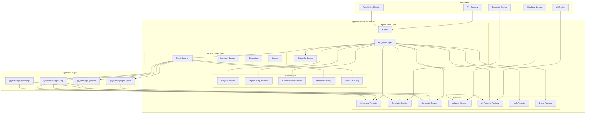

### Layer Responsibilities

| Layer | Components | Responsibility |
|-------|------------|----------------|
| **Application** | Kernel, Plugin Manager, Lifecycle Runner | Orchestrate discovery, load, register, unload |
| **Domain** | Plugin Resolver, Dependency Resolver, Compatibility Validator, Permission Policy, Sandbox Policy | Pure rules for ordering, validation, and access control |
| **Infrastructure** | Plugin Loader, Manifest Reader, Filesystem, Logger | I/O, module loading, structured logging |
| **Registries** | Command, Template, Generator, Validator, AI Provider, Hook, Event | Capability storage and lookup |

### Component Model

| Component | Responsibility |
|-----------|----------------|
| **Kernel** | Public entry point; exposes registries and plugin manager to consumers |
| **Plugin Manager** | Discover, validate, load, unload, and list plugins |
| **Plugin Loader** | Load plugin entry point; invoke lifecycle methods |
| **Manifest Reader** | Read and parse `genesis.plugin.json` from plugin package root |
| **Plugin Resolver** | Map search paths to candidate plugin directories |
| **Dependency Resolver** | Compute load order from declared dependencies |
| **Compatibility Validator** | Verify manifest, version range, and capability declarations |
| **Permission Policy** | Enforce declared permissions at capability registration and runtime |
| **Sandbox Policy** | Apply isolation rules based on plugin trust level |
| **Lifecycle Runner** | Emit lifecycle events and execute lifecycle hooks in order |
| **Registries** | Store capability definitions contributed by plugins |

### Relationship to Other Systems

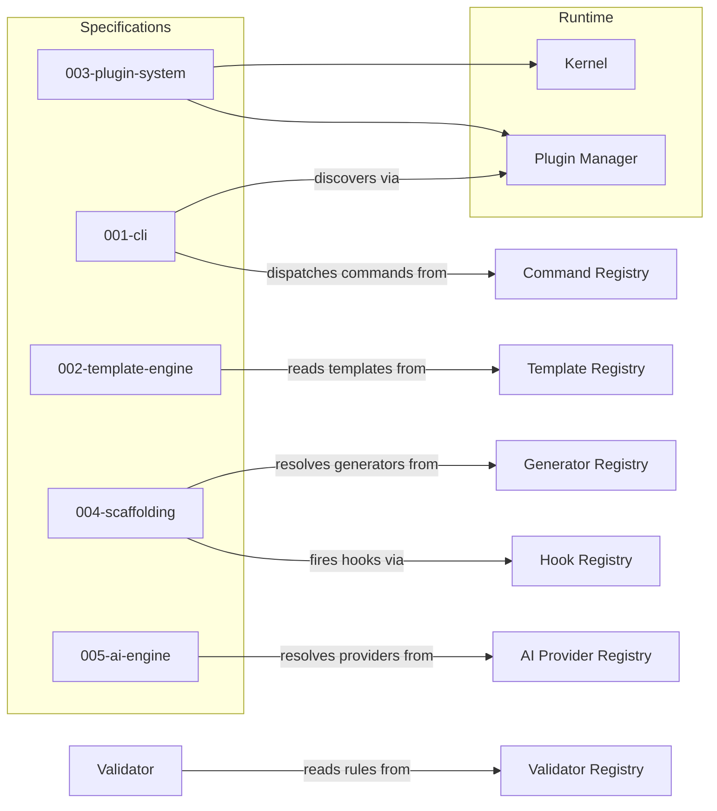

| System | Plugin System Responsibility | Consumer Responsibility |
|--------|------------------------------|-------------------------|
| CLI | Load plugins; register commands | Dispatch commands; surface `genesis plugin` |
| Template Engine | Register plugin templates | Discover and render by template id |
| Scaffolding | Register generators; fire hooks | Build generation plan; invoke generators |
| AI Engine | Register AI providers | Resolve provider by name; route requests |
| Validator | Register validation rules | Run rule sets against generated output |

---

## Plugin Model

### GenesisPlugin Contract

Every plugin implements the `GenesisPlugin` interface. The contract is versioned independently of individual plugin versions.

| Property / Method | Type | Required | Description |
|-------------------|------|----------|-------------|
| `name` | `string` | yes | Unique identifier (e.g., `@genesis/plugin-unity`) |
| `version` | `string` | yes | Plugin semantic version |
| `apiVersion` | `string` | yes | Genesis Plugin API version the plugin targets |
| `description` | `string` | yes | Human-readable summary |
| `capabilities` | `PluginCapability[]` | yes | Capability types this plugin contributes |
| `onLoad(ctx)` | `async` | yes | Called after entry point loaded; receives `PluginContext` |
| `onUnload()` | `async` | yes | Called before plugin removed; release resources |
| `register(registries)` | `void` | yes | Register commands, templates, generators, validators, providers, hooks |

### PluginCapability Enum

| Capability | Registry | Description |
|------------|----------|-------------|
| `command` | Command Registry | CLI commands |
| `template` | Template Registry | `.genesis` templates |
| `generator` | Generator Registry | Scaffolding generators |
| `validator` | Validator Registry | Post-generation validation rules |
| `ai-provider` | AI Provider Registry | LLM and embedding providers |
| `hook` | Hook Registry | Lifecycle interception points |
| `event` | Event Registry | Lifecycle event subscriptions |

A plugin may declare multiple capabilities. The kernel validates that `register()` only touches registries matching declared capabilities.

### Plugin Trust Levels

| Level | Source | Sandboxing | Default Permissions |
|-------|--------|------------|---------------------|
| `trusted` | `@genesis/plugin-*` official packages | Minimal | Filesystem read, config read, subprocess (declared) |
| `local` | Monorepo `packages/plugins/` | Standard | Filesystem read/write within project, config read |
| `untrusted` | User-installed third-party | Strict | Filesystem read only (declared paths), no network |

Trust level is derived from plugin source and manifest `trust` field (cannot elevate above source maximum).

### Dynamic Plugins

Plugins are **dynamic** — loaded at runtime when the kernel initializes, not compiled into the kernel.

| Property | Behavior |
|----------|----------|
| Discovery | Scan configured search paths for `genesis.plugin.json` |
| Activation | Enabled plugins from config are loaded; others discovered but not loaded |
| Entry point | Manifest `main` field resolves plugin module |
| Registration | `register()` called once per load; capabilities immutable until unload |
| Idempotency | Loading an already-loaded plugin is a no-op with warning |
| Concurrency | Single-threaded load/unload; no parallel plugin operations |

---

## Plugin Manifest

Each plugin package includes a manifest file at its root: `genesis.plugin.json`.

### Manifest Schema

| Field | Type | Required | Description |
|-------|------|----------|-------------|
| `name` | `string` | yes | Unique plugin identifier (`@genesis/plugin-unity`) |
| `version` | `string` | yes | Semantic version (semver) |
| `apiVersion` | `string` | yes | Genesis Plugin API version (e.g., `1.x`) |
| `genesisVersion` | `string` | yes | Compatible Genesis framework version range |
| `description` | `string` | yes | Human-readable summary |
| `main` | `string` | yes | Entry point relative to package root |
| `capabilities` | `string[]` | yes | Declared capability types |
| `dependencies` | `object` | no | Map of plugin name → version range |
| `permissions` | `string[]` | no | Declared permission grants (see Security) |
| `configSchema` | `object` | no | JSON Schema for plugin-specific config |
| `trust` | `enum` | no | `trusted`, `local`, `untrusted` (cannot exceed source max) |
| `author` | `string` | no | Plugin author or organization |
| `homepage` | `string` | no | Documentation URL |
| `keywords` | `string[]` | no | Discovery tags |
| `templates` | `string` | no | Path to bundled templates directory |
| `generators` | `string` | no | Path to generator definitions directory |

### Manifest Example — Unity Plugin

```json
{
  "name": "@genesis/plugin-unity",
  "version": "1.2.0",
  "apiVersion": "1.x",
  "genesisVersion": "^1.0.0",
  "description": "Unity game engine integration for Project Genesis",
  "main": "./dist/index.js",
  "capabilities": ["command", "template", "generator", "validator", "hook"],
  "dependencies": {},
  "permissions": [
    "filesystem:read",
    "filesystem:write:project",
    "config:read"
  ],
  "configSchema": {
    "type": "object",
    "properties": {
      "unityVersion": { "type": "string", "default": "2022.3" },
      "defaultRenderPipeline": {
        "type": "string",
        "enum": ["built-in", "urp", "hdrp"],
        "default": "urp"
      }
    }
  },
  "trust": "trusted",
  "author": "Project Genesis",
  "homepage": "https://github.com/project-genesis/plugin-unity",
  "keywords": ["unity", "game", "csharp"],
  "templates": "./templates",
  "generators": "./generators"
}
```

### Manifest Example — OpenAI Provider Plugin

```json
{
  "name": "@genesis/plugin-openai",
  "version": "0.1.0",
  "apiVersion": "1.x",
  "genesisVersion": "^1.0.0",
  "description": "OpenAI LLM provider for Genesis AI engine",
  "main": "./dist/index.js",
  "capabilities": ["ai-provider", "hook"],
  "permissions": [
    "network:api.openai.com",
    "config:read",
    "env:read:OPENAI_API_KEY"
  ],
  "configSchema": {
    "type": "object",
    "properties": {
      "model": { "type": "string", "default": "gpt-4" },
      "maxTokens": { "type": "integer", "default": 4096 },
      "temperature": { "type": "number", "default": 0.7 }
    },
    "required": ["model"]
  },
  "trust": "trusted",
  "author": "Project Genesis"
}
```

### Manifest Validation Rules

| Rule | Error Code | Description |
|------|------------|-------------|
| M1 | `MANIFEST_NOT_FOUND` | `genesis.plugin.json` missing from plugin root |
| M2 | `MANIFEST_PARSE_ERROR` | Manifest is not valid JSON |
| M3 | `MANIFEST_MISSING_FIELD` | Required field absent |
| M4 | `MANIFEST_INVALID_NAME` | Name does not match `@scope/plugin-name` pattern |
| M5 | `MANIFEST_INVALID_VERSION` | `version` is not valid semver |
| M6 | `MANIFEST_INVALID_CAPABILITY` | Unknown capability in `capabilities` array |
| M7 | `MANIFEST_INVALID_PERMISSION` | Unknown permission identifier |
| M8 | `MANIFEST_TRUST_ESCALATION` | `trust` exceeds source maximum |
| M9 | `MANIFEST_ENTRY_NOT_FOUND` | `main` entry point file does not exist |

---

## Plugin Metadata

Manifest data is static (read from disk). Runtime metadata is assembled when a plugin loads.

### PluginInfo (Runtime)

| Field | Type | Source | Description |
|-------|------|--------|-------------|
| `name` | `string` | manifest | Plugin identifier |
| `version` | `string` | manifest | Plugin version |
| `apiVersion` | `string` | manifest | Plugin API version |
| `genesisVersion` | `string` | manifest | Framework compatibility range |
| `description` | `string` | manifest | Summary |
| `capabilities` | `string[]` | manifest | Declared capabilities |
| `trust` | `string` | derived | Effective trust level |
| `path` | `string` | discovery | Absolute path to plugin root |
| `state` | `enum` | runtime | `discovered`, `loaded`, `failed`, `unloaded` |
| `loadedAt` | `ISO8601` | runtime | Load timestamp |
| `registeredCapabilities` | `object` | runtime | Count per registry (e.g., `{ command: 3, template: 12 }`) |
| `dependencies` | `string[]` | manifest | Resolved dependency names |
| `dependents` | `string[]` | runtime | Plugins that depend on this plugin |
| `errors` | `PluginError[]` | runtime | Load or registration errors |

### PluginContext (Passed to onLoad)

| Field | Type | Description |
|-------|------|-------------|
| `config` | `Configuration` | Resolved global and project configuration |
| `logger` | `Logger` | Child logger scoped to plugin name |
| `filesystem` | `Filesystem` | Permission-scoped filesystem access |
| `pluginConfig` | `object` | Plugin-specific config from `.genesis/config.yml` |
| `kernel` | `Kernel` | Read-only kernel reference |
| `registries` | `RegistryBundle` | All registries for `register()` |
| `permissions` | `PermissionSet` | Granted permissions |
| `metadata` | `PluginInfo` | Runtime metadata for this plugin |

### RegistryBundle

| Registry | Register Method | Lookup Method |
|----------|-----------------|---------------|
| Commands | `commands.register(definition)` | `commands.resolve(id)` |
| Templates | `templates.register(descriptor)` | `templates.resolve(id)` |
| Generators | `generators.register(definition)` | `generators.resolve(id)` |
| Validators | `validators.register(rule)` | `validators.resolve(id)` |
| AI Providers | `aiProviders.register(provider)` | `aiProviders.resolve(id)` |
| Hooks | `hooks.register(name, listener, priority)` | — |
| Events | `events.on(type, listener)` | — |

---

## Plugin Discovery

### Search Paths

Plugins are discovered by scanning directories in priority order:

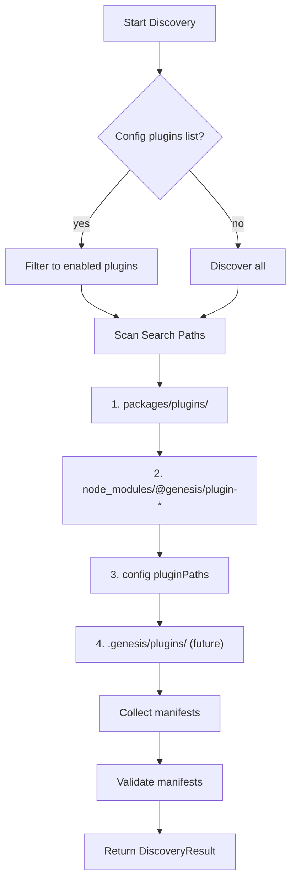

| Priority | Path | Trust Level | Purpose |
|----------|------|-------------|---------|
| 1 | `packages/plugins/` | `local` | Monorepo development |
| 2 | `node_modules/@genesis/plugin-*` | `trusted` | Published npm plugins |
| 3 | `config.plugins.pluginPaths[]` | `local` | User-defined locations |
| 4 | `.genesis/plugins/` | `untrusted` | Project-local plugins (future) |

### Discovery Rules

| Rule | Description |
|------|-------------|
| D1 | A directory is a plugin candidate if it contains `genesis.plugin.json` |
| D2 | Duplicate `name` in same search path → first found wins; second logged as warning |
| D3 | Duplicate `name` across paths → higher-priority path wins |
| D4 | Plugins not in `config.plugins` enabled list are discovered but not loaded |
| D5 | Discovery is read-only; no plugin code executes during discovery |
| D6 | Discovery result is cached for process lifetime unless `reload` is invoked |

### DiscoveryResult

| Field | Type | Description |
|-------|------|-------------|
| `discovered` | `PluginInfo[]` | All valid manifests found |
| `invalid` | `InvalidPlugin[]` | Manifests that failed validation |
| `searchPaths` | `string[]` | Paths scanned |
| `durationMs` | `number` | Discovery duration |

---

## Plugin Registration

Registration is the phase where a loaded plugin contributes capabilities to kernel registries.

### Registration Flow

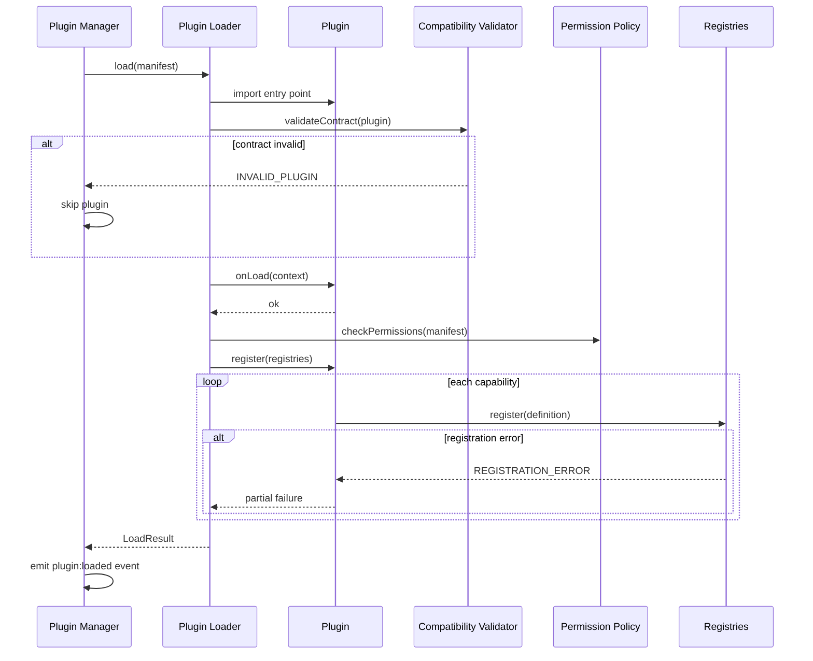

### Registration Rules

| Rule | Description |
|------|-------------|
| R1 | Registration occurs inside `register()` during load; not before `onLoad` completes |
| R2 | Plugin may only register capabilities declared in manifest `capabilities` |
| R3 | All capability ids must be namespaced: `{plugin-short-name}:{resource}` |
| R4 | Duplicate capability id → first registered wins; second logs warning |
| R5 | Registration is atomic per capability type; failure of one does not roll back others |
| R6 | Registration is immutable after load completes until unload |
| R7 | Built-in kernel capabilities register before any plugin |

### Capability Registration Contracts

#### Commands

| Field | Type | Required | Description |
|-------|------|----------|-------------|
| `id` | `string` | yes | Namespaced command id (`unity:create-scene`) |
| `description` | `string` | yes | Help text |
| `category` | `string` | no | Help grouping |
| `flags` | `FlagDefinition[]` | no | Command flags |
| `arguments` | `ArgumentDefinition[]` | no | Positional arguments |
| `handler` | `CommandHandler` | yes | Execution function |
| `hidden` | `boolean` | no | Exclude from help |

#### Templates

| Field | Type | Required | Description |
|-------|------|----------|-------------|
| `id` | `string` | yes | Template identifier (`unity:monobehaviour`) |
| `path` | `string` | yes | Path to `.genesis` template file |
| `version` | `string` | yes | Template version |
| `variables` | `VariableSchema[]` | no | Required context variables |
| `outputPath` | `string` | no | Default output path pattern |
| `tags` | `string[]` | no | Discovery tags |

#### Generators

| Field | Type | Required | Description |
|-------|------|----------|-------------|
| `id` | `string` | yes | Generator identifier (`nestjs:module`) |
| `description` | `string` | yes | Human-readable summary |
| `templates` | `string[]` | yes | Template ids used by this generator |
| `variables` | `VariableSchema[]` | no | Input variables |
| `plan` | `GenerationPlanBuilder` | yes | Function that builds generation plan |

#### Validators

| Field | Type | Required | Description |
|-------|------|----------|-------------|
| `id` | `string` | yes | Rule identifier (`unity:scene-structure`) |
| `description` | `string` | yes | What this rule checks |
| `scope` | `enum` | yes | `file`, `directory`, `project` |
| `severity` | `enum` | yes | `error`, `warning`, `info` |
| `check` | `ValidatorFunction` | yes | Validation function |

#### AI Providers

| Field | Type | Required | Description |
|-------|------|----------|-------------|
| `id` | `string` | yes | Provider identifier (`openai:gpt-4`) |
| `description` | `string` | yes | Provider summary |
| `models` | `string[]` | yes | Supported model identifiers |
| `complete` | `CompleteFunction` | yes | Single completion |
| `stream` | `StreamFunction` | no | Streaming completion |
| `embed` | `EmbedFunction` | no | Embedding generation |
| `capabilities` | `string[]` | no | `chat`, `completion`, `embedding`, `vision` |

#### Hooks

| Field | Type | Required | Description |
|-------|------|----------|-------------|
| `name` | `string` | yes | Hook name (must be in kernel hook catalog) |
| `listener` | `HookListener` | yes | Callback function |
| `priority` | `number` | no | Execution order (lower = earlier, default 100) |

#### Lifecycle Events

Plugins subscribe to lifecycle events via `events.on()`. They do not register new event types in v1.

| Subscription | Purpose |
|--------------|---------|
| `plugin:loaded` | React to other plugins loading |
| `plugin:unloaded` | React to other plugins unloading |
| `command:start` | Observe command execution |
| `command:complete` | Post-command analytics or cleanup |

---

## Plugin Loading

### Load Phases

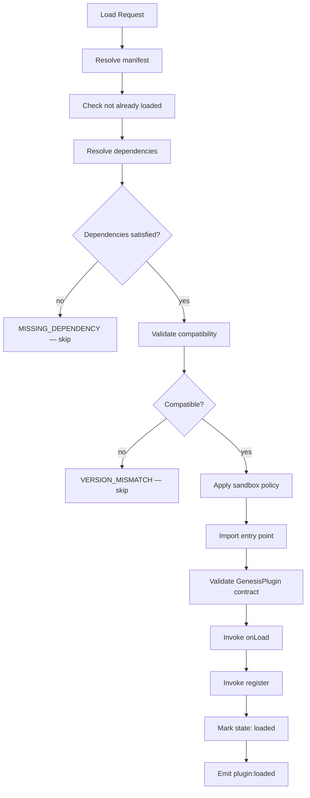

### Load Ordering

Plugins load in **topological order** determined by the dependency resolver. Plugins with no dependencies load first. Among peers, load order is alphabetical by `name` for determinism.

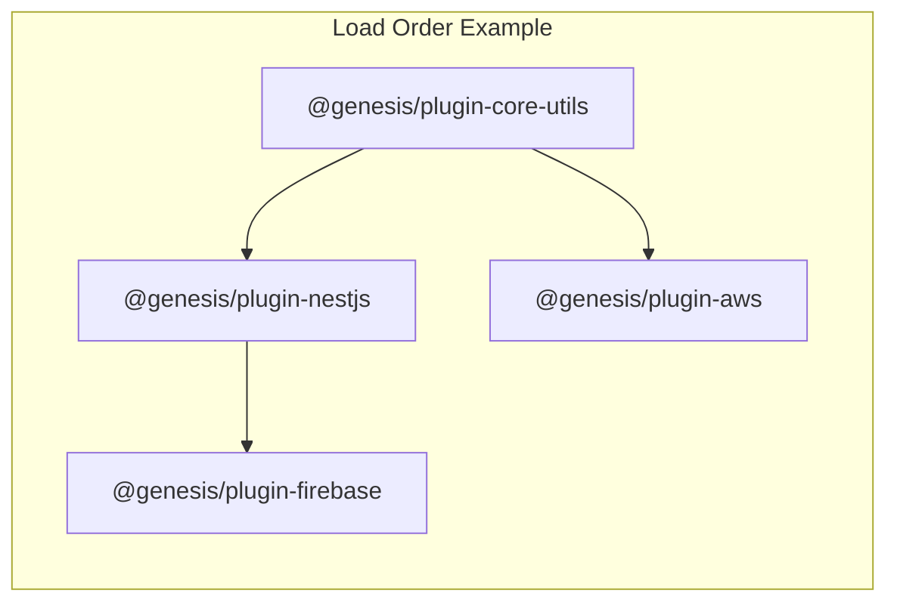

### Load Result

| Field | Type | Description |
|-------|------|-------------|
| `plugin` | `PluginInfo` | Loaded plugin metadata |
| `registered` | `CapabilityCounts` | Counts per registry |
| `warnings` | `string[]` | Non-fatal issues during load |
| `durationMs` | `number` | Load duration |

### Load Failure Behavior

| Failure | Kernel Behavior | Other Plugins |
|---------|-----------------|---------------|
| Manifest invalid | Skip; log warning | Unaffected |
| Version mismatch | Skip; log warning | Unaffected |
| Missing dependency | Skip; log warning | Unaffected |
| Entry point import error | Skip; log error | Unaffected |
| `onLoad` throws | Skip; log error | Unaffected |
| `register` throws | Partial registration; log error | Unaffected |
| Permission denied | Skip; log error | Unaffected |

### Batch Load Sequence

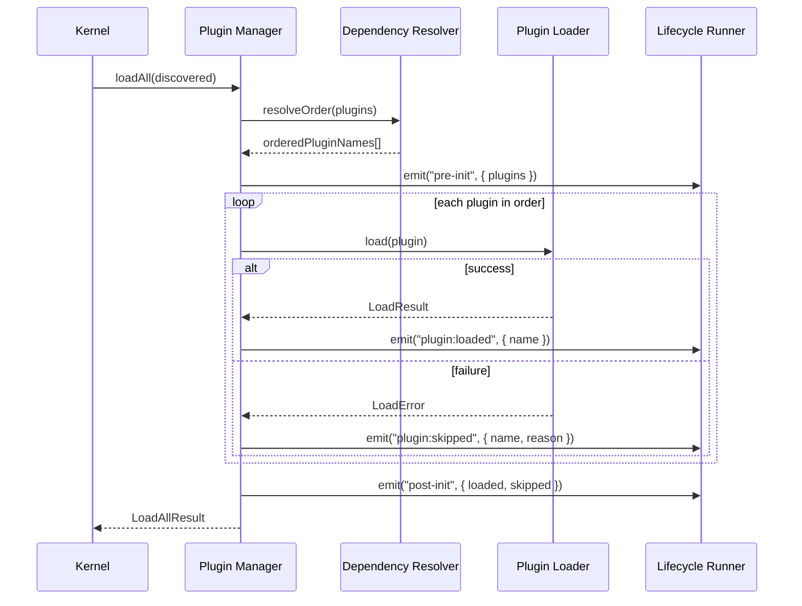

---

## Plugin Unloading

### Unload Phases

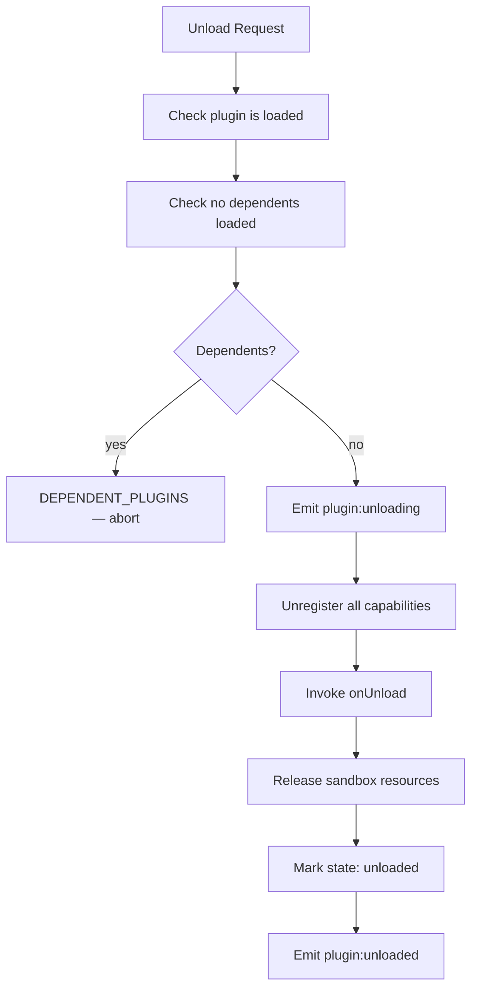

### Unload Rules

| Rule | Description |
|------|-------------|
| U1 | Unload is only supported during kernel shutdown or explicit `pluginManager.unload(name)` |
| U2 | A plugin with loaded dependents cannot be unloaded until dependents are unloaded |
| U3 | `onUnload` must complete within 10 seconds or be force-terminated |
| U4 | Unregistration removes all capabilities contributed by the plugin |
| U5 | In-flight commands from the unloading plugin are allowed to complete |
| U6 | Hook listeners from the unloading plugin are removed before `onUnload` |
| U7 | Unload order is reverse of load order (dependents first) |

### Kernel Shutdown Unload

During CLI shutdown, all plugins unload in reverse dependency order:

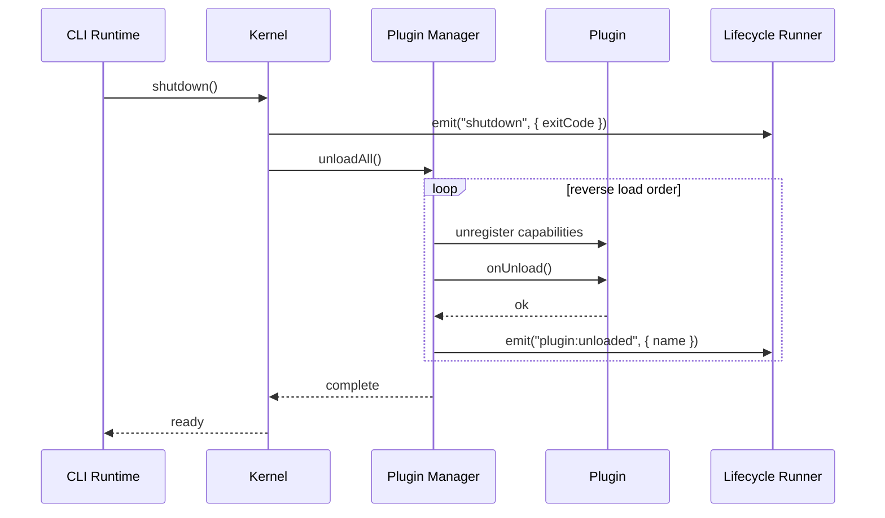

### Unload Result

| Field | Type | Description |
|-------|------|-------------|
| `plugin` | `string` | Plugin name |
| `unregistered` | `CapabilityCounts` | Capabilities removed |
| `durationMs` | `number` | Unload duration |
| `forced` | `boolean` | Whether `onUnload` timed out |

---

## Dependency Resolution

### Dependency Model

Plugins declare dependencies on **other plugins** (not on kernel packages). The kernel resolves a load order that satisfies all constraints.

| Rule | Description |
|------|-------------|
| DEP-1 | Dependencies are declared in manifest `dependencies` as name → version range |
| DEP-2 | Circular dependencies are rejected at resolution time |
| DEP-3 | Missing dependencies cause the dependent plugin to be skipped |
| DEP-4 | Version ranges use semver compatible with npm range syntax |
| DEP-5 | Plugins must not import other plugins directly — only declare kernel-level dependencies |
| DEP-6 | Optional dependencies are not supported in v1 |
| DEP-7 | Maximum dependency depth: 10 levels |

### Dependency Resolution Algorithm

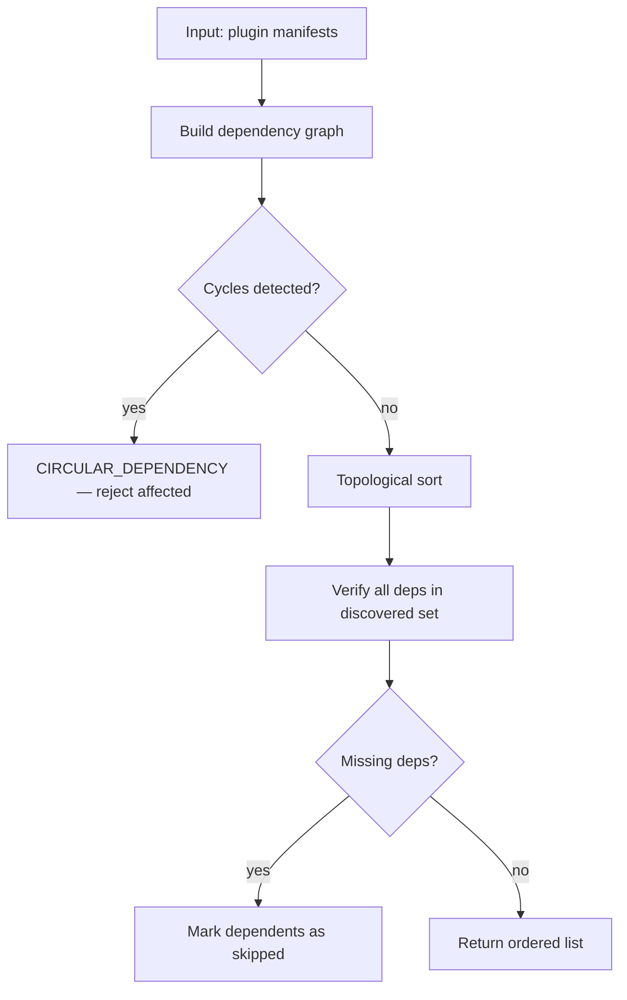

### Dependency Example

```json
{
  "name": "@genesis/plugin-firebase",
  "dependencies": {
    "@genesis/plugin-nestjs": "^1.0.0"
  }
}
```

```json
{
  "name": "@genesis/plugin-nestjs",
  "dependencies": {
    "@genesis/plugin-core-utils": "^1.0.0"
  }
}
```

**Resolved load order:**

1. `@genesis/plugin-core-utils`
2. `@genesis/plugin-nestjs`
3. `@genesis/plugin-firebase`

### Framework Dependency

Plugins also declare framework compatibility via `genesisVersion`. This is not a plugin dependency — it is validated against the running Genesis framework version.

| Field | Validates Against | Example |
|-------|-------------------|---------|
| `apiVersion` | Plugin API contract version | `1.x` |
| `genesisVersion` | Genesis framework version | `^1.0.0` |

---

## Plugin Versioning

### Version Fields

| Field | Scope | Format | Purpose |
|-------|-------|--------|---------|
| `version` | Plugin package | semver | Plugin release version |
| `apiVersion` | Plugin API contract | major.x | GenesisPlugin interface version |
| `genesisVersion` | Framework compatibility | semver range | Compatible Genesis versions |

### Semver Rules

| Change Type | Version Bump | Example |
|-------------|-------------|---------|
| Breaking capability contract change | Major | `1.0.0` → `2.0.0` |
| New capability or backward-compatible feature | Minor | `1.0.0` → `1.1.0` |
| Bug fix, no contract change | Patch | `1.0.0` → `1.0.1` |

### API Versioning

The Genesis Plugin API (`apiVersion`) is versioned independently:

| API Version | Status | Changes |
|-------------|--------|---------|
| `1.x` | Current | Initial plugin contract |

When the kernel bumps API major version:
- Kernel supports previous API version for one major release (deprecation window)
- Plugins must update `apiVersion` to remain compatible

### Version Resolution

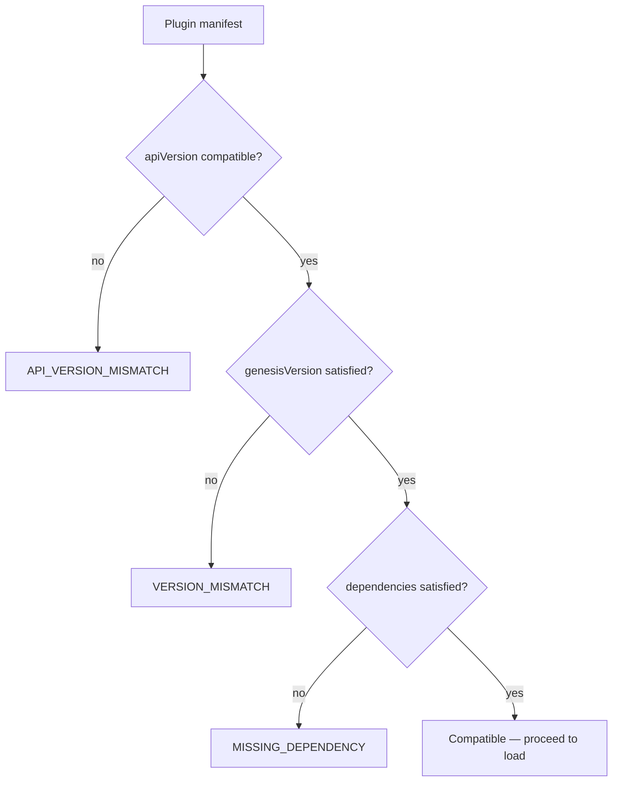

---

## Plugin Compatibility

### Compatibility Matrix

The kernel validates compatibility before loading:

| Check | Input | Rule | Error Code |
|-------|-------|------|------------|
| Contract | Plugin module | Exports valid `GenesisPlugin` | `INVALID_PLUGIN` |
| API version | `apiVersion` | Matches supported API versions | `API_VERSION_MISMATCH` |
| Framework version | `genesisVersion` | Satisfies running framework version | `VERSION_MISMATCH` |
| Capabilities | `capabilities` | All values are known capability types | `INVALID_CAPABILITY` |
| Permissions | `permissions` | All values are known permission identifiers | `INVALID_PERMISSION` |
| Dependencies | `dependencies` | All deps discovered and version-compatible | `MISSING_DEPENDENCY` |
| Cycles | Dependency graph | No circular references | `CIRCULAR_DEPENDENCY` |
| Duplicates | Loaded set | No duplicate `name` | `DUPLICATE_PLUGIN` |
| Entry point | `main` | File exists and is loadable | `ENTRY_NOT_FOUND` |
| Trust | `trust` + source | Does not exceed source trust level | `TRUST_ESCALATION` |

### Framework Version Table

| Genesis Framework | Supported API | Notes |
|-------------------|---------------|-------|
| `1.0.x` | `1.x` | Initial release |
| `1.1.x` | `1.x` | Backward compatible |
| `2.0.x` | `2.x` | Breaking kernel changes |

### Deprecation

| Policy | Behavior |
|--------|----------|
| Deprecated capability | Warning logged; capability still registered |
| Deprecated API version | Warning logged; plugin still loaded during deprecation window |
| Removed API version | Plugin skipped with `API_VERSION_MISMATCH` |
| Deprecated plugin | `genesis plugin list` shows deprecation notice |

---

## Capability Types

### Commands

Plugins register CLI commands that the CLI dispatches at runtime.

**Namespace convention:** `{plugin-short-name}:{command-name}`

**Example registrations:**

| Plugin | Command ID | Description |
|--------|-----------|-------------|
| Unity | `unity:create-scene` | Create a new Unity scene |
| Unity | `unity:add-component` | Add component to GameObject |
| NestJS | `nestjs:generate-module` | Generate NestJS module |
| AWS | `aws:deploy` | Deploy to AWS |

**Example — plugin command definition (abstract):**

```
commands.register({
  id: "unity:create-scene",
  description: "Create a new Unity scene file",
  category: "unity",
  flags: [
    { name: "name", type: "string", required: true, description: "Scene name" },
    { name: "template", type: "string", default: "empty", description: "Scene template" }
  ],
  handler: async (context, args) => {
    // create scene using template engine
    return { exitCode: 0, message: "Scene created" }
  }
})
```

### Templates

Plugins bundle `.genesis` templates that the template engine discovers via the Template Registry.

**Example — template registration:**

```
templates.register({
  id: "unity:monobehaviour",
  path: "./templates/monobehaviour.genesis",
  version: "1.0.0",
  variables: [
    { name: "className", type: "string", required: true },
    { name: "namespace", type: "string", required: false }
  ],
  outputPath: "Assets/Scripts/{{ className }}.cs",
  tags: ["unity", "csharp", "script"]
})
```

Templates follow the [002-template-engine](../002-template-engine/FUNCTIONAL_SPEC.md) specification.

### Generators

Generators define scaffolding operations — ordered sets of template renders that produce a module, service, or project component.

**Example — generator registration:**

```
generators.register({
  id: "nestjs:module",
  description: "Generate a NestJS module with controller and service",
  templates: [
    "nestjs:module",
    "nestjs:controller",
    "nestjs:service",
    "nestjs:module-spec"
  ],
  variables: [
    { name: "moduleName", type: "string", required: true },
    { name: "withController", type: "boolean", default: true },
    { name: "withService", type: "boolean", default: true }
  ],
  plan: (context) => {
    // return GenerationPlan with ordered template renders
  }
})
```

Generators are consumed by [004-scaffolding](../004-scaffolding/).

### Validators

Validators register rules that run after generation to verify output quality and architecture compliance.

**Example — validator registration:**

```
validators.register({
  id: "unity:script-structure",
  description: "Verify Unity C# scripts follow naming conventions",
  scope: "file",
  severity: "warning",
  check: async (context, file) => {
    // return ValidationResult { passed, message, line }
  }
})
```

### AI Providers

AI provider plugins register LLM backends with the AI Provider Registry. Consumed by [005-ai-engine](../005-ai-engine/).

**Example — AI provider registration:**

```
aiProviders.register({
  id: "openai:gpt-4",
  description: "OpenAI GPT-4 completion provider",
  models: ["gpt-4", "gpt-4-turbo"],
  capabilities: ["chat", "completion"],
  complete: async (prompt, options) => {
    // return CompletionResult { text, tokens, model }
  },
  stream: async (prompt, options) => {
    // return AsyncIterable<StreamChunk>
  }
})
```

**Provider requirements:**

| Requirement | Description |
|-------------|-------------|
| API key handling | Keys read from environment or config; never logged |
| Cost reporting | Every call returns token count and estimated cost |
| Timeout | Default 60 seconds; configurable per provider |
| Error mapping | Provider errors mapped to `AIProviderError` codes |
| Guardrails | Provider must not bypass kernel guardrail engine |

### Hooks

Hooks are interception points in the framework lifecycle. Plugins register listeners that can observe, modify, or cancel operations.

**Kernel hook catalog:**

| Hook | Phase | Cancellable | Payload |
|------|-------|-------------|---------|
| `pre-init` | Before kernel init | No | `{ config }` |
| `post-init` | After kernel init | No | `{ kernel, plugins }` |
| `pre-command` | Before command execute | Yes | `{ commandId, args, flags }` |
| `post-command` | After command execute | No | `{ commandId, result }` |
| `pre-generate` | Before scaffolding | Yes | `{ template, variables }` |
| `post-generate` | After scaffolding | No | `{ template, filesCreated }` |
| `pre-validate` | Before validation | No | `{ path, rules }` |
| `post-validate` | After validation | No | `{ path, results }` |
| `pre-render` | Before template render | Yes | `{ templateId, context }` |
| `post-render` | After template render | No | `{ templateId, output }` |
| `shutdown` | Before process exit | No | `{ exitCode }` |

**Hook execution rules:**

| Rule | Description |
|------|-------------|
| H1 | Hooks execute in priority order (lower number = earlier) |
| H2 | Cancellable hooks can set `cancelled: true` to abort the operation |
| H3 | Hook timeout: 30 seconds per listener (configurable) |
| H4 | Hook failure logs warning; subsequent hooks still execute |
| H5 | `shutdown` hooks always run, even on error exit |
| H6 | Plugins can only register listeners for hooks in the kernel catalog |

**Example — pre-generate hook:**

```
hooks.register("pre-generate", (context) => {
  // Inject Unity-specific variables into generation context
  context.variables.unityVersion = pluginConfig.unityVersion
  context.variables.renderPipeline = pluginConfig.defaultRenderPipeline
  return context
}, { priority: 50 })
```

### Lifecycle Events

Lifecycle events are notifications emitted by the kernel. Unlike hooks, events cannot be cancelled.

**Event catalog (plugin-relevant):**

| Event | Payload | When |
|-------|---------|------|
| `plugin:discovered` | `{ count, paths }` | Discovery complete |
| `plugin:loading` | `{ name }` | Plugin load starting |
| `plugin:loaded` | `{ name, version, capabilities }` | Plugin loaded successfully |
| `plugin:skipped` | `{ name, reason }` | Plugin skipped |
| `plugin:unloading` | `{ name }` | Plugin unload starting |
| `plugin:unloaded` | `{ name }` | Plugin unloaded |
| `kernel:initialized` | `{ version, pluginCount }` | Kernel ready |
| `kernel:shutdown` | `{ durationMs }` | Kernel shutting down |
| `capability:registered` | `{ plugin, type, id }` | Capability added to registry |
| `capability:unregistered` | `{ plugin, type, id }` | Capability removed |

**Example — event subscription:**

```
events.on("plugin:loaded", (event) => {
  if (event.payload.name === "@genesis/plugin-nestjs") {
    logger.info("NestJS plugin ready — backend generators available")
  }
})
```

---

## Security

### Threat Model

| Threat | Mitigation |
|--------|------------|
| Malicious plugin reads secrets | Permission system; secrets excluded from plugin context |
| Plugin accesses filesystem outside project | Sandboxed filesystem scoped to declared paths |
| Plugin makes unauthorized network calls | Network permission required per domain |
| Plugin crashes kernel | Error isolation; plugin skipped on failure |
| Plugin impersonates another plugin | Manifest name validated against package name |
| Supply chain attack | Trust levels; official plugins signed (future) |
| Plugin exfiltrates project data | Network permissions; audit logging |

### Permission System

Plugins declare required permissions in the manifest. The kernel grants only declared permissions.

| Permission | Description | Default (trusted) | Default (local) | Default (untrusted) |
|------------|-------------|-------------------|-----------------|---------------------|
| `filesystem:read` | Read files in project | granted | granted | granted |
| `filesystem:write:project` | Write files within project root | granted | granted | denied |
| `filesystem:write:global` | Write outside project root | denied | denied | denied |
| `config:read` | Read Genesis configuration | granted | granted | granted |
| `config:write` | Modify Genesis configuration | denied | denied | denied |
| `env:read:{VAR}` | Read specific environment variable | per-declaration | per-declaration | denied |
| `network:{domain}` | HTTP requests to domain | per-declaration | per-declaration | denied |
| `subprocess:execute` | Spawn child processes | per-declaration | denied | denied |
| `plugin:depend` | Declare dependency on another plugin | granted | granted | granted |

### Permission Enforcement

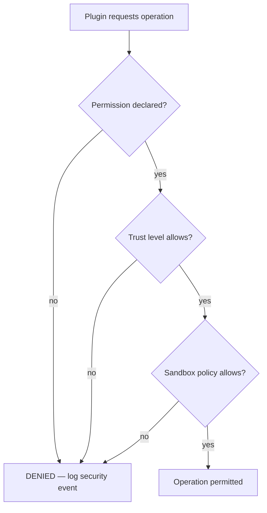

### Secret Handling

| Rule | Description |
|------|-------------|
| S1 | API keys and tokens are never passed in `PluginContext` |
| S2 | Plugins with `env:read:{VAR}` permission receive a secure accessor, not the raw environment |
| S3 | Configuration values marked `secret: true` are redacted in logs |
| S4 | Plugin error messages must not include secret values |
| S5 | `genesis plugin info` redacts permission-gated values |

### Security Audit Events

| Event | Logged When |
|-------|-------------|
| `security:permission_denied` | Plugin attempts undeclared operation |
| `security:trust_violation` | Plugin exceeds trust level |
| `security:sandbox_violation` | Sandbox policy blocks operation |
| `security:secret_access` | Plugin accesses a secret via permission |

---

## Sandboxing

### Sandbox Levels

Sandboxing applies isolation based on plugin trust level. The sandbox is a policy layer — not a separate process in v1.

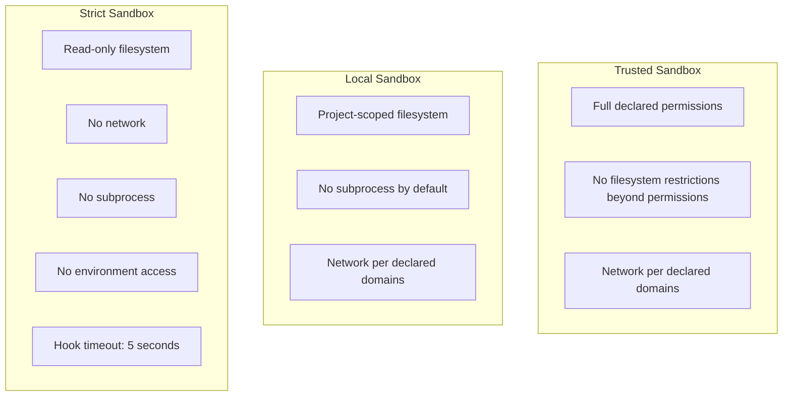

### Sandbox Policy Rules

| Rule | Trusted | Local | Untrusted |
|------|---------|-------|-----------|
| Filesystem read scope | Declared paths | Project root + declared | Plugin directory only |
| Filesystem write scope | Declared paths | Project root | Denied |
| Network access | Declared domains | Declared domains | Denied |
| Subprocess | If permitted | Denied | Denied |
| Environment variables | Declared vars | Denied | Denied |
| Hook timeout | 30s | 30s | 5s |
| Memory limit | None (v1) | None (v1) | 128 MB (future) |
| CPU time limit | None (v1) | None (v1) | 10s per hook (future) |

### Filesystem Sandbox

The kernel provides a permission-scoped `Filesystem` interface to plugins:

| Operation | Behavior |
|-----------|----------|
| `read(path)` | Allowed if path within read scope |
| `write(path, content)` | Allowed if path within write scope and write permission granted |
| `exists(path)` | Allowed if path within read scope |
| `list(dir)` | Allowed if dir within read scope |
| `resolve(path)` | Does not bypass sandbox; resolves within allowed scope |

Paths outside the sandbox return `SANDBOX_VIOLATION` without throwing.

### Future Sandboxing

| Feature | Phase | Description |
|---------|-------|-------------|
| Worker thread isolation | Phase 3 | Plugin code runs in separate thread |
| Process isolation | Future | Plugin code runs in child process |
| Plugin signing | Future | Cryptographic verification of official plugins |
| WASM sandbox | Future | Untrusted plugins compiled to WASM |

---

## Error Handling

### Error Hierarchy

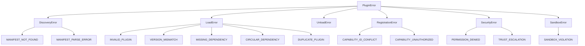

### Error Codes

| Code | Category | Severity | Description |
|------|----------|----------|-------------|
| `MANIFEST_NOT_FOUND` | Discovery | Warning | No manifest in plugin directory |
| `MANIFEST_PARSE_ERROR` | Discovery | Warning | Invalid JSON in manifest |
| `MANIFEST_MISSING_FIELD` | Discovery | Warning | Required manifest field missing |
| `MANIFEST_INVALID_NAME` | Discovery | Warning | Plugin name format invalid |
| `INVALID_PLUGIN` | Load | Warning | Plugin does not implement GenesisPlugin |
| `API_VERSION_MISMATCH` | Load | Warning | Plugin API version unsupported |
| `VERSION_MISMATCH` | Load | Warning | genesisVersion not satisfied |
| `MISSING_DEPENDENCY` | Load | Warning | Required plugin not found |
| `CIRCULAR_DEPENDENCY` | Load | Error | Circular dependency detected |
| `DUPLICATE_PLUGIN` | Load | Warning | Plugin name already loaded |
| `ENTRY_NOT_FOUND` | Load | Warning | Entry point file missing |
| `LOAD_TIMEOUT` | Load | Error | Plugin load exceeded time limit |
| `ONLOAD_FAILED` | Load | Warning | onLoad threw an error |
| `REGISTER_FAILED` | Load | Warning | register() threw an error |
| `CAPABILITY_ID_CONFLICT` | Registration | Warning | Duplicate capability id |
| `CAPABILITY_UNAUTHORIZED` | Registration | Warning | Capability not in manifest |
| `PERMISSION_DENIED` | Security | Error | Undeclared permission used |
| `TRUST_ESCALATION` | Security | Error | Trust level exceeded |
| `SANDBOX_VIOLATION` | Sandbox | Error | Operation outside sandbox |
| `DEPENDENT_PLUGINS` | Unload | Error | Cannot unload; dependents exist |
| `ONUNLOAD_FAILED` | Unload | Warning | onUnload threw or timed out |
| `UNLOAD_TIMEOUT` | Unload | Warning | onUnload exceeded time limit |

### Error Message Format

```
[PLUGIN_ERROR] {code}: {message}
  Plugin: {pluginName}@{version}
  Path: {pluginPath}
  Phase: {discovery|load|register|unload|runtime}
  Cause: {underlyingError}
  Suggestion: {actionableFix}
```

**Example:**

```
[PLUGIN_ERROR] VERSION_MISMATCH: Plugin requires Genesis ^2.0.0 but running 1.0.0
  Plugin: @genesis/plugin-unity@2.0.0
  Path: /project/node_modules/@genesis/plugin-unity
  Phase: load
  Suggestion: Upgrade Genesis to ^2.0.0 or install plugin-unity@1.x
```

### Error Isolation Policy

| Scenario | Kernel | Other Plugins | CLI Exit Code |
|----------|--------|---------------|---------------|
| Discovery failure | Continue | N/A | Unaffected |
| Load failure | Skip plugin | Unaffected | Unaffected |
| Registration failure | Partial capabilities | Unaffected | Unaffected |
| Runtime command error | Stable | Unaffected | 4 (PLUGIN_ERROR) |
| Hook failure | Stable | Unaffected | Unaffected |
| Security violation | Skip plugin | Unaffected | Unaffected |
| Unload failure | Log warning | Unaffected | Unaffected |

---

## Public API

### PluginManager API

| Method | Input | Output | Description |
|--------|-------|--------|-------------|
| `discover(options?)` | Search options | `DiscoveryResult` | Scan paths for plugins |
| `load(name)` | Plugin name | `LoadResult` | Load a single plugin |
| `loadAll()` | — | `LoadAllResult` | Load all discovered plugins in dependency order |
| `unload(name)` | Plugin name | `UnloadResult` | Unload a single plugin |
| `unloadAll()` | — | `UnloadAllResult` | Unload all plugins in reverse order |
| `get(name)` | Plugin name | `PluginInfo \| null` | Get plugin metadata |
| `list()` | — | `PluginInfo[]` | List all plugins |
| `isLoaded(name)` | Plugin name | `boolean` | Check load state |
| `reload(name)` | Plugin name | `LoadResult` | Unload and reload a plugin |

### Kernel API (Plugin Surface)

| Method | Description |
|--------|-------------|
| `initialize(config)` | Bootstrap kernel; discover and load plugins |
| `getPluginManager()` | Access plugin manager |
| `getCommandRegistry()` | Access command registry |
| `getTemplateRegistry()` | Access template registry |
| `getGeneratorRegistry()` | Access generator registry |
| `getValidatorRegistry()` | Access validator registry |
| `getAIProviderRegistry()` | Access AI provider registry |
| `getHookRegistry()` | Access hook registry |
| `getEventBus()` | Access event bus |
| `shutdown()` | Unload all plugins; release resources |

### Plugin Author API

| Method | When Called | Description |
|--------|-------------|-------------|
| `onLoad(ctx)` | After import | Initialize plugin; access config and services |
| `register(registries)` | After onLoad | Register capabilities |
| `onUnload()` | Before removal | Release resources |

---

## Examples

### Example 1 — Minimal Plugin

A plugin that registers a single command and a hook.

**Manifest (`genesis.plugin.json`):**

```json
{
  "name": "@genesis/plugin-hello",
  "version": "1.0.0",
  "apiVersion": "1.x",
  "genesisVersion": "^1.0.0",
  "description": "Hello world plugin for testing",
  "main": "./dist/index.js",
  "capabilities": ["command", "hook"],
  "permissions": ["config:read"]
}
```

**Behavior:**

1. Kernel discovers manifest in `packages/plugins/hello/`
2. Compatibility validator passes
3. `onLoad` receives `PluginContext` with config
4. `register` adds command `hello:greet` and `post-init` hook
5. User runs `genesis hello:greet` → outputs greeting

### Example 2 — Full-Stack Backend Plugin

NestJS plugin contributing commands, templates, generators, validators, and hooks.

**Contributed capabilities:**

| Type | Count | Examples |
|------|-------|---------|
| Commands | 3 | `nestjs:generate-module`, `nestjs:generate-service`, `nestjs:generate-controller` |
| Templates | 8 | `nestjs:module`, `nestjs:controller`, `nestjs:service`, `nestjs:dto` |
| Generators | 2 | `nestjs:module`, `nestjs:crud` |
| Validators | 2 | `nestjs:module-structure`, `nestjs:naming-convention` |
| Hooks | 1 | `pre-generate` (injects NestJS config variables) |

**Generation flow with plugin:**

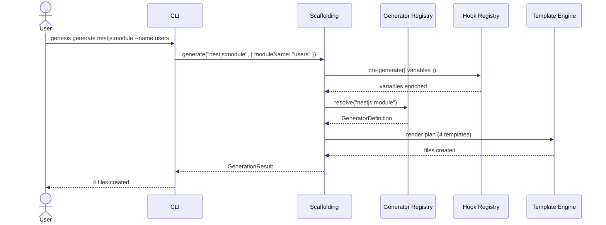

### Example 3 — AI Provider Plugin

OpenAI plugin registering a provider and a cost-tracking hook.

**Contributed capabilities:**

| Type | ID | Description |
|------|----|-------------|
| AI Provider | `openai:gpt-4` | GPT-4 chat completion |
| AI Provider | `openai:gpt-4-turbo` | GPT-4 Turbo completion |
| Hook | `post-command` | Log AI usage after `genesis ai` commands |

**Config (`.genesis/config.yml`):**

```yaml
plugins:
  - "@genesis/plugin-openai"
pluginConfig:
  "@genesis/plugin-openai":
    model: "gpt-4"
    maxTokens: 4096
    temperature: 0.7
```

### Example 4 — Multi-Plugin Project Template

A project template that activates multiple plugins:

```yaml
name: mobile-game-fullstack
description: Mobile game with Unity client and NestJS backend
plugins:
  - "@genesis/plugin-unity"
  - "@genesis/plugin-nestjs"
  - "@genesis/plugin-firebase"
generators:
  - unity:project
  - nestjs:api
  - firebase:config
```

**Dependency resolution:**

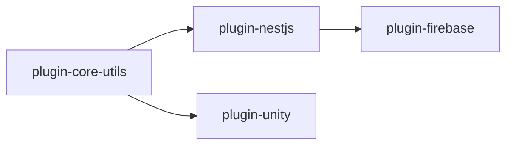

**Load order:** core-utils → nestjs → unity → firebase (unity and nestjs are peers; alphabetical)

### Example 5 — Plugin Failure Isolation

Scenario: `@genesis/plugin-aws` fails to load; other plugins continue.

```
$ genesis plugin list

 Name                      Version  Status   Capabilities
 @genesis/plugin-unity      1.2.0    loaded   command, template, generator
 @genesis/plugin-nestjs     1.0.0    loaded   command, template, generator
 @genesis/plugin-aws        2.0.0    failed   —
 @genesis/plugin-firebase   1.1.0    skipped  — (depends on nestjs only)

$ genesis create my-game --template mobile-game
# Succeeds — Unity and NestJS plugins loaded
# AWS-dependent generators unavailable; warning logged
```

### Example 6 — Plugin Testing

Plugins must be testable in isolation with a mock kernel.

**Test structure:**

```
packages/plugins/unity/
├── genesis.plugin.json
├── src/
│   └── index.ts
├── templates/
├── generators/
└── tests/
    ├── plugin.test.ts        # Contract and registration tests
    ├── commands.test.ts      # Command handler tests
    ├── generators.test.ts    # Generator plan tests
    └── fixtures/
        └── render-context.json
```

**Test categories:**

| Category | What It Verifies |
|----------|------------------|
| Contract | Plugin implements GenesisPlugin; manifest matches |
| Registration | All declared capabilities register without error |
| Commands | Handlers return expected results with mock context |
| Generators | Plans produce correct template lists |
| Hooks | Listeners modify payload correctly |
| Permissions | Operations outside permissions are denied |
| Isolation | Plugin failures do not affect mock kernel |

---

## Testing Requirements

### Kernel Tests

| Test | Description |
|------|-------------|
| Discovery | Scan paths; validate manifests; handle invalid plugins |
| Load order | Dependency resolution produces correct topological order |
| Circular deps | Reject circular dependency graphs |
| Version mismatch | Skip incompatible plugins |
| Registration | Capabilities appear in correct registries |
| Unload | Capabilities removed; dependents blocked |
| Error isolation | Failed plugin does not affect others |
| Permissions | Undeclared operations denied |
| Sandbox | Out-of-scope operations blocked |

### Integration Tests

| Test | Description |
|------|-------------|
| CLI + plugins | Load mock plugin; verify command appears in help |
| Scaffolding + generators | Load mock generator; verify generation plan |
| Template + templates | Load mock template; verify render |
| AI + providers | Load mock provider; verify completion |
| Shutdown | All plugins unload cleanly |

---

## Related Documents

- [DECISION_LOG.md](../../DECISION_LOG.md) — ADR-002 Plugin-Based Architecture
- [001-cli/FUNCTIONAL_SPEC.md](../001-cli/FUNCTIONAL_SPEC.md) — CLI plugin discovery and command dispatch
- [002-template-engine/FUNCTIONAL_SPEC.md](../002-template-engine/FUNCTIONAL_SPEC.md) — Template rendering
- [004-scaffolding/README.md](../004-scaffolding/) — Generator consumption
- [005-ai-engine/README.md](../005-ai-engine/) — AI provider consumption
- [007-backend/README.md](../007-backend/) — Backend plugin specs
- [008-unity/README.md](../008-unity/) — Unity plugin spec

## Changelog

| Version | Date | Change |
|---------|------|--------|
| 1.0.0 | 2026-07-26 | Initial approved functional specification |
