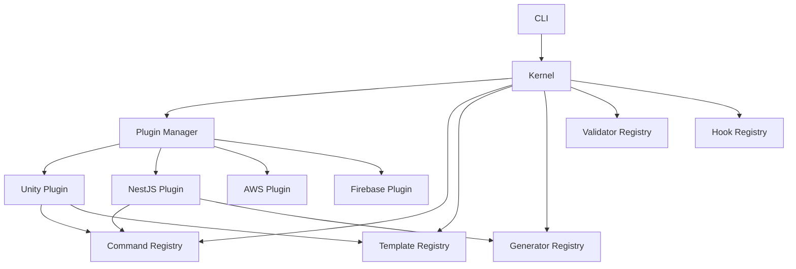

# Plugin System Specification

## Purpose

Define the plugin architecture that allows Project Genesis to support Unity, NestJS, AWS, Firebase, and AI services without coupling the core kernel to any specific technology. Plugins extend the framework by registering capabilities with a stable kernel API.

## Documents

| Document | Description |
|----------|-------------|
| [FUNCTIONAL_SPEC.md](FUNCTIONAL_SPEC.md) | **Complete functional specification** — registration, loading, unloading, dependencies, manifest, versioning, compatibility, security, sandboxing |
| This document | Overview, responsibilities, and implementation roadmap |

## Scope

### In Scope

- Plugin contract (interface, lifecycle, capabilities)
- Plugin discovery, loading, and unloading
- Kernel API for capability registration
- Plugin validation and compatibility checks
- Plugin configuration and metadata
- Hook system for lifecycle events

### Out of Scope

- Individual plugin implementations (see [007-backend](../007-backend/), [008-unity](../008-unity/))
- Plugin marketplace or remote installation (future)
- Runtime hot-reloading of plugins (future)
- Unreal Engine plugin (future consideration)

## Goals

| Goal | Success Criteria |
|------|------------------|
| **Decoupled** | Core kernel has zero imports from plugin packages |
| **Stable API** | Plugin contract versioned; breaking changes require major bump |
| **Isolated** | Plugin failure does not crash the kernel or other plugins |
| **Discoverable** | Installed plugins listed via `genesis plugin list` |
| **Testable** | Plugins testable with mock kernel in isolation |
| **Secure** | Plugins cannot access secrets outside their declared permissions |

## Responsibilities

### Architecture

### Kernel

The kernel lives in `@genesis/core` and provides:

| Service | Responsibility |
|---------|----------------|
| `PluginManager` | Discover, load, unload, validate plugins |
| `CommandRegistry` | Register CLI commands from plugins |
| `TemplateRegistry` | Register templates from plugins |
| `GeneratorRegistry` | Register generators from plugins |
| `ValidatorRegistry` | Register validators from plugins |
| `HookRegistry` | Register and emit lifecycle hooks |

### Plugin Contract

Every plugin implements the `GenesisPlugin` interface:

| Property / Method | Type | Description |
|-------------------|------|-------------|
| `name` | `string` | Unique plugin identifier (e.g., `@genesis/plugin-unity`) |
| `version` | `string` | Semantic version |
| `genesisVersion` | `string` | Compatible Genesis framework version range |
| `description` | `string` | Human-readable description |
| `capabilities` | `PluginCapability[]` | Registered capability types |
| `onLoad(ctx)` | `Promise<void>` | Called when plugin is loaded |
| `onUnload()` | `Promise<void>` | Called when plugin is unloaded |
| `register(registries)` | `void` | Register commands, templates, generators, validators, hooks |

### Capability Types

| Capability | Registration Target | Example |
|------------|-------------------|---------|
| `command` | `CommandRegistry` | `genesis unity create-scene` |
| `template` | `TemplateRegistry` | Unity C# script templates |
| `generator` | `GeneratorRegistry` | Backend module generator |
| `validator` | `ValidatorRegistry` | Unity scene structure check |
| `hook` | `HookRegistry` | `pre-generate`, `post-generate` |

### Lifecycle Hooks

| Hook | When Fired | Use Case |
|------|-----------|----------|
| `pre-init` | Before kernel initialization | Plugin setup |
| `post-init` | After kernel initialization | Register capabilities |
| `pre-generate` | Before scaffolding render | Inject variables |
| `post-generate` | After scaffolding render | Post-processing |
| `pre-validate` | Before validation run | Add custom rules |
| `shutdown` | Before CLI exit | Cleanup resources |

### Plugin Discovery

Plugins are discovered from:

1. `packages/plugins/` in the monorepo (development)
2. `node_modules/@genesis/plugin-*` (installed)
3. Project-local `.genesis/plugins/` (future)

### Compatibility Validation

Before loading, the kernel validates:

| Check | Failure Code |
|-------|-------------|
| Plugin exports `GenesisPlugin` interface | `INVALID_PLUGIN` |
| `genesisVersion` satisfies current framework version | `VERSION_MISMATCH` |
| No duplicate `name` among loaded plugins | `DUPLICATE_PLUGIN` |
| All declared dependencies are loaded | `MISSING_DEPENDENCY` |
| Plugin does not depend on another plugin directly | `PLUGIN_COUPLING` |

### Error Isolation

Plugin errors are contained:

- `onLoad` failure → plugin skipped, warning logged, other plugins continue
- Command execution failure → error returned to CLI, kernel remains stable
- Hook failure → logged, subsequent hooks still execute

## Dependencies

### Upstream Specifications

| Spec | Dependency |
|------|------------|
| [000-project](../000-project/) | Layer rules, kernel ownership |
| [001-cli](../001-cli/) | Command registry integration |

### Packages

| Package | Usage |
|---------|-------|
| `@genesis/core` | Kernel implementation host |
| `@genesis/shared` | Plugin interface types |
| `@genesis/cli` | Dispatches plugin-registered commands |

### Downstream Consumers

| Spec | Relationship |
|------|-------------|
| [007-backend](../007-backend/) | NestJS, AWS, Firebase plugins |
| [008-unity](../008-unity/) | Unity plugin |
| [005-ai-engine](../005-ai-engine/) | AI service plugin |
| [004-scaffolding](../004-scaffolding/) | Uses generators and hooks from plugins |

## Future Implementation

### Sprint 4 (M1) — Plugin Kernel Foundation ✅ Implemented

- `@genesis/plugin-kernel` — contracts, `PluginHost`, scoped registration, pre-import validation
- Discovery: `packages/plugins/*` and `GENESIS_PLUGIN_PATH` (`.genesis/plugins/*` deferred)
- `genesis plugin list` / `genesis plugin info <id>`
- Reference plugin: `@genesis/plugin-example` (template, validator, hook)
- Hooks wired into `genesis new` and `genesis validate`; pipeline step injection deferred to Sprint 5

### Phase 2 — Plugin Manager (remaining)

### Phase 2 — First Plugins

- [008-unity](../008-unity/) — Unity plugin
- [007-backend](../007-backend/) — NestJS plugin
- AWS and Firebase plugins (basic scaffolding)

### Future — Advanced

- Remote plugin installation from registry
- Plugin permission system (filesystem, network access)
- Plugin sandboxing for untrusted plugins

## Related Documents

- [FUNCTIONAL_SPEC.md](FUNCTIONAL_SPEC.md) — Complete functional specification
- [DECISION_LOG.md](../../DECISION_LOG.md) — ADR-002 Plugin-Based Architecture
- [007-backend](../007-backend/) — Backend plugins
- [008-unity](../008-unity/) — Unity plugin
- [001-cli](../001-cli/) — Command dispatch

## Changelog

| Version | Date | Change |
|---------|------|--------|
| 1.0.1 | 2026-07-26 | Linked FUNCTIONAL_SPEC.md |
| 1.0.0 | 2026-07-26 | Initial approved specification |
