# Genesis Scaffolding Engine — Functional Specification

## Document Control

| Field | Value |
|-------|-------|
| **Specification** | [004-scaffolding](README.md) |
| **Status** | Approved |
| **Version** | 1.0.0 |
| **Independence** | Implementation-independent. No language, framework, or filesystem library is prescribed. |
| **Audience** | Engineers, generator authors, plugin developers, AI assistants, reviewers |

## Purpose

Define the complete functional behavior of the **Genesis Scaffolding Engine** — the orchestration subsystem responsible for generating projects, modules, APIs, documentation, games, and plugins by combining templates, generators, plugins, hooks, and validation into cohesive output. Scaffolding is the primary user-facing generation capability invoked via `genesis create` and `genesis generate`.

## Scope

### In Scope

- Scaffolding architecture and component model
- Generation types: projects, modules, APIs, documentation, games, plugins
- End-to-end generation pipeline
- Generation plan creation and execution
- File generation, conflict detection, and resolution
- Overwrite policies at plan and file level
- Dry-run mode
- Interactive mode with variable prompts
- Variable context assembly and resolution
- Rendering delegation to the template engine
- Post-generation validation
- Generation reports and error handling
- Public API contracts

### Out of Scope

- Template syntax, rendering mechanics, and expression evaluation ([002-template-engine](../002-template-engine/))
- Plugin loading and registry internals ([003-plugin-system](../003-plugin-system/))
- CLI argument parsing and exit code mapping ([001-cli](../001-cli/))
- Game design content and genre-specific gameplay rules ([006-game-generation](../006-game-generation/))
- Individual technology generator implementations ([007-backend](../007-backend/), [008-unity](../008-unity/))
- Authoring scaffolds in repository `templates/` (human/AI document templates)

---

## Goals

| ID | Goal | Success Criteria |
|----|------|------------------|
| G1 | **Complete** | `genesis create my-game` produces a runnable project skeleton |
| G2 | **Composable** | Projects, modules, APIs, docs, games, and plugins use the same pipeline |
| G3 | **Safe** | Default policy never overwrites without explicit consent |
| G4 | **Transparent** | Every file action reported; dry-run shows full plan |
| G5 | **Idempotent** | Re-running with `skip` policy does not corrupt existing files |
| G6 | **Extensible** | Plugins contribute generators and variables via hooks |
| G7 | **Validated** | Output passes architecture validation before completion |
| G8 | **Interactive** | Missing variables collected via prompts in interactive mode |
| G9 | **Scriptable** | Non-interactive mode suitable for CI/CD pipelines |

### Design Principles

1. **Plan before write** — A generation plan is built and validated before any file is created.
2. **Delegate rendering** — Scaffolding orchestrates; the template engine renders.
3. **Safe by default** — Default overwrite policy is `skip`; destructive operations require explicit flags.
4. **Hooks before side effects** — `pre-generate` hooks run before the plan executes.
5. **Validate after generate** — Post-generation validation is mandatory unless `--skip-validation`.
6. **One pipeline, many targets** — All generation types share the same orchestration flow.
7. **Fail with rollback option** — Partial generation can be rolled back on validation failure (future).

---

## Architecture

### System Overview

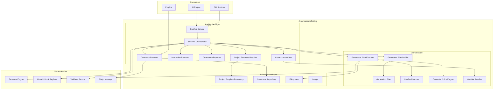

### Layer Responsibilities

| Layer | Components | Responsibility |
|-------|------------|----------------|
| **Application** | Scaffold Service, Orchestrator, Resolvers, Context Assembler, Reporter | Coordinate generation requests; public API |
| **Domain** | Generation Plan, Plan Builder, Executor, Conflict Resolver, Overwrite Policy, Variable Resolver | Pure generation logic; no direct I/O |
| **Infrastructure** | Repositories, Filesystem, Logger | Load templates and generators; write files |

### Component Model

| Component | Responsibility |
|-----------|----------------|
| **Scaffold Service** | Public API entry point for all generation operations |
| **Scaffold Orchestrator** | Coordinate the full generation pipeline |
| **Project Template Resolver** | Select project template by name, config, or default |
| **Generator Resolver** | Resolve generator by type/id from built-in and plugin registries |
| **Context Assembler** | Merge variables from all sources into render context |
| **Variable Resolver** | Resolve variable expressions and defaults |
| **Interactive Prompter** | Collect missing variables from user in interactive mode |
| **Generation Plan Builder** | Build ordered plan of template renders from template or generator |
| **Generation Plan** | Immutable ordered list of render operations with output paths |
| **Generation Plan Executor** | Execute plan; delegate rendering to template engine |
| **Conflict Resolver** | Detect and resolve file and directory conflicts |
| **Overwrite Policy Engine** | Apply plan-level and file-level overwrite rules |
| **Generation Reporter** | Summarize files created, skipped, overwritten, and errors |

### Relationship to Other Systems

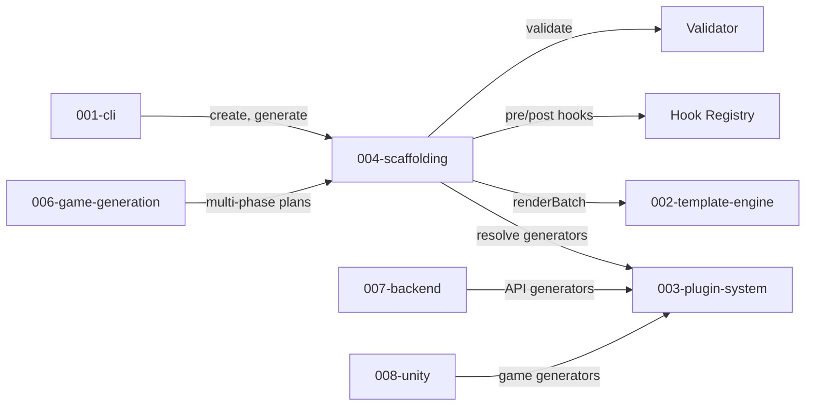

| System | Scaffolding Uses | System Provides |
|--------|------------------|-----------------|
| CLI | Command delegation, flags, exit codes | User invocation |
| Template Engine | `render`, `renderBatch`, output policies | Rendered file content |
| Plugin System | Generator registry, hook registry | Generators, variable injection |
| Validator | Post-generation validation | Architecture compliance results |
| Game Generation | Specialized multi-phase project templates | Game-specific orchestration |

---

## Generation Types

Scaffolding supports six generation types through a unified pipeline. Each type maps to a CLI command, a resolver, and a plan builder strategy.

### Type Overview

| Type | CLI Command | Resolver | Scope | Example |
|------|-------------|----------|-------|---------|
| **Project** | `genesis create <name>` | Project Template Resolver | New directory tree | `genesis create my-app` |
| **Module** | `genesis generate module <name>` | Generator Resolver | Single module within project | `genesis generate module auth` |
| **API** | `genesis generate api <name>` | Generator Resolver | REST/GraphQL API layer | `genesis generate api users` |
| **Documentation** | `genesis generate docs <type>` | Generator Resolver | Docs within project | `genesis generate docs adr` |
| **Game** | `genesis create game <name>` | Project Template Resolver (game) | Full game project | `genesis create game my-rpg --template mobile-rpg` |
| **Plugin** | `genesis generate plugin <name>` | Generator Resolver | New plugin package | `genesis generate plugin analytics` |

### Type: Project

Creates a new project directory from a **project template**.

| Attribute | Value |
|-----------|-------|
| Input | Project name, template name, output path |
| Output | Complete project directory |
| Plan source | Project template definition (YAML) |
| Default template | `default` |
| Validation | Full project structure validation |

**Built-in project templates (v1):**

| Template | Description | Generators |
|----------|-------------|------------|
| `default` | Minimal docs + config | `project-structure` |
| `backend-api` | NestJS API skeleton | `project-structure`, `nestjs:api` |
| `mobile-game` | Unity + NestJS game | `project-structure`, `unity:project`, `nestjs:api` |

### Type: Module

Creates a domain module within an existing project following Clean Architecture layers.

| Attribute | Value |
|-----------|-------|
| Input | Module name, optional flags |
| Output | `domain/`, `application/`, `infrastructure/` module files |
| Plan source | Plugin generator (`nestjs:module`, `unity:system`) |
| Requires | Existing Genesis project (`.genesis/config.yml`) |
| Validation | Module structure and naming conventions |

**Example output (backend module):**

```
src/
├── domain/auth/
│   └── auth.entity.ts
├── application/auth/
│   ├── auth.service.ts
│   └── auth.service.spec.ts
├── infrastructure/auth/
│   └── auth.repository.ts
└── presentation/auth/
    ├── auth.controller.ts
    └── auth.dto.ts
```

### Type: API

Creates a REST or GraphQL API endpoint layer — controller, service, DTOs, and optional tests.

| Attribute | Value |
|-----------|-------|
| Input | Resource name, HTTP methods, auth requirements |
| Output | Controller, service, DTOs, module registration |
| Plan source | Plugin generator (`nestjs:api`, `nestjs:crud`) |
| Requires | Existing backend project |
| Validation | API naming, OpenAPI conventions |

**Generator variants:**

| Generator ID | Output |
|--------------|--------|
| `nestjs:api` | Single-resource REST endpoint |
| `nestjs:crud` | Full CRUD resource with pagination |
| `nestjs:graphql-resolver` | GraphQL resolver and types |

### Type: Documentation

Generates documentation artifacts from templates.

| Attribute | Value |
|-----------|-------|
| Input | Document type, title, optional metadata |
| Output | Markdown files in `docs/` |
| Plan source | Built-in or plugin generator |
| Requires | Existing project (optional for standalone docs) |

**Built-in doc generators:**

| Generator ID | Output |
|--------------|--------|
| `docs:readme` | Project README from template |
| `docs:adr` | Architecture Decision Record |
| `docs:api-reference` | API documentation skeleton |
| `docs:changelog` | CHANGELOG.md entry template |
| `docs:gdd` | Game Design Document (game projects) |

### Type: Game

Creates a complete game project with documentation, backend, Unity client, CI, and AI operating system. Game generation is a specialized **project** type with multi-phase orchestration defined in [006-game-generation](../006-game-generation/).

| Attribute | Value |
|-----------|-------|
| Input | Game name, game template, genre/platform options |
| Output | Full game project structure |
| Plan source | Game project template with phased generators |
| Phases | Docs → Structure → Backend → Unity → DevOps → AI OS |
| Validation | Full project + game-specific rules |

**Game templates:**

| Template | Genre | Platform | Backend |
|----------|-------|----------|---------|
| `mobile-rpg` | RPG | iOS/Android | NestJS + PostgreSQL |
| `mobile-puzzle` | Puzzle | iOS/Android | NestJS + Redis |
| `mobile-idle` | Idle/Clicker | iOS/Android | NestJS + PostgreSQL |
| `default` | Generic | iOS/Android | NestJS |

### Type: Plugin

Scaffolds a new Genesis plugin package with manifest, entry point, and test structure.

| Attribute | Value |
|-----------|-------|
| Input | Plugin name, capabilities, description |
| Output | Plugin package in `packages/plugins/` or specified path |
| Plan source | Built-in `plugin:scaffold` generator |
| Requires | Monorepo or target directory |
| Validation | Manifest schema, contract compliance |

**Generated plugin structure:**

```
packages/plugins/my-plugin/
├── genesis.plugin.json
├── package.json
├── src/
│   └── index.ts
├── templates/
├── generators/
├── tests/
│   └── plugin.test.ts
└── README.md
```

---

## Generation Pipeline

### Pipeline Overview

Every generation request follows the same pipeline regardless of type.

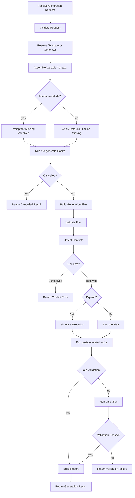

### Pipeline Stages

| Stage | Input | Output | Failure Code |
|-------|-------|--------|--------------|
| Validate Request | GenerationRequest | void | `INVALID_REQUEST`, `INVALID_NAME` |
| Resolve | type, template/generator id | TemplateDefinition or GeneratorDefinition | `TEMPLATE_NOT_FOUND`, `GENERATOR_NOT_FOUND` |
| Assemble Context | request + config + hooks | RenderContext | `MISSING_VARIABLE` |
| Interactive Prompt | missing variables | enriched context | `PROMPT_CANCELLED` |
| pre-generate Hook | context | modified context | — (hook failure logged) |
| Build Plan | definition + context | GenerationPlan | `PLAN_BUILD_ERROR` |
| Validate Plan | plan | void | `INVALID_PLAN` |
| Detect Conflicts | plan + filesystem | ConflictReport | `UNRESOLVED_CONFLICT` |
| Execute Plan | plan + policy | FileResults[] | `RENDER_ERROR`, `WRITE_ERROR` |
| post-generate Hook | results | void | — |
| Validate Output | project path | ValidationResult | `VALIDATION_FAILED` |
| Build Report | all results | GenerationReport | — |

### Generation Request Contract

| Field | Type | Required | Description |
|-------|------|----------|-------------|
| `type` | enum | yes | `project`, `module`, `api`, `docs`, `game`, `plugin` |
| `name` | string | yes | Target name (kebab-case) |
| `template` | string | no | Project or game template name |
| `generator` | string | no | Generator id (for module/api/docs/plugin) |
| `outputPath` | string | no | Output directory (default: `./{name}`) |
| `variables` | object | no | User-provided variables |
| `flags` | object | no | CLI flags (`dryRun`, `force`, `interactive`, etc.) |
| `overwritePolicy` | enum | no | Plan-level policy (default: `skip`) |
| `skipValidation` | boolean | no | Skip post-generation validation |

### Generation Result Contract

| Field | Type | Description |
|-------|------|-------------|
| `success` | boolean | Whether generation completed without errors |
| `type` | string | Generation type |
| `name` | string | Target name |
| `template` | string | Template or generator used |
| `outputPath` | string | Absolute output path |
| `files` | FileResult[] | Per-file results |
| `summary` | Summary | Counts: created, skipped, overwritten, errors |
| `validation` | ValidationResult | Post-generation validation (if run) |
| `durationMs` | number | Total duration |
| `dryRun` | boolean | Whether this was a dry-run |
| `nextSteps` | string[] | Suggested follow-up commands |

### Pipeline Sequence

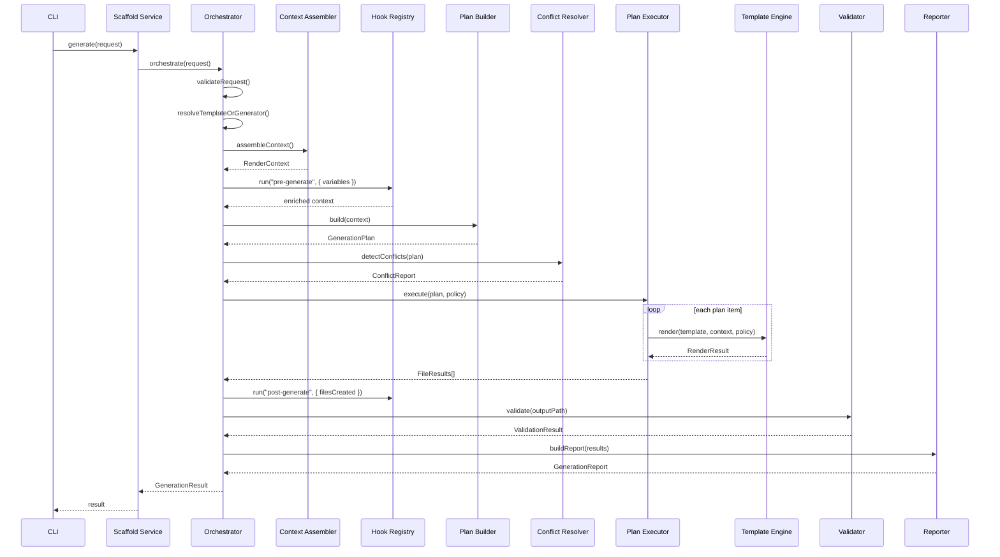

---

## Generation Plan

### Plan Structure

A generation plan is an ordered, immutable list of render operations produced before any file is written.

| Field | Type | Description |
|-------|------|-------------|
| `id` | string | Plan identifier (uuid) |
| `type` | string | Generation type |
| `name` | string | Target name |
| `items` | PlanItem[] | Ordered render operations |
| `metadata` | object | Template name, generator id, timestamps |
| `context` | RenderContext | Frozen variable context at plan time |

### Plan Item

| Field | Type | Required | Description |
|-------|------|----------|-------------|
| `id` | string | yes | Unique item id within plan |
| `templateId` | string | yes | Template to render |
| `templateVersion` | string | no | Pin to specific version |
| `outputPath` | string | yes | Resolved absolute output path |
| `context` | object | no | Item-specific context overrides |
| `overwritePolicy` | enum | no | Per-item policy override |
| `condition` | string | no | Skip item if expression is falsy |
| `phase` | string | no | Phase label for multi-phase plans (games) |
| `dependsOn` | string[] | no | Item ids that must complete first |

### Plan Building Rules

| Rule | Description |
|------|-------------|
| PB1 | Plan items are ordered; dependencies respected via `dependsOn` |
| PB2 | Output paths resolved at plan time using render context |
| PB3 | Duplicate output paths in same plan → `PLAN_DUPLICATE_OUTPUT` |
| PB4 | Conditional items evaluated at plan time; skipped items excluded from execution |
| PB5 | Plugin generators may return dynamic plan items based on context |
| PB6 | Multi-phase plans (games) group items by `phase`; phases execute sequentially |
| PB7 | Plan is immutable once built; re-plan required if context changes |

### Plan Example — API Generation

```yaml
id: plan-8f3a2b1c
type: api
name: users
items:
  - id: dto
    templateId: nestjs:dto
    outputPath: src/presentation/users/users.dto.ts
    context: { resourceName: users }
  - id: service
    templateId: nestjs:service
    outputPath: src/application/users/users.service.ts
    dependsOn: [dto]
  - id: controller
    templateId: nestjs:controller
    outputPath: src/presentation/users/users.controller.ts
    dependsOn: [service]
  - id: module
    templateId: nestjs:module-register
    outputPath: src/presentation/users/users.module.ts
    dependsOn: [controller]
  - id: spec
    templateId: nestjs:service-spec
    outputPath: src/application/users/users.service.spec.ts
    dependsOn: [service]
    condition: "{{ includeTests }}"
```

---

## File Generation

### File Generation Flow

Scaffolding delegates per-file rendering to the template engine. The scaffolding executor manages plan-level concerns; the template engine manages per-file write policies.

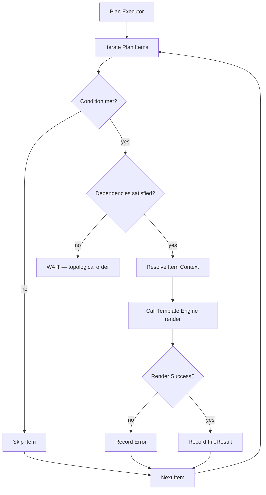

### File Actions

| Action | Description | Reported As |
|--------|-------------|---------------|
| `created` | New file written | `Created` |
| `skipped` | File exists; policy is `skip` | `Skipped` |
| `overwritten` | Existing file replaced | `Overwritten` |
| `dry-run` | Would write; no file created | `Dry-run` |
| `failed` | Render or write error | `Error` |
| `empty-skipped` | Rendered content empty; file not created | `Skipped (empty)` |

### Directory Operations

Before file generation, scaffolding ensures the output directory structure exists.

| Operation | When | Behavior |
|-----------|------|----------|
| Create output root | Project/game creation | Create `{outputPath}/` if not exists |
| Create parent dirs | Each file write | Create parent directories as needed |
| Initialize git | Project creation (default) | `git init` in output root |
| Copy static assets | Plan items with `type: copy` | Copy binary/static files without rendering |

### Static Asset Items

Plan items may reference static files (images, binary configs) that are copied without template rendering.

| Field | Type | Description |
|-------|------|-------------|
| `type` | `copy` | Indicates static copy, not render |
| `sourcePath` | string | Path to source asset |
| `outputPath` | string | Destination path |
| `overwritePolicy` | enum | Same policies as render items |

### Batch Execution Options

| Option | Default | Description |
|--------|---------|-------------|
| `stopOnError` | true | Abort plan on first render failure |
| `continueOnError` | false | Collect errors; complete remaining items |
| `parallel` | false | Execute independent items in parallel (future) |

---

## Conflict Resolution

Conflicts occur when generation would affect existing files or directories. Scaffolding detects conflicts at plan time before any write.

### Conflict Types

| Type | Detection | Example |
|------|-----------|---------|
| `FILE_EXISTS` | Output path points to existing file | `src/app.module.ts` already exists |
| `DIR_EXISTS` | Project output directory exists and is non-empty | `./my-game/` has files |
| `PATH_COLLISION` | Two plan items resolve to same output path | Duplicate template outputs |
| `NAME_COLLISION` | Generated symbol/name conflicts with existing | Module `auth` already exists |
| `GIT_DIRTY` | Target directory has uncommitted changes (future) | Modified files in output path |

### Conflict Detection Flow

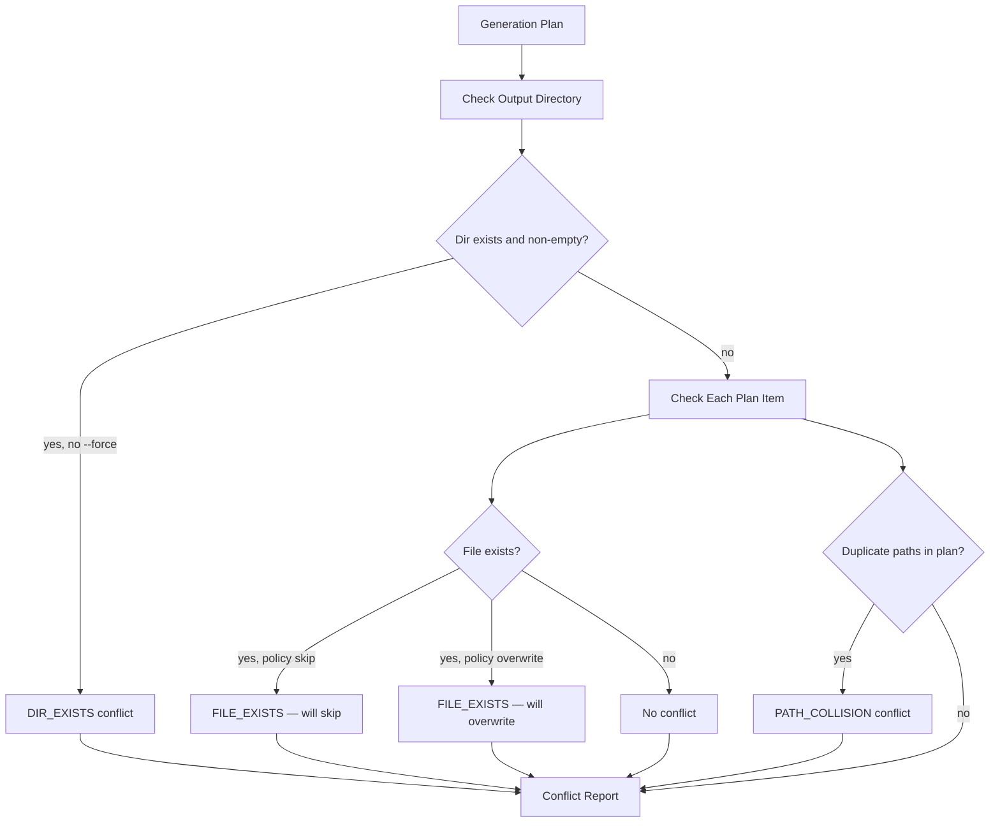

### Conflict Report

| Field | Type | Description |
|-------|------|-------------|
| `conflicts` | Conflict[] | List of detected conflicts |
| `resolvable` | boolean | Whether conflicts can proceed with current policy |
| `requiresForce` | boolean | Whether `--force` would resolve directory conflict |

### Conflict Object

| Field | Type | Description |
|-------|------|-------------|
| `type` | enum | Conflict type |
| `path` | string | Affected path |
| `severity` | enum | `warning`, `error` |
| `resolution` | enum | `skip`, `overwrite`, `abort`, `prompt` |
| `message` | string | Human-readable description |

### Resolution Strategies

| Strategy | Trigger | Behavior |
|----------|---------|----------|
| **Skip** | Default file policy | Existing files untouched; reported as skipped |
| **Overwrite** | `--force` or `overwrite` policy | Replace existing files |
| **Abort** | Unresolvable conflict | Stop before execution; return error |
| **Prompt** | Interactive mode + conflict | Ask user per conflict |
| **Merge** | Future | Merge generated content with existing (Phase 2) |

### Resolution Rules

| Rule | Description |
|------|-------------|
| CR1 | Directory conflicts require `--force` to proceed (project/game creation) |
| CR2 | File conflicts follow overwrite policy; default is skip |
| CR3 | Path collisions within a plan are always errors — plan must be fixed |
| CR4 | Interactive mode prompts for each `FILE_EXISTS` with skip/overwrite/abort options |
| CR5 | Dry-run reports conflicts without resolving them |
| CR6 | Name collisions within project are warnings in lenient mode, errors in strict mode |

### Conflict Resolution Example

```
Conflict Report
───────────────
⚠ FILE_EXISTS  src/domain/auth/auth.entity.ts (will skip)
⚠ FILE_EXISTS  src/application/auth/auth.service.ts (will skip)
✓ created      src/presentation/auth/auth.controller.ts
✗ PATH_COLLISION  Two items resolve to src/app.module.ts (abort)

Resolution: 1 created, 2 skipped, 1 error
Suggestion: Fix plan duplicate or use --force to overwrite skipped files
```

---

## Overwrite Policy

Overwrite policy controls whether existing files and directories are replaced. Policy operates at two levels: plan-level (CLI flags) and file-level (per plan item or template default).

### Policy Levels

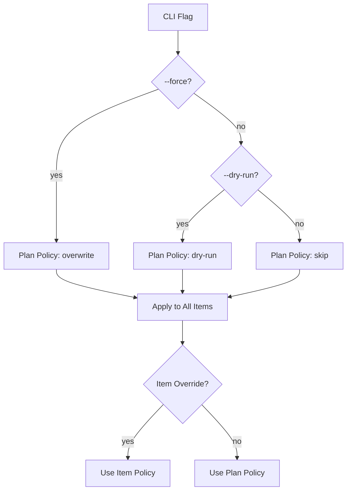

### Policy Values

| Policy | File Behavior | Directory Behavior | Default |
|--------|---------------|-------------------|---------|
| `skip` | Do not write if file exists | Abort if dir exists and non-empty | yes |
| `overwrite` | Replace existing file | Proceed; may overwrite files in dir | no |
| `dry-run` | Validate and report; no writes | Validate and report | no |
| `merge` | Merge with existing (future) | N/A | no |

### Policy Precedence

Highest wins:

| Priority | Source | Example |
|----------|--------|---------|
| 1 (highest) | Per-item `overwritePolicy` in plan | Generator sets `overwrite` for config |
| 2 | CLI `--force` flag | Forces `overwrite` at plan level |
| 3 | CLI `--dry-run` flag | Forces `dry-run` at plan level |
| 4 | Project config `.genesis/config.yml` | `generation.overwritePolicy: skip` |
| 5 (lowest) | System default | `skip` |

### Policy Matrix

| Scenario | Default | `--force` | `--dry-run` |
|----------|---------|-----------|-------------|
| New project, empty dir | Create all files | Create all files | Report all files |
| New project, dir exists | Abort | Overwrite files | Report + warn |
| Module in existing project | Skip existing files | Overwrite existing files | Report all |
| Re-run same generation | Skip all (idempotent) | Overwrite all | Report all |

### Destructive Operation Safeguards

| Safeguard | Description |
|-----------|-------------|
| S1 | `--force` on project creation requires confirmation in interactive mode |
| S2 | Overwriting > 10 files logs a warning listing affected paths |
| S3 | Overwrite policy never deletes files not in the generation plan |
| S4 | Git-initialized projects: overwrite never touches `.git/` directory |
| S5 | Dry-run never modifies filesystem, even with `--force` |

---

## Dry-Run Mode

Dry-run mode validates the full generation pipeline and reports what would be created without writing any files.

### Activation

| Method | Behavior |
|--------|----------|
| CLI flag `--dry-run` | Enable dry-run for this invocation |
| API `flags.dryRun: true` | Enable dry-run programmatically |
| Plan policy `dry-run` | Per-plan dry-run |

### Dry-Run Behavior

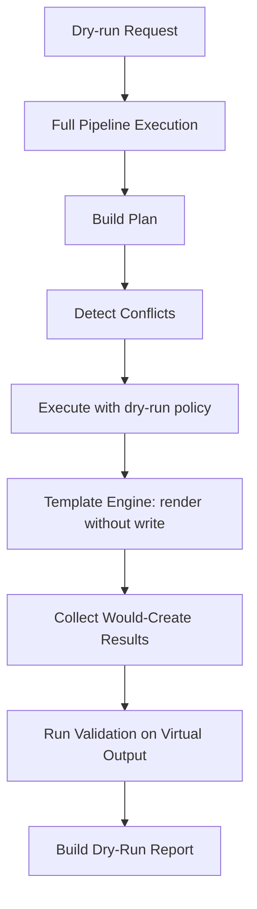

| Stage | Dry-Run Behavior |
|-------|------------------|
| Request validation | Normal |
| Context assembly | Normal |
| Hook execution | Normal (pre-generate runs) |
| Plan building | Normal |
| Conflict detection | Normal |
| File rendering | Render to memory; no filesystem write |
| post-generate hooks | Run with virtual file list |
| Validation | Run against rendered content (in-memory) |
| Git init | Skipped |

### Dry-Run Report Format

```
Genesis — Dry-Run Report
────────────────────────
Project:    my-game
Template:   mobile-rpg
Output:     ./my-game
Policy:     dry-run

Would create:  47 files
Would skip:    0 files
Would overwrite: 0 files
Errors:        0

Files:
  + docs/GDD.md
  + docs/ARCHITECTURE.md
  + backend/src/main.ts
  + backend/src/app.module.ts
  ...
  + unity/Assets/Scripts/GameManager.cs

Validation: PASS (dry-run)
Duration:   0.8s

Run without --dry-run to create files.
```

### Dry-Run API Result

| Field | Type | Description |
|-------|------|-------------|
| `dryRun` | `true` | Always true |
| `files` | FileResult[] | Each with `action: "dry-run"` and `content` preview |
| `plan` | GenerationPlan | Full plan for inspection |
| `conflicts` | ConflictReport | Detected conflicts |
| `validation` | ValidationResult | In-memory validation result |

---

## Interactive Mode

Interactive mode prompts the user for missing variables and conflict resolution decisions. Enabled when stdin is a TTY and not explicitly disabled.

### Activation

| Condition | Interactive |
|-----------|-------------|
| stdin is TTY, no `--no-interactive` | yes |
| stdin is not TTY (CI) | no |
| `--no-interactive` flag | no |
| `--interactive` flag | yes (force) |
| Missing required variable, non-interactive | error (`MISSING_VARIABLE`) |

### Prompt Flow

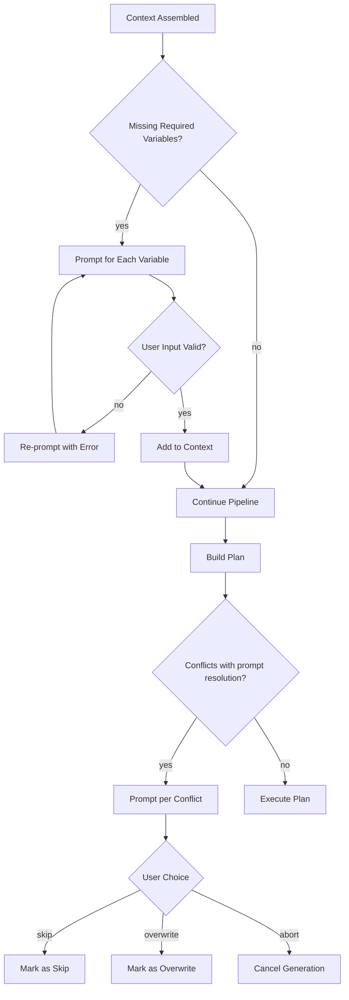

### Variable Prompts

Prompts are generated from variable definitions in templates and generators.

| Variable Property | Prompt Behavior |
|-------------------|-----------------|
| `name` | Display label |
| `description` | Help text below prompt |
| `type` | Input validation (string, number, boolean, select) |
| `enum` | Selection list |
| `default` | Pre-filled value; Enter accepts default |
| `required` | Cannot skip without value |

**Example prompt session:**

```
Genesis — Create Project
────────────────────────
? Project name: my-game
? Author name: (Project Genesis) Team Alpha
? License: (MIT)
  › MIT
    Apache-2.0
    Proprietary
? Template: (default)
  › default
    backend-api
    mobile-game
? Include tests? (Y/n) Y

Generating project "my-game" with template "mobile-game"...
```

### Conflict Prompts

```
Conflict: src/domain/auth/auth.entity.ts already exists.
  [s] Skip (keep existing)
  [o] Overwrite
  [a] Abort generation
? Choice (s): s
```

### Interactive Prompt Contract

| Field | Type | Description |
|-------|------|-------------|
| `name` | string | Variable or conflict identifier |
| `message` | string | Prompt text |
| `type` | enum | `input`, `confirm`, `select`, `multiselect` |
| `choices` | string[] | Options for select types |
| `default` | any | Default value |
| `validate` | function | Input validation; returns error message or true |

### Cancellation

| Action | Result |
|--------|--------|
| Ctrl+C during prompt | `PROMPT_CANCELLED`; exit code 1 |
| Abort on conflict | `GENERATION_CANCELLED`; exit code 1 |
| Empty required input | Re-prompt with validation error |

---

## Variables

### Variable Sources

The render context is assembled from multiple sources in priority order (highest wins).

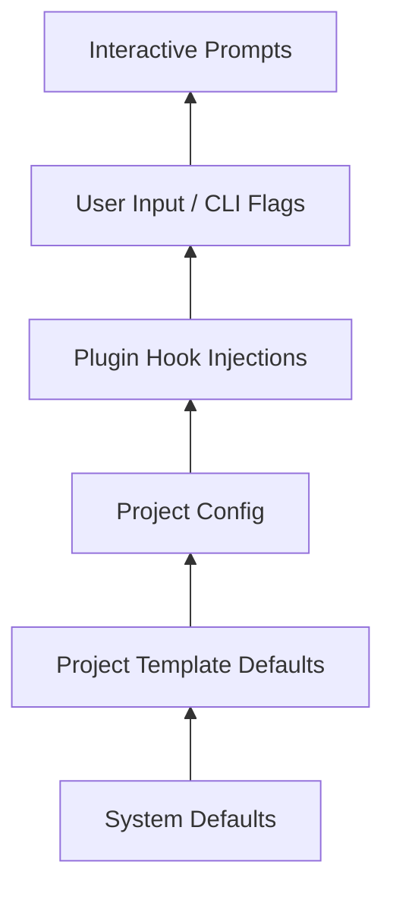

| Priority | Source | Variables | Example |
|----------|--------|-----------|---------|
| 1 (lowest) | System defaults | `genesisVersion`, `createdAt`, `year` | `genesisVersion: "1.0.0"` |
| 2 | Project template | Template-defined defaults | `license: "MIT"` |
| 3 | Project config | `.genesis/config.yml` | `author: "Team"` |
| 4 | Plugin hooks | `pre-generate` injections | `unityVersion: "2022.3"` |
| 5 | User input | CLI flags and arguments | `--author "Team"` |
| 6 (highest) | Interactive prompts | User-provided at runtime | `projectName: "my-game"` |

### Built-in System Variables

| Variable | Type | Description |
|----------|------|-------------|
| `genesisVersion` | string | Running Genesis framework version |
| `createdAt` | string | ISO8601 timestamp of generation |
| `year` | number | Current year |
| `projectName` | string | Target project/module name |
| `projectNameCamel` | string | camelCase variant |
| `projectNamePascal` | string | PascalCase variant |
| `projectNameKebab` | string | kebab-case variant |
| `projectNameSnake` | string | snake_case variant |
| `outputPath` | string | Absolute output directory |
| `templateName` | string | Project or game template name |
| `generatorId` | string | Generator id (module/api/docs) |
| `includeTests` | boolean | Whether to generate test files |
| `author` | string | Author name from config or prompt |
| `license` | string | License identifier |

### Variable Expressions

Project templates and generators may define variables as expressions resolved at plan time:

| Expression | Resolves To |
|------------|-------------|
| `"{{input.name}}"` | User-provided name |
| `"{{config.author}}"` | Project config value |
| `"{{projectNamePascal}}"` | Derived naming variable |
| `"{{genesisVersion}}"` | System variable |

Expression syntax follows [002-template-engine](../002-template-engine/FUNCTIONAL_SPEC.md).

### Variable Validation

| Rule | Error Code |
|------|------------|
| Required variable missing | `MISSING_VARIABLE` |
| Type mismatch (string expected, number given) | `TYPE_MISMATCH` |
| Value not in enum | `INVALID_ENUM_VALUE` |
| Name fails naming convention | `INVALID_NAME` |
| Reserved name used | `RESERVED_NAME` |

### Naming Conventions

| Target | Convention | Validation |
|--------|------------|------------|
| Project name | kebab-case | `^[a-z][a-z0-9-]*$` |
| Module name | kebab-case | `^[a-z][a-z0-9-]*$` |
| API resource | kebab-case plural | `^[a-z][a-z0-9-]*s$` |
| Plugin name | kebab-case | `^[a-z][a-z0-9-]*$` |
| Class names | PascalCase | Derived via naming helpers |

---

## Rendering

Scaffolding does not render templates directly. It delegates all rendering to the **Template Engine** ([002-template-engine](../002-template-engine/)).

### Rendering Delegation

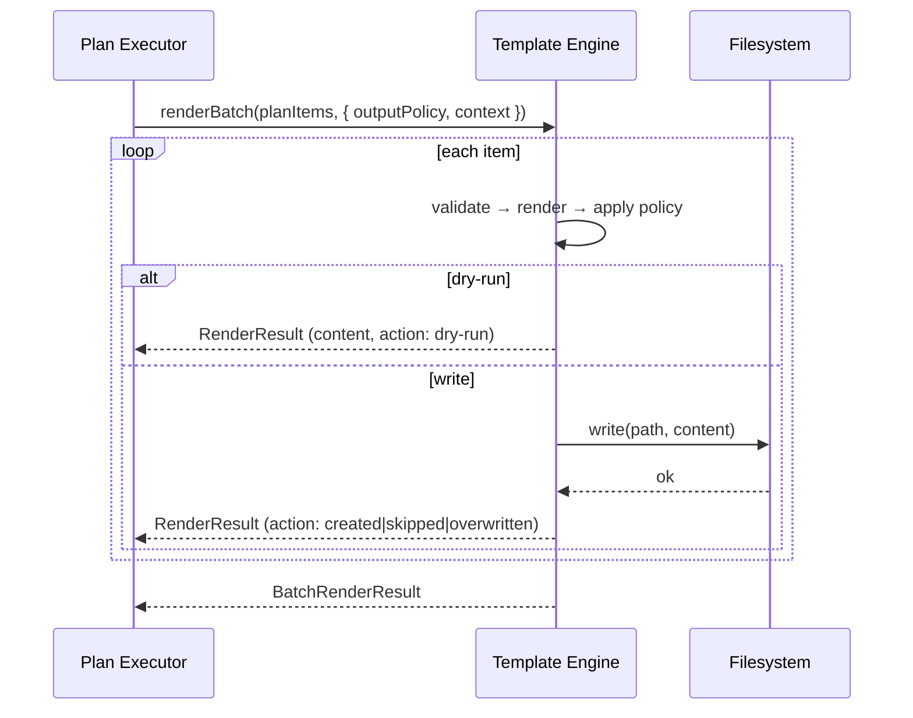

### Render Request (per plan item)

| Field | Type | Description |
|-------|------|-------------|
| `templateId` | string | Template identifier |
| `version` | string | Optional version pin |
| `context` | object | Merged global + item context |
| `outputPath` | string | Resolved absolute path |
| `outputPolicy` | enum | `skip`, `overwrite`, `dry-run` |

### Scaffolding Rendering Responsibilities

| Responsibility | Owner |
|----------------|-------|
| Build render context | Scaffolding (Context Assembler) |
| Resolve template id → source | Template Engine (Template Discovery) |
| Parse, validate, evaluate template | Template Engine |
| Apply output policy per file | Template Engine (with policy from Scaffolding) |
| Write file to disk | Template Engine (File Output Writer) |
| Report per-file result | Template Engine → Scaffolding aggregates |

### Rendering Rules

| Rule | Description |
|------|-------------|
| RN1 | Scaffolding never calls template engine for plan items with `condition: false` |
| RN2 | Empty rendered content → file not created; reported as `empty-skipped` |
| RN3 | Template engine `stopOnError` aligns with scaffolding batch policy |
| RN4 | Output path must be within project root or specified output directory |
| RN5 | Path traversal (`../`) in resolved output paths → `INVALID_OUTPUT_PATH` |

---

## Validation

Post-generation validation ensures output meets architecture and quality standards. Validation runs after file generation unless `--skip-validation` is set.

### Validation Flow

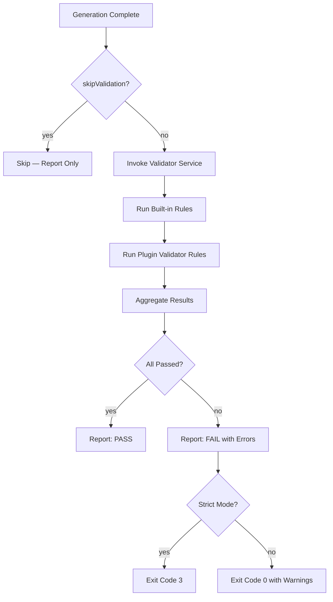

### Validation Scope by Generation Type

| Type | Validation Rules |
|------|------------------|
| Project | Required files (README, config, gitignore), directory structure |
| Module | Layer boundaries, naming conventions, no circular imports |
| API | Controller/service/DTO structure, OpenAPI conventions |
| Documentation | Required sections, valid markdown, frontmatter |
| Game | Full project + game-specific (Unity project, backend compiles) |
| Plugin | Manifest schema, GenesisPlugin contract, test structure |

### Built-in Validation Rules

| Rule ID | Scope | Severity | Description |
|---------|-------|----------|-------------|
| `STRUCT-001` | project | error | `README.md` exists |
| `STRUCT-002` | project | error | `.genesis/config.yml` exists |
| `STRUCT-003` | project | warning | `.gitignore` exists |
| `NAME-001` | all | error | Names follow naming standard |
| `ARCH-001` | module | error | Domain layer has no infrastructure imports |
| `ARCH-002` | module | warning | Each layer has expected directory |
| `API-001` | api | error | Controller has corresponding service |
| `API-002` | api | warning | DTOs use validation decorators |
| `DOC-001` | docs | warning | Markdown has no broken internal links |
| `PLUGIN-001` | plugin | error | `genesis.plugin.json` valid |
| `PLUGIN-002` | plugin | error | Exports GenesisPlugin contract |

### Validation Modes

| Mode | Behavior |
|------|----------|
| `normal` | Errors fail validation; warnings reported |
| `strict` | Errors and warnings fail validation |
| `lenient` | Only errors fail; warnings ignored in exit code |

### Validation Result

| Field | Type | Description |
|-------|------|-------------|
| `passed` | boolean | Whether validation succeeded |
| `errors` | ValidationIssue[] | Error-level issues |
| `warnings` | ValidationIssue[] | Warning-level issues |
| `durationMs` | number | Validation duration |

### Validation Failure Behavior

| Scenario | Behavior |
|----------|----------|
| Validation fails in normal mode | Exit code 3; files remain (not rolled back in v1) |
| Validation fails in dry-run | Report failure; no files exist |
| `--skip-validation` | Validation skipped; warning logged |
| Future: rollback on failure | Delete created files; restore state |

---

## Project Templates

Project templates define what a `genesis create` produces. Templates are YAML files discovered from built-in and plugin sources.

### Template Discovery

| Priority | Path | Source |
|----------|------|--------|
| 1 | `@genesis/scaffolding/templates/` | Built-in |
| 2 | Plugin `templates/` directories | Plugin-contributed |
| 3 | `.genesis/templates/` | Project-local (future) |

### Project Template Schema

| Field | Type | Required | Description |
|-------|------|----------|-------------|
| `name` | string | yes | Template identifier |
| `description` | string | yes | Human-readable summary |
| `type` | enum | no | `project`, `game` (default: `project`) |
| `version` | string | yes | Template version |
| `plugins` | string[] | no | Required plugins |
| `generators` | GeneratorRef[] | yes | Ordered generator list |
| `variables` | object | no | Default variables |
| `phases` | Phase[] | no | Multi-phase config (games) |
| `postCreate` | string[] | no | Suggested commands after creation |

### Project Template Example

```yaml
name: mobile-game
description: Mobile game with Unity client and NestJS backend
type: project
version: "1.0.0"
plugins:
  - "@genesis/plugin-unity"
  - "@genesis/plugin-nestjs"
generators:
  - id: project-structure
    templates:
      - docs/readme
      - docs/architecture
      - config/genesis-config
      - config/gitignore
  - id: unity:project
    plugin: "@genesis/plugin-unity"
  - id: nestjs:api
    plugin: "@genesis/plugin-nestjs"
variables:
  projectName: "{{input.name}}"
  author: "{{config.author}}"
  license: "MIT"
  includeTests: true
postCreate:
  - "cd {{projectName}}"
  - "genesis validate"
```

---

## Error Handling

### Error Hierarchy

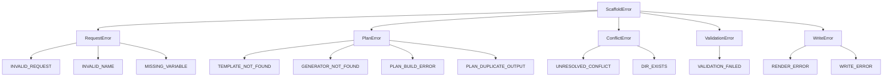

### Error Codes

| Code | Category | Severity | Description |
|------|----------|----------|-------------|
| `INVALID_REQUEST` | Request | Error | Malformed generation request |
| `INVALID_NAME` | Request | Error | Name fails naming convention |
| `MISSING_VARIABLE` | Request | Error | Required variable not provided |
| `PROMPT_CANCELLED` | Request | Error | User cancelled interactive prompt |
| `TEMPLATE_NOT_FOUND` | Plan | Error | Project template not found |
| `GENERATOR_NOT_FOUND` | Plan | Error | Generator id not registered |
| `PLAN_BUILD_ERROR` | Plan | Error | Failed to build generation plan |
| `PLAN_DUPLICATE_OUTPUT` | Plan | Error | Two items resolve to same path |
| `INVALID_PLAN` | Plan | Error | Plan validation failed |
| `UNRESOLVED_CONFLICT` | Conflict | Error | Conflicts cannot proceed with current policy |
| `DIR_EXISTS` | Conflict | Error | Output directory exists; `--force` required |
| `PATH_COLLISION` | Conflict | Error | Duplicate paths within plan |
| `RENDER_ERROR` | Write | Error | Template rendering failed |
| `WRITE_ERROR` | Write | Error | Filesystem write failed |
| `VALIDATION_FAILED` | Validation | Error | Post-generation validation failed |
| `GENERATION_CANCELLED` | Request | Error | User aborted during conflict resolution |

### Error Message Format

```
Scaffold Error [DIR_EXISTS]
─────────────────────────
Type:     project
Name:     my-game
Output:   ./my-game
Message:  Output directory exists and is not empty (12 files).

Suggestion: Use --force to overwrite or choose a different output path.
```

---

## Public API

### Scaffold Service

| Method | Input | Output | Description |
|--------|-------|--------|-------------|
| `createProject(request)` | CreateProjectRequest | GenerationResult | Create new project |
| `createGame(request)` | CreateGameRequest | GenerationResult | Create game project |
| `generateModule(request)` | GenerateModuleRequest | GenerationResult | Generate module |
| `generateApi(request)` | GenerateApiRequest | GenerationResult | Generate API |
| `generateDocs(request)` | GenerateDocsRequest | GenerationResult | Generate documentation |
| `generatePlugin(request)` | GeneratePluginRequest | GenerationResult | Generate plugin package |
| `generate(request)` | GenerationRequest | GenerationResult | Generic generation by type |
| `preview(request)` | GenerationRequest | DryRunResult | Dry-run without writing |
| `listTemplates()` | — | TemplateInfo[] | List project templates |
| `listGenerators(filter?)` | optional filter | GeneratorInfo[] | List available generators |

### Generation Plan Builder API

| Method | Description |
|--------|-------------|
| `buildFromTemplate(template, context)` | Build plan from project template |
| `buildFromGenerator(generator, context)` | Build plan from generator definition |
| `validate(plan)` | Validate plan structure and paths |
| `detectConflicts(plan, policy)` | Detect filesystem conflicts |

### Context Assembler API

| Method | Description |
|--------|-------------|
| `assemble(request, definition)` | Merge all variable sources |
| `getMissingRequired(context, definition)` | List unresolved required variables |
| `applyNamingConventions(name)` | Derive camel, Pascal, kebab, snake variants |

---

## Examples

### Example 1 — Create Default Project

**Command:**

```bash
genesis create my-app --template default
```

**Pipeline:**

1. Resolve template `default`
2. Assemble context: `{ projectName: "my-app", author: "...", license: "MIT" }`
3. Build plan: 4 templates (README, config, gitignore, genesis config)
4. No conflicts (new directory)
5. Execute: 4 files created
6. Validate: PASS
7. Report with next steps

**Output:**

```
Genesis — Generation Report
───────────────────────────
Project:    my-app
Template:   default
Duration:   0.4s

Created:    4 files
Skipped:    0 files
Errors:     0

Validation: PASS

Next steps:
  cd my-app
  genesis validate
```

### Example 2 — Generate API with Dry-Run

**Command:**

```bash
genesis generate api users --dry-run
```

**Pipeline:**

1. Resolve generator `nestjs:api`
2. Context: `{ resourceName: "users", includeTests: true }`
3. Build plan: 5 items (dto, service, controller, module, spec)
4. Execute with dry-run policy
5. Report would-create files

**Dry-run output:**

```
Would create:  5 files
  + src/presentation/users/users.dto.ts
  + src/application/users/users.service.ts
  + src/presentation/users/users.controller.ts
  + src/presentation/users/users.module.ts
  + src/application/users/users.service.spec.ts

Run without --dry-run to create files.
```

### Example 3 — Interactive Game Creation

**Command:**

```bash
genesis create game my-rpg --interactive
```

**Prompt session:**

```
? Game name: my-rpg
? Template: mobile-rpg
? Genre: RPG
? Target platform:
  › iOS + Android
    iOS only
    Android only
? Monetization model:
  › free-to-play
    premium
    subscription
? Include backend API? (Y/n) Y
? Include Unity client? (Y/n) Y
```

**Pipeline:**

1. Multi-phase plan: Docs (6 files) → Structure (8 files) → Backend (24 files) → Unity (18 files) → DevOps (4 files) → AI OS (12 files)
2. Total: 72 files across 6 phases
3. Validation: full project check

### Example 4 — Module Generation with Conflict

**Command:**

```bash
genesis generate module auth
```

**Scenario:** `auth.entity.ts` already exists.

**Conflict report:**

```
Created:    3 files
Skipped:    2 files (already exist)
  - src/domain/auth/auth.entity.ts
  - src/application/auth/auth.service.ts
Errors:     0

Validation: PASS
```

**With `--force`:**

```
Created:    1 file
Overwritten: 2 files
Errors:     0
```

### Example 5 — Generate Documentation

**Command:**

```bash
genesis generate docs adr --name "Use Redis for Caching"
```

**Plan:**

| Template | Output |
|----------|--------|
| `docs:adr` | `docs/decisions/003-redis-caching.md` |

**Context:**

```yaml
title: "Use Redis for Caching"
status: "Proposed"
date: "2026-07-26"
deciders: ["Team Alpha"]
```

### Example 6 — Generate Plugin Package

**Command:**

```bash
genesis generate plugin analytics --capabilities command,template
```

**Generated structure:**

```
packages/plugins/analytics/
├── genesis.plugin.json
├── package.json
├── src/index.ts
├── templates/
├── tests/plugin.test.ts
└── README.md
```

**Manifest snippet:**

```json
{
  "name": "@genesis/plugin-analytics",
  "version": "0.1.0",
  "capabilities": ["command", "template"],
  "description": "Analytics plugin generated by Genesis"
}
```

### Example 7 — Full Mobile Game Project

**Command:**

```bash
genesis create game ocean-quest --template mobile-rpg --author "Studio X"
```

**Phase execution:**

```mermaid
gantt
    title Generation Phases
    dateFormat X
    axisFormat %s

    section Phases
    Documentation    :0, 1
    Structure        :1, 2
    Backend          :2, 4
    Unity            :4, 6
    DevOps           :6, 7
    AI OS            :7, 8
```

**Report summary:**

```
Project:     ocean-quest
Template:    mobile-rpg
Duration:    3.2s

Created:     72 files
Phases:      6/6 complete
Validation:  PASS

Next steps:
  cd ocean-quest
  cd backend && pnpm install
  Open unity/ in Unity Editor 2022.3+
  genesis validate
```

---

## Testing Requirements

### Unit Tests

| Area | Tests |
|------|-------|
| Context Assembler | Priority merging, naming conventions, missing detection |
| Plan Builder | Template → plan, generator → plan, conditions, dependencies |
| Conflict Resolver | File exists, dir exists, path collision, policy resolution |
| Overwrite Policy | Precedence, force flag, dry-run override |
| Variable Resolver | Expressions, validation, naming |

### Integration Tests

| Test | Description |
|------|-------------|
| Create default project | Full pipeline; verify file structure |
| Generate module | Within test project; verify layers |
| Dry-run | No files written; report matches plan |
| Interactive (mocked) | Prompt flow with mock prompter |
| Conflict skip | Existing files skipped with default policy |
| Conflict force | Existing files overwritten with `--force` |
| Validation failure | Exit code 3; errors reported |
| Plugin generator | Load mock generator; verify plan items |

### End-to-End Tests

| Test | Command | Assertion |
|------|---------|-----------|
| E2E create | `genesis create test-app` | Directory exists; README present |
| E2E dry-run | `genesis create test-app --dry-run` | No directory created |
| E2E generate | `genesis generate module test` | Module files in project |
| E2E validate | Post-create `genesis validate` | Exit code 0 |

---

## Related Documents

| Document | Relationship |
|----------|-------------|
| [README.md](README.md) | Parent specification overview |
| [001-cli/FUNCTIONAL_SPEC.md](../001-cli/FUNCTIONAL_SPEC.md) | `create` and `generate` commands |
| [002-template-engine/FUNCTIONAL_SPEC.md](../002-template-engine/FUNCTIONAL_SPEC.md) | Template rendering |
| [003-plugin-system/FUNCTIONAL_SPEC.md](../003-plugin-system/FUNCTIONAL_SPEC.md) | Generator registration |
| [006-game-generation/README.md](../006-game-generation/) | Game project orchestration |
| [007-backend/README.md](../007-backend/) | Backend generators |
| [008-unity/README.md](../008-unity/) | Unity generators |
| [DECISION_LOG.md](../../DECISION_LOG.md) | ADR-001, ADR-002 |

## Changelog

| Version | Date | Change |
|---------|------|--------|
| 1.0.0 | 2026-07-26 | Initial functional specification |
