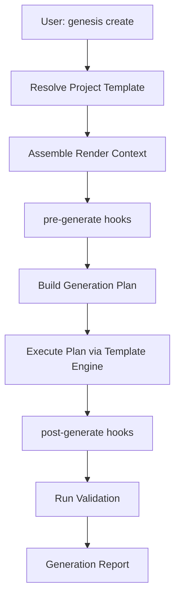

# Scaffolding Specification

## Purpose

Define the scaffolding engine that orchestrates project and module generation by combining templates, plugins, and validation into cohesive output. Scaffolding is the primary user-facing generation capability invoked via `genesis create`.

## Documents

| Document | Description |
|----------|-------------|
| [FUNCTIONAL_SPEC.md](FUNCTIONAL_SPEC.md) | **Complete functional specification** — architecture, pipeline, file generation, conflict resolution, overwrite policy, dry-run, interactive mode, variables, rendering, validation |
| This document | Overview, responsibilities, and implementation roadmap |

## Scope

### In Scope

- Project scaffolding (`genesis create <name>`)
- Module scaffolding within existing projects (`genesis generate <type>`)
- Generation plan creation and execution
- Variable context assembly from user input, config, and plugins
- Pre- and post-generation hooks
- Generation report (files created, skipped, errors)

### Out of Scope

- Template rendering mechanics (owned by [002-template-engine](../002-template-engine/))
- Plugin registration (owned by [003-plugin-system](../003-plugin-system/))
- End-to-end game generation orchestration (owned by [006-game-generation](../006-game-generation/))
- Individual technology generators (owned by plugin specs)

## Goals

| Goal | Success Criteria |
|------|------------------|
| **Complete** | `genesis create my-game` produces a runnable project skeleton |
| **Configurable** | Generation driven by project templates and user flags |
| **Idempotent** | Re-running with `skip` policy does not corrupt existing files |
| **Transparent** | Generation report lists every file action |
| **Extensible** | Plugins contribute generators and variables via hooks |
| **Validated** | Output passes architecture validation before completion |

## Responsibilities

### Generation Flow



| Component | Layer | Responsibility |
|-----------|-------|----------------|
| `ScaffoldOrchestrator` | Application | Coordinate the full generation flow |
| `ProjectTemplateResolver` | Application | Select project template by name or default |
| `ContextAssembler` | Application | Merge user input, config, and plugin variables |
| `GenerationPlan` | Domain | Ordered list of template renders with output paths |
| `GenerationPlanBuilder` | Domain | Build plan from project template definition |
| `GenerationReporter` | Application | Summarize files created, skipped, and errors |
| `ScaffoldService` | Application | Public API consumed by CLI |

### Project Templates

A project template defines what a `genesis create` produces:

```yaml
name: mobile-game
description: Mobile game project with Unity client and NestJS backend
plugins:
  - "@genesis/plugin-unity"
  - "@genesis/plugin-nestjs"
generators:
  - name: project-structure
    templates:
      - docs/readme
      - docs/architecture
      - config/genesis.config
  - name: unity-project
    plugin: "@genesis/plugin-unity"
    templates:
      - unity/scene-main
      - unity/script-game-manager
  - name: backend-project
    plugin: "@genesis/plugin-nestjs"
    templates:
      - backend/app-module
      - backend/health-controller
variables:
  projectName: "{{input.name}}"
  author: "{{config.author}}"
  license: "MIT"
```

### Module Generation

Within an existing project, `genesis generate <type>` scaffolds individual modules:

| Type | Example Command | Output |
|------|----------------|--------|
| `module` | `genesis generate module auth` | Domain/application/infrastructure module |
| `api` | `genesis generate api users` | REST controller, service, DTOs |
| `unity-system` | `genesis generate unity-system inventory` | Unity system scripts and SOs |
| `docs` | `genesis generate docs adr` | ADR from template |

Module generation uses the same plan → render → validate flow but scoped to a single generator.

### Context Assembly

The render context is assembled from sources in priority order (highest wins):

| Source | Variables | Example |
|--------|-----------|---------|
| User input | CLI flags and arguments | `--author "Team"` |
| Project config | `.genesis/config.yml` | `projectName`, `template` |
| Plugin hooks | `pre-generate` hook injections | Unity version, target platform |
| Project template | Template-defined defaults | `license`, `structure` |
| System defaults | Framework constants | `genesisVersion`, `createdAt` |

### Generation Report

After execution, the CLI displays:

```
Genesis — Generation Report
───────────────────────────
Project:    my-game
Template:   mobile-game
Duration:   1.2s

Created:    24 files
Skipped:    3 files (already exist)
Errors:     0

Next steps:
  cd my-game
  genesis validate
```

### Validation Integration

After generation, scaffolding invokes `@genesis/validator` to verify:

- Generated structure matches architecture rules
- Required files exist (README, config, gitignore)
- No standards violations in generated code

Validation failure returns exit code `3` with actionable errors.

## Dependencies

### Upstream Specifications

| Spec | Dependency |
|------|------------|
| [000-project](../000-project/) | Layer rules, package conventions |
| [001-cli](../001-cli/) | `create` and `generate` commands |
| [002-template-engine](../002-template-engine/) | Template rendering |
| [003-plugin-system](../003-plugin-system/) | Plugin generators and hooks |

### Packages

| Package | Usage |
|---------|-------|
| `@genesis/template-engine` | Render templates in generation plan |
| `@genesis/core` | Filesystem, config, logging, hook registry |
| `@genesis/shared` | Types, constants |
| `@genesis/validator` | Post-generation validation |

### Downstream Consumers

| Spec | Relationship |
|------|-------------|
| [006-game-generation](../006-game-generation/) | Uses scaffolding for full game project output |
| [007-backend](../007-backend/) | Contributes backend generators |
| [008-unity](../008-unity/) | Contributes Unity generators |

## Future Implementation

### Sprint 4 (M1) — Project Creation

- Create `packages/scaffolding` (rename from `packages/generators` scaffold)
- Implement `ScaffoldOrchestrator` and `GenerationPlanBuilder`
- Implement `ContextAssembler` with user input and defaults
- Define one built-in project template: `default` (docs + config only)
- Wire `genesis create <name>` in CLI
- Integration test: create project, verify file structure

### Phase 2 — Plugin Generators

- Plugin generators register via [003-plugin-system](../003-plugin-system/)
- `mobile-game` project template with Unity and NestJS plugins
- `genesis generate` subcommands for module types

### Phase 3 — Game Generation

- Full game project templates per [006-game-generation](../006-game-generation/)
- Multi-phase generation with dependency ordering

### Future — Advanced

- Interactive mode: `genesis create` with prompts for variables
- Generation rollback on validation failure
- Custom project templates in `.genesis/templates/`

## Related Documents

- [FUNCTIONAL_SPEC.md](FUNCTIONAL_SPEC.md) — Complete functional specification
- [002-template-engine](../002-template-engine/) — Template rendering
- [006-game-generation](../006-game-generation/) — Full game generation
- [001-cli](../001-cli/) — CLI commands

## Changelog

| Version | Date | Change |
|---------|------|--------|
| 1.0.1 | 2026-07-26 | Linked FUNCTIONAL_SPEC.md |
| 1.0.0 | 2026-07-26 | Initial approved specification |
