# Genesis AI Engine — Functional Specification

## Document Control

| Field | Value |
|-------|-------|
| **Specification** | [005-ai-engine](README.md) |
| **Status** | Approved |
| **Version** | 1.0.0 |
| **Independence** | Implementation-independent. No language, LLM SDK, or vector database technology is prescribed. |
| **Audience** | AI engineers, agent authors, platform architects, security reviewers, AI assistants |

## Purpose

Define the complete functional architecture of the **Genesis AI Engine** — the subsystem responsible for enabling AI-assisted software generation across Project Genesis. The engine provides context assembly, prompt management, knowledge retrieval, multi-provider LLM integration, autonomous agents, guardrails, evaluation, observability, and cost control. It serves both framework development workflows and AI-assisted features within generated game projects.

## Scope

### In Scope

- AI engine goals, architecture, and component model
- Context system: assembly, prioritization, token budgeting
- Prompt management: loading, composition, versioning, templates
- Knowledge retrieval: embeddings, vector stores, RAG pipelines
- Provider abstraction and multi-provider routing
- Agent architecture: types, communication, tool calling, planning
- Evaluation, guardrails, observability, cost optimization, security
- Future provider support: OpenAI, Anthropic, Gemini, open-source LLMs
- Public API contracts and integration boundaries

### Out of Scope

- Cursor IDE integration (owned by `.cursor/` AI operating system per ADR-008)
- Cursor workflow prompts in `.cursor/prompts/` (IDE-only, not runtime)
- In-game AI features (NPC dialogue, procedural content — game-level concern)
- Model training, fine-tuning, or hosting infrastructure
- Vector database implementation (consumes external services)
- Plugin loading mechanics ([003-plugin-system](../003-plugin-system/))
- CLI command parsing ([001-cli](../001-cli/))

---

## Goals

### Primary Goals

| ID | Goal | Success Criteria |
|----|------|------------------|
| G1 | **Context-aware** | Every AI operation receives complete, relevant, budgeted project context |
| G2 | **Provider-agnostic** | Switch LLM providers without changing agent or application code |
| G3 | **Prompt-as-asset** | Prompts are versioned, composable, testable assets per ADR-004 |
| G4 | **Retrieval-augmented** | Knowledge base queries improve answer accuracy via RAG |
| G5 | **Agent-capable** | Multi-step agents plan, execute, evaluate, and report autonomously |
| G6 | **Safe** | No secrets in prompts; outputs validated before delivery |
| G7 | **Observable** | Every AI call logged with cost, latency, tokens, and trace id |
| G8 | **Cost-controlled** | Token budgets enforced per operation, agent, and session |
| G9 | **Evaluated** | AI outputs scored against criteria before auto-apply |
| G10 | **Extensible** | New providers, agents, tools, and retrieval sources via plugins |

### Non-Functional Goals

| Attribute | Target |
|-----------|--------|
| Context assembly latency | < 2 seconds for standard project context |
| Provider failover | Automatic fallback to secondary provider within 5 seconds |
| RAG retrieval latency | < 500 ms for top-k retrieval (excluding embedding) |
| Agent step timeout | 60 seconds per step (configurable) |
| Session token budget | Configurable; default 100,000 tokens per session |
| Audit completeness | 100% of AI operations emit structured telemetry |

### Design Principles

1. **Context quality determines output quality** — Invest in assembly, prioritization, and retrieval before model selection.
2. **Prompts are versioned assets** — Treat prompts like code: version, review, test, and deprecate.
3. **Provider behind interface** — Application and agents depend on abstractions, not vendor SDKs.
4. **Guardrails by default** — Every request passes input validation; every response passes output filtering.
5. **Observe everything** — Cost, latency, tokens, and evaluation scores are never optional.
6. **Fail safe** — Budget exceeded, guardrail failure, or evaluation failure blocks auto-apply.
7. **Human in the loop** — Destructive or high-impact outputs require explicit approval unless configured otherwise.
8. **RAG augments, not replaces** — Retrieval supplements context; core specs and architecture always included.

---

## Architecture

### System Overview

```mermaid
flowchart TB
    subgraph consumers [Consumers]
        CLI[CLI — genesis ai]
        SCA[Scaffolding Engine]
        AGT[Custom Agents]
        GAME[Game Projects]
    end

    subgraph ai ["@genesis/ai — AI Engine"]
        subgraph app [Application Layer]
            AIS[AI Service]
            AO[Agent Orchestrator]
            CM[Context Manager]
            PM[Prompt Manager]
            PL[Planner]
            EV[Evaluator]
        end
        subgraph domain [Domain Layer]
            GR[Guardrail Engine]
            CP[Context Policy]
            PP[Prompt Policy]
            AP[Agent Policy]
            EP[Evaluation Policy]
            CB[Cost Budget]
        end
        subgraph retrieval [Retrieval Layer]
            KR[Knowledge Retriever]
            EM[Embedding Service]
            RAG[RAG Pipeline]
            VI[Vector Index Client]
        end
        subgraph providers [Provider Layer]
            PR[Provider Router]
            PA[Provider Adapter Interface]
            PMF[Provider Capability Matrix]
        end
        subgraph infra [Infrastructure Layer]
            CT[Cost Tracker]
            OB[Observability Bus]
            TR[Tool Registry]
            AC[Agent Communication Bus]
            FS[Filesystem]
            LOG[Logger]
        end
    end

    subgraph external [External Systems]
        PLUG[AI Provider Plugins]
        VDB[(Vector Database)]
        LLM[LLM APIs]
        KB[Knowledge Base]
    end

    CLI --> AIS
    SCA --> AIS
    AGT --> AO
    GAME --> AIS

    AIS --> CM
    AIS --> PM
    AIS --> AO
    AIS --> GR

    AO --> PL
    AO --> TR
    AO --> AC
    AO --> EV

    CM --> KR
    KR --> RAG
    RAG --> EM
    RAG --> VI
    VI --> VDB

    CM --> KB
    PM --> KB

    AIS --> PR
    PR --> PA
    PA --> PLUG
    PLUG --> LLM

    GR --> CB
    AIS --> CT
    AIS --> OB
```

### Layer Responsibilities

| Layer | Components | Responsibility |
|-------|------------|----------------|
| **Application** | AI Service, Agent Orchestrator, Context Manager, Prompt Manager, Planner, Evaluator | Orchestrate AI operations; public API |
| **Domain** | Guardrail Engine, policies, Cost Budget | Pure rules for safety, evaluation, and budgets |
| **Retrieval** | Knowledge Retriever, Embedding Service, RAG Pipeline, Vector Index Client | Semantic search and context augmentation |
| **Provider** | Provider Router, Provider Adapter, Capability Matrix | Route requests to LLM backends |
| **Infrastructure** | Cost Tracker, Observability Bus, Tool Registry, Agent Communication Bus | Telemetry, tools, inter-agent messaging |

### Component Model

| Component | Responsibility |
|-----------|----------------|
| **AI Service** | Public API entry point for all AI operations |
| **Agent Orchestrator** | Execute multi-step agent workflows |
| **Context Manager** | Assemble, prioritize, and budget project context |
| **Prompt Manager** | Load, version, compose, and render prompts |
| **Planner** | Decompose tasks into executable agent plans |
| **Evaluator** | Score AI outputs against quality criteria |
| **Guardrail Engine** | Validate inputs and filter outputs |
| **Knowledge Retriever** | Query knowledge base and vector index |
| **Embedding Service** | Generate vector embeddings for text |
| **RAG Pipeline** | Retrieve-augment-generate workflow |
| **Vector Index Client** | Interface to external vector database |
| **Provider Router** | Select provider by capability, cost, and availability |
| **Provider Adapter** | Uniform interface to LLM backends |
| **Cost Tracker** | Track token usage and enforce budgets |
| **Observability Bus** | Emit structured AI telemetry |
| **Tool Registry** | Register and dispatch agent tools |
| **Agent Communication Bus** | Inter-agent message passing |

### Package Boundaries

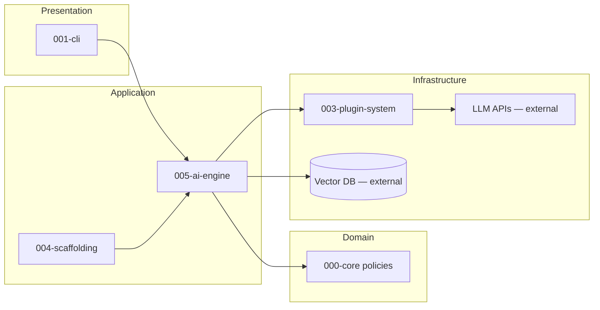

| Package | Relationship to AI Engine |
|---------|--------------------------|
| `@genesis/ai` | Owns AI engine implementation |
| `@genesis/core` | Config, logging, filesystem, hook registry |
| `@genesis/shared` | Types, constants, error codes |
| `@genesis/cli` | Dispatches `genesis ai` commands to AI Service |
| Plugin system | Registers AI provider plugins |
| External vector DB | Stores embeddings; queried by Vector Index Client |

### Relationship to Other Systems

| System | AI Engine Uses | AI Engine Provides |
|--------|----------------|-------------------|
| CLI | Command delegation, flags | `genesis ai plan`, `review`, `docs` |
| Plugin System | AI provider registry | Provider plugin contract |
| Scaffolding | Optional AI-assisted generation | Variable suggestions, doc generation |
| Template Engine | None (separate concern) | — |
| Game Generation | AI-assisted GDD, architecture docs | Context-aware game design assistance |
| Cursor IDE | None (parallel system per ADR-008) | — |

### Dual Prompt Systems

Project Genesis maintains two prompt systems with distinct roles:

| System | Location | Runtime | Purpose |
|--------|----------|---------|---------|
| **Cursor workflows** | `.cursor/prompts/` | IDE only | Interactive Cursor agent workflows |
| **Genesis prompts** | `prompts/` | AI Engine runtime | Composable blocks, templates, workflows |

The AI Engine loads exclusively from `prompts/`. Cursor prompts are not loaded at runtime.

---

## Context System

The context system assembles relevant project information into a token-budgeted payload for LLM requests.

### Context Architecture

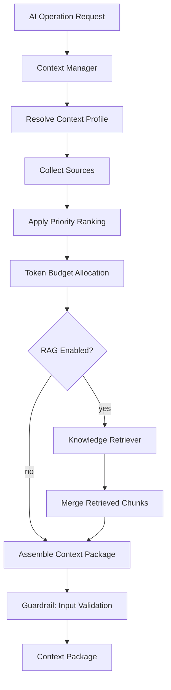

### Context Sources

| Source | Priority | Location | Content |
|--------|----------|----------|---------|
| Active task | Critical | `.cursor/context/CURRENT_TASK.md` | Current work item |
| Specifications | High | `specs/` (filtered by scope) | Relevant functional specs |
| Architecture | High | `.cursor/context/ARCHITECTURE.md` | System architecture |
| Standards | Medium | `standards/` (filtered by domain) | Applicable rules |
| Knowledge | Medium | `knowledge/` (retrieved) | Articles, patterns, decisions |
| Code | Medium | Files in operation scope | Source code, configs |
| Memories | Low | `.cursor/memories/` | Lessons learned, decisions |
| RAG chunks | Variable | Vector index | Semantically relevant passages |
| User input | High | CLI flags, agent input | Task-specific data |

### Context Profiles

Context profiles define which sources to include for different operation types.

| Profile | Sources | Token Budget | Use Case |
|---------|---------|--------------|----------|
| `minimal` | Task, user input | 4,000 | Quick completions |
| `standard` | Task, specs, architecture, code scope | 16,000 | Code generation, review |
| `full` | All sources + RAG | 64,000 | Planning, architecture analysis |
| `game-design` | Task, GDD, game knowledge, RAG | 32,000 | Game design assistance |
| `custom` | User-defined source list | Configurable | Project-specific workflows |

### Context Package Contract

| Field | Type | Description |
|-------|------|-------------|
| `profile` | string | Context profile used |
| `sources` | ContextSource[] | Included sources with metadata |
| `content` | string | Assembled context text |
| `tokenCount` | number | Estimated token count |
| `truncated` | boolean | Whether budget caused truncation |
| `excluded` | string[] | Sources excluded due to budget |
| `retrievedChunks` | RetrievedChunk[] | RAG results (if applicable) |
| `assembledAt` | ISO8601 | Assembly timestamp |
| `scope` | ContextScope | File paths, spec ids, domains in scope |

### Token Budget Allocation

When total context exceeds the budget, allocation follows priority tiers:

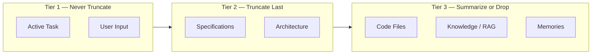

| Rule | Description |
|------|-------------|
| CTX-1 | Tier 1 sources are never truncated |
| CTX-2 | Tier 2 sources truncate from the end (least relevant sections) |
| CTX-3 | Tier 3 sources drop lowest-relevance items first |
| CTX-4 | RAG chunks ranked by similarity score; bottom-k dropped |
| CTX-5 | Code files in scope ranked by relevance (imports, same module) |
| CTX-6 | Truncation logged with `truncated: true` and `excluded` list |

### Context Scope Resolution

| Scope Type | Resolution |
|------------|------------|
| `file` | Single file and its imports |
| `directory` | All files under path |
| `spec` | Specific specification document |
| `package` | Monorepo package and dependencies |
| `project` | Entire Genesis project |
| `custom` | User-provided glob patterns |

### Exclusion Policy

The context system **never** includes:

| Excluded | Reason |
|----------|--------|
| `.env`, `*.pem`, `credentials.json` | Secrets |
| `node_modules/`, `dist/`, `.git/` | Noise and size |
| Binary files | Not text-processable |
| Files > 100 KB (default) | Token budget protection |
| Content matching secret patterns | API keys, tokens, passwords |

---

## Prompt Management

The prompt management subsystem loads, composes, versions, and renders prompts from `prompts/` assets.

### Prompt Asset Types

| Type | Location | Purpose |
|------|----------|---------|
| **Blocks** | `prompts/blocks/` | Reusable context sections (architecture, constraints, security) |
| **Templates** | `prompts/templates/` | Task-specific prompts with variable placeholders |
| **Workflows** | `prompts/workflows/` | Multi-step agent instruction sequences |
| **Examples** | `prompts/examples/` | Reference prompts for game dev patterns |

### Prompt Manager Architecture

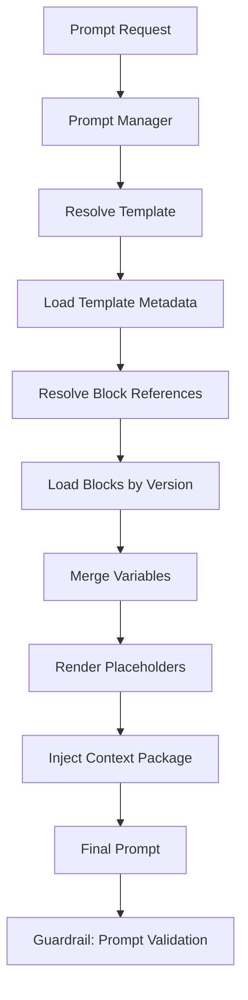

### Prompt Composition

Templates compose blocks in declared order:

```
prompts/templates/create-api.md
  ├── blocks/current-context.md
  ├── blocks/architecture.md
  ├── blocks/backend.md
  ├── blocks/security.md
  ├── blocks/constraints.md
  ├── blocks/task.md          (template-specific)
  └── blocks/output-format.md
```

### Prompt Template Metadata

Each template includes frontmatter metadata:

| Field | Required | Description |
|-------|----------|-------------|
| `id` | yes | Unique template identifier |
| `version` | yes | Semantic version |
| `name` | yes | Human-readable name |
| `description` | yes | Purpose summary |
| `blocks` | yes | Ordered list of block references |
| `variables` | no | Required and optional variables |
| `contextProfile` | no | Context profile to use (default: `standard`) |
| `agent` | no | Default agent type |
| `model` | no | Preferred model hint |
| `maxTokens` | no | Output token limit |
| `evaluationCriteria` | no | Criteria ids for Evaluator |
| `deprecated` | no | Deprecation flag |
| `replacedBy` | no | Successor template id |

### Variable Injection

| Variable Source | Syntax | Example |
|-----------------|--------|---------|
| Template variable | `{{variableName}}` | `{{moduleName}}` |
| Context injection | `{{context.section}}` | `{{context.architecture}}` |
| System variable | `{{system.genesisVersion}}` | Framework version |
| RAG chunk | `{{rag.chunks}}` | Retrieved passages |
| User input | `{{input.requirement}}` | CLI or agent input |

---

## Prompt Versioning

Prompts are versioned assets per ADR-004. Versioning applies to blocks, templates, and workflows independently.

### Versioning Model

| Asset | Version Field | Versioning Unit |
|-------|---------------|-----------------|
| Block | `version` in frontmatter | Individual block file |
| Template | `version` in frontmatter | Template + block version pins |
| Workflow | `version` in frontmatter | Workflow definition |

### Version Resolution

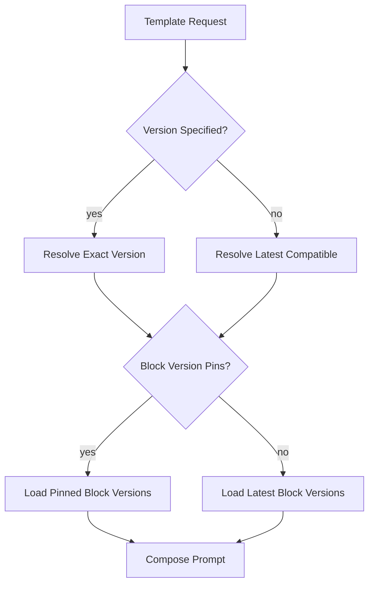

### Semver Rules

| Change | Bump | Example |
|--------|------|---------|
| Breaking output format or required variables | Major | `1.0.0` → `2.0.0` |
| New optional variable or block | Minor | `1.0.0` → `1.1.0` |
| Wording fix, no contract change | Patch | `1.0.0` → `1.0.1` |

### Block Version Pinning

Templates may pin block versions for reproducibility:

```yaml
blocks:
  - id: architecture
    version: "1.2.0"
  - id: constraints
    version: "^1.0.0"
  - id: task
    # unpinned — uses latest
```

### Deprecation

| Policy | Behavior |
|--------|----------|
| Deprecated template | Warning logged; still usable |
| Deprecated block | Warning if referenced without version pin |
| Removed major version | Error `PROMPT_NOT_FOUND`; migration guide in changelog |

### Prompt Changelog

Each prompt asset directory maintains a `CHANGELOG.md` tracking version history, consistent with specification versioning practices.

---

## Prompt Templates

### Built-in Template Catalog

| Template ID | Purpose | Agent | Context Profile |
|-------------|---------|-------|-----------------|
| `create-feature` | Implement a new feature | Planner + Coder | full |
| `create-api` | Design and scaffold API | Planner | standard |
| `create-backend` | Backend module generation | Planner | standard |
| `create-unity` | Unity system scripts | Planner | standard |
| `review-code` | Code review | Reviewer | standard |
| `fix-bug` | Bug diagnosis and fix | Planner + Coder | full |
| `generate-docs` | Documentation generation | Documenter | standard |
| `refactor` | Refactoring plan | Planner | full |
| `optimize` | Performance optimization | Detector + Planner | full |
| `write-tests` | Test generation | Coder | standard |

### Workflow Templates

Workflows define multi-step agent sequences:

| Workflow ID | Steps | Output |
|-------------|-------|--------|
| `feature-development` | Plan → Implement → Test → Review | Feature with tests |
| `bug-fixing` | Detect → Diagnose → Fix → Verify | Bug fix with regression test |
| `architecture-review` | Analyze → Report → Recommend | Architecture review document |
| `code-review` | Read → Analyze → Report | Review comments |
| `documentation` | Diff → Generate → Validate | Updated documentation |

### Template Rendering Pipeline

| Stage | Input | Output |
|-------|-------|--------|
| Resolve template | template id, version | TemplateDescriptor |
| Load blocks | block refs + versions | Block contents |
| Merge variables | template vars + context + input | Variable map |
| Render placeholders | blocks + variables | Composed prompt body |
| Inject context | context package | Final prompt with project context |
| Validate | prompt + guardrails | Validated prompt or error |

---

## Knowledge Retrieval

Knowledge retrieval supplements context assembly with semantically relevant content from the project knowledge base.

### Knowledge Sources

| Source | Indexing | Retrieval Method |
|--------|----------|------------------|
| `knowledge/` articles | Embedded on index | Semantic similarity |
| `specs/` documents | Embedded on index | Semantic + metadata filter |
| `standards/` rules | Embedded on index | Domain filter + similarity |
| `docs/` project docs | Embedded on index | Semantic similarity |
| Code comments and docstrings | Embedded on index | File scope filter |
| Agent memory (future) | Embedded per session | Session-scoped retrieval |

### Retrieval Architecture

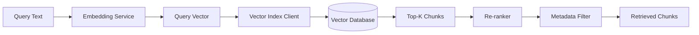

### Retrieval Request Contract

| Field | Type | Description |
|-------|------|-------------|
| `query` | string | Natural language or keyword query |
| `topK` | number | Maximum chunks to return (default: 5) |
| `minScore` | number | Minimum similarity threshold (default: 0.7) |
| `filters` | object | Metadata filters (domain, type, date) |
| `scope` | ContextScope | Limit to file paths or packages |
| `includeSources` | string[] | Restrict to specific source types |

### Retrieved Chunk Contract

| Field | Type | Description |
|-------|------|-------------|
| `id` | string | Chunk identifier |
| `content` | string | Text content |
| `source` | string | Origin path or id |
| `sourceType` | enum | `knowledge`, `spec`, `standard`, `code`, `doc` |
| `score` | number | Similarity score (0–1) |
| `metadata` | object | Title, section, tags, date |
| `tokenCount` | number | Estimated tokens |

### Indexing Pipeline

| Stage | Trigger | Action |
|-------|---------|--------|
| Full index | `genesis ai index` or CI | Embed all knowledge sources |
| Incremental | File change watcher (future) | Re-embed changed files |
| On-demand | First retrieval in session | Lazy index if not exists |

### Indexing Rules

| Rule | Description |
|------|-------------|
| IDX-1 | Chunks are 512 tokens with 64-token overlap (default) |
| IDX-2 | Secrets and excluded paths are never indexed |
| IDX-3 | Each chunk stores source metadata for citation |
| IDX-4 | Index is project-scoped; no cross-project leakage |
| IDX-5 | Embedding model is configurable per project |

---

## Vector Databases

The AI Engine does not implement a vector database. It consumes external vector store services through the **Vector Index Client** abstraction.

### Supported Backends (Future)

| Backend | Deployment | Priority | Use Case |
|---------|------------|----------|----------|
| **Local (SQLite + sqlite-vec)** | Embedded | Phase 4 | Development, offline, zero-config |
| **Pinecone** | Cloud | Phase 4+ | Production, managed scale |
| **Weaviate** | Self-hosted or cloud | Future | Multi-tenant, hybrid search |
| **Chroma** | Local or server | Future | Lightweight prototyping |
| **pgvector** | PostgreSQL extension | Future | Existing Postgres infrastructure |

### Vector Index Client Contract

| Method | Input | Output | Description |
|--------|-------|--------|-------------|
| `upsert` | chunks[], embeddings[] | void | Store or update vectors |
| `query` | vector, topK, filters | ScoredChunk[] | Similarity search |
| `delete` | chunk ids | void | Remove vectors |
| `deleteBySource` | source path | void | Remove all chunks from source |
| `stats` | — | IndexStats | Count, dimensions, last indexed |

### Vector Storage Schema (Abstract)

| Field | Type | Description |
|-------|------|-------------|
| `id` | string | Unique chunk id |
| `embedding` | float[] | Vector (dimensions per model) |
| `content` | string | Original text |
| `source` | string | File path or document id |
| `sourceType` | string | knowledge, spec, code, etc. |
| `metadata` | object | Title, section, tags, hash |
| `indexedAt` | timestamp | Index timestamp |

### Configuration

```yaml
# .genesis/config.yml
ai:
  vectorStore:
    provider: local  # local | pinecone | weaviate | pgvector
    dimensions: 1536
    indexName: genesis-knowledge
    # Provider-specific options
    local:
      path: .genesis/vector-index
    pinecone:
      environment: us-east-1
      index: genesis-prod
```

---

## Embeddings

The **Embedding Service** generates vector representations of text for indexing and retrieval.

### Embedding Model Support

| Model | Provider | Dimensions | Priority |
|-------|----------|------------|----------|
| `text-embedding-3-small` | OpenAI | 1536 | Default |
| `text-embedding-3-large` | OpenAI | 3072 | High-accuracy |
| `voyage-2` | Voyage (via plugin) | 1024 | Future |
| `nomic-embed-text` | Ollama (local) | 768 | Offline development |
| `all-MiniLM-L6-v2` | Local (sentence-transformers) | 384 | Zero-dependency local |

### Embedding Request Contract

| Field | Type | Description |
|-------|------|-------------|
| `text` | string \| string[] | Text to embed (batch supported) |
| `model` | string | Embedding model id |
| `dimensions` | number | Optional dimension reduction |

### Embedding Rules

| Rule | Description |
|------|-------------|
| EMB-1 | Query and document embeddings must use the same model |
| EMB-2 | Embedding calls count toward session token/cost budget |
| EMB-3 | Batch size limited to 100 texts per request |
| EMB-4 | Cached embeddings reused when content hash unchanged |
| EMB-5 | Secrets stripped before embedding |

---

## RAG

Retrieval-Augmented Generation (RAG) combines knowledge retrieval with LLM completion to ground responses in project-specific content.

### RAG Pipeline

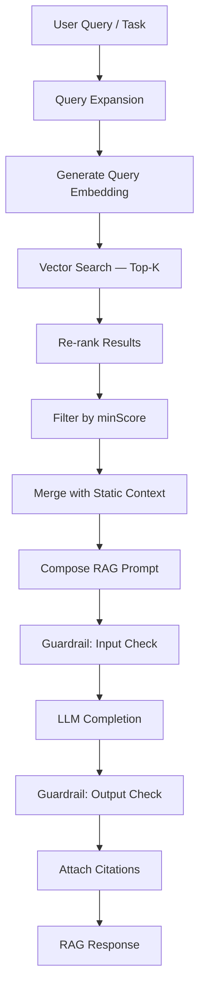

### RAG Modes

| Mode | Retrieval | Context | Use Case |
|------|-----------|---------|----------|
| `none` | Disabled | Static context only | Simple completions |
| `light` | Top-3 chunks | Static + retrieved | Quick Q&A |
| `standard` | Top-5 chunks, re-ranked | Static + retrieved | Code generation, review |
| `deep` | Top-10 chunks, multi-query | Full context + retrieved | Planning, architecture |

### RAG Prompt Structure

```
[System]
You are a Genesis AI assistant. Answer using the provided context.
Cite sources using [source:path] format.

[Retrieved Context]
{{rag.chunks}}

[Project Context]
{{context.content}}

[Task]
{{input.task}}

[Constraints]
{{blocks.constraints}}
```

### Citation Requirements

| Rule | Description |
|------|-------------|
| RAG-1 | Responses must cite retrieved chunks when factual claims are made |
| RAG-2 | Citation format: `[source:knowledge/backend-patterns.md]` |
| RAG-3 | Uncited claims from retrieval are flagged in evaluation |
| RAG-4 | Stale chunks (indexed > 90 days ago) include freshness warning |

### RAG Evaluation

| Metric | Target | Measurement |
|--------|--------|-------------|
| Retrieval precision | > 0.8 | Relevant chunks in top-k |
| Answer groundedness | > 0.9 | Claims supported by context |
| Citation accuracy | 100% | Citations map to real sources |

---

## Agents

Agents are autonomous, multi-step AI workflows that plan, execute, evaluate, and report on complex tasks.

### Agent Architecture

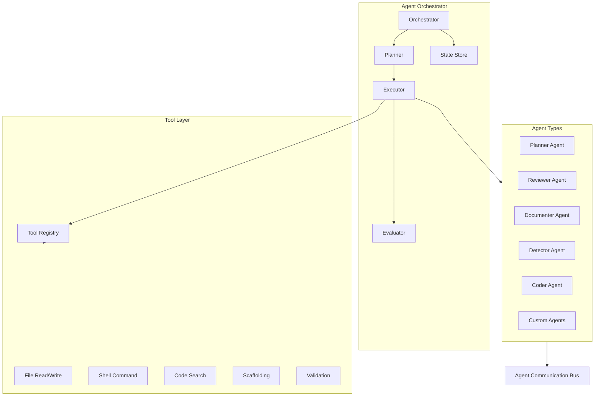

### Built-in Agents

| Agent | Input | Output | Max Steps | Token Budget |
|-------|-------|--------|-----------|--------------|
| **Planner** | Feature requirement | Implementation plan | 5 | 32,000 |
| **Reviewer** | Code diff or files | Review comments | 3 | 16,000 |
| **Documenter** | Code changes | Documentation updates | 4 | 16,000 |
| **Detector** | Codebase scope | Problem report | 5 | 24,000 |
| **Coder** | Plan step + context | Code changes | 10 | 48,000 |

### Agent Definition Contract

| Field | Type | Required | Description |
|-------|------|----------|-------------|
| `id` | string | yes | Unique agent identifier |
| `name` | string | yes | Human-readable name |
| `description` | string | yes | Agent purpose |
| `version` | string | yes | Semantic version |
| `inputSchema` | object | yes | JSON Schema for input validation |
| `outputSchema` | object | yes | JSON Schema for output validation |
| `promptTemplate` | string | yes | Template id for agent system prompt |
| `contextProfile` | string | yes | Context profile to use |
| `tools` | string[] | yes | Allowed tool ids |
| `maxSteps` | number | yes | Maximum execution steps |
| `tokenBudget` | number | yes | Session token limit |
| `evaluationCriteria` | string[] | yes | Criteria ids for output evaluation |
| `failureModes` | FailureMode[] | no | Defined failure scenarios |
| `requiresApproval` | boolean | no | Human approval before apply (default: true) |

### Agent Execution Lifecycle

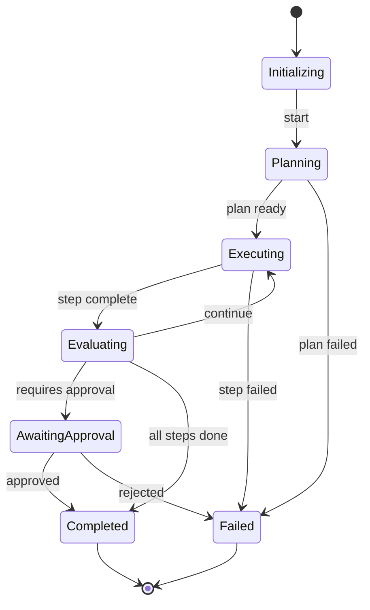

### Agent State

| Field | Type | Description |
|-------|------|-------------|
| `agentId` | string | Agent identifier |
| `sessionId` | string | Execution session |
| `status` | enum | `initializing`, `planning`, `executing`, `evaluating`, `awaiting_approval`, `completed`, `failed` |
| `plan` | AgentPlan | Current execution plan |
| `currentStep` | number | Active step index |
| `steps` | StepResult[] | Completed step results |
| `tokenUsage` | TokenUsage | Cumulative token consumption |
| `messages` | AgentMessage[] | Communication history |
| `startedAt` | ISO8601 | Start timestamp |
| `completedAt` | ISO8601 | End timestamp |

### Custom Agents

Projects may define custom agents in `.genesis/agents/` (future):

```yaml
id: economy-balancer
name: Economy Balancer
description: Analyze and suggest game economy adjustments
promptTemplate: game-design/economy-analysis
contextProfile: game-design
tools: [file-read, code-search, knowledge-retrieval]
maxSteps: 6
tokenBudget: 24000
evaluationCriteria: [accuracy, completeness, safety]
```

---

## Agent Communication

Agents communicate through the **Agent Communication Bus** — an internal message-passing system for multi-agent workflows.

### Communication Patterns

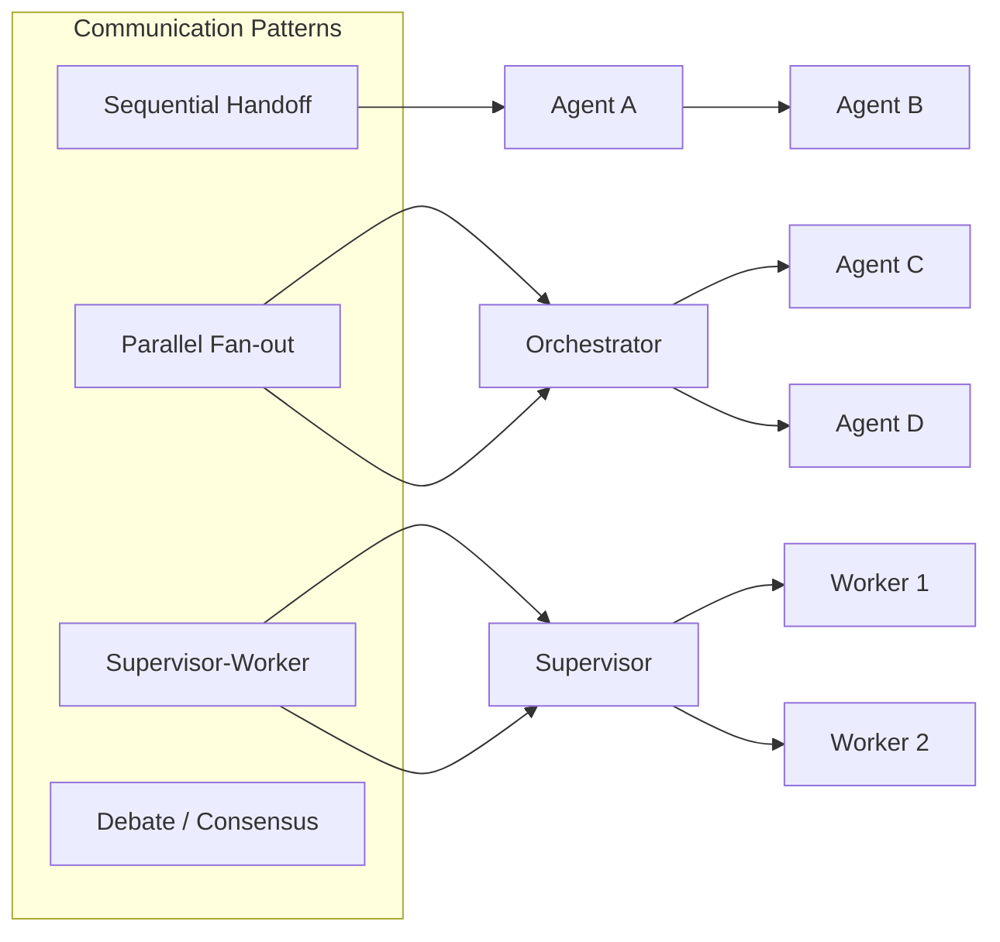

| Pattern | Description | Example |
|---------|-------------|---------|
| **Sequential** | Agent output becomes next agent input | Planner → Coder → Reviewer |
| **Parallel** | Multiple agents work on subtasks simultaneously | Detector scans modules in parallel |
| **Supervisor-Worker** | Supervisor delegates and aggregates | Planner assigns steps to Coder |
| **Debate** | Agents propose and critique until consensus | Architecture decision between two agents |

### Agent Message Contract

| Field | Type | Description |
|-------|------|-------------|
| `id` | string | Message id |
| `sessionId` | string | Agent session |
| `from` | string | Sender agent id |
| `to` | string | Recipient agent id or `orchestrator` |
| `type` | enum | `request`, `response`, `handoff`, `event`, `error` |
| `payload` | object | Message content |
| `timestamp` | ISO8601 | Send time |
| `correlationId` | string | Ties related messages |

### Handoff Protocol

When Agent A completes and hands off to Agent B:

| Step | Action |
|------|--------|
| 1 | Agent A emits `handoff` message with output and context |
| 2 | Orchestrator validates output schema |
| 3 | Orchestrator maps A output to B input |
| 4 | Orchestrator starts Agent B with enriched input |
| 5 | Agent B acknowledges with `request` or `error` |

### Communication Rules

| Rule | Description |
|------|-------------|
| AC-1 | Agents communicate only through the bus; no direct calls |
| AC-2 | Message payloads must conform to declared schemas |
| AC-3 | Orchestrator mediates all inter-agent communication |
| AC-4 | Message history is persisted for session duration |
| AC-5 | Token usage attributed to sending agent |

---

## Tool Calling

Agents invoke **tools** to interact with the project, filesystem, and framework. Tools are registered in the Tool Registry.

### Tool Architecture

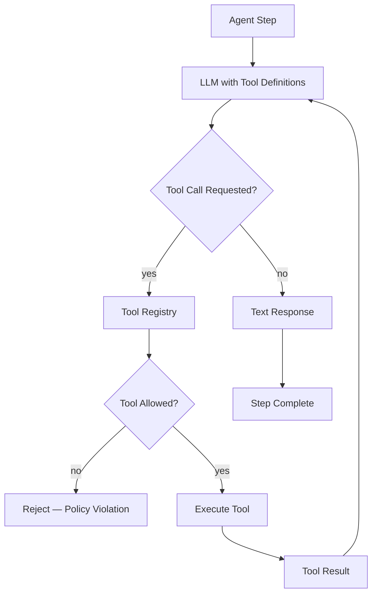

### Built-in Tools

| Tool ID | Description | Permissions | Side Effects |
|---------|-------------|-------------|--------------|
| `file-read` | Read file contents | filesystem:read | None |
| `file-write` | Write or create file | filesystem:write:project | Writes file |
| `file-list` | List directory contents | filesystem:read | None |
| `code-search` | Search codebase by pattern | filesystem:read | None |
| `knowledge-retrieval` | RAG query | vector:read | None |
| `scaffold` | Run scaffolding generator | scaffold:execute | Creates files |
| `validate` | Run project validation | validate:execute | None |
| `shell` | Execute shell command | subprocess:execute | Varies |
| `git-diff` | Get git diff | git:read | None |
| `git-status` | Get git status | git:read | None |

### Tool Definition Contract

| Field | Type | Required | Description |
|-------|------|----------|-------------|
| `id` | string | yes | Unique tool identifier |
| `name` | string | yes | Display name |
| `description` | string | yes | LLM-facing description |
| `parameters` | JSON Schema | yes | Input parameter schema |
| `permissions` | string[] | yes | Required permissions |
| `sideEffects` | enum[] | yes | `none`, `read`, `write`, `execute` |
| `timeout` | number | no | Max execution time (default: 30s) |
| `requiresApproval` | boolean | no | Human approval before execution |

### Tool Call Flow

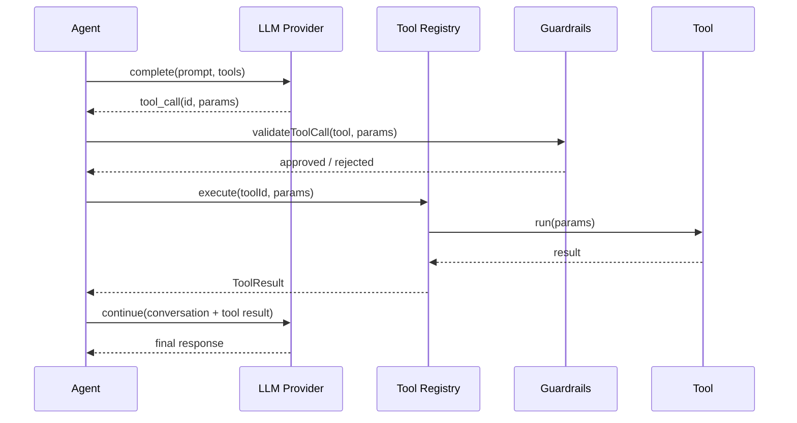

### Tool Safety Rules

| Rule | Description |
|------|-------------|
| TL-1 | Agents may only call tools declared in their agent definition |
| TL-2 | `file-write` and `shell` require approval by default |
| TL-3 | Tool results are truncated to 4,000 tokens before returning to LLM |
| TL-4 | Tool execution timeout defaults to 30 seconds |
| TL-5 | Failed tool calls are logged; agent may retry once |
| TL-6 | `shell` tool blocks destructive commands (rm -rf, format, etc.) |

---

## Planning

The **Planner** decomposes complex tasks into executable step sequences for agents.

### Planning Architecture

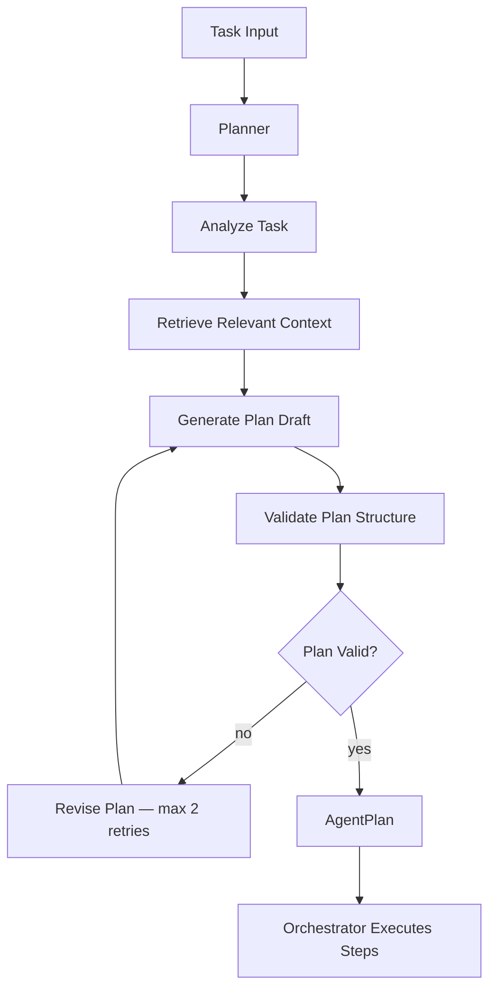

### Agent Plan Contract

| Field | Type | Description |
|-------|------|-------------|
| `id` | string | Plan identifier |
| `task` | string | Original task description |
| `steps` | PlanStep[] | Ordered execution steps |
| `estimatedTokens` | number | Projected token usage |
| `estimatedDuration` | number | Projected duration (seconds) |
| `risks` | string[] | Identified risks |
| `dependencies` | string[] | External dependencies |

### Plan Step Contract

| Field | Type | Description |
|-------|------|-------------|
| `id` | string | Step identifier |
| `order` | number | Execution order |
| `description` | string | What this step accomplishes |
| `agent` | string | Agent id to execute (optional) |
| `tool` | string | Tool to invoke (optional) |
| `input` | object | Step input data |
| `expectedOutput` | string | Expected outcome |
| `dependsOn` | string[] | Prerequisite step ids |
| `status` | enum | `pending`, `running`, `completed`, `failed`, `skipped` |

### Planning Modes

| Mode | Description | Use Case |
|------|-------------|----------|
| `automatic` | Planner generates and executes without user review | Low-risk tasks |
| `review` | Plan presented for user approval before execution | Default |
| `interactive` | User can edit plan steps before execution | Complex features |
| `dry-run` | Plan generated and displayed; no execution | Exploration |

### Planning Example

**Input:** "Add user authentication module with JWT"

**Generated Plan:**

| Step | Description | Agent | Tool |
|------|-------------|-------|------|
| 1 | Analyze existing project structure | Planner | code-search |
| 2 | Design auth module architecture | Planner | knowledge-retrieval |
| 3 | Generate NestJS auth module | Coder | scaffold |
| 4 | Generate auth tests | Coder | scaffold |
| 5 | Review generated code | Reviewer | file-read |
| 6 | Run validation | Reviewer | validate |

---

## Evaluation

The **Evaluator** scores AI outputs against defined quality criteria before delivery or auto-apply.

### Evaluation Architecture

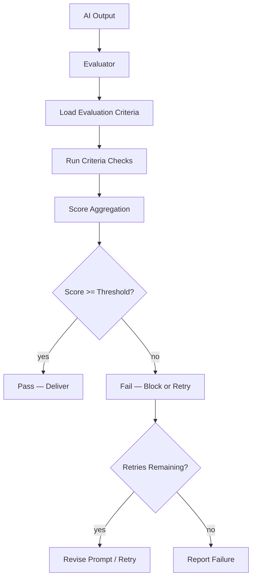

### Evaluation Criteria

| Criterion ID | Description | Weight | Measurement |
|--------------|-------------|--------|-------------|
| `accuracy` | Factual correctness vs context | 0.25 | LLM-as-judge or rule-based |
| `completeness` | All requirements addressed | 0.20 | Checklist coverage |
| `safety` | No secrets, harmful content, policy violations | 0.25 | Guardrail pass |
| `format` | Output matches expected schema/format | 0.15 | Schema validation |
| `groundedness` | Claims supported by context (RAG) | 0.15 | Citation check |

### Evaluation Result Contract

| Field | Type | Description |
|-------|------|-------------|
| `passed` | boolean | Whether overall evaluation passed |
| `score` | number | Weighted score (0–1) |
| `criteria` | CriterionResult[] | Per-criterion scores |
| `threshold` | number | Required score (default: 0.8) |
| `feedback` | string | Improvement suggestions |
| `blockingIssues` | string[] | Issues that must be resolved |

### Evaluation Modes

| Mode | Threshold | Behavior |
|------|-----------|----------|
| `strict` | 0.9 | Block delivery below threshold |
| `standard` | 0.8 | Block delivery; warn on borderline |
| `lenient` | 0.6 | Warn only; never block |
| `advisory` | — | Score reported; no blocking |

### Auto-Apply Policy

| Output Type | Evaluation Required | Auto-Apply Default |
|-------------|--------------------|--------------------|
| Documentation | yes | yes (if score ≥ 0.8) |
| Code generation | yes | no (requires approval) |
| Code review | yes | yes (advisory only) |
| Plans | yes | no (requires approval) |
| Refactoring | yes | no (requires approval) |

---

## Guardrails

The **Guardrail Engine** validates inputs before LLM calls and filters outputs before delivery. Per ADR-004 and `.cursor/rules/06-ai-development.mdc`.

### Guardrail Architecture

```mermaid
flowchart LR
  subgraph input [Input Guardrails]
    I1[Secret Detection]
    I2[PII Detection]
    I3[Prompt Injection Detection]
    I4[Token Budget Check]
    I5[Content Policy Check]
  end

  subgraph output [Output Guardrails]
    O1[Secret Leak Detection]
    O2[Code Safety Check]
    O3[Schema Validation]
    O4[Content Policy Check]
    O5[Hallucination Heuristics]
  end

  REQ[Request] --> input
  input --> LLM[LLM Call]
  LLM --> output
  output --> RESP[Response]
```

### Input Guardrails

| Guardrail | Detection | Action |
|-----------|-----------|--------|
| Secret detection | API keys, tokens, passwords, PEM files | Strip or block request |
| PII detection | Email, phone, SSN patterns | Redact or block |
| Prompt injection | Instruction override patterns | Block or sanitize |
| Token budget | Estimated input + output tokens | Reject if over budget |
| Excluded paths | `.env`, credentials, binaries | Exclude from context |
| Content policy | Harmful request patterns | Block request |

### Output Guardrails

| Guardrail | Detection | Action |
|-----------|-----------|--------|
| Secret leak | Generated secrets, keys | Block response |
| Code safety | Destructive commands, eval() | Block or flag |
| Schema validation | Output vs expected JSON schema | Reject malformed output |
| Content policy | Harmful generated content | Block response |
| Hallucination | Uncited factual claims (RAG mode) | Flag for review |
| License compliance | GPL code in proprietary context | Warn |

### Guardrail Result Contract

| Field | Type | Description |
|-------|------|-------------|
| `passed` | boolean | All guardrails passed |
| `violations` | Violation[] | Detected violations |
| `sanitized` | boolean | Whether input was modified |
| `blocked` | boolean | Whether request/response was blocked |
| `redactions` | string[] | List of redacted items (types only, not values) |

### Guardrail Policies

| Policy | Input | Output | Default |
|--------|-------|--------|---------|
| `strict` | Block on any violation | Block on any violation | Production |
| `standard` | Strip secrets; block injection | Block secrets; flag rest | Default |
| `permissive` | Warn only | Warn only | Development only |

---

## Observability

Every AI operation emits structured telemetry for debugging, cost tracking, and quality monitoring.

### Observability Architecture

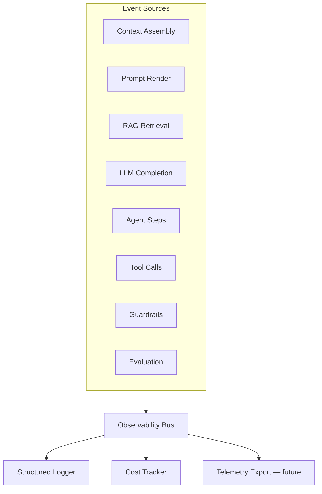

### Event Catalog

| Event | Payload | When |
|-------|---------|------|
| `ai:operation:start` | `{ operationId, type, agent }` | Operation begins |
| `ai:operation:complete` | `{ operationId, durationMs, success }` | Operation ends |
| `ai:context:assembled` | `{ profile, tokenCount, truncated, sources }` | Context ready |
| `ai:prompt:rendered` | `{ templateId, version, tokenCount }` | Prompt composed |
| `ai:rag:retrieved` | `{ query, chunkCount, topScore }` | RAG complete |
| `ai:llm:request` | `{ provider, model, inputTokens }` | LLM call sent |
| `ai:llm:response` | `{ provider, model, outputTokens, latencyMs, costUsd }` | LLM response received |
| `ai:agent:step` | `{ agentId, step, status, tokenUsage }` | Agent step complete |
| `ai:tool:called` | `{ toolId, durationMs, success }` | Tool executed |
| `ai:guardrail:check` | `{ phase, passed, violations }` | Guardrail evaluated |
| `ai:evaluation:scored` | `{ score, passed, criteria }` | Evaluation complete |
| `ai:budget:exceeded` | `{ budget, used, limit }` | Budget threshold hit |

### Structured Log Format

```json
{
  "timestamp": "2026-07-26T12:00:00.000Z",
  "correlationId": "op-8f3a2b1c",
  "operation": "agent:planner",
  "agent": "planner",
  "provider": "openai",
  "model": "gpt-4",
  "inputTokens": 4200,
  "outputTokens": 890,
  "latencyMs": 3400,
  "costUsd": 0.051,
  "ragChunks": 5,
  "guardrailsPassed": true,
  "evaluationScore": 0.91,
  "contextProfile": "full",
  "truncated": false
}
```

### Trace Model

| Field | Description |
|-------|-------------|
| `correlationId` | Ties all events in one operation |
| `sessionId` | Ties operations in one CLI session |
| `parentId` | Links agent steps to parent operation |
| `spanId` | Individual event identifier |

### Dashboards (Future)

| Dashboard | Metrics |
|-----------|---------|
| Cost | Daily spend by provider, agent, project |
| Quality | Evaluation scores over time |
| Latency | P50/P95 latency by operation type |
| Usage | Operations per agent, tool call frequency |
| Errors | Guardrail failures, budget exceeded, provider errors |

---

## Cost Optimization

The AI Engine enforces cost controls through budgeting, model routing, caching, and intelligent context management.

### Cost Architecture

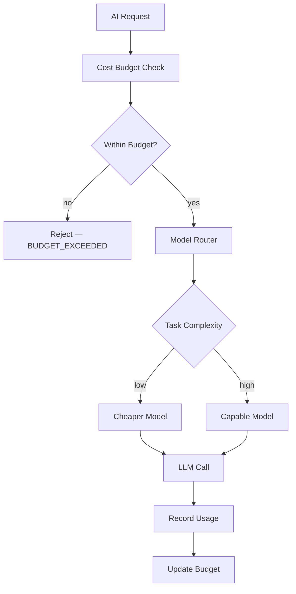

### Budget Hierarchy

| Level | Scope | Default Limit | Config Key |
|-------|-------|---------------|------------|
| Session | CLI process lifetime | 100,000 tokens | `ai.budget.sessionTokens` |
| Operation | Single AI operation | 16,000 tokens | `ai.budget.operationTokens` |
| Agent | Per agent execution | Agent-specific | Agent definition |
| Daily | Per project per day | $5.00 USD | `ai.budget.dailyUsd` |
| Monthly | Per project per month | $50.00 USD | `ai.budget.monthlyUsd` |

### Cost Optimization Strategies

| Strategy | Description | Savings |
|----------|-------------|---------|
| **Model routing** | Use cheaper models for simple tasks | 50–80% on low-complexity |
| **Context compression** | Summarize Tier 3 sources before inclusion | 20–40% input tokens |
| **Embedding cache** | Reuse embeddings when content hash unchanged | 100% on re-index |
| **Prompt caching** | Cache provider-side prompt prefixes (OpenAI, Anthropic) | 50–90% on repeated prefixes |
| **Batch embedding** | Batch index operations | 30% on indexing |
| **RAG filtering** | Higher minScore reduces irrelevant chunks | 10–20% input tokens |
| **Response streaming** | Early termination on sufficient output | Variable |

### Model Routing Rules

| Task Type | Preferred Model Tier | Fallback |
|-----------|---------------------|----------|
| Code completion | Standard | Cheaper |
| Planning | Capable | Standard |
| Review | Standard | Cheaper |
| Embedding | Embedding-specific | — |
| Simple Q&A | Cheaper | — |
| Long-context analysis | Long-context capable | Standard with truncation |

### Cost Tracking Contract

| Field | Type | Description |
|-------|------|-------------|
| `operationId` | string | Operation identifier |
| `provider` | string | Provider id |
| `model` | string | Model used |
| `inputTokens` | number | Input token count |
| `outputTokens` | number | Output token count |
| `embeddingTokens` | number | Embedding token count |
| `costUsd` | number | Estimated cost |
| `cached` | boolean | Whether prompt cache was hit |
| `budgetRemaining` | object | Remaining budget at all levels |

---

## Security

### Threat Model

| Threat | Mitigation |
|--------|------------|
| Secret exfiltration via prompts | Secret detection; exclusion policy |
| Secret leakage in outputs | Output guardrails; redaction |
| Prompt injection | Injection detection; input sanitization |
| Unauthorized tool execution | Tool permissions; approval gates |
| Cross-project data leakage | Project-scoped indexes and context |
| Excessive API spend | Budget enforcement at multiple levels |
| Malicious agent output | Evaluation + guardrails + human approval |
| Supply chain (compromised provider) | Provider pinning; audit logging |

### API Key Management

| Rule | Description |
|------|-------------|
| SEC-1 | API keys stored in environment variables or secure vault |
| SEC-2 | Keys never included in context, prompts, or logs |
| SEC-3 | Keys accessed via `env:read:{VAR}` permission (plugin system) |
| SEC-4 | `genesis ai` commands redact keys in all output |
| SEC-5 | Separate keys per environment (dev, staging, prod) |

### Data Classification

| Class | Examples | Context Policy |
|-------|----------|----------------|
| Public | Specs, standards, open docs | Include freely |
| Internal | Code, architecture, tasks | Include with scope |
| Confidential | API keys, credentials, PII | Never include |
| Restricted | Player data, payment info | Never include; not in Genesis scope |

### Audit Trail

All AI operations produce an audit record:

| Field | Description |
|-------|-------------|
| `who` | User or agent identity |
| `what` | Operation type and agent |
| `when` | Timestamp |
| `input` | Redacted input summary |
| `output` | Redacted output summary |
| `provider` | LLM provider and model |
| `cost` | Token usage and USD cost |
| `guardrails` | Pass/fail with violation types |
| `approval` | Human approval status (if required) |

---

## Provider Support

The AI Engine routes requests to LLM providers through the **Provider Adapter** interface. Providers register via the plugin system ([003-plugin-system](../003-plugin-system/)).

### Provider Architecture

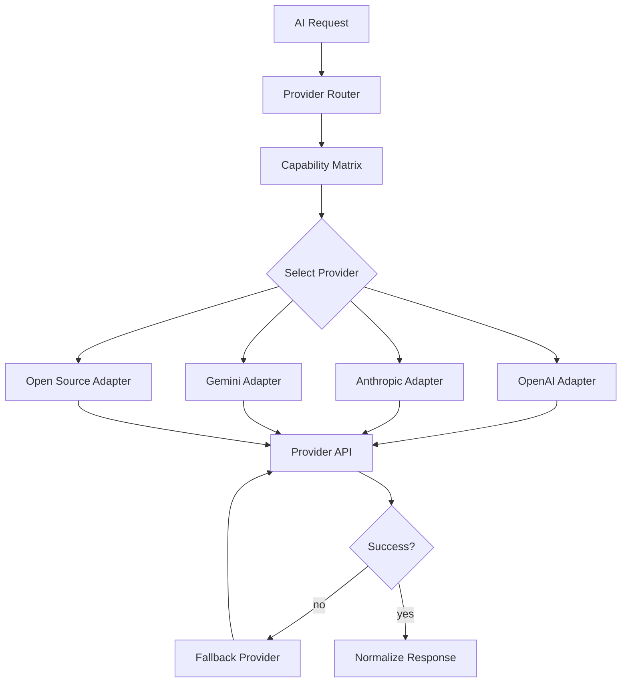

### Provider Adapter Contract

| Method | Input | Output | Description |
|--------|-------|--------|-------------|
| `complete` | messages, options | CompletionResult | Single completion |
| `stream` | messages, options | StreamIterator | Streaming completion |
| `embed` | texts, options | EmbeddingResult | Generate embeddings |
| `countTokens` | text | number | Token count estimate |
| `getCapabilities` | — | ProviderCapabilities | Supported features |
| `getModels` | — | ModelInfo[] | Available models |
| `healthCheck` | — | HealthStatus | Provider availability |

### Provider Capability Matrix

| Capability | OpenAI | Anthropic | Gemini | Open Source |
|------------|--------|-----------|--------|-------------|
| Chat completion | yes | yes | yes | yes |
| Streaming | yes | yes | yes | varies |
| Function/tool calling | yes | yes | yes | varies |
| Embeddings | yes | no | yes | yes |
| Vision (image input) | yes | yes | yes | varies |
| JSON mode | yes | yes | yes | varies |
| Prompt caching | yes | yes | no | no |
| Max context | 128K | 200K | 1M | 8K–128K |
| Local/offline | no | no | no | yes |

### OpenAI

| Attribute | Value |
|-----------|-------|
| Plugin id | `@genesis/plugin-openai` |
| Priority | Phase 4 (first provider) |
| Models | `gpt-4`, `gpt-4-turbo`, `gpt-4o`, `gpt-3.5-turbo` |
| Embeddings | `text-embedding-3-small`, `text-embedding-3-large` |
| Auth | `OPENAI_API_KEY` environment variable |
| Use cases | General completion, code generation, embeddings |
| Features | Tool calling, JSON mode, prompt caching, streaming |

### Anthropic

| Attribute | Value |
|-----------|-------|
| Plugin id | `@genesis/plugin-anthropic` |
| Priority | Phase 4 |
| Models | `claude-3-5-sonnet`, `claude-3-opus`, `claude-3-haiku` |
| Auth | `ANTHROPIC_API_KEY` environment variable |
| Use cases | Long-context analysis, code review, planning |
| Features | Tool calling, prompt caching, streaming, 200K context |

### Gemini

| Attribute | Value |
|-----------|-------|
| Plugin id | `@genesis/plugin-gemini` |
| Priority | Phase 4+ |
| Models | `gemini-1.5-pro`, `gemini-1.5-flash`, `gemini-2.0-flash` |
| Embeddings | `text-embedding-004` |
| Auth | `GOOGLE_API_KEY` or service account |
| Use cases | Long-context (1M tokens), multimodal, cost-effective tasks |
| Features | Tool calling, vision, streaming, long context |

### Open Source LLMs

| Attribute | Value |
|-----------|-------|
| Plugin id | `@genesis/plugin-ollama` (and alternatives) |
| Priority | Phase 4+ |
| Backends | Ollama, llama.cpp, vLLM, LocalAI |
| Models | `llama3`, `codellama`, `mistral`, `deepseek-coder`, `nomic-embed-text` |
| Auth | None (local) or configurable endpoint |
| Use cases | Offline development, privacy, zero API cost |
| Limitations | Smaller context, variable tool calling support, lower quality |

### Provider Routing Configuration

```yaml
# .genesis/config.yml
ai:
  providers:
    default: openai
    fallback: anthropic
    routing:
      planning: anthropic
      code-generation: openai
      embedding: openai
      review: anthropic
      simple: ollama
  models:
    openai:
      default: gpt-4o
      embedding: text-embedding-3-small
    anthropic:
      default: claude-3-5-sonnet
    ollama:
      endpoint: http://localhost:11434
      default: llama3
```

### Provider Failover

| Step | Action |
|------|--------|
| 1 | Primary provider call |
| 2 | On timeout (60s) or error → log warning |
| 3 | Retry once with exponential backoff |
| 4 | On second failure → failover to fallback provider |
| 5 | On fallback failure → return `PROVIDER_UNAVAILABLE` |
| 6 | Emit `ai:provider:failover` event |

### Response Normalization

All provider responses are normalized to a common format regardless of vendor:

| Field | Type | Description |
|-------|------|-------------|
| `text` | string | Completion text |
| `toolCalls` | ToolCall[] | Requested tool invocations |
| `finishReason` | enum | `stop`, `length`, `tool_calls`, `error` |
| `usage` | TokenUsage | Input/output token counts |
| `model` | string | Model that produced response |
| `provider` | string | Provider id |
| `latencyMs` | number | Round-trip latency |
| `costUsd` | number | Estimated cost |

---

## Public API

### AI Service

| Method | Input | Output | Description |
|--------|-------|--------|-------------|
| `complete(request)` | CompletionRequest | CompletionResult | Single LLM completion |
| `stream(request)` | CompletionRequest | StreamIterator | Streaming completion |
| `embed(request)` | EmbeddingRequest | EmbeddingResult | Generate embeddings |
| `retrieve(request)` | RetrievalRequest | RetrievedChunk[] | Knowledge retrieval |
| `rag(request)` | RAGRequest | RAGResult | Full RAG pipeline |
| `runAgent(request)` | AgentRequest | AgentResult | Execute agent workflow |
| `plan(request)` | PlanningRequest | AgentPlan | Generate plan without executing |
| `evaluate(request)` | EvaluationRequest | EvaluationResult | Score AI output |
| `index(options?)` | IndexOptions | IndexResult | Index knowledge sources |

### CLI Commands (via 001-cli)

| Command | Delegates To | Description |
|---------|-------------|-------------|
| `genesis ai plan <requirement>` | `plan()` | Generate implementation plan |
| `genesis ai review` | `runAgent(reviewer)` | Review staged changes |
| `genesis ai docs` | `runAgent(documenter)` | Generate documentation |
| `genesis ai ask <question>` | `rag()` | RAG-powered Q&A |
| `genesis ai index` | `index()` | Index knowledge sources |
| `genesis ai cost` | Cost Tracker | Show session cost summary |

---

## Examples

### Example 1 — RAG-Powered Question

**Command:** `genesis ai ask "How does the plugin system handle dependencies?"`

**Pipeline:**

1. Context profile: `standard`
2. RAG mode: `standard` (top-5 chunks)
3. Retrieved: `specs/003-plugin-system/FUNCTIONAL_SPEC.md` (dependency section)
4. Prompt template: `workflows/qa`
5. Provider: Anthropic (long-context)
6. Guardrails: pass
7. Evaluation: groundedness 0.95, citation accuracy 100%

### Example 2 — Feature Planning Agent

**Command:** `genesis ai plan "Add inventory system with crafting"`

**Pipeline:**

1. Agent: Planner
2. Context profile: `full` + RAG `deep`
3. Tools: `code-search`, `knowledge-retrieval`, `file-read`
4. Plan: 6 steps (analyze → design → scaffold domain → scaffold application → tests → review)
5. Evaluation: completeness 0.92
6. Output: Plan presented for user approval

### Example 3 — Code Review Agent

**Command:** `genesis ai review`

**Pipeline:**

1. Agent: Reviewer
2. Input: `git diff` staged changes
3. Context: architecture + standards + changed files
4. Provider: Anthropic
5. Output: Review comments with severity and file references
6. Auto-apply: no (advisory)

### Example 4 — Multi-Agent Feature Development

**Workflow:** `feature-development`

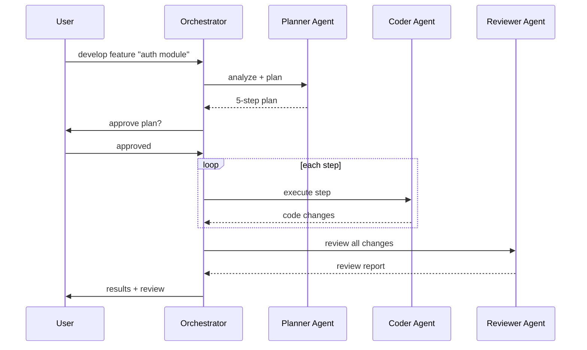

### Example 5 — Cost Budget Exceeded

**Scenario:** Session token budget (100K) exhausted mid-agent execution.

```
[AI WARNING] Session token budget exceeded
  Used:     100,240 tokens
  Limit:    100,000 tokens
  Agent:    coder (step 7/10)
  Action:   Agent execution halted

Suggestion: Increase ai.budget.sessionTokens in .genesis/config.yml
             or run with --budget 200000
```

---

## Testing Requirements

### Unit Tests

| Area | Tests |
|------|-------|
| Context Manager | Priority, truncation, exclusion, budget allocation |
| Prompt Manager | Composition, versioning, variable injection |
| Guardrail Engine | Secret detection, injection detection, output filtering |
| Evaluator | Criteria scoring, threshold enforcement |
| Cost Tracker | Budget enforcement, usage recording |
| Provider Router | Capability matching, failover logic |

### Integration Tests

| Test | Description |
|------|-------------|
| RAG pipeline | Index → retrieve → compose → complete (mock provider) |
| Agent workflow | Plan → execute → evaluate (mock tools) |
| Provider failover | Primary fails → fallback succeeds |
| Budget enforcement | Operation rejected when budget exceeded |
| Guardrail blocking | Secret in input → request blocked |

### Evaluation Tests

| Test | Description |
|------|-------------|
| Prompt regression | Template output matches golden snapshots |
| RAG precision | Retrieved chunks relevant to test queries |
| Agent plan quality | Plans cover all requirements in test cases |
| Guardrail coverage | Known attack patterns blocked |

---

## Related Documents

| Document | Relationship |
|----------|-------------|
| [README.md](README.md) | Parent specification overview |
| [DECISION_LOG.md](../../DECISION_LOG.md) | ADR-004 AI-Native Development |
| [001-cli/FUNCTIONAL_SPEC.md](../001-cli/FUNCTIONAL_SPEC.md) | `genesis ai` commands |
| [003-plugin-system/FUNCTIONAL_SPEC.md](../003-plugin-system/FUNCTIONAL_SPEC.md) | AI provider plugin registration |
| [004-scaffolding/FUNCTIONAL_SPEC.md](../004-scaffolding/FUNCTIONAL_SPEC.md) | AI-assisted generation |
| [006-game-generation/README.md](../006-game-generation/) | AI in game generation |
| [prompts/README.md](../../prompts/README.md) | Composable prompt engine |
| [.cursor/rules/06-ai-development.mdc](../../.cursor/rules/06-ai-development.mdc) | AI development rules |

## Changelog

| Version | Date | Change |
|---------|------|--------|
| 1.0.0 | 2026-07-26 | Initial functional specification |
