# Genesis Game Generation System — Functional Specification

## Document Control

| Field | Value |
|-------|-------|
| **Specification** | [006-game-generation](README.md) |
| **Status** | Approved |
| **Version** | 1.0.0 |
| **Independence** | Implementation-independent. No engine, language, or cloud provider is prescribed. |
| **Audience** | Game architects, technical designers, backend engineers, Unity developers, AI assistants |

## Purpose

Define the complete functional architecture of the **Genesis Game Generation System** — the end-to-end capability that produces production-ready mobile game project structures from a single `genesis create game` command. The system orchestrates multi-phase generation across documentation, backend services, Unity client, LiveOps foundations, DevOps, and AI operating systems, with genre-specific scaffolds for core loop, progression, economy, analytics, monetization, and platform services.

## Scope

### In Scope

- Game generation architecture and multi-phase pipeline
- Supported genres and game template catalog
- Genre-specific system scaffolds: core loop, progression, economy
- Platform service scaffolds: analytics, ads, achievements, cloud save
- Cross-cutting scaffolds: localization, accessibility, performance
- Unity generation: asset pipeline, prefabs, scenes
- Backend generation integration for game services
- Future AI NPC generation architecture
- Variable context, validation, and AI enrichment
- Public API contracts and integration boundaries

### Out of Scope

- Finished gameplay implementation (generated projects contain skeletons, not complete games)
- Art, audio, 3D model, and animation asset creation
- Game balance tuning and economy spreadsheet authoring
- App store submission and deployment
- Full LiveOps operations post-launch ([009-liveops](../009-liveops/))
- In-game AI NPC runtime implementation (future architecture only)
- Multiplayer networking (future consideration)

---

## Goals

### Primary Goals

| ID | Goal | Success Criteria |
|----|------|------------------|
| G1 | **Complete structure** | `genesis create game my-rpg` produces docs, backend, Unity, CI, and AI OS |
| G2 | **Genre-aware** | Each template scaffolds genre-appropriate systems and GDD sections |
| G3 | **Mobile-ready** | Unity project configured for iOS/Android with performance conventions |
| G4 | **Production patterns** | Generated code follows Clean Architecture and project standards |
| G5 | **Monetization-ready** | Ads, IAP, and economy scaffolds included where template supports |
| G6 | **Data-driven** | Progression, economy, and config defined in ScriptableObjects and remote config |
| G7 | **Analytics-ready** | Event tracking scaffolds emit structured events from day one |
| G8 | **Accessible** | Accessibility scaffolding included in UI and input systems |
| G9 | **AI-ready** | Generated project includes `.cursor/` rules and context for the game |
| G10 | **Extensible** | New genres and templates register via plugins |

### Non-Functional Goals

| Attribute | Target |
|-----------|--------|
| Generation time | Full game project < 60 seconds (excluding AI enrichment) |
| Backend compile | Generated NestJS backend passes `tsc --noEmit` |
| Unity open | Generated Unity project opens without errors in target LTS version |
| File count | 60–120 files for full template (genre-dependent) |
| Mobile FPS target | 60 FPS default scaffold configuration |
| Documentation | GDD, architecture doc, and README generated automatically |

### Design Principles

1. **Skeleton, not game** — Generation produces architecture and scaffolds; designers and engineers fill in gameplay.
2. **Genre defaults, designer overrides** — Templates provide sensible defaults; all systems are configurable.
3. **Mobile-first** — Performance, touch input, and battery conventions baked into every template.
4. **Data-driven by default** — No hardcoded game values in generated scripts.
5. **Backend-synced** — Client systems designed for server authority where required (economy, cloud save).
6. **Framework over duplication** — Reusable logic lives in `framework/`; generated games consume it.
7. **Measure from day one** — Analytics events scaffolded before gameplay is implemented.
8. **Accessible by default** — UI scaffolds include accessibility hooks, not retrofits.

---

## Architecture

### System Overview

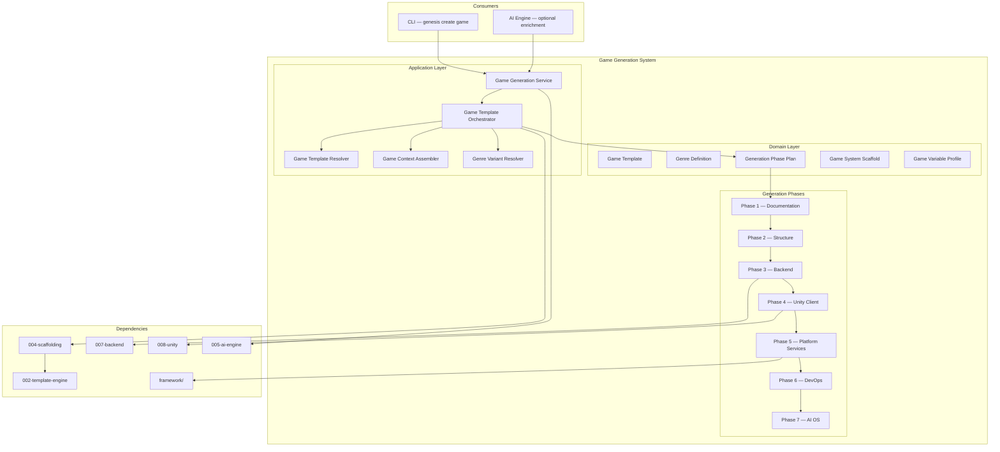

### Layer Responsibilities

| Layer | Components | Responsibility |
|-------|------------|----------------|
| **Application** | Game Generation Service, Orchestrator, Resolvers, Context Assembler | Coordinate multi-phase game generation |
| **Domain** | Game Template, Genre Definition, Phase Plan, System Scaffold, Variable Profile | Pure game generation rules and definitions |
| **Phases** | 7 generation phases | Ordered output production |

### Component Model

| Component | Responsibility |
|-----------|----------------|
| **Game Generation Service** | Public API entry point for `genesis create game` |
| **Game Template Orchestrator** | Execute multi-phase generation plan |
| **Game Template Resolver** | Select game template by name, genre, or flags |
| **Game Context Assembler** | Merge game-specific variables (genre, platform, monetization) |
| **Genre Variant Resolver** | Resolve genre-specific system scaffolds and defaults |
| **Game Template** | Declarative definition of a game project type |
| **Genre Definition** | Genre metadata: core loop, systems, GDD sections |
| **Generation Phase Plan** | Ordered phases with generators per phase |
| **Game System Scaffold** | Definition of a generated game system (client + backend) |

### Relationship to Other Systems

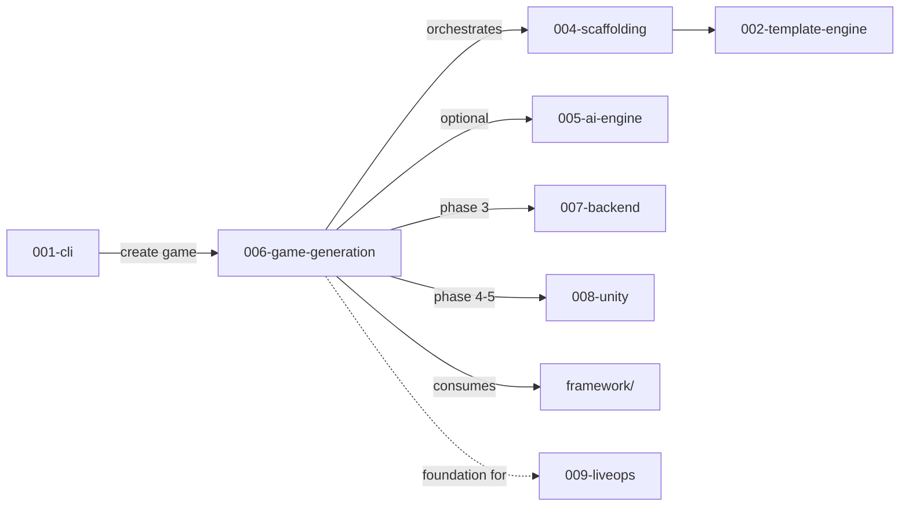

| System | Game Generation Uses | Game Generation Provides |
|--------|---------------------|-------------------------|
| Scaffolding | Multi-phase plan execution | Game-type generation requests |
| Template Engine | Render all templates | — |
| Backend spec | NestJS game services | Auth, cloud save, economy API |
| Unity spec | Client systems, scenes, prefabs | Genre-specific Unity scaffolds |
| AI Engine | GDD enrichment, genre rules | Enriched documentation |
| Framework | Reusable analytics, core modules | Consumption contracts |
| LiveOps | — | Foundation scaffolds extended post-launch |

### Generated Project Topology

```
{gameName}/
├── .cursor/                    # AI operating system (Phase 7)
│   ├── rules/                  # Genre-specific development rules
│   └── context/                # Game context for AI assistants
├── .github/workflows/          # CI/CD (Phase 6)
├── docs/                       # Documentation (Phase 1)
│   ├── GDD.md
│   ├── ARCHITECTURE.md
│   ├── ECONOMY.md
│   ├── ANALYTICS.md
│   └── LOCALIZATION.md
├── backend/                    # NestJS API (Phase 3)
│   └── src/
│       ├── domain/             # Game domain entities
│       ├── application/        # Use cases
│       ├── infrastructure/     # DB, cloud, analytics adapters
│       └── presentation/       # REST API controllers
├── unity/                      # Unity client (Phase 4-5)
│   └── Assets/_Project/
│       ├── Scripts/
│       │   ├── Core/           # Bootstrap, DI, event bus
│       │   ├── Systems/        # Genre-specific systems
│       │   ├── Services/       # Analytics, ads, cloud save
│       │   └── UI/             # Accessible UI controllers
│       ├── ScriptableObjects/
│       │   ├── Config/         # Game, economy, progression config
│       │   └── Data/           # Content data assets
│       ├── Scenes/
│       ├── Prefabs/
│       └── Localization/
├── .genesis/
│   └── config.yml              # Game project config
├── genesis.config.yml
└── README.md
```

---

## Supported Genres

Genres define the gameplay category, default systems, core loop patterns, and GDD structure. Each genre maps to one or more game templates.

### Genre Catalog

| Genre ID | Display Name | Core Interaction | Primary Monetization | Template |
|----------|--------------|------------------|---------------------|----------|
| `rpg` | Role-Playing Game | Turn-based or real-time combat + character growth | IAP, battle pass | `mobile-rpg` |
| `puzzle` | Puzzle | Level-based logic challenges | Ads, IAP (hints/lives) | `mobile-puzzle` |
| `idle` | Idle / Clicker | Passive progression + active bursts | Ads, IAP (boosters) | `mobile-idle` |
| `runner` | Endless Runner | Reflex-based obstacle avoidance | Ads, IAP (cosmetics) | `mobile-runner` (future) |
| `strategy` | Strategy | Resource management + tactical decisions | IAP, battle pass | `mobile-strategy` (future) |
| `card` | Card Game | Deck building + card battles | IAP (card packs) | `mobile-card` (future) |
| `simulation` | Simulation | System management + optimization | Ads, IAP | `mobile-sim` (future) |
| `generic` | Generic | User-defined | Configurable | `default` |

### Genre Definition Contract

| Field | Type | Description |
|-------|------|-------------|
| `id` | string | Genre identifier |
| `name` | string | Display name |
| `description` | string | Genre summary |
| `coreLoop` | CoreLoopDefinition | Default core loop scaffold |
| `metaLoop` | MetaLoopDefinition | Default meta progression scaffold |
| `systems` | string[] | Required system scaffolds |
| `optionalSystems` | string[] | Optional system scaffolds |
| `gddSections` | string[] | GDD sections to generate |
| `monetizationDefaults` | string[] | Default monetization models |
| `analyticsEvents` | string[] | Genre-specific analytics events |

### Genre System Matrix

| System | RPG | Puzzle | Idle | Runner | Strategy | Card |
|--------|-----|--------|------|--------|----------|------|
| Combat | yes | — | optional | — | yes | yes |
| Inventory | yes | — | — | — | yes | yes (deck) |
| Progression | yes | yes | yes | yes | yes | yes |
| Economy | yes | yes | yes | yes | yes | yes |
| Level/Stage | yes (zones) | yes (levels) | yes (prestige) | yes (distance) | yes (maps) | yes (arenas) |
| Energy/Lives | optional | yes | — | yes | optional | yes |
| Crafting | optional | — | optional | — | yes | — |
| PvP | optional | — | — | — | optional | yes |
| Guild/Clan | optional | — | — | — | yes | optional |

---

## Game Templates

Game templates are declarative YAML definitions that specify what `genesis create game` produces for a given genre and platform combination.

### Template Catalog

| Template ID | Genre | Platform | Backend | Phase Count | Description |
|-------------|-------|----------|---------|-------------|-------------|
| `default` | generic | iOS/Android | NestJS | 4 | Minimal docs + structure only |
| `mobile-rpg` | rpg | iOS/Android | NestJS + PostgreSQL | 7 | Turn-based RPG skeleton |
| `mobile-puzzle` | puzzle | iOS/Android | NestJS + Redis | 7 | Casual puzzle with lives system |
| `mobile-idle` | idle | iOS/Android | NestJS + PostgreSQL | 7 | Idle clicker with prestige |
| `mobile-runner` | runner | iOS/Android | NestJS + Redis | 7 | Endless runner (future) |
| `mobile-strategy` | strategy | iOS/Android | NestJS + PostgreSQL | 7 | Strategy game (future) |

Templates are extensible via plugins registering new `GameTemplate` definitions through [003-plugin-system](../003-plugin-system/).

### Game Template Schema

| Field | Type | Required | Description |
|-------|------|----------|-------------|
| `id` | string | yes | Template identifier |
| `name` | string | yes | Display name |
| `version` | string | yes | Template semver |
| `genre` | string | yes | Genre id |
| `description` | string | yes | Template summary |
| `platform` | string[] | yes | Target platforms (`ios`, `android`) |
| `backend` | BackendConfig | yes | Backend stack configuration |
| `unity` | UnityConfig | yes | Unity version, render pipeline |
| `phases` | PhaseDefinition[] | yes | Ordered generation phases |
| `systems` | SystemScaffoldRef[] | yes | Game systems to scaffold |
| `variables` | object | no | Default template variables |
| `monetization` | string[] | no | Enabled monetization models |
| `plugins` | string[] | no | Required Genesis plugins |

### Template Discovery

| Priority | Path | Source |
|----------|------|--------|
| 1 | `@genesis/scaffolding/templates/games/` | Built-in |
| 2 | Plugin `templates/games/` | Plugin-contributed |
| 3 | `.genesis/templates/games/` | Project-local (future) |

### Generation Phases

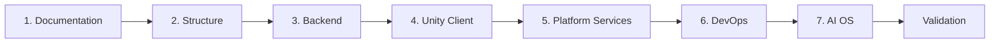

| Phase | ID | Generators | Output |
|-------|----|------------|--------|
| 1 | `documentation` | `docs:gdd`, `docs:architecture`, `docs:economy`, `docs:analytics`, `docs:localization`, `docs:readme` | Design and technical docs |
| 2 | `structure` | `project-structure`, `config:genesis`, `config:git` | Directory tree, config files |
| 3 | `backend` | `nestjs:api`, `nestjs:auth`, genre backend modules | NestJS API with game services |
| 4 | `unity-client` | `unity:project`, `unity:systems`, `unity:scenes`, `unity:prefabs` | Unity project with genre systems |
| 5 | `platform-services` | `unity:analytics`, `unity:ads`, `unity:cloud-save`, `unity:localization`, `unity:accessibility` | Platform service scaffolds |
| 6 | `devops` | `devops:ci`, `devops:docker`, `devops:env` | GitHub Actions, Docker, env config |
| 7 | `ai-os` | `ai-os:rules`, `ai-os:context`, `ai-os:prompts` | Cursor AI operating system |

Phases execute sequentially. Each phase completes before the next begins. Phase failure aborts generation unless `continueOnError` is set.

### Game Context Variables

| Variable | Source | Example | Used In |
|----------|--------|---------|---------|
| `gameName` | User input | `ocean-quest` | All phases |
| `gameNamePascal` | Derived | `OceanQuest` | C# classes |
| `genre` | Template | `rpg` | Genre systems, GDD |
| `platform` | Flag/template | `mobile` | Unity settings |
| `monetization` | Flag | `f2p` | Ads, IAP scaffolds |
| `backendType` | Template | `nestjs` | Phase 3 |
| `databaseType` | Template | `postgres` | Backend config |
| `unityVersion` | Plugin config | `2022.3` | Unity project |
| `renderPipeline` | Flag | `urp` | Unity settings |
| `author` | Config | `Studio X` | Docs, copyrights |
| `targetFps` | Template default | `60` | Performance config |
| `defaultLanguage` | Flag | `en` | Localization |
| `analyticsProvider` | Flag | `firebase` | Analytics scaffold |
| `adProvider` | Flag | `admob` | Ads scaffold |
| `cloudSaveProvider` | Flag | `firebase` | Cloud save scaffold |
| `includeAI` | Flag | `true` | Phase 7 + GDD enrichment |

---

## Core Loop

The core loop is the primary gameplay cycle players repeat. Game generation scaffolds the core loop architecture per genre — interfaces, state machines, and data structures — not finished gameplay.

### Core Loop Architecture

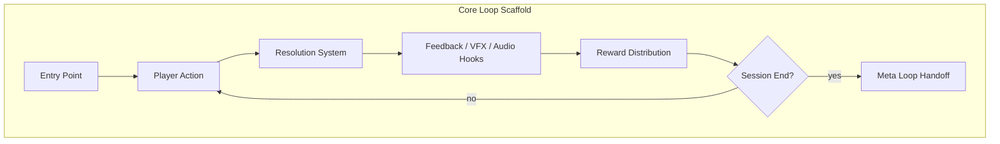

### Genre Core Loops

| Genre | Core Loop | Generated Systems |
|-------|-----------|-------------------|
| **RPG** | Explore → Encounter → Combat → Loot → Upgrade | `CombatSystem`, `EncounterSystem`, `LootSystem` |
| **Puzzle** | Select Level → Play → Solve/Fail → Star Rating → Next | `LevelSystem`, `PuzzleBoardSystem`, `StarRatingSystem` |
| **Idle** | Tap/Wait → Earn → Upgrade → Prestige Reset | `TapSystem`, `IdleIncomeSystem`, `UpgradeSystem`, `PrestigeSystem` |
| **Runner** | Run → Dodge → Collect → Die → Score → Retry | `RunnerSystem`, `ObstacleSystem`, `ScoreSystem` |
| **Strategy** | Plan → Execute → Resolve → Expand | `TurnSystem`, `ResourceSystem`, `MapSystem` |
| **Card** | Draw → Play → Resolve → Win/Lose | `DeckSystem`, `CardPlaySystem`, `BattleSystem` |

### Core Loop Scaffold Contract

Each core loop system generates:

| Artifact | Unity | Backend |
|----------|-------|---------|
| Interface | `I{System}System` | — |
| Implementation | `{System}System` | — |
| State model | `{System}State` ScriptableObject | Entity + DTO |
| Events | `{System}Events` (event bus) | Webhook/event handler |
| Config | `{System}Config` ScriptableObject | Remote config key |
| Tests | `{System}SystemTests` (EditMode) | Unit test scaffold |

### Core Loop GDD Section

Phase 1 generates a GDD core loop section from genre defaults:

```markdown
## Core Loop

1. **Entry** — Player enters {entryContext}
2. **Action** — Player performs {primaryAction}
3. **Resolution** — System evaluates {resolutionMechanic}
4. **Feedback** — Player receives {feedbackType}
5. **Reward** — Player earns {rewardTypes}
6. **Repeat** — Loop continues until {exitCondition}

### Loop Duration
- Target session: {sessionMinutes} minutes
- Actions per minute: {apmTarget}
```

Designers customize values after generation.

---

## Progression

Progression systems define how players advance over time — levels, skills, unlocks, and prestige.

### Progression Architecture

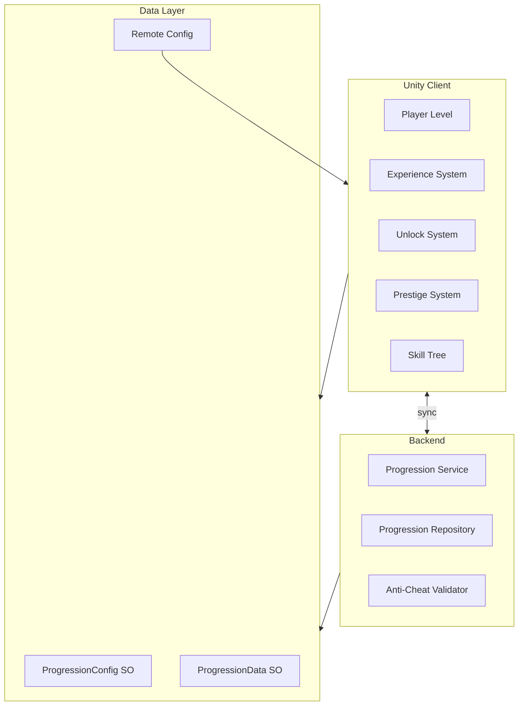

### Progression Types by Genre

| Type | RPG | Puzzle | Idle | Description |
|------|-----|--------|------|-------------|
| Player level | yes | — | yes | XP-based character level |
| Stage/zone unlock | yes | yes | yes | Content gating |
| Skill tree | yes | — | optional | Branching ability unlocks |
| Prestige/reset | optional | — | yes | Loop reset with permanent bonuses |
| Star rating | — | yes | — | Per-level performance rating |
| Collection | yes | yes | optional | Collectible completion |
| Battle pass | optional | optional | optional | Seasonal tier progression |

### Generated Progression Scaffold

| Component | Location | Description |
|-----------|----------|-------------|
| `IProgressionSystem` | Unity `Systems/` | Progression interface |
| `ProgressionSystem` | Unity `Systems/` | Client progression logic |
| `ProgressionConfig` | ScriptableObject | Level curve, XP requirements |
| `ProgressionData` | ScriptableObject | Runtime progression state |
| `ProgressionService` | Backend `application/` | Server-side progression |
| `ProgressionController` | Backend `presentation/` | REST API endpoints |
| `ProgressionEntity` | Backend `domain/` | Player progression entity |

### Progression API Endpoints

| Endpoint | Method | Description |
|----------|--------|-------------|
| `/api/v1/progression` | GET | Player progression state |
| `/api/v1/progression/xp` | POST | Award experience |
| `/api/v1/progression/level-up` | POST | Process level up |
| `/api/v1/progression/unlock` | POST | Unlock content |
| `/api/v1/progression/prestige` | POST | Prestige reset (idle) |

### Progression Config Schema (ScriptableObject)

| Field | Type | Description |
|-------|------|-------------|
| `maxLevel` | number | Maximum player level |
| `xpCurve` | AnimationCurve / table | XP required per level |
| `unlockTable` | UnlockEntry[] | Level → unlock mapping |
| `prestigeMultiplier` | number | Prestige bonus (idle) |
| `syncInterval` | number | Server sync interval (seconds) |

---

## Economy

The economy system scaffolds virtual currencies, sinks, sources, and transaction flows. Generated projects include economy architecture — not balanced values.

### Economy Architecture

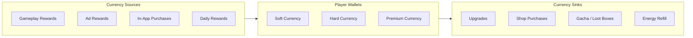

### Economy Scaffold by Genre

| Element | RPG | Puzzle | Idle |
|---------|-----|--------|------|
| Soft currency | Gold | Coins | Cash |
| Hard currency | Gems | Gems | Gems |
| Energy/Lives | Stamina | Lives | — |
| Shop | Equipment, consumables | Hints, lives | Boosters, multipliers |
| Gacha/Loot | Equipment chests | — | — |

### Generated Economy Components

| Component | Unity | Backend |
|-----------|-------|---------|
| `ICurrencySystem` | Wallet management | — |
| `CurrencySystem` | Client currency logic | — |
| `EconomyConfig` | ScriptableObject (currency defs, prices) | — |
| `ShopSystem` | Shop UI + purchase flow | — |
| `EconomyService` | — | Transaction processing |
| `EconomyController` | — | REST API |
| `TransactionEntity` | — | Audit log entity |
| `AntiFraudValidator` | — | Server-side validation |

### Economy API Endpoints

| Endpoint | Method | Description |
|----------|--------|-------------|
| `/api/v1/economy/wallet` | GET | Player wallet balances |
| `/api/v1/economy/transaction` | POST | Process transaction |
| `/api/v1/economy/shop` | GET | Shop catalog |
| `/api/v1/economy/purchase` | POST | Purchase item |
| `/api/v1/economy/history` | GET | Transaction history |

### Economy Documentation

Phase 1 generates `docs/ECONOMY.md` with:

| Section | Content |
|---------|---------|
| Currency definitions | Soft, hard, premium with descriptions |
| Source table | Empty template for designers to fill |
| Sink table | Empty template for designers to fill |
| Price points | IAP tier placeholders |
| Balance notes | Designer workspace |

---

## Analytics

Analytics scaffolds ensure every generated game emits structured events from day one, integrated with `framework/analytics/`.

### Analytics Architecture

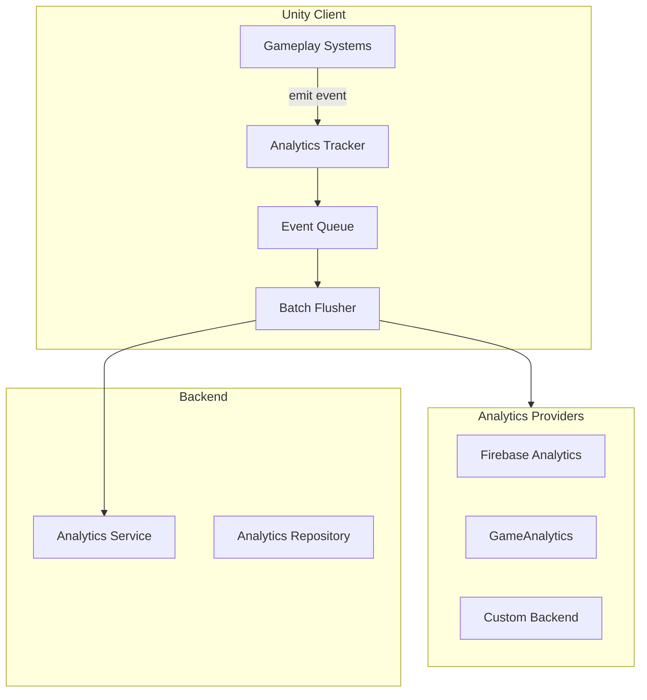

### Analytics Event Schema

| Field | Type | Required | Description |
|-------|------|----------|-------------|
| `eventName` | string | yes | Snake_case event identifier |
| `timestamp` | ISO8601 | yes | Event time |
| `playerId` | string | yes | Anonymous or authenticated player id |
| `sessionId` | string | yes | Session identifier |
| `properties` | object | no | Event-specific properties |
| `platform` | string | yes | `ios` or `android` |
| `appVersion` | string | yes | Client version |
| `genre` | string | no | Game genre |

### Standard Events (All Genres)

| Event | Properties | When |
|-------|------------|------|
| `session_start` | `sessionId`, `platform` | App launch |
| `session_end` | `sessionId`, `durationSeconds` | App close/background |
| `level_start` | `levelId`, `attemptNumber` | Level/stage begins |
| `level_complete` | `levelId`, `durationSeconds`, `score` | Level completed |
| `level_fail` | `levelId`, `failReason` | Level failed |
| `tutorial_step` | `stepId`, `stepName` | Tutorial progression |
| `currency_earned` | `currencyType`, `amount`, `source` | Currency awarded |
| `currency_spent` | `currencyType`, `amount`, `sink` | Currency spent |
| `iap_initiated` | `productId`, `price` | Purchase started |
| `iap_completed` | `productId`, `price`, `receipt` | Purchase completed |

### Genre-Specific Events

| Genre | Event | Properties |
|-------|-------|------------|
| RPG | `combat_start` | `encounterId`, `enemyType` |
| RPG | `combat_end` | `encounterId`, `result`, `loot` |
| Puzzle | `hint_used` | `levelId`, `hintType` |
| Idle | `prestige` | `prestigeLevel`, `bonusEarned` |
| Idle | `upgrade_purchased` | `upgradeId`, `level`, `cost` |

### Generated Analytics Scaffold

| Component | Description |
|-----------|-------------|
| `IAnalyticsTracker` | Interface in `framework/analytics/` |
| `AnalyticsTracker` | Implementation with provider adapter |
| `AnalyticsConfig` | ScriptableObject (provider, batch size, flush interval) |
| `AnalyticsEvents` | Static class with event name constants |
| `docs/ANALYTICS.md` | Event catalog documentation |

---

## Ads

Ads scaffolding integrates rewarded, interstitial, and banner ad placements with configurable mediation.

### Ads Architecture

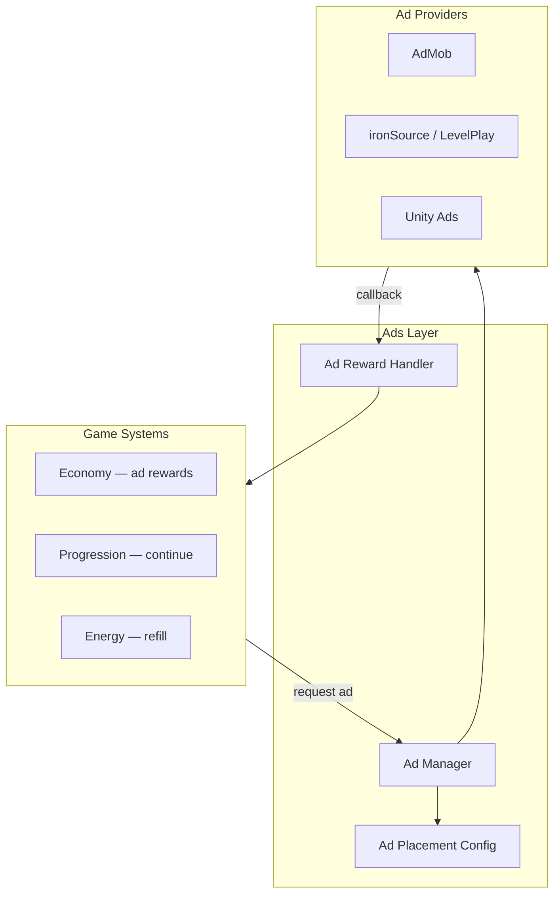

### Ad Placement Types

| Placement | Trigger | Reward | Genre Default |
|-----------|---------|--------|---------------|
| `rewarded_continue` | Level fail | Continue playing | Puzzle, Runner |
| `rewarded_currency` | Player opt-in | Soft currency | Idle, RPG |
| `rewarded_energy` | Energy depleted | Energy refill | Puzzle, RPG |
| `rewarded_multiplier` | Player opt-in | 2x earnings (timed) | Idle |
| `interstitial_level_end` | Level complete | None (monetization) | Puzzle, Runner |
| `banner_main_menu` | Main menu visible | None | All (optional) |

### Generated Ads Scaffold

| Component | Description |
|-----------|-------------|
| `IAdManager` | Ad lifecycle interface |
| `AdManager` | Provider-agnostic ad manager |
| `AdPlacementConfig` | ScriptableObject defining placements |
| `AdRewardHandler` | Maps ad completion to game rewards |
| `AdConsentHandler` | GDPR/COPPA consent flow scaffold |
| `AdMobAdapter` | AdMob provider adapter (default) |

### Ads Configuration

```yaml
# unity/Assets/_Project/ScriptableObjects/Config/AdConfig.asset
placements:
  - id: rewarded_continue
    type: rewarded
    provider: admob
    unitId: "ca-app-pub-XXXX/YYYY"
    cooldownSeconds: 60
  - id: interstitial_level_end
    type: interstitial
    provider: admob
    frequency: every_3_levels
consent:
  gdprRequired: true
  coppaCompliant: true
```

---

## Achievements

Achievement systems scaffold platform achievements (Game Center, Google Play Games) and in-game achievement tracking.

### Achievements Architecture

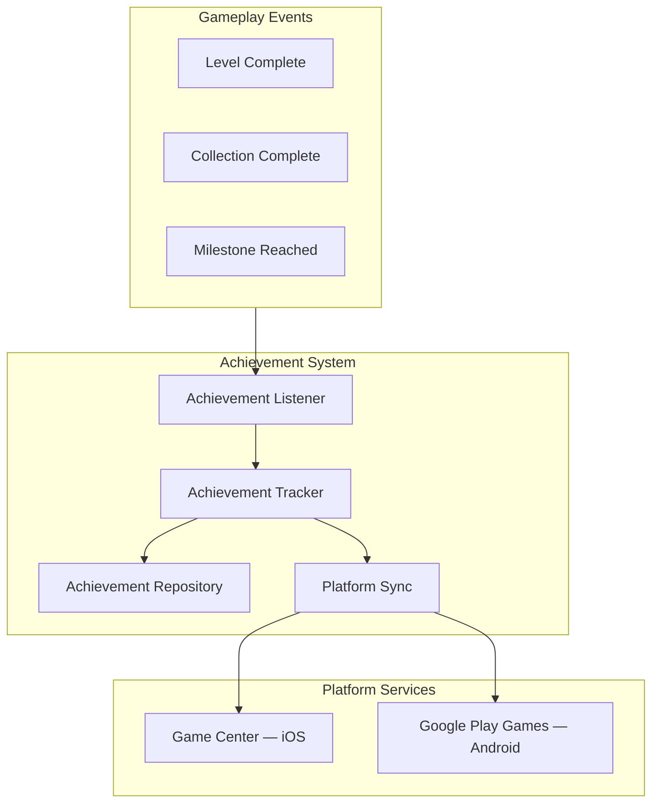

### Achievement Definition Schema

| Field | Type | Description |
|-------|------|-------------|
| `id` | string | Unique achievement id |
| `name` | string | Display name |
| `description` | string | Achievement description |
| `type` | enum | `incremental`, `single` |
| `targetValue` | number | Completion threshold (incremental) |
| `platformIds` | object | Game Center / GPG ids |
| `reward` | object | Optional in-game reward |
| `hidden` | boolean | Hidden until unlocked |

### Genre Achievement Examples

| Genre | Achievement | Type | Target |
|-------|-------------|------|--------|
| RPG | "Dragon Slayer" | single | Defeat first boss |
| RPG | "Collector" | incremental | Collect 100 items |
| Puzzle | "Perfectionist" | incremental | 3-star 50 levels |
| Idle | "Millionaire" | incremental | Earn 1M soft currency |
| All | "Dedicated" | incremental | 7-day login streak |

### Generated Achievements Scaffold

| Component | Unity | Backend |
|-----------|-------|---------|
| `IAchievementSystem` | Achievement tracking interface | — |
| `AchievementSystem` | Client achievement logic | — |
| `AchievementConfig` | ScriptableObject (achievement definitions) | — |
| `AchievementService` | — | Server-side achievement sync |
| `AchievementController` | — | REST API |

---

## Cloud Save

Cloud save scaffolds player data persistence across devices with conflict resolution and offline support.

### Cloud Save Architecture

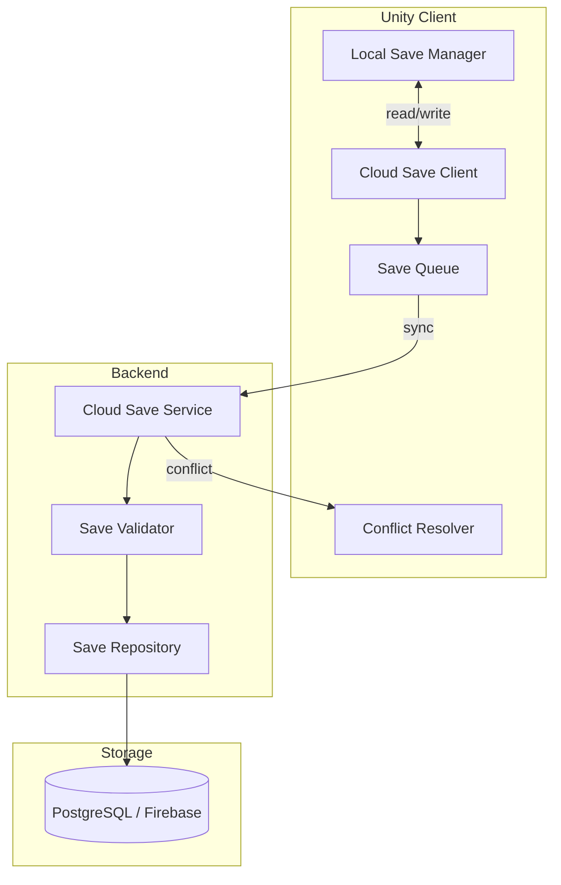

### Save Data Categories

| Category | Sync Priority | Conflict Strategy | Examples |
|----------|---------------|-------------------|----------|
| `progression` | Critical | Server wins | Level, XP, unlocks |
| `economy` | Critical | Server wins | Currency balances |
| `inventory` | High | Merge | Items, equipment |
| `settings` | Low | Client wins | Audio, language, accessibility |
| `statistics` | Medium | Max value | High scores, totals |

### Cloud Save API Endpoints

| Endpoint | Method | Description |
|----------|--------|-------------|
| `/api/v1/save` | GET | Fetch player save data |
| `/api/v1/save` | PUT | Upload save data |
| `/api/v1/save/sync` | POST | Bidirectional sync with conflict resolution |
| `/api/v1/save/backup` | GET | List save backups |

### Generated Cloud Save Scaffold

| Component | Description |
|-----------|-------------|
| `ICloudSaveManager` | Save/load interface |
| `CloudSaveManager` | Client save with offline queue |
| `SaveData` | Serializable save data structure |
| `ConflictResolver` | Strategy-based conflict resolution |
| `CloudSaveService` | Backend persistence service |
| `SaveValidator` | Anti-tamper validation |

### Offline Support

| Rule | Description |
|------|-------------|
| CS-1 | Local save always written first |
| CS-2 | Cloud sync queued when offline; flushed on reconnect |
| CS-3 | Sync interval configurable (default: 60 seconds) |
| CS-4 | Critical data (progression, economy) validated server-side |
| CS-5 | Save corruption triggers backup restore |

---

## Localization

Localization scaffolds multi-language support for UI text, assets, and dynamic content.

### Localization Architecture

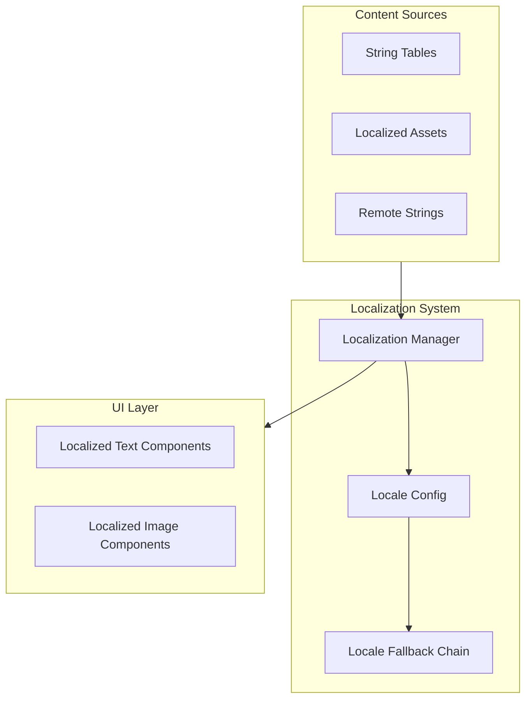

### Supported Locales (Default Scaffold)

| Code | Language | Priority |
|------|----------|----------|
| `en` | English | Default |
| `es` | Spanish | Tier 1 |
| `fr` | French | Tier 1 |
| `de` | German | Tier 1 |
| `ja` | Japanese | Tier 2 |
| `ko` | Korean | Tier 2 |
| `pt-BR` | Portuguese (Brazil) | Tier 2 |
| `zh-CN` | Chinese (Simplified) | Tier 2 |

Additional locales added via configuration without code changes.

### Generated Localization Scaffold

| Component | Description |
|-----------|-------------|
| `ILocalizationManager` | Locale switching interface |
| `LocalizationManager` | Unity Localization package integration |
| `StringTable` | Per-locale string tables in `Localization/` |
| `LocalizedText` | UI component replacing static text |
| `LocaleConfig` | ScriptableObject (supported locales, default, fallback) |
| `docs/LOCALIZATION.md` | Localization guide for translators |

### Localization File Structure

```
unity/Assets/_Project/Localization/
├── StringTables/
│   ├── UI_en.asset
│   ├── UI_es.asset
│   └── UI_fr.asset
├── AssetTables/
│   └── (localized sprites — placeholder)
└── LocaleConfig.asset
```

### Dynamic Content Localization

| Content Type | Strategy |
|--------------|----------|
| UI labels | String tables |
| Item/character names | ScriptableObject per locale |
| Store descriptions | Remote config per locale |
| Push notifications | Backend locale-aware templates |

---

## Accessibility

Accessibility scaffolds ensure generated games include foundational accessibility features, not retrofits.

### Accessibility Architecture

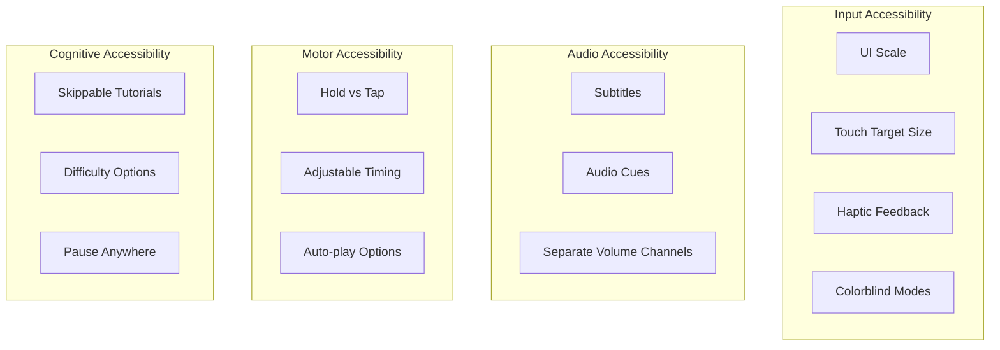

### Accessibility Features Scaffold

| Feature | Default | Configurable | Implementation |
|---------|---------|--------------|----------------|
| UI text scaling | 100–200% | yes | `AccessibilitySettings` SO |
| Minimum touch target | 44×44 pt | yes | UI layout guidelines |
| Colorblind modes | off, protanopia, deuteranopia, tritanopia | yes | Shader/UI color filters |
| Subtitles | off (on by default for narrative) | yes | `SubtitleSystem` |
| Haptic feedback | on | yes | `HapticFeedbackManager` |
| Hold-to-confirm | off | yes | Input system modifier |
| Reduced motion | off | yes | Animation speed multiplier |
| Screen reader hints | scaffolded | yes | Accessibility labels on UI |

### Generated Accessibility Scaffold

| Component | Description |
|-----------|-------------|
| `IAccessibilityManager` | Settings management interface |
| `AccessibilityManager` | Apply accessibility settings globally |
| `AccessibilitySettings` | ScriptableObject (all toggles and ranges) |
| `AccessibleButton` | UI button with minimum touch target enforcement |
| `AccessibleText` | Text with scaling and contrast support |
| `SubtitleSystem` | Subtitle display for audio content |
| Settings UI screen | In-game accessibility settings panel |

### Accessibility Standards

Generated projects follow:

| Standard | Requirement |
|----------|-------------|
| WCAG 2.1 AA | Color contrast ratios for UI text |
| Platform guidelines | iOS Accessibility, Android Accessibility |
| Touch targets | Minimum 44×44 pt (iOS) / 48×48 dp (Android) |
| Font scaling | Respect system font size settings |

---

## Performance

Performance scaffolds enforce mobile optimization conventions in all generated Unity code and project settings.

### Performance Architecture

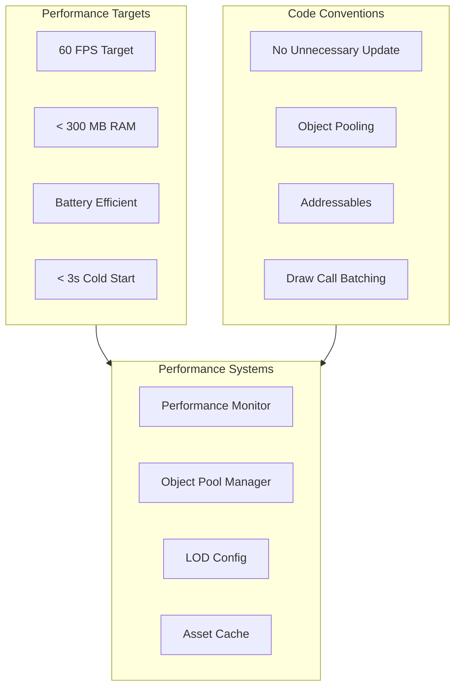

### Performance Targets by Platform

| Metric | iOS | Android (mid-range) | Android (low-end) |
|--------|-----|---------------------|-------------------|
| Target FPS | 60 | 60 | 30 (configurable) |
| Max memory | 300 MB | 350 MB | 250 MB |
| Cold start | < 3s | < 4s | < 5s |
| Scene load | < 2s | < 3s | < 4s |
| Draw calls | < 100 | < 150 | < 80 |

### Generated Performance Scaffold

| Component | Description |
|-----------|-------------|
| `PerformanceConfig` | ScriptableObject (FPS target, quality levels) |
| `PerformanceMonitor` | Runtime FPS/memory overlay (dev builds) |
| `ObjectPoolManager` | Generic object pooling system |
| `QualitySettingsManager` | Auto/manual quality level switching |
| `AddressableAssetManager` | Addressables loading wrapper |

### Code Conventions (Enforced by Validators)

| Convention | Rule | Validator |
|------------|------|-----------|
| No polling Update() | Use events instead of per-frame checks | `unity:performance` |
| Object pooling | Pool frequently spawned objects | `unity:performance` |
| No LINQ in hot paths | Avoid allocations in Update/Tick | `unity:performance` |
| ScriptableObject data | No hardcoded game values | `unity:data-driven` |
| Texture compression | ASTC (iOS), ETC2 (Android) | `unity:assets` |
| Audio compression | Vorbis/MP3 for music, ADPCM for SFX | `unity:assets` |

### Unity Project Settings (Generated)

| Setting | Value | Reason |
|---------|-------|--------|
| Target platform | iOS + Android | Mobile-first |
| Scripting backend | IL2CPP | Performance + security |
| API compatibility | .NET Standard 2.1 | Cross-platform |
| Graphics API | Metal (iOS), Vulkan/OpenGLES3 (Android) | Platform optimal |
| Static batching | Enabled | Draw call reduction |
| GPU skinning | Enabled | Animation performance |

---

## Asset Pipeline

The asset pipeline scaffold defines how art, audio, and data assets flow from creation to runtime loading.

### Asset Pipeline Architecture

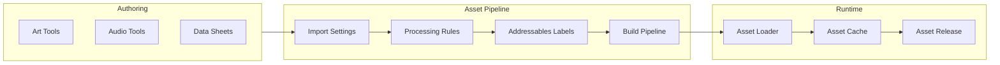

### Asset Categories

| Category | Directory | Loading Strategy | Compression |
|----------|-----------|------------------|-------------|
| UI sprites | `Assets/_Project/Art/UI/` | Addressables | ASTC/ETC2 |
| Characters | `Assets/_Project/Art/Characters/` | Addressables | ASTC/ETC2 |
| Environment | `Assets/_Project/Art/Environment/` | Addressables + LOD | ASTC/ETC2 |
| Audio — music | `Assets/_Project/Audio/Music/` | Addressables, streaming | Vorbis |
| Audio — SFX | `Assets/_Project/Audio/SFX/` | Addressables, preload | ADPCM |
| VFX | `Assets/_Project/VFX/` | Addressables | Platform default |
| Data | `Assets/_Project/ScriptableObjects/Data/` | Direct reference | N/A |
| Config | `Assets/_Project/ScriptableObjects/Config/` | Direct reference | N/A |

### Addressables Group Structure

| Group | Load Strategy | Content |
|-------|---------------|---------|
| `Boot` | Preload at startup | Core systems, boot scene assets |
| `UI` | Preload after boot | UI prefabs, fonts, common sprites |
| `Gameplay` | Load on demand | Level assets, characters, VFX |
| `Audio` | Load on demand | Music and SFX packs |
| `Localization` | Load per locale | Locale-specific assets |

### Generated Asset Pipeline Scaffold

| Component | Description |
|-----------|-------------|
| `AddressableAssetManager` | Wrapper for Addressables load/release |
| `AssetImportConfig` | Import settings documentation |
| `AddressableGroups` | Pre-configured Addressables groups |
| `AssetBuildScript` | CI asset build step |
| `docs/ASSET_PIPELINE.md` | Asset pipeline guide for artists |

### Asset Naming Conventions

| Asset Type | Pattern | Example |
|------------|---------|---------|
| Sprite | `{category}_{name}` | `ui_button_play` |
| Prefab | `{type}_{name}` | `enemy_goblin` |
| Audio | `{type}_{name}` | `sfx_coin_collect` |
| ScriptableObject | `{name}Data` | `EnemyGoblinData` |
| Scene | `{purpose}` | `Boot`, `Main`, `Level_001` |

---

## Prefab Generation

Prefab generation scaffolds reusable GameObject hierarchies with components, references, and naming conventions.

### Prefab Architecture

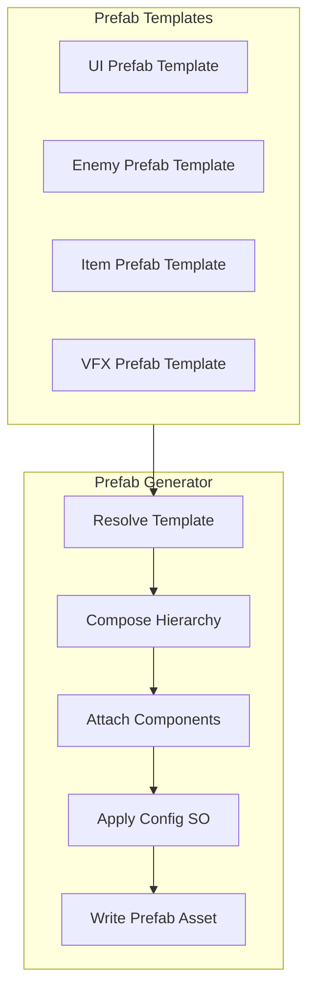

### Prefab Categories by Genre

| Category | RPG | Puzzle | Idle | Description |
|----------|-----|--------|------|-------------|
| UI screens | yes | yes | yes | Menu, HUD, popup prefabs |
| Characters | yes | — | — | Player, enemy prefabs |
| Game objects | yes | yes | yes | Board pieces, tap targets |
| VFX | yes | yes | yes | Particle effect prefabs |
| Items | yes | — | — | Collectible, loot prefabs |

### Prefab Template Contract

| Field | Type | Description |
|-------|------|-------------|
| `id` | string | Prefab template id |
| `name` | string | Prefab name |
| `category` | enum | `ui`, `character`, `gameplay`, `vfx`, `item` |
| `hierarchy` | NodeDefinition[] | GameObject tree |
| `components` | ComponentDefinition[] | Components per node |
| `configReference` | string | ScriptableObject config binding |
| `addressableLabel` | string | Addressables label |

### Generated Prefabs (per template)

| Prefab | RPG | Puzzle | Idle |
|--------|-----|--------|------|
| `UI_MainMenu` | yes | yes | yes |
| `UI_HUD` | yes | yes | yes |
| `UI_Popup_Reward` | yes | yes | yes |
| `UI_Shop` | yes | — | yes |
| `UI_Settings` | yes | yes | yes |
| `Player` | yes | — | — |
| `Enemy_Base` | yes | — | — |
| `PuzzleTile` | — | yes | — |
| `TapTarget` | — | — | yes |
| `VFX_Reward` | yes | yes | yes |

### Prefab Generation Command

```
genesis generate unity-prefab <name> --template <category> --genre <genre>
```

### Prefab Conventions

| Rule | Description |
|------|-------------|
| PF-1 | All prefabs in `Assets/_Project/Prefabs/{category}/` |
| PF-2 | Root GameObject name matches prefab name |
| PF-3 | Components reference ScriptableObject configs, not hardcoded values |
| PF-4 | UI prefabs include `AccessibleButton` / `AccessibleText` components |
| PF-5 | All prefabs registered in Addressables with appropriate label |

---

## Scene Generation

Scene generation scaffolds Unity scenes with cameras, lighting, UI canvas, and system bootstrap configuration.

### Scene Architecture

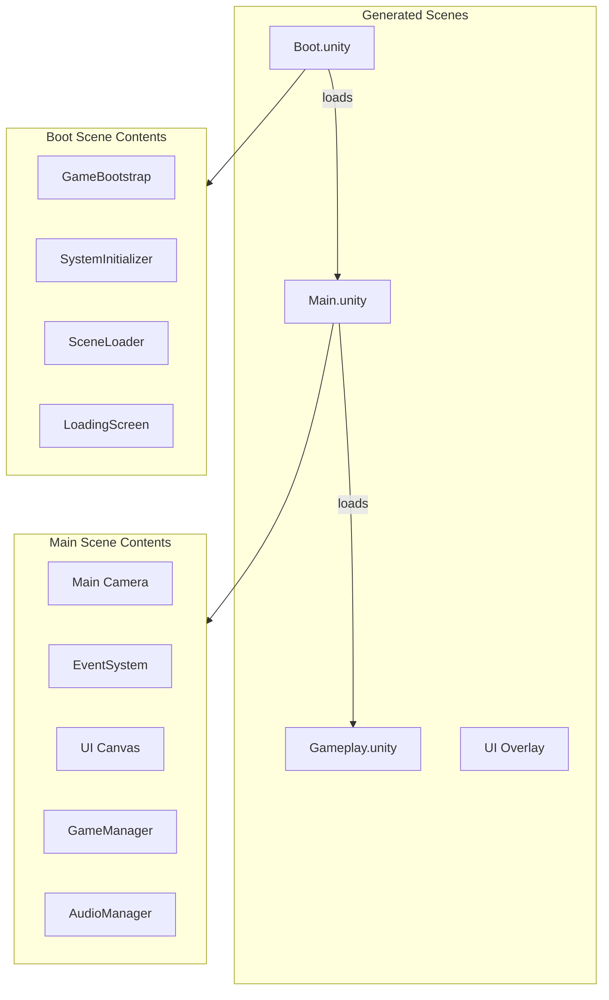

### Standard Scenes

| Scene | Purpose | Contents | Genre |
|-------|---------|----------|-------|
| `Boot.unity` | App initialization | Bootstrap, DI, system init, loading screen | All |
| `Main.unity` | Main menu / hub | Camera, UI canvas, menu navigation | All |
| `Gameplay.unity` | Core gameplay | Game board/world, gameplay systems | Genre-specific |
| `Loading.unity` | Async loading | Progress bar, tips display | All (optional) |

### Genre-Specific Gameplay Scenes

| Genre | Scene | Contents |
|-------|-------|----------|
| RPG | `Gameplay.unity` | Player spawn, encounter zones, camera follow |
| Puzzle | `Level.unity` | Puzzle board grid, tile container, UI overlay |
| Idle | `Gameplay.unity` | Tap area, upgrade panel, income display |
| Runner | `Gameplay.unity` | Runner path, obstacle spawner, camera follow |

### Scene Generation Contract

| Field | Type | Description |
|-------|------|-------------|
| `id` | string | Scene template id |
| `name` | string | Scene file name |
| `gameObjects` | GameObjectDefinition[] | Root objects to create |
| `lighting` | LightingConfig | Ambient, directional light settings |
| `camera` | CameraConfig | Camera type, position, settings |
| `ui` | UIConfig | Canvas, event system setup |
| `systems` | string[] | Systems to initialize in scene |
| `buildIndex` | number | Build settings index |

### Scene Setup Rules

| Rule | Description |
|------|-------------|
| SC-1 | Boot scene is index 0 in build settings |
| SC-2 | Single responsibility per scene |
| SC-3 | No cross-scene direct references (use Addressables or scene manager) |
| SC-4 | Lighting configured for mobile (baked where possible) |
| SC-5 | UI canvas uses Screen Space — Overlay with safe area support |
| SC-6 | EventSystem present in every scene with UI |

### Scene Generation Command

```
genesis generate unity-scene <name> --template <type> --genre <genre>
```

---

## Future AI NPC Generation

AI NPC generation is a future capability that scaffolds non-player characters with LLM-driven dialogue, behavior trees, and personality systems. This section defines the architecture only — no implementation in Phase 3.

### AI NPC Architecture (Future)

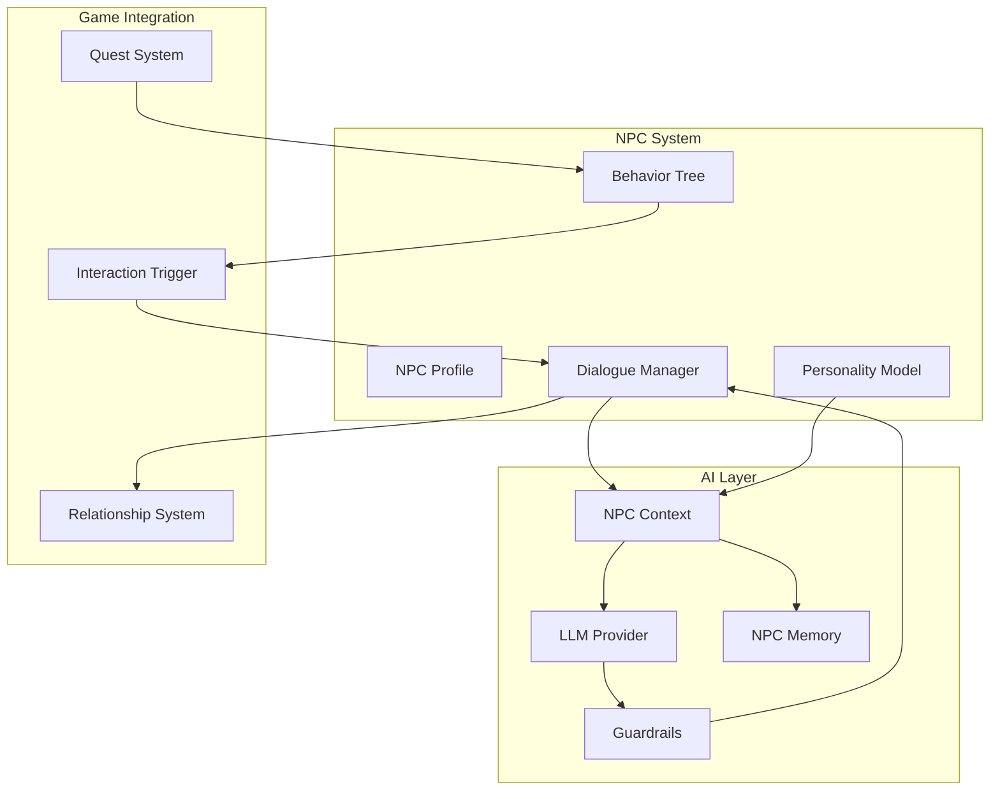

### NPC Profile Schema (Future)

| Field | Type | Description |
|-------|------|-------------|
| `id` | string | NPC identifier |
| `name` | string | Display name |
| `personality` | PersonalityTraits | Big Five or custom traits |
| `backstory` | string | Character background for LLM context |
| `knowledge` | string[] | What the NPC knows about |
| `goals` | string[] | NPC motivations |
| `dialogueStyle` | enum | `formal`, `casual`, `mysterious`, `comic` |
| `relationships` | RelationshipMap | Connections to other NPCs |
| `questIds` | string[] | Associated quests |

### NPC Generation Scaffold (Future)

| Component | Description |
|-----------|-------------|
| `INPCDialogueSystem` | Dialogue management interface |
| `NPCDialogueSystem` | LLM-powered dialogue with guardrails |
| `NPCProfile` | ScriptableObject (personality, backstory) |
| `NPCMemory` | Per-player conversation history |
| `BehaviorTree` | AI behavior scaffold (non-LLM) |
| `DialogueUI` | Speech bubble / dialogue box prefab |
| `NPCContextBuilder` | Assembles NPC context for LLM calls |

### NPC Guardrails (Future)

| Guardrail | Description |
|-----------|-------------|
| Stay in character | NPC responses match personality and knowledge |
| No meta-gaming | NPC does not reveal game mechanics unprompted |
| Content safety | No harmful, offensive, or inappropriate dialogue |
| Spoiler prevention | NPC does not reveal unreached story content |
| Cost control | Per-NPC and per-session dialogue token budgets |
| Fallback dialogue | Scripted fallback when LLM unavailable |

### NPC Generation Command (Future)

```
genesis generate npc <name> --personality <traits> --genre <genre>
```

### Integration with AI Engine

NPC dialogue uses [005-ai-engine](../005-ai-engine/FUNCTIONAL_SPEC.md):

| AI Engine Feature | NPC Usage |
|-------------------|-----------|
| Provider Router | Route dialogue to appropriate LLM |
| Context Manager | Assemble NPC knowledge + player history |
| Guardrail Engine | Character, safety, and spoiler guardrails |
| Cost Tracker | Per-NPC dialogue budget |
| RAG | Retrieve lore and world knowledge for grounded responses |

---

## Generation Pipeline

### End-to-End Pipeline

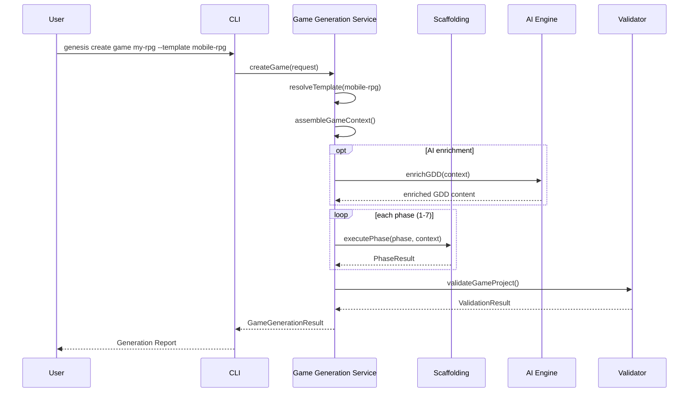

### Phase Dependencies

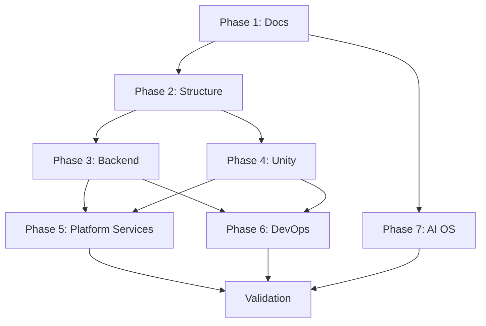

### CLI Command

```
genesis create game <name> [options]
```

| Flag | Type | Default | Description |
|------|------|---------|-------------|
| `--template` | string | `default` | Game template id |
| `--genre` | string | from template | Override genre |
| `--platform` | string | `mobile` | Target platform |
| `--monetization` | string | from template | `f2p`, `premium`, `hybrid` |
| `--no-ai` | boolean | false | Skip AI enrichment |
| `--dry-run` | boolean | false | Show plan without writing |
| `--force` | boolean | false | Overwrite existing directory |
| `--interactive` | boolean | auto | Prompt for missing variables |

---

## Validation

### Post-Generation Validation

| Check ID | Scope | Severity | Description |
|----------|-------|----------|-------------|
| `GAME-001` | project | error | GDD.md exists with required sections |
| `GAME-002` | project | error | ARCHITECTURE.md exists |
| `GAME-003` | project | error | Backend directory structure complete |
| `GAME-004` | project | error | Unity project opens (manifest valid) |
| `GAME-005` | project | error | Core systems scaffolded per genre |
| `GAME-006` | project | warning | Analytics events defined |
| `GAME-007` | project | warning | Localization tables present |
| `GAME-008` | project | warning | Accessibility settings scaffold present |
| `GAME-009` | backend | error | Backend compiles (`tsc --noEmit`) |
| `GAME-010` | unity | error | No scripts exceed 200 lines |
| `GAME-011` | project | error | No secrets in generated files |
| `GAME-012` | project | error | `.cursor/rules/` present |

---

## Public API

### Game Generation Service

| Method | Input | Output | Description |
|--------|-------|--------|-------------|
| `createGame(request)` | CreateGameRequest | GameGenerationResult | Full game project generation |
| `listTemplates()` | — | GameTemplateInfo[] | List available game templates |
| `listGenres()` | — | GenreInfo[] | List supported genres |
| `getTemplate(id)` | string | GameTemplate | Get template definition |
| `preview(request)` | CreateGameRequest | DryRunResult | Dry-run without writing |
| `validateGame(path)` | string | ValidationResult | Validate existing game project |

### CreateGameRequest

| Field | Type | Required | Description |
|-------|------|----------|-------------|
| `name` | string | yes | Game project name |
| `template` | string | no | Template id (default: `default`) |
| `genre` | string | no | Genre override |
| `platform` | string[] | no | Target platforms |
| `monetization` | string | no | Monetization model |
| `variables` | object | no | Additional variables |
| `flags` | object | no | CLI flags |
| `enrichWithAI` | boolean | no | Enable AI enrichment (default: true) |

---

## Examples

### Example 1 — Mobile RPG

**Command:**
```bash
genesis create game ocean-quest --template mobile-rpg --author "Studio X"
```

**Generated systems:** Combat, Inventory, Progression, Economy, Achievements, Cloud Save, Analytics, Ads (rewarded), Localization (en, es, fr), Accessibility

**Output:** 78 files across 7 phases, 3.4s

### Example 2 — Puzzle Game with Interactive Prompts

**Command:**
```bash
genesis create game tile-master --template mobile-puzzle --interactive
```

**Prompts:** Game name, author, monetization (ads+iap), lives count (5), analytics provider

**Generated systems:** Level, PuzzleBoard, StarRating, Lives, Economy, Analytics, Ads (rewarded + interstitial)

### Example 3 — Idle Game Dry-Run

**Command:**
```bash
genesis create game coin-empire --template mobile-idle --dry-run
```

**Report:** Would create 72 files — docs (6), backend (18), Unity (38), DevOps (4), AI OS (6)

---

## Related Documents

| Document | Relationship |
|----------|-------------|
| [README.md](README.md) | Parent specification overview |
| [004-scaffolding/FUNCTIONAL_SPEC.md](../004-scaffolding/FUNCTIONAL_SPEC.md) | Generation orchestration |
| [005-ai-engine/FUNCTIONAL_SPEC.md](../005-ai-engine/FUNCTIONAL_SPEC.md) | AI enrichment |
| [007-backend/README.md](../007-backend/) | Backend generation phase |
| [008-unity/README.md](../008-unity/) | Unity generation phase |
| [009-liveops/README.md](../009-liveops/) | Post-launch LiveOps extension |
| [games/README.md](../../games/README.md) | Game project rules |
| [framework/README.md](../../framework/README.md) | Reusable framework modules |
| [DECISION_LOG.md](../../DECISION_LOG.md) | ADR-004, ADR-007 |

## Changelog

| Version | Date | Change |
|---------|------|--------|
| 1.0.0 | 2026-07-26 | Initial functional specification |
