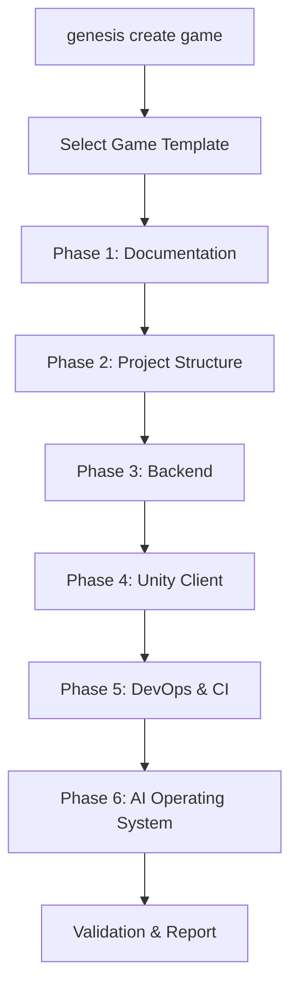

# Game Generation Specification

## Purpose

Define the end-to-end game project generation capability that produces complete, production-ready game structures including documentation, architecture, backend services, Unity client, and development workflows from a single `genesis create game` command.

## Documents

| Document | Description |
|----------|-------------|
| [FUNCTIONAL_SPEC.md](FUNCTIONAL_SPEC.md) | **Complete functional specification** — genres, templates, core loop, progression, economy, analytics, ads, achievements, cloud save, localization, accessibility, performance, asset pipeline, prefabs, scenes, AI NPC |
| This document | Overview, responsibilities, and implementation roadmap |

## Scope

### In Scope

- Game project templates (genre, platform, architecture variants)
- Multi-phase generation orchestration (docs → backend → Unity → CI)
- Game-specific variable context (genre, platform, monetization model)
- Generated project structure aligned with `framework/` conventions
- Development workflow setup (git, CI, Cursor AI OS)
- Game design document generation

### Out of Scope

- Gameplay implementation (generated projects contain skeletons, not finished games)
- Asset creation (art, audio, 3D models)
- App store deployment
- Live operations setup (see [009-liveops](../009-liveops/))
- Game balance and economy tuning

## Goals

| Goal | Success Criteria |
|------|------------------|
| **Complete structure** | Generated project has docs, backend, Unity, CI, and AI OS |
| **Production patterns** | Generated code follows Clean Architecture and project standards |
| **Mobile-ready** | Unity project configured for iOS/Android build targets |
| **AI-ready** | Generated project includes `.cursor/` rules and context |
| **Documented** | GDD, architecture doc, and README generated automatically |
| **Buildable** | Generated backend compiles; Unity project opens without errors |

## Responsibilities

### Generation Pipeline



| Phase | Generator | Output |
|-------|-----------|--------|
| 1 — Documentation | `docs-generator` | GDD, architecture doc, README, glossary |
| 2 — Structure | `structure-generator` | Directory tree, config files, git setup |
| 3 — Backend | [007-backend](../007-backend/) | NestJS API with auth, health, module structure |
| 4 — Unity | [008-unity](../008-unity/) | Unity project with scenes, systems, ScriptableObjects |
| 5 — DevOps | `devops-generator` | GitHub Actions, Docker, environment config |
| 6 — AI OS | `ai-os-generator` | `.cursor/rules/`, context, prompts for the game |

### Game Templates

| Template | Genre | Platform | Backend | Description |
|----------|-------|----------|---------|-------------|
| `mobile-rpg` | RPG | iOS/Android | NestJS + PostgreSQL | Turn-based mobile RPG skeleton |
| `mobile-puzzle` | Puzzle | iOS/Android | NestJS + Redis | Casual puzzle game skeleton |
| `mobile-idle` | Idle/Clicker | iOS/Android | NestJS + PostgreSQL | Idle game with progression |
| `default` | Generic | iOS/Android | NestJS | Minimal game project structure |

Templates are extensible via plugins. New templates register through [003-plugin-system](../003-plugin-system/).

### Generated Project Structure

```
my-game/
├── .cursor/                  # AI operating system for this game
│   ├── rules/
│   └── context/
├── .github/workflows/        # CI/CD
├── docs/                     # GDD, architecture, API docs
│   ├── GDD.md
│   └── ARCHITECTURE.md
├── backend/                  # NestJS API
│   ├── src/
│   │   ├── domain/
│   │   ├── application/
│   │   ├── infrastructure/
│   │   └── presentation/
│   ├── test/
│   └── package.json
├── unity/                    # Unity client
│   ├── Assets/
│   │   ├── Scripts/
│   │   ├── ScriptableObjects/
│   │   ├── Scenes/
│   │   └── Prefabs/
│   └── ProjectSettings/
├── .genesis/                 # Genesis project config
│   └── config.yml
├── genesis.config.yml
└── README.md
```

### Game Design Document Generation

Phase 1 generates a GDD from template variables:

| Section | Source |
|---------|--------|
| Vision | User input + game template defaults |
| Core Loop | Template-defined for genre |
| Meta Loop | Template-defined for genre |
| Progression | Template-defined skeleton |
| Economy | Empty structure for designer input |
| Technical Requirements | Derived from platform and architecture |

The GDD is a starting point for designers, not a finished design.

### Context Variables

Game generation extends the scaffolding context with:

| Variable | Source | Example |
|----------|--------|---------|
| `gameName` | User input | `my-rpg` |
| `genre` | Template | `rpg` |
| `platform` | Flag or template | `mobile` |
| `backendType` | Template | `nestjs` |
| `databaseType` | Template | `postgres` |
| `unityVersion` | Plugin config | `2022.3 LTS` |
| `author` | Config or flag | `Studio Name` |
| `monetization` | Flag | `f2p` |

### Validation

Post-generation validation ensures:

| Check | Validator |
|-------|-----------|
| Directory structure complete | `@genesis/validator` |
| Backend compiles (`tsc --noEmit`) | Backend plugin validator |
| Unity project opens (manifest valid) | Unity plugin validator |
| Documentation files exist | `@genesis/validator` |
| `.cursor/` rules present | `@genesis/validator` |
| No secrets in generated files | `@genesis/validator` |

### AI Integration

Game generation uses [005-ai-engine](../005-ai-engine/) for:

- GDD content enrichment based on genre
- Architecture doc generation from project structure
- Custom `.cursor/rules/` tailored to the game genre
- Initial backlog generation from GDD

AI enrichment is optional (`--no-ai` flag skips AI steps).

## Dependencies

### Upstream Specifications

| Spec | Dependency |
|------|------------|
| [000-project](../000-project/) | Architecture principles |
| [004-scaffolding](../004-scaffolding/) | Generation orchestration |
| [002-template-engine](../002-template-engine/) | Template rendering |
| [003-plugin-system](../003-plugin-system/) | Plugin generators |
| [005-ai-engine](../005-ai-engine/) | AI enrichment (optional) |
| [007-backend](../007-backend/) | Backend generation phase |
| [008-unity](../008-unity/) | Unity generation phase |

### Downstream Consumers

| Spec | Relationship |
|------|-------------|
| [009-liveops](../009-liveops/) | LiveOps added to generated games post-launch |

## Future Implementation

### Phase 3 — Default Template

- Define `default` game template with docs and structure only
- Implement `genesis create game <name>` command
- Phase 1 (docs) and Phase 2 (structure) generators
- Integration test: generate project, verify directory tree

### Phase 3 — Full Templates

- `mobile-rpg` template with backend and Unity phases
- GDD generation from template
- AI OS generation for the game project
- DevOps/CI generation
- End-to-end test: generate, build backend, open Unity

### Phase 3 — AI Enrichment

- GDD content enrichment via [005-ai-engine](../005-ai-engine/)
- Genre-specific `.cursor/rules/` generation
- Backlog generation from GDD sections

### Future — Advanced

- Additional genre templates (strategy, card game, runner)
- Custom template authoring: `genesis template create game`
- Project migration: `genesis migrate` for framework updates
- Multiplayer game templates with networking scaffolding

## Related Documents

- [FUNCTIONAL_SPEC.md](FUNCTIONAL_SPEC.md) — Complete functional specification
- [004-scaffolding](../004-scaffolding/) — Generation orchestration
- [007-backend](../007-backend/) — Backend generation
- [008-unity](../008-unity/) — Unity generation
- [005-ai-engine](../005-ai-engine/) — AI enrichment
- [games/README.md](../../games/README.md) — Game project rules

## Changelog

| Version | Date | Change |
|---------|------|--------|
| 1.0.1 | 2026-07-26 | Linked FUNCTIONAL_SPEC.md |
| 1.0.0 | 2026-07-26 | Initial approved specification |
