# Genesis Backend Generator — Functional Specification

## Document Control

| Field | Value |
|-------|-------|
| **Specification** | [007-backend](README.md) |
| **Status** | Approved |
| **Version** | 1.0.0 |
| **Independence** | Implementation-independent. No framework, ORM, or cloud SDK is prescribed beyond documented contracts. |
| **Audience** | Backend engineers, API designers, platform architects, DevOps engineers, AI assistants |

## Purpose

Define the complete functional architecture of the **Genesis Backend Generator** — the subsystem responsible for scaffolding production-ready backend applications and modules with Clean Architecture, Domain-Driven Design, optional CQRS, authentication, authorization, database integration, caching, observability, API documentation, containerization, testing, and deployment configuration. The generator supports **NestJS** (primary), **Express**, and **Fastify** as HTTP framework targets, delivered through the plugin system.

## Scope

### In Scope

- Backend generator architecture and plugin model
- Framework targets: NestJS, Express, Fastify
- Architectural patterns: DDD, CQRS, repository pattern
- Authentication and authorization scaffolds
- Database integration: PostgreSQL, MongoDB, Redis
- Caching layer scaffolding
- Observability: logging, metrics, health checks, tracing hooks
- REST API conventions, Swagger, and OpenAPI generation
- Docker and deployment configuration scaffolds
- Testing scaffolds: unit, integration, e2e
- Generator catalog, validation rules, and public API
- Examples for each framework and pattern combination

### Out of Scope

- Runtime framework code in `framework/backend/` (reusable libraries, separate concern)
- GraphQL API generation (future)
- WebSocket and gRPC server generation (future)
- Database migration execution (generates migration files; does not run them)
- Production infrastructure provisioning (generates config; does not deploy)
- AWS Lambda / Firebase runtime implementations (separate cloud plugins)
- Game-specific domain logic ([006-game-generation](../006-game-generation/) consumes generators)

---

## Goals

### Primary Goals

| ID | Goal | Success Criteria |
|----|------|------------------|
| G1 | **Clean Architecture** | Generated code follows domain → application → infrastructure → presentation layers |
| G2 | **Framework-flexible** | Same DDD structure generated for NestJS, Express, and Fastify |
| G3 | **Production-ready** | Auth, validation, error handling, logging included by default |
| G4 | **Type-safe** | Strict TypeScript with DTOs, entities, and explicit return types |
| G5 | **Testable** | Unit and integration test scaffolds for every generated service |
| G6 | **Documented APIs** | Swagger/OpenAPI spec generated from controllers/routes |
| G7 | **Observable** | Structured logging, health endpoints, metrics hooks scaffolded |
| G8 | **Deployable** | Docker, environment config, and CI deployment steps generated |
| G9 | **Standards-compliant** | Output passes `standards/backend/` and `standards/api/` validators |
| G10 | **Plugin-extensible** | New frameworks and databases register via plugin system |

### Non-Functional Goals

| Attribute | Target |
|-----------|--------|
| Generation time | Full backend app < 10 seconds |
| Compile check | Generated NestJS backend passes `tsc --noEmit` |
| File count | 25–45 files for full app scaffold |
| API response time | N/A (scaffold only); health endpoint < 50ms when running |
| Test scaffold coverage | 100% of generated services have test files |

### Design Principles

1. **Domain at the center** — Business logic lives in domain and application layers; frameworks are adapters.
2. **Framework is presentation** — NestJS, Express, and Fastify differ only in the presentation layer.
3. **Interfaces inward** — Domain defines repository and service interfaces; infrastructure implements them.
4. **Explicit over magic** — No hidden decorators or implicit behavior without documentation.
5. **Secure by default** — Authentication scaffold included; secrets via environment only.
6. **Observable from day one** — Logging and health checks generated, not added later.
7. **Test alongside code** — Every service, use case, and controller gets a test scaffold.
8. **OpenAPI as contract** — API documentation generated from code, not maintained separately.

---

## Architecture

### System Overview

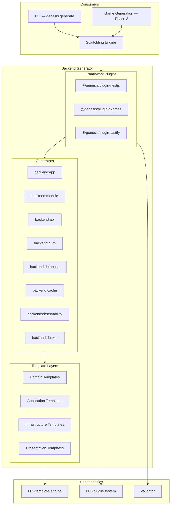

### Layer Architecture (Generated Backend)

All framework targets produce the same four-layer structure per ADR-001 and `standards/backend/`:

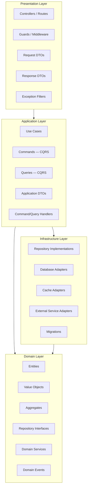

### Layer Responsibilities

| Layer | Responsibility | Framework Dependency |
|-------|----------------|---------------------|
| **Domain** | Entities, value objects, business rules, repository interfaces | None |
| **Application** | Use cases, commands, queries, orchestration, DTOs | None |
| **Infrastructure** | Database, cache, external APIs, repository implementations | ORM/driver only |
| **Presentation** | HTTP routing, request validation, auth guards, response formatting | NestJS / Express / Fastify |

### Component Model

| Component | Responsibility |
|-----------|----------------|
| **Backend Generator Plugin** | Registers generators, templates, validators per framework |
| **App Generator** | Full backend application scaffold |
| **Module Generator** | DDD module (domain + application + infrastructure + presentation) |
| **API Generator** | REST resource (controller, service, DTOs) |
| **Auth Generator** | Authentication and authorization module |
| **Database Generator** | ORM config, connection, migrations scaffold |
| **Cache Generator** | Redis cache module and decorators |
| **Observability Generator** | Logging, metrics, health, tracing scaffolds |
| **Docker Generator** | Dockerfile, docker-compose, env templates |
| **OpenAPI Generator** | Swagger spec from route definitions |

### Relationship to Other Systems

| System | Backend Generator Uses | Backend Generator Provides |
|--------|------------------------|---------------------------|
| Scaffolding | Plan execution, variable context | `generate backend`, `generate api` |
| Template Engine | Render all backend templates | — |
| Plugin System | Plugin registration | Framework plugins |
| Game Generation | — | Phase 3 backend scaffold |
| LiveOps | — | API endpoint patterns extended post-launch |
| Validator | — | Backend architecture validation rules |

---

## Framework Support

The Backend Generator supports three HTTP frameworks. **NestJS is the primary and default target.** Express and Fastify are alternative presentation-layer adapters sharing the same domain, application, and infrastructure templates.

### Framework Comparison

| Feature | NestJS | Express | Fastify |
|---------|--------|---------|---------|
| Plugin id | `@genesis/plugin-nestjs` | `@genesis/plugin-express` | `@genesis/plugin-fastify` |
| Priority | Phase 2 (first) | Phase 2+ | Phase 2+ |
| DI | Built-in (decorators) | Manual / tsyringe scaffold | Built-in (decorators) |
| Validation | class-validator + pipes | express-validator scaffold | JSON schema scaffold |
| Auth guards | `@UseGuards()` | Middleware chain | `preHandler` hooks |
| OpenAPI | `@nestjs/swagger` | swagger-jsdoc scaffold | `@fastify/swagger` |
| Module system | NestJS modules | Router modules | Fastify plugins |
| Default ORM | TypeORM / Prisma (configurable) | Prisma scaffold | Prisma scaffold |
| Recommended for | Full-featured APIs, games | Lightweight APIs, microservices | High-performance APIs |

### Framework Selection

| Method | Example |
|--------|---------|
| CLI flag | `genesis generate backend app --framework nestjs` |
| Project config | `.genesis/config.yml` → `backend.framework: nestjs` |
| Game template | `backend.framework` in game template definition |
| Default | `nestjs` when not specified |

### Shared vs Framework-Specific Templates

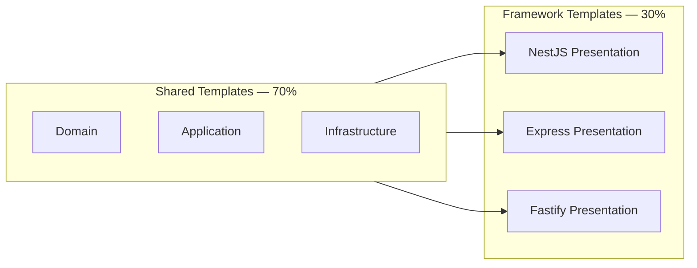

| Template Category | Shared | NestJS | Express | Fastify |
|-------------------|--------|--------|---------|---------|
| Entity | yes | — | — | — |
| Value Object | yes | — | — | — |
| Repository interface | yes | — | — | — |
| Use case | yes | — | — | — |
| Command/Query handler | yes | — | — | — |
| Repository implementation | partial | TypeORM | Prisma | Prisma |
| Controller | — | yes | Route handler | Route handler |
| Module/Plugin registration | — | yes | Router | Plugin |
| Auth guard/middleware | — | yes | yes | yes |
| Swagger setup | — | yes | yes | yes |

---

## Domain-Driven Design (DDD)

All generated backends follow DDD tactical patterns per `standards/backend/ddd.md`.

### DDD Building Blocks

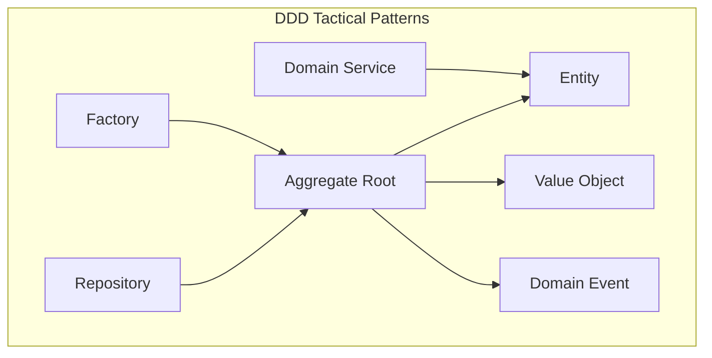

### Generated DDD Artifacts per Module

| Artifact | File Pattern | Layer | Description |
|----------|--------------|-------|-------------|
| Entity | `{name}.entity.ts` | Domain | Identity + mutable state |
| Value Object | `{name}.vo.ts` | Domain | Immutable, equality by value |
| Aggregate Root | `{name}.aggregate.ts` | Domain | Consistency boundary (optional) |
| Repository Interface | `{name}.repository.ts` | Domain | `I{Name}Repository` |
| Domain Service | `{name}.domain-service.ts` | Domain | Cross-entity logic |
| Domain Event | `{name}.event.ts` | Domain | State change notification |
| Use Case | `{action}-{name}.use-case.ts` | Application | Single operation orchestration |
| Application Service | `{name}.service.ts` | Application | Coordinates use cases |
| Repository Impl | `{name}.repository.ts` | Infrastructure | Database persistence |
| Controller | `{name}.controller.ts` | Presentation | HTTP adapter |

### Module Directory Structure

```
src/modules/{moduleName}/
├── domain/
│   ├── entities/
│   │   └── {name}.entity.ts
│   ├── value-objects/
│   │   └── {name}.vo.ts
│   ├── events/
│   │   └── {name}.event.ts
│   ├── interfaces/
│   │   └── {name}.repository.ts
│   └── services/
│       └── {name}.domain-service.ts
├── application/
│   ├── use-cases/
│   │   ├── create-{name}.use-case.ts
│   │   ├── get-{name}.use-case.ts
│   │   └── list-{name}s.use-case.ts
│   ├── dto/
│   │   ├── create-{name}.dto.ts
│   │   └── {name}-response.dto.ts
│   └── handlers/          # CQRS (optional)
│       ├── create-{name}.handler.ts
│       └── get-{name}.handler.ts
├── infrastructure/
│   ├── repositories/
│   │   └── {name}.repository.ts
│   └── mappers/
│       └── {name}.mapper.ts
└── presentation/
    ├── controllers/
    │   └── {name}.controller.ts
    └── dto/
        ├── create-{name}-request.dto.ts
        └── {name}-response.dto.ts
```

### DDD Rules (Enforced by Validators)

| Rule ID | Description |
|---------|-------------|
| DDD-001 | Domain layer has zero imports from application, infrastructure, or presentation |
| DDD-002 | Entities contain business logic; anemic models are warnings |
| DDD-003 | Repository interfaces defined in domain; implementations in infrastructure |
| DDD-004 | Use cases orchestrate; they do not contain business rules |
| DDD-005 | Controllers delegate to use cases; no business logic in controllers |
| DDD-006 | Value objects are immutable |
| DDD-007 | Aggregates enforce consistency boundaries |

---

## CQRS

Command Query Responsibility Segregation is an **optional** pattern enabled per module or project via `--cqrs` flag.

### CQRS Architecture

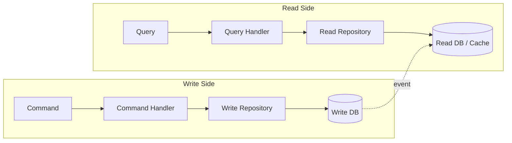

### CQRS Components

| Component | Layer | Description |
|-----------|-------|-------------|
| `Command` | Application | Immutable write intent (create, update, delete) |
| `CommandHandler` | Application | Executes command, returns void or id |
| `Query` | Application | Immutable read request |
| `QueryHandler` | Application | Executes query, returns DTO |
| `CommandBus` | Application | Dispatches commands to handlers |
| `QueryBus` | Application | Dispatches queries to handlers |
| `EventHandler` | Application | Reacts to domain events (sync projections) |

### CQRS Activation

| Scope | Flag | Behavior |
|-------|------|----------|
| Full project | `--cqrs` on `backend:app` | CQRS buses wired globally |
| Single module | `--cqrs` on `backend:module` | Module uses command/query handlers |
| Default | off | Traditional use case pattern |

### Generated CQRS Example (Users Module)

| Type | Name | Operation |
|------|------|-----------|
| Command | `CreateUserCommand` | Create user |
| Command | `UpdateUserCommand` | Update user |
| Command | `DeleteUserCommand` | Delete user |
| Query | `GetUserByIdQuery` | Fetch single user |
| Query | `ListUsersQuery` | Paginated user list |
| Event | `UserCreatedEvent` | Triggers read model update |

### CQRS Rules

| Rule ID | Description |
|---------|-------------|
| CQRS-001 | Commands mutate state; queries never mutate |
| CQRS-002 | Command handlers return void or entity id, not full entities |
| CQRS-003 | Query handlers return read DTOs, not domain entities |
| CQRS-004 | Commands and queries are immutable data structures |
| CQRS-005 | Event handlers are idempotent |

---

## Repositories

The repository pattern abstracts data access behind domain-defined interfaces.

### Repository Architecture

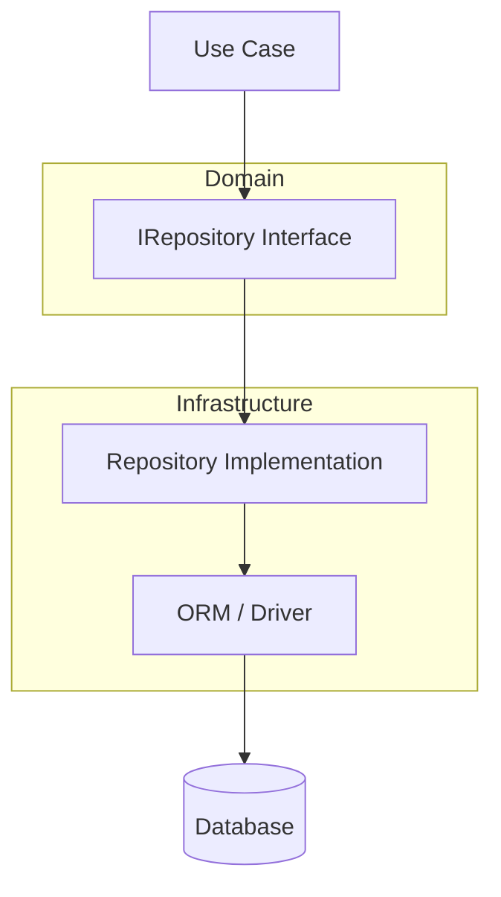

### Repository Interface Contract

| Method | Signature | Description |
|--------|-----------|-------------|
| `findById` | `(id: string) => Promise<Entity \| null>` | Single entity lookup |
| `findAll` | `(options?: FindOptions) => Promise<Entity[]>` | List with pagination/filter |
| `save` | `(entity: Entity) => Promise<Entity>` | Create or update |
| `delete` | `(id: string) => Promise<void>` | Remove by id |
| `exists` | `(id: string) => Promise<boolean>` | Existence check |

Extended methods generated based on module variables (e.g., `findByEmail` for User module).

### ORM Adapter Matrix

| Database | NestJS Default | Express | Fastify | ORM/Driver |
|----------|---------------|---------|---------|------------|
| PostgreSQL | yes | yes | yes | TypeORM / Prisma |
| MongoDB | yes | yes | yes | Mongoose / Prisma |
| Redis | cache only | cache only | cache only | ioredis |

### Repository Implementation Patterns

| Pattern | PostgreSQL | MongoDB |
|---------|------------|---------|
| Entity mapping | TypeORM entity ↔ domain entity via mapper | Mongoose schema ↔ domain entity via mapper |
| ID type | UUID (default) or serial | ObjectId or UUID string |
| Transactions | TypeORM transaction manager | Mongoose sessions |
| Migrations | TypeORM migrations / Prisma migrate | Schema versioning scaffold |
| Pagination | `LIMIT/OFFSET` or cursor | `skip/limit` or cursor |

### Mapper Contract

| Method | Description |
|--------|-------------|
| `toDomain(dbEntity)` | Database record → domain entity |
| `toPersistence(domainEntity)` | Domain entity → database record |
| `toDomainList(dbEntities)` | Batch conversion |

---

## Authentication

Authentication scaffolds verify user identity via JWT (default) with optional OAuth2 and API key patterns.

### Authentication Architecture

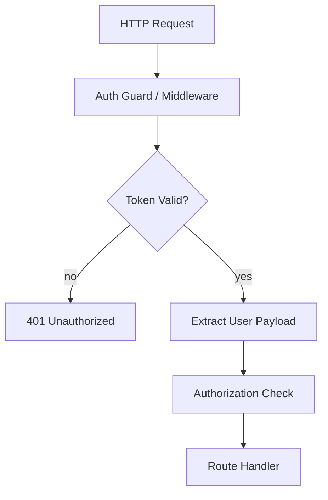

### Authentication Strategies

| Strategy | Default | Plugin | Use Case |
|----------|---------|--------|----------|
| JWT (access + refresh) | yes | nestjs-auth | Mobile games, SPAs |
| API Key | optional | backend:auth `--strategy api-key` | Service-to-service |
| OAuth2 (Google, Apple) | optional | backend:auth `--strategy oauth2` | Social login |
| Firebase Auth | optional | `@genesis/plugin-firebase` | Firebase-backed games |
| Session (cookie) | future | — | Web applications |

### JWT Authentication Scaffold

| Component | Layer | Description |
|-----------|-------|-------------|
| `AuthModule` | Presentation | Module registration |
| `AuthController` | Presentation | Login, refresh, logout endpoints |
| `JwtAuthGuard` | Presentation | Token validation guard/middleware |
| `JwtStrategy` | Infrastructure | Token verification logic |
| `AuthService` | Application | Login, token generation use cases |
| `TokenService` | Infrastructure | JWT sign/verify, refresh rotation |
| `UserPayload` | Application | Decoded token DTO |

### Auth API Endpoints

| Endpoint | Method | Auth Required | Description |
|----------|--------|---------------|-------------|
| `/api/v1/auth/register` | POST | no | User registration |
| `/api/v1/auth/login` | POST | no | Login → access + refresh tokens |
| `/api/v1/auth/refresh` | POST | refresh token | New access token |
| `/api/v1/auth/logout` | POST | yes | Invalidate refresh token |
| `/api/v1/auth/me` | GET | yes | Current user profile |

### Token Configuration

| Setting | Default | Environment Variable |
|---------|---------|---------------------|
| Access token TTL | 15 minutes | `JWT_ACCESS_TTL` |
| Refresh token TTL | 7 days | `JWT_REFRESH_TTL` |
| Algorithm | HS256 | `JWT_ALGORITHM` |
| Secret | — | `JWT_SECRET` (required) |
| Issuer | `genesis-api` | `JWT_ISSUER` |

### Authentication Rules

| Rule ID | Description |
|---------|-------------|
| AUTH-001 | Secrets never hardcoded; environment variables only |
| AUTH-002 | Passwords hashed with bcrypt (cost factor 12) |
| AUTH-003 | Refresh tokens stored server-side (Redis or DB) |
| AUTH-004 | Token rotation on refresh (old refresh token invalidated) |
| AUTH-005 | Rate limiting on login endpoint (5 attempts / minute) |

---

## Authorization

Authorization scaffolds control what authenticated users can access based on roles and permissions.

### Authorization Architecture

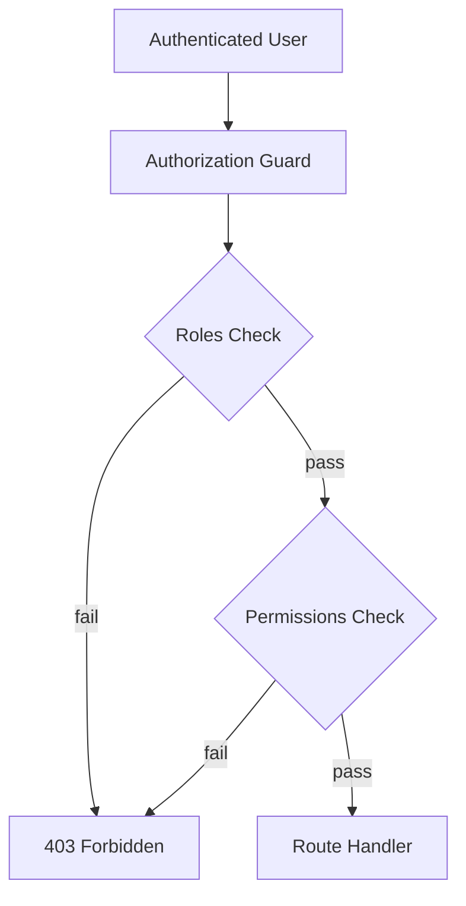

### Authorization Models

| Model | Flag | Description |
|-------|------|-------------|
| Role-Based (RBAC) | `--authz rbac` (default) | User has roles; roles have permissions |
| Permission-Based | `--authz permissions` | Direct user → permission mapping |
| Attribute-Based (ABAC) | future | Policy-based on resource attributes |

### RBAC Scaffold

| Component | Description |
|-----------|-------------|
| `Role` entity | Role definition (admin, user, moderator) |
| `Permission` value object | Granular permission (users:read, users:write) |
| `RolesGuard` | Checks `@Roles('admin')` decorator/metadata |
| `PermissionsGuard` | Checks `@Permissions('users:write')` |
| `@Roles()` decorator | Route-level role requirement |
| `@Permissions()` decorator | Route-level permission requirement |
| `@Public()` decorator | Skip authentication for route |

### Default Roles (Generated)

| Role | Permissions | Description |
|------|-------------|-------------|
| `admin` | `*:*` | Full access |
| `user` | `profile:read`, `profile:write` | Standard user |
| `guest` | `public:*` | Unauthenticated public access |

### Authorization Rules

| Rule ID | Description |
|---------|-------------|
| AUTHZ-001 | Every non-public endpoint requires authentication |
| AUTHZ-002 | Authorization checked after authentication |
| AUTHZ-003 | Role and permission data stored in database |
| AUTHZ-004 | Guards/middleware applied at route level, not globally bypassed |
| AUTHZ-005 | 403 responses do not leak resource existence |

---

## Databases

### PostgreSQL

Primary relational database for game backends requiring ACID transactions, complex queries, and relational data.

| Feature | Scaffold |
|---------|----------|
| Connection | TypeORM / Prisma config with connection pooling |
| Migrations | Initial migration + migration runner script |
| Entities | TypeORM entities in infrastructure layer |
| Seeding | Seed script scaffold for development data |
| Health check | Database connectivity in `/health` endpoint |
| Config | `DATABASE_URL` environment variable |

**Generated config:**

```yaml
database:
  type: postgres
  host: ${DB_HOST:localhost}
  port: ${DB_PORT:5432}
  username: ${DB_USER:postgres}
  password: ${DB_PASSWORD}
  database: ${DB_NAME:genesis_app}
  ssl: ${DB_SSL:false}
  pool:
    min: 2
    max: 10
```

### MongoDB

Document database for flexible schemas, rapid prototyping, and document-oriented domain models.

| Feature | Scaffold |
|---------|----------|
| Connection | Mongoose / Prisma MongoDB adapter |
| Schemas | Mongoose schemas in infrastructure layer |
| Indexes | Index definitions in schema scaffold |
| Validation | Schema-level validation rules |
| Config | `MONGODB_URI` environment variable |

**When to use:**

| Use PostgreSQL | Use MongoDB |
|----------------|-------------|
| Relational data (users, orders, inventory) | Flexible/evolving schemas |
| ACID transactions required | Document-oriented aggregates |
| Complex joins | Embedded documents preferred |
| Game economy, progression | Player profiles, game state blobs |

### Redis

In-memory data store used for caching, session storage, rate limiting, and pub/sub.

| Feature | Scaffold |
|---------|----------|
| Connection | ioredis client with retry strategy |
| Cache module | `CacheService` with get/set/delete/TTL |
| Session store | Refresh token storage |
| Rate limiter | Request rate limiting backend |
| Pub/Sub | Event bus scaffold (optional) |
| Config | `REDIS_URL` environment variable |

### Database Selection per Template

| Template / Use Case | Primary DB | Cache |
|---------------------|-----------|-------|
| `backend-api` (default) | PostgreSQL | Redis |
| `mobile-rpg` (game) | PostgreSQL | Redis |
| `mobile-puzzle` (game) | Redis (leaderboards) | Redis |
| `mobile-idle` (game) | PostgreSQL | Redis |
| Document-heavy API | MongoDB | Redis |

### Database Generator Command

```
genesis generate backend database --type <postgres|mongodb> [--orm <typeorm|prisma|mongoose>]
```

---

## Caching

Caching scaffolds a Redis-backed cache layer with declarative cache annotations and TTL management.

### Caching Architecture

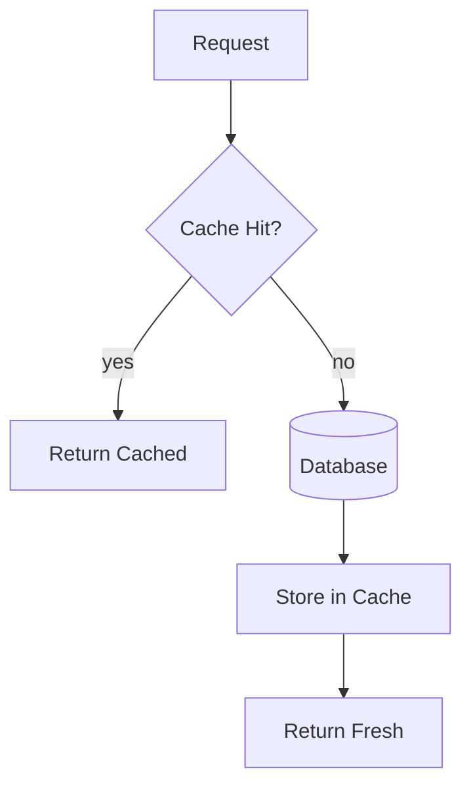

### Cache Components

| Component | Layer | Description |
|-----------|-------|-------------|
| `ICacheService` | Application | Cache interface |
| `RedisCacheService` | Infrastructure | Redis implementation |
| `CacheModule` | Presentation/Infrastructure | Module registration |
| `@Cacheable()` | Presentation | Method-level cache decorator |
| `@CacheEvict()` | Presentation | Cache invalidation decorator |
| `CacheInterceptor` | Presentation | Automatic caching interceptor (NestJS) |

### Cache Configuration

| Setting | Default | Description |
|---------|---------|-------------|
| TTL | 300 seconds | Default cache entry lifetime |
| Prefix | `genesis:` | Key namespace prefix |
| Max entries | 1000 | LRU eviction threshold (local cache) |
| Serialization | JSON | Value serialization format |

### Caching Strategies (Documented in Generated Code)

| Strategy | Use Case | TTL |
|----------|----------|-----|
| Cache-aside | User profiles, config | 5–15 minutes |
| Write-through | Leaderboards | 1 minute |
| Cache invalidation | After mutations | On write |
| No cache | Financial transactions | — |

### Caching Rules

| Rule ID | Description |
|---------|-------------|
| CACHE-001 | Cache keys namespaced by module and entity |
| CACHE-002 | Sensitive data (tokens, passwords) never cached |
| CACHE-003 | Cache failures degrade gracefully (fall through to DB) |
| CACHE-004 | TTL configured per cache key pattern, not global |

---

## Observability

Observability scaffolds structured logging, health checks, metrics endpoints, and tracing hooks.

### Observability Architecture

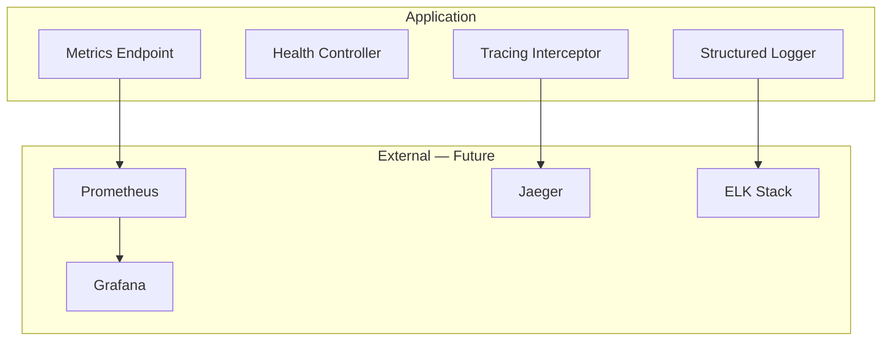

### Observability Components

| Component | Description | Endpoint |
|-----------|-------------|----------|
| `LoggerService` | Structured JSON logging | stderr |
| `HealthController` | Liveness and readiness probes | `GET /health` |
| `MetricsController` | Prometheus-compatible metrics | `GET /metrics` |
| `RequestLoggerMiddleware` | HTTP request/response logging | all routes |
| `TracingInterceptor` | Correlation ID propagation | all routes |
| `ErrorReporter` | Unhandled exception capture | global filter |

### Health Check Response

```json
{
  "status": "ok",
  "timestamp": "2026-07-26T12:00:00.000Z",
  "version": "1.0.0",
  "uptime": 3600,
  "checks": {
    "database": { "status": "ok", "latencyMs": 5 },
    "redis": { "status": "ok", "latencyMs": 2 },
    "memory": { "status": "ok", "heapUsedMb": 45 }
  }
}
```

### Structured Log Format

```json
{
  "timestamp": "2026-07-26T12:00:00.000Z",
  "level": "info",
  "correlationId": "req-abc123",
  "method": "POST",
  "path": "/api/v1/users",
  "statusCode": 201,
  "durationMs": 45,
  "message": "Request completed"
}
```

### Metrics (Prometheus Format)

| Metric | Type | Description |
|--------|------|-------------|
| `http_requests_total` | counter | Total HTTP requests by method, path, status |
| `http_request_duration_seconds` | histogram | Request latency distribution |
| `db_query_duration_seconds` | histogram | Database query latency |
| `cache_hits_total` | counter | Cache hit count |
| `cache_misses_total` | counter | Cache miss count |
| `active_connections` | gauge | Current open connections |

### Observability Rules

| Rule ID | Description |
|---------|-------------|
| OBS-001 | All logs structured JSON in production |
| OBS-002 | Correlation ID propagated through request lifecycle |
| OBS-003 | Health endpoint does not require authentication |
| OBS-004 | Secrets and PII never logged |
| OBS-005 | Error logs include stack trace in development only |

---

## API Conventions

Generated APIs follow `standards/api/rest.md` conventions.

### REST Conventions

| Convention | Rule |
|------------|------|
| URL format | `/api/v1/<resource>` |
| Collection | `GET /api/v1/users` — list |
| Single | `GET /api/v1/users/:id` — get one |
| Create | `POST /api/v1/users` — create |
| Update | `PUT /api/v1/users/:id` — full update |
| Partial update | `PATCH /api/v1/users/:id` — partial update |
| Delete | `DELETE /api/v1/users/:id` — remove |
| Pagination | `?page=1&limit=20` or `?cursor=abc&limit=20` |
| Sorting | `?sort=createdAt&order=desc` |
| Filtering | `?status=active&role=admin` |

### Response Format

**Success:**

```json
{
  "data": { "id": "uuid", "name": "Alice" },
  "meta": { "timestamp": "2026-07-26T12:00:00.000Z" }
}
```

**Collection:**

```json
{
  "data": [{ "id": "uuid", "name": "Alice" }],
  "meta": {
    "total": 100,
    "page": 1,
    "limit": 20,
    "totalPages": 5
  }
}
```

**Error:**

```json
{
  "error": {
    "code": "VALIDATION_ERROR",
    "message": "Validation failed",
    "details": [
      { "field": "email", "message": "Invalid email format" }
    ]
  }
}
```

### HTTP Status Codes

| Code | Usage |
|------|-------|
| 200 | Successful read or update |
| 201 | Resource created |
| 204 | Successful delete (no body) |
| 400 | Validation error |
| 401 | Unauthenticated |
| 403 | Unauthorized |
| 404 | Resource not found |
| 409 | Conflict (duplicate) |
| 429 | Rate limit exceeded |
| 500 | Internal server error |

---

## Swagger and OpenAPI

API documentation is generated automatically from controller/route definitions and DTO schemas.

### OpenAPI Architecture

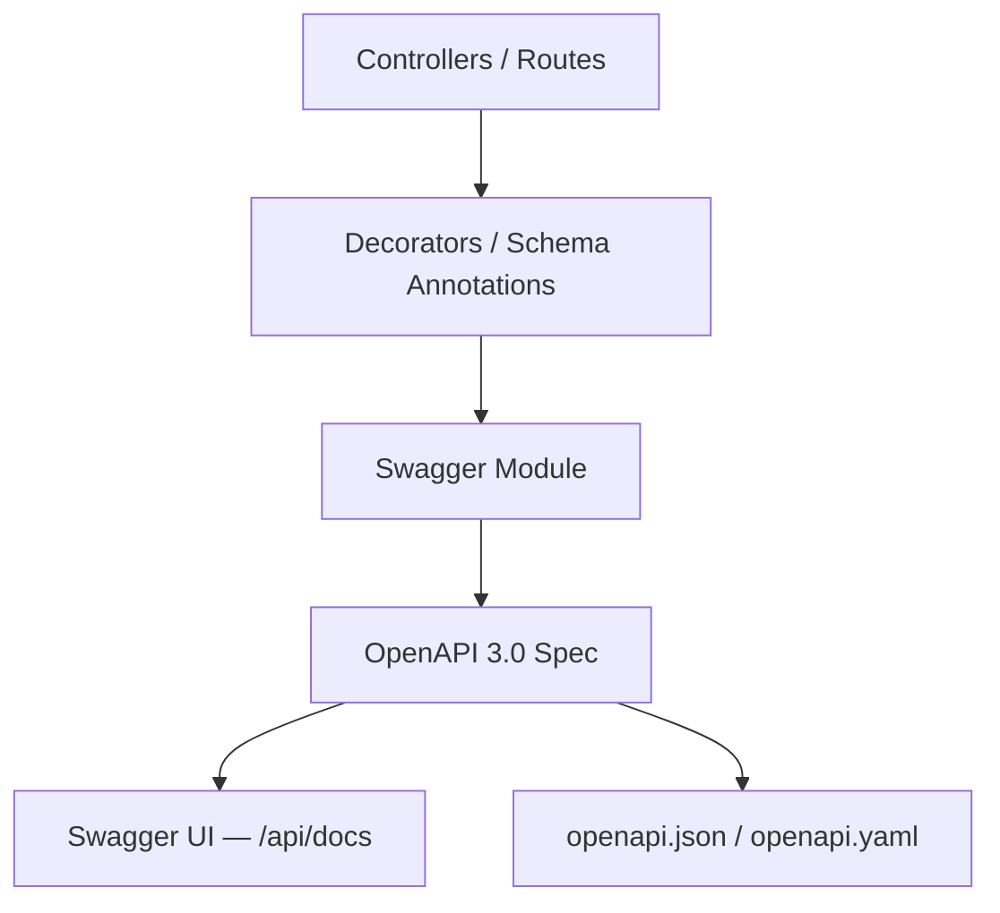

### OpenAPI Generation

| Framework | Library | UI Path | Spec Path |
|-----------|---------|---------|-----------|
| NestJS | `@nestjs/swagger` | `/api/docs` | `/api/docs-json` |
| Express | `swagger-jsdoc` + `swagger-ui-express` | `/api/docs` | `/api/docs.json` |
| Fastify | `@fastify/swagger` + `@fastify/swagger-ui` | `/api/docs` | `/api/docs/json` |

### Generated OpenAPI Metadata

| Field | Source |
|-------|--------|
| `title` | Project name from config |
| `version` | `1.0.0` (from package.json) |
| `description` | Project description |
| `servers` | Environment-based URL list |
| `securitySchemes` | JWT bearer token |
| `tags` | Module names |
| `paths` | Controller routes with DTO schemas |
| `components.schemas` | Request/response DTOs |

### Swagger Decorators (NestJS Example)

Generated controllers include:

| Decorator | Purpose |
|-----------|---------|
| `@ApiTags('users')` | Group endpoints |
| `@ApiOperation({ summary })` | Endpoint description |
| `@ApiResponse({ status, type })` | Response schema |
| `@ApiBearerAuth()` | JWT auth requirement |
| `@ApiProperty()` on DTOs | Schema property definitions |

### OpenAPI Export

```
genesis generate backend openapi
```

Produces `backend/openapi.yaml` for CI validation, client SDK generation, and API gateway import.

---

## Docker

Docker scaffolds containerization for local development and deployment.

### Docker Architecture

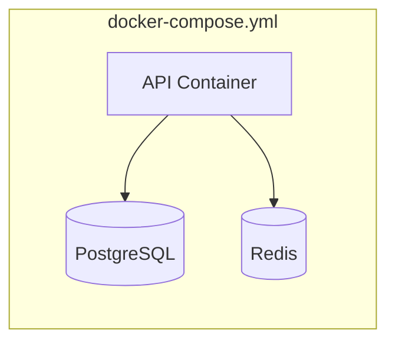

### Generated Docker Files

| File | Purpose |
|------|---------|
| `Dockerfile` | Multi-stage production build |
| `Dockerfile.dev` | Development with hot reload |
| `docker-compose.yml` | Local dev stack (app + DB + Redis) |
| `docker-compose.prod.yml` | Production overrides |
| `.dockerignore` | Exclude node_modules, .git, etc. |
| `.env.example` | Environment variable template |

### Dockerfile Stages

| Stage | Base | Purpose |
|-------|------|---------|
| `deps` | `node:22-alpine` | Install dependencies |
| `build` | `node:22-alpine` | Compile TypeScript |
| `production` | `node:22-alpine` | Run compiled app (minimal) |

### Docker Compose Services

| Service | Image | Port | Purpose |
|---------|-------|------|---------|
| `api` | Built from Dockerfile.dev | 3000 | Backend application |
| `postgres` | `postgres:16-alpine` | 5432 | PostgreSQL database |
| `redis` | `redis:7-alpine` | 6379 | Redis cache |
| `mongo` | `mongo:7` | 27017 | MongoDB (when selected) |

### Docker Generator Command

```
genesis generate backend docker [--services postgres,redis]
```

---

## Testing

Testing scaffolds ensure every generated component has corresponding test files.

### Testing Architecture

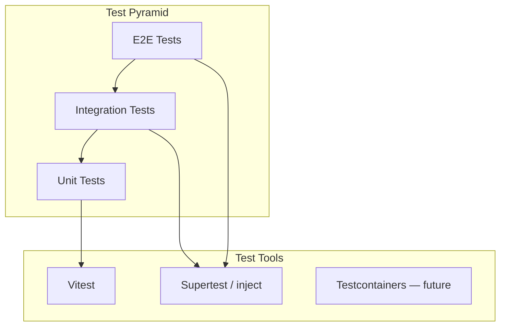

### Test Categories

| Category | Directory | Scope | Tools |
|----------|-----------|-------|-------|
| Unit | `test/unit/` | Use cases, domain logic, mappers | Vitest |
| Integration | `test/integration/` | Controllers + DB (in-memory or test DB) | Vitest + Supertest |
| E2E | `test/e2e/` | Full HTTP request lifecycle | Vitest + Supertest |

### Generated Test Files per Module

| Source | Test File | Type |
|--------|-----------|------|
| `{name}.use-case.ts` | `{name}.use-case.spec.ts` | Unit |
| `{name}.entity.ts` | `{name}.entity.spec.ts` | Unit |
| `{name}.repository.ts` | `{name}.repository.spec.ts` | Integration |
| `{name}.controller.ts` | `{name}.controller.spec.ts` | Integration |
| `auth.service.ts` | `auth.service.spec.ts` | Unit |
| App bootstrap | `app.e2e-spec.ts` | E2E |

### Test Scaffolding Patterns

| Pattern | Description |
|---------|-------------|
| Mock repositories | In-memory repository implementations for unit tests |
| Test database | Separate test DB or in-memory SQLite (integration) |
| Factory functions | `createTestUser()`, `createTestModule()` helpers |
| Supertest | HTTP assertions against running app |
| Snapshot testing | OpenAPI spec snapshot validation |

### Testing Rules

| Rule ID | Description |
|---------|-------------|
| TEST-001 | Every use case has a unit test file |
| TEST-002 | Every controller has an integration test file |
| TEST-003 | Auth flow covered by e2e test |
| TEST-004 | Tests independent and deterministic |
| TEST-005 | No real external service calls in unit tests |

---

## Deployment

Deployment scaffolds CI/CD pipelines and environment configuration for common targets.

### Deployment Architecture

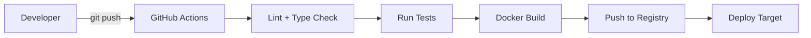

### Deployment Targets

| Target | Scaffold | Phase |
|--------|----------|-------|
| Docker (local/VPS) | `docker-compose.prod.yml` | Phase 2 |
| AWS ECS / Fargate | `@genesis/plugin-aws` deploy config | Phase 2+ |
| Firebase Cloud Functions | `@genesis/plugin-firebase` | Phase 2+ |
| Kubernetes | Helm chart scaffold | Future |
| Railway / Render | Platform config file | Future |

### Generated CI/CD Pipeline

```yaml
# .github/workflows/backend-ci.yml (generated)
name: Backend CI
on: [push, pull_request]
jobs:
  lint:       # biome check
  typecheck:  # tsc --noEmit
  test:       # vitest run
  build:      # docker build
  deploy:     # on main branch only
```

### Environment Configuration

| Environment | Config File | Secrets |
|-------------|-------------|---------|
| Development | `.env` | Local only, gitignored |
| Staging | `.env.staging` | CI secrets |
| Production | `.env.production` | Secret manager / CI secrets |

### Generated Environment Variables

| Variable | Required | Description |
|----------|----------|-------------|
| `NODE_ENV` | yes | `development`, `staging`, `production` |
| `PORT` | no | HTTP port (default: 3000) |
| `DATABASE_URL` | yes | PostgreSQL connection string |
| `REDIS_URL` | yes | Redis connection string |
| `JWT_SECRET` | yes | JWT signing secret |
| `JWT_ACCESS_TTL` | no | Access token TTL |
| `JWT_REFRESH_TTL` | no | Refresh token TTL |
| `CORS_ORIGIN` | no | Allowed CORS origins |
| `LOG_LEVEL` | no | `debug`, `info`, `warn`, `error` |

### Deployment Rules

| Rule ID | Description |
|---------|-------------|
| DEPLOY-001 | Secrets never committed to version control |
| DEPLOY-002 | Health check endpoint required before traffic routing |
| DEPLOY-003 | Database migrations run before app start in CI |
| DEPLOY-004 | Rollback strategy documented in generated README |
| DEPLOY-005 | Production builds use multi-stage Docker (no dev deps) |

---

## Generator Catalog

### Application Generators

| Generator ID | Command | Output |
|--------------|---------|--------|
| `backend:app` | `genesis generate backend app` | Full backend application |
| `backend:module` | `genesis generate backend module <name>` | DDD module |
| `backend:api` | `genesis generate api <resource>` | REST API resource |
| `backend:auth` | `genesis generate backend auth` | Auth module (JWT) |
| `backend:database` | `genesis generate backend database` | DB config + migrations |
| `backend:cache` | `genesis generate backend cache` | Redis cache module |
| `backend:observability` | `genesis generate backend observability` | Logging, health, metrics |
| `backend:docker` | `genesis generate backend docker` | Docker + compose files |
| `backend:openapi` | `genesis generate backend openapi` | Export OpenAPI spec |
| `backend:crud` | `genesis generate api <resource> --crud` | Full CRUD with pagination |

### Framework-Specific Generators

| Generator ID | Framework | Command |
|--------------|-----------|---------|
| `nestjs:app` | NestJS | `genesis generate backend app --framework nestjs` |
| `nestjs:module` | NestJS | `genesis generate backend module <name>` |
| `nestjs:api` | NestJS | `genesis generate api <resource>` |
| `express:app` | Express | `genesis generate backend app --framework express` |
| `express:router` | Express | `genesis generate backend router <name>` |
| `fastify:app` | Fastify | `genesis generate backend app --framework fastify` |
| `fastify:route` | Fastify | `genesis generate backend route <name>` |

### Generator Flags

| Flag | Type | Default | Description |
|------|------|---------|-------------|
| `--framework` | enum | `nestjs` | `nestjs`, `express`, `fastify` |
| `--database` | enum | `postgres` | `postgres`, `mongodb` |
| `--orm` | enum | auto | `typeorm`, `prisma`, `mongoose` |
| `--cqrs` | boolean | false | Enable CQRS pattern |
| `--auth` | boolean | true | Include auth module |
| `--authz` | enum | `rbac` | `rbac`, `permissions` |
| `--cache` | boolean | true | Include Redis cache module |
| `--docker` | boolean | true | Include Docker files |
| `--swagger` | boolean | true | Include Swagger/OpenAPI |
| `--testing` | boolean | true | Include test scaffolds |

---

## Validation

### Backend Validation Rules

| Rule ID | Scope | Severity | Description |
|---------|-------|----------|-------------|
| `BE-001` | architecture | error | Domain layer has no outward dependencies |
| `BE-002` | architecture | error | Repository interfaces in domain, implementations in infrastructure |
| `BE-003` | architecture | error | Controllers contain no business logic |
| `BE-004` | architecture | warning | Use cases do not import presentation layer |
| `BE-005` | api | error | All endpoints have request/response DTOs |
| `BE-006` | api | error | URL follows `/api/v1/<resource>` convention |
| `BE-007` | api | warning | All endpoints documented in OpenAPI spec |
| `BE-008` | security | error | No hardcoded secrets in source |
| `BE-009` | security | error | Auth guard on non-public endpoints |
| `BE-010` | security | warning | Input validation on all request DTOs |
| `BE-011` | testing | warning | Unit test exists for each use case |
| `BE-012` | testing | warning | Integration test exists for each controller |
| `BE-013` | docker | warning | Dockerfile uses multi-stage build |
| `BE-014` | observability | warning | Health endpoint exists |
| `BE-015` | compile | error | `tsc --noEmit` passes |

---

## Public API

### Backend Generation Service

| Method | Input | Output | Description |
|--------|-------|--------|-------------|
| `generateApp(request)` | GenerateAppRequest | GenerationResult | Full backend application |
| `generateModule(request)` | GenerateModuleRequest | GenerationResult | DDD module |
| `generateApi(request)` | GenerateApiRequest | GenerationResult | REST API resource |
| `generateAuth(request)` | GenerateAuthRequest | GenerationResult | Auth module |
| `generateDatabase(request)` | GenerateDatabaseRequest | GenerationResult | Database config |
| `generateDocker(request)` | GenerateDockerRequest | GenerationResult | Docker files |
| `exportOpenApi(path)` | string | OpenApiSpec | Export OpenAPI from existing project |
| `listGenerators()` | — | GeneratorInfo[] | Available backend generators |
| `validateBackend(path)` | string | ValidationResult | Validate backend architecture |

### GenerateAppRequest

| Field | Type | Required | Description |
|-------|------|----------|-------------|
| `name` | string | yes | Application name |
| `framework` | enum | no | `nestjs`, `express`, `fastify` |
| `database` | enum | no | `postgres`, `mongodb` |
| `orm` | enum | no | ORM selection |
| `cqrs` | boolean | no | Enable CQRS |
| `auth` | boolean | no | Include auth module |
| `cache` | boolean | no | Include Redis cache |
| `docker` | boolean | no | Include Docker files |
| `outputPath` | string | no | Output directory |

---

## Examples

### Example 1 — NestJS API with PostgreSQL

**Command:**
```bash
genesis generate backend app my-api --framework nestjs --database postgres
```

**Generated structure:** 38 files — domain (4), application (8), infrastructure (10), presentation (8), test (6), config (2)

**Includes:** JWT auth, RBAC, Redis cache, Swagger UI at `/api/docs`, health at `/health`, Docker compose

### Example 2 — Express Microservice with MongoDB

**Command:**
```bash
genesis generate backend app inventory-service --framework express --database mongodb --auth false
```

**Generated:** Lightweight Express app with Mongoose, no auth, Redis cache, OpenAPI via swagger-jsdoc

### Example 3 — Fastify API with CQRS

**Command:**
```bash
genesis generate backend app orders-api --framework fastify --cqrs --database postgres
```

**Generated:** Fastify app with command/query buses, Prisma ORM, CQRS handlers per module

### Example 4 — CRUD API Resource

**Command:**
```bash
genesis generate api products --crud --pagination cursor
```

**Generated module:**

| File | Layer |
|------|-------|
| `product.entity.ts` | Domain |
| `product.repository.ts` (interface) | Domain |
| `create-product.use-case.ts` | Application |
| `list-products.use-case.ts` | Application |
| `product.repository.ts` (impl) | Infrastructure |
| `products.controller.ts` | Presentation |
| `create-product-request.dto.ts` | Presentation |
| `product-response.dto.ts` | Presentation |
| `products.controller.spec.ts` | Test |

**Endpoints:** `GET/POST /api/v1/products`, `GET/PUT/DELETE /api/v1/products/:id`

### Example 5 — Game Backend (from Game Generation)

**Context:** `genesis create game ocean-quest --template mobile-rpg`

**Phase 3 generates:**

| Module | Endpoints | Database |
|--------|-----------|----------|
| `auth` | register, login, refresh | PostgreSQL |
| `player` | profile, progression | PostgreSQL |
| `economy` | wallet, transactions | PostgreSQL |
| `inventory` | items, equip | PostgreSQL |
| `cloud-save` | save, sync | PostgreSQL + Redis |
| `health` | health check | — |

### Example 6 — Docker Development Stack

**Command:**
```bash
genesis generate backend docker --services postgres,redis
```

**Generated `docker-compose.yml`:**

```yaml
services:
  api:
    build: { context: ., dockerfile: Dockerfile.dev }
    ports: ["3000:3000"]
    depends_on: [postgres, redis]
    env_file: .env
  postgres:
    image: postgres:16-alpine
    ports: ["5432:5432"]
  redis:
    image: redis:7-alpine
    ports: ["6379:6379"]
```

**Usage:** `docker compose up` → full local development stack

---

## Related Documents

| Document | Relationship |
|----------|-------------|
| [README.md](README.md) | Parent specification overview |
| [003-plugin-system/FUNCTIONAL_SPEC.md](../003-plugin-system/FUNCTIONAL_SPEC.md) | Plugin registration |
| [004-scaffolding/FUNCTIONAL_SPEC.md](../004-scaffolding/FUNCTIONAL_SPEC.md) | Generation orchestration |
| [006-game-generation/FUNCTIONAL_SPEC.md](../006-game-generation/FUNCTIONAL_SPEC.md) | Game backend phase |
| [009-liveops/README.md](../009-liveops/) | LiveOps API extensions |
| [standards/backend/](../../standards/backend/) | Backend standards |
| [standards/api/](../../standards/api/) | API standards |
| [framework/backend/](../../framework/backend/) | Reusable backend modules |

## Changelog

| Version | Date | Change |
|---------|------|--------|
| 1.0.0 | 2026-07-26 | Initial functional specification |
