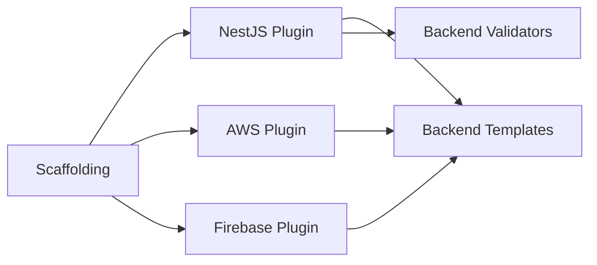

# Backend Specification

## Purpose

Define the backend generation and integration capabilities for Project Genesis, including NestJS project scaffolding, API module generation, database integration, and cloud service plugins for AWS and Firebase.

## Documents

| Document | Description |
|----------|-------------|
| [FUNCTIONAL_SPEC.md](FUNCTIONAL_SPEC.md) | **Complete functional specification** — NestJS/Express/Fastify, DDD, CQRS, auth, databases, caching, observability, Docker, testing, Swagger, deployment |
| This document | Overview, responsibilities, and implementation roadmap |

## Scope

### In Scope

- NestJS project and module scaffolding
- Clean Architecture layer structure in generated backends
- REST API endpoint generation
- Database integration (PostgreSQL, Redis)
- Authentication and authorization scaffolding
- AWS plugin (Lambda, S3, DynamoDB patterns)
- Firebase plugin (Auth, Firestore, Cloud Functions patterns)
- Backend validation rules

### Out of Scope

- Runtime backend framework code in `framework/backend/` (separate from generation)
- GraphQL API generation (future)
- WebSocket server implementation (future)
- Production deployment configuration (basic CI only)
- Database migration execution (generates files, does not run migrations)

## Goals

| Goal | Success Criteria |
|------|------------------|
| **Clean Architecture** | Generated backend follows domain/application/infrastructure/presentation layers |
| **Production patterns** | Auth, validation, error handling, and logging included by default |
| **Testable** | Generated services have unit test scaffolds |
| **Standards-compliant** | Output passes `standards/backend/` and `standards/api/` rules |
| **Cloud-ready** | AWS and Firebase plugins generate deployment-ready configurations |
| **Type-safe** | Strict TypeScript with DTOs and explicit return types |

## Responsibilities

### Plugin Architecture

Backend capabilities are delivered as plugins registered via [003-plugin-system](../003-plugin-system/):



| Plugin | Package | Responsibility |
|--------|---------|----------------|
| NestJS | `@genesis/plugin-nestjs` | NestJS project and module generation |
| AWS | `@genesis/plugin-aws` | AWS service integration scaffolding |
| Firebase | `@genesis/plugin-firebase` | Firebase service integration scaffolding |

### NestJS Plugin

#### Generated Project Structure

```
backend/
├── src/
│   ├── domain/
│   │   ├── entities/
│   │   ├── value-objects/
│   │   └── interfaces/
│   ├── application/
│   │   ├── use-cases/
│   │   ├── dto/
│   │   └── interfaces/
│   ├── infrastructure/
│   │   ├── database/
│   │   ├── repositories/
│   │   └── external/
│   ├── presentation/
│   │   ├── controllers/
│   │   ├── guards/
│   │   └── filters/
│   ├── app.module.ts
│   └── main.ts
├── test/
│   ├── unit/
│   └── integration/
├── package.json
├── tsconfig.json
└── nest-cli.json
```

#### Generators

| Generator | Command | Output |
|-----------|---------|--------|
| `nestjs-app` | `genesis generate backend app` | Full NestJS application |
| `nestjs-module` | `genesis generate backend module <name>` | Domain/application/infrastructure module |
| `nestjs-api` | `genesis generate api <resource>` | Controller, service, DTOs for REST resource |
| `nestjs-auth` | `genesis generate backend auth` | JWT authentication module |
| `nestjs-health` | `genesis generate backend health` | Health check endpoint |

#### Module Generation

Each generated module follows DDD per `standards/backend/ddd.md`:

| Layer | Generated Files |
|-------|----------------|
| Domain | Entity, value objects, repository interface, domain service |
| Application | Use case, input/output DTOs, application service |
| Infrastructure | Repository implementation, database entity mapping |
| Presentation | Controller, request/response DTOs, validation pipes |

### AWS Plugin

Generates AWS integration scaffolding:

| Generator | Output |
|-----------|--------|
| `aws-lambda` | Lambda handler with NestJS adapter |
| `aws-s3` | S3 service with upload/download interface |
| `aws-dynamodb` | DynamoDB repository implementation |
| `aws-deploy` | Serverless Framework or CDK configuration |

### Firebase Plugin

Generates Firebase integration scaffolding:

| Generator | Output |
|-----------|--------|
| `firebase-auth` | Firebase Auth guard and user service |
| `firebase-firestore` | Firestore repository implementation |
| `firebase-functions` | Cloud Functions entry point |
| `firebase-config` | Firebase admin SDK configuration |

### API Conventions

Generated APIs follow `standards/api/rest.md`:

| Convention | Rule |
|------------|------|
| URL format | `/api/v1/<resource>` |
| HTTP methods | GET (read), POST (create), PUT (update), DELETE (remove) |
| Response format | `{ data: T }` for success, `{ error: { code, message } }` for failure |
| Status codes | 200, 201, 400, 401, 403, 404, 500 |
| Validation | class-validator decorators on request DTOs |
| Versioning | URL prefix `/api/v1/` per `standards/api/versioning.md` |

### Security

Generated backends include per `standards/security/`:

| Feature | Implementation |
|---------|---------------|
| Authentication | JWT with refresh tokens (nestjs-auth generator) |
| Authorization | Role-based guards |
| Input validation | class-validator on all request DTOs |
| Secret management | Environment variables, never hardcoded |
| CORS | Configurable via environment |
| Rate limiting | Throttler module (Phase 2+) |

### Backend Validators

The NestJS plugin registers validators with `@genesis/validator`:

| Rule | Check |
|------|-------|
| Layer separation | Domain does not import infrastructure or presentation |
| No business logic in controllers | Controllers delegate to application services |
| DTOs for all endpoints | No raw request body usage |
| Repository pattern | Data access behind interfaces |
| Test coverage | Unit test file exists for each service |

## Dependencies

### Upstream Specifications

| Spec | Dependency |
|------|------------|
| [000-project](../000-project/) | Clean Architecture layers |
| [003-plugin-system](../003-plugin-system/) | Plugin registration |
| [004-scaffolding](../004-scaffolding/) | Generation orchestration |
| [002-template-engine](../002-template-engine/) | Template rendering |

### Downstream Consumers

| Spec | Relationship |
|------|-------------|
| [006-game-generation](../006-game-generation/) | Backend phase in game generation |
| [009-liveops](../009-liveops/) | LiveOps API endpoints |

## Future Implementation

### Phase 2 — NestJS Plugin

- Create `@genesis/plugin-nestjs` in `packages/plugins/nestjs/`
- Implement `nestjs-app` generator with full project structure
- Implement `nestjs-module` and `nestjs-api` generators
- Implement `nestjs-auth` with JWT scaffolding
- Backend templates in plugin template directory
- Backend validators registered with kernel
- Integration test: generate backend, verify `tsc --noEmit` passes

### Phase 2 — Cloud Plugins

- AWS plugin with Lambda and S3 generators
- Firebase plugin with Auth and Firestore generators
- Cloud configuration templates

### Phase 3 — Game Integration

- Backend phase in [006-game-generation](../006-game-generation/) pipeline
- Game-specific modules (player, inventory, progression)

### Future — Advanced

- GraphQL module generator
- WebSocket gateway generator
- Database migration generator
- OpenAPI spec generation from controllers
- Integration test generator

## Related Documents

- [FUNCTIONAL_SPEC.md](FUNCTIONAL_SPEC.md) — Complete functional specification
- [003-plugin-system](../003-plugin-system/) — Plugin architecture
- [006-game-generation](../006-game-generation/) — Game project generation
- [standards/backend/](../../standards/backend/) — Backend standards
- [knowledge/backend/nestjs.md](../../knowledge/backend/nestjs.md) — NestJS reference

## Changelog

| Version | Date | Change |
|---------|------|--------|
| 1.0.1 | 2026-07-26 | Linked FUNCTIONAL_SPEC.md |
| 1.0.0 | 2026-07-26 | Initial approved specification |
