# Genesis Unity Generator — Functional Specification

## Document Control

| Field | Value |
|-------|-------|
| **Specification** | [008-unity](README.md) |
| **Status** | Approved |
| **Version** | 1.0.0 |
| **Independence** | Implementation-independent. No Unity version lock-in beyond documented targets; generator behavior is prescribed, not C# implementation. |
| **Audience** | Unity engineers, technical artists, game architects, mobile developers, AI assistants |

## Purpose

Define the complete functional architecture of the **Genesis Unity Generator** — the subsystem responsible for scaffolding production-ready Unity 6 projects and client modules with URP rendering, 2D/3D templates, Addressables, ScriptableObjects, Input System, localization, analytics, ads, in-app purchases, cloud save, Firebase integration, dependency injection, folder structure, prefabs, scenes, and mobile performance guidelines. Delivered through `@genesis/plugin-unity` via the plugin system.

## Scope

### In Scope

- Unity generator architecture and plugin model
- Unity 6 project scaffolding (settings, packages, folder structure)
- Render pipeline: Universal Render Pipeline (URP)
- Dimension modes: 2D and 3D project templates
- Addressables configuration and loading scaffolds
- ScriptableObject generation (config, data, events)
- Unity Input System action maps and bindings
- Localization (Unity Localization package)
- Analytics, ads, IAP, cloud save client scaffolds
- Firebase SDK integration scaffold
- Dependency injection architecture
- Prefab and scene generation
- Performance guidelines and validators
- Generator catalog, validation rules, public API, examples

### Out of Scope

- Runtime framework code in `framework/unity/` (reusable libraries, separate concern)
- Art asset creation (sprites, models, animations, audio, shaders)
- VFX and particle system authoring
- Unity build execution (generates build config; does not run builds)
- Play Mode and device test automation (future)
- Unreal Engine integration (future consideration)
- Game genre orchestration ([006-game-generation](../006-game-generation/) consumes generators)

---

## Goals

### Primary Goals

| ID | Goal | Success Criteria |
|----|------|------------------|
| G1 | **Unity 6 ready** | Generated project opens in Unity 6 without errors |
| G2 | **Mobile-optimized** | URP, IL2CPP, and performance conventions applied by default |
| G3 | **Component-based** | Systems use composition, interfaces, and events — not deep inheritance |
| G4 | **Data-driven** | Game values in ScriptableObjects, not hardcoded in scripts |
| G5 | **Addressables-ready** | Asset loading via Addressables from project creation |
| G6 | **Platform-integrated** | Analytics, ads, IAP, cloud save scaffolds included |
| G7 | **Testable** | EditMode test scaffolds for every generated system |
| G8 | **Standards-compliant** | Output passes `standards/unity/` validators |
| G9 | **DI-enabled** | Services wired through explicit dependency injection |
| G10 | **2D/3D flexible** | Templates support both 2D and 3D dimension modes |

### Non-Functional Goals

| Attribute | Target |
|-----------|--------|
| Generation time | Full Unity project < 15 seconds |
| Script compile | Generated project compiles with zero errors |
| File count | 40–80 C# files for full project scaffold |
| Target FPS | 60 FPS default (30 FPS low-end Android option) |
| Max memory | < 300 MB RAM on mid-range mobile |
| Cold start | < 3 seconds to interactive on target devices |

### Design Principles

1. **Systems over MonoBehaviours** — Game logic in plain C# systems; MonoBehaviours are thin adapters.
2. **Data drives behavior** — ScriptableObjects and remote config define game values.
3. **Load asynchronously** — Addressables for all non-boot assets; no Resources folder abuse.
4. **Events decouple** — Systems communicate via `IEventBus`, not direct references.
5. **Inject dependencies** — No `FindObjectOfType` or singletons in generated code.
6. **Mobile-first** — Touch input, battery awareness, memory budgets by default.
7. **Fail safe** — Service failures degrade gracefully (offline mode, ad load failure).
8. **Measure everything** — Analytics events scaffolded alongside features.

---

## Architecture

### System Overview

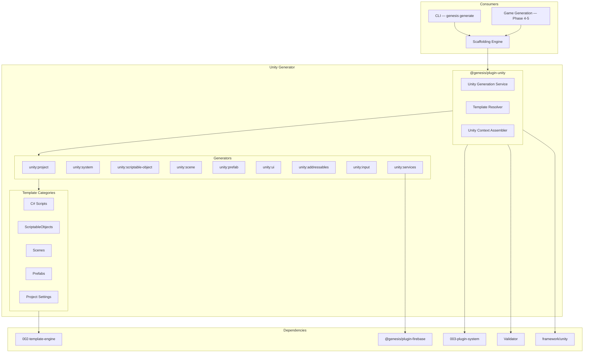

### Client Architecture (Generated Project)

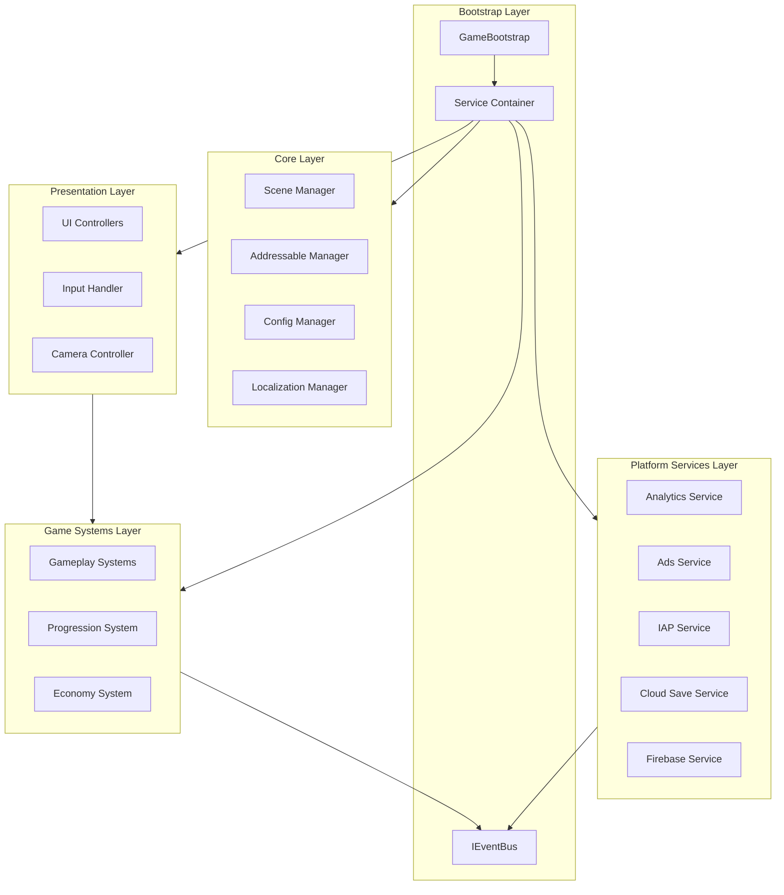

### Layer Responsibilities

| Layer | Responsibility | Unity Types |
|-------|----------------|-------------|
| **Bootstrap** | App initialization, DI wiring, system lifecycle | `GameBootstrap` MonoBehaviour |
| **Core** | Scene loading, assets, config, localization | Plain C# + thin MonoBehaviours |
| **Systems** | Game logic (inventory, combat, progression) | `IGameSystem` implementations |
| **Services** | Platform SDKs (analytics, ads, IAP, cloud) | `IService` implementations |
| **Presentation** | UI, input, camera, VFX triggers | MonoBehaviours, UI Toolkit / uGUI |
| **Data** | Configuration and content | ScriptableObjects |

### Component Model

| Component | Responsibility |
|-----------|----------------|
| **Unity Generation Service** | Public API for all Unity generation operations |
| **Template Resolver** | Select Unity template by dimension, genre, flags |
| **Context Assembler** | Merge Unity-specific variables |
| **Project Generator** | Full Unity 6 project scaffold |
| **System Generator** | Game system with interface and tests |
| **ScriptableObject Generator** | SO class + asset placeholder |
| **Scene Generator** | Scene with hierarchy and components |
| **Prefab Generator** | Prefab with component setup |
| **Addressables Generator** | Groups, labels, build settings |
| **Services Generator** | Analytics, ads, IAP, cloud save, Firebase |
| **Input Generator** | Input Action Asset and bindings |

### Relationship to Other Systems

| System | Unity Generator Uses | Unity Generator Provides |
|--------|---------------------|-------------------------|
| Scaffolding | Plan execution | `generate unity-*` commands |
| Template Engine | Render C#, YAML, scene templates | — |
| Plugin System | Plugin registration | `@genesis/plugin-unity` |
| Firebase Plugin | Firebase SDK config patterns | Client Firebase scaffold |
| Game Generation | — | Phase 4–5 Unity client |
| LiveOps | — | UI/system patterns extended post-launch |
| Backend | — | API client scaffolds for cloud save, economy |

---

## Unity 6 Support

The Unity Generator targets **Unity 6** as the primary and default editor version.

### Version Configuration

| Setting | Default | Config Key |
|---------|---------|------------|
| Unity version | `6000.0` (Unity 6) | `unity.version` |
| Minimum version | Unity 6.0 LTS | Enforced by validator |
| Previous support | Unity 2022.3 LTS (deprecated) | `--unity-version 2022.3` (warning) |

### Unity 6 Packages (Generated `manifest.json`)

| Package | Version Pin | Purpose |
|---------|---------------|---------|
| `com.unity.render-pipelines.universal` | Unity 6 compatible | URP |
| `com.unity.addressables` | Latest stable | Asset loading |
| `com.unity.inputsystem` | Latest stable | Input System |
| `com.unity.localization` | Latest stable | Localization |
| `com.unity.services.analytics` | Latest stable | Unity Gaming Services analytics |
| `com.unity.purchasing` | Latest stable | In-App Purchases |
| `com.unity.ads` | Latest stable | Unity Ads (optional) |
| `com.unity.test-framework` | Latest stable | EditMode/PlayMode tests |
| `com.unity.2d.sprite` | Latest stable | 2D projects |
| `com.unity.cinemachine` | Latest stable | 3D camera (3D projects) |
| `com.unity.ai.navigation` | Latest stable | 3D navigation (3D projects) |

### Unity 6 Project Settings (Generated)

| Setting | Value | Reason |
|---------|-------|--------|
| Editor version | Unity 6 | Primary target |
| Scripting backend | IL2CPP | Mobile performance + security |
| API compatibility | .NET Standard 2.1 | Cross-platform |
| Color space | Linear | URP standard |
| Graphics API (iOS) | Metal | Platform optimal |
| Graphics API (Android) | Vulkan, OpenGLES3 | Compatibility + performance |
| Active input handling | Input System Package | New Input System |
| Incremental GC | Enabled | Mobile memory management |
| Strip engine code | Enabled | Build size reduction |

### Build Target Configuration

| Platform | Build Target | Scripting | Architecture |
|----------|-------------|-----------|--------------|
| iOS | iOS | IL2CPP | ARM64 |
| Android | Android | IL2CPP | ARM64 (primary), ARMv7 (optional) |

---

## Universal Render Pipeline (URP)

URP is the **default and only** render pipeline scaffolded by the Unity Generator. Built-in and HDRP are not generated.

### URP Architecture

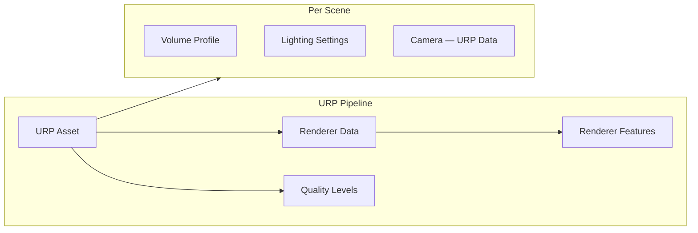

### Generated URP Assets

| Asset | Path | Description |
|-------|------|-------------|
| `UniversalRenderPipelineAsset` | `Assets/_Project/Settings/URP/` | Main URP pipeline asset |
| `UniversalRendererData` | `Assets/_Project/Settings/URP/` | Forward renderer for mobile |
| `URP_GlobalSettings` | `Assets/_Project/Settings/URP/` | Global URP settings |
| Quality levels | `ProjectSettings/` | Low, Medium, High presets |
| Volume Profile | Per scene | Post-processing defaults |

### URP Mobile Presets

| Quality | Render Scale | Shadows | Post-Processing | Target |
|---------|-------------|---------|-----------------|--------|
| Low | 0.75 | Hard shadows, 512px | Bloom off | Low-end Android |
| Medium | 0.85 | Soft shadows, 1024px | Bloom on | Mid-range |
| High | 1.0 | Soft shadows, 2048px | Full | High-end iOS |

### 2D vs 3D URP Configuration

| Setting | 2D Mode | 3D Mode |
|---------|---------|---------|
| Renderer | 2D Renderer | Forward Renderer |
| Camera | Orthographic | Perspective |
| Lighting | 2D lights, no real-time shadows | Directional + baked |
| Sorting | Sorting layers, transparency sort | Standard depth |
| Additional packages | `com.unity.2d.sprite`, Tilemap | Cinemachine, AI Navigation |

---

## Dimension Modes: 2D and 3D

The generator supports **2D** and **3D** dimension modes, selectable per project or template.

### Mode Selection

| Method | Example |
|--------|---------|
| CLI flag | `genesis generate unity project --dimension 2d` |
| Game template | `dimension: 2d` in game template YAML |
| Project config | `.genesis/config.yml` → `unity.dimension: 3d` |
| Default | `2d` for puzzle/idle; `3d` for RPG/runner |

### 2D Project Scaffold

| Component | Generated |
|-----------|-----------|
| Camera | Orthographic, pixel-perfect optional |
| Rendering | URP 2D Renderer, sorting layers |
| Physics | Physics2D, Rigidbody2D, Collider2D patterns |
| Input | Touch + keyboard bindings for 2D |
| Scenes | 2D scene with tilemap layer (optional) |
| Systems | Grid-based, sprite-based patterns |

### 3D Project Scaffold

| Component | Generated |
|-----------|-----------|
| Camera | Perspective + Cinemachine virtual camera |
| Rendering | URP Forward Renderer, lighting settings |
| Physics | Physics3D, CharacterController pattern |
| Input | Touch joystick + camera orbit bindings |
| Scenes | 3D scene with ground plane, lighting rig |
| Systems | Transform-based, navmesh-ready patterns |

### Dimension Comparison Matrix

| Feature | 2D | 3D |
|---------|----|----|
| URP Renderer | 2D Renderer | Forward Renderer |
| Camera type | Orthographic | Perspective |
| Physics module | Physics2D | Physics3D |
| Navigation | Grid / tilemap | AI Navigation (NavMesh) |
| Cinemachine | Optional | Included |
| Typical genres | Puzzle, idle, card | RPG, runner, strategy |

---

## Folder Structure

All generated Unity projects follow a standardized folder structure per `standards/unity/unity-standard.md`.

### Complete Folder Structure

```
unity/
├── Assets/
│   ├── _Project/                          # All project-specific content
│   │   ├── Scripts/
│   │   │   ├── Bootstrap/                 # GameBootstrap, DI container
│   │   │   ├── Core/                      # Interfaces, base classes, event bus
│   │   │   ├── Systems/                   # Game systems (IGameSystem)
│   │   │   │   ├── Progression/
│   │   │   │   ├── Economy/
│   │   │   │   └── Inventory/
│   │   │   ├── Services/                  # Platform services
│   │   │   │   ├── Analytics/
│   │   │   │   ├── Ads/
│   │   │   │   ├── IAP/
│   │   │   │   ├── CloudSave/
│   │   │   │   └── Firebase/
│   │   │   ├── UI/                        # UI controllers and views
│   │   │   │   ├── Controllers/
│   │   │   │   ├── Views/
│   │   │   │   └── Components/
│   │   │   ├── Input/                     # Input handlers
│   │   │   ├── Data/                      # SO class definitions
│   │   │   └── Utils/                     # Helpers, extensions
│   │   ├── ScriptableObjects/
│   │   │   ├── Config/                    # Game, performance, service config
│   │   │   ├── Data/                      # Content data assets
│   │   │   └── Events/                    # Game event definitions
│   │   ├── Scenes/
│   │   │   ├── Boot.unity
│   │   │   ├── Main.unity
│   │   │   └── Gameplay.unity
│   │   ├── Prefabs/
│   │   │   ├── UI/
│   │   │   ├── Gameplay/
│   │   │   └── Services/
│   │   ├── Art/                           # Placeholder directories
│   │   │   ├── Sprites/
│   │   │   ├── Models/
│   │   │   ├── Materials/
│   │   │   └── Animations/
│   │   ├── Audio/
│   │   │   ├── Music/
│   │   │   └── SFX/
│   │   ├── Localization/
│   │   │   ├── StringTables/
│   │   │   └── AssetTables/
│   │   ├── Settings/
│   │   │   ├── URP/
│   │   │   └── Input/
│   │   ├── AddressableAssetsData/         # Addressables config
│   │   └── Tests/
│   │       ├── EditMode/
│   │       └── PlayMode/
│   ├── Plugins/                           # Third-party native plugins
│   └── Editor/                            # Editor scripts (Addressables, validators)
├── Packages/
│   └── manifest.json
├── ProjectSettings/
├── genesis.unity.config.yml               # Genesis Unity config
└── README.md
```

### Folder Rules

| Rule ID | Description |
|---------|-------------|
| FS-001 | All project content under `Assets/_Project/` |
| FS-002 | No game scripts outside `_Project/Scripts/` |
| FS-003 | ScriptableObjects in `_Project/ScriptableObjects/`, not mixed with scripts |
| FS-004 | Scenes in `_Project/Scenes/` only |
| FS-005 | Prefabs in `_Project/Prefabs/{category}/` |
| FS-006 | No `Resources/` folder (use Addressables) |
| FS-007 | Tests mirror source structure under `_Project/Tests/` |
| FS-008 | Art assets never referenced directly in code (use Addressables or SO refs) |

### Assembly Definitions

| Assembly | Path | References |
|----------|------|------------|
| `Project.Core` | `Scripts/Core/` | None (foundation) |
| `Project.Systems` | `Scripts/Systems/` | Core |
| `Project.Services` | `Scripts/Services/` | Core |
| `Project.UI` | `Scripts/UI/` | Core, Systems |
| `Project.Tests.EditMode` | `Tests/EditMode/` | Core, Systems, Services |
| `Project.Editor` | `Editor/` | Core (Editor only) |

---

## ScriptableObjects

ScriptableObjects are the primary data configuration mechanism in generated Unity projects.

### ScriptableObject Architecture

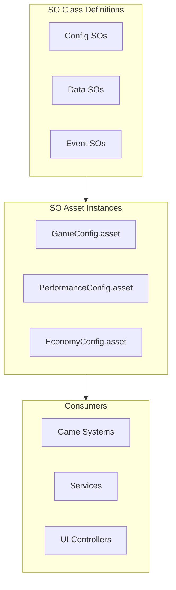

### ScriptableObject Categories

| Category | Purpose | Examples |
|----------|---------|----------|
| **Config** | Runtime settings | `GameConfig`, `PerformanceConfig`, `AudioConfig` |
| **Data** | Game content | `EnemyData`, `ItemData`, `LevelData` |
| **Events** | Event channel definitions | `GameEvent`, `FloatEvent`, `IntEvent` |
| **Service** | Service configuration | `AnalyticsConfig`, `AdsConfig`, `IAPConfig` |

### Generated ScriptableObject Pattern

| Element | Convention |
|---------|------------|
| Class name | `{Name}Data` or `{Name}Config` |
| Asset menu | `[CreateAssetMenu(fileName = "{Name}", menuName = "Genesis/{Category}/{Name}")]` |
| Location | Class in `Scripts/Data/`; assets in `ScriptableObjects/{Category}/` |
| Access | Injected via DI or referenced in config SO |
| Validation | `OnValidate()` for editor-time range checks |

### Core Config ScriptableObjects (Every Project)

| ScriptableObject | Fields (Examples) |
|------------------|-------------------|
| `GameConfig` | `gameName`, `version`, `environment`, `debugMode` |
| `PerformanceConfig` | `targetFps`, `qualityLevel`, `vSync`, `memoryBudgetMb` |
| `AudioConfig` | `masterVolume`, `musicVolume`, `sfxVolume` |
| `AnalyticsConfig` | `provider`, `enabled`, `debugMode` |
| `AdsConfig` | `provider`, `placements[]`, `testMode` |
| `IAPConfig` | `products[]`, `testMode` |
| `CloudSaveConfig` | `provider`, `syncIntervalSeconds`, `autoSync` |

### ScriptableObject Generator

```
genesis generate unity-so <name> --category <config|data|event>
```

Generates: SO class, asset placeholder, EditMode validation test.

### ScriptableObject Rules

| Rule ID | Description |
|---------|-------------|
| SO-001 | No hardcoded game values in MonoBehaviours or systems |
| SO-002 | Config SOs loaded at bootstrap; data SOs loaded via Addressables |
| SO-003 | SO classes are plain data containers; logic lives in systems |
| SO-004 | Every SO class has `[CreateAssetMenu]` with Genesis menu path |
| SO-005 | SO assets referenced in config, not found by string path |

---

## Addressables

Addressables are the **mandatory** asset loading system. The `Resources/` folder is not generated.

### Addressables Architecture

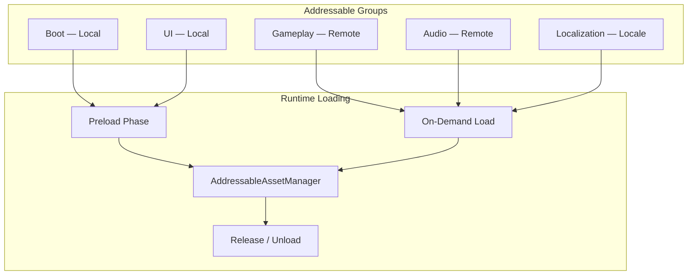

### Addressable Groups

| Group | Build Path | Load Path | Content |
|-------|-----------|-----------|---------|
| `Boot` | Local | Local | Bootstrap prefabs, core config SOs |
| `UI` | Local | Local | UI prefabs, fonts, common sprites |
| `Gameplay` | Remote | Remote | Level assets, characters, VFX |
| `Audio` | Remote | Remote | Music packs, SFX packs |
| `Localization` | Remote | Remote | Locale-specific assets |
| `Scenes` | Local/Remote | Local/Remote | Additive scene assets |

### Addressable Labels

| Label | Purpose |
|-------|---------|
| `default` | Standard assets |
| `preload` | Loaded during boot sequence |
| `locale-{code}` | Locale-specific (e.g., `locale-es`) |
| `platform-{name}` | Platform-specific (e.g., `platform-ios`) |
| `genre-{name}` | Genre-specific content packs |

### Generated Addressables Scaffold

| Component | Description |
|-----------|-------------|
| `IAddressableAssetManager` | Load, release, instantiate interface |
| `AddressableAssetManager` | Wrapper over `Addressables` API |
| `AddressablePreloader` | Boot-time preload for `preload` label |
| `AddressableGroups` config | Group definitions in `AddressableAssetsData/` |
| Editor build script | CI Addressables build step |

### Addressables Rules

| Rule ID | Description |
|---------|-------------|
| ADDR-001 | No `Resources/` folder in generated projects |
| ADDR-002 | All runtime-loaded assets must be Addressable |
| ADDR-003 | Boot group limited to < 10 MB |
| ADDR-004 | Remote groups have CDN path configured in profile |
| ADDR-005 | Loaded assets released when no longer needed |
| ADDR-006 | Scene loading uses `Addressables.LoadSceneAsync` |

---

## Input System

Generated projects use the **Unity Input System** package (not legacy Input Manager).

### Input Architecture

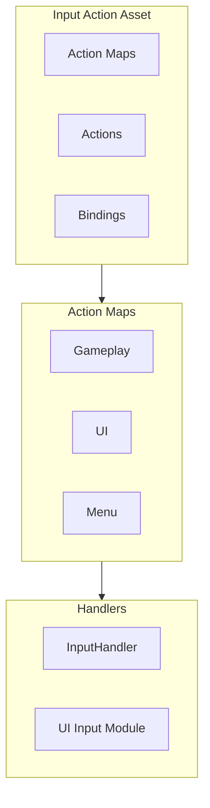

### Generated Input Action Asset

**Path:** `Assets/_Project/Settings/Input/GameInput.inputactions`

| Action Map | Actions | Bindings |
|------------|---------|----------|
| `Gameplay` | `Move`, `Action`, `Pause` | Touch joystick, tap, keyboard WASD |
| `UI` | `Navigate`, `Submit`, `Cancel` | Touch, gamepad, keyboard |
| `Menu` | `Navigate`, `Submit`, `Cancel` | Same as UI |

### 2D vs 3D Input Bindings

| Action | 2D Binding | 3D Binding |
|--------|-----------|------------|
| Move | Touch drag / WASD | Virtual joystick |
| Action | Tap / Space | Tap / Space |
| Camera | — | Touch orbit / scroll |
| Pause | Escape / menu button | Escape / menu button |

### Generated Input Components

| Component | Description |
|-----------|-------------|
| `GameInput.inputactions` | Input Action Asset |
| `IInputHandler` | Input abstraction interface |
| `InputHandler` | Reads actions, emits events via event bus |
| `InputSystemUIInputModule` | UI input (replaces StandaloneInputModule) |

### Input Rules

| Rule ID | Description |
|---------|-------------|
| INP-001 | Legacy Input Manager disabled in project settings |
| INP-002 | No direct `Input.GetKey` in generated code |
| INP-003 | All input via Input Action Asset and `IInputHandler` |
| INP-004 | Touch bindings include `<Touchscreen>` paths |
| INP-005 | Input actions generate C# wrapper class |

---

## Localization

Localization scaffolds multi-language support via the Unity Localization package.

### Localization Architecture

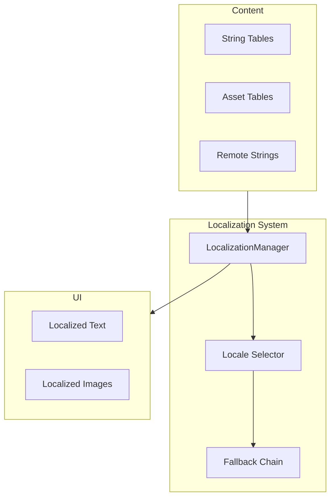

### Default Locales

| Code | Language | Tier |
|------|----------|------|
| `en` | English | Default |
| `es` | Spanish | Tier 1 |
| `fr` | French | Tier 1 |
| `de` | German | Tier 1 |
| `ja` | Japanese | Tier 2 |
| `ko` | Korean | Tier 2 |
| `pt-BR` | Portuguese (Brazil) | Tier 2 |
| `zh-Hans` | Chinese (Simplified) | Tier 2 |

### Generated Localization Scaffold

| Component | Path | Description |
|-----------|------|-------------|
| `LocalizationManager` | `Scripts/Core/` | Locale switching, initialization |
| `LocaleConfig` SO | `ScriptableObjects/Config/` | Supported locales, default |
| String Tables | `Localization/StringTables/` | Per-locale string tables |
| Asset Tables | `Localization/AssetTables/` | Per-locale sprite assets |
| `LocalizedText` component | `Scripts/UI/Components/` | UI text binding |
| Addressable label | `locale-{code}` | Per-locale asset groups |

### Localization Rules

| Rule ID | Description |
|---------|-------------|
| LOC-001 | No hardcoded user-facing strings in code |
| LOC-002 | All UI text uses `LocalizedText` or string table references |
| LOC-003 | Locale selected from device language with config fallback |
| LOC-004 | Locale switch does not require scene reload |
| LOC-005 | String tables registered as Addressable per locale |

---

## Analytics

Analytics scaffolds structured event tracking integrated with `framework/analytics/` and backend sync.

### Analytics Architecture

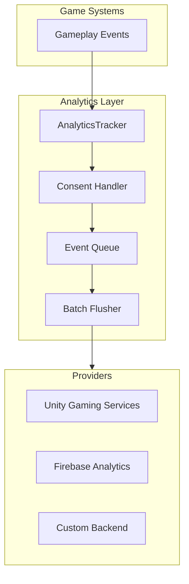

### Analytics Providers

| Provider | Flag | Package | Use Case |
|----------|------|---------|----------|
| Unity Gaming Services | `--analytics ugs` (default) | `com.unity.services.analytics` | General mobile analytics |
| Firebase Analytics | `--analytics firebase` | Firebase SDK | Firebase-backed games |
| Custom backend | `--analytics custom` | HTTP client | Self-hosted analytics |

### Standard Events (Generated)

| Event | Properties | Trigger |
|-------|------------|---------|
| `session_start` | `sessionId`, `platform` | App launch |
| `session_end` | `sessionId`, `durationSeconds` | App background/close |
| `level_start` | `levelId`, `attemptNumber` | Level begins |
| `level_complete` | `levelId`, `durationSeconds`, `score` | Level completed |
| `level_fail` | `levelId`, `failReason` | Level failed |
| `currency_earned` | `type`, `amount`, `source` | Currency awarded |
| `currency_spent` | `type`, `amount`, `sink` | Currency spent |
| `iap_initiated` | `productId`, `price` | Purchase started |
| `iap_completed` | `productId`, `price` | Purchase succeeded |
| `ad_impression` | `placement`, `format` | Ad shown |
| `ad_reward` | `placement`, `rewardType`, `amount` | Rewarded ad completed |

### Generated Analytics Scaffold

| Component | Description |
|-----------|-------------|
| `IAnalyticsTracker` | Interface (in `framework/analytics/`) |
| `AnalyticsTracker` | Implementation with provider adapter |
| `AnalyticsConfig` SO | Provider, debug mode, consent settings |
| `AnalyticsEvents` | Static class with event name constants |
| `AnalyticsConsentHandler` | GDPR/COPPA consent flow |
| `PrivacyManifest` | iOS privacy manifest scaffold |

---

## Ads

Ads scaffolding integrates rewarded, interstitial, and banner placements with consent handling.

### Ads Architecture

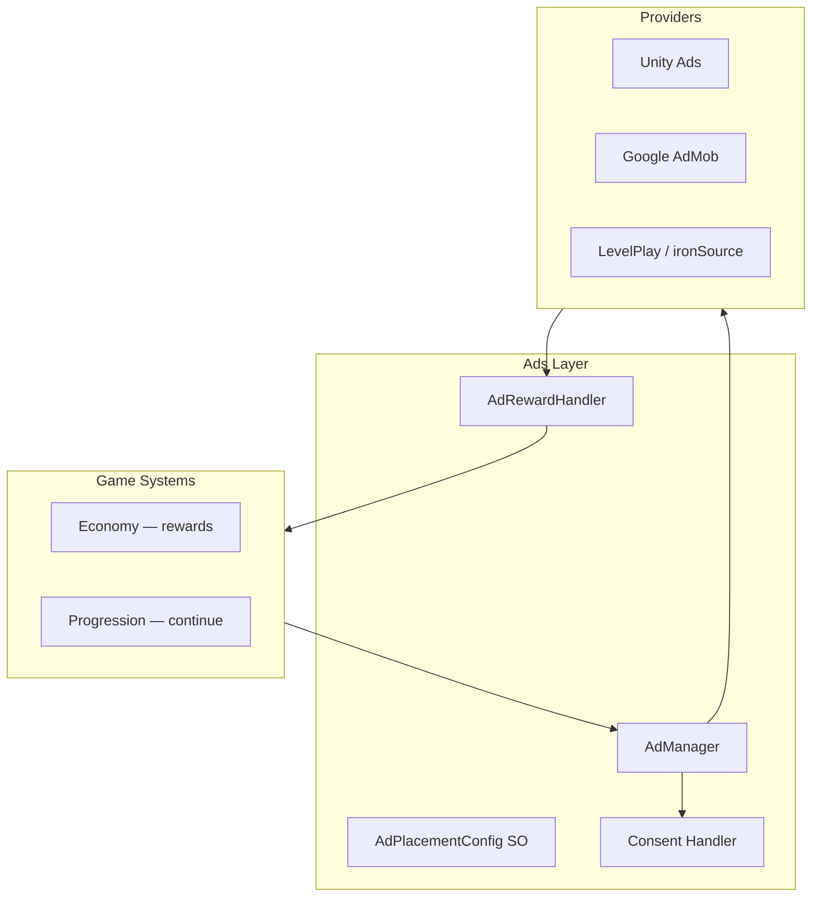

### Ad Placement Types

| Placement ID | Format | Trigger | Reward |
|--------------|--------|---------|--------|
| `rewarded_continue` | Rewarded | Level fail | Continue playing |
| `rewarded_currency` | Rewarded | Player opt-in | Soft currency |
| `rewarded_energy` | Rewarded | Energy depleted | Energy refill |
| `rewarded_multiplier` | Rewarded | Player opt-in | Timed earnings boost |
| `interstitial_level_end` | Interstitial | Level complete | None |
| `banner_main_menu` | Banner | Main menu visible | None |

### Generated Ads Scaffold

| Component | Description |
|-----------|-------------|
| `IAdManager` | Ad lifecycle interface |
| `AdManager` | Provider-agnostic implementation |
| `AdPlacementConfig` SO | Placement definitions |
| `AdRewardHandler` | Maps completion to game rewards |
| `AdConsentHandler` | GDPR/COPPA consent (UMP SDK scaffold) |

### Ads Rules

| Rule ID | Description |
|---------|-------------|
| AD-001 | Ads never block critical gameplay without player opt-in |
| AD-002 | Rewarded ad rewards only granted on verified completion |
| AD-003 | Interstitial frequency capped (configurable per placement) |
| AD-004 | Consent obtained before first ad request |
| AD-005 | Ad failures degrade gracefully (no crash, log warning) |

---

## In-App Purchases

IAP scaffolding integrates Unity Purchasing with store configuration for iOS and Android.

### IAP Architecture

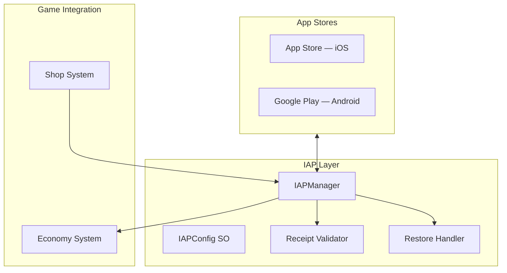

### Product Types

| Type | Examples | Configuration |
|------|----------|---------------|
| Consumable | Currency packs, boosters | Rebuyable |
| Non-consumable | Remove ads, premium unlock | Permanent |
| Subscription | Battle pass, VIP | Recurring |

### Generated IAP Scaffold

| Component | Description |
|-----------|-------------|
| `IIAPManager` | Purchase, restore, query interface |
| `IAPManager` | Unity Purchasing wrapper |
| `IAPConfig` SO | Product catalog (id, type, price tier) |
| `ReceiptValidator` | Server-side receipt validation scaffold |
| `ShopUI` | Purchase flow UI prefab |
| `IAPAnalytics` | Purchase event tracking |

### IAP API Flow

| Step | Action |
|------|--------|
| 1 | Initialize Unity Purchasing with product catalog |
| 2 | Player selects product in shop UI |
| 3 | Store purchase dialog shown |
| 4 | On success: validate receipt (local + server) |
| 5 | Grant reward via economy system |
| 6 | Emit `iap_completed` analytics event |

### IAP Rules

| Rule ID | Description |
|---------|-------------|
| IAP-001 | All purchases validated server-side in production |
| IAP-002 | Restore purchases supported on iOS |
| IAP-003 | Product IDs match store configuration exactly |
| IAP-004 | Purchase failures show user-friendly message |
| IAP-005 | Pending purchases handled (deferred on iOS) |

---

## Cloud Save

Cloud save scaffolds player data persistence with offline support and backend sync.

### Cloud Save Architecture

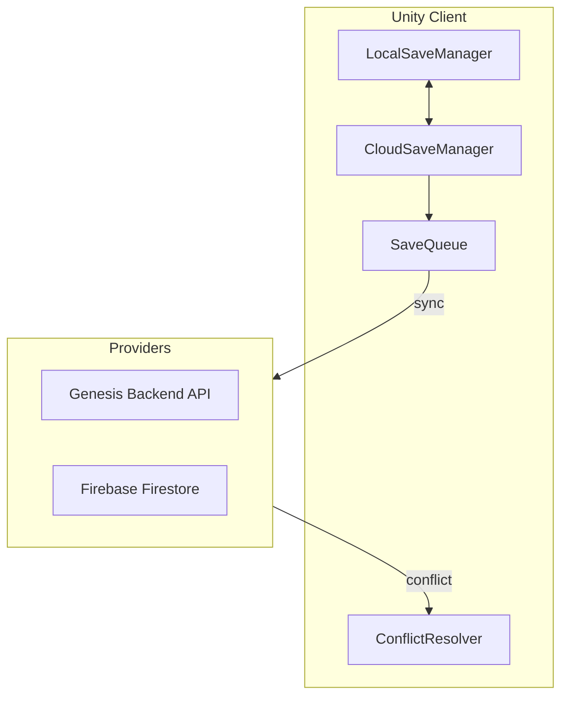

### Save Data Categories

| Category | Sync Priority | Conflict Strategy |
|----------|---------------|-------------------|
| `progression` | Critical | Server wins |
| `economy` | Critical | Server wins |
| `inventory` | High | Merge |
| `settings` | Low | Client wins |
| `statistics` | Medium | Max value |

### Generated Cloud Save Scaffold

| Component | Description |
|-----------|-------------|
| `ICloudSaveManager` | Save/load/sync interface |
| `CloudSaveManager` | Offline-first with sync queue |
| `SaveData` | Serializable save structure |
| `ConflictResolver` | Strategy-based resolution |
| `CloudSaveConfig` SO | Provider, sync interval, auto-sync |
| `BackendCloudSaveAdapter` | REST API client for Genesis backend |
| `FirebaseCloudSaveAdapter` | Firestore adapter (when Firebase enabled) |

### Cloud Save Rules

| Rule ID | Description |
|---------|-------------|
| CS-001 | Local save written first; cloud sync is async |
| CS-002 | Sync queued when offline; flushed on reconnect |
| CS-003 | Critical data validated server-side |
| CS-004 | Save corruption triggers backup restore |
| CS-005 | Sync interval configurable (default: 60 seconds) |

---

## Firebase

Firebase integration scaffolds Google Firebase SDK for auth, analytics, cloud save, and remote config. Delivered in coordination with `@genesis/plugin-firebase`.

### Firebase Architecture

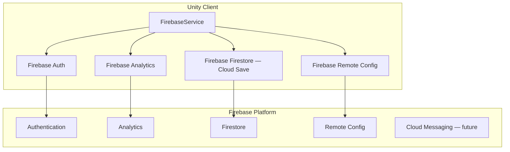

### Firebase Services Scaffold

| Service | Generated Component | Purpose |
|---------|---------------------|---------|
| Core | `FirebaseService` | SDK initialization, app lifecycle |
| Auth | `FirebaseAuthAdapter` | Anonymous + social login |
| Analytics | `FirebaseAnalyticsAdapter` | Event tracking |
| Firestore | `FirebaseCloudSaveAdapter` | Document-based cloud save |
| Remote Config | `FirebaseRemoteConfigAdapter` | Server-driven config |
| Crashlytics | `FirebaseCrashlyticsAdapter` | Crash reporting (optional) |

### Firebase Configuration Files

| File | Platform | Purpose |
|------|----------|---------|
| `google-services.json` | Android | Firebase Android config (placeholder) |
| `GoogleService-Info.plist` | iOS | Firebase iOS config (placeholder) |
| `FirebaseConfig` SO | Both | Feature flags, collection names |

### Firebase Generator Command

```
genesis generate unity firebase --services auth,analytics,firestore,remote-config
```

### Firebase Rules

| Rule ID | Description |
|---------|-------------|
| FB-001 | Firebase initialized once in bootstrap before other services |
| FB-002 | Config files are placeholders; real files from Firebase console |
| FB-003 | Firebase Auth anonymous sign-in as default for games |
| FB-004 | Remote Config fetched on launch with local cache fallback |
| FB-005 | Firestore security rules documented in generated README |

---

## Dependency Injection

Generated Unity projects use explicit dependency injection — no singletons, no `FindObjectOfType`, no service locator anti-pattern.

### DI Architecture

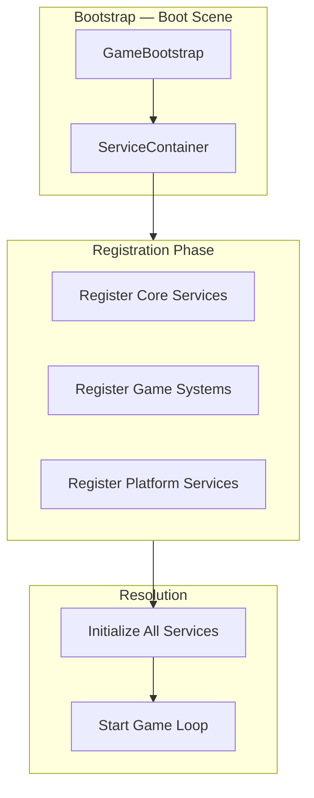

### DI Container Contract

| Method | Description |
|--------|-------------|
| `Register<TInterface, TImplementation>(lifetime)` | Register a service |
| `Resolve<T>()` | Resolve a service instance |
| `ResolveAll<T>()` | Resolve all implementations of interface |
| `Initialize()` | Call `Initialize()` on all `IService` instances |
| `Dispose()` | Call `Dispose()` on all services in reverse order |

### Service Lifetimes

| Lifetime | Description | Examples |
|----------|-------------|----------|
| Singleton | One instance per app session | EventBus, ConfigManager, AnalyticsTracker |
| Transient | New instance per resolve | Commands, temporary handlers |
| Scene | Lives for scene duration | Scene-specific controllers |

### Registration Order

| Order | Category | Examples |
|-------|----------|----------|
| 1 | Core | `IEventBus`, `IConfigManager`, `IAddressableAssetManager` |
| 2 | Services | `IAnalyticsTracker`, `IAdManager`, `IIAPManager`, `ICloudSaveManager` |
| 3 | Systems | `IProgressionSystem`, `IEconomySystem`, `IInventorySystem` |
| 4 | Presentation | `IInputHandler`, UI controllers |

### Generated DI Pattern

| Interface | Implementation | Lifetime |
|-----------|---------------|----------|
| `IEventBus` | `EventBus` | Singleton |
| `IConfigManager` | `ConfigManager` | Singleton |
| `IAddressableAssetManager` | `AddressableAssetManager` | Singleton |
| `IAnalyticsTracker` | `AnalyticsTracker` | Singleton |
| `IAdManager` | `AdManager` | Singleton |
| `IIAPManager` | `IAPManager` | Singleton |
| `ICloudSaveManager` | `CloudSaveManager` | Singleton |
| `ILocalizationManager` | `LocalizationManager` | Singleton |
| `IInputHandler` | `InputHandler` | Singleton |
| `IGameSystem` (each) | `{Name}System` | Singleton |

### System Interface Contract

```
IGameSystem:
  Initialize()   — called after DI registration
  Tick(deltaTime) — called each frame (only if needed)
  Dispose()      — cleanup on shutdown
```

### DI Rules

| Rule ID | Description |
|---------|-------------|
| DI-001 | No `static` service instances or singletons in generated code |
| DI-002 | No `FindObjectOfType` or `GameObject.Find` in generated code |
| DI-003 | All dependencies received via constructor injection |
| DI-004 | `GameBootstrap` is the only MonoBehaviour that constructs the container |
| DI-005 | Systems registered and initialized in explicit order |
| DI-006 | MonoBehaviours receive dependencies via `[Inject]` or constructor from bootstrap |

---

## Prefab Generation

Prefab generation scaffolds reusable GameObject hierarchies with components, references, and Addressable registration.

### Prefab Architecture

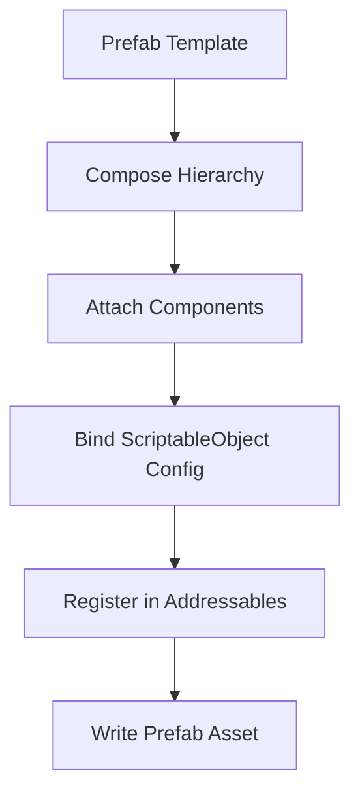

### Prefab Categories

| Category | Path | Examples |
|----------|------|----------|
| `UI` | `Prefabs/UI/` | MainMenu, HUD, Popup, Settings, Shop |
| `Gameplay` | `Prefabs/Gameplay/` | Player, Enemy, Item, Tile, TapTarget |
| `Services` | `Prefabs/Services/` | AnalyticsManager, AdManager (bootstrap) |
| `VFX` | `Prefabs/VFX/` | Reward, Hit, Collect |

### Prefab Template Contract

| Field | Type | Description |
|-------|------|-------------|
| `id` | string | Template identifier |
| `name` | string | Prefab name |
| `category` | enum | `ui`, `gameplay`, `services`, `vfx` |
| `dimension` | enum | `2d`, `3d`, `both` |
| `hierarchy` | NodeDefinition[] | GameObject tree |
| `components` | ComponentDefinition[] | Components per node |
| `configReference` | string | ScriptableObject binding |
| `addressableGroup` | string | Target Addressable group |
| `addressableLabel` | string | Addressable label |

### Standard Prefabs (Generated per Project)

| Prefab | Category | Dimension | Contents |
|--------|----------|-----------|----------|
| `UI_MainMenu` | UI | both | Canvas, buttons, localized text |
| `UI_HUD` | UI | both | Score, currency, pause button |
| `UI_Popup_Reward` | UI | both | Reward display with animation hooks |
| `UI_Settings` | UI | both | Audio, accessibility, language settings |
| `UI_Shop` | UI | both | IAP product list |
| `UI_Loading` | UI | both | Progress bar, tips |
| `Player` | Gameplay | 3d | CharacterController, input handler |
| `Player2D` | Gameplay | 2d | Rigidbody2D, sprite renderer |
| `VFX_Reward` | VFX | both | Particle system placeholder |

### Prefab Generator Command

```
genesis generate unity-prefab <name> --template <category> --dimension <2d|3d>
```

### Prefab Rules

| Rule ID | Description |
|---------|-------------|
| PF-001 | All prefabs under `Assets/_Project/Prefabs/{category}/` |
| PF-002 | Root GameObject name matches prefab filename |
| PF-003 | Components reference ScriptableObject configs, not hardcoded values |
| PF-004 | UI prefabs include `LocalizedText` and `AccessibleButton` components |
| PF-005 | All prefabs registered in Addressables with appropriate group and label |
| PF-006 | No scene-only objects; reusable objects must be prefabs |

---

## Scene Generation

Scene generation scaffolds Unity scenes with cameras, lighting, UI, and bootstrap configuration.

### Scene Architecture

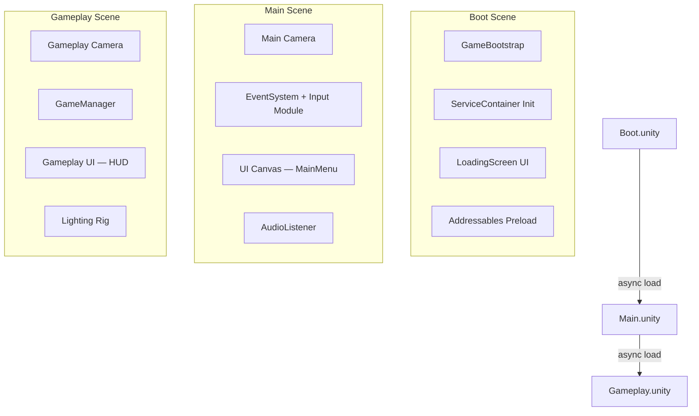

### Standard Scenes

| Scene | Build Index | Purpose | Load Method |
|-------|-------------|---------|-------------|
| `Boot.unity` | 0 | DI init, preload, loading screen | Synchronous (first) |
| `Main.unity` | — | Main menu / hub | Addressables async |
| `Gameplay.unity` | — | Core gameplay | Addressables async |
| `Loading.unity` | — | Transition loading screen | Additive async |

### 2D Scene Contents

| Scene | GameObjects |
|-------|-------------|
| Boot | GameBootstrap, LoadingScreen (Canvas), EventSystem |
| Main | Orthographic Camera, Canvas (MainMenu prefab), EventSystem |
| Gameplay | Orthographic Camera, GameManager, Canvas (HUD), Tilemap (optional) |

### 3D Scene Contents

| Scene | GameObjects |
|-------|-------------|
| Boot | GameBootstrap, LoadingScreen (Canvas), EventSystem |
| Main | Cinemachine Camera, Directional Light, Canvas (MainMenu), EventSystem |
| Gameplay | Cinemachine Camera, Directional Light, GameManager, Canvas (HUD), Ground Plane |

### Scene Template Contract

| Field | Type | Description |
|-------|------|-------------|
| `id` | string | Scene template id |
| `name` | string | Scene file name |
| `dimension` | enum | `2d`, `3d` |
| `gameObjects` | GameObjectDefinition[] | Root objects |
| `lighting` | LightingConfig | Ambient, directional settings |
| `camera` | CameraConfig | Type, position, URP data |
| `ui` | UIConfig | Canvas, event system, prefab refs |
| `systems` | string[] | Systems to initialize |
| `addressableGroup` | string | Addressables group for scene |

### Scene Generator Command

```
genesis generate unity-scene <name> --template <boot|main|gameplay> --dimension <2d|3d>
```

### Scene Rules

| Rule ID | Description |
|---------|-------------|
| SC-001 | Boot scene is build index 0 |
| SC-002 | Single responsibility per scene |
| SC-003 | No cross-scene direct references (Addressables or scene manager) |
| SC-004 | Lighting configured for mobile (baked where possible in 3D) |
| SC-005 | UI canvas uses safe area support for notched devices |
| SC-006 | EventSystem with Input System UI module in every scene with UI |
| SC-007 | Non-boot scenes loaded via Addressables |

---

## Performance Guidelines

Performance guidelines are enforced through generated code conventions, project settings, and validators.

### Performance Targets

| Metric | iOS | Android (mid) | Android (low) |
|--------|-----|---------------|---------------|
| Target FPS | 60 | 60 | 30 |
| Max memory | 300 MB | 350 MB | 250 MB |
| Cold start | < 3s | < 4s | < 5s |
| Scene load | < 2s | < 3s | < 4s |
| Draw calls | < 100 | < 150 | < 80 |
| Triangles (3D) | < 100K | < 150K | < 50K |
| Sprites (2D) | < 200 visible | < 300 visible | < 100 visible |

### Performance Architecture

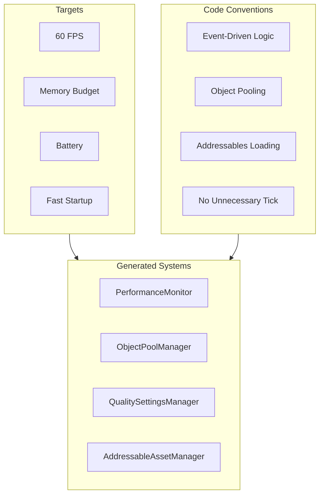

### Code Conventions (Validator-Enforced)

| Convention | Rule | Validator |
|------------|------|-----------|
| No polling `Update()` | Use events and `IEventBus` | `unity:performance` |
| No `Tick()` unless required | Systems opt-in to per-frame updates | `unity:performance` |
| Object pooling | Pool frequently spawned objects | `unity:performance` |
| No LINQ in hot paths | Avoid allocations in `Tick`/`Update` | `unity:performance` |
| No `GetComponent` in loops | Cache references in `Initialize()` | `unity:performance` |
| ScriptableObject data | No hardcoded game values | `unity:data-driven` |
| No `Resources.Load` | Use Addressables | `unity:addressables` |
| MonoBehaviour size | Scripts under 200 lines | `unity:structure` |
| No empty `Update()` | Remove unused lifecycle methods | `unity:performance` |

### Generated Performance Components

| Component | Description |
|-----------|-------------|
| `PerformanceConfig` SO | FPS target, quality levels, memory budget |
| `PerformanceMonitor` | Dev-build FPS/memory overlay |
| `ObjectPoolManager` | Generic `IPool<T>` with pre-warm |
| `QualitySettingsManager` | Auto-detect and manual quality switching |
| `FrameRateLimiter` | Target FPS enforcement |

### Memory Management Guidelines

| Guideline | Implementation |
|-----------|---------------|
| Texture max size | 2048px (configurable per platform) |
| Audio streaming | Music streamed, SFX loaded |
| Asset release | Addressables released when scene unloads |
| GC allocation | Minimize per-frame allocations |
| Sprite atlas | Documented in asset pipeline guide |
| Mesh compression | Enabled for 3D models |

### Battery Optimization

| Guideline | Implementation |
|-----------|---------------|
| Target frame rate | `Application.targetFrameRate` from config |
| No background processing | Systems pause when app backgrounded |
| Reduce polling | Event-driven over per-frame checks |
| Shader complexity | URP mobile shaders only |
| VSync | Configurable per quality level |

---

## Generator Catalog

### Project Generators

| Generator ID | Command | Output |
|--------------|---------|--------|
| `unity:project` | `genesis generate unity project` | Full Unity 6 project |
| `unity:system` | `genesis generate unity-system <name>` | Game system + interface + tests |
| `unity:scriptable-object` | `genesis generate unity-so <name>` | SO class + asset |
| `unity:scene` | `genesis generate unity-scene <name>` | Scene with hierarchy |
| `unity:prefab` | `genesis generate unity-prefab <name>` | Prefab with components |
| `unity:ui` | `genesis generate unity-ui <name>` | UI controller + view + prefab |
| `unity:addressables` | `genesis generate unity addressables` | Addressables configuration |
| `unity:input` | `genesis generate unity input` | Input Action Asset |
| `unity:localization` | `genesis generate unity localization` | Localization tables |
| `unity:analytics` | `genesis generate unity analytics` | Analytics service |
| `unity:ads` | `genesis generate unity ads` | Ads service |
| `unity:iap` | `genesis generate unity iap` | IAP service |
| `unity:cloud-save` | `genesis generate unity cloud-save` | Cloud save service |
| `unity:firebase` | `genesis generate unity firebase` | Firebase integration |
| `unity:services` | `genesis generate unity services` | All platform services |

### Generator Flags

| Flag | Type | Default | Description |
|------|------|---------|-------------|
| `--dimension` | enum | `2d` | `2d` or `3d` |
| `--unity-version` | string | `6000.0` | Unity editor version |
| `--render-pipeline` | enum | `urp` | Render pipeline (URP only) |
| `--analytics` | enum | `ugs` | `ugs`, `firebase`, `custom` |
| `--ads` | boolean | true | Include ads scaffold |
| `--iap` | boolean | true | Include IAP scaffold |
| `--firebase` | boolean | false | Include Firebase integration |
| `--cloud-save` | enum | `backend` | `backend`, `firebase` |
| `--locales` | string | `en,es,fr,de` | Comma-separated locale codes |
| `--input` | boolean | true | Include Input System setup |
| `--addressables` | boolean | true | Include Addressables config |
| `--testing` | boolean | true | Include EditMode test scaffolds |

---

## Validation

### Unity Validation Rules

| Rule ID | Scope | Severity | Description |
|---------|-------|----------|-------------|
| `UNITY-001` | structure | error | Folder structure matches specification |
| `UNITY-002` | structure | error | No scripts outside `_Project/Scripts/` |
| `UNITY-003` | structure | warning | MonoBehaviours under 200 lines |
| `UNITY-004` | architecture | error | Systems implement `IGameSystem` |
| `UNITY-005` | architecture | error | No singletons or `FindObjectOfType` |
| `UNITY-006` | architecture | warning | Systems communicate via `IEventBus` |
| `UNITY-007` | data | error | No hardcoded game values in scripts |
| `UNITY-008` | data | warning | Config values in ScriptableObjects |
| `UNITY-009` | addressables | error | No `Resources/` folder |
| `UNITY-010` | addressables | warning | All prefabs registered in Addressables |
| `UNITY-011` | performance | warning | No empty `Update()` methods |
| `UNITY-012` | performance | warning | No LINQ in `Tick()` methods |
| `UNITY-013` | input | error | Input System package active |
| `UNITY-014` | localization | warning | No hardcoded user-facing strings |
| `UNITY-015` | compile | error | Project compiles with zero errors |
| `UNITY-016` | settings | warning | iOS/Android build targets configured |
| `UNITY-017` | settings | error | IL2CPP scripting backend |
| `UNITY-018` | testing | warning | EditMode test exists per system |

---

## Public API

### Unity Generation Service

| Method | Input | Output | Description |
|--------|-------|--------|-------------|
| `generateProject(request)` | GenerateUnityProjectRequest | GenerationResult | Full Unity project |
| `generateSystem(request)` | GenerateSystemRequest | GenerationResult | Game system |
| `generateScriptableObject(request)` | GenerateSORequest | GenerationResult | ScriptableObject |
| `generateScene(request)` | GenerateSceneRequest | GenerationResult | Scene |
| `generatePrefab(request)` | GeneratePrefabRequest | GenerationResult | Prefab |
| `generateServices(request)` | GenerateServicesRequest | GenerationResult | Platform services |
| `listGenerators()` | — | GeneratorInfo[] | Available generators |
| `validateUnityProject(path)` | string | ValidationResult | Validate Unity project |

### GenerateUnityProjectRequest

| Field | Type | Required | Description |
|-------|------|----------|-------------|
| `name` | string | yes | Project name |
| `dimension` | enum | no | `2d` or `3d` |
| `unityVersion` | string | no | Unity version (default: 6000.0) |
| `analytics` | enum | no | Analytics provider |
| `ads` | boolean | no | Include ads |
| `iap` | boolean | no | Include IAP |
| `firebase` | boolean | no | Include Firebase |
| `cloudSave` | enum | no | Cloud save provider |
| `locales` | string[] | no | Supported locales |
| `outputPath` | string | no | Output directory |

---

## Examples

### Example 1 — 2D Puzzle Unity Project

**Command:**
```bash
genesis generate unity project tile-game --dimension 2d --analytics ugs --ads true
```

**Generated:** 52 files — URP 2D, Input System, Addressables (4 groups), 3 scenes, 6 UI prefabs, analytics + ads services, 8 locales, EditMode tests

### Example 2 — 3D RPG Unity Project with Firebase

**Command:**
```bash
genesis generate unity project my-rpg --dimension 3d --firebase true --cloud-save firebase
```

**Generated:** 68 files — URP 3D Forward, Cinemachine, AI Navigation, Firebase (auth, analytics, firestore), cloud save via Firestore, IAP, 3 scenes, gameplay prefabs

### Example 3 — Game System Generation

**Command:**
```bash
genesis generate unity-system inventory
```

**Generated:**

| File | Purpose |
|------|---------|
| `IInventorySystem.cs` | System interface |
| `InventorySystem.cs` | Implementation with DI |
| `InventoryConfig.cs` | ScriptableObject config class |
| `InventoryConfig.asset` | Config asset placeholder |
| `InventoryEvents.cs` | Event definitions |
| `InventorySystemTests.cs` | EditMode tests |

### Example 4 — Scene + Prefab Combo

**Commands:**
```bash
genesis generate unity-scene Level_001 --template gameplay --dimension 2d
genesis generate unity-prefab PuzzleTile --template gameplay --dimension 2d
```

**Level_001 scene:** Orthographic camera, tilemap layer, HUD canvas, game manager with `PuzzleSystem` reference

**PuzzleTile prefab:** SpriteRenderer, BoxCollider2D, `PuzzleTileController` with `PuzzleTileData` SO reference, registered in `Gameplay` Addressable group

### Example 5 — Platform Services Bundle

**Command:**
```bash
genesis generate unity services --analytics firebase --ads true --iap true --cloud-save backend
```

**Generated services:** Firebase Analytics, AdMob ads (6 placements), Unity IAP (consumable + non-consumable), backend cloud save with offline queue — all wired in `GameBootstrap` DI registration

### Example 6 — Game Generation Integration

**Context:** `genesis create game ocean-quest --template mobile-rpg`

**Phase 4–5 generates Unity client with:**

| System | Scene | Prefabs |
|--------|-------|---------|
| Combat, Inventory, Progression, Economy | Gameplay.unity | Player, Enemy_Base, UI_HUD, UI_Shop |
| Analytics, Ads, IAP, Cloud Save | Boot.unity (services) | — |
| Localization (8 locales) | All scenes | LocalizedText on all UI |

---

## Related Documents

| Document | Relationship |
|----------|-------------|
| [README.md](README.md) | Parent specification overview |
| [003-plugin-system/FUNCTIONAL_SPEC.md](../003-plugin-system/FUNCTIONAL_SPEC.md) | Plugin registration |
| [004-scaffolding/FUNCTIONAL_SPEC.md](../004-scaffolding/FUNCTIONAL_SPEC.md) | Generation orchestration |
| [006-game-generation/FUNCTIONAL_SPEC.md](../006-game-generation/FUNCTIONAL_SPEC.md) | Game Unity phases |
| [007-backend/FUNCTIONAL_SPEC.md](../007-backend/FUNCTIONAL_SPEC.md) | Backend API for cloud save |
| [009-liveops/README.md](../009-liveops/) | LiveOps UI extensions |
| [standards/unity/](../../standards/unity/) | Unity standards |
| [framework/unity/](../../framework/unity/) | Reusable Unity modules |
| [.cursor/rules/08-unity-development.mdc](../../.cursor/rules/08-unity-development.mdc) | Unity development rules |

## Changelog

| Version | Date | Change |
|---------|------|--------|
| 1.0.0 | 2026-07-26 | Initial functional specification |
