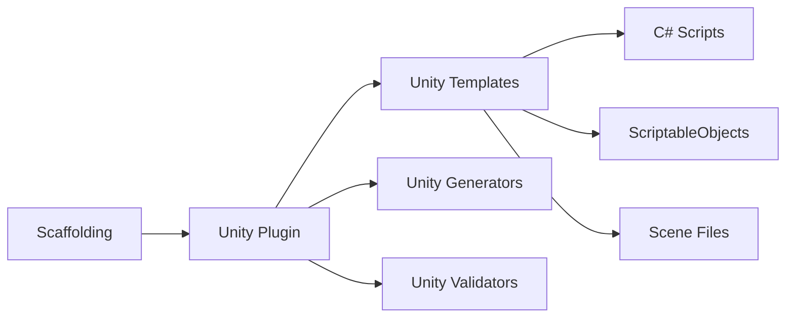

# Unity Specification

## Purpose

Define the Unity integration for Project Genesis, including Unity project scaffolding, system and component generation, ScriptableObject templates, scene setup, and mobile performance conventions.

## Scope

### In Scope

- Unity project scaffolding (directory structure, settings, packages)
- C# script generation (systems, components, ScriptableObjects)
- Scene and prefab scaffolding
- Unity-specific templates and generators
- Mobile performance conventions in generated code
- Addressables configuration scaffolding
- Unity project validation rules

### Out of Scope

- Unity runtime framework code in `framework/unity/` (separate from generation)
- Asset creation (sprites, models, animations, audio)
- Shader and VFX generation
- Build pipeline execution (generates configuration, does not build)
- Unreal Engine integration (future consideration)
- Play Mode testing automation (future)

## Goals

| Goal | Success Criteria |
|------|------------------|
| **Mobile-optimized** | Generated code follows mobile performance standards |
| **Component-based** | Systems use composition, not deep inheritance |
| **Data-driven** | ScriptableObjects for configuration, not hardcoded values |
| **Testable** | Generated systems have EditMode test scaffolds |
| **Standards-compliant** | Output passes `standards/unity/` rules |
| **Project-ready** | Generated Unity project opens and compiles without errors |

## Responsibilities

### Plugin Architecture

Unity capabilities are delivered via `@genesis/plugin-unity` registered through [003-plugin-system](../003-plugin-system/):



### Generated Unity Project Structure

```
unity/
├── Assets/
│   ├── _Project/
│   │   ├── Scripts/
│   │   │   ├── Core/           # Framework interfaces
│   │   │   ├── Systems/        # Game systems
│   │   │   ├── UI/             # UI controllers
│   │   │   └── Data/           # ScriptableObject definitions
│   │   ├── ScriptableObjects/
│   │   │   ├── Config/         # Game configuration
│   │   │   └── Data/           # Game data assets
│   │   ├── Scenes/
│   │   │   ├── Boot.unity      # Initialization scene
│   │   │   └── Main.unity      # Main game scene
│   │   ├── Prefabs/
│   │   │   └── UI/             # UI prefabs
│   │   └── Resources/
│   ├── Plugins/                # Third-party plugins
│   └── Settings/               # Render pipeline, input system
├── Packages/
│   └── manifest.json
├── ProjectSettings/
└── genesis.unity.config.yml
```

### Generators

| Generator | Command | Output |
|-----------|---------|--------|
| `unity-project` | `genesis generate unity project` | Full Unity project structure |
| `unity-system` | `genesis generate unity-system <name>` | System scripts with interfaces |
| `unity-scriptable-object` | `genesis generate unity-so <name>` | ScriptableObject class and asset |
| `unity-scene` | `genesis generate unity-scene <name>` | Scene with camera, lighting, UI canvas |
| `unity-ui` | `genesis generate unity-ui <name>` | UI controller, view, and prefab scaffold |
| `unity-prefab` | `genesis generate unity-prefab <name>` | Prefab with component setup |

### System Generation

Generated systems follow component-based design per `standards/unity/unity-standard.md`:

```csharp
// Generated: InventorySystem.cs
public class InventorySystem : IGameSystem
{
    private readonly IInventoryRepository _repository;
    private readonly IEventBus _eventBus;

    public void Initialize(SystemContext context) { }
    public void Dispose() { }
    public void Tick(float deltaTime) { }
}
```

| Pattern | Rule |
|---------|------|
| Systems | Implement `IGameSystem` with `Initialize`, `Dispose`, `Tick` |
| Components | Single responsibility, attached to GameObjects |
| ScriptableObjects | Data configuration, created via `[CreateAssetMenu]` |
| Events | Decoupled communication via `IEventBus` |
| DI | Constructor injection, wired in bootstrap scene |

### Mobile Performance Conventions

Generated code enforces per `standards/performance/` and `knowledge/mobile/`:

| Convention | Implementation |
|------------|---------------|
| No Update() when event-driven suffices | Systems use events, not polling |
| Object pooling scaffolds | Pool pattern for frequently spawned objects |
| Addressables-ready | Asset references use Addressable paths |
| Touch input | New Input System with touch bindings |
| Memory budgets | ScriptableObject limits documented in config |
| Target FPS | 60 FPS default, configurable per platform |
| Battery | No unnecessary background processing |

### Scene Setup

Generated scenes include:

| Scene | Contents |
|-------|----------|
| `Boot.unity` | Game bootstrap, system initialization, scene loading |
| `Main.unity` | Main game scene with camera, event system, UI canvas |

Scene conventions per `standards/unity/scenes.md`:

- Single responsibility per scene
- No cross-scene direct references (use Addressables or scene manager)
- Lighting settings configured for mobile

### Unity Validators

The Unity plugin registers validators:

| Rule | Check |
|------|-------|
| No large MonoBehaviours | Scripts under 200 lines |
| No tight coupling | Systems communicate via interfaces/events |
| ScriptableObjects for data | No hardcoded game values in scripts |
| Prefab conventions | Prefabs in `Prefabs/` directory, not scene-only |
| Scene organization | Scenes in `Scenes/` with clear naming |
| Mobile settings | Target platform set to iOS/Android |

## Dependencies

### Upstream Specifications

| Spec | Dependency |
|------|------------|
| [000-project](../000-project/) | Architecture principles |
| [003-plugin-system](../003-plugin-system/) | Plugin registration |
| [004-scaffolding](../004-scaffolding/) | Generation orchestration |
| [002-template-engine](../002-template-engine/) | Template rendering |

### Downstream Consumers

| Spec | Relationship |
|------|-------------|
| [006-game-generation](../006-game-generation/) | Unity phase in game generation |
| [009-liveops](../009-liveops/) | LiveOps UI and systems in Unity client |

## Future Implementation

### Phase 2 — Unity Plugin

- Create `@genesis/plugin-unity` in `packages/plugins/unity/`
- Implement `unity-project` generator with full project structure
- Implement `unity-system` and `unity-scriptable-object` generators
- C# templates with naming conventions (PascalCase classes, camelCase methods)
- Unity validators registered with kernel
- Integration test: generate Unity project, verify scripts compile

### Phase 2 — Scene and UI

- `unity-scene` generator with Boot and Main scenes
- `unity-ui` generator with controller/view pattern
- `unity-prefab` generator

### Phase 3 — Game Integration

- Unity phase in [006-game-generation](../006-game-generation/) pipeline
- Genre-specific system scaffolds (inventory for RPG, grid for puzzle)

### Future — Advanced

- Addressables configuration generator
- Input System action map generator
- Animation controller scaffolds
- EditMode and PlayMode test generators
- Unity build pipeline configuration (IL2CPP, platform settings)

## Related Documents

- [003-plugin-system](../003-plugin-system/) — Plugin architecture
- [006-game-generation](../006-game-generation/) — Game project generation
- [standards/unity/](../../standards/unity/) — Unity standards
- [knowledge/unity/](../../knowledge/unity/) — Unity reference
- [.cursor/rules/08-unity-development.mdc](../../.cursor/rules/08-unity-development.mdc) — Unity rules

## Changelog

| Version | Date | Change |
|---------|------|--------|
| 1.0.0 | 2026-07-26 | Initial approved specification |
