# Genesis LiveOps System — Functional Specification

## Document Control

| Field | Value |
|-------|-------|
| **Specification** | [009-liveops](README.md) |
| **Status** | Approved |
| **Version** | 1.0.0 |
| **Independence** | Implementation-independent. No cloud provider, database, or SDK technology is prescribed beyond documented contracts. |
| **Audience** | LiveOps engineers, game designers, backend engineers, Unity developers, product managers, AI assistants |

## Purpose

Define the complete functional architecture of the **Genesis LiveOps System** — the subsystem responsible for operating live mobile games built with Project Genesis. LiveOps provides server-driven configuration, experimentation, timed content, retention mechanics, economy tuning, competitive features, and cloud synchronization between Unity clients and backend services. The system extends generated game projects with production-ready LiveOps capabilities without modifying core gameplay frameworks.

## Scope

### In Scope

- LiveOps system architecture (client, server, external services)
- Feature flags and remote configuration
- A/B testing and experiment assignment
- Limited-time events and event scheduling
- Analytics integration for LiveOps actions
- Push notification targeting and delivery orchestration
- Live economy updates and tuning
- Season pass (battle pass) progression and rewards
- Daily rewards and login streaks
- Leaderboards and competitive rankings
- Cloud synchronization of LiveOps player state
- Framework modules in `framework/liveops/`
- Backend API contracts and Unity client systems
- Generation scaffolding (`genesis generate liveops`)
- Validation rules and examples

### Out of Scope

- Game economy balancing and spreadsheet authoring (designer responsibility)
- Push notification transport infrastructure (Firebase Cloud Messaging / APNs)
- Analytics dashboard UI (external tools: Firebase, Amplitude, etc.)
- Anti-cheat and fraud detection (separate security concern)
- Customer support and CRM tools
- App store management and store listings
- LiveOps admin web dashboard (future)
- In-game NPC dialogue (game-level concern)

---

## Goals

### Primary Goals

| ID | Goal | Success Criteria |
|----|------|------------------|
| G1 | **Retention-focused** | LiveOps systems target measurable D1, D7, D30 retention improvements |
| G2 | **Server-driven** | Content, economy, and features tunable without app store release |
| G3 | **Experiment-ready** | A/B tests assign variants and measure outcomes from day one |
| G4 | **Backend-synced** | Client and server share authoritative LiveOps state |
| G5 | **Data-driven** | All LiveOps content defined in config, ScriptableObjects, and database |
| G6 | **Analytics-integrated** | Every LiveOps action emits structured analytics events |
| G7 | **Extensible** | New event types and features added without core system changes |
| G8 | **Offline-resilient** | Client operates with cached config; syncs on reconnect |
| G9 | **Segment-aware** | Features target player segments (new, returning, whale, etc.) |
| G10 | **Generation-ready** | `genesis generate liveops` scaffolds full LiveOps module |

### Non-Functional Goals

| Attribute | Target |
|-----------|--------|
| Config fetch latency | < 2 seconds on app launch |
| Sync latency | < 1 second for critical state after login |
| Config cache TTL | 15 minutes default; force-refresh on login |
| Event schedule accuracy | ± 30 seconds activation/deactivation |
| Leaderboard update | Near real-time (< 5 seconds) for score submission |
| Offline grace period | 24 hours with cached config before degraded mode |

### Design Principles

1. **Server authority** — Economy, season progress, and leaderboard scores validated server-side.
2. **Config before code** — Feature flags and remote config control rollout; code paths exist but are gated.
3. **Measure everything** — Every LiveOps interaction emits analytics for retention and revenue analysis.
4. **Graceful degradation** — Network failures use cached config; never block gameplay.
5. **Segment, don't spam** — Push notifications and offers respect player segments and frequency caps.
6. **Time-zone aware** — Daily resets and event schedules respect player local time where configured.
7. **Idempotent operations** — Claim, complete, and participate actions safe to retry.
8. **Framework isolation** — LiveOps code in `framework/liveops/`; games consume, never fork.

---

## Architecture

### System Overview

```mermaid
flowchart TB
    subgraph clients [Game Clients]
        UNITY[Unity Client]
    end

    subgraph liveops [LiveOps Layer]
        subgraph client_side [Client — framework/liveops]
            LCM[LiveOps Client Manager]
            RC[Remote Config Client]
            FF[Feature Flag Client]
            AB[A/B Test Client]
            EM[Event Manager]
            SM[Season Manager]
            DR[Daily Rewards Manager]
            LB[Leaderboard Client]
            SYNC[Cloud Sync Client]
            AN[Analytics Emitter]
        end

        subgraph server_side [Server — Backend API]
            LOS[LiveOps Service]
            CS[Config Service]
            ES[Experiment Service]
            EVS[Event Service]
            SS[Season Service]
            ECON[Economy Service]
            LBS[Leaderboard Service]
            PNS[Push Notification Service]
            SYNC_S[Sync Service]
        end
    end

    subgraph external [External Services]
        FB_RC[Firebase Remote Config]
        FCM[Firebase Cloud Messaging]
        APNs[Apple Push Notification]
        ANA[Analytics Platform]
        ADMIN[LiveOps Admin — future]
    end

    subgraph data [Data Stores]
        PG[(PostgreSQL)]
        RD[(Redis)]
    end

    UNITY --> LCM
    LCM --> RC
    LCM --> FF
    LCM --> AB
    LCM --> EM
    LCM --> SM
    LCM --> DR
    LCM --> LB
    LCM --> SYNC
    LCM --> AN

    LCM <-->|REST API| LOS
    LOS --> CS
    LOS --> ES
    LOS --> EVS
    LOS --> SS
    LOS --> ECON
    LOS --> LBS
    LOS --> PNS
    LOS --> SYNC_S

    CS --> FB_RC
    CS --> PG
    CS --> RD
    EVS --> PG
    SS --> PG
    LBS --> RD
    PNS --> FCM
    PNS --> APNs
    AN --> ANA
    ADMIN -.-> LOS
```

### Three-Tier Architecture

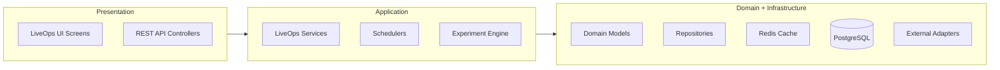

### Layer Responsibilities

| Layer | Unity (Client) | Backend (Server) |
|-------|----------------|------------------|
| **Presentation** | UI screens, popups, HUD badges | REST controllers, webhooks |
| **Application** | Managers orchestrating features | Services, schedulers, experiment engine |
| **Domain** | ScriptableObject definitions, state models | Entities, value objects, business rules |
| **Infrastructure** | Local cache, HTTP client, push handler | Repositories, Redis, Firebase adapters |

### Core Components

| Component | Side | Responsibility |
|-----------|------|----------------|
| **LiveOps Client Manager** | Unity | Bootstrap all LiveOps subsystems; sync on login |
| **LiveOps Service** | Backend | Orchestrate LiveOps API; route to sub-services |
| **Config Service** | Backend | Feature flags, remote config, cache, fetch |
| **Experiment Service** | Backend | A/B test assignment, variant delivery |
| **Event Service** | Backend | Limited event scheduling, participation, rewards |
| **Season Service** | Backend | Season pass lifecycle, XP, tier claims |
| **Economy Service** | Backend | Live economy parameter updates, validation |
| **Leaderboard Service** | Backend | Score submission, ranking, anti-fraud checks |
| **Push Notification Service** | Backend | Schedule, target, dispatch notifications |
| **Sync Service** | Backend | Bidirectional LiveOps state synchronization |
| **Cloud Sync Client** | Unity | Offline queue, conflict resolution, merge |

### Package and Module Map

| Location | Responsibility |
|----------|----------------|
| `framework/liveops/` | Shared interfaces, domain models, client abstractions |
| `framework/analytics/` | Analytics event contracts (consumed by LiveOps) |
| `@genesis/plugin-nestjs` | Backend LiveOps API generators |
| `@genesis/plugin-unity` | Unity LiveOps system and UI generators |
| `@genesis/plugin-firebase` | Firebase Remote Config and FCM adapters |
| `games/{game}/` | Game-specific LiveOps config and content SOs |

### Relationship to Other Systems

| System | LiveOps Uses | LiveOps Provides |
|--------|--------------|------------------|
| Game Generation | Economy, progression foundations | Post-launch extension layer |
| Backend Generator | NestJS module patterns, auth, Redis | LiveOps API endpoints |
| Unity Generator | DI, services, UI patterns | Client managers and screens |
| AI Engine (future) | — | AI-driven event/mission content |
| Cloud Save | Player data sync | LiveOps-specific state sync |

### LiveOps Bootstrap Flow

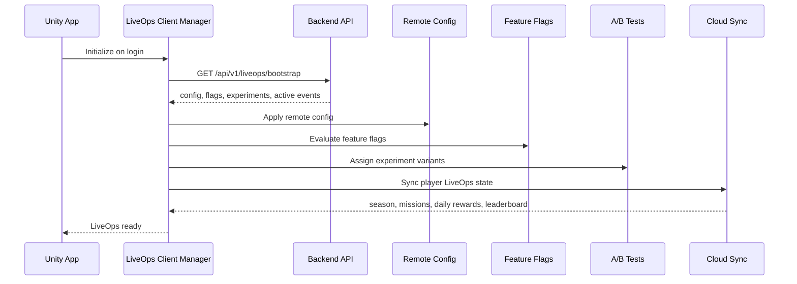

---

## Feature Flags

Feature flags gate LiveOps and gameplay features without app updates.

### Feature Flag Architecture

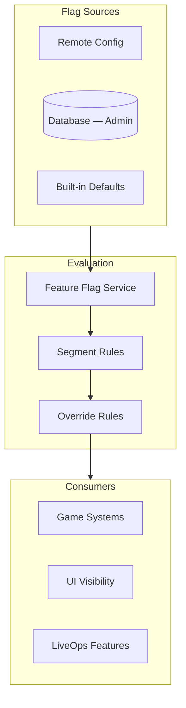

### Flag Definition Schema

| Field | Type | Description |
|-------|------|-------------|
| `id` | string | Unique flag key (e.g., `features.battle_pass.enabled`) |
| `enabled` | boolean | Global on/off |
| `segments` | string[] | Player segments that see enabled state |
| `rolloutPercentage` | number | 0–100 gradual rollout |
| `startDate` | ISO8601 | Optional activation date |
| `endDate` | ISO8601 | Optional deactivation date |
| `dependencies` | string[] | Flags that must be enabled first |
| `metadata` | object | Designer notes, owner |

### Standard Feature Flags

| Flag ID | Default | Description |
|---------|---------|-------------|
| `features.battle_pass.enabled` | false | Season pass UI and logic |
| `features.daily_rewards.enabled` | true | Daily login rewards |
| `features.leaderboards.enabled` | false | Leaderboard screens |
| `features.limited_events.enabled` | true | Timed event system |
| `features.push_notifications.enabled` | true | Push notification registration |
| `features.ab_testing.enabled` | false | Experiment assignment |
| `economy.dynamic_pricing.enabled` | false | Server-driven shop prices |
| `ui.season_screen.enabled` | false | Season screen in main menu |

### Evaluation Rules

| Rule ID | Description |
|---------|-------------|
| FF-001 | Flags evaluated after remote config fetch on login |
| FF-002 | Cached flag state used offline (last known values) |
| FF-003 | Segment rules override global `enabled` for matching players |
| FF-004 | `rolloutPercentage` uses deterministic hash of `playerId` |
| FF-005 | Disabled flags hide UI and skip related API calls |
| FF-006 | Flag changes take effect on next config refresh (not mid-session unless forced) |

### Client API Contract

| Method | Input | Output |
|--------|-------|--------|
| `isEnabled(flagId)` | flag key | boolean |
| `getVariant(flagId)` | flag key | string \| null (for multivariate flags) |
| `refresh()` | — | void (re-fetch and re-evaluate) |

---

## Remote Config

Remote configuration delivers tunable parameters to clients without app store releases.

### Remote Config Architecture

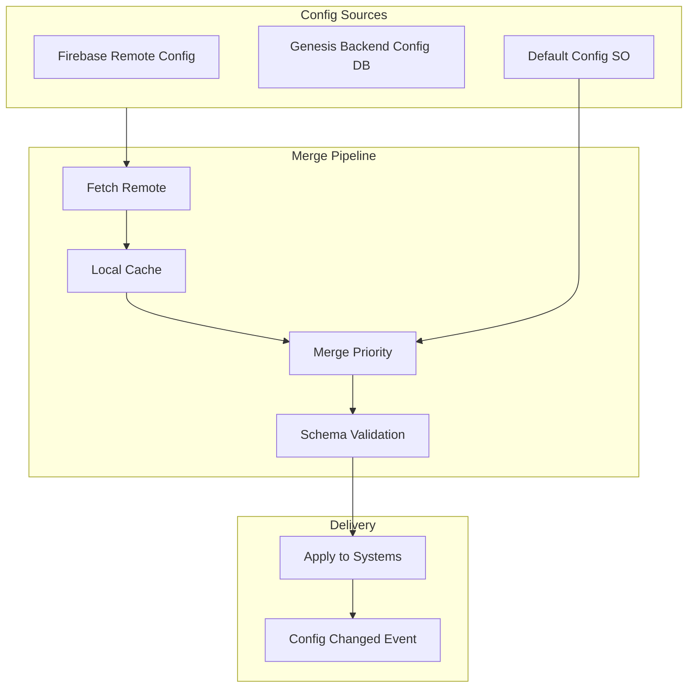

### Config Priority (Highest Wins)

| Priority | Source | Example |
|----------|--------|---------|
| 1 (lowest) | ScriptableObject defaults | `LiveOpsConfig.asset` |
| 2 | Firebase Remote Config | `economy.daily_reward_multiplier` |
| 3 | Genesis backend config | Player-segment overrides |
| 4 (highest) | A/B experiment variant | Variant-specific values |

### Remote Config Key Catalog

| Key | Type | Default | Description |
|-----|------|---------|-------------|
| `season.active` | boolean | false | Current season enabled |
| `season.id` | string | — | Active season identifier |
| `season.end_date` | ISO8601 | — | Season end timestamp |
| `event.double_xp.enabled` | boolean | false | Double XP event active |
| `event.double_xp.end` | ISO8601 | — | Event end time |
| `economy.daily_reward_multiplier` | number | 1.0 | Daily reward scaling |
| `economy.shop_discount_percent` | number | 0 | Global shop discount |
| `economy.energy_regen_minutes` | number | 30 | Energy regeneration rate |
| `retention.daily_reset_hour` | number | 0 | Local hour for daily reset (0–23) |
| `retention.push_quiet_hours_start` | number | 22 | Push quiet hours start |
| `retention.push_quiet_hours_end` | number | 8 | Push quiet hours end |
| `leaderboard.refresh_interval_seconds` | number | 60 | Client poll interval |
| `features.*` | varies | — | Feature flag values |

### Config Schema Validation

| Rule | Error |
|------|-------|
| Unknown keys | Warning logged; ignored |
| Type mismatch | Reject key; use default |
| Out of range | Clamp to min/max; log warning |
| Missing required key | Use default; log info |

### Fetch Schedule

| Trigger | Behavior |
|---------|----------|
| App launch | Full fetch |
| Login | Full fetch + force refresh |
| Periodic | Every 15 minutes (background) |
| Push (silent) | Config update push triggers fetch |
| Manual | Debug menu force refresh |

### Remote Config Rules

| Rule ID | Description |
|---------|-------------|
| RC-001 | Config cached locally with TTL (default 15 minutes) |
| RC-002 | Invalid config never crashes app; defaults used |
| RC-003 | Config change emits `OnConfigUpdated` event for systems |
| RC-004 | Sensitive keys (API secrets) never in remote config |
| RC-005 | Player-specific overrides fetched with authenticated session |

---

## A/B Testing

A/B testing assigns players to experiment variants and measures outcomes via analytics.

### A/B Testing Architecture

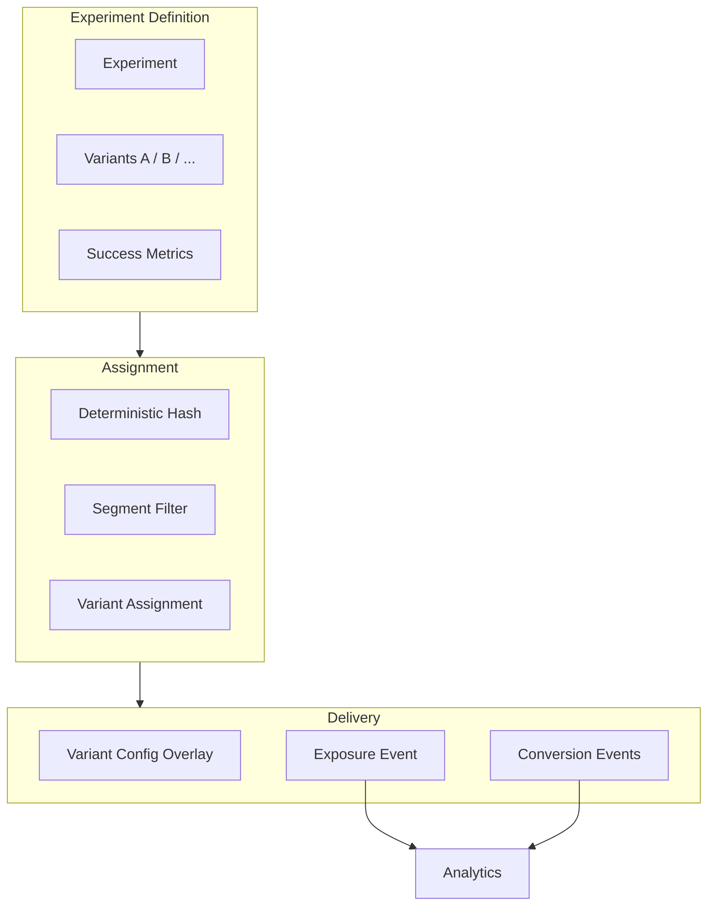

### Experiment Definition Schema

| Field | Type | Description |
|-------|------|-------------|
| `id` | string | Experiment identifier |
| `name` | string | Human-readable name |
| `status` | enum | `draft`, `running`, `paused`, `completed` |
| `variants` | Variant[] | Named variants with weight |
| `segments` | string[] | Eligible player segments |
| `trafficAllocation` | number | % of eligible players (0–100) |
| `startDate` | ISO8601 | Experiment start |
| `endDate` | ISO8601 | Experiment end |
| `primaryMetric` | string | Analytics event for success |
| `configOverrides` | object | Per-variant config key overrides |

### Variant Assignment

| Rule | Description |
|------|-------------|
| Deterministic | Same `playerId` + `experimentId` always yields same variant |
| Sticky | Assignment persists for experiment duration |
| Exclusive | Player in one experiment per layer (configurable) |
| Minimum sample | Experiment not reported until N exposures reached |

### Example Experiments

| Experiment | Variants | Primary Metric | Config Override |
|------------|----------|----------------|-----------------|
| `daily_reward_amount` | A: 100 coins, B: 150 coins | `daily_reward_claimed` | `economy.daily_reward_base` |
| `battle_pass_price` | A: $4.99, B: $2.99 | `iap_completed` | `iap.battle_pass_product_id` |
| `push_timing` | A: 18:00, B: 12:00 | `session_start` (within 1h) | `retention.push_default_hour` |
| `event_duration` | A: 3 days, B: 7 days | `event_participated` | `event.default_duration_days` |

### Analytics Events (A/B)

| Event | Properties |
|-------|------------|
| `experiment_exposure` | `experimentId`, `variantId`, `playerId` |
| `experiment_conversion` | `experimentId`, `variantId`, `metric`, `value` |

### A/B Testing Rules

| Rule ID | Description |
|---------|-------------|
| AB-001 | Exposure logged once per player per experiment |
| AB-002 | Variant config merged over base remote config |
| AB-003 | Completed experiments freeze assignment for analysis |
| AB-004 | Control variant always defined (explicit A) |
| AB-005 | Experiments respect feature flag `features.ab_testing.enabled` |

---

## Events (Limited-Time Events)

Limited-time events drive engagement with scheduled content, modifiers, and exclusive rewards.

### Event System Architecture

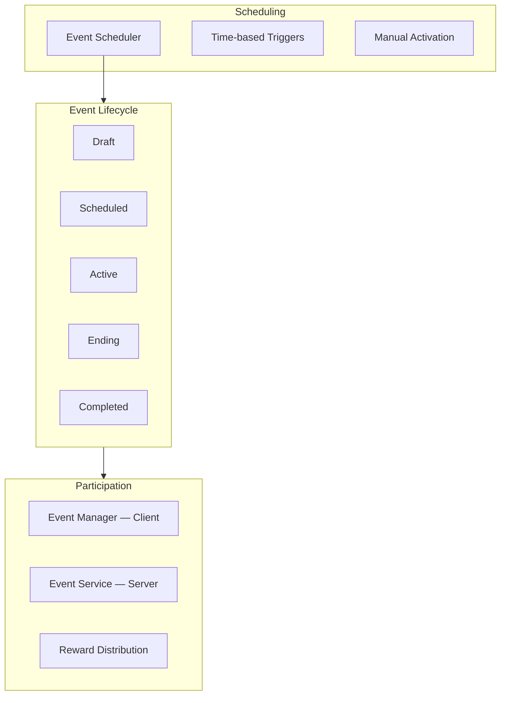

### Event Lifecycle States

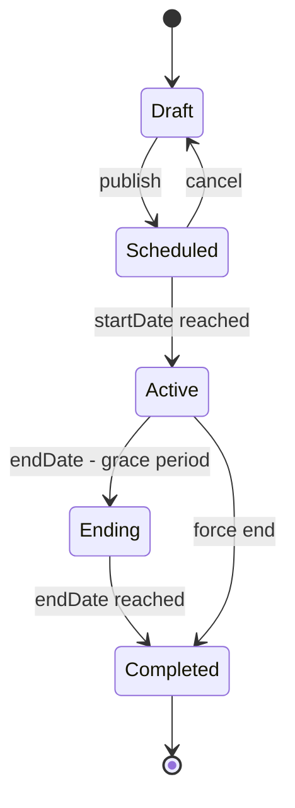

### Event Definition Schema

| Field | Type | Description |
|-------|------|-------------|
| `id` | string | Event identifier |
| `name` | string | Display name |
| `description` | string | Player-facing description |
| `type` | enum | `modifier`, `challenge`, `collection`, `tournament` |
| `startDate` | ISO8601 | Activation time (UTC) |
| `endDate` | ISO8601 | Deactivation time (UTC) |
| `modifiers` | Modifier[] | Gameplay modifiers (2x XP, 50% off) |
| `objectives` | Objective[] | Player goals during event |
| `rewards` | Reward[] | Completion and milestone rewards |
| `assets` | AssetRef[] | Banner, icon Addressable refs |
| `segments` | string[] | Eligible segments (empty = all) |
| `maxParticipants` | number | Optional cap |

### Event Types

| Type | Description | Example |
|------|-------------|---------|
| `modifier` | Passive gameplay boost | Double XP weekend |
| `challenge` | Complete objectives | Win 10 battles |
| `collection` | Collect event tokens | Harvest 500 pumpkins |
| `tournament` | Competitive window | Highest score in 48 hours |

### Event API Endpoints

| Endpoint | Method | Description |
|----------|--------|-------------|
| `/api/v1/liveops/events` | GET | List active and upcoming events |
| `/api/v1/liveops/events/:id` | GET | Event detail and player progress |
| `/api/v1/liveops/events/:id/participate` | POST | Join event |
| `/api/v1/liveops/events/:id/progress` | PUT | Update objective progress |
| `/api/v1/liveops/events/:id/claim` | POST | Claim event reward |

### Event Rules

| Rule ID | Description |
|---------|-------------|
| EV-001 | Server validates all progress and reward claims |
| EV-002 | Events auto-activate/deactivate via scheduler (±30s) |
| EV-003 | Client shows event UI only when `ACTIVE` or `ENDING` |
| EV-004 | Expired events archive; rewards claimable during `ENDING` grace |
| EV-005 | Participation idempotent (join once per player per event) |

---

## Analytics

LiveOps analytics track retention, engagement, and monetization impact of LiveOps features.

### Analytics Architecture

```mermaid
flowchart LR
    subgraph liveops [LiveOps Features]
        SEASON[Season]
        DAILY[Daily Rewards]
        EVENT[Events]
        LB[Leaderboard]
        PUSH[Push]
    end

    subgraph pipeline [Analytics Pipeline]
        EMIT[Event Emitter]
        ENRICH[Property Enrichment]
        BATCH[Batch Queue]
        FLUSH[Flush to Provider]
    end

    subgraph providers [Providers]
        FA[Firebase Analytics]
        UGS[Unity Gaming Services]
        CUSTOM[Custom Backend]
    end

    liveops --> EMIT
    EMIT --> ENRICH
    ENRICH --> BATCH
    BATCH --> FLUSH
    FLUSH --> providers
```

### LiveOps Analytics Event Catalog

| Event | Properties | When |
|-------|------------|------|
| `liveops_bootstrap` | `configVersion`, `flagCount`, `experimentCount` | LiveOps init complete |
| `feature_flag_evaluated` | `flagId`, `enabled`, `variant` | Flag checked (sampled) |
| `config_updated` | `keysChanged[]`, `source` | Remote config refresh |
| `experiment_exposure` | `experimentId`, `variantId` | Player assigned to variant |
| `season_started` | `seasonId`, `playerId` | Season becomes active for player |
| `season_tier_claimed` | `seasonId`, `tier`, `track` | Battle pass tier claimed |
| `season_xp_earned` | `seasonId`, `amount`, `source` | Season XP awarded |
| `daily_reward_claimed` | `day`, `streakCount`, `rewardType`, `amount` | Daily reward collected |
| `daily_streak_broken` | `previousStreak`, `missedDay` | Streak reset |
| `event_participated` | `eventId`, `action`, `result` | Event interaction |
| `event_reward_claimed` | `eventId`, `rewardId` | Event reward collected |
| `leaderboard_submitted` | `boardId`, `score`, `rank` | Score submitted |
| `leaderboard_viewed` | `boardId`, `playerRank` | Leaderboard screen opened |
| `push_received` | `campaignId`, `type` | Notification delivered |
| `push_opened` | `campaignId`, `type` | Notification tapped |
| `economy_live_update` | `key`, `oldValue`, `newValue` | Economy param changed |
| `liveops_sync` | `durationMs`, `conflictCount`, `success` | Cloud sync completed |

### Enrichment Properties (All LiveOps Events)

| Property | Description |
|----------|-------------|
| `playerId` | Anonymous or authenticated player id |
| `sessionId` | Current session |
| `platform` | `ios` or `android` |
| `appVersion` | Client version |
| `liveopsConfigVersion` | Config version hash |
| `playerSegment` | Assigned segment(s) |
| `daysSinceInstall` | Retention cohort helper |

### Analytics Rules

| Rule ID | Description |
|---------|-------------|
| AN-001 | Every claim, complete, and participate action emits an event |
| AN-002 | No PII in analytics properties |
| AN-003 | Failed operations emit `*_failed` events with reason |
| AN-004 | Events batched; flushed on interval and app background |
| AN-005 | A/B exposure logged before variant config applied |

---

## Push Notifications

Push notifications re-engage players with timely, segmented, frequency-capped messages.

### Push Notification Architecture

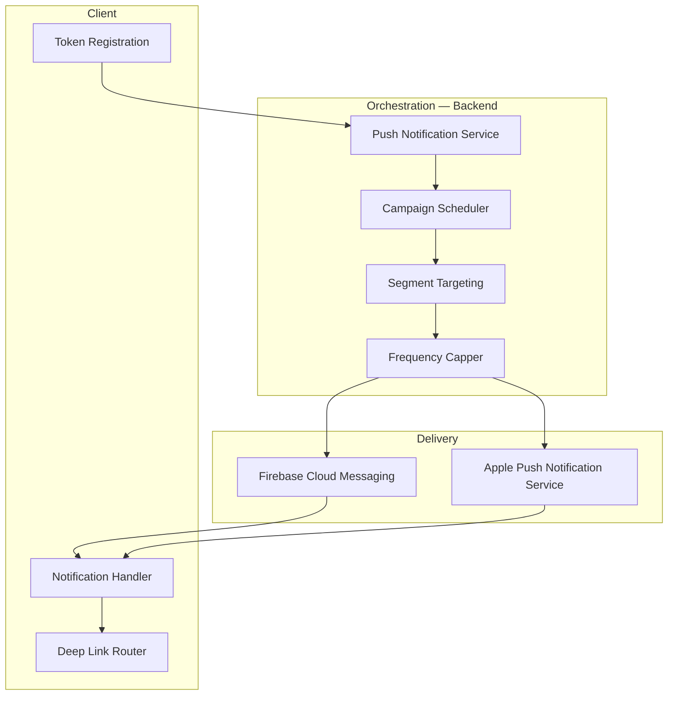

### Notification Campaign Types

| Type | Trigger | Example |
|------|---------|---------|
| `retention` | Inactivity (24h, 72h, 7d) | "Your rewards are waiting!" |
| `event` | Event start / ending soon | "Double XP ends in 2 hours!" |
| `daily` | Daily reset reminder | "New daily missions available" |
| `season` | Season milestone | "You're 1 tier from a legendary reward" |
| `economy` | Special offer | "50% off gems — today only" |
| `social` | Leaderboard change | "You've been overtaken!" |

### Campaign Definition Schema

| Field | Type | Description |
|-------|------|-------------|
| `id` | string | Campaign identifier |
| `type` | enum | Campaign type |
| `title` | string | Notification title (localized) |
| `body` | string | Notification body (localized) |
| `deepLink` | string | In-app destination (`season`, `event/:id`) |
| `segments` | string[] | Target segments |
| `schedule` | Schedule | Cron or event-triggered |
| `frequencyCap` | FrequencyCap | Max per player per period |
| `quietHours` | QuietHours | Respect player local quiet hours |
| `abTestId` | string | Optional linked experiment |

### Frequency Caps

| Cap | Default | Description |
|-----|---------|-------------|
| Per day | 3 | Max notifications per player per day |
| Per campaign | 1 | Max per campaign per player per week |
| Quiet hours | 22:00–08:00 local | No delivery during sleep hours |
| Opt-out | — | Honor system notification permission |

### Client Handling

| Scenario | Behavior |
|----------|----------|
| App foreground | In-app banner or suppress (configurable) |
| App background | System notification |
| Tap notification | Deep link to LiveOps screen |
| Silent push | Trigger config refresh only |

### Push Rules

| Rule ID | Description |
|---------|-------------|
| PN-001 | Player must opt in (system permission) |
| PN-002 | Token registered with backend on login |
| PN-003 | Frequency caps enforced server-side |
| PN-004 | Quiet hours use player timezone from device |
| PN-005 | Campaign analytics: sent, delivered, opened |

---

## Economy Updates

Live economy updates tune currencies, prices, and rewards without client releases.

### Economy Update Architecture

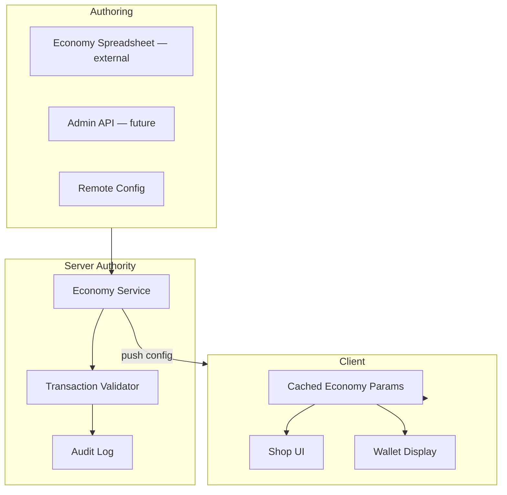

### Live Economy Parameters

| Parameter | Type | Server Authority | Description |
|-----------|------|------------------|-------------|
| `currency.soft.daily_cap` | number | yes | Max soft currency earnable per day |
| `currency.hard.bundle_prices` | map | yes | IAP bundle price tiers |
| `shop.item_prices` | map | yes | Item id → price |
| `shop.discount_percent` | number | yes | Global shop discount |
| `reward.daily_base` | number | yes | Base daily reward amount |
| `reward.streak_multiplier` | number[] | yes | Per-streak-day multipliers |
| `energy.regen_rate_minutes` | number | yes | Energy regeneration interval |
| `energy.max_capacity` | number | yes | Max energy cap |
| `event.reward_multiplier` | number | yes | Active event reward scaling |

### Economy Update Flow

| Step | Action |
|------|--------|
| 1 | Designer updates economy params in admin or remote config |
| 2 | Economy Service validates ranges and dependencies |
| 3 | New params published to config service |
| 4 | Clients fetch on next config refresh |
| 5 | Server uses new params for all transaction validation |
| 6 | `economy_live_update` analytics event emitted |

### Transaction Validation (Server)

| Check | Description |
|-------|-------------|
| Balance sufficient | Player has enough currency |
| Price matches config | Client-submitted price matches server |
| Daily cap not exceeded | Earn limits respected |
| Rate limiting | Anti-farming thresholds |
| Audit trail | All transactions logged |

### Economy Rules

| Rule ID | Description |
|---------|-------------|
| ECON-001 | Server is authoritative for all currency balances |
| ECON-002 | Client displays cached prices; server validates on purchase |
| ECON-003 | Economy param changes never retroactively alter past transactions |
| ECON-004 | Invalid economy config rejected; previous version remains active |
| ECON-005 | Economy updates support gradual rollout via feature flags |

---

## Season Pass

The season pass (battle pass) provides tiered progression with free and premium reward tracks.

### Season Pass Architecture

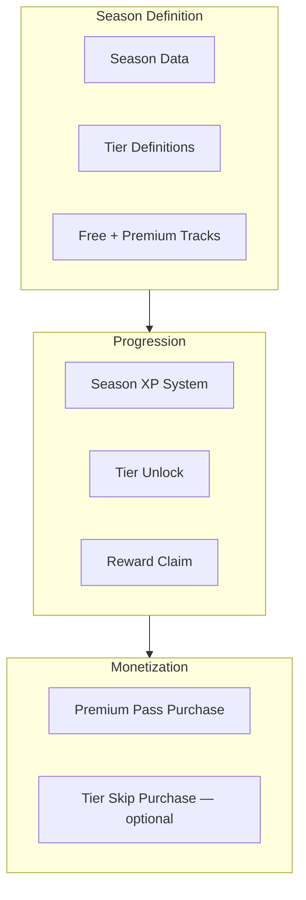

### Season Lifecycle

| State | Description | Player Experience |
|-------|-------------|-------------------|
| `upcoming` | Announced, not started | Teaser UI, countdown |
| `active` | Players earn XP and claim | Full season UI |
| `ending` | Last chance messaging | Urgency banners |
| `completed` | Season over | Rewards archived, summary |

### Season Definition Schema

| Field | Type | Description |
|-------|------|-------------|
| `id` | string | Season identifier |
| `name` | string | Display name (e.g., "Season 3: Ocean Quest") |
| `startDate` | ISO8601 | Season start |
| `endDate` | ISO8601 | Season end |
| `maxTier` | number | Maximum tier (e.g., 50) |
| `xpPerTier` | number | XP required per tier |
| `freeTrack` | TierReward[] | Free rewards per tier |
| `premiumTrack` | TierReward[] | Premium rewards per tier |
| `premiumProductId` | string | IAP product for premium pass |
| `bonusTiers` | TierReward[] | Post-max-tier bonus rewards |

### Season XP Sources

| Source | XP Amount (Configurable) |
|--------|---------------------------|
| Daily mission complete | 100 |
| Weekly mission complete | 500 |
| Event objective | 50–200 |
| Match win | 25 |
| Login (daily) | 10 |
| Premium booster | 2x multiplier |

### Season API Endpoints

| Endpoint | Method | Description |
|----------|--------|-------------|
| `/api/v1/liveops/seasons/current` | GET | Active season and player state |
| `/api/v1/liveops/seasons/:id/claim` | POST | Claim tier reward |
| `/api/v1/liveops/seasons/:id/xp` | POST | Award XP (server-validated) |
| `/api/v1/liveops/seasons/:id/purchase-premium` | POST | Verify premium pass IAP |

### Season Pass Rules

| Rule ID | Description |
|---------|-------------|
| SP-001 | XP and tier progress stored server-side |
| SP-002 | Premium pass verified via IAP receipt validation |
| SP-003 | Unclaimed rewards claimable until 7 days after season end |
| SP-004 | Season reset clears progress; archived rewards in player history |
| SP-005 | Tier skip (if enabled) validated server-side |

---

## Daily Rewards

Daily rewards incentivize login streaks with escalating rewards.

### Daily Rewards Architecture

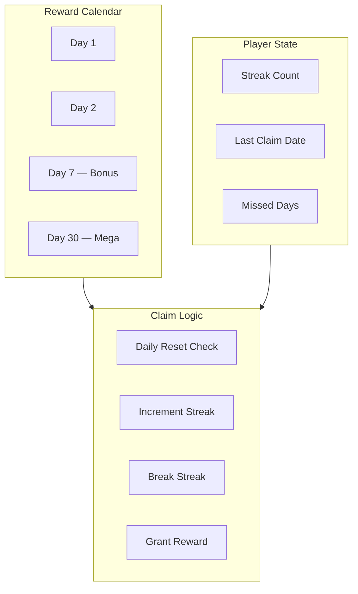

### Daily Reward Calendar Schema

| Field | Type | Description |
|-------|------|-------------|
| `day` | number | Calendar day (1–28+ repeating) |
| `rewards` | Reward[] | Rewards for this day |
| `isMilestone` | boolean | Special UI treatment |
| `streakRequired` | number | Minimum streak to unlock (optional) |

### Streak Rules

| Rule | Behavior |
|------|----------|
| Claim within 24h of reset | Streak increments |
| Miss one day | Streak resets to 1 (configurable grace: 1 miss) |
| Same day re-claim | Idempotent; no double reward |
| Reset hour | Configurable via `retention.daily_reset_hour` |
| Timezone | Player local time |

### Daily Rewards API

| Endpoint | Method | Description |
|----------|--------|-------------|
| `/api/v1/liveops/daily-rewards` | GET | Calendar and player claim state |
| `/api/v1/liveops/daily-rewards/claim` | POST | Claim today's reward |

### Daily Rewards Rules

| Rule ID | Description |
|---------|-------------|
| DR-001 | One claim per calendar day per player |
| DR-002 | Reward granted server-side; client displays animation |
| DR-003 | Streak count server-authoritative |
| DR-004 | Milestone days (7, 14, 30) have enhanced rewards |
| DR-005 | `daily_reward_claimed` analytics on every claim |

---

## Leaderboards

Leaderboards provide competitive rankings across global, friends, and event-scoped boards.

### Leaderboard Architecture

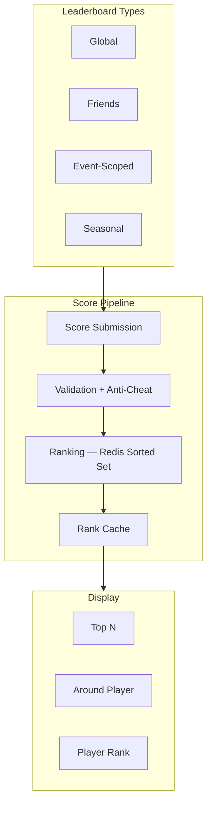

### Leaderboard Definition Schema

| Field | Type | Description |
|-------|------|-------------|
| `id` | string | Board identifier |
| `name` | string | Display name |
| `type` | enum | `global`, `friends`, `event`, `seasonal` |
| `sortOrder` | enum | `desc`, `asc` |
| `scoreType` | enum | `integer`, `time`, `float` |
| `resetSchedule` | cron | Optional periodic reset |
| `maxEntries` | number | Max ranked players (default 10000) |
| `eventId` | string | Link to event (if event-scoped) |
| `seasonId` | string | Link to season (if seasonal) |

### Leaderboard API Endpoints

| Endpoint | Method | Description |
|----------|--------|-------------|
| `/api/v1/liveops/leaderboards` | GET | List active boards |
| `/api/v1/liveops/leaderboards/:id` | GET | Top N + player rank |
| `/api/v1/liveops/leaderboards/:id/submit` | POST | Submit score |
| `/api/v1/liveops/leaderboards/:id/around` | GET | Ranks around player |

### Anti-Cheat Checks

| Check | Description |
|-------|-------------|
| Score bounds | Max plausible score per game mode |
| Rate limit | Max submissions per minute |
| Monotonicity | Time scores must improve (lower is better) |
| Server replay | Optional server-side score validation (game-specific) |
| Anomaly detection | Flag statistical outliers for review |

### Leaderboard Rules

| Rule ID | Description |
|---------|-------------|
| LB-001 | Rankings stored in Redis sorted sets for performance |
| LB-002 | Score submission validated server-side |
| LB-003 | Player sees own rank even if outside top N |
| LB-004 | Board reset clears rankings; archives top 100 |
| LB-005 | Friends board requires social graph (future integration) |

---

## Cloud Synchronization

Cloud synchronization keeps LiveOps player state consistent across devices and sessions.

### Cloud Sync Architecture

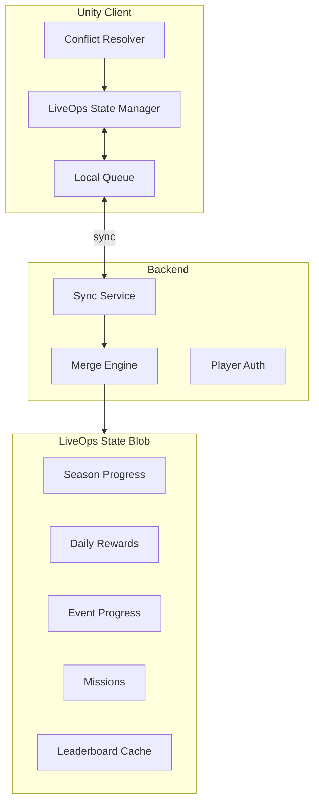

### Synced State Categories

| Category | Authority | Conflict Strategy | Sync Priority |
|----------|-----------|-------------------|---------------|
| Season XP / tiers | Server | Server wins | Critical |
| Daily reward streak | Server | Server wins | Critical |
| Event progress | Server | Server wins | High |
| Mission progress | Server | Merge (max progress) | High |
| Leaderboard rank | Server | Server wins | Medium |
| Cached config | Server | Server wins | Low |
| UI preferences | Client | Client wins | Low |

### Sync Protocol

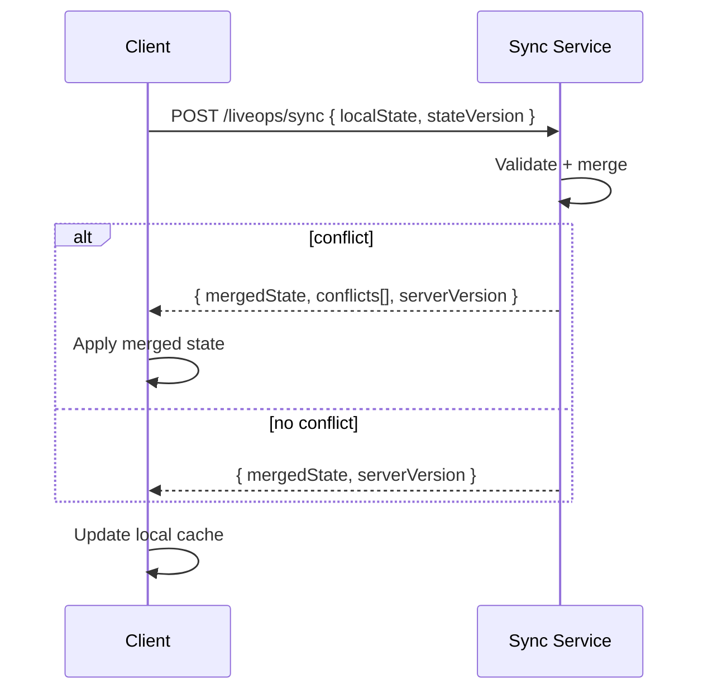

### Sync Triggers

| Trigger | Direction | Priority |
|---------|-----------|----------|
| Login | Pull + push | Immediate |
| Claim reward | Push | Immediate |
| Complete mission | Push | Immediate |
| App background | Push queue flush | Best effort |
| Periodic | Pull | Every 5 minutes (configurable) |
| Push (silent) | Pull | On server request |

### Offline Behavior

| Scenario | Behavior |
|----------|----------|
| Offline claim attempt | Queue locally; sync on reconnect |
| Conflict on sync | Server wins for critical; merge for progress |
| Stale cache > 24h | Warn player; force refresh |
| Sync failure | Retry with exponential backoff (max 3) |

### Cloud Sync Rules

| Rule ID | Description |
|---------|-------------|
| SYNC-001 | All critical state changes go through server API |
| SYNC-002 | Local queue persisted to disk (survives app kill) |
| SYNC-003 | `stateVersion` optimistic locking prevents lost updates |
| SYNC-004 | Sync completes within 2 seconds on good network |
| SYNC-005 | `liveops_sync` analytics on every sync with conflict count |

---

## Data Model Overview

### Core Entities (Backend)

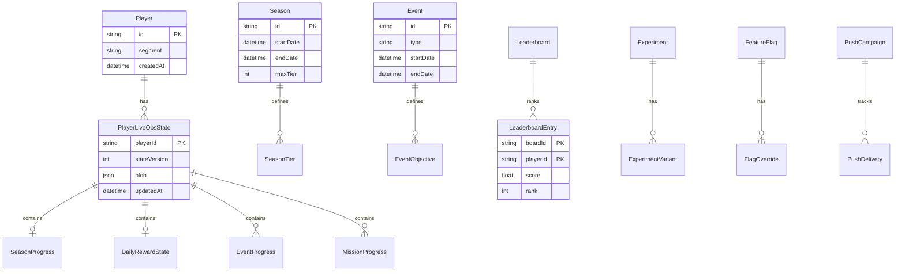

### ScriptableObjects (Unity Client)

| ScriptableObject | Purpose |
|------------------|---------|
| `LiveOpsConfig` | Master LiveOps settings |
| `SeasonData` | Season definition (mirrors server) |
| `EventData` | Event definition |
| `DailyRewardCalendar` | Reward calendar template |
| `LeaderboardConfig` | Board display settings |
| `PushNotificationConfig` | Deep link mappings |

---

## Generation and Scaffolding

LiveOps modules are added to existing game projects via generation.

### Generation Command

```
genesis generate liveops [options]
```

| Flag | Type | Default | Description |
|------|------|---------|-------------|
| `--features` | string | `all` | Comma-separated feature list |
| `--backend` | boolean | true | Generate backend LiveOps module |
| `--unity` | boolean | true | Generate Unity LiveOps systems + UI |
| `--firebase` | boolean | true | Include Firebase adapters |

### Generated Artifacts

| Artifact | Location | Description |
|----------|----------|-------------|
| Backend LiveOps module | `backend/src/modules/liveops/` | Services, controllers, entities |
| Unity LiveOps systems | `unity/.../Scripts/Services/LiveOps/` | Client managers |
| Unity LiveOps UI | `unity/.../Prefabs/UI/LiveOps/` | Season, daily, event screens |
| Framework interfaces | `framework/liveops/` | Shared contracts |
| Database migrations | `backend/migrations/` | LiveOps tables |
| Config templates | `docs/LIVEOPS.md` | Operations guide |

### Feature Selection

| Feature Flag | `--features` Value |
|--------------|-------------------|
| All | `all` |
| Remote config + flags | `config` |
| A/B testing | `experiments` |
| Limited events | `events` |
| Season pass | `season` |
| Daily rewards | `daily` |
| Leaderboards | `leaderboards` |
| Push notifications | `push` |
| Economy updates | `economy` |
| Cloud sync | `sync` |

---

## API Surface Summary

### Bootstrap Endpoint

`GET /api/v1/liveops/bootstrap`

Returns single payload for client initialization:

| Section | Contents |
|---------|----------|
| `config` | Merged remote config key-value map |
| `featureFlags` | Evaluated flags for player |
| `experiments` | Assigned variants |
| `activeEvents` | Current and upcoming events |
| `season` | Current season definition + player progress |
| `dailyRewards` | Calendar + player streak state |
| `leaderboards` | Active board summaries |
| `syncVersion` | State version for sync |

### REST API Prefix

All LiveOps endpoints: `/api/v1/liveops/*`

Authentication: JWT required (except public config keys).

---

## Validation

| Rule ID | Scope | Severity | Description |
|---------|-------|----------|-------------|
| `LO-001` | architecture | error | LiveOps code in `framework/liveops/`, not game scripts |
| `LO-002` | sync | error | Critical state changes go through server API |
| `LO-003` | economy | error | No client-authoritative currency changes |
| `LO-004` | analytics | warning | LiveOps actions emit analytics events |
| `LO-005` | config | error | No secrets in remote config |
| `LO-006` | push | warning | Frequency caps configured |
| `LO-007` | season | error | Season progress stored server-side |
| `LO-008` | leaderboard | error | Score submission validated |
| `LO-009` | offline | warning | Local queue for offline operations |
| `LO-010` | flags | warning | Feature flags gate optional UI |

---

## Examples

### Example 1 — Full LiveOps Scaffold

**Command:**
```bash
genesis generate liveops --features all --firebase true
```

**Generated:** Backend module (12 endpoints), Unity systems (8 managers), UI prefabs (5 screens), framework interfaces, migrations, `docs/LIVEOPS.md`

### Example 2 — Double XP Weekend Event

**Remote config:**
```yaml
event.double_xp.enabled: true
event.double_xp.end: "2026-08-18T23:59:59Z"
event.double_xp.multiplier: 2.0
```

**Flow:** Scheduler activates event → clients fetch config → `EventManager` applies modifier → analytics `event_participated` → push at 2h before end

### Example 3 — Season Pass Launch

**Season:** "Season 1: Founder's Pass", 30 tiers, free + premium tracks, premium IAP $4.99

**Player journey:** Login → bootstrap includes season → earn XP from missions → claim tier 5 free reward → purchase premium → claim tier 5 premium reward → analytics `season_tier_claimed`

### Example 4 — A/B Test Daily Reward Amount

**Experiment:** `daily_reward_amount`, variants A (100) / B (150), metric `daily_reward_claimed`

**Assignment:** Player hash → variant B → config overlay `reward.daily_base: 150` → exposure logged → D7 retention compared

### Example 5 — Leaderboard Tournament

**Event-linked board:** 48-hour tournament, highest score wins, top 100 archived

**Flow:** Submit score → server validates → Redis rank update → client polls `/leaderboards/tournament_aug/around` → event end → rewards mailed to top ranks

---

## Related Documents

| Document | Relationship |
|----------|-------------|
| [README.md](README.md) | Parent specification overview |
| [006-game-generation/FUNCTIONAL_SPEC.md](../006-game-generation/FUNCTIONAL_SPEC.md) | Game project foundations |
| [007-backend/FUNCTIONAL_SPEC.md](../007-backend/FUNCTIONAL_SPEC.md) | Backend API patterns |
| [008-unity/FUNCTIONAL_SPEC.md](../008-unity/FUNCTIONAL_SPEC.md) | Unity client patterns |
| [005-ai-engine/FUNCTIONAL_SPEC.md](../005-ai-engine/FUNCTIONAL_SPEC.md) | Future AI-driven content |
| [framework/liveops/](../../framework/liveops/) | Shared runtime modules |
| [knowledge/liveops/](../../knowledge/liveops/) | LiveOps reference |
| [knowledge/game-design/retention.md](../../knowledge/game-design/retention.md) | Retention strategies |

## Changelog

| Version | Date | Change |
|---------|------|--------|
| 1.0.0 | 2026-07-26 | Initial functional specification |
