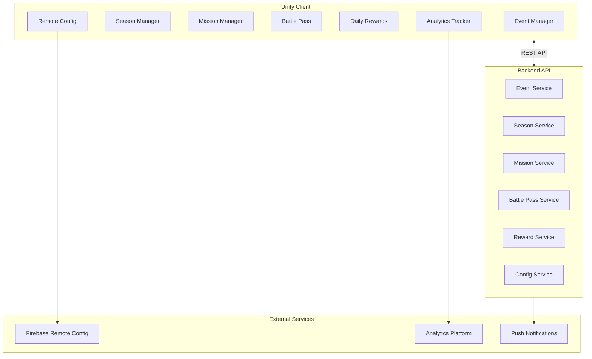

# LiveOps Specification

## Purpose

Define the Live Operations capabilities for games built with Project Genesis, including event systems, seasonal content, missions, battle passes, player retention mechanics, and analytics integration. LiveOps extends generated game projects with systems required to operate a live mobile game.

## Documents

| Document | Description |
|----------|-------------|
| [FUNCTIONAL_SPEC.md](FUNCTIONAL_SPEC.md) | **Complete functional specification** — feature flags, remote config, A/B testing, events, analytics, push, economy, season pass, daily rewards, leaderboards, cloud sync |
| This document | Overview, responsibilities, and implementation roadmap |

## Scope

### In Scope

- LiveOps framework modules in `framework/liveops/`
- Event scheduling and management system
- Season and battle pass scaffolding
- Mission and quest system generation
- Player retention mechanics (daily rewards, streaks, push notifications)
- Analytics event tracking integration
- Remote configuration system
- A/B testing scaffolding
- LiveOps API endpoints (backend) and UI (Unity)

### Out of Scope

- Game economy balancing (designer responsibility)
- Push notification delivery infrastructure (uses Firebase/APNs)
- Analytics dashboard UI (uses external tools)
- Anti-cheat systems (separate security concern)
- Customer support tools
- App store management

## Goals

| Goal | Success Criteria |
|------|------------------|
| **Retention-focused** | Generated LiveOps systems target D1, D7, D30 retention |
| **Configurable** | Events, seasons, and missions driven by remote config |
| **Data-driven** | All LiveOps content defined in ScriptableObjects and database |
| **Analytics-ready** | Every player action emits structured analytics events |
| **Backend-synced** | Unity client and backend share LiveOps state |
| **Extensible** | New event types added without modifying core systems |

## Responsibilities

### System Architecture

### Framework Modules

LiveOps code lives in `framework/liveops/` and is consumed by games in `games/`:

| Module | Responsibility |
|--------|----------------|
| `EventSystem` | Schedule, activate, and deactivate timed events |
| `SeasonManager` | Season lifecycle, progression, and rewards |
| `MissionSystem` | Daily/weekly missions with objectives and rewards |
| `BattlePass` | Tiered progression with free and premium tracks |
| `DailyRewards` | Login streak rewards and calendar |
| `RemoteConfig` | Server-driven configuration with local cache |
| `AnalyticsTracker` | Structured event emission to analytics platform |
| `ABTesting` | Experiment assignment and variant delivery |

### Event System

| Component | Layer | Responsibility |
|-----------|-------|----------------|
| `EventDefinition` | Domain | Event metadata (name, duration, rewards, rules) |
| `EventScheduler` | Application | Activate/deactivate events based on schedule |
| `EventRepository` | Infrastructure | Persist event state (backend database) |
| `EventController` | Presentation | REST API for event management |
| `EventManager` | Unity | Client-side event state and UI |

Events are configured via ScriptableObjects (Unity) and database records (backend), synchronized on login.

### Season System

| Feature | Description |
|---------|-------------|
| Season lifecycle | Start → Active → Ending → Completed |
| Season pass | Free and premium reward tracks |
| Season XP | Earned through gameplay, missions, and events |
| Season shop | Limited-time items available during season |
| Season reset | Progress resets, rewards archived |

### Mission System

| Mission Type | Reset | Example |
|-------------|-------|---------|
| Daily | 24 hours | "Win 3 battles" |
| Weekly | 7 days | "Collect 1000 gold" |
| Seasonal | Season end | "Reach level 50" |
| Achievement | Permanent | "Win 100 battles total" |

Missions follow the template in `templates/game-design/quest.md`.

### Analytics Integration

Every LiveOps action emits analytics events per `knowledge/analytics/events.md`:

| Event | Properties |
|-------|-----------|
| `season_started` | `seasonId`, `playerId`, `timestamp` |
| `mission_completed` | `missionId`, `missionType`, `rewardType`, `rewardAmount` |
| `battle_pass_tier` | `tier`, `track` (free/premium), `seasonId` |
| `daily_reward_claimed` | `day`, `streakCount`, `rewardType` |
| `event_participated` | `eventId`, `action`, `result` |

### Remote Configuration

| Config Key | Type | Example |
|------------|------|---------|
| `season.active` | `boolean` | `true` |
| `event.double_xp.end` | `ISO8601` | `2026-08-15T00:00:00Z` |
| `economy.daily_reward_multiplier` | `number` | `1.5` |
| `features.battle_pass.enabled` | `boolean` | `true` |

Remote config is fetched on app launch and cached locally. Changes propagate without app update.

### Backend API Endpoints

LiveOps backend endpoints extend the generated NestJS backend:

| Endpoint | Method | Description |
|----------|--------|-------------|
| `/api/v1/events` | GET | List active events |
| `/api/v1/events/:id/participate` | POST | Record event participation |
| `/api/v1/seasons/current` | GET | Current season state |
| `/api/v1/seasons/:id/claim` | POST | Claim season reward |
| `/api/v1/missions` | GET | Player's active missions |
| `/api/v1/missions/:id/complete` | POST | Complete a mission |
| `/api/v1/battle-pass` | GET | Battle pass state |
| `/api/v1/battle-pass/claim` | POST | Claim battle pass tier |
| `/api/v1/config` | GET | Remote configuration |

### Unity UI Scaffolds

Generated Unity UI for LiveOps:

| Screen | Components |
|--------|-----------|
| Season screen | Progress bar, reward track, claim button |
| Missions screen | Mission list, progress indicators, claim buttons |
| Battle pass screen | Tier list, free/premium tracks, purchase button |
| Daily rewards screen | Calendar grid, streak counter, claim animation |
| Event popup | Event banner, timer, participate button |

## Dependencies

### Upstream Specifications

| Spec | Dependency |
|------|------------|
| [000-project](../000-project/) | Architecture principles |
| [006-game-generation](../006-game-generation/) | Game project must exist |
| [007-backend](../007-backend/) | Backend API for LiveOps state |
| [008-unity](../008-unity/) | Unity client for LiveOps UI |
| [003-plugin-system](../003-plugin-system/) | Plugin generators for LiveOps modules |

### Packages and Framework

| Location | Responsibility |
|----------|---------------|
| `framework/liveops/` | Shared LiveOps runtime code |
| `framework/analytics/` | Analytics tracking utilities |
| `@genesis/plugin-nestjs` | Backend LiveOps endpoints |
| `@genesis/plugin-unity` | Unity LiveOps systems and UI |
| `@genesis/plugin-firebase` | Remote config and push notifications |

## Future Implementation

### Post-MVP — Framework Foundation

- Create `framework/liveops/` with core interfaces
- Implement `EventSystem` domain model
- Implement `MissionSystem` domain model
- Unit tests for domain logic

### Post-MVP — Backend

- LiveOps API endpoints in NestJS plugin
- Database schema for events, seasons, missions
- Remote config service with Firebase integration
- Integration tests for API endpoints

### Post-MVP — Unity Client

- `EventManager`, `MissionManager`, `SeasonManager` Unity systems
- ScriptableObject definitions for event and mission data
- UI scaffolds for season, missions, battle pass screens
- Analytics event emission

### Post-MVP — Generation

- `genesis generate liveops` command
- LiveOps module added to game templates
- LiveOps phase in [006-game-generation](../006-game-generation/) (optional add-on)

### Future — Advanced

- A/B testing framework with experiment assignment
- Push notification scheduling and targeting
- LiveOps admin dashboard (web UI)
- AI-driven event and mission content via [005-ai-engine](../005-ai-engine/)
- Player segmentation and personalized offers

## Related Documents

- [FUNCTIONAL_SPEC.md](FUNCTIONAL_SPEC.md) — Complete functional specification
- [006-game-generation](../006-game-generation/) — Game project generation
- [007-backend](../007-backend/) — Backend API
- [008-unity](../008-unity/) — Unity client
- [knowledge/liveops/](../../knowledge/liveops/) — LiveOps reference
- [knowledge/game-design/retention.md](../../knowledge/game-design/retention.md) — Retention strategies
- [framework/liveops/README.md](../../framework/liveops/README.md) — Framework module

## Changelog

| Version | Date | Change |
|---------|------|--------|
| 1.0.1 | 2026-07-26 | Linked FUNCTIONAL_SPEC.md |
| 1.0.0 | 2026-07-26 | Initial approved specification |
