# Genesis Kernel Architecture

## Purpose

Define the **Genesis Kernel** — the runtime heart of Project Genesis. The kernel is the single orchestration point that boots the framework, wires services together, loads plugins, exposes registries, manages lifecycle hooks and events, and shuts down gracefully.

The kernel lives in `@genesis/core` and implements [ADR-002: Plugin-Based Architecture](../../DECISION_LOG.md#adr-002-plugin-based-architecture). It is technology-agnostic: no imports from Unity, NestJS, OpenAI, or any plugin package.

## Scope

### In Scope

- Kernel boot process and initialization sequence
- Service container and dependency injection
- Command, plugin, and capability registries
- Configuration loading integration
- Event bus and lifecycle hooks
- Logging infrastructure
- Shutdown sequence
- Failure recovery and error handling
- Future distributed execution model

### Out of Scope

- CLI presentation layer ([001-cli](../001-cli/))
- Individual plugin implementations ([003-plugin-system](../003-plugin-system/))
- Configuration schema ([CONFIGURATION.md](../001-cli/CONFIGURATION.md))
- Implementation code

## Design Principles

| # | Principle | Rationale |
|---|-----------|-----------|
| K1 | **Kernel owns the contract** | Plugins implement `GenesisPlugin`; kernel never adapts to plugin internals |
| K2 | **Fail closed on security** | Permission violations block immediately |
| K3 | **Fail open on plugins** | One bad plugin must not prevent kernel or other plugins from loading |
| K4 | **Single process, single kernel** | One kernel instance per CLI process (v1) |
| K5 | **Events notify, hooks intercept** | Events are observability; hooks can cancel operations |
| K6 | **No plugin-to-plugin coupling** | Plugins interact only through kernel registries |
| K7 | **Deterministic lifecycle** | Boot and shutdown follow fixed, documented sequences |
| K8 | **Testable in isolation** | Every kernel component mockable via DI overrides |

---

## Kernel Overview

### Position in the Architecture

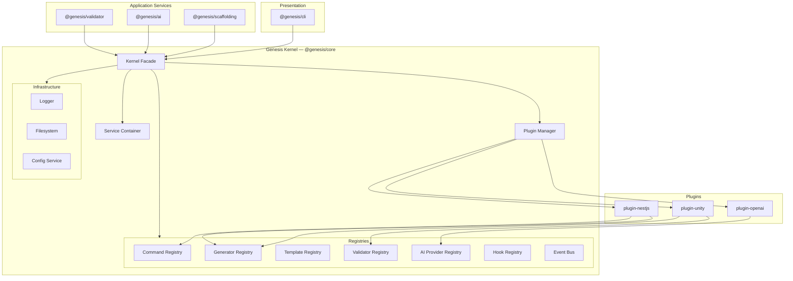

### Kernel Components

| Component | Layer | Responsibility |
|-----------|-------|----------------|
| **Kernel** | Application | Public facade; lifecycle orchestration |
| **Service Container** | Application | Dependency injection and service resolution |
| **Plugin Manager** | Application | Discover, load, unload, list plugins |
| **Plugin Lifecycle Runner** | Application | Ordered lifecycle transitions |
| **Command Registry** | Domain | Store and resolve CLI commands |
| **Generator Registry** | Domain | Store and resolve scaffolding generators |
| **Template Registry** | Domain | Store template descriptors (delegates render to template-engine) |
| **Validator Registry** | Domain | Store validation rules |
| **AI Provider Registry** | Domain | Store LLM provider adapters |
| **Hook Registry** | Domain | Register and execute lifecycle hooks |
| **Event Bus** | Domain | Publish/subscribe lifecycle events |
| **Dependency Resolver** | Domain | Compute plugin load order |
| **Compatibility Validator** | Domain | Manifest and version validation |
| **Permission Engine** | Domain | Enforce plugin permissions |
| **Sandbox Policy** | Domain | Filesystem and network isolation |
| **Config Service** | Infrastructure | Wraps `@genesis/config` loader |
| **Logger** | Infrastructure | Structured logging |
| **Filesystem** | Infrastructure | Sandboxed I/O |

### Kernel State Machine

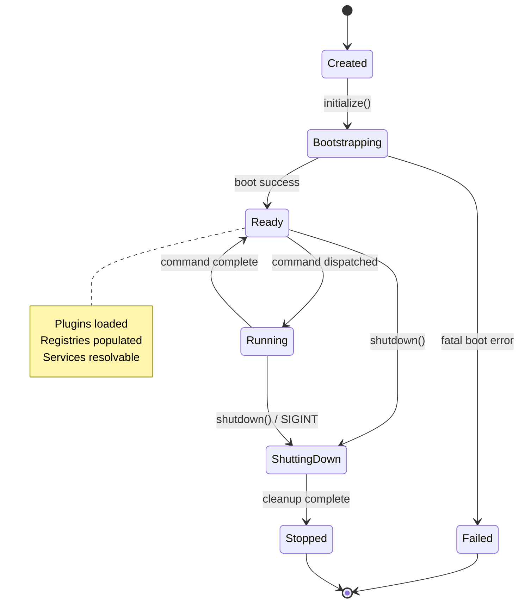

| State | Description | Operations Allowed |
|-------|-------------|-------------------|
| `created` | Kernel constructed, not initialized | None |
| `bootstrapping` | Boot sequence in progress | None |
| `ready` | Fully initialized | All operations |
| `running` | Command or long operation in progress | Read registries; no unload |
| `shutting-down` | Teardown in progress | Shutdown hooks only |
| `stopped` | Process exit imminent | None |
| `failed` | Fatal boot error | None (process exits) |

---

## Boot Process

The kernel boot sequence runs once per process, triggered by `Kernel.initialize(options)` from the CLI entry point.

### Boot Phases

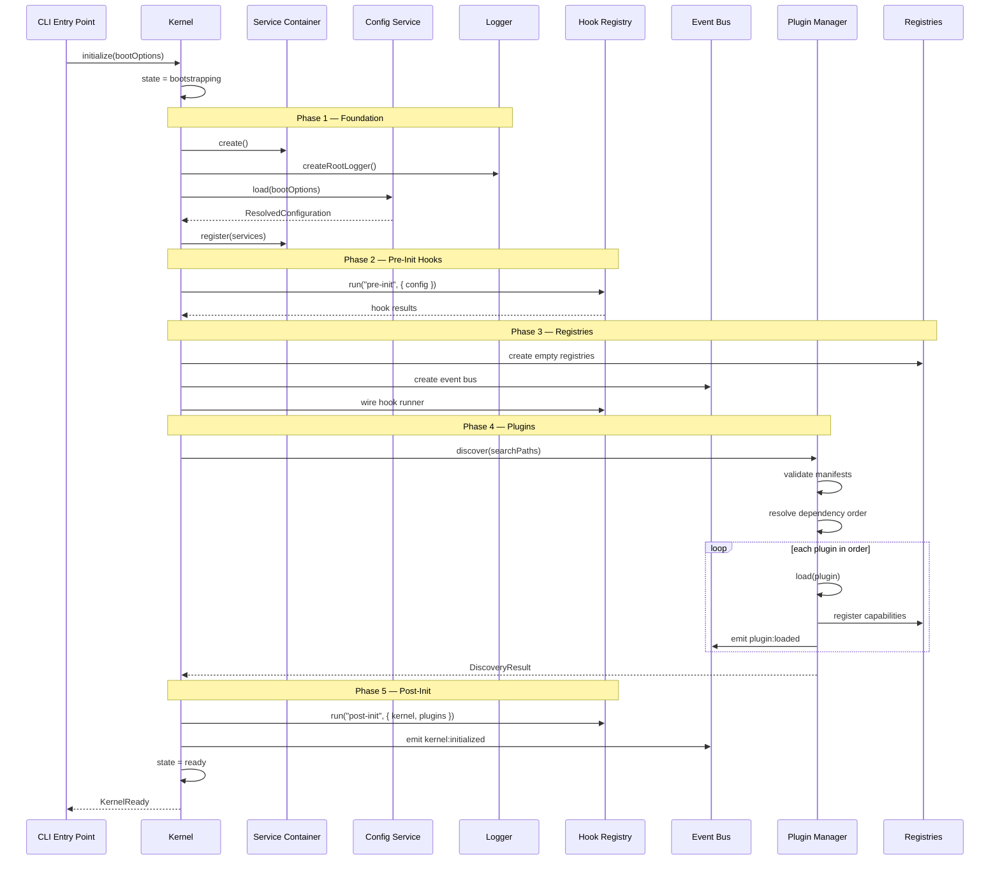

### Boot Phase Detail

| Phase | ID | Duration Target | Failure Behavior |
|-------|----|-----------------|------------------|
| 1 — Foundation | `boot:foundation` | < 50ms | Fatal — exit 1 |
| 2 — Pre-init hooks | `boot:pre-init` | < 100ms | Log warning; continue |
| 3 — Registries | `boot:registries` | < 10ms | Fatal — exit 1 |
| 4 — Plugin discovery | `boot:discover` | < 200ms | Warn per plugin; continue |
| 5 — Plugin load | `boot:load` | < 500ms total | Warn per plugin; continue |
| 6 — Post-init hooks | `boot:post-init` | < 100ms | Log warning; continue |
| **Total cold start** | | **< 500ms** (no plugins) | |
| **Total with plugins** | | **< 1500ms** | |

### Boot Options

```typescript
interface KernelBootOptions {
  /** Resolved or loadable configuration */
  config?: ResolvedConfiguration;
  configPath?: string;
  cwd: string;
  mode?: 'development' | 'staging' | 'production' | 'test';
  pluginSearchPaths?: string[];
  logLevel?: LogLevel;
  skipPlugins?: boolean;          // Testing: boot without plugins
  skipPluginIds?: string[];       // Skip specific plugins
  serviceOverrides?: ServiceOverrides;  // Testing: mock services
}
```

### Boot Failure Modes

| Failure | Phase | Behavior |
|---------|-------|----------|
| Config parse error | Foundation | Fatal — `CONFIG_PARSE_ERROR`, exit 1 |
| Config validation error | Foundation | Fatal — `CONFIG_VALIDATION_ERROR`, exit 1 |
| Service registration error | Foundation | Fatal — exit 1 |
| Circular plugin dependency | Plugin load | Fatal for affected group; others continue |
| All plugins failed | Plugin load | Warn; kernel ready with built-in capabilities only |
| Built-in registry init failed | Registries | Fatal — exit 1 |

### Lazy Boot (Future)

For `genesis --version` and `genesis --help`, the CLI may use **minimal boot** — skip plugin discovery and load only core services. Kernel supports `initialize({ minimal: true })`.

---

## Service Container

The service container is the dependency injection backbone. All kernel and application services are registered and resolved through it.

### Architecture

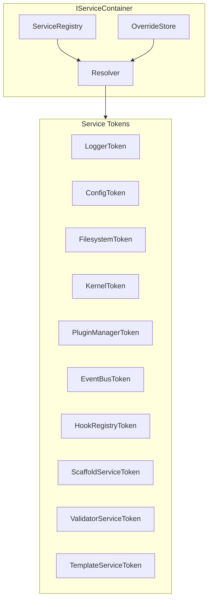

### Service Scopes

| Scope | Lifetime | Created | Destroyed |
|-------|----------|---------|-----------|
| **Singleton** | One per process | During boot Phase 1 | During shutdown |
| **Transient** | One per resolution | Each `resolve()` call | After use (GC) |
| **Scoped** | One per operation | Command/operation start | Command/operation end |

### Registered Services (Default)

| Token | Interface | Scope | Provider Package | Phase |
|-------|-----------|-------|------------------|-------|
| `LoggerToken` | `ILogger` | Singleton | `@genesis/core` | Boot |
| `ConfigToken` | `IConfiguration` | Singleton | `@genesis/core` | Boot |
| `FilesystemToken` | `IFilesystem` | Singleton | `@genesis/core` | Boot |
| `ProcessToken` | `IProcess` | Singleton | `@genesis/core` | Boot |
| `ClockToken` | `IClock` | Singleton | `@genesis/core` | Boot |
| `KernelToken` | `IKernel` | Singleton | `@genesis/core` | Boot |
| `PluginManagerToken` | `IPluginManager` | Singleton | `@genesis/core` | Boot |
| `EventBusToken` | `IEventBus` | Singleton | `@genesis/core` | Boot |
| `HookRegistryToken` | `IHookRegistry` | Singleton | `@genesis/core` | Boot |
| `CommandRegistryToken` | `ICommandRegistry` | Singleton | `@genesis/core` | Boot |
| `GeneratorRegistryToken` | `IGeneratorRegistry` | Singleton | `@genesis/core` | Boot |
| `TemplateRegistryToken` | `ITemplateRegistry` | Singleton | `@genesis/core` | Boot |
| `ValidatorRegistryToken` | `IValidatorRegistry` | Singleton | `@genesis/core` | Boot |
| `AIProviderRegistryToken` | `IAIProviderRegistry` | Singleton | `@genesis/core` | Boot |
| `TemplateServiceToken` | `ITemplateService` | Singleton | `@genesis/template-engine` | Boot |
| `ScaffoldServiceToken` | `IScaffoldService` | Singleton | `@genesis/scaffolding` | Boot |
| `ValidatorServiceToken` | `IValidatorService` | Singleton | `@genesis/validator` | Boot |
| `AIServiceToken` | `IAIService` | Singleton | `@genesis/ai` | Boot (Phase 4) |
| `CommandContextToken` | `ICommandContext` | Scoped | `@genesis/cli` | Per command |
| `OutputWriterToken` | `IOutputWriter` | Transient | `@genesis/cli` | Per command |

### Container API

```typescript
interface IServiceContainer {
  /** Register a service factory */
  register<T>(token: ServiceToken<T>, factory: Factory<T>, scope?: ServiceScope): void;

  /** Register a pre-built instance (singleton) */
  registerInstance<T>(token: ServiceToken<T>, instance: T): void;

  /** Resolve a service by token */
  resolve<T>(token: ServiceToken<T>): T;

  /** Check if a service is registered */
  has(token: ServiceToken<unknown>): boolean;

  /** Replace a service for testing */
  override<T>(token: ServiceToken<T>, mock: T): void;

  /** Restore all overrides */
  resetOverrides(): void;

  /** Create a scoped child container */
  createScope(): IServiceContainer;

  /** Dispose scoped container */
  disposeScope(scope: IServiceContainer): void;
}
```

### Registration Rules

| Rule | Description |
|------|-------------|
| SC-1 | Services registered by **interface token**, never by concrete class |
| SC-2 | Registration completes before any `resolve()` call |
| SC-3 | Circular dependencies detected at registration time — rejected with `CIRCULAR_DEPENDENCY` |
| SC-4 | Singletons are lazily instantiated on first `resolve()` unless eagerly registered |
| SC-5 | Plugin services are **not** in the container — plugins access kernel via `PluginContext` |
| SC-6 | Package modules register their services via `registerServices(container)` during boot |
| SC-7 | Overrides apply only in test environments or when explicitly enabled |

### Registration Sequence

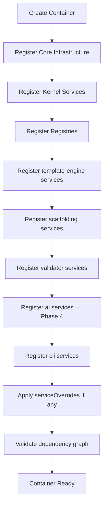

---

## Dependency Injection

### Resolution Flow

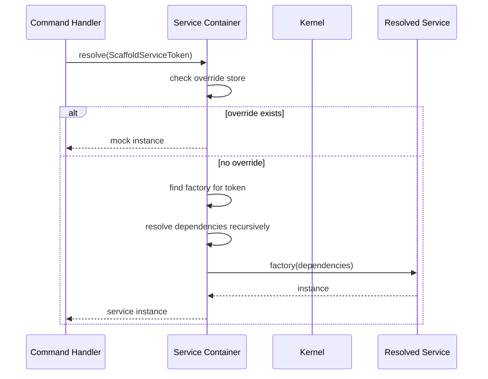

### Context Objects (DI Surfaces)

The kernel exposes two primary dependency surfaces — not raw container access:

#### CommandContext (CLI → Commands)

```typescript
interface ICommandContext {
  readonly kernel: IKernel;
  readonly config: ResolvedConfiguration;
  readonly logger: ILogger;
  readonly filesystem: IFilesystem;
  readonly events: IEventBus;
  readonly hooks: IHookRegistry;
  readonly cwd: string;
  readonly flags: ParsedFlags;
  readonly args: ParsedArgs;

  /** Resolve additional services from container */
  resolve<T>(token: ServiceToken<T>): T;
}
```

Built by `CommandContextFactory` at dispatch time. One scoped container per command invocation.

#### PluginContext (Kernel → Plugins)

```typescript
interface IPluginContext {
  readonly kernel: IKernel;           // Read-only facade
  readonly logger: ILogger;           // Child logger: plugin:{name}
  readonly filesystem: IFilesystem;    // Sandboxed per permissions
  readonly config: Readonly<PluginConfigSlice>;
  readonly registries: PluginRegistries;
  readonly hooks: IHookRegistry;
  readonly events: IEventBus;
}

interface PluginRegistries {
  readonly commands: ICommandRegistry;
  readonly generators: IGeneratorRegistry;
  readonly templates: ITemplateRegistry;
  readonly validators: IValidatorRegistry;
  readonly aiProviders: IAIProviderRegistry;
  readonly hooks: IHookRegistry;
}
```

Plugins receive `PluginContext` in `onLoad()`. They must not receive `IServiceContainer` directly.

### DI Rules

| Rule | Description |
|------|-------------|
| DI-1 | Commands never `new` infrastructure services |
| DI-2 | Domain packages expose interfaces; infrastructure provides implementations |
| DI-3 | Plugins register capabilities via registries, not container |
| DI-4 | Test environments use `container.override()` — never modify production registrations |
| DI-5 | Scoped services are disposed after command completion |

---

## Command Registry

The command registry stores CLI command definitions from built-in modules and plugins.

### Responsibilities

| Responsibility | Owner |
|----------------|-------|
| Registry storage and lookup | Kernel (`@genesis/core`) |
| Built-in command registration | CLI (`@genesis/cli`) during boot |
| Plugin command registration | Plugins during `register()` |
| Command dispatch | CLI (`@genesis/cli`) |
| Help text generation | CLI (`@genesis/cli`) |

### Registry API

```typescript
interface ICommandRegistry {
  /** Register a command definition */
  register(command: CommandDefinition): void;

  /** Register multiple commands from a plugin */
  registerFromPlugin(plugin: LoadedPlugin, commands: CommandDefinition[]): void;

  /** Resolve command by id (supports namespaces: "plugin:command") */
  resolve(id: string): CommandDefinition | undefined;

  /** List all commands with metadata */
  list(filter?: CommandFilter): CommandMetadata[];

  /** Check for duplicate before registration */
  has(id: string): boolean;

  /** Unregister all commands from a plugin (on unload) */
  unregisterByPlugin(pluginId: PluginId): void;
}
```

### Command Definition

```typescript
interface CommandDefinition {
  readonly id: string;                    // e.g., "create", "unity:create-scene"
  readonly description: string;
  readonly category?: CommandCategory;
  readonly flags?: FlagDefinition[];
  readonly arguments?: ArgumentDefinition[];
  readonly handler: CommandHandler;
  readonly source: 'builtin' | 'plugin';
  readonly pluginId?: PluginId;
  readonly hidden?: boolean;
}
```

### Registration Rules

| Rule | Description |
|------|-------------|
| CR-1 | Built-in commands register before plugin commands |
| CR-2 | Duplicate command IDs rejected — first wins, second logs `CAPABILITY_ID_CONFLICT` |
| CR-3 | Plugin commands must declare `command` capability in manifest |
| CR-4 | Plugin commands prefixed with plugin namespace: `{plugin}:{command}` or nested subcommand |
| CR-5 | Commands unregistered when plugin unloads |
| CR-6 | Unknown commands trigger fuzzy suggestion (Levenshtein distance) |

### Registration Sequence

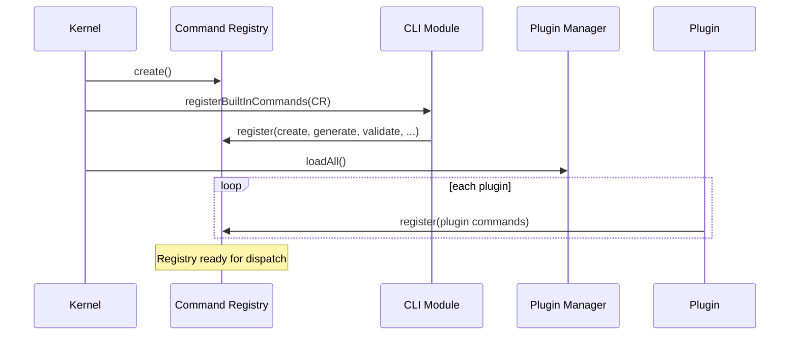

---

## Plugin Registry

The plugin registry tracks loaded plugin instances and their metadata. Distinct from capability registries (generators, templates, etc.).

### Plugin Manager API

```typescript
interface IPluginManager {
  /** Scan search paths for plugin manifests */
  discover(paths?: string[]): Promise<DiscoveryResult>;

  /** Load a single plugin by id */
  load(pluginId: PluginId): Promise<LoadResult>;

  /** Load all discovered plugins in dependency order */
  loadAll(): Promise<LoadAllResult>;

  /** Unload a plugin (checks dependents) */
  unload(pluginId: PluginId): Promise<void>;

  /** Unload all plugins in reverse dependency order */
  unloadAll(): Promise<void>;

  /** Get loaded plugin by id */
  get(pluginId: PluginId): LoadedPlugin | undefined;

  /** List all loaded plugins */
  getLoaded(): LoadedPlugin[];

  /** List discovered but not loaded plugins */
  getDiscovered(): DiscoveredPlugin[];

  /** Check if plugin is loaded */
  isLoaded(pluginId: PluginId): boolean;
}
```

### Loaded Plugin Record

```typescript
interface LoadedPlugin {
  readonly id: PluginId;
  readonly version: SemVer;
  readonly manifest: PluginManifest;
  readonly instance: GenesisPlugin;
  readonly capabilities: CapabilityType[];
  readonly permissions: Permission[];
  readonly trust: TrustLevel;
  readonly loadedAt: Date;
  readonly state: 'loading' | 'loaded' | 'unloading' | 'failed';
  readonly contributedCapabilities: ContributedCapability[];
}
```

### Discovery Search Paths

| Priority | Path | Source |
|----------|------|--------|
| 1 | `plugins.enabled` from config | Explicit enable list |
| 2 | `packages/plugins/` | Monorepo development |
| 3 | `node_modules/@genesis/plugin-*` | Installed packages |
| 4 | `~/.genesis/plugins/` | User-global plugins |
| 5 | `.genesis/plugins/` | Project-local plugins |
| 6 | `GENESIS_PLUGIN_PATH` env var | Additional paths |

### Plugin Load Sequence

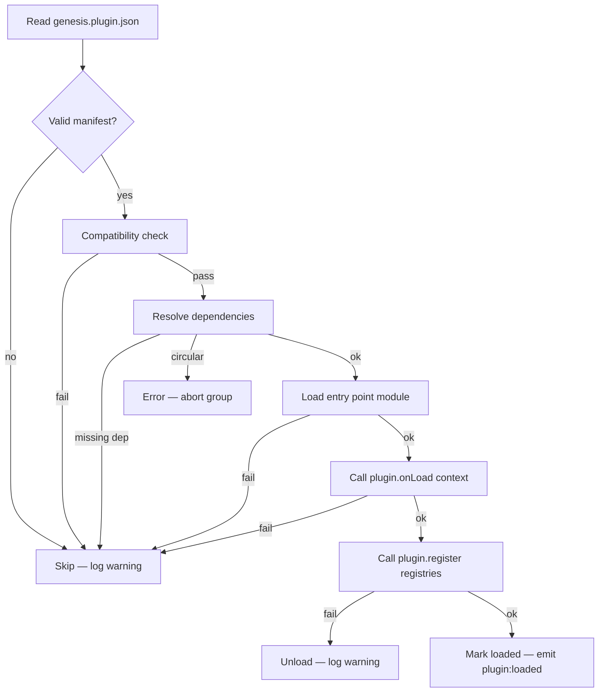

### Capability Registries (Plugin Contributions)

When a plugin calls `register()`, capabilities flow into typed registries:

| Capability | Registry | ID Format | Example |
|------------|----------|-----------|---------|
| `command` | Command Registry | `{plugin}:{command}` | `unity:create-scene` |
| `generator` | Generator Registry | `{plugin}:{generator}` | `nestjs:api` |
| `template` | Template Registry | `{plugin}/{path}` | `unity/systems/combat` |
| `validator` | Validator Registry | `{plugin}:{rule}` | `unity:script-length` |
| `ai-provider` | AI Provider Registry | `{provider}` | `openai` |
| `hook` | Hook Registry | hook name | `pre-generate` |
| `analyzer` | Analyzer Registry (future) | `{plugin}:{analyzer}` | `unity:bundle-size` |

---

## Configuration Loading

The kernel does not own the configuration schema — that lives in `@genesis/config`. The kernel's **Config Service** wraps the loader and exposes resolved configuration to all services.

### Integration Architecture

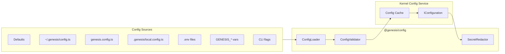

### Config Service API

```typescript
interface IConfiguration {
  /** Full resolved configuration */
  getAll(): ResolvedConfiguration;

  /** Get value by dot-path: "backend.port" */
  get<T>(path: string): T;

  /** Get plugin config slice */
  getPluginConfig(pluginId: PluginId): Record<string, unknown>;

  /** Active config file paths (for debugging) */
  getSources(): ConfigSource[];

  /** Current mode */
  getMode(): EnvironmentMode;

  /** Reload configuration (invalidates cache) */
  reload(): Promise<ResolvedConfiguration>;
}
```

### Kernel Config Rules

| Rule | Description |
|------|-------------|
| CF-1 | Configuration loaded once during boot Phase 1; cached for process lifetime |
| CF-2 | `genesis config set` triggers `config.reload()` between commands (not mid-command) |
| CF-3 | Plugins receive **read-only** config slice via `PluginContext.config` |
| CF-4 | Secrets redacted before any log output or `genesis config show` |
| CF-5 | Plugin config validated against plugin's `configSchema` from manifest |
| CF-6 | Config errors during boot are **fatal** — kernel does not start with invalid config |

### Config Load Timing

| When | Action |
|------|--------|
| Boot Phase 1 | Full config load and validation |
| `genesis config set` | Reload after write |
| `genesis config validate` | Load + validate without caching |
| Plugin `onLoad` | Read plugin config slice (already resolved) |

---

## Event Bus

The event bus provides **publish/subscribe** notifications for kernel and application lifecycle. Events are fire-and-forget observability signals — they cannot cancel operations.

### Event Bus vs Hooks

| Aspect | Event Bus | Hook Registry |
|--------|-----------|---------------|
| Purpose | Notify observers | Intercept and modify operations |
| Cancellable | No | Yes (selected hooks) |
| Return value | Ignored | Can modify payload or cancel |
| Failure impact | Log warning; continue | Log warning; continue |
| Subscribers | Any module or plugin | Plugins and built-in modules |
| Ordering | Registration order | Priority order |

### Event Bus API

```typescript
interface IEventBus {
  /** Subscribe to an event type */
  on<T extends GenesisEventType>(
    type: T,
    listener: EventListener<T>
  ): Unsubscribe;

  /** Subscribe once */
  once<T extends GenesisEventType>(
    type: T,
    listener: EventListener<T>
  ): Unsubscribe;

  /** Emit an event to all subscribers */
  emit<T extends GenesisEventType>(event: GenesisEvent<T>): void;

  /** Remove all listeners (shutdown) */
  removeAllListeners(): void;

  /** Get listener count for debugging */
  listenerCount(type: GenesisEventType): number;
}
```

### Event Catalog

#### Kernel Events

| Event | Payload | When |
|-------|---------|------|
| `kernel:boot:start` | `{ version }` | Boot begins |
| `kernel:boot:phase` | `{ phase, durationMs }` | Boot phase completes |
| `kernel:initialized` | `{ version, pluginCount, durationMs }` | Kernel ready |
| `kernel:shutdown:start` | `{ exitCode }` | Shutdown begins |
| `kernel:shutdown` | `{ exitCode, durationMs }` | Shutdown complete |

#### Plugin Events

| Event | Payload | When |
|-------|---------|------|
| `plugin:discovered` | `{ count, paths }` | Discovery complete |
| `plugin:loading` | `{ name, path }` | Load starting |
| `plugin:loaded` | `{ name, version, capabilities }` | Load success |
| `plugin:skipped` | `{ name, reason, code }` | Load skipped |
| `plugin:unloading` | `{ name }` | Unload starting |
| `plugin:unloaded` | `{ name }` | Unload complete |
| `plugin:error` | `{ name, code, phase }` | Plugin error |

#### Capability Events

| Event | Payload | When |
|-------|---------|------|
| `capability:registered` | `{ plugin, type, id }` | Capability added |
| `capability:unregistered` | `{ plugin, type, id }` | Capability removed |

#### Command Events

| Event | Payload | When |
|-------|---------|------|
| `command:start` | `{ id, args, flags }` | Command execution begins |
| `command:complete` | `{ id, exitCode, durationMs }` | Command succeeds |
| `command:error` | `{ id, error, exitCode }` | Command fails |

#### Generation Events

| Event | Payload | When |
|-------|---------|------|
| `generate:start` | `{ type, name, template }` | Generation begins |
| `generate:phase` | `{ phase, filesCreated }` | Phase completes |
| `generate:complete` | `{ filesCreated, durationMs }` | Generation succeeds |
| `generate:error` | `{ error, phase }` | Generation fails |

### Event Contract

```typescript
interface GenesisEvent<T extends GenesisEventType = GenesisEventType> {
  readonly type: T;
  readonly timestamp: string;       // ISO 8601
  readonly traceId: string;           // Correlation ID
  readonly payload: EventPayloadMap[T];
  readonly source: string;           // Component that emitted
}
```

### Event Rules

| Rule | Description |
|------|-------------|
| EV-1 | Event handlers must not throw — wrap in try/catch |
| EV-2 | Event handler timeout: 5 seconds (configurable) |
| EV-3 | Slow handlers logged at `warn` level |
| EV-4 | Events emitted synchronously by default; async handlers run fire-and-forget |
| EV-5 | `traceId` propagated from boot through command to shutdown |
| EV-6 | Events never contain secrets — payloads sanitized |

---

## Lifecycle Hooks

Hooks are **interception points** where plugins and built-in modules can observe, modify, or cancel operations.

### Hook Registry API

```typescript
interface IHookRegistry {
  /** Register a hook listener */
  register(
    name: HookName,
    listener: HookListener,
    options?: HookOptions
  ): Unsubscribe;

  /** Execute all listeners for a hook */
  run<T extends HookName>(
    name: T,
    payload: HookPayloadMap[T]
  ): Promise<HookResult<T>>;

  /** List registered hooks (debugging) */
  list(name?: HookName): RegisteredHook[];

  /** Remove all listeners (shutdown) */
  clear(): void;
}

interface HookOptions {
  priority?: number;        // Lower = earlier (default: 100)
  pluginId?: PluginId;      // Auto-set for plugin registrations
  timeout?: number;         // Override default 30s
}
```

### Hook Catalog

| Hook | Phase | Cancellable | Modifiable Payload | Timeout |
|------|-------|-------------|-------------------|---------|
| `pre-init` | Boot | No | No | 10s |
| `post-init` | Boot | No | No | 10s |
| `pre-command` | Command | Yes | Yes (`args`, `flags`) | 30s |
| `post-command` | Command | No | No | 10s |
| `pre-generate` | Scaffolding | Yes | Yes (`variables`) | 30s |
| `post-generate` | Scaffolding | No | No | 10s |
| `pre-validate` | Validation | No | Yes (`rules`) | 10s |
| `post-validate` | Validation | No | No | 10s |
| `pre-render` | Template | Yes | Yes (`context`) | 10s |
| `post-render` | Template | No | No | 5s |
| `pre-deploy` | Deploy | Yes | Yes (`plan`) | 30s |
| `post-deploy` | Deploy | No | No | 10s |
| `shutdown` | Shutdown | No | No | 30s |

### Hook Execution Flow

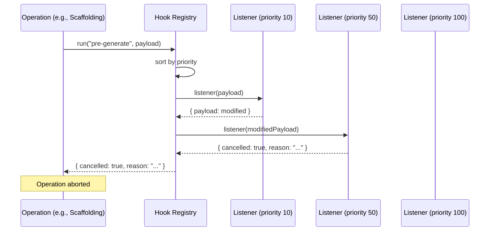

### Cancellable Hook Result

```typescript
interface HookResult<T extends HookName> {
  readonly payload: HookPayloadMap[T];   // Accumulated modifications
  readonly cancelled: boolean;
  readonly cancelReason?: string;
  readonly listenerResults: ListenerResult[];
}

interface ListenerResult {
  readonly pluginId?: PluginId;
  readonly durationMs: number;
  readonly error?: Error;
  readonly modified: boolean;
  readonly cancelled: boolean;
}
```

### Hook Rules

| Rule | Description |
|------|-------------|
| H1 | Listeners execute in ascending priority order |
| H2 | Each listener receives the payload modified by prior listeners |
| H3 | First `cancelled: true` stops remaining listeners and aborts operation |
| H4 | Listener failure logs warning; next listener still executes |
| H5 | `shutdown` hook always runs — even on error exit, SIGINT, or uncaught exception |
| H6 | Plugins register only hooks declared in manifest `capabilities: ["hook"]` |
| H7 | Built-in modules may register any hook |
| H8 | Hook listeners must be pure side-effect or payload modification — no async I/O > 30s |

---

## Logging

The kernel provides structured logging consumed by all packages and surfaced to stderr per [CLI_USER_EXPERIENCE.md](../001-cli/CLI_USER_EXPERIENCE.md).

### Logger Architecture

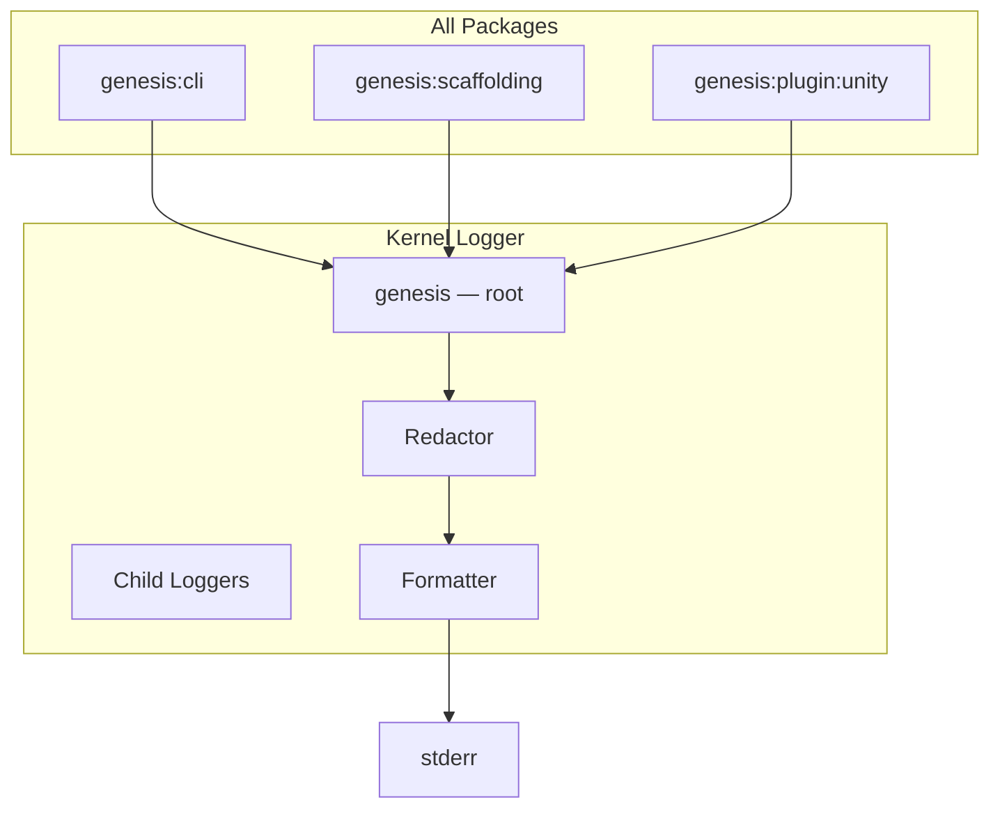

### Logger API

```typescript
interface ILogger {
  /** Create child logger with bindings */
  child(bindings: Record<string, string>): ILogger;

  trace(message: string, meta?: LogMeta): void;
  debug(message: string, meta?: LogMeta): void;
  info(message: string, meta?: LogMeta): void;
  warn(message: string, meta?: LogMeta): void;
  error(message: string, meta?: LogMeta): void;

  /** Flush buffered logs (shutdown) */
  flush(): Promise<void>;

  /** Current log level */
  readonly level: LogLevel;
}
```

### Log Levels

| Level | Numeric | Shown When | Use |
|-------|---------|------------|-----|
| `trace` | 10 | `--debug` | Full stack traces, DI resolution |
| `debug` | 20 | `--verbose` | Hook execution, plugin load details |
| `info` | 30 | default | Boot phases, command start/complete |
| `warn` | 40 | default | Skipped plugins, hook failures |
| `error` | 50 | always | Command failures, fatal errors |
| `silent` | 100 | `--quiet` | Errors only to stderr |

### Log Format

**Text (default):**

```
12:00:00 INFO  genesis:kernel — Kernel initialized (plugins: 3, 142ms)
12:00:01 DEBUG genesis:plugin — Loaded @genesis/plugin-unity@1.0.0 (38ms)
```

**JSON (`cli.logFormat: json` or `--debug`):**

```json
{
  "timestamp": "2026-07-26T12:00:00.000Z",
  "level": "info",
  "component": "genesis:kernel",
  "message": "Kernel initialized",
  "traceId": "a1b2c3d4",
  "pluginCount": 3,
  "durationMs": 142
}
```

### Child Logger Naming

| Component | Logger Name |
|-----------|-------------|
| Kernel | `genesis:kernel` |
| Plugin Manager | `genesis:plugin` |
| Service Container | `genesis:container` |
| Config Service | `genesis:config` |
| Hook Registry | `genesis:hooks` |
| Event Bus | `genesis:events` |
| CLI command | `genesis:cli:{commandId}` |
| Plugin instance | `genesis:plugin:{pluginId}` |
| Scaffolding | `genesis:scaffolding` |

### Logging Rules

| Rule | Description |
|------|-------------|
| L1 | All logs go to **stderr** — stdout reserved for command output |
| L2 | Never log secrets, tokens, passwords, or API keys |
| L3 | Config values matching `*secret*`, `*token*`, `*key*` redacted automatically |
| L4 | File paths in logs use relative paths when inside project root |
| L5 | `traceId` included in every log entry after boot |
| L6 | Plugin loggers are children of `genesis:plugin` with `pluginId` binding |
| L7 | Log level controlled by config `cli.logLevel` and CLI flags |

---

## Shutdown Sequence

Shutdown is triggered by normal command completion, error exit, `SIGINT` (Ctrl+C), or `SIGTERM`.

### Shutdown Phases

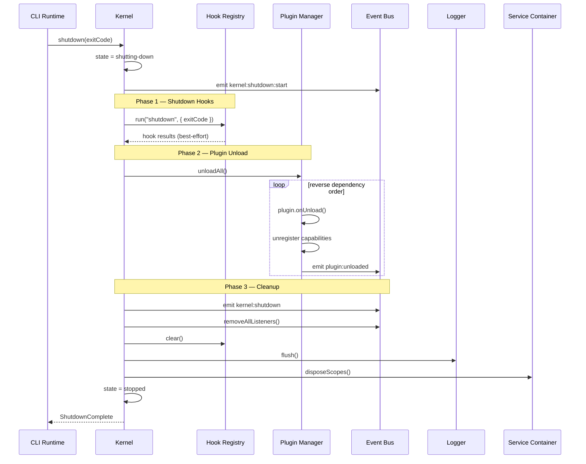

### Shutdown Phase Detail

| Phase | ID | Timeout | Failure Behavior |
|-------|----|---------|------------------|
| 1 — Shutdown hooks | `shutdown:hooks` | 30s total | Log per-hook timeout; continue |
| 2 — Plugin unload | `shutdown:plugins` | 10s per plugin | Log timeout; force unload |
| 3 — Event cleanup | `shutdown:events` | 5s | Best-effort |
| 4 — Log flush | `shutdown:logs` | 2s | Best-effort |
| 5 — Container dispose | `shutdown:container` | 1s | Best-effort |
| **Total shutdown budget** | | **60s** | Force exit after budget |

### Shutdown Rules

| Rule | Description |
|------|-------------|
| SH1 | Shutdown hooks **always** run — including error exits and SIGINT |
| SH2 | Plugins unload in **reverse dependency order** |
| SH3 | Plugin `onUnload()` timeout: 10 seconds per plugin |
| SH4 | Shutdown is idempotent — calling `shutdown()` twice is safe |
| SH5 | In-flight command cancelled on SIGINT with exit code 5 (`INTERRUPTED`) |
| SH6 | Partial plugin unload on timeout — capabilities unregistered even if `onUnload` hangs |

### Signal Handling

| Signal | Behavior |
|--------|----------|
| `SIGINT` (Ctrl+C) | Cancel in-flight operation; run shutdown; exit 5 |
| `SIGTERM` | Same as SIGINT |
| `SIGHUP` | Ignored (CLI is not a daemon) |
| Uncaught exception | Log error; run shutdown; exit 1 |

---

## Recovery

The kernel implements recovery strategies for transient and partial failures.

### Recovery Matrix

| Failure Domain | Strategy | User Impact |
|----------------|----------|-------------|
| Single plugin load failure | Skip plugin; continue boot | Warning in `genesis doctor` |
| Plugin `onLoad` throws | Skip plugin; unregister partial capabilities | Warning with plugin name |
| Plugin `register()` throws | Unload plugin entirely | Warning with error code |
| Hook listener throws | Log warning; continue next listener | None (unless cancellable hook) |
| Hook timeout | Cancel listener; continue | None |
| Config reload failure | Keep cached config; log error | `genesis config set` fails |
| Filesystem transient error | Retry 3x with exponential backoff | Brief delay |
| Plugin crash during command | Isolate; command fails; kernel continues | Command error message |
| All plugins failed | Kernel ready with built-ins only | `genesis doctor plugins` |
| Uncaught exception in command | Shutdown hooks; exit 1 | Error message with fix hint |

### Plugin Recovery

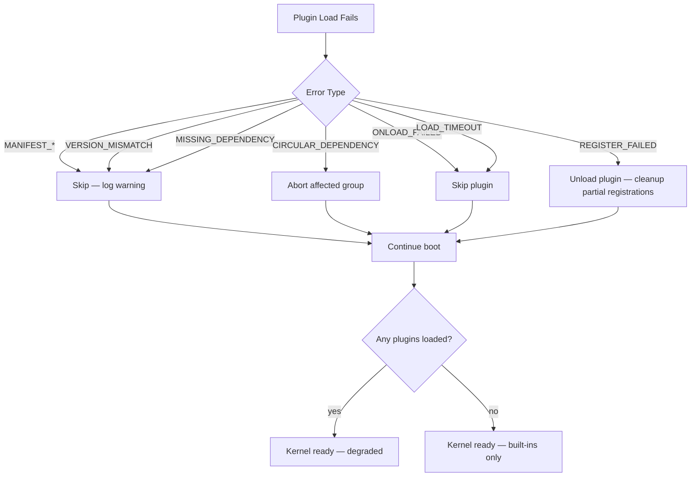

### Retry Policy (Infrastructure)

| Operation | Retries | Backoff | Applies To |
|-----------|---------|---------|------------|
| Filesystem read | 3 | 100ms, 200ms, 400ms | Transient I/O errors |
| Filesystem write | 2 | 100ms, 200ms | Transient I/O errors |
| Plugin load | 0 | — | Never retry plugin load |
| Config load | 0 | — | Fail immediately |
| Hook execution | 0 | — | Never retry hooks |

### Degraded Mode

When plugins fail to load, the kernel enters **degraded mode**:

| Capability | Degraded Behavior |
|------------|-------------------|
| Missing Unity plugin | `genesis generate unity-*` unavailable; suggest `genesis plugin install unity` |
| Missing NestJS plugin | `genesis generate backend *` unavailable |
| Missing AI provider | `genesis ai` unavailable; suggest config or plugin install |
| All plugins missing | Built-in commands only: `version`, `help`, `config`, `doctor`, `validate` |

Kernel emits `kernel:initialized` with `{ degraded: true, failedPlugins: [...] }`.

### Manual Recovery Commands

```bash
genesis doctor plugins          # Diagnose plugin issues
genesis plugin list             # Show loaded vs failed
genesis plugin install unity    # Install missing plugin
genesis config validate         # Fix config issues
genesis --verbose doctor        # Detailed recovery diagnostics
```

---

## Error Handling

### Error Hierarchy

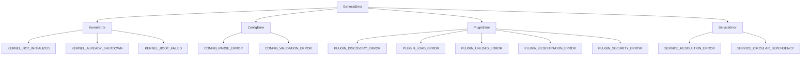

### Kernel Error Contract

Every kernel error exposes:

```typescript
interface KernelError extends GenesisError {
  readonly code: string;
  readonly message: string;
  readonly phase: KernelPhase;
  readonly component: string;
  readonly details?: Record<string, unknown>;
  readonly cause?: Error;
  readonly recoverable: boolean;
  readonly suggestion?: string;
  readonly exitCode: number;
}
```

### Error Severity and Response

| Severity | Kernel Response | Process Exit |
|----------|----------------|----------------|
| **Fatal** | Abort boot or operation; run shutdown | Non-zero |
| **Error** | Abort current operation; kernel stays ready | Per command |
| **Warning** | Log; continue | 0 (unless `--strict`) |
| **Info** | Log only | 0 |

### Error Isolation Boundaries

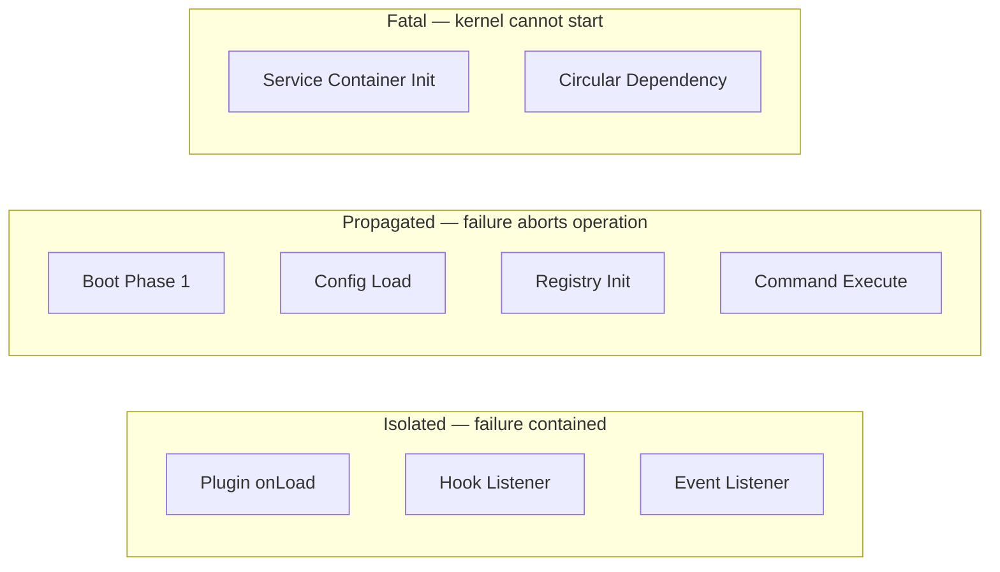

### Error Format

```
[KERNEL_ERROR] {code}: {message}
  Phase: {boot|ready|running|shutdown}
  Component: {component}
  Recoverable: {true|false}
  Suggestion: {actionableFix}
```

---

## Future Distributed Execution

The v1 kernel is **single-process, single-machine**. This section defines the evolution path toward distributed execution without prescribing implementation.

### Evolution Roadmap

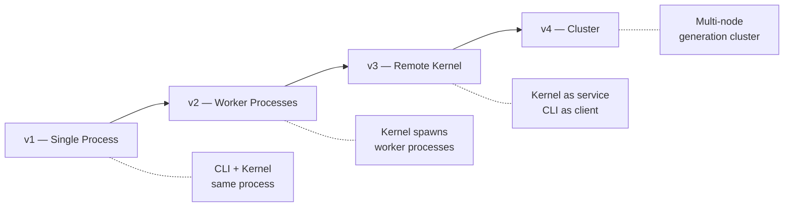

### v1 — Single Process (Current)

| Attribute | Value |
|-----------|-------|
| Processes | 1 |
| Kernel location | In-process with CLI |
| Plugin loading | Dynamic `import()` in same process |
| Concurrency | Single command per process |
| State | In-memory |

### v2 — Worker Processes

| Attribute | Value |
|-----------|-------|
| Use case | Isolate untrusted plugins; parallel generation phases |
| Architecture | Kernel spawns child processes for plugin execution |
| IPC | Structured messages over stdin/stdout or Unix sockets |
| Plugin sandbox | OS-level process isolation |
| Breaking changes | `PluginContext` gains `spawnWorker()` |

```
┌─────────────────────────────────────┐
│  Main Process (Kernel + CLI)        │
│  ┌─────────┐  ┌─────────────────┐  │
│  │ Kernel  │──│ Plugin Worker 1 │  │
│  │         │──│ Plugin Worker 2 │  │
│  └─────────┘  └─────────────────┘  │
└─────────────────────────────────────┘
```

### v3 — Remote Kernel (Genesis Daemon)

| Attribute | Value |
|-----------|-------|
| Use case | Long-running kernel; multiple CLI clients; IDE integration |
| Architecture | `genesisd` daemon exposes kernel via gRPC/HTTP |
| CLI role | Thin client sending commands to daemon |
| State | Daemon holds plugin registry, config cache |
| Breaking changes | `genesis --remote localhost:9473` |

```
┌──────────────┐     gRPC      ┌──────────────────┐
│ genesis CLI  │──────────────▶│ genesisd (Kernel) │
│ (thin client)│◀──────────────│                   │
└──────────────┘               │  Plugins loaded    │
┌──────────────┐     gRPC      │  Config cached     │
│ Cursor IDE   │──────────────▶│  Registries hot   │
└──────────────┘               └──────────────────┘
```

### v4 — Distributed Cluster

| Attribute | Value |
|-----------|-------|
| Use case | Parallel game generation; CI/CD at scale |
| Architecture | Kernel coordinator + worker nodes |
| Work distribution | Generation plans split across nodes |
| Shared state | Template registry, config (read-only replica) |
| Auth | mTLS between nodes; API keys for CI |

```
┌─────────────────────────────────────────────────┐
│  Coordinator (Kernel)                           │
│  ┌──────────┐  ┌──────────┐  ┌──────────┐     │
│  │ Worker 1 │  │ Worker 2 │  │ Worker 3 │     │
│  │ Phase 1-3│  │ Phase 4-5│  │ Phase 6-7│     │
│  └──────────┘  └──────────┘  └──────────┘     │
└─────────────────────────────────────────────────┘
```

### Distributed Design Constraints (Forward-Compatible)

To enable future distribution without rewriting v1:

| Constraint | v1 Design Choice | Future Benefit |
|------------|------------------|----------------|
| DC-1 | All kernel communication through interfaces | Swap in-process for RPC |
| DC-2 | `traceId` on every event and log entry | Distributed tracing |
| DC-3 | Generation plans are serializable | Send plan to remote worker |
| DC-4 | Plugin capabilities registered by ID, not reference | Remote registry lookup |
| DC-5 | Config is immutable per command invocation | Safe to share across processes |
| DC-6 | No global mutable state outside kernel | Horizontal scaling |
| DC-7 | Hooks and events use structured payloads (JSON-safe) | IPC serialization |

### Kernel API Stability for Distribution

These APIs are designed to remain stable across v1–v4:

| API | Stability |
|-----|-----------|
| `IKernel.initialize()` / `shutdown()` | Stable |
| `IPluginManager.discover()` / `load()` | Stable |
| Registry `resolve()` / `register()` | Stable |
| `IHookRegistry.run()` | Stable |
| `IEventBus.emit()` / `on()` | Stable |
| `IServiceContainer.resolve()` | Stable (in-process only v1–v2) |
| `PluginContext` | Evolves at v2 (worker spawn) |

---

## Kernel Public API Summary

```typescript
interface IKernel {
  // Lifecycle
  initialize(options: KernelBootOptions): Promise<void>;
  shutdown(exitCode?: number): Promise<void>;
  getState(): KernelState;

  // Service access
  getServiceContainer(): IServiceContainer;
  resolve<T>(token: ServiceToken<T>): T;

  // Registries
  getCommandRegistry(): ICommandRegistry;
  getGeneratorRegistry(): IGeneratorRegistry;
  getTemplateRegistry(): ITemplateRegistry;
  getValidatorRegistry(): IValidatorRegistry;
  getAIProviderRegistry(): IAIProviderRegistry;
  getHookRegistry(): IHookRegistry;
  getEventBus(): IEventBus;

  // Plugin management
  getPluginManager(): IPluginManager;

  // Configuration
  getConfiguration(): IConfiguration;

  // Logging
  getLogger(): ILogger;

  // Metadata
  getVersion(): SemVer;
  getTraceId(): string;
  isDegraded(): boolean;
}
```

---

## Testing Strategy

| Level | Focus | Tools |
|-------|-------|-------|
| Unit | Dependency resolver, permission engine, hook ordering, event emission | Vitest |
| Integration | Full boot → command → shutdown with fixture plugins | Vitest + temp directories |
| Contract | Mock plugins implement `GenesisPlugin` correctly | Shared test fixtures |
| Chaos | Random plugin failures during boot; verify degraded mode | Custom test harness |
| Performance | Boot time < 500ms without plugins; shutdown < 2s | Benchmark tests |
| Security | Permission denial, sandbox violation, trust escalation | Dedicated security tests |

### Test Harness API

```typescript
interface KernelTestHarness {
  /** Boot kernel with test configuration */
  boot(options?: Partial<KernelBootOptions>): Promise<IKernel>;

  /** Register a mock plugin */
  registerMockPlugin(plugin: MockGenesisPlugin): void;

  /** Override a service in the container */
  overrideService<T>(token: ServiceToken<T>, mock: T): void;

  /** Shutdown and cleanup */
  teardown(): Promise<void>;
}
```

---

## Related Documents

| Document | Relationship |
|----------|-------------|
| [PACKAGES.md](PACKAGES.md) | Package architecture and `@genesis/core` structure |
| [003-plugin-system/FUNCTIONAL_SPEC.md](../003-plugin-system/FUNCTIONAL_SPEC.md) | Plugin contracts and security |
| [001-cli/FUNCTIONAL_SPEC.md](../001-cli/FUNCTIONAL_SPEC.md) | CLI lifecycle and DI |
| [001-cli/CONFIGURATION.md](../001-cli/CONFIGURATION.md) | Configuration schema and loading |
| [DECISION_LOG.md](../../DECISION_LOG.md) | ADR-001, ADR-002 |
| [standards/ARCHITECTURE_STANDARD.md](../../standards/ARCHITECTURE_STANDARD.md) | Layer rules |

## Changelog

| Version | Date | Change |
|---------|------|--------|
| 1.0.0 | 2026-07-26 | Initial kernel architecture specification |
