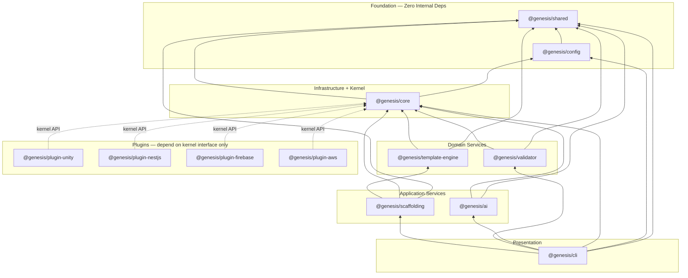
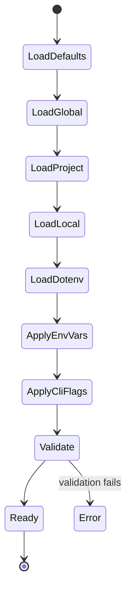
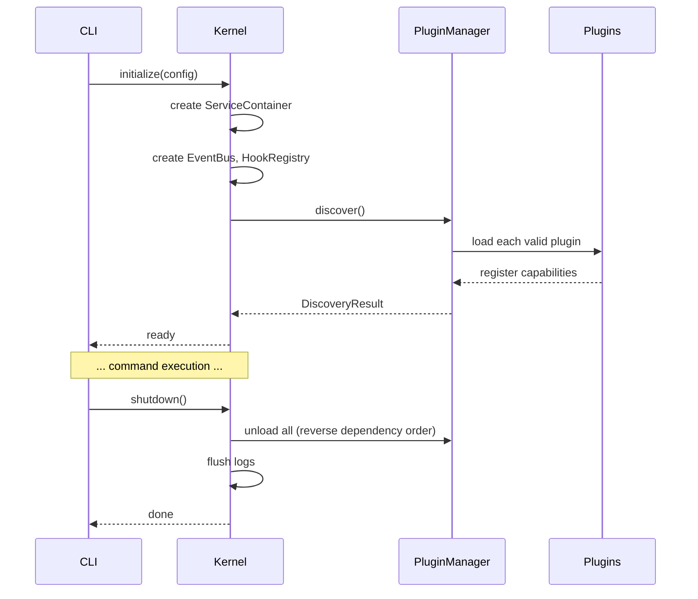
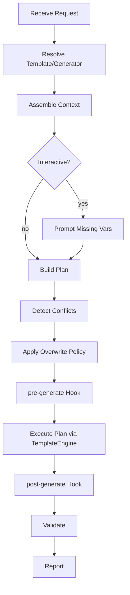
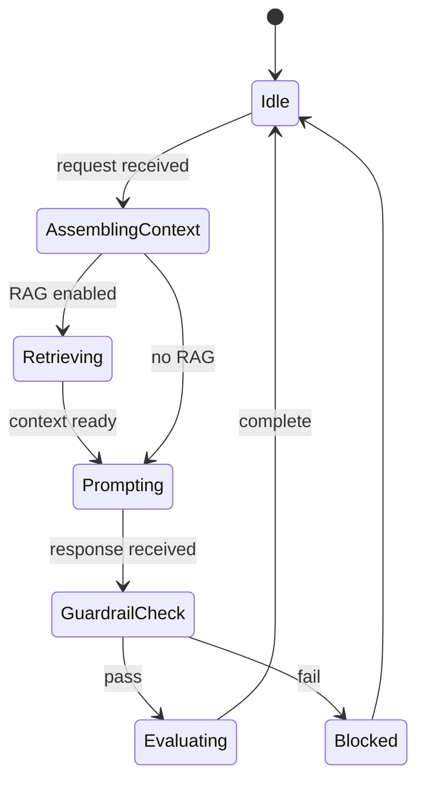
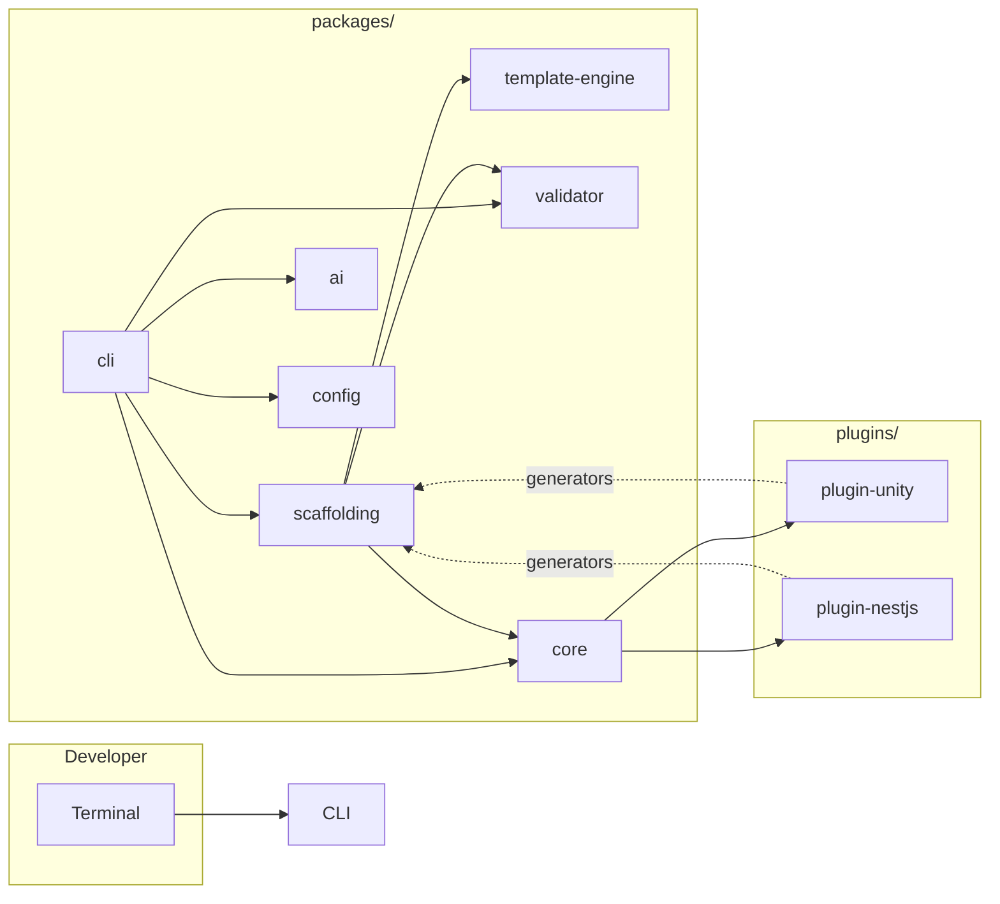

# Genesis Package Architecture

## Purpose

Document every package in the Project Genesis monorepo (`packages/`). This is the authoritative reference for package boundaries, public APIs, dependency rules, internal structure, lifecycles, testing strategies, and evolution paths.

No implementation code is prescribed — only architecture contracts.

## Related Specifications

| Spec | Packages |
|------|----------|
| [001-cli](../001-cli/) | `@genesis/cli`, `@genesis/config` |
| [002-template-engine](../002-template-engine/) | `@genesis/template-engine` |
| [003-plugin-system](../003-plugin-system/) | `@genesis/core` (kernel), plugin packages |
| [004-scaffolding](../004-scaffolding/) | `@genesis/scaffolding` |
| [005-ai-engine](../005-ai-engine/) | `@genesis/ai`, AI provider plugins |
| [007-backend](../007-backend/) | `@genesis/plugin-nestjs` |
| [008-unity](../008-unity/) | `@genesis/plugin-unity` |

---

## Monorepo Overview

### Package Inventory

| Package | NPM Name | Layer | Phase | Status |
|---------|----------|-------|-------|--------|
| [shared](#genesisshared) | `@genesis/shared` | Foundation | 1 | Planned |
| [config](#genesisconfig) | `@genesis/config` | Foundation | 1 | Planned |
| [core](#genesiscore) | `@genesis/core` | Infrastructure + Kernel | 1 | Planned |
| [cli](#genesiscli) | `@genesis/cli` | Presentation | 1 | Planned |
| [template-engine](#genesistemplate-engine) | `@genesis/template-engine` | Domain | 1 | Planned |
| [scaffolding](#genesisscaffolding) | `@genesis/scaffolding` | Application + Domain | 1 | Planned |
| [validator](#genesisvalidator) | `@genesis/validator` | Domain | 1–2 | Planned |
| [ai](#genesisai) | `@genesis/ai` | Application | 4 | Planned |
| [plugin-unity](#plugin-packages) | `@genesis/plugin-unity` | Plugin | 2 | Planned |
| [plugin-nestjs](#plugin-packages) | `@genesis/plugin-nestjs` | Plugin | 2 | Planned |
| [plugin-firebase](#plugin-packages) | `@genesis/plugin-firebase` | Plugin | 2 | Planned |
| [plugin-aws](#plugin-packages) | `@genesis/plugin-aws` | Plugin | 2 | Planned |

### Scaffold Rename Map

Current filesystem scaffolds will align to documented names during M1:

| Documented | Current Scaffold | Action |
|------------|------------------|--------|
| `packages/scaffolding` | `packages/generators` | Rename Sprint 4 |
| `packages/template-engine` | `packages/templates` | Rename Sprint 3 |

### Dependency Graph



### Dependency Rules

| Rule | Description |
|------|-------------|
| D1 | `@genesis/shared` has **zero** internal package dependencies |
| D2 | Dependencies point **inward** — presentation → application → domain → infrastructure |
| D3 | Plugins depend on **kernel interfaces** in `@genesis/core`, never on each other |
| D4 | Plugins never import `@genesis/cli`, `@genesis/scaffolding`, or `@genesis/ai` |
| D5 | Domain packages never import presentation packages |
| D6 | Circular dependencies between packages are forbidden |
| D7 | `@genesis/config` depends only on `@genesis/shared` (no core coupling) |

### Layer Assignment

| Layer | Packages | May Import |
|-------|----------|------------|
| **Presentation** | `cli` | application, infrastructure, foundation |
| **Application** | `scaffolding`, `ai` | domain, infrastructure, foundation |
| **Domain** | `template-engine`, `validator`, (domain logic in `scaffolding`) | foundation only from domain; infrastructure via interfaces |
| **Infrastructure** | `core` | foundation |
| **Foundation** | `shared`, `config` | nothing internal |
| **Plugin** | `plugin-*` | `core` kernel interfaces, `shared` types |

---

## `@genesis/shared`

### Purpose

Lowest-level shared library. Pure types, constants, error hierarchies, result types, and utility functions with **no I/O, no framework imports, and no side effects**. Every other package depends on `shared`; it depends on nothing internal.

### Public API

| Export Category | Examples |
|-----------------|----------|
| **Types** | `Result<T, E>`, `AsyncResult<T, E>`, `Brand<T, Tag>` |
| **Errors** | `GenesisError`, `DomainError`, `ValidationError`, `PluginError` |
| **Contracts** | `Command`, `CommandResult`, `CommandContext`, `GenesisPlugin` (interface) |
| **Events** | `GenesisEvent`, `EventPayload` map |
| **IDs** | `ProjectName`, `SemVer`, `PluginId`, `TemplateId`, `GeneratorId` |
| **Constants** | `GENESIS_VERSION`, `EXIT_CODES`, `CAPABILITY_TYPES` |
| **Utilities** | `kebabCase`, `pascalCase`, `camelCase`, `snakeCase`, `assertNever` |

### Dependencies

| Package | Relationship |
|---------|-------------|
| — | No internal dependencies |
| Node.js built-ins | `path`, `util` only in pure utilities |

### Folder Structure

```
packages/shared/
├── package.json
├── tsconfig.json
├── README.md
└── src/
    ├── index.ts                    # Public barrel export
    ├── types/
    │   ├── result.ts
    │   ├── branded.ts
    │   └── ids.ts
    ├── errors/
    │   ├── genesis-error.ts
    │   ├── domain-error.ts
    │   ├── validation-error.ts
    │   ├── plugin-error.ts
    │   └── exit-codes.ts
    ├── contracts/
    │   ├── command.ts
    │   ├── plugin.ts               # GenesisPlugin interface
    │   ├── generator.ts
    │   ├── validator-rule.ts
    │   └── events.ts
    ├── constants/
    │   ├── capabilities.ts
    │   ├── permissions.ts
    │   └── version.ts
    └── utils/
        ├── naming.ts
        ├── assert.ts
        └── semver.ts
```

### Interfaces

```typescript
// Core contracts (abbreviated — full spec in shared package)

interface GenesisPlugin {
  readonly manifest: PluginManifest;
  onLoad(context: PluginContext): Promise<void>;
  onUnload(): Promise<void>;
}

interface Command {
  readonly id: string;
  readonly description: string;
  execute(context: CommandContext, args: ParsedArgs): Promise<CommandResult>;
}

interface CommandResult {
  exitCode: number;
  message?: string;
  data?: unknown;
}

interface GenesisError {
  readonly code: string;
  readonly message: string;
  readonly details?: Record<string, unknown>;
  readonly exitCode: number;
}
```

### Lifecycle

| Phase | Behavior |
|-------|----------|
| Import | Stateless — no initialization |
| Runtime | Pure functions and immutable constants |
| Shutdown | N/A |

### Testing Strategy

| Level | Focus | Coverage Target |
|-------|-------|-----------------|
| Unit | Every utility function, error factory, type guard | 100% |
| Property-based | Naming convention transforms | Round-trip invariants |
| No integration | No I/O, no mocks needed | — |

### Extension Points

| Extension | Mechanism |
|-----------|-----------|
| New error types | Add to `errors/` with unique codes |
| New capability constants | Add to `constants/capabilities.ts` |
| New branded ID types | Add to `types/ids.ts` |

### Future Evolution

| Version | Change |
|---------|--------|
| v0.2 | Add `AnalyzerRule` contract for `genesis analyze` |
| v0.3 | Add `DeployTarget` contract for deployment plugins |
| v1.0 | Stable plugin API (`GenesisPlugin` v1 freeze) |

---

## `@genesis/config`

### Purpose

Configuration system for Project Genesis. Provides `defineConfig()` / `defineGlobalConfig()` helpers, TypeScript schema types for `genesis.config.ts`, config loading, merging, validation, and secret redaction. Specified in [CONFIGURATION.md](../001-cli/CONFIGURATION.md).

### Public API

| Export | Description |
|--------|-------------|
| `defineConfig(config)` | Type-safe project config builder |
| `defineGlobalConfig(config)` | Type-safe global user config builder |
| `defineConfig(fn)` | Async / mode-aware config factory |
| `loadConfig(options)` | Load and merge all config sources |
| `validateConfig(config)` | Validate against schema |
| `redactSecrets(config)` | Redact for `genesis config show` |
| Types: `GenesisConfig`, `GlobalConfig`, `BackendConfig`, `UnityConfig`, `AIConfig`, `DeployConfig`, etc. | Full typed schema |

### Dependencies

| Package | Relationship |
|---------|-------------|
| `@genesis/shared` | Error types, `Result`, ID types |
| Node.js | `fs`, `path`, `url` (infrastructure layer of this package) |

### Folder Structure

```
packages/config/
├── package.json
├── README.md
└── src/
    ├── index.ts
    ├── define-config.ts            # defineConfig, defineGlobalConfig
    ├── schema/
    │   ├── genesis-config.ts       # GenesisConfig type
    │   ├── project.ts
    │   ├── generation.ts
    │   ├── backend.ts
    │   ├── unity.ts
    │   ├── game.ts
    │   ├── ai.ts
    │   ├── deploy.ts
    │   ├── plugins.ts
    │   └── templates.ts
    ├── loader/
    │   ├── config-loader.ts        # Merge precedence chain
    │   ├── dotenv-loader.ts
    │   ├── ts-evaluator.ts         # Evaluate genesis.config.ts
    │   └── env-mapper.ts           # GENESIS_* → config keys
    ├── validator/
    │   ├── config-validator.ts
    │   └── rules/                  # CFG-001 through CFG-017
    └── redaction/
        └── secret-redactor.ts
```

### Interfaces

```typescript
interface ConfigLoader {
  load(options: LoadConfigOptions): Promise<ResolvedConfiguration>;
}

interface ConfigValidator {
  validate(config: unknown): ValidationResult;
}

interface LoadConfigOptions {
  cwd: string;
  mode?: 'development' | 'staging' | 'production' | 'test';
  configPath?: string;
  cliOverrides?: Record<string, unknown>;
}

interface ResolvedConfiguration {
  readonly raw: GenesisConfig;
  readonly mode: string;
  readonly sources: ConfigSource[];
  get<T>(path: string): T;
}
```

### Lifecycle



Loaded once per CLI invocation. Cached for process lifetime. Invalidated on `genesis config set`.

### Testing Strategy

| Level | Focus |
|-------|-------|
| Unit | Schema validation rules, merge precedence, redaction patterns |
| Integration | Load fixture `genesis.config.ts` files, verify resolved output |
| Snapshot | Validated config shapes for example projects |
| Security | No literal secrets pass validation; redaction completeness |

### Extension Points

| Extension | Mechanism |
|-----------|-----------|
| Plugin config schemas | Plugins register JSON Schema in manifest; validated under `plugins.{id}` |
| Custom validation rules | `ConfigValidator.registerRule(rule)` (Phase 2) |
| Config migrations | `migrateConfig(fromVersion, toVersion)` |

### Future Evolution

| Version | Change |
|---------|--------|
| v0.2 | JSON Schema export for IDE `$schema` support |
| v0.3 | Remote config registry (team-shared templates) |
| v1.0 | Schema version 1 freeze |

---

## `@genesis/core`

### Purpose

Infrastructure services and the **plugin kernel**. Owns configuration consumption (via `@genesis/config`), structured logging, filesystem abstraction, event bus, hook registry, dependency injection container, and plugin lifecycle management. The kernel is the extensibility heart of Genesis (ADR-002).

### Public API

#### Kernel

| Method | Description |
|--------|-------------|
| `Kernel.initialize(config)` | Bootstrap kernel with resolved configuration |
| `Kernel.shutdown()` | Graceful teardown, unload plugins |
| `Kernel.getPluginManager()` | Access plugin manager |
| `Kernel.getHookRegistry()` | Access hook registry |
| `Kernel.getEventBus()` | Access event bus |
| `Kernel.getServiceContainer()` | Access DI container |
| `Kernel.getVersion()` | Framework version |

#### Plugin Manager

| Method | Description |
|--------|-------------|
| `discover(paths?)` | Scan plugin directories |
| `load(pluginId)` | Load single plugin |
| `unload(pluginId)` | Unload plugin |
| `getLoaded()` | List loaded plugins |
| `getGenerator(id)` | Resolve generator from registry |
| `getValidator(id)` | Resolve validator from registry |

#### Infrastructure Services

| Service | Interface | Description |
|---------|-----------|-------------|
| Logger | `ILogger` | Structured logging (child loggers per component) |
| Filesystem | `IFilesystem` | Sandboxed file I/O |
| Process | `IProcess` | Spawn child processes |
| Clock | `IClock` | Testable time |

### Dependencies

| Package | Relationship |
|---------|-------------|
| `@genesis/shared` | Contracts, errors, types |
| `@genesis/config` | Configuration loading |

### Folder Structure

```
packages/core/
├── package.json
├── README.md
└── src/
    ├── index.ts
    │
    ├── domain/                          # Kernel domain logic
    │   ├── kernel.ts
    │   ├── plugin-manager.ts
    │   ├── plugin-registry.ts
    │   ├── generator-registry.ts
    │   ├── validator-registry.ts
    │   ├── hook-registry.ts
    │   ├── event-bus.ts
    │   ├── dependency-resolver.ts
    │   └── sandbox/
    │       ├── permission-engine.ts
    │       └── trust-policy.ts
    │
    ├── application/                     # Orchestration
    │   ├── kernel-lifecycle.ts
    │   ├── plugin-lifecycle-runner.ts
    │   ├── discovery-service.ts
    │   └── service-container.ts
    │
    └── infrastructure/                  # Concrete implementations
        ├── logging/
        │   ├── logger.ts
        │   └── formatters/
        ├── filesystem/
        │   ├── node-filesystem.ts
        │   └── sandboxed-filesystem.ts
        ├── config/
        │   └── config-service.ts       # Wraps @genesis/config loader
        └── process/
            └── node-process.ts
```

### Interfaces

```typescript
interface IKernel {
  initialize(config: ResolvedConfiguration): Promise<void>;
  shutdown(): Promise<void>;
  getPluginManager(): IPluginManager;
  getHookRegistry(): IHookRegistry;
  getEventBus(): IEventBus;
  getServiceContainer(): IServiceContainer;
}

interface IPluginManager {
  discover(paths?: string[]): Promise<DiscoveryResult>;
  load(pluginId: PluginId): Promise<LoadResult>;
  unload(pluginId: PluginId): Promise<void>;
  getLoaded(): LoadedPlugin[];
  getGenerator(id: GeneratorId): IGenerator;
}

interface ILogger {
  child(bindings: Record<string, string>): ILogger;
  debug(message: string, meta?: object): void;
  info(message: string, meta?: object): void;
  warn(message: string, meta?: object): void;
  error(message: string, meta?: object): void;
}

interface IFilesystem {
  read(path: string): Promise<string>;
  write(path: string, content: string): Promise<void>;
  exists(path: string): Promise<boolean>;
  mkdir(path: string): Promise<void>;
  glob(pattern: string): Promise<string[]>;
}

interface IHookRegistry {
  register(hook: HookDefinition): void;
  run(name: HookName, payload: unknown): Promise<HookResult[]>;
}

interface IServiceContainer {
  register<T>(token: symbol, factory: Factory<T>, scope?: Scope): void;
  resolve<T>(token: symbol): T;
  override<T>(token: symbol, mock: T): void;
  reset(): void;
}
```

### Lifecycle



| State | Description |
|-------|-------------|
| `uninitialized` | Before `initialize()` |
| `ready` | Plugins loaded, services available |
| `shutting-down` | Unloading plugins, flushing resources |
| `stopped` | Safe to exit |

### Testing Strategy

| Level | Focus |
|-------|-------|
| Unit | Dependency resolver, permission engine, semver compatibility |
| Integration | Plugin discovery with fixture plugins, load/unload cycles |
| Contract | Mock plugins implement `GenesisPlugin` correctly |
| E2E | Kernel bootstrap in subprocess with test plugin directory |

All infrastructure services must be mockable via `IServiceContainer.override()`.

### Extension Points

| Extension | Registered By |
|-----------|---------------|
| Plugins | `genesis.plugin.json` manifest + `GenesisPlugin` implementation |
| Hooks | Plugins and built-in modules via `IHookRegistry` |
| Services | Packages register in DI container at bootstrap |
| Filesystem backends | Future: virtual FS for testing |

### Future Evolution

| Version | Change |
|---------|--------|
| v0.2 | Plugin sandbox hardening (worker threads) |
| v0.3 | Hot-reload plugins in development mode |
| v0.4 | Remote plugin registry integration |
| v1.0 | Kernel API freeze; plugin `apiVersion` 1.0 |

---

## `@genesis/cli`

### Purpose

**Presentation layer** — the `genesis` command-line interface. Parses arguments, manages CLI lifecycle, dispatches commands, formats output, and delegates all business logic to application services. Must remain thin (ADR-001).

### Public API

| Export | Description |
|--------|-------------|
| `run(argv)` | CLI entry point — bootstrap, dispatch, exit |
| `createProgram()` | Build command registry (for testing) |
| `CommandRegistry` | Register and resolve commands |
| `OutputWriter` | Format stdout/stderr per UX spec |
| `HelpRenderer` | Render `--help` output |

Command handlers are internal — exposed only via the command registry, not as package exports.

### Dependencies

| Package | Relationship |
|---------|-------------|
| `@genesis/shared` | Command contracts, exit codes, errors |
| `@genesis/config` | Configuration loading |
| `@genesis/core` | Kernel, logger, filesystem, DI, hooks |
| `@genesis/scaffolding` | `create`, `generate` commands |
| `@genesis/validator` | `validate` command |
| `@genesis/ai` | `ai` commands (Phase 4, optional import) |

### Folder Structure

```
packages/cli/
├── package.json
├── README.md
└── src/
    ├── index.ts                        # bin entry: run(process.argv)
    ├── bin/
    │   └── genesis.ts                  # Shebang entry point
    │
    ├── presentation/
    │   ├── cli-runtime.ts              # Lifecycle orchestration
    │   ├── argument-parser.ts
    │   ├── output-writer.ts
    │   ├── help-renderer.ts
    │   ├── progress-renderer.ts
    │   ├── error-formatter.ts
    │   ├── prompt-engine.ts            # Interactive + wizard modes
    │   └── validation-reporter.ts
    │
    ├── application/
    │   ├── command-registry.ts
    │   ├── command-context-factory.ts
    │   └── command-dispatcher.ts
    │
    └── commands/
        ├── version.ts
        ├── help.ts
        ├── create/
        │   ├── create.ts
        │   └── create-game.ts
        ├── generate.ts
        ├── validate.ts
        ├── doctor.ts
        ├── config/
        │   ├── show.ts
        │   ├── init.ts
        │   ├── validate.ts
        │   └── set.ts
        ├── plugin/
        │   ├── list.ts
        │   └── info.ts
        ├── run.ts
        ├── test.ts
        ├── deploy.ts
        ├── analyze.ts
        ├── game/                         # Domain namespace commands
        ├── backend/
        ├── docs/
        ├── ai/
        ├── wizard.ts
        └── migrate.ts
```

### Interfaces

```typescript
interface ICommandRegistry {
  register(command: Command): void;
  registerFromPlugin(plugin: LoadedPlugin): void;
  resolve(id: string): Command | undefined;
  list(): CommandMetadata[];
}

interface IOutputWriter {
  success(message: string): void;
  error(error: GenesisError): void;
  info(message: string): void;
  json(data: unknown): void;
  progress(event: ProgressEvent): void;
}

interface CommandContext {
  readonly kernel: IKernel;
  readonly config: ResolvedConfiguration;
  readonly logger: ILogger;
  readonly filesystem: IFilesystem;
  readonly output: IOutputWriter;
  readonly hooks: IHookRegistry;
}
```

### Lifecycle

Per [FUNCTIONAL_SPEC.md](../001-cli/FUNCTIONAL_SPEC.md):

`Bootstrap → ParseArgs → LoadConfig → InitKernel → DiscoverPlugins → RegisterCommands → Dispatch → PreHook → Execute → PostHook → Shutdown`

### Testing Strategy

| Level | Focus |
|-------|-------|
| Unit | Argument parser, output formatter, help renderer |
| Integration | Command dispatch with mocked services via DI overrides |
| E2E | Subprocess tests: `genesis --version`, `genesis --help`, exit codes |
| Snapshot | Help text, error message formatting |

### Extension Points

| Extension | Mechanism |
|-----------|-----------|
| Plugin commands | Plugins register via `CommandRegistry.registerFromPlugin()` |
| Output modes | `--json`, `--quiet`, `--verbose` flags |
| Shell completions | `genesis completion bash` (Phase 2) |

### Future Evolution

| Version | Change |
|---------|--------|
| v0.2 | Shell completions (bash, zsh, fish) |
| v0.3 | LSP integration for `genesis.config.ts` |
| v0.4 | TUI mode for wizard (`--tui`) |
| v1.0 | Command tree freeze for stable scripting |

---

## `@genesis/template-engine`

### Purpose

Template discovery, rendering, expression evaluation, helper registration, and output policy enforcement. Pure domain service with no knowledge of projects or CLI — consumed by `@genesis/scaffolding` and plugins.

**Filesystem path:** `packages/template-engine/` (rename from `packages/templates/`).

### Public API

| Service | Method | Description |
|---------|--------|-------------|
| `TemplateService` | `render(request)` | Render single template |
| | `renderBatch(requests, options)` | Render multiple templates |
| | `validate(templateId, context?, mode?)` | Validate without rendering |
| | `discover(options?)` | Discover and index templates |
| | `preview(templateId, context)` | Render to string |
| | `registerHelper(helper)` | Register custom helper |
| `TemplateRegistry` | `register(descriptor, source)` | Add template |
| | `resolve(id, version?)` | Find template |
| | `list(filter?)` | List templates |

### Dependencies

| Package | Relationship |
|---------|-------------|
| `@genesis/shared` | Types, errors |
| `@genesis/core` | Logger, filesystem (via interfaces) |

### Folder Structure

```
packages/template-engine/
├── package.json
├── README.md
├── templates/                          # Built-in runtime templates (assets)
│   ├── project/
│   ├── module/
│   └── partials/
└── src/
    ├── index.ts
    ├── domain/
    │   ├── template.ts
    │   ├── render-context.ts
    │   ├── expression-evaluator.ts
    │   ├── helper-registry.ts
    │   ├── output-policy.ts
    │   └── template-registry.ts
    ├── application/
    │   ├── template-service.ts
    │   ├── discovery-service.ts
    │   └── batch-renderer.ts
    └── infrastructure/
        ├── template-loader.ts
        ├── file-resolver.ts
        └── engines/
            └── handlebars-engine.ts  # Implementation detail
```

### Interfaces

```typescript
interface ITemplateService {
  render(request: RenderRequest): Promise<RenderResult>;
  renderBatch(requests: RenderRequest[], options?: BatchOptions): Promise<RenderResult[]>;
  validate(templateId: TemplateId, context?: RenderContext, mode?: ValidationMode): Promise<ValidationResult>;
  discover(options?: DiscoverOptions): Promise<TemplateDescriptor[]>;
  preview(templateId: TemplateId, context: RenderContext): Promise<string>;
  registerHelper(helper: TemplateHelper): void;
}

interface RenderRequest {
  templateId: TemplateId;
  context: RenderContext;
  outputPath?: string;
}

interface RenderContext {
  readonly variables: Record<string, unknown>;
}

interface TemplateHelper {
  readonly name: string;
  invoke(args: unknown[], context: RenderContext): unknown;
}
```

### Lifecycle

| Phase | Behavior |
|-------|----------|
| Init | Register built-in helpers; empty registry |
| Discover | Index templates from built-in, plugin, and project paths |
| Render | Stateless per request |
| Shutdown | Clear registry cache |

### Testing Strategy

| Level | Focus |
|-------|-------|
| Unit | Expression evaluator, helper invocation, naming conventions |
| Integration | Render fixture templates with fixture contexts |
| Snapshot | Rendered output for standard templates |
| Property | Variable resolution, no undefined leakage in output |

### Extension Points

| Extension | Mechanism |
|-----------|-----------|
| Templates | Plugin `templates/` directory; project `.genesis/templates/` |
| Helpers | `registerHelper()` or plugin `onLoad` registration |
| Template engines | Future: pluggable engine behind `ITemplateEngine` (Handlebars default) |

### Future Evolution

| Version | Change |
|---------|--------|
| v0.2 | Liquid engine support |
| v0.3 | Template inheritance and partial composition |
| v0.4 | Remote template registry |
| v1.0 | Expression language v1 freeze |

---

## `@genesis/scaffolding`

### Purpose

Generation orchestration for `genesis new`. Composes a generic `GenerationPipeline` of `IGenerationPipelineStep` implementations. Game-specific steps (validation, rendering, metadata) are wired in `createDefaultGenerationPipeline()` — the pipeline class itself has no domain knowledge.

**Filesystem path:** `packages/scaffolding/`.

### Public API (Sprint 3.5)

| Export | Description |
|--------|-------------|
| `ScaffoldingService` | `createProject()`, `buildProjectPlan()` |
| `createDefaultGenerationPipeline()` | Composition root for default 10-step pipeline |
| `GenerationPipeline` | Generic step orchestrator |
| `IMetadataWriter` / `FilesystemMetadataWriter` | Metadata persistence abstraction |
| `GenerationMetadata` / `GenerationReport` | Persisted metadata vs transient report |
| Pipeline steps | `ValidateInputStep`, `LoadTemplateStep`, `ResolveContextStep`, `BuildPlanStep`, `DetectConflictsStep`, `RenderStep`, `WriteFilesStep`, `ValidateOutputStep`, `PersistMetadataStep`, `BuildReportStep` |

### Default pipeline order

1. `validate-input` → 2. `load-template` → 3. `resolve-context` → 4. `build-plan` → 5. `detect-conflicts` → 6. `render` → 7. `write-files` → 8. `validate-output` → 9. `persist-metadata` → 10. `build-report`

### Dependencies

| Package | Relationship |
|---------|-------------|
| `@genesis/shared` | Types, validation helpers |
| `@genesis/core` | Filesystem, errors |
| `@genesis/config` | Project config serialization (framework only) |
| `@genesis/template-engine` | Templates, `ComponentOrdering`, `TemplateVariableResolver` |
| `@genesis/validator` | Post-generation validation |

### Legacy API (pre–Sprint 3.5)

The sections below describe the target long-term API. Current implementation is narrowed to project creation.

### Folder Structure

```
packages/scaffolding/
├── package.json
├── README.md
├── templates/                          # Built-in project templates
│   ├── default/
│   ├── backend-api/
│   └── games/
│       ├── mobile-puzzle/
│       ├── mobile-rpg/
│       └── mobile-idle/
└── src/
    ├── index.ts
    ├── domain/
    │   ├── generation-plan.ts
    │   ├── generation-plan-builder.ts
    │   ├── generation-plan-executor.ts
    │   ├── conflict-resolver.ts
    │   ├── overwrite-policy.ts
    │   ├── variable-resolver.ts
    │   └── game/
    │       ├── game-template.ts
    │       ├── genre-definition.ts
    │       └── phase-plan.ts
    ├── application/
    │   ├── scaffold-service.ts
    │   ├── scaffold-orchestrator.ts
    │   ├── project-template-resolver.ts
    │   ├── generator-resolver.ts
    │   ├── context-assembler.ts
    │   ├── interactive-prompter.ts
    │   └── generation-reporter.ts
    └── infrastructure/
        ├── project-template-repository.ts
        ├── generator-repository.ts
        └── game-template-repository.ts
```

### Interfaces

```typescript
interface IScaffoldService {
  createProject(request: CreateProjectRequest): Promise<GenerationResult>;
  createGame(request: CreateGameRequest): Promise<GenerationResult>;
  generate(request: GenerationRequest): Promise<GenerationResult>;
  preview(request: GenerationRequest): Promise<DryRunResult>;
  listTemplates(): Promise<TemplateInfo[]>;
  listGenerators(filter?: GeneratorFilter): Promise<GeneratorInfo[]>;
}

interface IGenerationPlan {
  readonly items: PlanItem[];
  readonly metadata: PlanMetadata;
}

interface IGenerator {
  readonly id: GeneratorId;
  readonly description: string;
  buildPlan(context: RenderContext): Promise<IGenerationPlan>;
}

interface GenerationResult {
  readonly filesCreated: number;
  readonly filesSkipped: number;
  readonly filesModified: number;
  readonly durationMs: number;
  readonly validation: ValidationResult;
  readonly report: GenerationReport;
}
```

### Lifecycle



### Testing Strategy

| Level | Focus |
|-------|-------|
| Unit | Plan builder, conflict resolver, overwrite policy, variable resolver |
| Integration | Full pipeline with in-memory filesystem |
| Snapshot | Generation reports, dry-run plans |
| E2E | `create` and `generate` via CLI with fixture templates |

### Extension Points

| Extension | Mechanism |
|-----------|-----------|
| Project templates | YAML in `templates/` or plugin contribution |
| Generators | Plugin registers `IGenerator` |
| Game templates | `GameTemplate` definitions for `create game` |
| Variable injection | `pre-generate` hook enriches context |
| Custom overwrite policies | Per-plan-item policy override |

### Future Evolution

| Version | Change |
|---------|--------|
| v0.2 | Rollback on validation failure |
| v0.3 | Incremental generation (diff-based) |
| v0.4 | `generate batch` from YAML manifest |
| v1.0 | Generation pipeline API freeze |

---

## `@genesis/validator`

### Purpose

Architecture and standards compliance engine. Validates project structure, layer boundaries, naming conventions, secret leaks, and plugin-contributed rules. Powers `genesis validate` and post-generation checks.

### Public API

| Service | Method | Description |
|---------|--------|-------------|
| `ValidatorService` | `validate(options)` | Full project validation |
| | `validateArchitecture(path)` | Layer boundary checks |
| | `validateStandards(path)` | Standards compliance |
| | `validateSecrets(path)` | Secret leak scan |
| | `validateSection(section, path)` | Partial validation |
| `RuleRegistry` | `register(rule)` | Add validation rule |
| | `unregister(ruleId)` | Remove rule |
| | `list()` | All registered rules |

### Dependencies

| Package | Relationship |
|---------|-------------|
| `@genesis/shared` | `ValidatorRule` contract, errors |
| `@genesis/core` | Filesystem, logger, plugin manager (for plugin rules) |

### Folder Structure

```
packages/validator/
├── package.json
├── README.md
└── src/
    ├── index.ts
    ├── domain/
    │   ├── validation-result.ts
    │   ├── validation-rule.ts
    │   ├── rule-registry.ts
    │   └── rules/
    │       ├── structure-rules.ts      # STRUCT-*
    │       ├── architecture-rules.ts   # ARCH-*
    │       ├── standards-rules.ts      # STD-*
    │       └── secret-rules.ts         # SEC-*
    ├── application/
    │   ├── validator-service.ts
    │   └── rule-runner.ts
    └── infrastructure/
        ├── file-scanner.ts
        ├── ast-analyzer.ts             # TypeScript AST for layer checks
        └── secret-detector.ts
```

### Interfaces

```typescript
interface IValidatorService {
  validate(options: ValidateOptions): Promise<ValidationResult>;
  validateArchitecture(path: string): Promise<ValidationResult>;
  validateStandards(path: string): Promise<ValidationResult>;
  validateSecrets(path: string): Promise<ValidationResult>;
}

interface ValidatorRule {
  readonly id: string;
  readonly category: 'architecture' | 'standards' | 'secrets' | 'structure';
  readonly severity: 'error' | 'warning' | 'info';
  check(context: ValidationContext): Promise<RuleResult>;
}

interface ValidationResult {
  readonly passed: number;
  readonly warnings: number;
  readonly errors: number;
  readonly results: RuleResult[];
  readonly success: boolean;
}
```

### Lifecycle

| Phase | Behavior |
|-------|----------|
| Init | Register built-in rules; load plugin rules from kernel |
| Validate | Stateless scan per invocation |
| Shutdown | N/A |

### Testing Strategy

| Level | Focus |
|-------|-------|
| Unit | Each rule in isolation with fixture files |
| Integration | Validate fixture projects (valid and invalid) |
| Regression | Known violation patterns from architecture review |
| Plugin | Plugin-contributed rules execute correctly |

### Extension Points

| Extension | Mechanism |
|-----------|-----------|
| Plugin rules | Plugins register `ValidatorRule` capability |
| Custom rules | Projects add rules in `genesis.config.ts` (Phase 3) |
| Output formats | `--json`, SARIF (Phase 3) |

### Future Evolution

| Version | Change |
|---------|--------|
| v0.2 | Unity-specific rules via plugin |
| v0.3 | `--fix` auto-remediation for safe violations |
| v0.4 | SARIF output for GitHub Code Scanning |
| v1.0 | Core rule set freeze |

---

## `@genesis/ai`

### Purpose

AI-assisted development engine — context assembly, prompt management, RAG retrieval, multi-provider LLM integration, agents, guardrails, evaluation, and cost control. Powers `genesis ai` commands.

**Phase 4** — package scaffold exists but must not be implemented before M4.

### Public API

| Service | Method | Description |
|---------|--------|-------------|
| `AIService` | `complete(request)` | Single LLM completion |
| | `stream(request)` | Streaming completion |
| | `embed(request)` | Generate embeddings |
| | `retrieve(request)` | Knowledge retrieval |
| | `rag(request)` | Full RAG pipeline |
| | `runAgent(request)` | Execute agent workflow |
| | `plan(request)` | Generate plan without executing |
| | `evaluate(request)` | Score AI output |
| | `index(options?)` | Index knowledge sources |
| `ProviderRouter` | `route(request)` | Select provider by capability/cost |
| `GuardrailEngine` | `check(input/output)` | Safety validation |
| `CostTracker` | `track(usage)` | Token and cost accounting |

### Dependencies

| Package | Relationship |
|---------|-------------|
| `@genesis/shared` | Types, errors |
| `@genesis/core` | Logger, filesystem, config, hooks |
| AI provider plugins | `@genesis/plugin-openai`, etc. (Phase 4, via kernel) |

### Folder Structure

```
packages/ai/
├── package.json
├── README.md
└── src/
    ├── index.ts
    ├── domain/
    │   ├── completion.ts
    │   ├── agent.ts
    │   ├── agent-plan.ts
    │   ├── prompt.ts
    │   ├── context-profile.ts
    │   ├── guardrail.ts
    │   ├── evaluation.ts
    │   └── cost-budget.ts
    ├── application/
    │   ├── ai-service.ts
    │   ├── context-assembler.ts
    │   ├── prompt-manager.ts
    │   ├── rag-pipeline.ts
    │   ├── agent-orchestrator.ts
    │   ├── provider-router.ts
    │   ├── guardrail-engine.ts
    │   ├── evaluation-engine.ts
    │   └── cost-tracker.ts
    └── infrastructure/
        ├── providers/
        │   └── provider-adapter.ts     # Interface; impls in plugins
        ├── retrieval/
        │   ├── local-vector-store.ts
        │   └── embedding-service.ts
        └── telemetry/
            └── ai-telemetry.ts
```

### Interfaces

```typescript
interface IAIService {
  complete(request: CompletionRequest): Promise<CompletionResult>;
  stream(request: CompletionRequest): AsyncIterable<StreamChunk>;
  rag(request: RAGRequest): Promise<RAGResult>;
  runAgent(request: AgentRequest): Promise<AgentResult>;
  plan(request: PlanningRequest): Promise<AgentPlan>;
  evaluate(request: EvaluationRequest): Promise<EvaluationResult>;
  index(options?: IndexOptions): Promise<IndexResult>;
}

interface IProviderAdapter {
  readonly id: ProviderId;
  complete(request: ProviderRequest): Promise<ProviderResponse>;
  stream(request: ProviderRequest): AsyncIterable<StreamChunk>;
  embed(text: string): Promise<number[]>;
  estimateCost(usage: TokenUsage): number;
}

interface IGuardrailEngine {
  checkInput(input: string): Promise<GuardrailResult>;
  checkOutput(output: string): Promise<GuardrailResult>;
}
```

### Lifecycle



Session-scoped cost budget tracked per CLI invocation.

### Testing Strategy

| Level | Focus |
|-------|-------|
| Unit | Context assembly, guardrails, cost calculation, evaluation scoring |
| Integration | RAG pipeline with fixture knowledge base |
| Contract | Mock provider adapter implements `IProviderAdapter` |
| E2E | `genesis ai plan` with mock provider (no real API calls in CI) |

**Rule:** CI never calls real LLM providers. All E2E tests use `MockProviderAdapter`.

### Extension Points

| Extension | Mechanism |
|-----------|-----------|
| LLM providers | Plugin implements `IProviderAdapter` |
| Agents | Register `AgentDefinition` in config or plugin |
| RAG sources | Config `ai.rag.sources` + plugin indexers |
| Prompts | `prompts/` directory assets versioned per ADR-004 |
| Evaluators | Plugin registers evaluation criteria |

### Future Evolution

| Version | Change |
|---------|--------|
| v0.1 | OpenAI + Ollama providers |
| v0.2 | Anthropic + Gemini providers |
| v0.3 | Multi-agent orchestration |
| v0.4 | Fine-tuned model support |
| v1.0 | Provider adapter API freeze |

---

## Plugin Packages

Plugins live under `packages/plugins/` as independent workspace packages. Each plugin is a separate npm package depending only on `@genesis/core` (kernel interfaces) and `@genesis/shared` (contracts).

### Plugin Inventory

| Package | NPM Name | Phase | Generators | Commands |
|---------|----------|-------|------------|----------|
| Unity | `@genesis/plugin-unity` | 2 | `unity-system`, `unity-scene`, `unity-prefab`, `unity-so`, `unity-ui`, `unity services` | — |
| NestJS | `@genesis/plugin-nestjs` | 2 | `backend app`, `backend module`, `api`, `backend auth`, `backend docker` | — |
| Firebase | `@genesis/plugin-firebase` | 2 | `unity firebase` | — |
| AWS | `@genesis/plugin-aws` | 2 | `backend deploy-aws` | — |
| OpenAI | `@genesis/plugin-openai` | 4 | — | AI provider |
| Anthropic | `@genesis/plugin-anthropic` | 4 | — | AI provider |
| Gemini | `@genesis/plugin-gemini` | 4 | — | AI provider |
| Ollama | `@genesis/plugin-ollama` | 4 | — | AI provider |

### Common Plugin Structure

```
packages/plugins/{name}/
├── package.json
├── genesis.plugin.json               # Plugin manifest
├── README.md
├── templates/                        # Plugin-contributed templates
│   └── ...
└── src/
    ├── index.ts                      # exports default GenesisPlugin
    ├── plugin.ts                     # GenesisPlugin implementation
    ├── generators/                   # IGenerator implementations
    ├── validators/                   # ValidatorRule implementations (optional)
    ├── commands/                     # CLI commands (optional)
    └── providers/                    # AI provider adapters (optional)
```

### Plugin Manifest (`genesis.plugin.json`)

```json
{
  "name": "@genesis/plugin-unity",
  "version": "1.0.0",
  "apiVersion": "1.0",
  "genesisVersion": ">=0.1.0",
  "main": "./dist/index.js",
  "capabilities": ["generator", "validator"],
  "permissions": ["filesystem:read", "filesystem:write"],
  "trust": "local",
  "configSchema": "./schema/unity.config.json"
}
```

### `@genesis/plugin-unity`

| Attribute | Value |
|-----------|-------|
| **Purpose** | Unity 6 project and asset generation |
| **Spec** | [008-unity](../008-unity/) |
| **Public API** | `UnityPlugin` (implements `GenesisPlugin`) |
| **Dependencies** | `@genesis/core`, `@genesis/shared` |
| **Generators** | 12+ Unity generators (system, scene, prefab, SO, services) |
| **Validators** | Unity structure, ScriptableObject conventions, script line count |
| **Lifecycle** | Standard plugin lifecycle via kernel |
| **Testing** | Generator output snapshots; manifest validation |
| **Future** | Unreal plugin (`@genesis/plugin-unreal`) as separate package |

### `@genesis/plugin-nestjs`

| Attribute | Value |
|-----------|-------|
| **Purpose** | NestJS backend application and module generation |
| **Spec** | [007-backend](../007-backend/) |
| **Public API** | `NestJSPlugin` (implements `GenesisPlugin`) |
| **Dependencies** | `@genesis/core`, `@genesis/shared` |
| **Generators** | app, module, api, auth, database, docker, openapi |
| **Validators** | DDD layer boundaries, NestJS module structure |
| **Testing** | Generated code compiles (`tsc --noEmit`); snapshot tests |
| **Future** | Express and Fastify as separate plugins sharing domain templates |

### `@genesis/plugin-firebase`

| Attribute | Value |
|-----------|-------|
| **Purpose** | Firebase integration scaffolds (auth, analytics, remote config, Firestore) |
| **Specs** | [007-backend](../007-backend/), [008-unity](../008-unity/) |
| **Dependencies** | `@genesis/core`, `@genesis/shared` |
| **Generators** | `unity firebase`, backend Firebase admin SDK |
| **Testing** | Config scaffold validation; no real Firebase calls in CI |
| **Future** | Firebase emulator integration for local dev |

### `@genesis/plugin-aws`

| Attribute | Value |
|-----------|-------|
| **Purpose** | AWS deployment and infrastructure scaffolds |
| **Spec** | [007-backend](../007-backend/) |
| **Dependencies** | `@genesis/core`, `@genesis/shared` |
| **Generators** | CDK/Serverless deployment templates |
| **Testing** | CloudFormation template validation; snapshot tests |
| **Future** | Multi-region deploy support |

### Plugin Dependency Rule

```
@genesis/plugin-*  →  @genesis/core  →  @genesis/shared
                   →  @genesis/shared

@genesis/plugin-A  ✗  @genesis/plugin-B   (NEVER)
```

---

## Cross-Package Interaction Map



### Typical Command Flow: `genesis create game`

| Step | Package | Action |
|------|---------|--------|
| 1 | `cli` | Parse args, load config |
| 2 | `config` | Merge and validate `genesis.config.ts` |
| 3 | `core` | Initialize kernel, discover plugins |
| 4 | `cli` | Dispatch to `create game` handler |
| 5 | `scaffolding` | Resolve game template, assemble context |
| 6 | `core` | Run `pre-generate` hooks |
| 7 | `scaffolding` | Build 7-phase generation plan |
| 8 | `template-engine` | Render each template in plan |
| 9 | `core` | Plugin generators contribute additional plan items |
| 10 | `core` | Run `post-generate` hooks |
| 11 | `validator` | Post-generation validation |
| 12 | `cli` | Format success report |

---

## Monorepo Workspace Layout

```
packages/
├── shared/                    # @genesis/shared
├── config/                    # @genesis/config
├── core/                      # @genesis/core
├── cli/                       # @genesis/cli
├── template-engine/           # @genesis/template-engine (rename from templates/)
├── scaffolding/               # @genesis/scaffolding (rename from generators/)
├── validator/                 # @genesis/validator
├── ai/                        # @genesis/ai
└── plugins/
    ├── unity/                 # @genesis/plugin-unity
    ├── nestjs/                # @genesis/plugin-nestjs
    ├── firebase/              # @genesis/plugin-firebase
    ├── aws/                   # @genesis/plugin-aws
    ├── openai/                # @genesis/plugin-openai (Phase 4)
    ├── anthropic/             # @genesis/plugin-anthropic (Phase 4)
    ├── gemini/                # @genesis/plugin-gemini (Phase 4)
    └── ollama/                # @genesis/plugin-ollama (Phase 4)
```

### Workspace Configuration (`pnpm-workspace.yaml`)

```yaml
packages:
  - 'packages/*'
  - 'packages/plugins/*'
```

### Build Order (Turborepo)

```
shared → config → core → template-engine, validator → scaffolding, ai → cli
                                              ↘ plugins (parallel, after core)
```

---

## Testing Strategy (Monorepo-Wide)

| Package | Unit | Integration | E2E | Coverage Target |
|---------|------|-------------|-----|-----------------|
| `shared` | yes | — | — | 100% |
| `config` | yes | yes | — | 90% |
| `core` | yes | yes | yes | 85% |
| `cli` | yes | yes | yes | 80% |
| `template-engine` | yes | yes | — | 90% |
| `scaffolding` | yes | yes | yes | 85% |
| `validator` | yes | yes | — | 90% |
| `ai` | yes | yes | yes (mock) | 80% |
| `plugin-*` | yes | yes | — | 80% |

### Shared Test Infrastructure

| Tool | Purpose |
|------|---------|
| Vitest | Test runner (all packages) |
| `@genesis/testing` (future) | Shared fixtures, mock kernel, in-memory FS |
| Snapshot testing | Template output, help text, validation reports |
| `dependency-cruiser` | Enforce package boundary rules in CI |

---

## Implementation Phases

| Phase | Packages | Milestone |
|-------|----------|-----------|
| **M1 Sprint 1** | `shared`, `config`, `core` (skeleton) | Monorepo bootstrap |
| **M1 Sprint 2** | `core` (full), `cli` (version/help), `validator` (basic) | CLI skeleton |
| **M1 Sprint 3** | `template-engine`, `cli` (config commands) | Template rendering |
| **M1 Sprint 4** | `scaffolding`, `cli` (create/generate) | Project generation |
| **M2** | `plugin-nestjs`, `plugin-unity`, `plugin-firebase`, `plugin-aws` | Plugin ecosystem |
| **M3** | Game templates in `scaffolding`, full `validator` | Game generation |
| **M4** | `ai`, AI provider plugins | AI development assistant |

---

## Future Evolution

### Package Additions (Post-v1.0)

| Package | Purpose | Phase |
|---------|---------|-------|
| `@genesis/testing` | Shared test utilities and fixtures | M1 |
| `@genesis/analyze` | Extract analysis from validator into dedicated package | M3 |
| `@genesis/deploy` | Extract deployment orchestration from CLI | M3 |
| `@genesis/plugin-express` | Express backend generator | M2+ |
| `@genesis/plugin-fastify` | Fastify backend generator | M2+ |
| `@genesis/plugin-unreal` | Unreal Engine generator | Future |
| `@genesis/sdk` | Programmatic API for CI/CD (non-CLI) | M4+ |

### Architectural Evolution

| Direction | Rationale |
|-----------|-----------|
| Extract `analyze` from `validator` | Different concerns: pass/fail vs deep reports |
| Extract `deploy` from `cli` | Deployment is application logic, not presentation |
| `@genesis/sdk` | Enable `import { ScaffoldService } from '@genesis/sdk'` in CI scripts |
| WASM sandbox for plugins | Security isolation without process overhead |
| Plugin marketplace protocol | Decentralized plugin distribution |

### Breaking Change Policy

| Component | Policy |
|-----------|--------|
| `@genesis/shared` plugin contracts | Major version bump; 1-release deprecation window |
| `GenesisPlugin` API | Versioned via `apiVersion` in manifest |
| `genesis.config.ts` schema | Migrated via `genesis migrate config` |
| CLI commands | Aliases maintained for 2 major versions |

---

## Related Documents

| Document | Relationship |
|----------|-------------|
| [KERNEL.md](KERNEL.md) | Kernel boot, DI, registries, lifecycle, shutdown |
| [000-project/README.md](../000-project/README.md) | System-wide architecture principles |
| [001-cli/FUNCTIONAL_SPEC.md](../001-cli/FUNCTIONAL_SPEC.md) | CLI lifecycle |
| [001-cli/CONFIGURATION.md](../001-cli/CONFIGURATION.md) | `@genesis/config` schema |
| [003-plugin-system/FUNCTIONAL_SPEC.md](../003-plugin-system/FUNCTIONAL_SPEC.md) | Kernel and plugin contracts |
| [DECISION_LOG.md](../../DECISION_LOG.md) | ADR-001, ADR-002, ADR-005 |
| [standards/ARCHITECTURE_STANDARD.md](../../standards/ARCHITECTURE_STANDARD.md) | Layer rules |
| [packages/README.md](../../packages/README.md) | Package map (implementation) |

## Changelog

| Version | Date | Change |
|---------|------|--------|
| 1.0.0 | 2026-07-26 | Initial package architecture specification |
