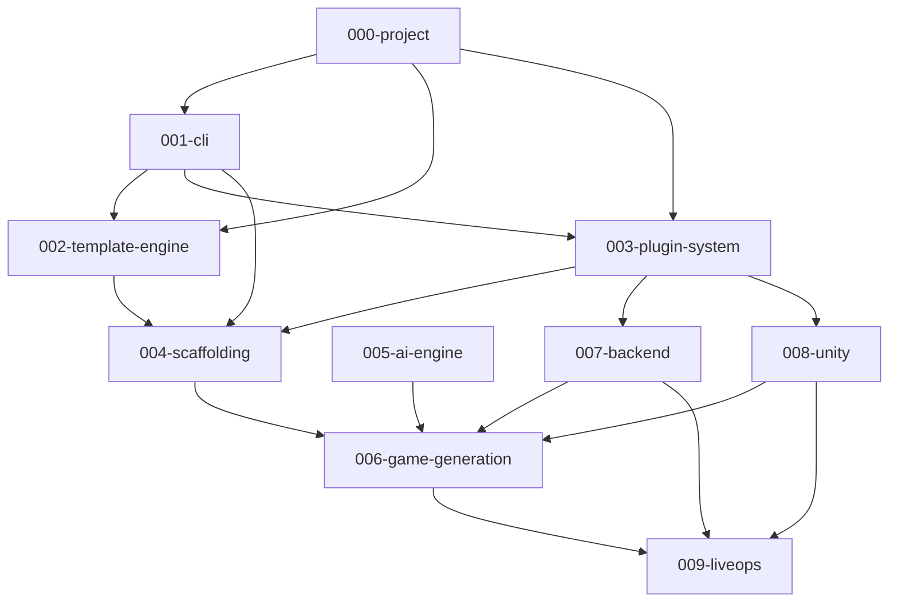

# Specifications

Formal architecture specifications for Project Genesis. These documents define **what** each system must do before implementation begins.

## Purpose

Provide a single, authoritative specification layer that bridges governance documents ([DECISION_LOG.md](../DECISION_LOG.md), [ARCHITECTURE.md](../.cursor/context/ARCHITECTURE.md)) and runtime implementation (`packages/`). Specifications are read by engineers, AI assistants, and reviewers before writing code.

## Scope

### In Scope

- System-level specifications for all major Project Genesis components
- Package mapping, dependency graphs, and phase alignment
- Interface contracts, behavioral requirements, and validation rules
- Implementation sequencing tied to roadmap phases and sprints

### Out of Scope

- Runtime code implementation (see `packages/`)
- Mandatory engineering rules (see `standards/`)
- Evergreen reference material (see `knowledge/`)
- Authoring templates (see `templates/`)

## Goals

| Goal | Success Criteria |
|------|------------------|
| **Complete** | Every major system has a specification before implementation |
| **Consistent** | All specs follow the same structure and reference ADRs |
| **Actionable** | Engineers can implement directly from spec requirements |
| **AI-readable** | AI assistants use specs as primary implementation context |
| **Traceable** | Each spec maps to packages, phases, and downstream consumers |

## Responsibilities

This directory is responsible for:

- Maintaining the specification index and dependency graph
- Defining what each system does, not how code is organized internally
- Mapping specifications to `@genesis/*` packages
- Sequencing implementation across roadmap phases
- Cross-referencing governance documents without duplicating them

Individual specifications own detailed requirements for their respective systems.

## Dependencies

| Document | Relationship |
|----------|-------------|
| [DECISION_LOG.md](../DECISION_LOG.md) | ADR-001 through ADR-008 constrain all specs |
| [ARCHITECTURE.md](../.cursor/context/ARCHITECTURE.md) | Runtime architecture overview |
| [ROADMAP.md](../.cursor/context/ROADMAP.md) | Phase sequencing |
| [standards/](../standards/) | Mandatory rules referenced by specs |
| [DEFINITION_OF_DONE.md](../.cursor/context/DEFINITION_OF_DONE.md) | Completion criteria for implementations |

## Future Implementation

Specifications are written before code. Implementation follows this sequence:

| Phase | Specifications | Milestone |
|-------|---------------|-----------|
| 1 — Foundation | 000, 001, 002, 004, [100-architecture](100-architecture/) | M1 — Genesis CLI Foundation |
| 2 — Plugins | 003, 007, 008 | M2 — Plugin Ecosystem |
| 3 — Game Generation | 006 | M3 — Game Project Generation |
| 4 — AI Engine | 005 | M4 — AI Development Assistant |
| Post-MVP | 009 | Live game operations |

Each specification's README contains detailed implementation steps for its system.

## Specification Index

| ID | Specification | Phase | Package |
|----|---------------|-------|---------|
| [000-project](000-project/) | Project-wide architecture and principles ([developer journey](000-project/DEVELOPER_JOURNEY.md)) | 1 | All |
| [100-architecture](100-architecture/) | Core package architecture ([packages](100-architecture/PACKAGES.md), [kernel](100-architecture/KERNEL.md)) | 1 | All |
| [001-cli](001-cli/) | Genesis CLI ([functional spec](001-cli/FUNCTIONAL_SPEC.md), [UX](001-cli/CLI_USER_EXPERIENCE.md), [commands](001-cli/COMMAND_REFERENCE.md), [config](001-cli/CONFIGURATION.md)) | 1 | `@genesis/cli` |
| [002-template-engine](002-template-engine/) | Template discovery, rendering, validation ([functional spec](002-template-engine/FUNCTIONAL_SPEC.md)) | 1 | `@genesis/template-engine` |
| [003-plugin-system](003-plugin-system/) | Plugin contract and lifecycle ([functional spec](003-plugin-system/FUNCTIONAL_SPEC.md)) | 2 | `@genesis/core` (kernel) |
| [004-scaffolding](004-scaffolding/) | Project and module generation ([functional spec](004-scaffolding/FUNCTIONAL_SPEC.md)) | 1 | `@genesis/scaffolding` |
| [005-ai-engine](005-ai-engine/) | AI context, prompts, and agents ([functional spec](005-ai-engine/FUNCTIONAL_SPEC.md)) | 4 | `@genesis/ai` |
| [006-game-generation](006-game-generation/) | End-to-end game project generation ([functional spec](006-game-generation/FUNCTIONAL_SPEC.md)) | 3 | Multiple |
| [007-backend](007-backend/) | Backend scaffolding and services ([functional spec](007-backend/FUNCTIONAL_SPEC.md)) | 2 | `@genesis/plugin-nestjs` |
| [008-unity](008-unity/) | Unity project integration ([functional spec](008-unity/FUNCTIONAL_SPEC.md)) | 2 | `@genesis/plugin-unity` |
| [009-liveops](009-liveops/) | Live operations systems ([functional spec](009-liveops/FUNCTIONAL_SPEC.md)) | Post-MVP | `framework/liveops` |

## Dependency Graph

## How to Use

1. Read [000-project](000-project/) before any other specification.
2. Read the specification for the system you are implementing.
3. Verify dependencies are satisfied or stubbed with explicit interfaces.
4. Record deviations in [DECISION_LOG.md](../DECISION_LOG.md).

## Related Documents

- [DECISION_LOG.md](../DECISION_LOG.md) — Architectural decisions
- [AI_ARCHITECT.md](../AI_ARCHITECT.md) — AI assistant operating guide
- [.cursor/context/ARCHITECTURE.md](../.cursor/context/ARCHITECTURE.md) — Runtime architecture overview
- [standards/](../standards/) — Mandatory engineering rules

## Changelog

| Version | Date | Change |
|---------|------|--------|
| 1.0.0 | 2026-07-26 | Initial specification architecture |
